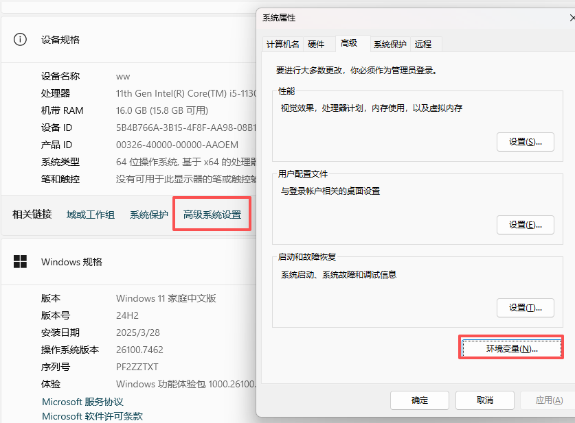
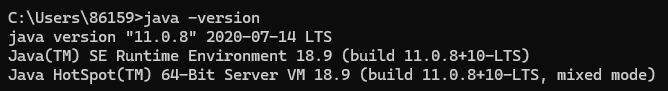
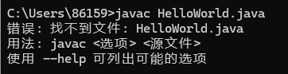
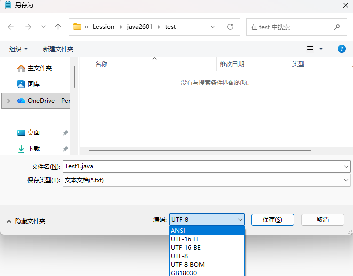
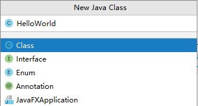
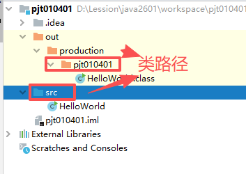
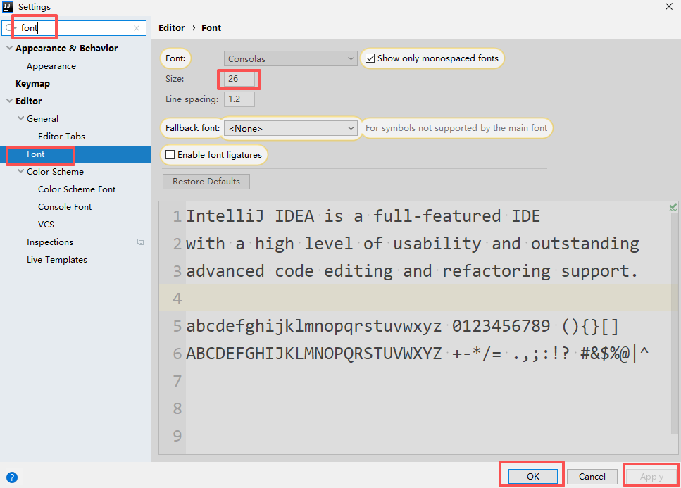
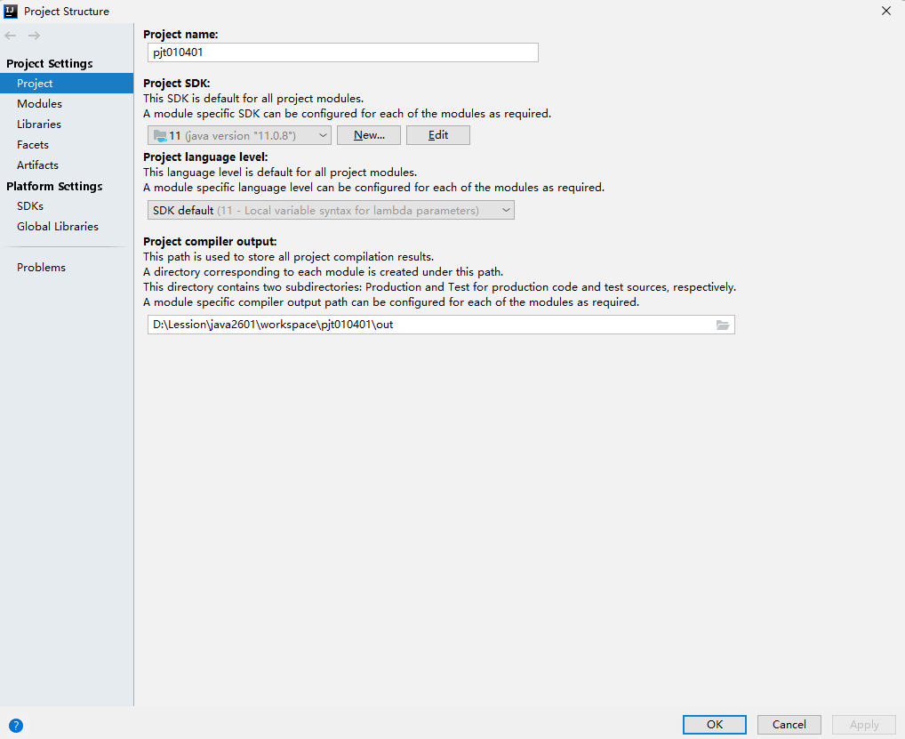

# Java概述

## 配置环境变量

目的： 在使用一些开发工具、框架时，要使用到我们安装的JDK中的bin目录中的javac、java等命令，可以将这些命令的目录配置在系统环境变量中，使用的开发工具就可以直接读取环境变量获取到javac、java命令的位置了。同时在cmd中会自动读取环境变量，因此在cmd中的任何目录都可以使用javac和java命令了。



path中新建、粘贴bin目录、上移到第一个 。确定

重新开启cmd命令窗口



##  编写第一个Java代码

1. 在某个目录中创建 名字是 HelloWorld.java的文件
2. 编写java代码

```
 public class HelloWorld{
    public static void main(String[] args){
        System.out.println("Hello World");
    }
 }
```

3. 打开cmd，编译HelloWorld.java


或者



错误


4. 运行HelloWorld.class


注意： HelloWorld不要加.class ，因为java运行的不是文件，而是HelloWorld这个类

## 代码解释

```java
public class HelloWorld
```

public : 是一个访问范围修饰符，public是公共的，可以在任意地方访问HelloWorld

**特别注意： public修饰的类的名字一定要和文件名相同。**

class ： 定义了一个类 ，后面是类的名字 。目前编写任何的java代码都要写在一个类中。一个源文件中可以定义多个类，但是我们通常不这么做，因为不好维护。

HelloWorld ： 自己起的名字 （标识符）

具有命名规范： 《阿里巴巴开发规范手册 --嵩山版》

1. 类名遵循大驼峰命名 ： 开头字母大写每个词的首字母大写
2. 变量名、方法名等遵循小驼峰命名： 开头字母小写后面每个词的首字母大写

标识符的语法：只能以字母、\$、\_开头 ，后面可以是字母、\$、_ 和 数字 、不能和关键字重名

{} 代表语句块 ，包含语句（;结束的）、语句块、方法

```java
public static void main(String[] args){
```

主方法/main方法 ： 写法是固定的。 作用：如果一个类中含有主方法，这个类就是一个可运行的类。

思考： 每个类都要写主方法吗？

```java
System.out.println("Hello World");
```

向默认设备（控制台）输出内容 ，括号中的内容

"Hello World" 代表一个字符串

没有双引号 ，可以写一个数字、变量

System.out 获得一个标准的输出流 ： 将内存中的数据输出到外部设备（控制台）

println是输出流的一个功能： 输出并换行

print 是输出不换行


注意： 程序中如果有中文，无法编译，需要修改一下字符集：另存为



**双引号标注的一个字符串** 

+号左右两边都是数字，则是运算符

+号左右两边任意一个是字符串，则是连接符，**结果是一个新的字符串**

## 进制

1. 计算机中的进制：十进制(常用) 、二进制、八进制、十六进制。

   八进制在Java中是以0开头的数字

   十六进制在Java中是以0x开头的数字，其中A~F代表的是10~15

2. 通常十进制和二进制、八进制、十六进制的互相转换

   十进制转n进制 ： 十进制数和n相除获得余数，再次相除获得余数，直到除到0为止，余数连接起来就是n进制数

   例如 ： 57 转 二进制 111001

   57转 八进制 071

   n进制转十进制 ：

   例如 ： n进制 ： 100257 转十进制 ： 1*n^5 + 2*n^2 + 5*n^1+ 7

   00011001 转十进制 ：16+8+1

## 内存存储数据的形式

在内存中，数据都是以二进制形式存储的

存储的单位 ： 字节（B） 、千字节(KB)

1字节 = 8bit （位），每一位存储的都是0或1

例如在内存中存储数字 3 存储在1字节中 ： 00000011

内存中存储的数据的形式有： 整数、小数（浮点数）、字符串、图片、音频、视频。

### 整数的存储

字节的第一个bit位为符号位 0代表+ ；1代表-

原码：除了符号位剩余的bit值

反码：原码取反

补码：反码+1

一个表示整数的二进制，如果这个整数是正数，原码就是这个数的值

一个表示整数的二进制，如果这个整数是负数，补码就是这个负数的值

1字节存储的整数范围：-128 ~ 127

2字节存储的整数范围：-2^15 ~ 2^15-1

### 浮点数的存储

字节的第一个bit位为符号位 0代表+ ；1代表-

分为整数及整数次幂和小数及小数次幂

**相同字节数，浮点的数字范围远超与整数** 

**浮点数的存储是不精确的，而整数是精确的**

### 图片、音频、视频

都是以二进制形式存储 ，对二进制进行相应的编码(encoding)和解码(decoding)，编码是把数据编成二进制，解码反过来

### 字符集

字符在进行编码和解码时，使用的是字符集，字符集就是字符和二进制的对应关系

1. ASCII字符集 （255个） ：要记忆的 a对应的是97 ，A对应的是65
2. Unicode字符集： 收录了几乎所有国家的文字
3. UTF-8字符集： 收录了几乎所有国家常用的文字，例如中文简体
4. GBK字符集：收录了中文

**这些字符集前255位都是ASCII**

在编程时，通常都统一使用UTF-8字符集，如果在编码和解码是使用了不同的字符集，就会出现乱码的情况。

## Java中的注释

注释的内容是不进行编译的

单行注释 //注释内容

多行注释 /* 注释内容 */

文档注释 /** 注释内容 **/ 运行javadoc命令就会生成固定格式的文档 （解释描述用的）

# idea

## 新建工程

要创建的java源文件，都要在一个工程中创建，一个工程就是一个项目，工程名和项目名相同

File -- New -- Project

工程目录：

1. .idea文件夹 ：存储了当前工程的一些环境配置 ，不动
2. src文件夹(蓝色) ：源文件夹，创建源文件 ，右键 -- new -- class



src源文件夹又称为是 类路径 ，而真正的类路径是out/production/pjt010401，out也是类的输出路径



File -- settings 设置： idea的全局设置

1. 主题


2. 设置字号



File -- project structure 设置 ：工程的属性设置 （工程用什么JDK、工程的类输出路径）



## 快捷键

1. Alt + Enter  :  解决错误的快捷键
2. Ctrl + E : 切换历史

