# 集合框架

1. 集合的概念： 集合是一个能够存储对象的对象，可以存储任何类型的对象，长度是动态的。集合实质就是封装了数据结构的类
2. 集合框架：集合有很多种类（类）的集合，每种集合类有不同的优缺点。我们在编程时会根据不同的存储需求，选择相应的集合类。这些集合类以及接口组成了一个体系，这个体系就是集合框架

## 集合的结构图

1. 顶层接口Collection接口

   包括了add、addAll、contains、remove、clear、size等方法

2. List接口继承了Collection接口，List接口是一个**列表**，扩展了**索引操作的方法**

   包括了add(int index,Object obj)、indexOf(Object obj)、remove(int index)、get(int index)、

   set(int index,Object obj) 等方法

## ArrayList类概述及源代码编写

ArrayList类封装了一个数组，在ArrayList类中存储的对象都是存储到封装的数组中。

ArrayList的优点是：**遍历元素效率高，也就是按索引查找元素效率高**

ArrayList的缺点：**插入元素和删除元素时效率低**

### 实现简版的ArrayList源代码：MyArrayList类

1. 存储的角度： 可以存储任何对象 ；可以存储任何多个对象；

   MyArrayList类中封装 Object数组 ，在添加对象时，数组要进行扩容

2. 性能角度：Object数组在扩容时应该 扩容足够大的长度，尽量减少扩容次数，还要考虑到内存和性能的衡量

**MyArrayList的属性：**

Object数组 ： data

int : size 代表了存储元素的数量（集合的长度），也是一个索引，永远指向最后一个元素的下一个位置。我们要操作（删除、修改、获取等）集合中的对象时，索引范围应该是0 ~ size-1 。每次进行add时size++ ; 进行remove时size--

**MyArrayList构造器：**

无参构造器： 创建默认长度的Object数组。对于使用者来说，不确定要存储多少个对象

设置容量的构造器：创建指定长度的Object数组。对于使用者来说，大概知道要存储多少个对象

**add方法：**

判断是否扩容 ： 找到扩容的条件、数组的创建(新数组的长度是原数组的1.5倍)、数组的复制、改变data的引用

添加的对象添加到size位置，size++ 

**add指定位置插入元素对象：**判断是否扩容： 将过程封装到一个方法中，调用方法将index~size-1位置的元素向后移动 (数组的复制 System.arraycopy方法)将添加的对象添加到index位置，size++

**所有涉及到索引的方法都要判断 正确的范围，如果不在范围内，抛出索引越界异常**

因此封装一个checkIndex方法，判断索引范围，参数是index和size 

**实现contains和indexOf方法**用参数对象和集合中的每个对象进行equals比较，在比较时，要考虑集合中存储null值 和 参数为null的情况

**实现remove(int index)方法**设置一个Object变量存储index位置的对象，从index+1到size-1 向前复制 ，size-- ， size位置设置为null，返回预存的对象

**实现clear方法**循环数组到size 都设置为null size=0

## LinkedList应用及源代码

LinkedList封装了一个双向链表数据结构。LinkedList实现了List接口，也具有索引操作

双向链表：由节点组成的，每个节点包括了存储的数据、上一个节点的引用对象(地址)、下一个节点对象的引用。双向链表存储了头结点和尾节点。

LinkedList的**优点**是在插入元素和删除元素时效率高，缺点是按索引遍历效率低。

## 实现LinkedList的源代码

**MyLinkedList类的属性：**

size : int 属性 记录存储节点的个数

first：Node属性

last : Node属性

**MyLinkedList类的内部类**

Node类 ： 节点类，属性包括Object：data 、Node：next 下一个节点引用 、Node：prev 上一个节点引用

**MyLinkedList的方法**

封装一个根据索引找节点的方法 getNode(int index)

//验证index是否超出范围 //index和size/2 比较，从前遍历还是从后遍历 //从前向后遍历 //从后向前遍历

```java
public class MyLinkedList {
   private int size;
   private Node first;
private Node last;
//向链表的尾部添加节点
public boolean add(Object obj){
    Node node = new Node(obj);
    //链表中一个节点没有的情况
    if(first==null){
        first = last = node;
    }else {
        //链表中有节点的情况
        node.prev = last;
        //为了不丢失原尾节点的引用，最后设置last的引用
        last.next = node;
        last = node;
    }
    size++;
    return true;
}
public void add(int index,Object obj){
    checkIndex(index,size+1);
    Node newNode = new Node(obj);
    //链表中一个节点没有的情况
    if(first==null){
        first = last = newNode;
    }else{
        if(index==size){
            add(obj);
        }else {
            //找到插入位置的节点
            Node node = getNode(index);
            newNode.prev = node.prev;
            newNode.next = node;
            node.prev.next = newNode;
            node.prev = newNode;
        }
    }
    size++;
}
public void clear(){
    first = last = null;
    size = 0;
}
public boolean contains(Object obj){
    return indexOf(obj)!=-1;
}
public Object get(int index){
    //验证index是否超出范围
    checkIndex(index,size);
    return getNode(index).data;
}
public int indexOf(Object obj){
    if (first == null) return -1;
    Node node = first;
    for (int i = 0; i < size; i++) {
        if(obj==null){
            if(node==null) {
                return i;
            }
        }else{
            if(obj.equals(node.data)){
                return i;
            }
        }
        node = node.next;
    }
    return -1;
}
public Object remove(int index){
    checkIndex(index,size);
    Object o = null;
    //只有一个节点
    if(size==1){
        o = first;
        first = last = null;
    }else if(index == 0){
        //多个节点，删除的是头结点
        o = first;
        first = first.next;
        first.prev.next = null;
        first.prev = null;
    }else if(index == size-1) {
        //多个节点，删除的是尾节点
        o = last;
        last = last.prev;
        last.next.prev = null;
        last.next = null;
    }else {
        //多个节点，删除的不是头和尾节点
        Node node = getNode(index);
        o = node;
        node.prev.next = node.next;
        node.next.prev = node.prev;
        node.prev = null;
        node.next = null;
    }
    size--;
    return o;
}
public boolean remove(Object obj){
    return true;
}
public Object set(int index,Object obj){
    checkIndex(index,size);
    Node node = getNode(index);
    Object o = node.data;
    node.data = obj;
    return o;
}
public int size(){
    return size;
}
//封装一个根据索引找节点的方法
private Node getNode(int index){
    //index和size/2 比较，从前遍历还是从后遍历
    if(index <= size>>1){
        Node node = first;
        //从前向后遍历
        for (int i = 0; i < index; i++) {
            node = node.next;
        }
        return node;
    }else {
        Node node = last;
        //从后向前遍历
        for (int i = size-1; i > index ; i--) {
            node = node.prev;
        }
        return node;
    }
}
private void checkIndex(int index,int size){
    if(index<0 || index >= size){
        throw new IndexOutOfBoundsException();
    }
}
private class Node{
    private Object data;
    private Node prev;
    private Node next;
    public Node(Object data){
        this.data = data;
    }
    public Node(Object data, Node prev, Node next) {
        this.data = data;
        this.prev = prev;
        this.next = next;
    }
}
public static void main(String[] args) {
    MyLinkedList list = new MyLinkedList();
    list.add("a");
    list.add("b");
    list.add("c");
    list.add("d");
    list.add("e");
    list.add(2,"C");
    for (int i = 0; i < list.size; i++) {
        System.out.println(list.get(i));
        }
    }
}
```

## LinkedList应用

Collection接口的子接口Queue接口，是一个队列功能抽象的接口，功能有add、ofier、poll方法，如果要把LinkedList当做队列使用，就可以使用多态的写法：Queue queue = new LinkedList();

Deque是Queue的子接口，扩展了双端队列的功能。当要把LinkedList当做栈结构使用时，使用双端队列的功能时，使用多态的写法：Deque deque = new LinkedList(); ，调用addFirsst()和removeFirst()

**ArrayList、LinkedList、Vector类的区别**

ArrayList封装了数组，索引遍历效率高，线程不安全的

LinkedList封装了双向链表，插入删除元素效率高，线程不安全的

Vector是线程安全的，效率低

**Stack类**

早期的实现了栈数据结构的一个类，但是我们现在都使用LinkedList

## 泛型

1. 概念： 类型参数化。在类中定义泛型，泛型就是一种未知的类型，由使用这个类的程序员指定这个类型
2. 好处：不需要转型

### 定义泛型

1. 可以在类或接口中定义泛型，可以定义多个泛型，通常泛型的名字都是全大写

```java
 public class Test<E,F> {
    public F method(E e){
        return null;
    }
 }
```

```java
 public interface ITest<PK> {
    public void method(PK a);
 }
```

2. 在方法中定义泛型，这个泛型只能在本方法中使用

```java
 public class Test<E,F> {
    public F method(E e){
        return null;
    }
    public <T> T method3(T t){
        return null;
    }
 }
```

### 使用(指定)泛型

如果没有指定具体的泛型，默认的类型就是Object类型

1. 当子类继承了父类或类实现了接口，父类或解控定义了泛型，子类在继承时就要指定泛型

```java
 public class SubTest extends Test<String,Integer> implements ITest<Person> {
    @Override
    public Integer method(String s) {
        return super.method(s);
    }
    @Override
    public void method2(Person a) {
    }
 }
```

2. 在调用方法时，如果方法中定义了泛型

```java
Test<String,String> test = new Test<String,String>();
       Person person = test.method3(new Person());
```

3. 在声明变量及创建对象时，指定类中的泛型

```java
Test<String,String> test = new Test<String,String>();
//集合不能协变
ArrayList<Person> list = new ArrayList<Student>();
//数组可以协变
Person[] persons = new Student[3];
```

### 解决泛型协变的问题

理解 同一个类，不同泛型的对象不是一个类型的

```java
 //传入的集合泛型只能是Person 或 Student
 public static void method(List<Person> list){
 }
```

在使用泛型时的符号：

? 代表任意类型的泛型

? 可以和 extends 组合使用 <? extends 类型> 指定了泛型类型的上限

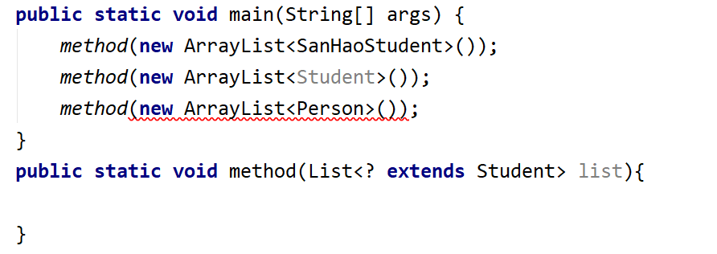

?可以和 super 组合使用 <? super 类型> 指定了泛型类型的下限

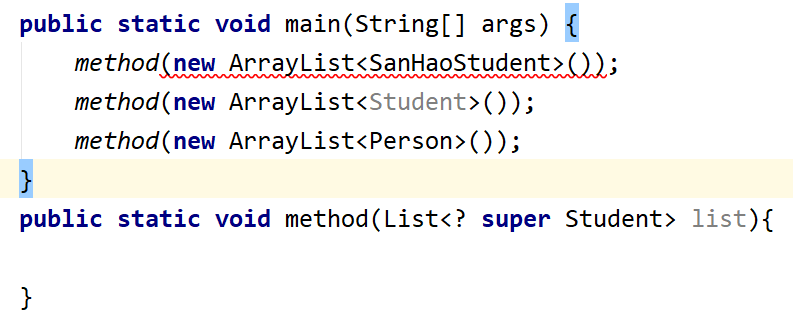

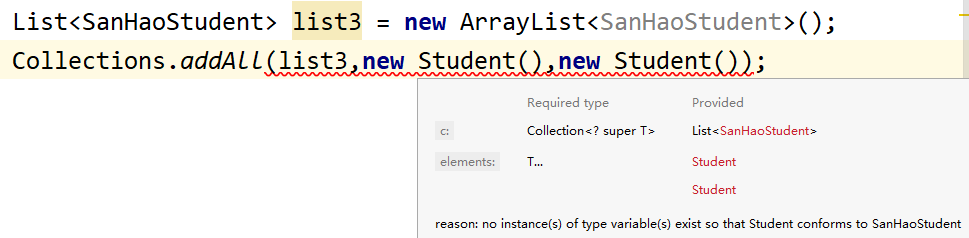

## Collections

**Collections**是集合框架的一个工具类，为集合框架提供了一些功能，也称为集合框架的算法类Collections和Collection的区别： Collection是集合框架的父接口

1. addAll方法：向Collection集合中批量添加元素
2. sort方法：对集合中的元素进行排序，默认使用的是默认的比较规则

在sort时，会把集合中的对象都当做Comparable类型的对象使用，自动调用对象的compareTo方法（描述了对象默认的比较规则）进行比较排序，如果指定了Comparator则自动调用Comparator中的compare方法比较对象

```java
public class Person implements Comparable<Person>{
    String name;
    int age;
    double height;
    int score;
    public Person(String name, int age, double height,int score) {
        this.name = name;
        this.age = age;
        this.height = height;
        this.score = score;
    }
    @Override
    public int compareTo(Person o) {
        //比较的结果是 返回三种值  0 ，大于0，小于0
        //如果两个人的年龄相同，则再按身高比较
        if(this.age==o.age){
            if(this.height>o.height){
                return 1;
            }else{
                return -1;
            }
        }
        return this.age - o.age;
    }
    public static void main(String[] args) {
        List<Person> list = new ArrayList<>();
        Collections.addAll(list,
                new Person("二哥",20,1.75,70),
                new Person("三哥",20,1.72,90),
                new Person("大哥",22,1.71,55));
        //Collections.sort(list);
        //Collections.sort(list,new PersonScoreComparator());
        Collections.sort(list, new Comparator<Person>() {
            @Override
            public int compare(Person o1, Person o2) {
                return o1.score - o2.score;
            }
        });
        for (int i = 0; i < list.size(); i++) {
            System.out.println(list.get(i).name);
        }
        List<String> list2 = new ArrayList<>();
        Collections.addAll(list2,"cac","bcd","abc");
        Collections.sort(list2);
        System.out.println(list2);
    }
}
```

3. binarySearch方法： 二元搜索法
4. replaceAll方法： 替换元素 ，通过equals找到oldValue，替换为newValue
5. shufie方法：随机打乱集合中元素的顺序
6. swap方法：交互集合中指定位置的元素
7. synchronizedList : 将List集合(ArrayList、LinkedList)变成线程安全的集合

**Comparable和Comparator接口**

Comparable接口 ： 一个类实现Comparable接口，重写compareTo方法描述默认的比较规则，一般在sort方法中都将对象当做Comparable对象来使用和比较。

Comparator接口：比较器，自定义一个比较器类实现Comparator接口，重写compare方法表述两个对象的比较规则，通过描述的时自定义的比较规则，**一般在sort方法中，如果指定了比较器，则按比较器的规则比较**

## HashMap集合

### Map接口

存储、查找对象时是通过key - value完成的，key-value称为是映射。Map集合在查找元素时效率最高，时间复杂度达到O(1)

Map中存储的元素是**无序的、不可重复的**

无序：添加顺序和存储顺序是不同的

不可重复：key是不可重复的

### HashMap

是**Map接口**下的一个集合

```java
 public static void main(String[] args) {
    Map<String,Integer> map = new HashMap<>();
    map.put("001",100);
    map.put("002",200);
    map.put("002",300);
    System.out.println(map);
    System.out.println(map.get("001"));
    map.remove("002");
    System.out.println(map);
    System.out.println(map.containsKey("002"));
    System.out.println(map.containsValue(300));
 }
```

## HashMap的源代码

HashMap封装了一个哈希表的数据结构，**哈希表实质是由一个数组+链表组成的**。在存储时要根据key 的哈希码值和 数组的长度进行取余运算 ，计算出存储数组的索引位置，如果出现了**哈希冲突**（不同的key计算的位置相同），存储在后面的链表中。而**链表不能太长**否则就会影响哈希表的效率了

HashMap为了解决上面的问题 ：

在负载达到指定的数量时，对数组进行扩容

如果链表达到了指定的长度时，将链表数据结构转变为红黑树数据结构

## HashMap的源码解析

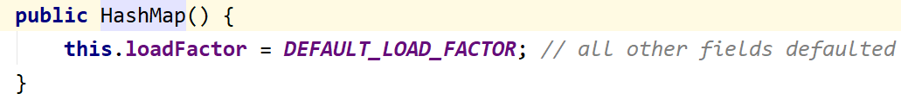

默认的负载指标是0.75 ，他是一个扩容的指标，也就是当存储元素的个数达到了数组长度*0.75时，扩容

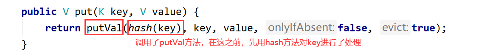

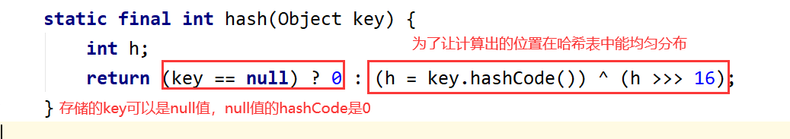

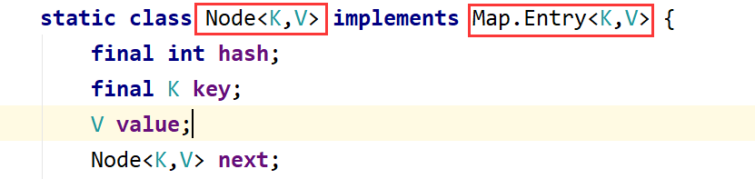

在HashMap中封装了一个Node的内部类，实现了Entry接口，添加的key-value是封装为Node对象进行存储的，如果我们要取出Node对象，可以用Entry类型的引用来表示

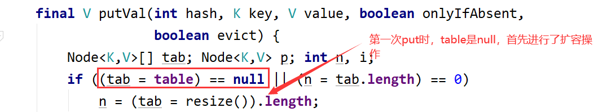

第一次初始容量为16

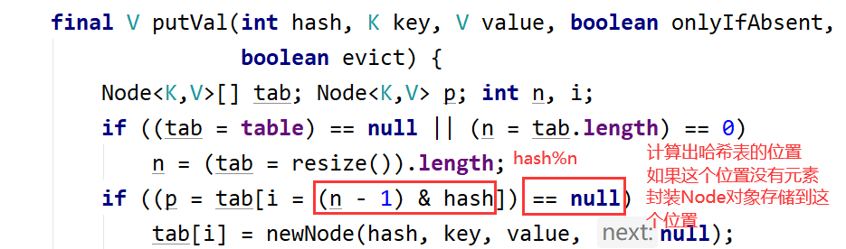

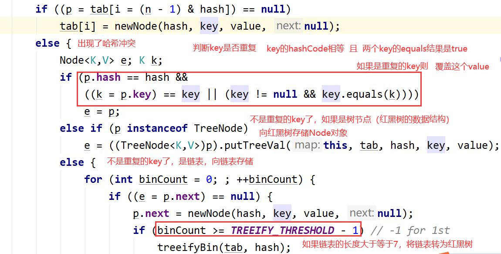

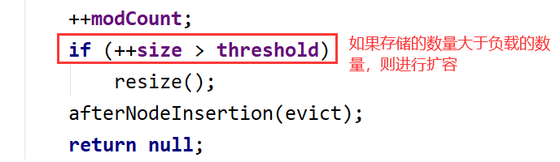

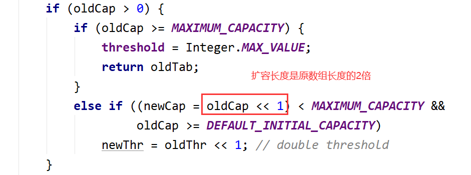

为什么要扩容为数组长度的2倍，因为存储的位置是通过和数组长度取余计算出来的，因此扩容后节点存储的位置会发生改变。只要找到扩容2^n中n，找到key的hashCode值的二进制中的n-1位置的值是1的节点进行位置改变

## HashMap的工作原理

当向hashMap中添加key-value时，如果是第一次添加则创建一个长度为16的数组，先对key的hashCode进行能够使其在哈希表中均匀分布的处理，对key的hashCode和数组长度取余得到存储的位置，如果该位置没有存储Node对象，则创建Node对象封装key-value存储到这个位置，如果该位置有Node对象，先判断这个位置的Node对象的key是否重复，判断依据时key的hashCode是否相等，key的equals比较是否是true，如果重复则替换value；如果不重复，存储到链表的尾部；如果是红黑树则存储到红黑树中；如果链表的长度达到7则将其转为红黑树。如果存储元素的个数达到了负载的个数（数组长度*负载因子值），进行扩容为原数组长度的2倍。

### Map接口的集合

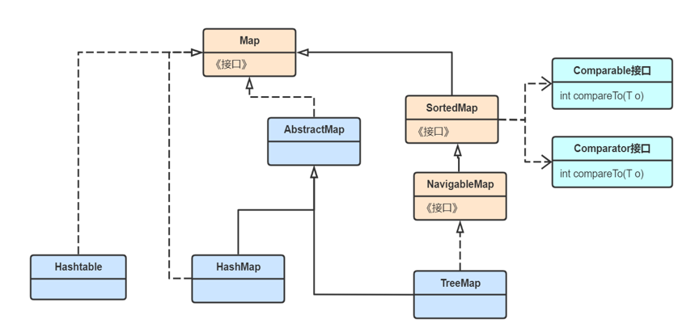

1. Hashtable : 是线程安全的Map集合，目前基本已经弃用，key-value都不能存储null值
2. HashMap：是线程不安全的Map集合，效率高
3. TreeMap：封装了一个红黑树结构的Map集合，**是一个可排序的Map集合**

```java
//按照key的自然顺序(Comparable接口实现的比较规则)
/*TreeMap<Integer,String> map = new TreeMap<>();
map.put(100,"100");
map.put(80,"80");
map.put(120,"123");
System.out.println(map);*/
//自定义的比较顺序
TreeMap<Integer,String> map = new TreeMap<>(new Comparator<Integer>() {
    @Override
    public int compare(Integer o1, Integer o2) {
        return o2-o1;
    }
});
map.put(100,"100");
map.put(80,"80");
map.put(120,"123");
System.out.println(map);
```

4. LinkedHashMap : 是HashMap的子类，是一个有序(存储顺序和添加元素的顺序相同)的Map集合。封装了两种数据结构，分别是哈希表和双向链表。LinkedHashMap在添加key-value效率略低于HashMap

```java
 LinkedHashMap<String,Integer> map = new LinkedHashMap<>();
 map.put("b",10);
 map.put("a",11);
 map.put("c",12);
 System.out.println(map);
```

## Collection接口下的Set接口集合

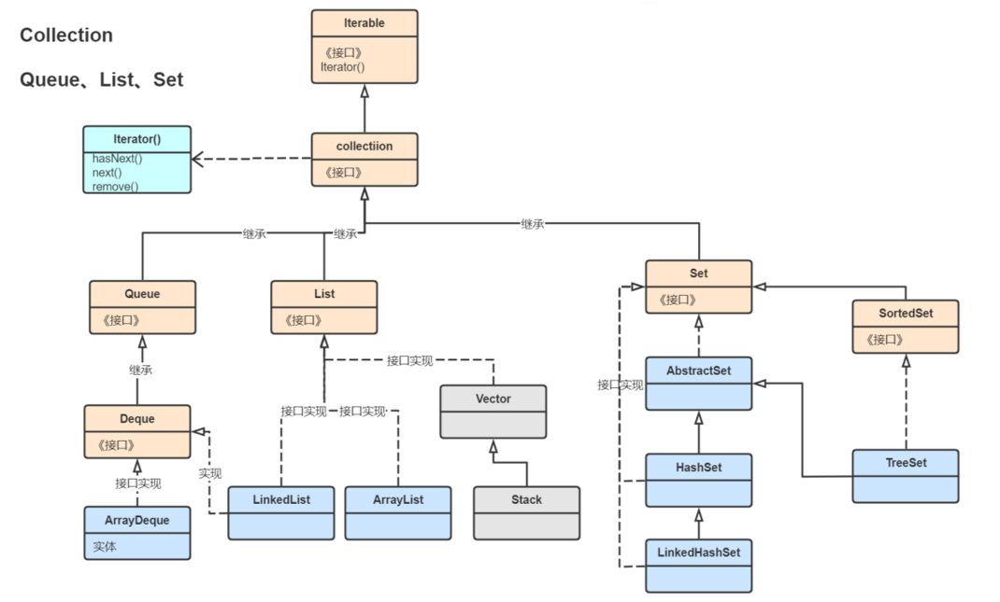

Set接口的特点是无序不可重复的集合。

### HashSet集合

HashSet封装了一个HashMap，向HashSet中存储的元素，都作为Key存储到了其封装的HashMap对象中，Value是同一个Object

```java
 HashSet<String> set =new HashSet<>();
 set.add("a");
 set.add("b");
 set.add("a");
 set.add("c");
 set.remove("b");
 set.add("B");
 System.out.println(set);
```

### LinkedHashSet集合

有序不可重复的set集合

### TreeSet集合

可排序的Set集合

```java
 public static void main(String[] args) {
    /*LinkedHashSet<String> set =new LinkedHashSet<>();
    set.add("a");
    set.add("b");
    set.add("a");
    set.add("c");
    set.remove("b");
    set.add("B");
    System.out.println(set);*/
    TreeSet set = new TreeSet(new Comparator<String>(){
        @Override
        public int compare(String o1, String o2) {
            return o1.length()-o2.length();
        }
    });
    set.add("baaaa");
    set.add("a");
    set.add("ccc");
    System.out.println(set);
 }
```

## 迭代器(Iterator)

迭代器的特点：

1. 单向：只能单向的迭代集合中的元素，如果要重新迭代某个元素，就得创建一个新的迭代器。
2. 迭代时不能改变集合中的元素，改变集合的元素包括新增、删除、修改，否则会出现异常

**迭代器能够迭代Collection接口下的所有集合**

1. Iterable接口： 可迭代接口，具有Iterator()方法获得迭代器对象返回Iterator类型的对象
2. Iterator接口：迭代器接口，由于每个集合的结构不同，迭代的过程也不同，都有自己的迭代器类，为了统一迭代的规范，设计了Iterator接口。

Iterator接口的规范方法： 迭代器初始化时，迭代指针指向第一个元素的前一个位置

  1. hasNext() :  迭代指针下一个位置是否有元素。
  2. next() : 迭代指针向下移动一位，返回指向的元素。确定每调用一次next时，一定要判断hasNext是否为true

### 迭代器示例

1. 迭代ArrayList：

```java
List<String> list = new ArrayList<>();
       Collections.addAll(list,"a","b","c");
       //获得ArrayList对象的迭代器
       Iterator<String> iterator = list.iterator();
       while(iterator.hasNext()) {
           String str = iterator.next();
           if("c".equals(str)){
               list.remove("c"); //报异常
           }
           System.out.println(str);
       }
```

2. 迭代HashSet:

```java
 HashSet<String> set = new HashSet<>();
 Collections.addAll(set,"a","b","c");
 Iterator<String> iterator = set.iterator();
 while(iterator.hasNext()) {
    String str = iterator.next();
    System.out.println(str);
 }
```

3. 迭代HashMap ： **不能用迭代器直接迭代HashMap**

   1.将HashMap中所有的节点对象存储到一个Set中，用迭代器迭代HashSet 。**hashMap.entrySet()**

```java
 HashMap<String,String> map = new HashMap<>();
 map.put("101","a");
 map.put("102","b");
 map.put("103","c");
 Set<Map.Entry<String,String>> set = map.entrySet();
 Iterator<Map.Entry<String,String>> iterator = set.iterator();
 while(iterator.hasNext()){
    Map.Entry entry = iterator.next();
    System.out.println(entry.getKey()+","+entry.getValue());
 }
```

  2. 将HashSet中所有的key存储到一个Set中，用迭代器迭代Set 。 **hashMap.keySet()**

```java
 HashMap<String,String> map = new HashMap<>();
 map.put("101","a");
 map.put("102","b");
 map.put("103","c");
 Set<String> set = map.keySet();
 Iterator<String> iterator = set.iterator();
 while(iterator.hasNext()){
    String key = iterator.next();
    System.out.println(key+","+map.get(key));
 }
```

## 增强型for循环

是JDK5版本出现的一种for循环写法 ，在编译时系统会自动把其编译为迭代器写法。

**增强型for循环是基于迭代器的**

语法：

for(类型 变量名: 集合或数组){

}

**在增强型for循环中不能修改集合的元素，可以使用fori解决**

示例：

```java
 List<String> list = new ArrayList<>();
 Collections.addAll(list,"a","b","c");
 for (String str:list){
    list.remove("a");
    System.out.println(str);
 }
```

```java
HashSet<String> set = new HashSet<>();
Collections.addAll(set,"a","b","c");
for (String str:set){
    System.out.println(str);
}
 HashMap<String,String> map = new HashMap<>();
 map.put("101","a");
 map.put("102","b");
 map.put("103","c");
 Set<Map.Entry<String,String>> set = map.entrySet();
 for(Map.Entry<String,String> entry:set){
    System.out.println(entry.getKey()+","+entry.getValue());
 }
HashMap<String,String> map = new HashMap<>();
map.put("101","a");
map.put("102","b");
map.put("103","c");
Set<String> set = map.keySet();
for (String key :set) {
    System.out.println(key);
}
```

迭代数组

```java
 /*String[] strs = new String[]{"a","b","c"};
 for(String str:strs){
    System.out.println(str);
 }*/
 String[][] arr = new String[][]{{"a","b"},{"c","d"}};
 for(String[] strs:arr){
    for(String str:strs){
        System.out.println(str);
    }
 }
```
