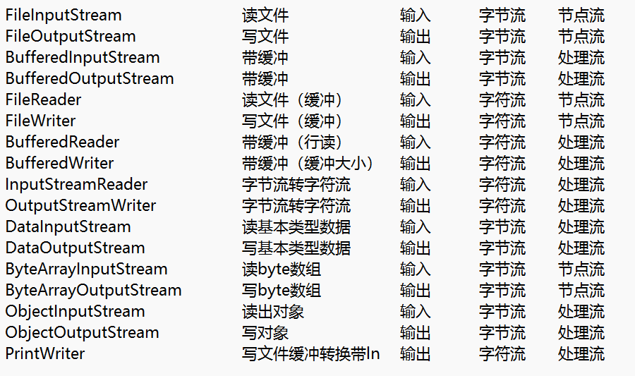

# IO流

## File类

文件和文件目录(文件夹)的抽象表示，File对象代表了系统中的某个文件或文件夹，对File对象的操作就是对文件或文件夹的操作了。

1. **File类**的构造器

File(String path)

File(File parent,String name)

File(String parent,String name)

2. **File类**的方法

createNewFile() : 创建一个文件

```java
  //d:/lession/java2601中创建一个a.txt的文件
 //File file = new File("d:\\lession\\java2601\\a.txt");
 //File file = new File("d:/lession/java2601","a.txt");
 //File file1 = new File("d:/lession/java2601");
 //File file = new File(file1,"a.txt");
 File file = new File("d:/lession/java2601/test/a.txt");
 try {
    file.createNewFile();
 } catch (IOException e) {
    e.printStackTrace();
 }
```

如果文件存在则不会再次创建，**文件和文件夹在同一个目录中不能重名**

文件的后缀的作用：识别这个文件默认用什么软件运行，不影响文件的内容。

mkdir() : 创建文件夹

```java
File file = new File("d:/lession/java2601/test/a");
 file.mkdir();
```

mkdirs() : 创建多级文件夹

```java
File file = new File("d:/lession/java2601/test/a/b/c");
file.mkdirs();
```

createTempFile： 创建临时文件

```java
 File file = new File("d:/lession/java2601/test");
 try {
    File.createTempFile("1111","0000",file);
 } catch (IOException e) {
    e.printStackTrace();
 }
```

isFile() : 是否是文件

isDirectory() :是否是文件夹

delete() : 删除文件或文件夹 。**如果删除的是文件夹，只能删除空文件夹**

equals() : 比较两个文件是否相等 ，重写了Object的equals方法比较的是两个File对象的路径是否相等。

getParentFile() : 获得父文件夹的File对象

getPath() : 获得路径

length() : 获得文件或文件夹的大小(byte数) ，返回结果是long

listFiles() : 获得文件夹中所有的File对象(包括文件和文件夹) ，获得的只是子文件及文件夹。返回File[]数组

```java
 File file = new File("d:/lession/java2601");
 File[] files = file.listFiles();
 for(File f:files){
    System.out.println(f);
 }
```

### 递归算法

在方法中调用当前（本身）的方法

```java
 public class Test {
    public static void main(String[] args) {
        System.out.println(jiecheng(4));
        //第5个数是什么
        System.out.println(feibo(6));
        //汉诺塔递归
    }
    public static int jiecheng(int i){
        if(i==1) return 1;
        return jiecheng(i-1)*i;
    }
    public static int feibo(int i){
        if(i==2 || i == 1){
            return 1;
        }
        return feibo(i-2)+feibo(i-1);
    }
 }
```

文件查找的递归：

找出d:/lession/java2601中所有的后缀是.pdf的文件，输出文件路径

找出d:/lession/java2601中所有的后缀是.pdf的文件，存储到集合中

删除d:/lession/java2601/test/a文件夹

```java
 public class TestFile {
    public static void main(String[] args) {
 /*        File file = new File("d:/lession/java2601");
        //queryFile(file);
        List<File> list = new ArrayList<>();
        queryFileToList(file,list);
        for(File file1:list){
            System.out.println(file1);
        }*/
        File file = new File("D:\\Lession\\java2601\\test\\a");
        deleteDir(file);
    }
    //输出所有的pdf文件
    public static void queryFile(File file){
        File[] files = file.listFiles();
        for(File f:files){
            if(f.isFile()){
                String name = f.getName();
                int index = name.lastIndexOf(".");
                if(index!=-1){
                    String hzm = name.substring(index);
                    if(".pdf".equals(hzm)){
                        System.out.println(f);
                    }
                }
            }else{
                queryFile(f);
            }
        }
    }
    //pdf文件存储到ArrayList中
    public static void queryFileToList(File file,List<File> list){
        File[] files = file.listFiles();
        for(File f:files){
            if(f.isFile()){
                String name = f.getName();
                int index = name.lastIndexOf(".");
                if(index!=-1){
                    String hzm = name.substring(index);
                    if(".pdf".equals(hzm)){
                        list.add(f);
                    }
                }
            }else{
                queryFileToList(f,list);
            }
        }
    }
    public static void deleteDir(File file){
        File[] files = file.listFiles();
        for (File f:files){
            if(f.isDirectory()){
                deleteDir(f);
            }
            f.delete();
        }
    }
}
```

## IO流概念

输出、输出的数据流，也就是IO流代表了，从内存输出的数据（写数据）和输入内存的数据（读数据），数据都是有序的二进制数据。

Java中提供了一些处理IO流的工具类，称为IO流类，能够实现数据的读写。

### IO流类的分类

根据需求选择不同分类的IO流的类

1. 从方向分为 输入流和输出流 ，输入流负责读数据，输入流具有read方法；输出流负责写数据，输出流具有write方法。InputStream和Reader的子类都是输入流；OutputStream和Writer的子类都是输出流。
2. 从处理数据的能力分为 ：字节字符流，每read/write一次处理一个字节，就是字节流，字符流同理。一般在处理文字并显示文字时，要使用字符流。InputStream和OutputStream的子类都是字节流 ；Reader和Writer的子类都是字符流。
3. 从装饰的角度分为：节点流(基础流)和处理流(高级流) 。节点流能处理所有的功能但是效率低；处理流只能处理特定的功能但是效率高。

装饰模式：将一些功能组合在一起，例如有杯子、杯垫、杯盖、贴纸等东西，现在我想美观的喝水，将杯子和贴纸装饰在一起；我想保温、美观的喝水，将杯子、杯盖、贴纸装饰在一起。

引申到IO流类中 ： 文件读写的IO流(节点流) 、带缓冲的IO流(处理流)、读写对象的IO流（处理流）等，我想快速的将对象写到文件中，我们就可以对三个IO流类进行装饰 。

IO流的使用思路：

1. 分析需求，选择符合需求功能的IO流
2. IO流装饰在一起
3. IO流的方法几乎都是 read 或 write

### FileInputStream/FileOutputStream

读写文件的IO流类

FileInputStream的read方法有三个：

1. read()  :  读取1个字节，返回字节的字符编码值，如果没有读到数据（读到末尾了）返回-1
2. read(byte[] bytes) : 读取byte[]长度字节，读到byte[]中，返回读取个数
3. read(byte[] bytes, int index, int length) : 读取指定长度的数据，读到byte[]指定的index位置

示例：读取d:/lession/java2601/test/a.txt文件中的内容

```java
public static void main(String[] args) {
        //File file = new File("d:/lession/java2601/test/a.txt");
        try {
            //FileInputStream fis = new FileInputStream(file);
            FileInputStream fis = new FileInputStream("d:/lession/java2601/test/a.txt");
            //读一个字节
            int i = fis.read();
            System.out.println(i);
            //一次读3个字节
            byte[] bytes = new byte[3];
            fis.read(bytes);
            for (int j = 0; j < bytes.length; j++) {
                System.out.println(bytes[j]);
            }
            bytes = new byte[1000];
            //虽然byte是1000长度，读的时候读了1个读到byte[]的0位置上
            fis.read(bytes,0,1);
            System.out.println(fis.read());
        } catch (FileNotFoundException e) {
            e.printStackTrace();
        } catch (IOException e) {
            e.printStackTrace();
        }
    }
```

读取所有的内容：

```java
 //File file = new File("d:/lession/java2601/test/a.txt");
        try {
            //FileInputStream fis = new FileInputStream(file);
            FileInputStream fis = new FileInputStream("d:/lession/java2601/test/a.txt");
            //一个一个读的循环
 /*            int temp = 0;
            while((temp = fis.read())!=-1){
                System.out.println(temp);
            }*/
            //一批一批读的循环  批量读取效率高
            //byte[] 就是一个 自定义的缓冲区
            //System.out.println(fis.available());
            byte[] bytes = new byte[2];
            int temp = 0;
            while((temp=fis.read(bytes))!=-1){
                for (int i = 0; i < temp; i++) {
                    System.out.println(bytes[i]);
                }
            }
        } catch (FileNotFoundException e) {
    e.printStackTrace();
} catch (IOException e) {
    e.printStackTrace();
}
```

IO流得关闭，使用try-with-resource 语法糖写法：

```java
try(
        FileInputStream fis= new FileInputStream("d:/lession/java2601/test/a.txt")
    ) {
        byte[] bytes = new byte[2];
        int temp = 0;
        while((temp=fis.read(bytes))!=-1){
            for (int i = 0; i < temp; i++) {
                System.out.println(bytes[i]);
            }
        }
    } catch (FileNotFoundException e) {
        e.printStackTrace();
    } catch (IOException e) {
        e.printStackTrace();
    }
```

FileOutputStream : 向文件中写内容

构造器中有两个参数的构造器，其中一个参数 boolean append代表是否追加内容，默认是false不追加(覆盖)

```java
 public class TestFileInputStream {
    public static void main(String[] args) {
        //向a.txt中写入一段内容 ：  ABCDEFG
        try(
            FileOutputStream fos = new FileOutputStream("d:/lession/java2601/test/a.txt",true);
        ) {
            //fos.write('A');
            fos.write("ABCDEFG".getBytes());
        } catch (FileNotFoundException e) {
            e.printStackTrace();
        } catch (IOException e) {
            e.printStackTrace();
        }
    }
 }
```

复制文件的示例：封装一个方法

### BufieredInputStream和BufieredOutputStream

处理流，构造对象时需要传入InputStream、OutputStream

自带缓冲区的IO流

写内容的最后，需要fiush ，冲刷缓冲区

```java
public class TestFileInputStream {
    public static void main(String[] args) {
        copy2("d:/1022-01.mp4","d:/lession/java2601/test/test.mp4");
    }
    public static void copy(String srcPath,String destPath){
        try(
            FileInputStream fis = new FileInputStream(srcPath);
            FileOutputStream fos = new FileOutputStream(destPath);
        ) {
            int temp = 0;
            while((temp=fis.read())!=-1){
                fos.write(temp);
            }
        } catch (FileNotFoundException e) {
            e.printStackTrace();
        } catch (IOException e) {
            e.printStackTrace();
        }
    }
    public static void copy2(String srcPath,String destPath){
        try(
                FileInputStream fis = new FileInputStream(srcPath);
                FileOutputStream fos = new FileOutputStream(destPath);
        ) {
            int temp = 0;
            byte[] bytes = new byte[1024];
            while((temp=fis.read(bytes))!=-1){
                fos.write(bytes,0,temp);
            }
        } catch (FileNotFoundException e) {
            e.printStackTrace();
        } catch (IOException e) {
            e.printStackTrace();
        }
    }
    public static void copy3(String srcPath,String destPath){
        try(
                FileInputStream fis = new FileInputStream(srcPath);
                FileOutputStream fos = new FileOutputStream(destPath);
                BufieredInputStream bis = new BufieredInputStream(fis);
                BufieredOutputStream bos = new BufieredOutputStream(fos);
        ) {
            int temp = 0;
            while((temp=bis.read())!=-1){
                bos.write(temp);
            }
            //冲刷缓冲区的数据到设备上
            bos.fiush();
        } catch (FileNotFoundException e) {
            e.printStackTrace();
        } catch (IOException e) {
            e.printStackTrace();
        }
    }
}
```

### FileReader/FileWriter

文件读写的字符流，天然是一个缓冲流，在write后需要fiush操作

```java
/*try {
     FileReader fr = new FileReader("d:/lession/java2601/test/a.txt");
     *//*int temp = 0;
     while((temp=fr.read())!=-1){
         System.out.println((char)temp);
     }*//*
     int temp = 0;
     char[] chars = new char[4];
     while((temp=fr.read(chars))!=-1){
         System.out.println(new String(chars,0,temp));
     }
 } catch (FileNotFoundException e) {
     e.printStackTrace();
 } catch (IOException e) {
     e.printStackTrace();
 }*/
 try {
     FileWriter fw = new FileWriter("d:/lession/java2601/test/a.txt");
     fw.write("1234567890");
     fw.fiush();
 } catch (IOException e) {
     e.printStackTrace();
 }
```

### BufieredReader/BufieredWriter

BufieredReader具有readLine方法 ： 成行读

BufieredReader/BufieredWriter 能设置缓冲区大小

```java
public static void main(String[] args) {
       try {
           FileReader fr = new FileReader("d:/lession/java2601/test/a.txt");
           BufieredReader br = new BufieredReader(fr);
           String temp = null;
           while((temp=br.readLine())!=null){
                System.out.println(temp);
            }
        } catch (FileNotFoundException e) {
            e.printStackTrace();
        } catch (IOException e) {
            e.printStackTrace();
        }
/*        try {
            FileWriter fw = new FileWriter("d:/lession/java2601/test/a.txt");
            BufieredWriter bw = new BufieredWriter(fw,1024<<2);
            bw.write("1234567890");
            bw.fiush();
        } catch (IOException e) {
            e.printStackTrace();
        }*/
    }
```

### InputStreamReader/OutputStreamWriter

是Reader和Writer的子类 ，字符流 ；功能是将字节流转为字符流 ，在构造InputStreamReader对象时需要传入一个InputStream（字节流）

```java
try(
    FileInputStream fis = new FileInputStream("d:/lession/java2601/test/a.txt");
    InputStreamReader reader = new InputStreamReader(fis);
    BufieredReader br = new BufieredReader(reader);
   ) {
    String temp = null;
    while((temp = br.readLine())!=null){
        System.out.println(temp);
    }
} catch (FileNotFoundException e) {
    e.printStackTrace();
} catch (IOException e) {
    e.printStackTrace();
}
```

### DataInputStream / DataOutputStream

读写基本类型的数据 例如 要把1024(int值)写入到文件中 ，如果用String存储1024四个字符 ；如果用DateOutputStream存储 是 1024的二进制四字节数据

```java
public static void main(String[] args) {
   try(
       FileOutputStream fos = new FileOutputStream("d:/lession/java2601/test/a.txt");
       DataOutputStream dos = new DataOutputStream(fos);
        ) {
        dos.writeDouble(100.0);
    } catch (FileNotFoundException e) {
        e.printStackTrace();
    } catch (IOException e) {
        e.printStackTrace();
    }
    try(
        FileInputStream fis= new FileInputStream("d:/lession/java2601/test/a.txt");
        DataInputStream dis = new DataInputStream(fis);
        ) {
        double d = dis.readDouble();
        System.out.println(d);
    } catch (FileNotFoundException e) {
        e.printStackTrace();
    } catch (IOException e) {
        e.printStackTrace();
    }
}
```

## 序列化和反序列化

将对象变成byte[]数组过程叫序列化 ；byte[]数组变回对象叫反序列化 ；当要传输对象时，向网络传输、向文件传输。

一个类的对象要实现序列化和反序列化，这个类一定要实现**Serializable接口**

序列化和反序列化的封装实现：

```java
public class SerUtil {
   public static void main(String[] args) {
       Person person = new Person("tom",20,"13312345678");
       byte[] bytes = serialize(person);
       Person p2 = (Person)unSerialize(bytes);
       System.out.println(p2);
   }
   //序列化
   public static byte[] serialize(Object obj){
       try(
           ByteArrayOutputStream baos = new ByteArrayOutputStream();
           ObjectOutputStream oos = new ObjectOutputStream(baos);
       ) {
           oos.writeObject(obj);
           return baos.toByteArray();
        } catch (IOException e) {
            e.printStackTrace();
        }
        return null;
    }
    //反序列化
    public static Object unSerialize(byte[] bytes){
        try(
            ByteArrayInputStream bais = new ByteArrayInputStream(bytes);
            ObjectInputStream ois = new ObjectInputStream(bais);
                ) {
            return ois.readObject();
        } catch (IOException e) {
            e.printStackTrace();
        } catch (ClassNotFoundException e) {
            e.printStackTrace();
        }
        return null;
    }
}
```

**注意：序列化和反序列化的JDK版本要一致**

### PrintWriter

写文件、封装字节或字符流、缓冲、带ln的写

```java
 public static void main(String[] args) {
    try(
    PrintWriter pw = new PrintWriter("d:/lession/java2601/test/a.txt");
    ){
        pw.println("你好啊");
        pw.println("中午吃什么");
        pw.fiush();
    } catch (FileNotFoundException e) {
        e.printStackTrace();
    }
 }
```

## Properties类

用来读取properties配置文件的类。

配置文件：可以将一些数据写到配置文件中，程序在运行时读取到配置文件中的数据，这些数据是用户可以改变的数据，不能固化在程序中的数据。

Java的配置文件的种类：

1. xml配置文件   ：具有结构化，编写比较困难，解析也比较麻烦
2. properties配置文件 :  编写简单 ，name=值 的写法，结构化非常弱
3. yaml / yml 配置文件： springboot再使用，待续

需求： 将properties配置文件中的数据 赋给两个Person对象的属性

1. 创建Properties对象
2. 将 配置文件加载到 Properties对象中 : load方法

Properties对象中封装了一个Map

3. 调用Properties对象的get方法

```java
public static void main(String[] args) {
        Person p1 = new Person();
        Person p2 = new Person();
        Properties properties = new Properties();
        try(
            FileInputStream fis = new
FileInputStream("D:\\Lession\\java2601\\workspace\\pjt0128\\src\\myinfo.properties");
        ) {
            properties.load(fis);
            p1.name = (String)properties.get("p1.name");
            p1.age = Integer.parseInt((String)properties.get("p1.age"));
            p2.name = (String)properties.get("p2.name");
            p2.age = Integer.parseInt((String)properties.get("p2.age"));
            System.out.println(p1);
            System.out.println(p2);
        } catch (FileNotFoundException e) {
            e.printStackTrace();
        } catch (IOException e) {
            e.printStackTrace();
        }
        //写
        properties.setProperty("p3.name","tom");
        properties.setProperty("p3.age","22");
        try {
            properties.store(new
FileOutputStream("D:\\Lession\\java2601\\workspace\\pjt0128\\src\\myinfo.properties")
                ,"这是第三个人的信息");
        } catch (FileNotFoundException e) {
            e.printStackTrace();
        } catch (IOException e) {
            e.printStackTrace();
        }
    }
```



## POI

是apache软件基金会中的一个子项目功能，实现excel、word等文档内容的读写

POI实现一个简单的Excel读写功能

需求：读取学生成绩.xls的sheet1中的数据，计算学生的平均成绩，写入sheet2中
