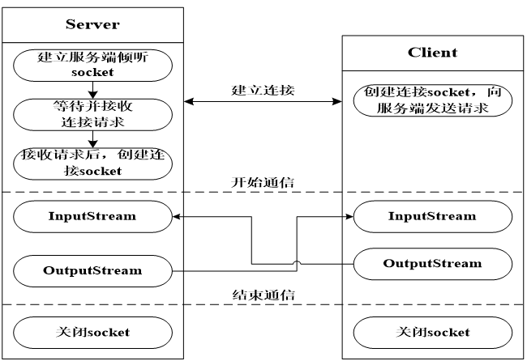
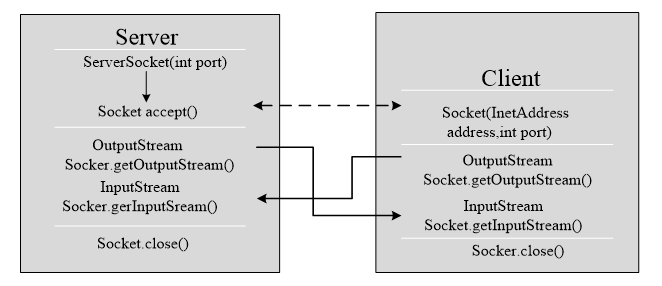

# 网络编程

## TCP和UDP协议

1. TCP协议：**面向连接的、可靠的协议**。类似于生活中的打电话。网络状况不好的时候，使用TCP
2. UDP协议：**面向数据报的、不可靠的协议**。类似于发短信。效率比TCP高。网络状况非常好的时候，使用UDP

一般项目中采用两种协议的组合方式，重要的数据使用TCP传输，不重要的使用UDP传输。

## TCP编程

1. InetAddress类

封装了IP地址或域名的一个类

localhost : 代表本机的域名，也就是，程序要连接本机，可以使用localhost

127. 0.0.1 ： 代表本机的IP地址。
2. TCP编程模型

采用客户端-服务器 编程模型 ，要编写客户端的TCP程序和服务器端的TCP程序





3. 实现Socket编程

```java
public class TestServer {
    public static void main(String[] args) {
        //建立一个Socket服务，需要端口号
        try(ServerSocket serverSocket = new ServerSocket(7000);) {
            //启动Socket服务，监听客户短发来的连接，连接成功后，解除阻塞
            Socket socket = serverSocket.accept();
            System.out.println("有客户端连接了这台服务器");
            //收数据
            BufferedReader br = new BufferedReader(new InputStreamReader(socket.getInputStream()));
            System.out.println(br.readLine());
            //传数据
            PrintWriter pw = new PrintWriter(socket.getOutputStream(),true);
            pw.println("1+1结果是2");
        } catch (IOException e) {
            e.printStackTrace();
        }
    }
}
```

```java
public class TestClient {
   public static void main(String[] args) {
       //连接服务器 ip是127.0.0.1 或 使用localhost的域名
       // 端口号 ： 7000
       //Socket socket = new Socket(InetAddress.getByName("localhost"),7000);
       try(Socket socket = new Socket("localhost",7000);) {
       //传数据
           PrintWriter pw = new PrintWriter(socket.getOutputStream(),true);
           pw.println("我是客户端，1+1=?");
           //pw.ffush();
       //收数据
           BufferedReader br = new BufferedReader(new InputStreamReader(socket.getInputStream()));
           System.out.println(br.readLine());
       } catch (IOException e) {
            e.printStackTrace();
        }
    }
}
```

开发一个双向聊天案例

两端既是客户端又是服务器端，客户端(发起方)向服务器端建立连接

## UDP协议

1. DatagramSocket : 用来发送和接收数据报的，类似邮局（快递点）
2. DatagramPacket：数据报，封装了发送的地址、端口号、数据 ； 在接收时，接收到一个准备好的数据报，在数据报中封装一个byte[]数组，接收的数据写到byte[]中

```java
public class ATestUDP {
    public static void main(String[] args) {
        //A 发给 B
        try {
            DatagramSocket datagramSocket = new DatagramSocket(7004);
            byte[] bytes = "hello".getBytes();
            DatagramPacket datagramPacket = new DatagramPacket(bytes,0,bytes.length,
                    InetAddress.getByName("localhost"),7003);
            datagramSocket.send(datagramPacket);
            //收消息
            bytes = new byte[1024];
            datagramPacket = new DatagramPacket(bytes,0,bytes.length);
            datagramSocket.receive(datagramPacket);
            System.out.println(new String(bytes,0,datagramPacket.getLength()));
        } catch (SocketException e) {
            e.printStackTrace();
        } catch (UnknownHostException e) {
            e.printStackTrace();
        } catch (IOException e) {
            e.printStackTrace();
        }
    }
}
```

```java
public class BTestUDP {
   public static void main(String[] args) {
       try {
           DatagramSocket datagramSocket = new DatagramSocket(7003);
           byte[] bytes = new byte[1024];
           DatagramPacket datagramPacket = new DatagramPacket(bytes,0,bytes.length);
           //阻塞
           datagramSocket.receive(datagramPacket);
            System.out.println(new String(bytes,0,datagramPacket.getLength()));
            //回发：
            bytes = "我收到了".getBytes();
            datagramPacket = new DatagramPacket(bytes,0,bytes.length,
                    InetAddress.getByName("localhost"),7004);
            datagramSocket.send(datagramPacket);
        } catch (SocketException e) {
            e.printStackTrace();
        } catch (IOException e) {
            e.printStackTrace();
        }
    }
}
```

## URL

统一资源定位符，互联网上的每一个资源（文件、程序）都具有一个唯一的地址，这个地址就是URL

URL的格式： **协议://ip地址:端口号/文件目录?参数** ，其中参数的格式是 名字=值，多个参数用&隔开

## URL编程

通过java程序访问URL地址

```java
 public class TestURL {
    public static void main(String[] args) {
        try {
            URL url = new URL("https://www.baidu.com/");
            URLConnection conn = url.openConnection();
            conn.connect();
            InputStream inputStream = conn.getInputStream();
            BufferedReader br = new BufferedReader(new InputStreamReader(inputStream));
            String temp = null;
            while((temp=br.readLine())!=null){
                System.out.println(temp);
            }
        } catch (MalformedURLException e) {
            e.printStackTrace();
        } catch (IOException e) {
            e.printStackTrace();
        }
    }
 }
```

下载网络上的文件 ：

```java
public class URLDownload {
   public static void main(String[] args) {
        try {
            URL url = new
URL("https://copyright.bdstatic.com/vcg/creative/65e11b3d96ac8f9b293b2d3486b7c422.jpg@wm_1,k_cGljX2JqaHdh
dGVyLmpwZw==");
            URLConnection conn = url.openConnection();
            conn.connect();
            InputStream inputStream = conn.getInputStream();
            BufferedInputStream bis = new BufferedInputStream(inputStream);
            FileOutputStream fos = new FileOutputStream("d:/lession/java2601/test/a.jpg");
            BufferedOutputStream bos = new BufferedOutputStream(fos);
            int temp = 0;
            while((temp=bis.read())!=-1){
                bos.write(temp);
            }
            bos.ffush();
        } catch (MalformedURLException e) {
            e.printStackTrace();
        } catch (IOException e) {
            e.printStackTrace();
        }
    }
}
```
