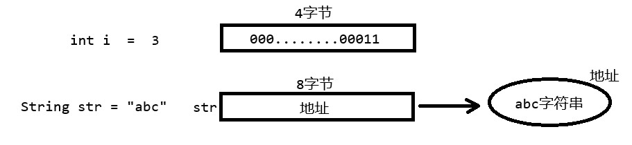
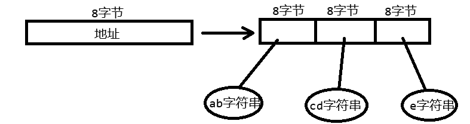
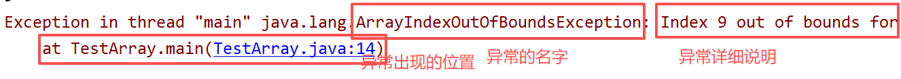
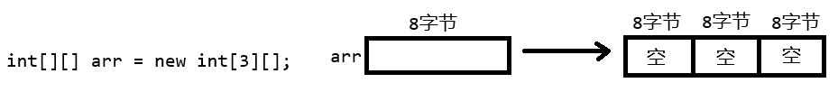
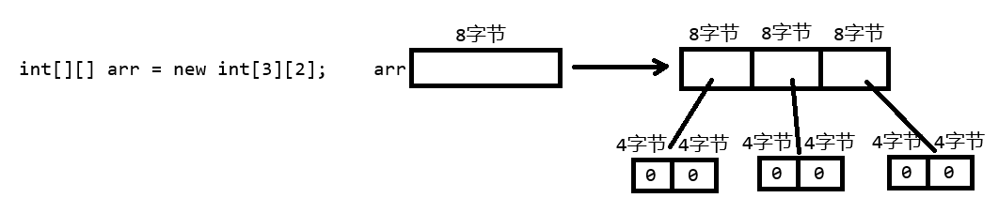

# 数组（Array）

1. 为什么要使用数组？

   之前在使用变量时，要将一个数据存储到内存中 ；而我们要存储很多数据时，不能定义n多个变量，可以定义一个数组存储若干数据。

2. 数组的定义

   数组是用来存储一组**相同数据类型**的数据的**数据结构**。**数据结构**是计算机存储数据、组织数据的方式。数组存储的数据是具有结构型的，每个元素（存储的数据）都具有索引（相当于自然分配的编号），数组的优点是按索引查找数据效率高，缺点是插入数据效率低。

3. java中数组的特点

   存储**相同数据类型**；数组的**长度是不能改变**的，我们在创建一个java数组时一定要**明确长度**。在使用java数组时，经常进行**扩容**的操作（新建新数组，将原数组的内容拷贝到新数组）

### 数组的定义和创建

1. 数组变量的定义

   语法：

   数据类型[] 标识符

   或者 ： 数据类型 标识符 [] (不推荐)

   **数组类型是引用类型**

```java
 int[] arr ;
 double[] arr2;
 String[] arr3;
```

2. 创建数组

   1.静态初始化创建

```java
//创建一个数组时，必须要明确2件事
        //长度：4  ，类型： int数组
        int[] arr = {2,5,7,8};
```

只能在数组变量声明时，用静态初始化创建方式

​	2.动态创建语法 ： new 数据类型[长度]

```java
 int[] arr = new int[3];
 arr = new int[3];
```

​	动态创建并初始化

​	语法： new 数据类型[]{值，值}

```java
int[] arr = new int[]{2,3,4};
```

​	动态创建的数组，如果没有指定元素值，系统会自动分配默认值

​	byte\short\int\long动态创建的数组，默认元素值是0

​	float/double动态创建的数组，默认元素值是0.0

​	char动态创建的数组，默认元素值是\u0000 ,空字符

​	boolean动态创建的数组，默认元素值是false

​	String动态创建的数组，默认元素值是 null值

### 内存模型抽象

1. 先抽象 两段代码 ： int i = 3 ; String str = "abc" ;

   基本类型存储的数据是直接存储在变量空间中

   引用类型的变量固定是8字节，存储的是地址



如果我的代码是 String str = null;

null是一个值，通常称为空值，实际的含义是这个引用类型的变量中没有存储任何的地址。因此null值只能赋给引用类型的变量

  2. 抽象代码 ： int[] arr = new int[3] ;

     1767839596190

  3. 抽象代码： String[] strs = new String[3] ;

     1767839848583

  4. 抽象代码： String[] strs = new String[]{"ab","cd","e"} ;



### 数组的应用

#### 数组的索引（index）

数组的索引是从0开始的（第一个位置），一个数组的最大索引是其长度-1，如果我们使用索引超出了最大长度将会出现异常（错误）

数组[索引] 操作数组中的元素

```java
int[] arr = {3,5,6,4,25,7,3,8,9};
//获取第一个3
int i = arr[0];
System.out.println(arr[0]);
arr[0] = 30;
//输出9
System.out.println(arr[8]);
//错误
System.out.println(arr[9]);
```

我们要记住这个数组索引越界异常的单词：



### 遍历所有元素

```java
 int[] arr = {3,5,6,4,25,7,3,8,9};
 //输出所有的元素
 for (int i = 0; i < arr.length; i++) {
    System.out.println(arr[i]);
 }
```

### 找到元素的最大、最小值、求和

```java
int[] arr = {3,5,6,4,25,7,3,8,9};
int max = arr[0];
int sum = 0;
for (int i = 0; i < arr.length; i++) {
    if(arr[i]>max){
        max = arr[i];
    }
    sum += arr[i];
}
```

### 数组元素的查找

```java
 Scanner scanner = new Scanner(System.in);
 int n = scanner.nextInt();
 int[] arr = {3,5,6,4,25,7,3,8,9};
 boolean flag = false;
 for (int i = 0; i < arr.length; i++) {
    if(arr[i]==n){
        flag = true;
        break;
    }
 }
 if(flag){
    System.out.println("有");
 }else{
    System.out.println("没有");
 }
```

### 数组的拷贝

```java
         int[] arr = {3,5,6,4,25,7,3,8,9};
        int[] arr2 = new int[arr.length];
        //反向拷贝
 /*        for (int i = 0; i < arr.length; i++) {
            arr2[i] = arr[arr.length-1-i];
        }*/
        //或者
        int index = 0;
        for (int i = arr.length-1; i >=0 ; i--) {
            arr2[index++] = arr[i];
        }
        for (int i = 0; i < arr2.length; i++) {
            System.out.println(arr2[i]);
        }
```

### 排序

选择排序

```java
int[] arr = {3,5,6,4,25,7,2,8,9,11};
        int temp = 0;
        for (int i = 0; i < arr.length - 1; i++) {
            for (int j = i+1; j < arr.length; j++) {
                if(arr[j]<arr[i]){
                    temp = arr[i];
                    arr[i] = arr[j];
                    arr[j] = temp;
                }
            }
        }
        for (int i = 0; i < arr.length; i++) {
            System.out.print(arr[i]+"\t");
        }
```

冒泡排序

```java
int[] arr = {3,5,6,4,25,7,2,8,9,11};
int temp = 0;
for (int i = 0; i < arr.length - 1; i++) {
    for (int j = 0; j < arr.length - i - 1; j++) {
        if(arr[j]>arr[j+1]){
            temp = arr[j];
            arr[j] =  arr[j+1];
            arr[j+1] = temp;
        }
    }
}
for (int i = 0; i < arr.length; i++) {
    System.out.print(arr[i]+"\t");
}
```

## 随机功能

### Random类

```java
 Random random = new Random();
 //随机0~9的数字
 int i = random.nextInt(10);
 System.out.println(i);
 //随机5~10的数字
 i = random.nextInt(6)+5;
 //
 int[] arr = new int[]{1,2,3,4,5,6,7,8,9};
 int temp = 0;
 for (int j = 0; j < arr.length; j++) {
    int index = random.nextInt(arr.length);
    temp = arr[j];
    arr[j] = arr[index];
    arr[index] = temp;
 }
 for (int j = 0; j < arr.length; j++) {
    System.out.print(arr[j]+"\t");
 }
```

### Math.random()

随机0~1之间的小数，其中包含0，不包含1

```java
 System.out.println(Math.random());
 //获得0~9之间的一个随机整数
 //Math.random()  : 0 -  0.9999999999999
 //Math.random()*10  :  0 - 9.999999999999999
 //强制转型int  0~9
 System.out.println((int)(Math.random()*10));
 //获得5~10整数
 System.out.println((int)(Math.random()*6)+5);
 //获得-5~5整数  0~10  -5
```

## 二维数组

1. 为什么要使用多维数组

   要存储的数据可能是多个维度的，例如，线性数据（一维数组）、表格数据（二维）

2. 什么是多维数组

   二维数组：存储的元素都是一维数组

   三维数组：存储的元素都是二维数组

### 二维数组的定义

1. 二维数组变量的定义

   语法：

   数据类型[][] 标识符;

   或者

   数据类型 标识符[][]

2. 二维数组的创建

   1.静态初始化创建

```java
//二维数组的长度是多少？  3
        int[][] arr = {{1,2,3},{4,5,6},{7,8}};
```

​	2.动态创建

```java
int[][] arr = new int[3][];
```

上面的，创建了一个长度为3的二维数组，创建了一个数组



```java
int[][] arr = new int[3][2];
```

创建了一个长度为3的二维数组，二维数组中的每个一维数组的长度是2 ，创建了4个数组



```java
int[][] arr1 = new int[3][2];
//等同于：
int[][] arr2 = new int[3][];
arr2[0] = new int[2];
arr2[1] = new int[2];
arr2[2] = new int[2];
//等同于 ：
for (int i = 0; i < arr2.length; i++) {
    arr2[i] = new int[2];
}
```

动态初始化创建

```java
int[][] arr1 = new int[][]{{1,2},{3,4,5}};
```

### 二维数组的应用

1. 遍历数组

   需要二层循环：一层循环遍历出每个一维数组；二层循环遍历出每个一维数组中的元素

```java
int[][] arr = new int[][]{{1,2},{3,4,5}};
for (int i = 0; i < arr.length; i++) {
    for (int j = 0; j < arr[i].length; j++) {
        System.out.println(arr[i][j]);
    }
}
```

2. 二维数组的查找

```java
 int[][] arr = new int[][]{{1,2},{3,4,5}};
 int n = 4;
 boolean flag = false;
 a:for (int i = 0; i < arr.length; i++) {
    for (int j = 0; j < arr[i].length; j++) {
        if(n==arr[i][j]){
            flag = true;
            break a;
        }
    }
}
if(flag){
    System.out.println("有");
}else{
    System.out.println("没有");
}
```

3. 二维数组的拷贝

```java
int[][] arr = new int[][]{{1,2},{3,4,5}};
int[][] newArr = new  int[arr.length][];
for (int i = 0; i < arr.length; i++) {
    newArr[i] = new int[arr[i].length];
    for (int j = 0; j < arr[i].length; j++) {
        newArr[i][j] = arr[i][j];
    }
}
```

4. 排序

```java
int[][] arr = new int[][]{{4,2},{6,3,1}};
       //排序需求
       //需求1：一维数组内部排序
       //需求2 ： 整体排序 ： 创建一个一维数组，将二维数组中的数据拷贝到一维数组中
       //对一维数组排序，在复制回二维数组
       //需求一：
       /*for (int i = 0; i < arr.length; i++) {
           int temp = 0;
           for (int j = 0; j < arr[i].length - 1; j++) {
               for (int k = 0; k < arr[i].length - j - 1; k++) {
                   if(arr[i][k]>arr[i][k+1]){
                       temp = arr[i][k];
                       arr[i][k] = arr[i][k+1];
                       arr[i][k+1] = temp;
                   }
               }
           }
       }*/
       //需求二：
       //二维数组中的所有数据，复制到一维数组中
       //创建一维数组
       int length = 0;
       for (int i = 0; i < arr.length; i++) {
           length+=arr[i].length;
       }
       int[] arrOne = new int[length];
       //循环二维数组，所有数据复制到一维数组中
       int index = 0;
       for (int i = 0; i < arr.length; i++) {
    for (int j = 0; j < arr[i].length; j++) {
        arrOne[index++] = arr[i][j];
    }
}
//一维数组进行冒泡排序
int temp = 0;
for (int i = 0; i < arrOne.length - 1; i++) {
    for (int j = 0; j < arrOne.length - i - 1; j++) {
        if(arrOne[j]>arrOne[j+1]){
            temp = arrOne[j];
            arrOne[j] = arrOne[j+1];
            arrOne[j+1] =temp;
        }
    }
}
//一维数组的数据写回到二维数组
index = 0;
for (int i = 0; i < arr.length; i++) {
    for (int j = 0; j < arr[i].length; j++) {
        arr[i][j] = arrOne[index++];
    }
}
for (int i = 0; i < arr.length; i++) {
    for (int j = 0; j < arr[i].length; j++) {
        System.out.print(arr[i][j]+"\t");
    }
    System.out.println();
}
```

## 数组算法工具类 Arrays

1. 数组拷贝功能

   Arrays.copyof(源数组，长度) ： 返回一个拷贝后的新数组，需要源数组和拷贝的长度（新数组的长度）

```
 int[] arr = {4,3,2,6,7,9,1,10,11};
 int[] arr2 = Arrays.copyOf(arr,arr.length);
 for (int i = 0; i < arr2.length; i++) {
    System.out.print(arr2[i]+"\t");
 }
```

Arrays.copyOfRange(原数组，开始索引，结束索引) ，开始和结束索引是前闭后开

```
 int[] arr = {4,3,2,6,7,9,1,10,11};
 int[] arr2 = Arrays.copyOfRange(arr,0,5);
 for (int i = 0; i < arr2.length; i++) {
    System.out.print(arr2[i]+"\t");
 }
```

2. 排序

```
 int[] arr = {4,3,2,6,7,9,1,10,11};
 Arrays.sort(arr);
 for (int i = 0; i < arr.length; i++) {
    System.out.print(arr[i]+"\t");
 }
```

3. 查找：二分查找法 ： 使用之前要保证数组是有序的，查找的结果才是正确的。二分查找的效率高于全文检索

```java
int[] arr = {4,3,2,6,7,9,1,10,11};
Arrays.sort(arr);
if(Arrays.binarySearch(arr,8)>=0){
    System.out.println("有");
}else{
    System.out.println("没有");
}
```

**数组拷贝的补充**

需求： 数组{1,2,3,4,5,6,7} 中2~3索引的数据拷贝到一个新数组的4~5位置 {0,0,0,0,3,4,0,0,0,0}

System.arraycopy(源数组，源数组开始位置，目标数组，目标数组开始位置，拷贝数据长度)

```java
 int[] arr = {1,2,3,4,5,6,7};
 //int[] arr2 = Arrays.copyOf(arr,2);
 //arr2 = Arrays.copyOfRange(arr,2,4);
 //Java 中还有一个数组拷贝的方法  System.arraycopy()
 int[] arr2 = new int[10];
 System.arraycopy(arr,2,arr2,4,2);
 for (int i = 0; i < arr2.length; i++) {
    System.out.print(arr2[i]+"\t");
 }
```

