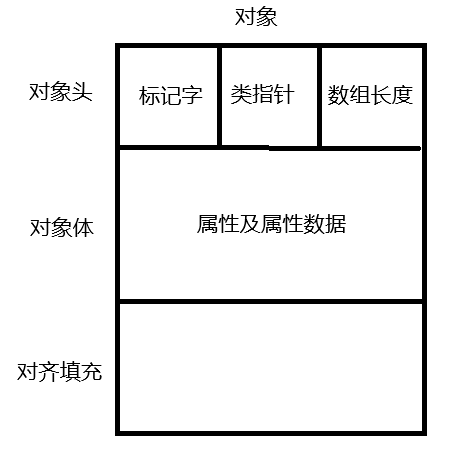
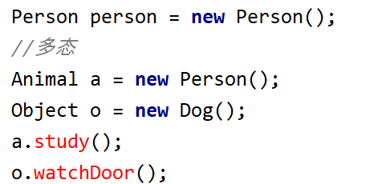
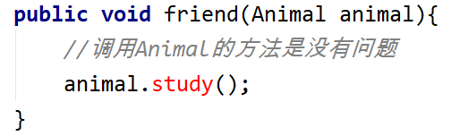
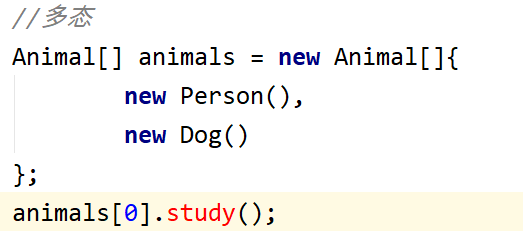
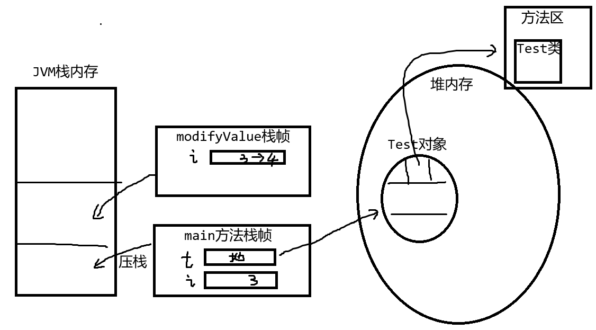

# 面向对象

1. 面相对象的思想

   面向过程的思想：是一种以过程为中心的编程思想，即分析出解决问题所需要的步骤，然后用方法把这些步骤一步一步实现，使用的时候一个一个依次调用就可以了。

   面向对象的思想：

   对象(Object) : 万事万物皆对象，在现实世界中"东西"就是对象，在编程时，对象是存在于内存中的。对象是现实世界中"东西"的描述 。**对对象的描述尽可能与现实世界中对象的描述保持一致**

   类(class) ： 是抽象出来的，是根据对象共有的特征抽象出来的，类是定义出来的。**类和对象的关系是，** **类是用来表述对象的，对象是类的实例**

2. 面向对象的编程步骤
    1. 找对象（是一个分析、抽象的过程）
    2. 定义类（编程过程）
    3. 创建对象（编程过程）
    4. 调用对象的功能（编程过程）

## 类的定义

语法：

[访问范围修饰符] class <类名> {

[属性]

[方法]

}

属性：是用来承载数据的

方法：是用来表述功能的，而功能通常是一段过程

### 属性定义

语法：

[访问范围修饰符] 数据类型 标识符 [= 值]

在类中定义的属性，称为是全局变量/成员变量/属性

在方法中定义的变量，称为局部变量

实例： 定义一个人类，定义其属性

```java
 public class Person {
    String name ;
    int age;
    char sex;
    double hight;
 }
```

在类中定义一些引用类型的属性

实例：人类具有学校、班级

先定义一个学校类：

```java
 public class School {
    String name;
    String addr;
    int age;
 }
```

```java
public class Person {
    String name ;
    int age;
    char sex;
    double hight;
    School school;
    public static void main(String[] args) {
        //创建Person对象
        //new代表新建，在内存中申请空间，创建对象
        //new Person()  Person与类名相同
        //内存结构： p变量中存储了 Person对象的地址
        Person p = new Person();
        //调用属性
        p.name = "tom";
        p.age = 20;
        p.sex = '男';
        p.hight = 1.71;
        /*School school = new School();
        p.school = school;
        school.name = "哈工大";
        school.addr = "南岗区";
        */
        p.school = new School();
        p.school.name = "哈工大";
        p.school.addr = "南岗区";
        Person p2 = new Person();
        p2.school = p.school;
    }
}
```

当我们要执行下面的代码：

```java
Person p = new Person();
p.school.name = "哈工大";
p.school.addr = "南岗区";
```

会出现空指针异常


当调用了一个null值的属性或方法时，上面的p.school 是 null值 却调用了p.school.name属性

修改代码为：

```java
 Person p = new Person();
 School c = new School();
 p.school = c;
 p.school.name = "哈工大";
 p.school.addr = "南岗区";
```

**如果执行下面代码：**

```java
 Person p = new Person();
 p = null;
```

Person对象最终会被垃圾回收器回收

**Java的垃圾回收机制**：

JVM会通过一些垃圾回收算法，验证对象是否是垃圾，如果是垃圾则回收这个对象释放内存

### 方法定义

方法体现的是一个功能，是用一段过程描述这个功能，这个过程可能有结果、可能没有结果、可能需要外界传数据进来参与处理。

语法：

[访问范围修饰符] 返回类型 <方法名>([参数,参数]){

语句;

[return 值]

}解释：

1. 返回类型 ：定义了方法返回结果的类型，也就是返回类型规定了某一个类型，意味着这个方法要有返回结果，方法一定要return一个具体的值 ；如果返回类型 写的是void关键字 ，代表这个方法没有返回结果。
2. 方法名：调用方式时，是需要用到方法名，遵循小驼峰命名规范。
3. 参数 ： 语法只能是：  数据类型  标识符   。其实参数属于局部变量，和局部变量的区别是，参数存储了传入的值（参数代表了传入的内容），**在方法定义时参数称为形参**，**在调用方法时传入的值叫实参**，可以不定义参数也可以定义多个参数
4. return语句：当方法执行到return语句时，会立刻结束该方法。如果指定了返回类型，一定要有retrun 值 ；如果没有定义返回类型是void ，return后面不能有值 ，return可以不写。

方法示例：

```java
 public class Player {
    //属性有身高，体重，姓名，球队
    double hight;
    double weight;
    String name;
    Team t;
    //吃饭
    boolean eat(String food){
        if(food=="肉"){
            return true;
        }
        return false;
    }
    //比赛
    int complete(){
        //如果是姚明场均得分17分
        if(name=="姚明"){
            return  17;
        }
        if(name=="科比"){
            return  25;
        }
        return 0;
    }
    public static void main(String[] args) {
        Player p1 = new Player();
        boolean b = p1.eat("大米饭");
        if(b){
            System.out.println("吃饱了");
        }else{
            System.out.println("没吃饱");
        }
        int score = p1.complete();
        System.out.println(score);
        Scanner s = new Scanner(System.in);
    }
 }
```

#### 方法中调用其他方法

1. 方法中调用本类的方法

   在方法中直接调用本类的方法和属性

2. 方法中调用其他类的方法

   在方法中创建其他类的对象，调用对象的方法

```java
 public class Player {
 //自我介绍
    void showMe(){
        System.out.println("我叫:"+name+",我来自于"+t.name);
    }
    //比赛
    int complete(){
        //当前这个人做自我介绍 ，当前这个人就是调用比赛方法的这个人
        showMe();
        Person p = new Person();
        p.name = "球队主席";
        p.ziwojieshao();
        //如果是姚明场均得分17分
        if(name=="姚明"){
            return  17;
        }
        if(name=="科比"){
            return  25;
        }
        return 0;
    }
    public static void main(String[] args) {
        Player p1 = new Player();
        int score = p1.complete();
        System.out.println(score);
    }
 }
```

#### 方法的重载(Overload)

在一个类中，**方法名相同，参数类型列表不同的方法**就构成了重载，Java中允许出现重载的语法

```java
 double add(double d1,double d2){
    return d1+d2;
 }
 //add方法重载
 double add(int d1,double d2){
    return d1+d2;
 }
 //add方法重载
 double add(double d2,int d1){
    return d1+d2;
 }
```

为什么要使用重载的写法?

由于方法名相同，对于调用者是比较方便的。

重载方法的调用： 用实参类型和形参类型进行匹配，先找完全匹配的，如果没有，实参自动向上转型，找最近类型的方法，如果没有，则编译报错

```java
 public class Cal {
    double add(double d1,double d2){
        System.out.println("add(double d1,double d2)");
        return d1+d2;
    }
    //add方法重载
    double add(int d1,int d2){
        System.out.println("add(int d1,int d2)");
        return d1+d2;
    }
    public static void main(String[] args) {
        Cal cal = new Cal();
        cal.add(10,20); // cal.add(int int)
        cal.add('a','b'); //cal.add(int int)
        cal.add(10L,20L); //add(double double)
    }
 }
```

#### 方法的值传递

### 创建对象

调用属性

```java
public class Person {
    String name ;
    int age;
    char sex;
    double hight;
    public static void main(String[] args) {
        //创建Person对象
        //new代表新建，在内存中申请空间，创建对象
        //new Person()  Person与类名相同
        //内存结构： p变量中存储了 Person对象的地址
        Person p = new Person();
        //调用属性
        p.name = "tom";
        p.age = 20;
        p.sex = '男';
        p.hight = 1.71;
        System.out.println(p.name+","+p.age);
        Person p2 = new Person();
        p2.name = "jack";
        p2.age = 21;
        System.out.println(p2.name+","+p2.age);
        System.out.println(p2.hight);
    }
}
```

**对象的属性是有默认值的** : 在创建对象时，系统先为属性分配了默认值

byte/short/int/long 类型的属性 默认值是0

float/double 类型的属性 默认值是0.0

char类型的属性 默认值是\u0000 空字符

boolean类型的属性 默认值是false

引用类型的属性 默认值是null

**对象在内存中的结构**



标记字 ： 记录对象的状态，例如对象锁、标识等

类指针：指向了类 ，JVM知道这个对象是什么类型的

数组长度： 如果这个对象是一个数组，则记录数组长度，如果这个对象不是数组，则没有这个数据

对象体：存储了属性及属性数据，因此每个对象的内存占用的大小是不同的

对齐填充 ： 由于对象的大小不同，JVM要求每个对象的大小都是8字节的倍数。在对齐填充中要补齐一些字节数保证是8字节的倍数。

## 构造器(Constructor)

1. 作用： 主要作用是用来创建对象的，其次作用可以对对象进行初始化

   通过调用构造器是创建对象的唯一途径

2. 语法：

   [访问范围修饰符] 类名([参数,参数]){

   语句 // 一些初始化的语句

   }

3. 特点：
  1. 如果类中不写构造器，系统会自动生成一个无参的构造器；如果写了构造器，无参构造器就不再自动生成了。
  2. 一个类中可以有多个构造器，但每个构造器的参数类型列表必须不同。也称为是构造器的重载

```java
 public class Person {
    String name;
    int age ;
    double hight;
    //定义一个构造器
    //为什么要写构造器
    //将初始化的过程封装到构造器中
    Person(String n,int a,double h){
        name = n;
        age = a;
        hight = h;
    }
    Person(){
    }
    Person(String n,int a){
        name = n;
        age = a;
    }
    public static void main(String[] args) {
        //甲
        Person p = new Person("tom",10,1.51);
    }
 }
```

#### this关键字

有一个问题：

```java
Person(String name,int age,double hight){
    //这个位置有两个变量，全局变量name ； 局部变量name
    //全局变量和局部变量名字相同时，默认使用的是局部变量
    name = name;
}
```

使用**this关键字** : 代表当前对象 ，如果在一个方法中，this代表当前调用方法的那个对象；在构造器中，this代表当前创建的那个对象

this.属性 ：this.可以省略，但是全局变量和局部变量名字相同时，this.属性 表示全局变量

this.方法：this.可以省略

this() 调用构造器 : **注意：this调用构造器，一定要在构造器的第一行调用**

修改构造器：

```java
Person(String name,int age,double hight){
       //这个位置有两个变量，全局变量name ； 局部变量name
       //全局变量和局部变量名字相同时，默认使用的是局部变量
       this.name = name;
       this.age = age;
       this.hight = hight;
   }
   public void showMe(){
       System.out.println("我叫："+name);
   }
   public void song(){
       showMe();
   }
```

有个问题：

```java
Person(String name,int age,double hight){
    System.out.println("cry......");
    this.name = name;
    this.age = age;
    this.hight = hight;
}
Person(String name,int age){
    System.out.println("cry......");
    this.name = name;
    this.age = age;
}
Person(){
    System.out.println("cry......");
}
```

改造：

```java
 Person(String name,int age,double hight){
    this(name,age);
    this.hight = hight;
 }
 Person(String name,int age){
    this();
    this.name = name;
    this.age = age;
 }
 Person(){
    System.out.println("cry......");
 }
```

## 面向对象的特征之：封装

程序中的封装，主要是对信息的隐藏。优点是提高程序的重用性、安全性

类中的封装主要体现两种封装：

1. 对属性的封装：类的使用者不能直接操作对象的属性，通过setter和getter方法操作属性

private修饰属性：这个属性只能在本类中使用

编写getter和setter方法 ： 完成属性的赋值和取值

2. 对过程的封装：就是方法，对过程的封装，我们要遵循**高内聚**原则 ，高内聚是一个方法中实现单一特定的功能，内聚性越高，重用性越高

## 包(Package)

一个项目中可能要写很多类，使用包对类进行管理，包实质体现的是文件夹

同一个包中的类，可以直接调用；如果类在不同包中，要使用类之前要先导入类。**意味着没有包的类就不能被其他** **类调用**

**为类定义包：**

1. 定义包 ： 包名的命名语法符合标识符的语法的，父包和子包之间用.（点）隔开；命名规范：公司域名倒写+项目名+模块名
2. 在定义类时，在idea中可以在类的前面加包名

**导入某个包中的类：**

```java
package com.hyxy.sys;
import com.hyxy.Student;
public class Test {
    public static void main(String[] args) {
        Teacher teacher = new Teacher();
        Student s = new Student();
        //com.hyxy.Student s2 = new com.hyxy.Student();
    }
}
```

**java.lang包下的所有类是自动导入的，例如String、System等**

## 继承(extends)

子类继承了父类，子类就会拥有父类的所有属性和方法，体现了**类的复用**，子类其实也是对父类**功能的扩展**

例子：

```java
 public class Animal {
    String name;
    String color;
    public void eat(){
        System.out.println("这只动物正在进食");
    }
 }
```

```java
public class Person extends Animal{
    String id;
    public void study(){
        System.out.println("person study");
    }
    public static void main(String[] args) {
        Person p = new Person();
        p.eat();
        p.name = "tom";
    }
}
```

**继承**的特点：

1. java中的**继承**都是**单继承**(一个子类只能有一个父类，一个父类可以有多个子类)，但是可以多层继承（子类继承父类，父类继承爷爷类，子类也会拥有爷爷类的属性方法）
2. 如果一个类没有继承任何类，这个类默认继承Object类（东西），Object类是类层次结构的根类。

子类向父类的角度叫**继承**，父类向子类的角度叫**派生**，父类又叫**超类**

#### Java的访问范围修饰符

本类中 同一个包中 子类中 全局

private √

默认的 √ √

protected √ √ √

public √ √ √ √

## 方法的重写(Override)

当子类继承父类的方法，不能满足子类的需求，在子类中要对方法进行重写。

**重写语法：要求子类的方法名、参数类型列表、返回类型要与父类方法一致，访问范围不能低于父类方法的访问范** **围。**

```java
 //对继承的eat方法进行重写
 public void eat(){
    //编写一些合理的过程
    System.out.println("这个人正在吃饭");
 }
```

**为什么要重写方法？**

我既然要执行System.out.println("这个人正在吃饭"); 功能 ，可以定义一个新的方法eat2，调用eat2也能执行同样的功能，为什么一定要重写eat方法？

```java
 public void eat() {
    System.out.println("这个人正在吃饭");
 }
 public void eat2(){
    System.out.println("这个人正在吃饭");
 }
 public static void main(String[] args) {
    Person p = new Person();
    p.eat2();
 }
```

1. 从工程设计的角度，父类的方法和子类的方法名是相同，在父类中设计好功能的结构，调用功能方法时更方便
2. 子类重写的功能可以和父类的功能组合

例子一：

```java
 //图形类
 public class Shape {
    //计算图形的面积
    public double area(){
        return 0;
    }
    //计算图形面积和
    public double sumArea(Shape[] shapes){
        double sum = 0;
        for (int i = 0; i < shapes.length; i++) {
            sum += shapes[i].area();
        }
        return sum;
    }
    public static void main(String[] args) {
        Rect r1 = new Rect(10,20);
        Rect r2 = new Rect(15,10);
        Shape[] shapes = new Shape[]{r1,r2};
        //调用父类的功能  计算面积和
        System.out.println(new Shape().sumArea(shapes));
    }
}
public class Rect extends Shape {
    int length;
    int width;
    public Rect(int length, int width) {
        this.length = length;
        this.width = width;
    }
    @Override
    public double area() {
        return length*width;
    }
/*
    public double area2() {
        return length*width;
    }*/
}
```

实例二： 多线程的例子 ： 多线程 同时执行(并发执行)的多个任务(代码段)

```java
 public class MyThread1 extends Thread{
    @Override
    public void run() {
        for (int i = 0; i < 10000; i++) {
            System.out.println("A程序执行"+i);
        }
    }
    public static void main(String[] args) {
        new MyThread1().start();
        new MyThread2().start();
        //并发执行      功能
        //执行代码段(1~10000)    执行什么代码
    }
 }
```

## super关键字

super关键字在类中代表了父类

调用属性：调用的是父类的属性，几乎很少写的

调用方法：调用的是父类的方法

调用构造器：调用父类的构造器

**语法：在子类的构造器中，一定要调用一次父类的构造器，默认调用的是父类无参的构造器**，如果父类没有无参构造器，就要手动调用父类的构造器了

通常在子类构造器中调用父类构造器，在解决语法问题的前提下，调用父类构造器完成部分属性的初始化

```java
public class Person extends Animal {
    String id;
    public Person(String name,String id){
        super(name);
        this.id = id;
    }
}
```

## 面向对象特征之：多态

一个对象通过继承具有了多种类型，体现了多态性，也就是，我们在编写程序时，用父类类型的引用表示子类的对象，这种写法就是多态的写法

```java
 //多态
 Animal a = new Person();
 Object o = new Person();
 //多态
 person.friend(new Person());
 person.friend(new Dog());
 //多态
 Animal[] animals = new Animal[]{
        new Person(),
        new Dog()
 };
```

多态写法，**体现对象在类型上的灵活性**，例如我有一个方法，参数是一个Object类型的参数，那么我就可以传入任何的对象

### 多态的表示，不能调用子类独有的属性和方法







**在编译期，系统认为上面的对象是父类的类型，在运行期才是实质的对象**

### 转型

**要调用子类独有的方法**，将对象转为子类类型，编译就能通过了

```java
     public void friend(Animal animal){
        //调用Animal的方法是没有问题
        ((Person)animal).study();
    }
 public static void main(String[] args) {
        Person person = new Person();
        //多态
        Animal a = new Person();
        Object o = new Dog();
        //a.study();
        //o.watchDoor();
        ((Person)a).study();
        Person p = (Person)a;
        p.study();
        Person p1 = new Person();
        p1.study();
        //多态
    //person.friend(new Person());
    person.friend(new Dog());
    //多态
    Animal[] animals = new Animal[]{
            new Person(),
            new Dog()
    };
    //animals[0].study();
    ((Person)animals[0]).study();
    ((Dog)animals[1]).watchDoor();
}
```

在转型时，可能会出现 ClassCastException的异常 （转型异常）

从子类、父类**类型的角度**，向上转型是安全的，向下转型或无关的转型就会出现转型异常

### instanceof运算符

语法 ： 对象 instanceof 类型

结果是true/false

```java
 public void friend(Animal animal){
    //调用Animal的方法是没有问题
    //如果是Person对象调 study()
    if(animal instanceof Person){
        ((Person)animal).study();
    }
    //如果是Dog对象 调用  watchDoor()
    if(animal instanceof Dog){
        ((Dog)animal).watchDoor();
    }
 }
```

#### jar包导出/导入

jar包是字节码文件的压缩包，当别人要调用你的写类时，你是不能将源代码发给别人，因此你要导出jar包，别人要**导入jar包**

**jar包的导出**

设置**jar包的导出**位置

File-- Project Structure -- 找到Artifacts -- +号 -- jar 设置了jar包导出的位置

导出jar包：

build -- build Artifacts -- jar -- build

**导入jar包**

1. jar包文件包含在工程文件中，在工程中创建一个lib文件夹，jar包拷贝进去

2. 工程有一个类库，在编写代码时，使用的类可以从类库中找到，类库中默认是有JDK的一些jar的

   将jar包导入到类库中

   File-- Project Structure -- libraries -- +号 -- 选择lib文件夹

#### Object类方法toString和equals方法

1. toString方法：**获得象的字符串形式**，默认获得的是 ： 包名+类名@十六进制的地址 。print方法默认调用对象的toString方法。可以重写toString方法，自定义输出的内容。

```java
 public class StudentCard {
    String id;
    String name;
    public StudentCard(String id, String name) {
        this.id = id;
        this.name = name;
    }
    @Override
    public String toString() {
        return "学号："+id+",姓名："+name;
    }
    public static void main(String[] args) {
        StudentCard card = new StudentCard("23071101","tom");
        System.out.println(card);
        Date date = new Date();
        System.out.println(date.toString());
    }
 }
```

2. equals方法 ：比较两个对象是否相等 ，可以使用A对象.equals(B对象) ，结果是true/false 。Object类中的equals方法默认比较两个对象的== ，也就是地址是否相等，是否是同一个对象。

```java
public class StudentCard {
   String id;
   String name;
   public StudentCard(String id, String name) {
       this.id = id;
       this.name = name;
   }
   @Override
   public String toString() {
       return "学号："+id+",姓名："+name;
   }
   //equals方法不能满足子类的要求 :
   //重写equals方法： 如果两个对象的id相等，则equals返回true
    @Override
    public boolean equals(Object o) {
        if(this == o) return true;
        if(o instanceof StudentCard){
            StudentCard s = (StudentCard)o;
            //
            if(this.id.equals(s.id)){
                return true;
            }
        }
        return false;
    }
    public static void main(String[] args) {
        StudentCard card1 = new StudentCard("23071101","tom");
        StudentCard card2 = new StudentCard("23071101","tom");
        System.out.println(card1.equals(card2));  //等同于card1 ==  card2
/*        String str1 = new String("abc");
        String str2 = new String("abc");
        System.out.println(str1.equals(str2));*/
    }
}
```

**字符串对象进行内容比较 一定要用 equals方法**


**JVM的内存模型分为：程序计数器内存、堆内存、JVM栈内存、本地方法栈内存、方法区**

1. 程序计数器内存：  记录程序执行的行号，每个线程都会有一个自己的程序计数器内存
2. 堆内存：所有通过new创建的对象都是存在堆内存中，存储的对象是不具备共享性的
3. JVM栈内存 ： JVM每执行一个方法时，将方法的栈帧（内存空间的地址）压入JVM栈内存中，当方法执行完毕，弹出栈帧
4. 本地方法栈内存：调用本地的库（其他语言的库）时，运行的数据都是在本地方法栈内存
5. 方法区：类加载到内存中，存储到方法区中

**方法的值传递，运行方法的内存模型**

在调用方法时，实参可能是一个值也可能是一个对象，传入的是值或对象

```java
public class Test {
    public void modifyValue(int i){
        i++;
        System.out.println("方法内部i的值是："+i);
    }
    public static void main(String[] args) {
        Test t = new Test();
        int i = 3;
        t.modifyValue(i);
        System.out.println("方法外部i的值是："+i);
        //运行结果：
        //方法内部i的值是： 4
        //方法外部i的值是： 3
    }
}
```



```java
 public class Test {
    public void modifyValue(Person p){
        p = null;
        System.out.println("方法内部p的值是："+p);
    }
    public static void main(String[] args) {
        Test t = new Test();
        Person p = new Person();
        t.modifyValue(p);
        System.out.println("方法外部p的值是："+p);
        //方法内部p的值是：null
        //方法外部p的值是：com.hyxy.Person@6cd8737
    }
 }
 public void modifyValue(Person p){
    p.name = "李四";
    System.out.println("方法内部p的name值是："+p.name);
 }
 public static void main(String[] args) {
    Test t = new Test();
    Person p = new Person();
    p.name = "张三";
    t.modifyValue(p);
    System.out.println("方法外部p的name值是："+p.name);
    //方法内部p的name值是：  李四
    //方法外部p的name值是： 李四
 }
```

在封装方法时，例如：对一个int数组的所有元素清0

```java
//错误的封装
public void clear1(int[] arr){
    arr = new int[arr.length];
}
//错误的封装
public int[] clear2(int[] arr){
    arr = new int[arr.length];
    return arr;
}
//正确的封装
public void clear3(int[] arr){
    for (int i = 0; i < arr.length; i++) {
        arr[i] = 0;
    }
}
```

