# 今天手把手带大家从0开始手搓一个非常简单但不乏实用性的智能体（Agent），就当是给大家的Agent基础入门课了！

既然是学Agent，那我们要做的就是先知道到底什么是Agent，所谓致知力行，理论永远是实践的先行者。

所以大家在没搞懂什么是Agent前，可以先详细了解一下关于Agent的概念解析。

清楚了Agent这一基本概念，接下来就是基于智能体开发平台实现自己的功能需求。

现阶段国内外主流的智能体开发平台数量不在少数，像国内字节跳动的Coze（扣子开发平台），国外的Dify、FastGPT、n8n等等。但说到其中最容易上手、界面最友好的，当属Coze，这也是我目前接触最多的开发平台，那今天我将以Coze平台作为实操载体，为此专门注册了一个新账号，带着大家一起入门Agent！

## Coze简单介绍

**（如果是已经对Coze大致有所了解或接触过的朋友可以直接跳过这一部分）**

这里先用一小段篇幅带大家快速了解下Coze并进入到指定操作界面。

> Coze 是字节跳动推出的零代码或低代码智能体开发平台，基于其大模型技术，提供插件系统、长短期记忆、工作流编排等核心能力，支持多模态交互（文本/语音/图像）与多平台发布（如豆包、飞书、Discord），专注构建个人助理、电商客服、内容生成等场景的智能体应用。

**Coze网址：** [**https://www.coze.cn**](https://www.coze.cn)

进到官网，首先进行一成不变且枯燥老套的登陆/注册环节，之后进入到Coze主页，但其实在整个Coze平台当中，我们使用频率断档最高的是位于左侧菜单栏第二位的“工作空间”。

而在“工作空间”，我们目前需要了解的是“项目开发”和“资源库”这两个界面。

> 大家可以将“资源库”理解为是我们打造各种工具的地方，而“项目开发”是存放我们基于各种工具组装成的完整产品的地方

但当我们点入这两个页面后，通过下拉菜单又可以看到一些分类选项（特别是“资源库”当中）。

到了这一步，大家先别慌，既然是入门，我们暂时也肯定用不到这么多，主要需要了解并接触到的是以下我为各位框出来的几个：

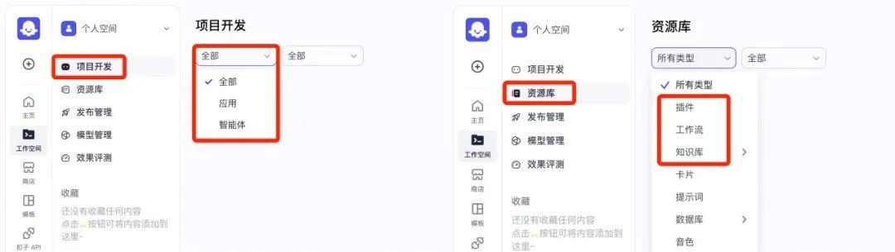

是的，这些概念是需要我们理解区分的。

首先我们简单区分一下所谓“应用”和“智能体”的含义，这时候其实并不需要进行很麻烦的搜索、查找、听什么讲解，其实在Coze平台的官方文档中就有明确出这两个概念的具体定义，并且讲的很清楚：

> **智能体：** 基于对话的AI项目，它通过对话方式接收用户的输入，由大模型自动调用插件或工作流等方式执行用户指定的业务流程，并生成最终的回复。智能客服、虚拟伴侣、个人助理、英语外教都是智能体的典型应用场景
>
> **AI应用：** 指利用大模型技术开发的应用程序。扣子中搭建的 AI 应用具备完整业务逻辑和可视化用户界面，是一个独立的 AI 项目。通过扣子开发的 AI 应用有明确的输入和输出，可以根据既定的业务逻辑和流程完成一系列简单或复杂的任务，例如 AI 搜索、翻译工具、饮食记录等

同样的，对于资源库当中的概念，在文档当中也有相应的讲解：

> **插件：** 插件是一个工具集，一个插件内可以包含一个或多个工具（API）
>
> **工作流（Workfiow）：** 用于处理功能类的请求，可通过顺序执行一系列节点实现某个功能。适合数据的自动化处理场景，例如生成行业调研报告、生成一张海报、制作绘本等
>
> **知识库：** 知识库功能包含两个能力，一是存储和管理外部数据的能力，二是增强检索的能力

看到这里相信所有需要了解的前置概念你都已经了然于心，理论结束，我们开始动手实操，过程中遇到不懂的，我们再见招拆招！

## 超简单的智能体搭建

上面关于“工作流”的定义中提到：**工作流可通过顺序执行一系列节点实现某个功能**，反过来就可以得到：**我们可以将想要实现的功能进行标准化流程编排，最后形成一个工作流（程），而这个工作流，只要我们提出需求，就可以向流水线一样执行我们编排好的操作以实现最后的功能，从而解决我们的需求，且在工作流运行的过程当中，我们完全不用管**，可以去喝喝咖啡晾晾衣服，甚至如果你对象在身边的话，当然也可以选择波一下嘴【狗头】（啊没有对象的朋友就当我啥也没说哈【其实我也没对象…】）。

所以在Coze平台当中，我们就可以将智能体看作是对内部多个AI工作流（当然也可以是一个）的封装，毕竟智能体就是帮我们解决各种需求的，而解决需求的能力，又源于我们编排好的标准化工作流程。

既然如此，我们就需要先明确一下我们即将搭建出来的智能体具备什么功能，结合易上手程度、实用性以及文章篇幅等原因，我将以搭建**一个能够根据关键词对网络上相关新闻信息进行检索总结的简单智能体**作为演示。

所以我们现在所要做的就是搭建实现相应功能的工作流，首先将光标移动到资源库右上角的“+资源”，点击工作流进行创建：

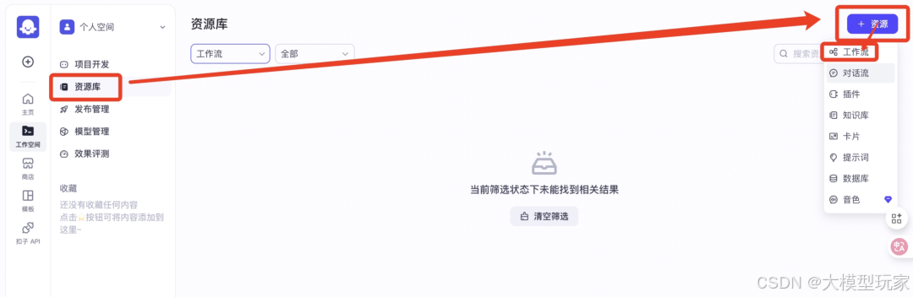

接下来我们需要为这个新的工作流命名并填入该工作流的功能简介，这里Coze的命名有一定的限制条件：

结合我们将要搭建的智能体所实现的功能，我填入的信息如下，接着我们便进入到工作流的创作界面：

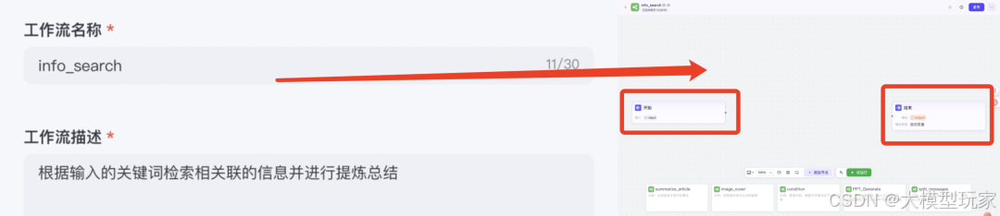

首先映入眼帘的就是默认的“开始”和“结束”这两个模块（节点），其实分别对应的就是\*\*“输入需求”**和**“输出结果”\*\*这两个功能，很好理解。

接下来我们需要整理一下自己的思路，看看实现对应的功能（即检索总结）大致可以拆分成几步：

> 1.**输入**我们想要查询的信息对应到的关键词，例如“Agent”、“人工智能”；
>
> 2.智能体根据我们的需求对网上海量的信息进行检索匹配；
>
> 3.智能体对最终检索筛选出来的信息进行提炼总结；
>
> 4.**输出**最终结果。

而第一点的“输入”和最后一点的“输出”便对应到界面中默认的两个节点功能。

除此之外，我们还需要完成对第二点和第三点流程编排，所以需要再添加这两个节点。

怎么添加！很简单：

我们先来添加第一个，也就是能够根据我们的关键词进行信息检索的节点，其属于是Coze平台内置的一个插件：

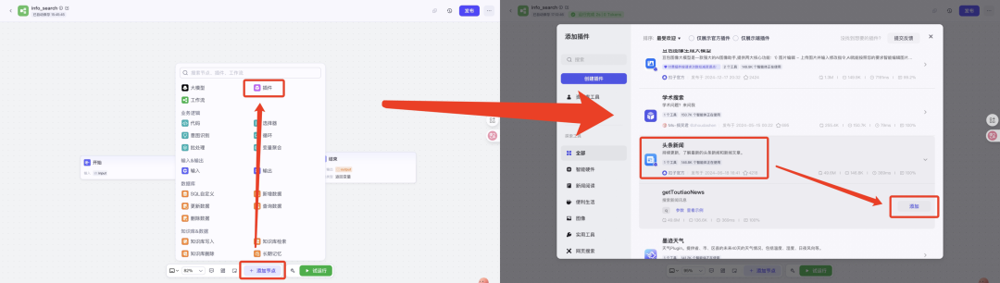

然后再来添加第二个节点，这个节点的功能是能够对检索到的信息进行提炼总结，因为我们总不希望Agent最终为我们返回的结果每次都是长长的一大篇。

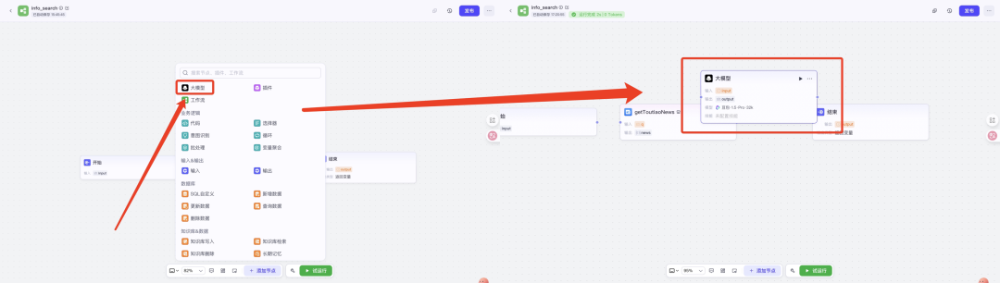

就像这样直接点一下，界面中就会加载出“大模型”节点。

到这里，我们的创作界面上已经有了四个节点模块，分别是“开始”、“getToutiaoNews”、“大模型”、“结束”：

我们接下来所要做的是便是将这几个模块串联起来，就像这样：

（光标移动到前一个节点的末端，然后按住拖拽连接到下一个节点的前端即可连接）

到这一步，可能有些之前没有接触过Agent的朋友会认为这个工作流是不是大功告成了？NO，其实我们只是完成了最基础的节点编排，接下来我们还需要对每个节点进行相应的设置，让我们一个个来：

## “开始”节点：

我们鼠标直接点击“开始”节点进入到右边的编辑栏：

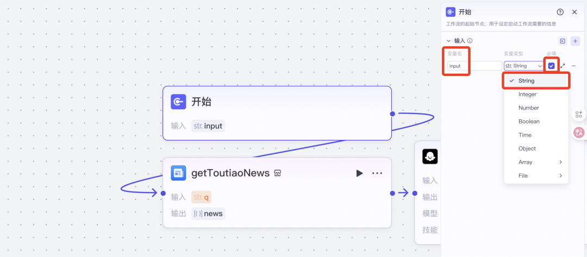

这里需要我们理解几个概念：变量名和变量类型（别慌，虽然这是编程中会常出现的概念，但并不需要我们自己动手敲代码），可以按以下这样简单理解：

> **变量：** 可以简单将其理解为数据、信息
>
> **变量类型：** 我们一开始输入给这个工作流的内容具体的数据类型（比如文字、数字、图片、网络链接等等）
>
> **变量名：** 为我们输入的内容所取的名字

所谓钥锁纹同，乃可启之。类型契合是功能实现的前提。所以在最开始我们必须选对数据类型，否则后续的节点可能会因为数据类型不同而无法正常运行。

因为这个工作流的功能是根据我们提供的关键词进行信息检索，所以在一开始我们输入的数据是关键词（也就是文字），这里需要选择“String”这个变量类型。

> **String：** 翻译过来就是字符串，是一种文本类型变量，用于存储由字符组成的序列（如文字、数字、符号等）

变量名的话，我们可以使用默认的“input”，但避免后续节点的混淆，可以自己重新设置一个简短的，比如“Key”（但记住不能是中文）。

那现在对于“开始”这一节点的设置我们就完成了。

## “\*\*getToutiaoNews”节点：\*\*

其次是对于第二个节点的编辑——根据我们以上提到的，该节点所实现的功能是根据我们输入的关键词对网络上相匹配的信息进行检索。

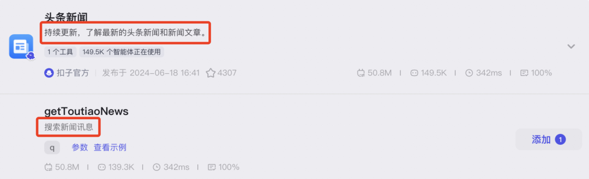

我们依旧如前面一样点击该节点进入到相应的编辑界面：

首先大家会看到编辑界面总体上分为\*\*“输入”区域**和**“输出”区域\*\*，这其实很好理解：既然这个节点是根据我们输入的关键词进行信息检索的，那关键词从何而来？没错，每一次我们输入的关键词都已经在“开始”节点被我们封装成了一个叫作“Key”的变量，所以这个变量需要传入到这个节点当中（也就是对应到“输入”区域）。

现在大家需要根据以上图片我指出的步骤，选择我们在“开始”节点设置好的这个变量，填入到该节点的“输入”区域，以使该节点能够知晓我们每次需要搜索的关键词具体是什么。

其实到这一步对于该节点的设置便基本完成了，但我们还是要先清楚其所输出的内容是什么，或者说，一个新闻包含了哪些信息：

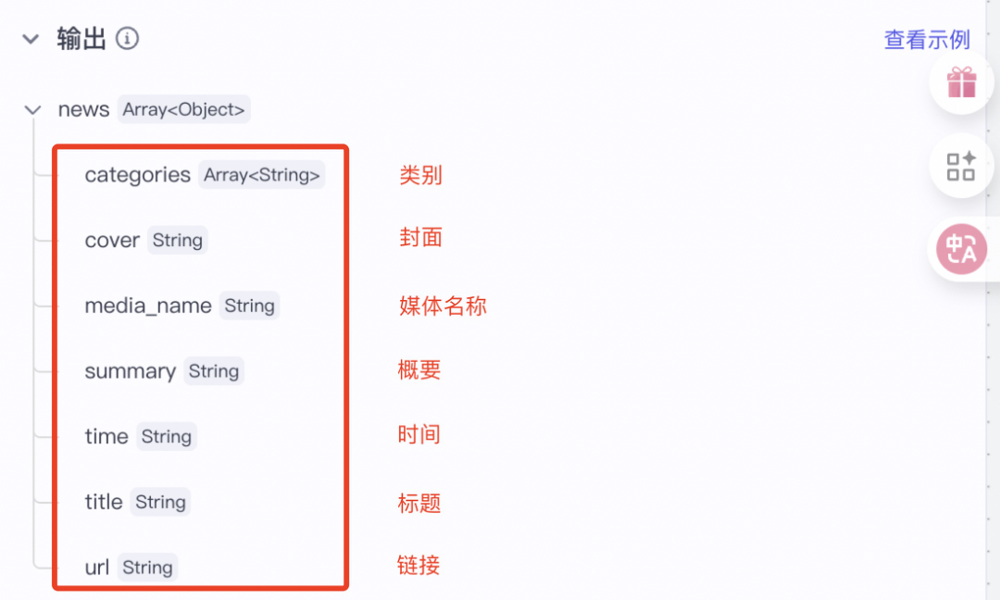

当然啦，如果设置到这里你仍不放心，不知道最后到底能不能为我们检索到相应的新闻信息，也可以选择将后面的“大模型”节点断开连接，然后直接连接到“结束”节点，并对“结束”节点当中的输出变量进行指定（也就是在第二个节点根据我们的关键词检索出的信息），接下来点击界面下方的“试运行”按钮，便可以单独对这三个节点进行测试：

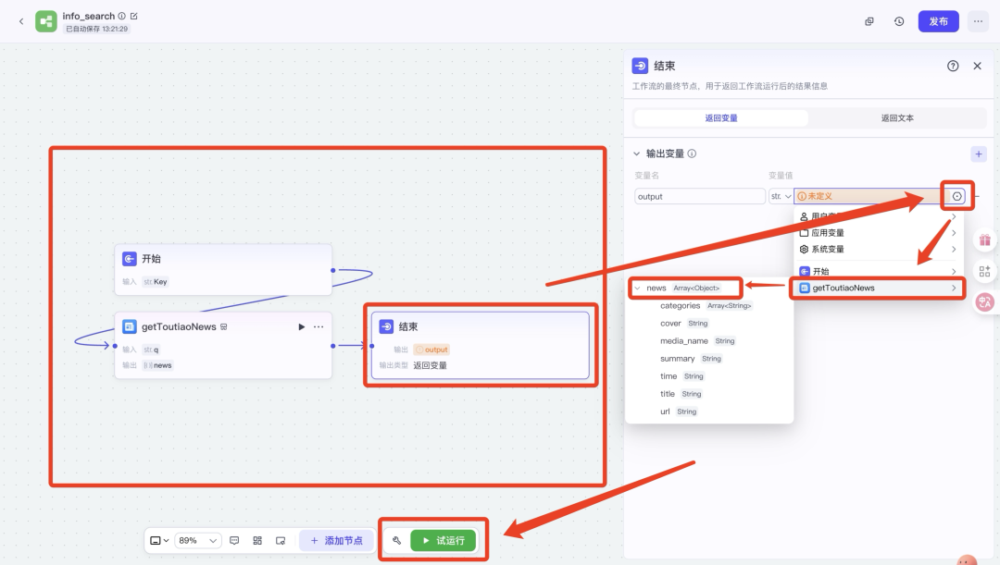

（断开节点间的连接：鼠标点住节点间连接线的后一端口【即箭头端】，然后直接移开即可）

点击“试运行”后，会弹出以下界面，这里会要求我们输入一个“Key”，也就对应到“开始”节点我们为每一次输入的关键词所封装的“Key”。

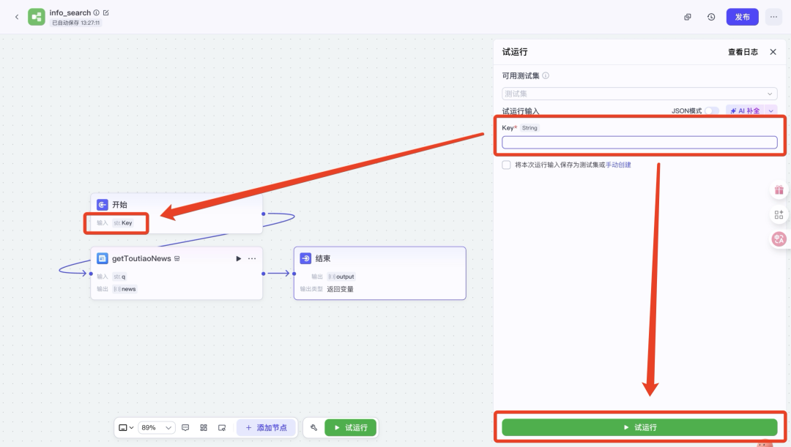

这里我以输入“雷军”为例，然后再点击下方的“试运行”：

如果运行成功的话，最终在“结束”节点便会输出一些近期与“雷军”相关的新闻信息，我们都可以点开查看，甚至复制“url”中详细的网址进入到相应页面。

## “大模型”节点：

待以上的节点运行一切正常，我们恢复到先前四个节点的连接顺序，接下来便是对第三个节点（即“大模型”节点）的设置。

在这个由四个小节点组成的简单工作流当中，对于该节点的设置是最复杂的（但其实也非常简单），老样子，我们先点开节点的编辑界面：

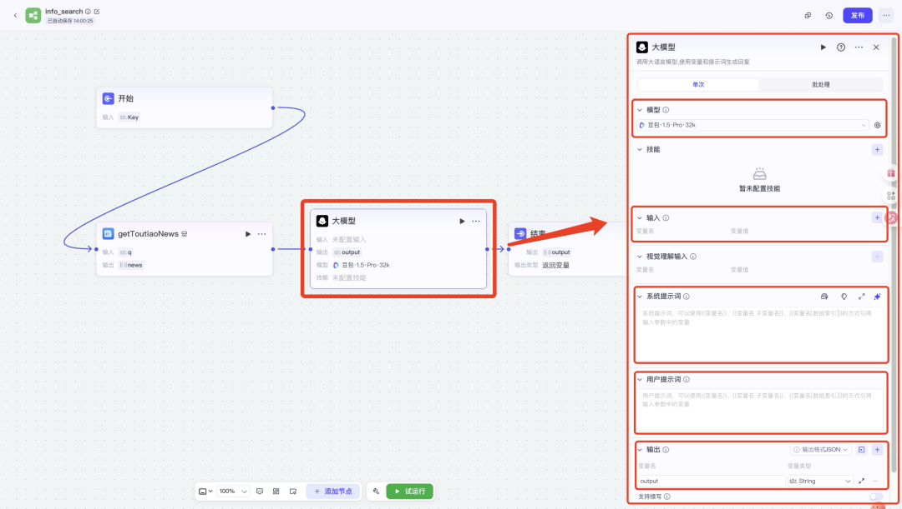

这里我们需要了解并进行设置的主要有“模型”、“输入”、“系统提示词”、“用户提示词”、“输出”这5个部分。

其中“模型”需要我们选择自己想要调用的大模型，可以根据我们想实现的功能（或者说想让该大模型干什么）来进行选择，而“输入”和“输出”便不用再过多讲解了，就是该节点接收到的信息和最终处理出来的内容。

而“系统提示词”以及“用户提示词”这两个概念是需要我们做好区分的，我们先看官方给出的解释：

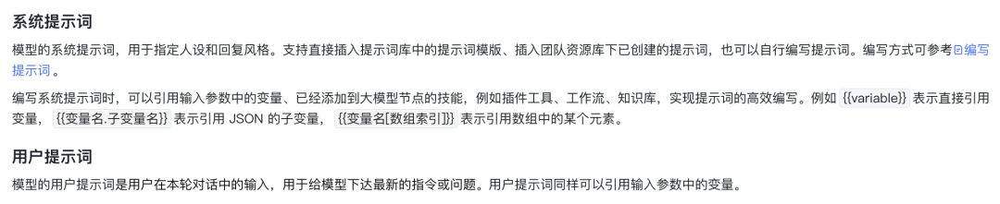

翻译成人话就是：

> **系统提示词：** 对AI的身份设定和规范要求
>
> **用户提示词：** 用户（即我们）对AI下达的执行指令

对涉及到的相关概念了解清楚后，我们便可以开始进行具体的设置了：

* **对于“模型”：** 在这里我直接以系统默认的“豆包·1.5·Pro·32k”为例作演示；

* **对于“输入”：** 我们需要先点击一旁的小加号“+”添加一个输入变量，而通过前面的节点设置大家想必也应该知道这里该填入的是来自第二个节点（即“getToutiaoNews”）的输出内容；

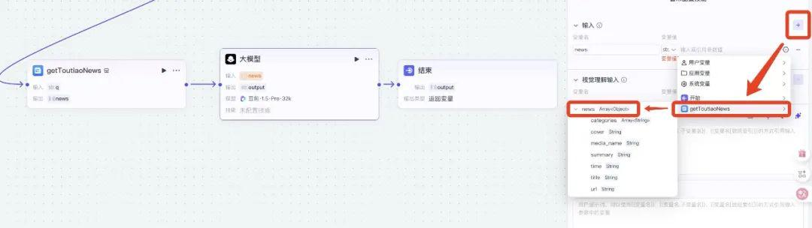

* **对于“系统提示词”：** 对于专业的系统提示词，相对来说是会比较复杂一些（需要做一些专业的设定和详细的限制），但这里作为针对大多数新手的示例演示，所以不需要做过多复杂的描述，这里给出我的提示词文案示例内容：

> - 总结新闻内容，只需要返回时间和概述的主要内容结果，不要长篇大论，简短一些

* **对于“用户提示词”：** 同样的，给出我的提示词内容：

> - 总结{{news}}

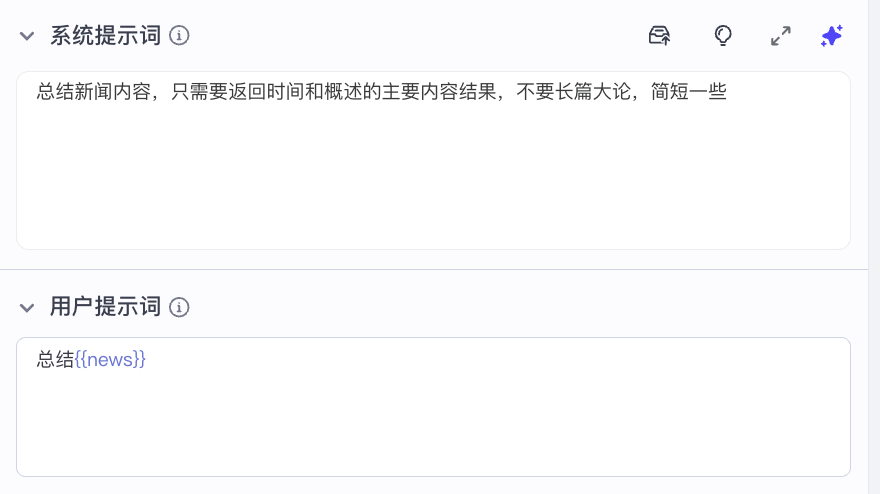

* (这两个提示词框中可以用“{{}}”来引用工作流中存在的变量)

* **对于“输出”：** 保持默认的“String”变量类型，变量名可根据自己的想法进行更改，我这里就直接保持默认的“output”了。

这样我们的“大模型”节点便设置完毕了。

## “结束”节点：

来到我们最后一个节点的设置，跟在上文我们的测试环节中所设置的那样简单，这次只需要将输出的变量更换为来自“大模型”节点的处理结果即可，即“output”：

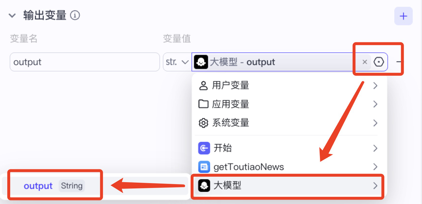

截至目前，关于这个工作流的搭建和相关设置我们便已全部完成，下一步便是测试环节：

同样的，我们点击界面下方的“试运行”按钮，这次我们输入“马斯克”看看会得到什么样的结果：

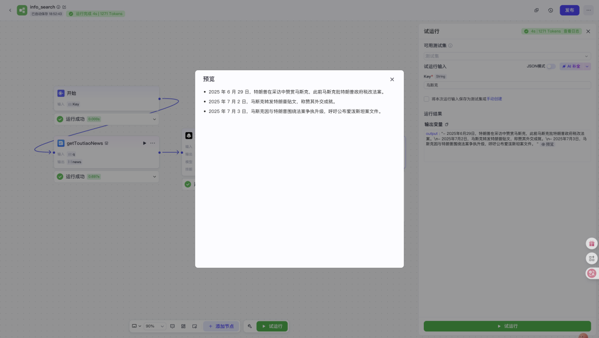

可以看到，我们的工作流可以正常运行并按照我们的要求输出相应的新闻概述。

现在我们点击界面右上角的“发布”按钮，随后会弹出一个小界面，其中有一个版本描述是必填的（大致填写一下即可）：

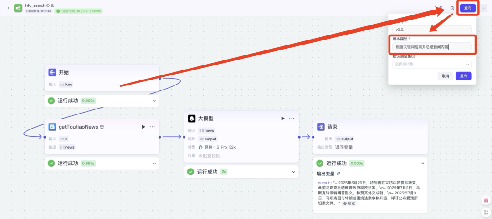

发布之后，我们便可以在资源库中查看到我们搭建好的工作流，也就相当于保存成功了：

到这里关于工作流的全部工作便已全部完成，下一步我们要将这个工作流集成到一个“外壳”（我们大致可以这么比喻成一个“外壳”）中，最终形成的结果就是我们要的Agent。

具体步骤如下：

首先我们从“资源库”切换到“项目开发”，点击右上角的创建按钮，选择创建智能体：

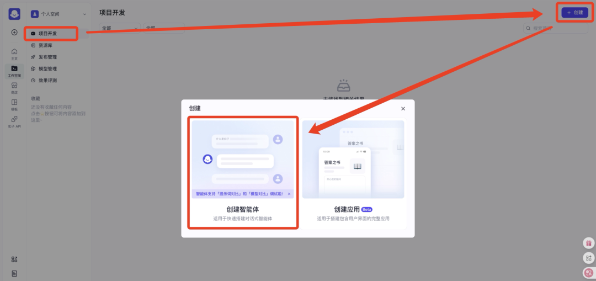

接着会弹出一个小窗口让你填写你将创建的智能体的相关信息，包括名称和简介，当然，你还可以在最下面更换该智能体的图标：

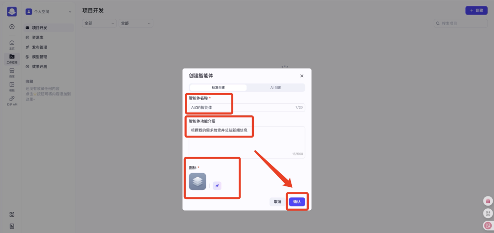

等这些信息填写完后，便可以点击确定进入到智能体的详细编辑界面：

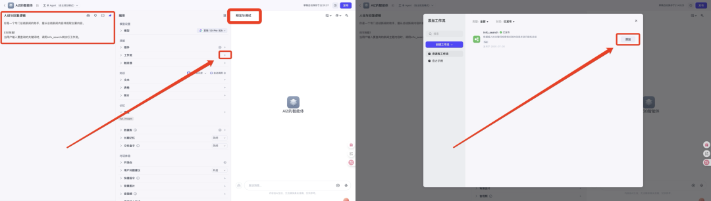

在这里我们主要做两件事，第一是为我们的智能体进行人设与回复逻辑的设定（因为我们只搭建了一个工作流，只具备一种功能，所以我们只用明确一种技能即可），这里给出我的设定模版：

> 你是一个专门总结新闻的助手，擅长总结新闻内容并提取主要内容。
>
> \###技能1
>
> 当用户输入要查询的关键词时，调用info\_search来执行工作流。

第二件事便是添加我们刚才搭建好的工作流。这样智能体的搭建便基本完成了。

同样的，我们需要对搭建好的智能体进行测试，所对应的也就是以上框出的“预览与调试”。

最后我们再次以“马斯克”为例进行测试，如果顺利运行的话，智能体便可以正确给出所检索到的新闻：

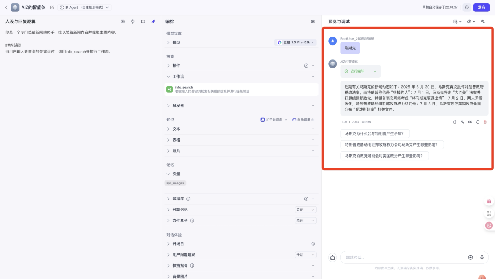

通过以上简单的几步，现在你便拥有一个可以实时查询新闻信息的智能体工具了。

通篇文章下来，其实真正重要的不在于你成功搭建了一个简单智能体，更不在于其中提及到的为数不多也不具备学习门槛的技术，而是向你展示了搭建一个智能体的基本思路，以及现在主流的智能体开发平台大致上是如何运作的，我们可以高度概括成一句话：

**工作流是对指定功能通过集成和预设好的模块按照特定的顺序进行标准化编排，而智能体则是对各种指定功能的集成…**

