&#x20;

### 一、智能体的定义与分类

##### 1. 什么是智能体

智能体（Agent）作为先进的人工智能实体，通过持续感知外部环境、自主决策并执行行动来达成预设目标。其架构具备环境感知、动态决策、行为执行等核心功能模块，并集成记忆存储机制、多层级规划策略及工具调用能力。

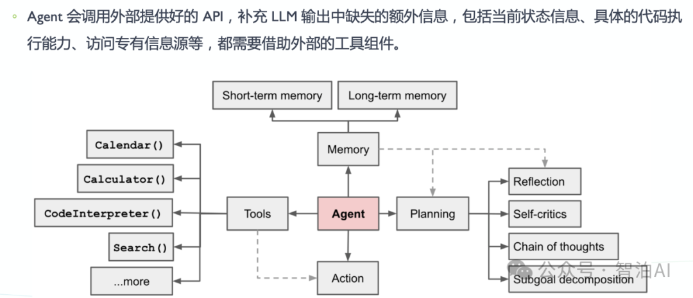

其规划模块整合了思维链推演、自我反思机制及目标分解技术，形成闭环式认知增强系统。

区别于传统AI系统，智能体展现出三大核心特性：在独立运作层面具有无需人工干预的决策自主性；在时间维度上支持长期运行与迭代优化；在环境交互中可通过数据驱动持续演进行为策略。

这种具备认知进化能力的系统，能够在开放动态场景中实现策略的动态调优，最终达成复杂任务的高效处理与目标的最优解。

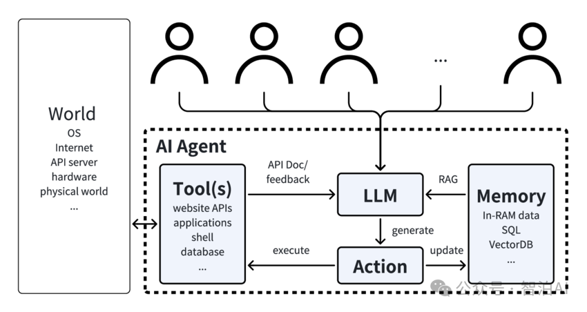

##### 2. OS Agent：操作系统智能体

OS Agent（操作系统智能体）作为新型智能体系统的前沿研究方向，其核心特征在于通过人机交互界面实现计算设备的自主操作。

根据IEEE T-PAMI 2023年发布的系统性综述，这类智能体通过模拟人类用户与图形用户界面（Graphical User Interface, GUI）的交互行为，可完成包括文档处理、应用程序管理和跨设备协同等复杂任务。其技术架构主要构建于三个核心模块：

* **环境：** OS Agent所处的操作系统环境，如Windows、macOS、Android等

* **观察空间：** 智能体获取信息的方式，如界面截图、DOM结构等

* **行动空间：** 智能体可执行的操作集合，如点击、输入、滑动等

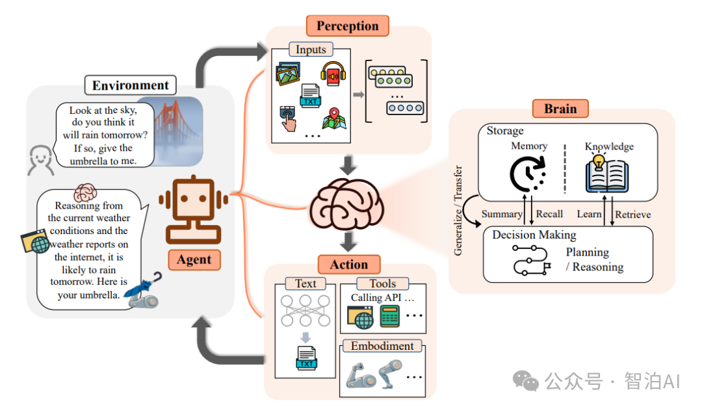

##### 3. 智能体的主要分类

根据输入模态和技术实现，GUI智能体可分为三类：

* **基于语言的智能体**：仅使用HTML/XML等文本描述作为输入

* **基于视觉的智能体**：仅使用屏幕截图作为输入

* **视觉-语言混合智能体**：同时使用屏幕截图和文本描述作为输入

其中，基于视觉的智能体（如SpiritSight）和视觉-语言混合智能体（如MobileFlow）因其跨平台兼容性和丰富的感知能力，正成为研究热点。

### 二、智能体的核心能力

现代智能体，特别是OS/GUI智能体，需要具备以下核心能力：

##### 1. 理解能力

内容理解能力特指智能系统准确解析用户指令、深度把握任务需求的核心技术指标。

在技术演进层面，近期创新成果如MobileFlow框架通过引入GUI思维链技术（GUI Chain-of-Thought），成功模拟人类多模态推理机制，使AI代理在跨界面交互场景中展现出类人的认知跃迁。

该技术突破不仅显著提升复杂任务的理解精度，更通过视觉-语义协同分析构建出动态推理路径，有效缩小了人机交互中的意图理解鸿沟。

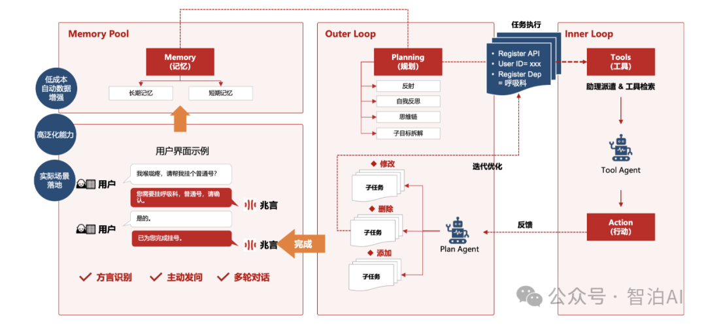

##### 2. 感知与定位能力

感知能力是智能体理解环境的基础。对GUI智能体而言，关键的感知挑战是元素定位（Element Grounding）：

* SpiritSight提出的Universal Block Parsing（UBP）方法解决了动态高分辨率输入中的歧义问题

* MobileFlow的混合视觉编码器支持可变分辨率输入，提高了对细节的感知能力

* OpenAI的ComputerUse则通过闭环视觉-操作系统直接分析整个屏幕并执行精确操作

##### 3.规划能力

规划能力是智能体将复杂任务分解为步骤序列的能力。根据OS Agent综述，规划方法分为两类：

* **全局规划：** 在任务开始前规划完整的操作序列

* **迭代规划：** 根据环境反馈动态调整操作计划

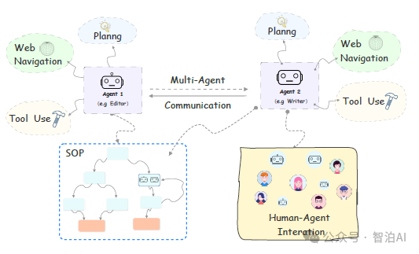

如MobileFlow采用的四步法（观察、推理、行动、总结）就是一种有效的迭代规划框架。

##### 4. 操作能力

操作能力是智能体执行具体行动的能力，典型的GUI操作包括：

* **鼠标/触摸操作：** 点击、长按、拖拽

* **键盘操作：** 文本输入、快捷键

* **导航操作：** 滚动、翻页、切换标签等。

### 三、 当前智能体技术前沿

##### 1. OpenAI的ComputerUse

OpenAI的ComputerUse是一项革命性技术，它使AI代理能够直接操作计算机界面：

* **技术原理：** 基于Computer-Using Agent (CUA)模型，结合GPT-4o的视觉能力和推理能力

* **工作流程：** 指令理解→动作生成→执行与反馈→状态理解→迭代改进

* **支持环境：** 浏 览器、macOS、Windows、Ubuntu（暂不支持移动平台）

* **应用场景：** 自动化测试、探索式测试、回归测试、跨平台一致性测试等。

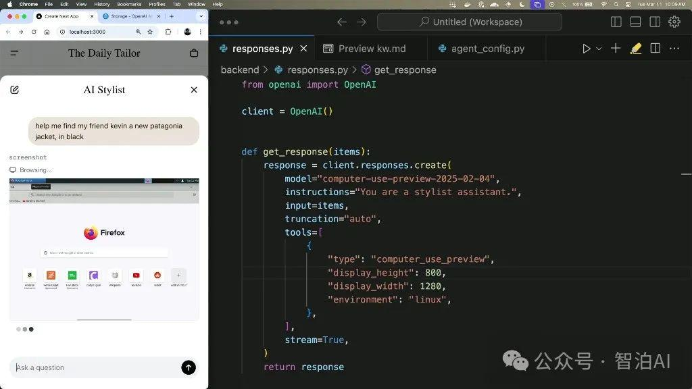

##### 2. SpiritSight：视觉导向的GUI智能体

SpiritSight代表了基于视觉的GUI智能体的最新进展：

* **核心创新：** 提出GUI-Lasagne多级大规模GUI数据集和Universal Block Parsing方法

* **技术特点：** 端到端、纯视觉感知，无需HTML/XML辅助

* **性能表现：** 在Multimodal-Mind2Web等多个基准测试中超越现有方法

* **跨语言能力：** 通 过小规模目标语言数据微调，可实现跨语言（如中文）GUI操作

##### 3. MobileFlow：移动设备专用智能体

MobileFlow专注于移动设备场景的智能体设计：

* **模型架构：** 基于Qwen-VL-Chat，采用混合视觉编码器，支持21B参数规模

* **技术特点：** 支持可变分辨率输入、良好的多语言支持、采用MoE结构

* **训练策略：** GUI对齐（定位、引用、问答、描述）和GUI Chain-of-Thought

* **实际应用：** 已在软件测试和广告预览审核等场景成功部署

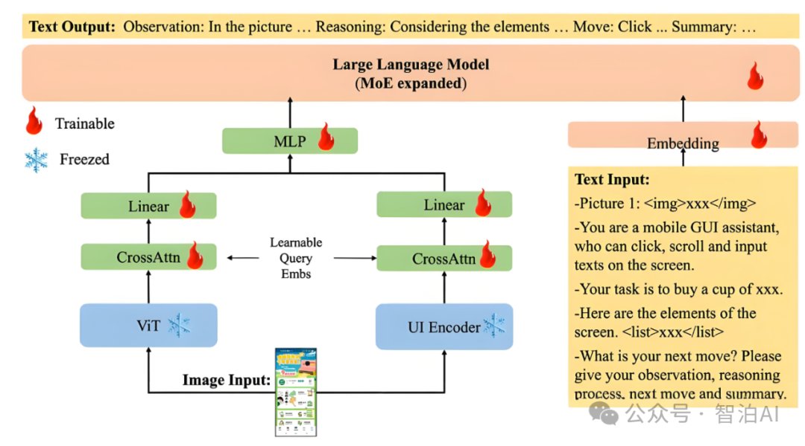

### 四、 智能体的应用场景

##### 1. GUI自动化测试

GUI自动化测试是智能体最成熟的应用场景之一：

* **探索式测试：** 智能系统通过自动化遍历算法对应用程序的功能模块和界面组件进行全面扫描，实时检测UI渲染异常、元素堆叠错误及交互响应失效等非预期状态。

* **回归测试：** 通过持久化存储操作轨迹，系统可动态适配UI变更并确保任务流完整执行

* **跨平台测试：** 同时在不同设备、浏览器或操作系统上验证功能

* **可视化报告：** 提供清晰的文本描述和截图，便于开发者理解问题

与传统自动化测试相比，智能体测试无需元素定位代码，适应界面变化，具有多模态理解能力和智能交互决策能力。

##### 2. 移动应用操作自动化

移动应用操作自动化是当前研究热点：

* **电商购物：** 自动完成商品搜索、比较、下单、支付流程

* **表单填写：** 自动填写各类注册表单、申请表单

* **内容聚合：** 从多个应用收集信息并整合

* **智能助手：** 执行复杂的多步骤任务，如预订旅行、安排会议等

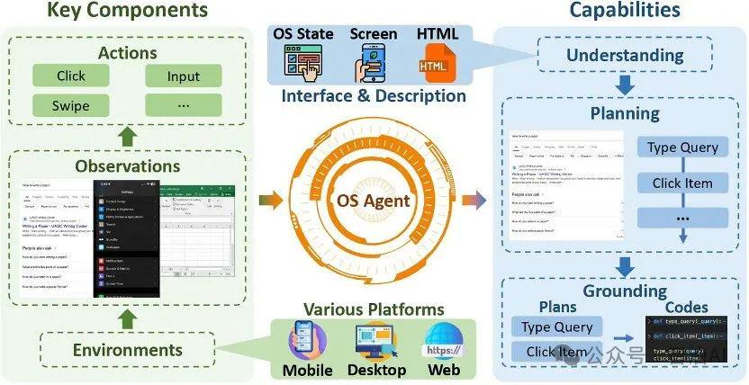

##### 3. 桌面系统任务自动化

桌面系统是智能体另一重要应用领域：

* **文档处理：** 自动创建、编辑、格式化文档

* **数据分析：** 执行数据收集、清理、分析和可视化流程

* **系统管理：** 管理文件、安装/卸载软件、系统配置等

* **创意工具：** 辅助图像编辑、视频剪辑等创意工作

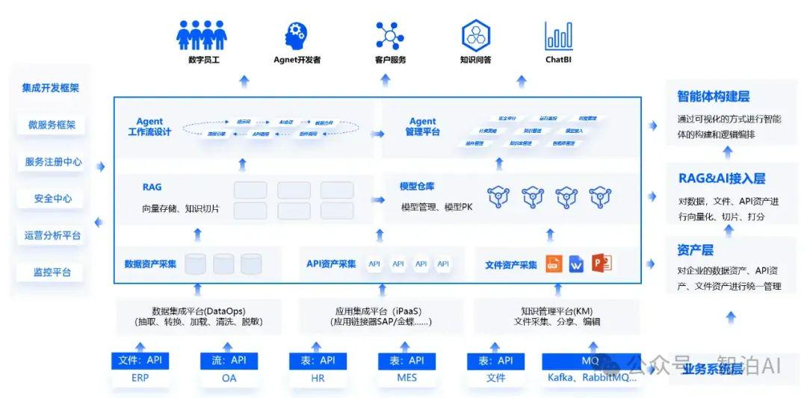

### 五、 智能体面临的挑战

##### 1. 技术挑战

当前智能体技术仍面临多项挑战：

* **可靠性问题：** 正如OpenAI指出，CUA模型在自动化操作系统任务方面的表现（38.1%）远低于浏览器任务

* **元素定位精度：** 尽管有UBP等新方法，元素定位仍是视觉智能体的核心挑战

* **长序列任务：** 完成需要多步骤、长时间操作的复杂任务时可靠性下降

* **复杂推理：** 涉及多页面、多条件判断的任务推理能力有限

* **多语言支持：** 非英语界面的理解和操作能力通常较弱

##### 2. 安全与隐私挑战

智能体技术也带来新的安全与隐私问题：

* **提示注入攻击：** 恶意网站或应用可能尝试通过界面元素实施提示注入攻击

* **隐私泄露风险：** 智能体在操作过程中可能接触敏感信息

* **操作权限管控：** 如何限制智能体只执行安全、授权的操作

* **潜在滥用：** 恶意使用智能体自动执行未授权操作

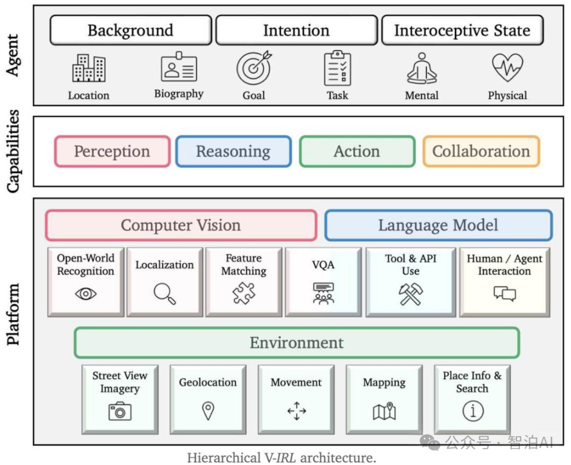

##### 3. 部署与集成挑战

将智能体技术应用到实际环境中也面临诸多挑战：

* **计算资源需求：** 高质量GUI智能体通常需要大型模型支持，计算开销较大

* **延迟问题：** 实时操作要求低延迟，但视觉分析和推理需要较高计算资源

* **系统集成：** 与现有工作流和系统的无缝集成需要额外开发

* **版本兼容性：** 应用界面不断更新，智能体需要持续适应新变化

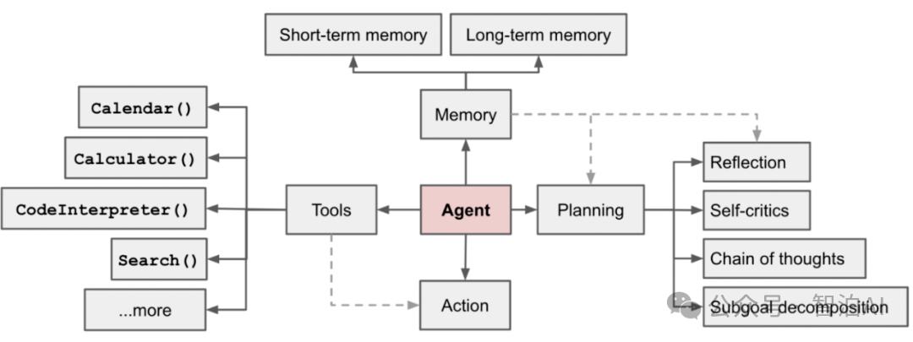

### 结语：智能体技术的影响与展望

GUI智能体技术正经历着颠覆性突破，从DeepMind的AutoGUI到Meta的VisionAgent和微软的TaskFlow，技术创新正以前所未有的速度跨越实验室与商业应用的鸿沟。

这些智能系统不仅革新了自动化办公和工业控制领域，更开创了跨设备、跨平台的无缝交互范式。随着多模态感知、场景建模与自适应学习技术的突破，智能体将逐步掌握工业级精密操作能力，在医疗诊断、智能制造等关键领域扮演核心角色。

尽管在数据隐私、系统兼容性和决策透明性等方面仍存在难题，但该领域的发展轨迹已清晰可见。

就像《银翼杀手》中设想的全息交互界面，如今已通过VisionAgent实现基础功能；《她》中描绘的智能助手雏形，也正在TaskFlow的对话式操作中初现端倪。

当技术奇点临近，具备环境认知与自主决策能力的数字伙伴，必将重构人机协同的终极形态。未来已来，只是尚未普及。

####

&#x20;

&#x20;&#x20;
