## **Autogen是什么**

AutoGen 是一个开源编程框架，用于构建 AI 代理并促进多个代理之间的合作以解决问题。AutoGen 旨在提供一个易于使用和灵活的框架，以加速代理型 AI 的开发和研究，就像 PyTorch 之于深度学习。它提供了诸如代理之间可以对话、LLM 和工具使用支持、自主和人机协作工作流以及多代理对话模式等功能。

## **环境准备**

### **1.部署 Autogen Studio**

项目地址：[<span style="color: rgb(36,91,219); background-color: inherit">https://github.com/microsoft/autogen</span>](https://github.com/microsoft/autogen)

官方文档：[<span style="color: rgb(36,91,219); background-color: inherit">https://microsoft.github.io/autogen/0.2/docs/autogen-studio/getting-started/</span>](https://microsoft.github.io/autogen/0.2/docs/autogen-studio/getting-started/)

中文文档：[<span style="color: rgb(36,91,219); background-color: inherit">https://www.aidoczh.com/autogen/docs/Getting-Started/</span>](https://www.aidoczh.com/autogen/docs/Getting-Started/)

一，Python 环境的准备

AutoGen Studio 依赖 Python 环境，这里建议大家使用 Anaconda 去管理 Python 环境，避免环境之间的冲突问题。

有的小伙伴不懂 Python，但并不妨碍我们学习 AutoGen，只要按照步骤来，谁都可以搞定。

**下载安装 Conda**

点击 [<span style="color: rgb(36,91,219); background-color: inherit">mirrors.tuna.tsinghua.edu.cn/anaconda/archive/</span>](https://mirrors.tuna.tsinghua.edu.cn/anaconda/archive/) 进入到[<span style="color: rgb(36,91,219); background-color: inherit">清华大学</span>](https://so.csdn.net/so/search?q=%E6%B8%85%E5%8D%8E%E5%A4%A7%E5%AD%A6\&spm=1001.2101.3001.7020)开源软件镜像站下载界面。

会发现有很多版本可选，用网页搜索功能搜索`2023.09-0`，以 windows 为例，下载 exe 安装文件。

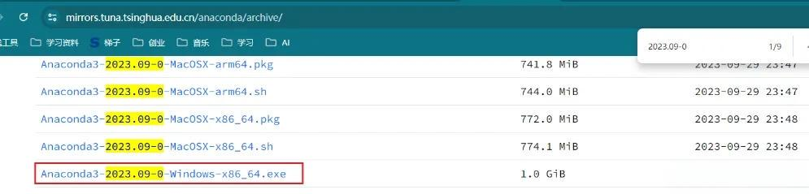

下载完成之后点击 exe 文件进行安装，安装非常简单。

**使用 anaconda 创建 python 环境**

windows 开始菜单搜索栏，搜索 prompt，搜索结果中可以看应用`Aanconda Powershell Prompt`。

打开这个应用。

接下来，我们将使用这个工具创建一个特定版本的 Python 环境。

在打开的命令行工具中输入如下命令，然后回车。

```plain&#x20;text
conda create -n autogenstudio python=3.10
```

<span style="color: rgb(143,149,158); background-color: inherit">-n 后面是的 autogenstudio 是环境的名称，相当于一个标识，后续要用这个环境时通过这个名称进行查找python=3.10，是指定 python 的版本</span>

执行命令创建环境的过程中，会有一次交互 (如下图)，命令行界面等待输入时，键盘输入字母`y`即可。

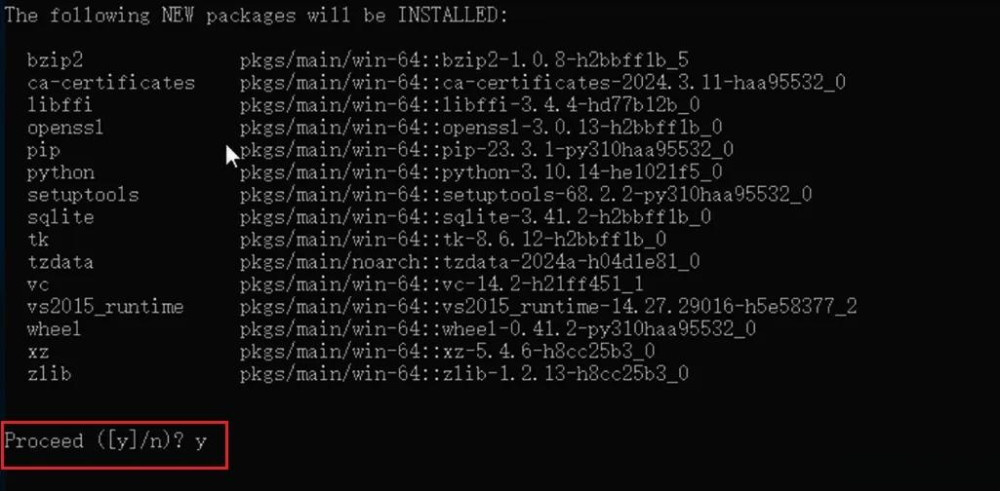

稍等片刻，知道有如下输出，说明环境创建成功。

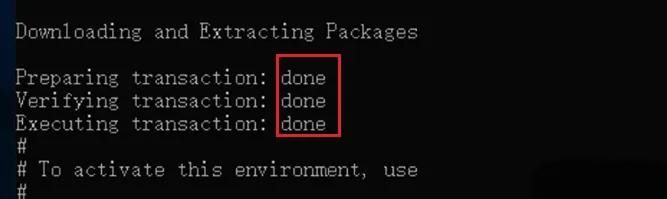

接下来，输入如下命令，切换到创建好的环境。

```plain&#x20;text
conda activate autogenstudio
```

顾名思义，这个命令的含义是激活我们刚刚创建好的环境，这个环境的名称是autogenstudio。

到此为止，Python 环境已经准备好了，非常简单吧。

**安装 Autogen Studio**

**1，下载 autogen studio**

接下来我们需要安装 Autogen Studio。

那怎么安装呢？超级简单，在刚刚我们准备好的 python 环境中执行一个命令就好。

```plain&#x20;text
pip install autogenstudio==0.1.5
```

但如果直接这样执行的话，因为它会访问国外的网站完成下载，所以速度非常慢，慢到不能忍受。

所以我们需要让它去国内的镜像下载。

通过参数`-i`指定国内镜像地址，我们使用阿里云的镜像。

上述命令就变成如下这样了。

```plain&#x20;text
pip install autogenstudio==0.1.5 -i https://mirrors.aliyun.com/pypi/simple
```

回车执行命令。

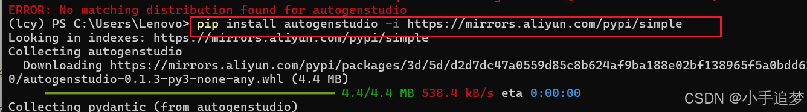

速度相当 OK，很快就完成下载和安装了。

**2，启动 autogen studio**

下载之后，使用如下命令启动 autogen studio 服务。

```plain&#x20;text
autogenstudio ui --port 6000
```

回车执行命令。

有如下输出，说明启动成功。

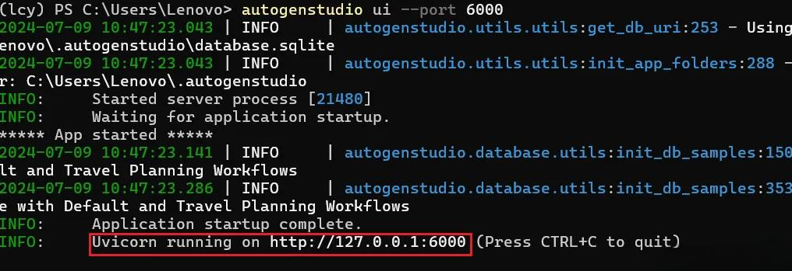

**3，访问 autogen studio**

从开始准备环境，到部署启动 Autogen Studio，大约半小时可以搞定。

启动成功后，在浏览器输入如下地址。

```plain&#x20;text
http://localhost:8081/build
```

即可看到如下界面。

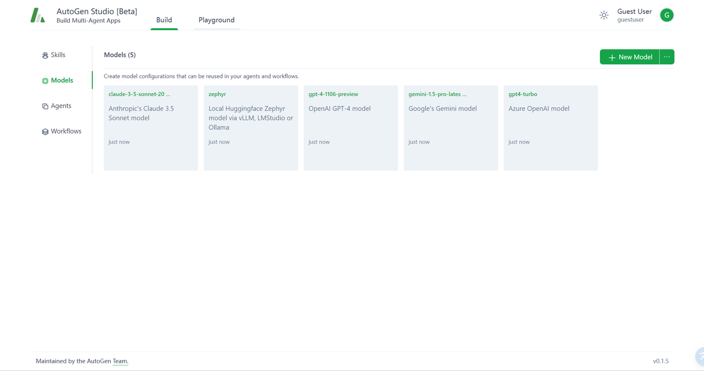

### **2.准备 Deepseek API Key**

**前提条件需要扣子 Coze 专业版账号**

第一步，登陆火山引擎扣子专业版后台

[<span style="color: rgb(36,91,219); background-color: inherit">https://console.volcengine.com/coze-pro/overview</span>](https://console.volcengine.com/coze-pro/overview)

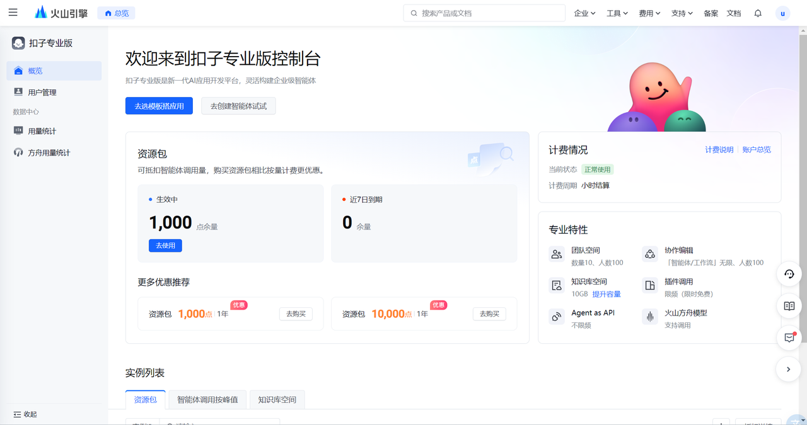

第二步，左上上角菜单进入「火山方舟」的模型广场找到「DeepSeek-R1」

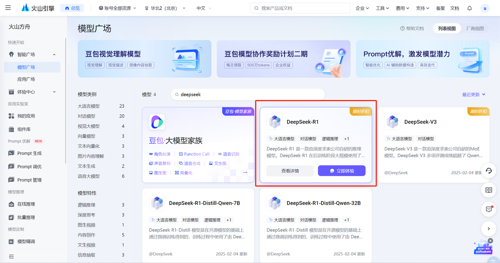

第三步，鼠标悬浮到该卡片上，点击「查看详情」可以看到不同版本。

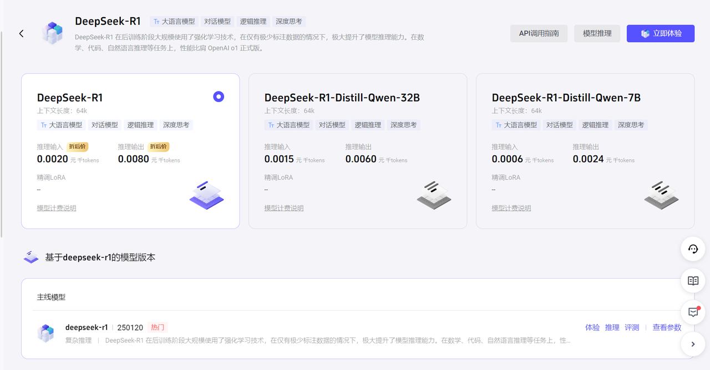

第四步，点击右上角「模型推理」在这里会看到无法「确认接入」原因是需要先开通模型，点击接入配置下方的立即开通链接。


勾选你需要的模型，然后勾选下方同意协议立即开通。

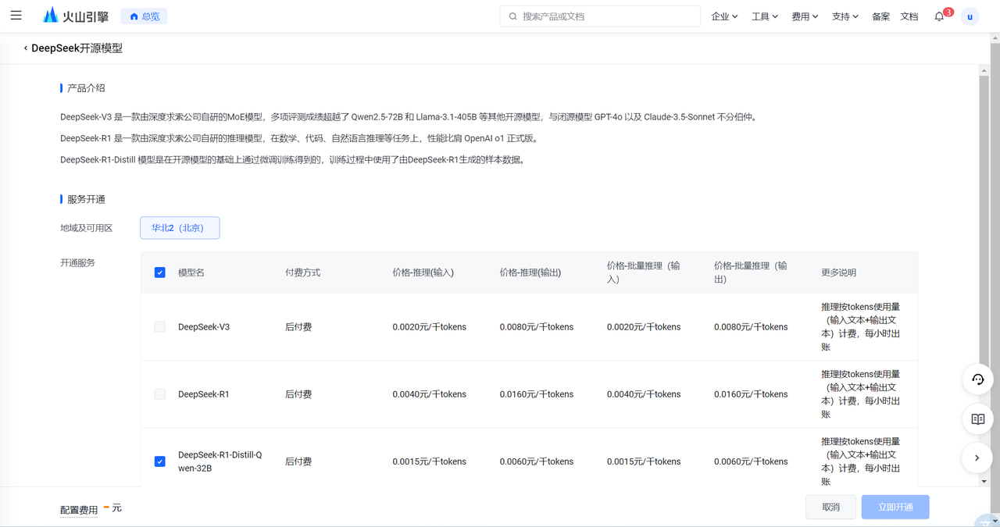

开通完成后点击确认接入。

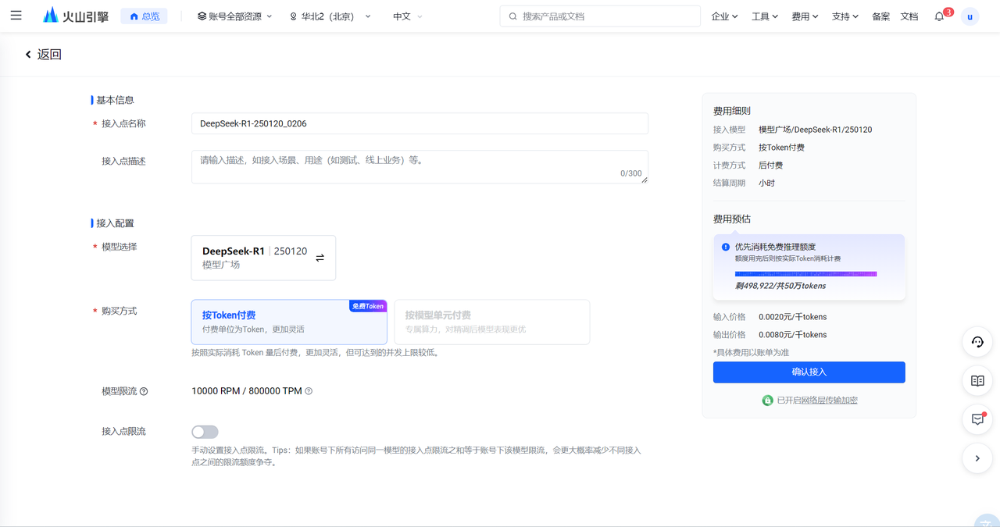

接入成功后可以在「在线推理」菜单看到

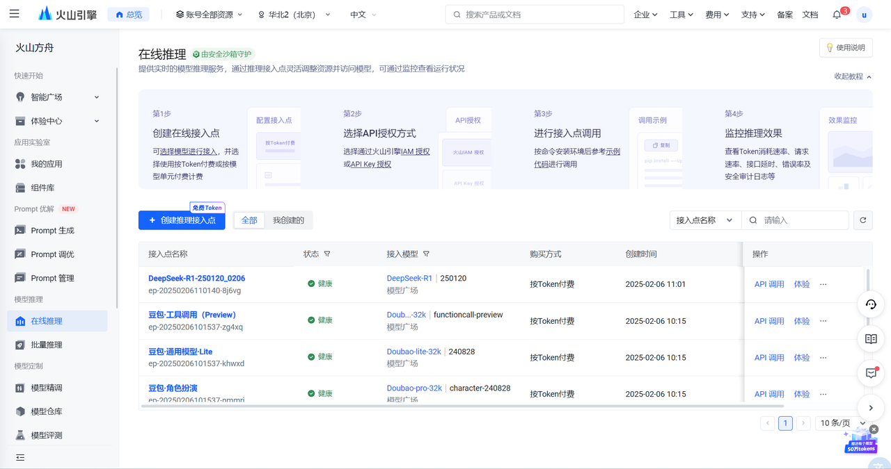

同时在「在线推理列表」的模型还支持 API 调用。

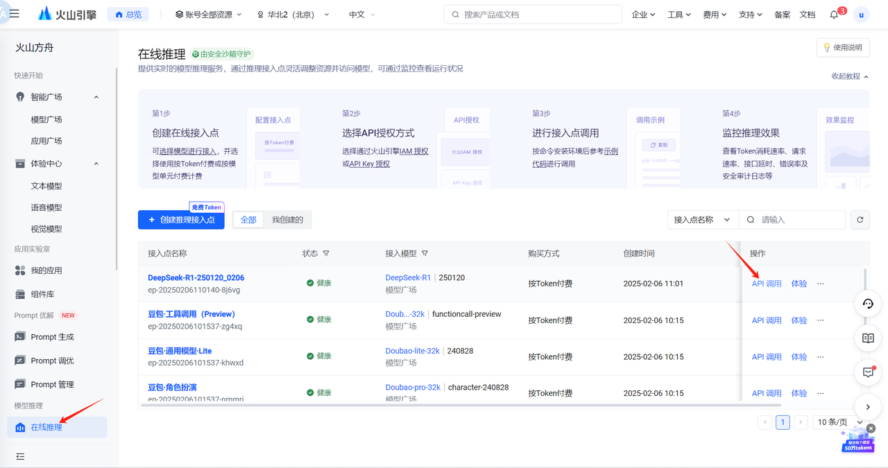

选择 API Key

请按如下方式设置 API Key 作为环境变量，其中 "YOUR\_API\_KEY" 需要替换为您在平台创建的 API Key

```plain&#x20;text
export ARK_API_KEY="YOUR_API_KEY"
```

火山方舟 v3 API 与 OpenAI API 协议兼容，您可以使用火山引擎官方 SDK，也可以使用 OpenAI SDK 或其他兼容 OpenAI API 协议的多语言社区 SDK 调用火山方舟推理服务。第三方 SDK 不由火山引擎团队维护，仅供参考

请参考如下示例代码进行调用

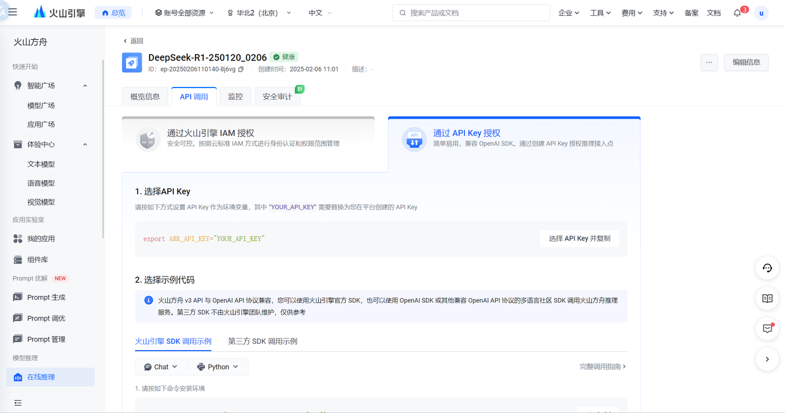

## **给 Autogen 的代理配置大脑**

智能体相当于一家公司，公司的工作通常是由多个人协作完成的，与此类似，智能体的工作是由多个代理协作完成的，从这个角度来看，代理可以类比为人。

注意，Autogen 中，代理是非常核心的概念。

既然把代理比作人，那么它一定有思考能力和推理能力，也就是说，它一定有大脑。

对，只不过代理的大脑是大模型。在我们的这个实验中，选择 Deepseek 作为代理的大脑。

所以，接下来，就是给代理配置大脑。

### **1，模型登记**

就像员工入职登记信息一样，首先要在 Autogen Studio 界面上登记 Deepseek 的信息。

如下图，在 Autogen Studio 的界面上，按照如下步骤打开登记界面 。

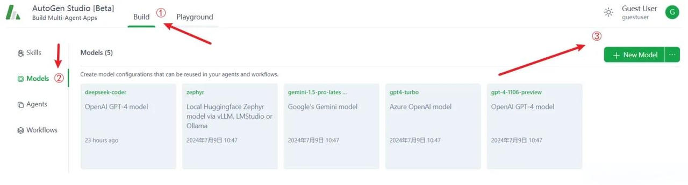

* ① 选择 Build

* ② 选 models 菜单

* ③ 点击 `New Model` 按钮

**模型登记界面如下。**

* ① 填写模型名称

* ② API Key，把之前创建好的 API Key 复制粘贴到这里即可

* ③ 接口地址，直接复制粘贴，不要修改：[<span style="color: rgb(36,91,219); background-color: inherit">https://ark.cn-beijing.volces.com/api/v3</span>](https://ark.cn-beijing.volces.com/api/v3)

* ④ 备注，按需填写即可

登记完成后，点击 `Test Model` 进行测试，校验信息是否准确。有如下提示，说明模型登记成功，点击`保存`即可。

.png)

### **2，给代理配置大脑**

目前，仅仅登记了大脑的信息，接下来得给代理装上这个大脑。

代理是怎么来的呢？

我们要打造的智能体 - AI 旅游规划师，是 Autogen Studio 中自带的智能体，所有的代理都已经创建好了，只是这些代理目前都没有大脑。

如下图，点击①Agents 菜单，切换到代理列表界面，`需要给如图所示2~6一共五个代理配置大脑`。

注意，第一个`代理user_proxy不需要大脑`，user\_proxy 只是前端接待和指令执行者，不需要动脑子。

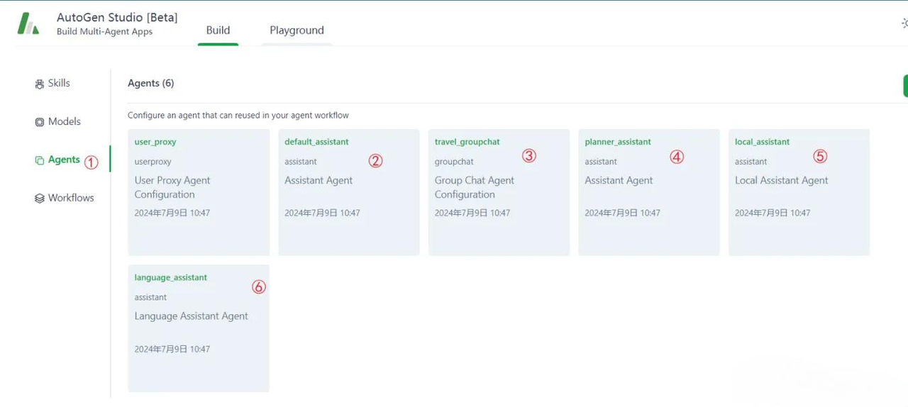

以给代理 default\_assistant 配置大脑为例，演示步骤，其他代理类似。

* ① 点击代理 default\_assistant

* ② 在弹出的浮窗中点击 Models，切换到模型选择界面

* ③ 点击`add`按钮

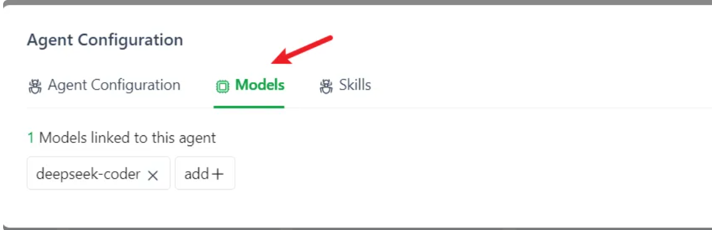

* ④ 在弹出的下来列表中选择 deepseek-code 模型作为代理的大脑

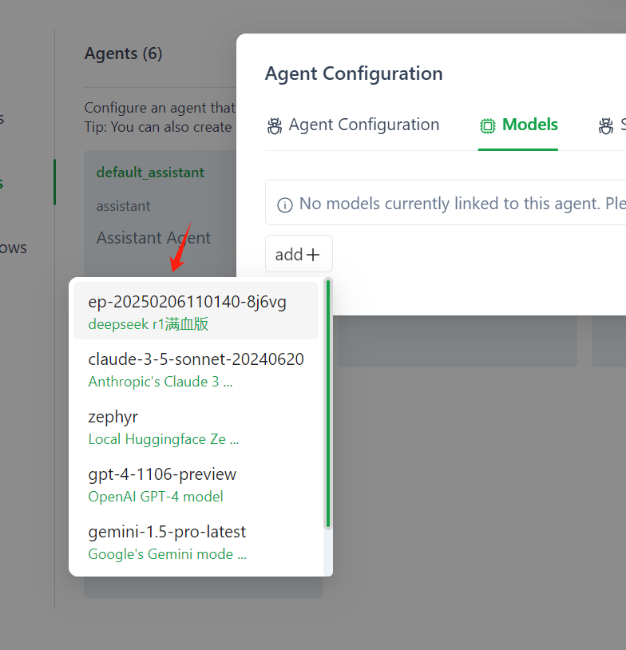

其实，到此位置，我们的智能体已经打造完成，接下来可以让 AI 旅游规划师开始工作了。

