## 一、工作流介绍

工作流是一系列可执行指令的集合，用于实现业务逻辑或完成特定任务。它为应用/智能体的数据流动和任务处理提供了一个结构化框架。工作流的核心在于将大模型的强大能力与特定的业务逻辑相结合，通过系统化、流程化的方法来实现高效、可扩展的 AI 应用开发。

扣子提供了一个可视化画布，你可以通过拖拽节点迅速搭建工作流。同时，支持在画布实时调试工作流。在工作流画布中，你可以清晰地看到数据的流转过程和任务的执行顺序。

### 1. 工作流与对话流

#### 1.1 介绍

扣子提供以下两种类型的工作流：

工作流用于处理功能类的请求，可通过顺序执行一系列节点实现某个功能。对话流是基于对话场景的特殊工作流，专门用于处理对话类请求。在应用中添加对话流，将对话中的用户指令拆分为一个个步骤节点，并为其设计用户界面，你可以搭建出适用于移动端或网页端的对话式 AI 应用，实现自动化、智能化的对话流程。

* 工作流（Workflow）：用于处理功能类的请求，可通过顺序执行一系列节点实现某个功能。适合数据的自动化处理场景，例如生成行业调研报告、生成一张海报、制作绘本等。

* 对话流（Chatflow）：是基于对话场景的特殊工作流，更适合处理对话类请求。对话流通过对话的方式和用户交互，并完成复杂的业务逻辑。对话流适用于 Chatbot 等需要在响应请求时进行复杂逻辑处理的对话式应用程序，例如个人助手、智能客服、虚拟伴侣等。

#### 1.2 区别

相较于工作流而言，对话流更适合处理对话场景下的交互逻辑。每个对话流都绑定了一个会话，运行时可以从此会话中读取历史消息，同时将本次运行对话流产生的消息记录在这个会话中，相当于一个拥有了记忆的工作流。

* 你如果需要搭建一个智能体，智能体本身支持上下文和会话能力，那么可以随意选择工作流或对话流。

* 如果你需要搭建一个对话式的 AI 应用，例如 AI 助手、智能体客服等基于对话方式交互的 AI 应用，扣子推荐你使用对话流，对话流中的大模型可以读取会话上下文、管理会话，还可以搭建对话式的用户界面，发布到各种社交通讯软件中。

* 如果你需要搭建一个工具类的 AI 应用，批量处理数据、实现任务流程的自动化，可以选择工作流实现。

二者的详细具体区别如下：

#### 1.3 常见问题

* 对话流和工作流可以互转吗

对话流和工作流可以互转。

* 对话流转为工作流之后，大模型、意图识别等涉及模型处理的节点不支持读取对话历史，也无法绑定会话；开始节点的预置参数也会转为普通参数，可以删除或修改。

* 工作流转为对话流之后，开始节点会添加两个预置参数 **USER\_INPUT** 和 **CONVERSATION\_NAME**，不可删除或修改。

* 对话流和工作流的节点有什么区别

对话流和工作流均支持扣子提供的所有节点，但节点配置略有差异。对话流的开始节点中需要指定一个会话，对话流中添加的大模型、意图识别等涉及模型处理的节点支持读取对话历史。

详细差异如下：

### 2. 节点

工作流的核心在于节点，每个节点是一个具有特定功能的独立组件，代表一个独立的步骤或逻辑。这些节点负责处理数据、执行任务和运行算法，并且它们都具备输入和输出。每个工作流都默认包含一个开始节点和一个结束节点。

* 开始节点是工作流的起始节点，定义启动工作流需要的输入参数。

* 结束节点用于返回工作流的运行结果。

通过引用节点输出，你可以将节点连接在一起，形成一个无缝的操作链。例如，你可以在代码节点的输入中引用大模型节点的输出，这样代码节点就可以使用大模型节点的输出。在工作流画布中，你可以看到这两个节点是连接在一起的。

.jpg)

在使用节点编排工作流时，灵活性和扩展性是实现高效编排的关键。工作流的开始节点、结束节点、输出节点、插件节点、子工作流节点、代码节点、SQL 自定义节点、新增数据节点、查询数据节点、更新数据节点、删除数据节点、问答节点、批处理节点、循环节点、变量聚合节点、变量节点、选择器节点均支持多种变量类型，包括 String、Integer、Number、Boolean、Object、File 和 Array等。你可以根据实际需求灵活选择合适的数据类型，而无需额外的数据转换，从而提升工作流编排的灵活性和扩展性。

### 3. 权限

工作流的所有者享有工作流的全部权限，包括编辑、发布和删除自己创建的工作流。团队成员可以查看和使用团队内的所有工作流，而团队所有者和管理员有权删除工作流。

默认情况下只有工作流的所有者才能编辑工作流，如需和其他团队成员一起编排工作流，所有者可以为工作流开启多人协作模式，并添加协作者，详情可参考权限说明。

### 4. 使用限制

使用工作流时，应注意以下限制。

## 二、使用工作流

工作流是一系列可执行指令的集合，用于实现业务逻辑或完成特定任务。你可以在智能体和应用搭建中通过工作流实现特定的任务或指令。

### 搭建工作流

无论是在智能体还是应用中使用工作流，都需要先创建一个可运行的工作流。

#### 步骤一：创建工作流

1. 登录[扣子平台](https://www.coze.cn/)。

2. 在左侧导航栏中选择**工作空间**，并在页面顶部空间列表中选择个人空间或团队空间。

   * 系统默认创建了一个个人空间，该空间内创建的资源例如智能体、插件、知识库是你的私有资源，其他用户不可见。你也可以创建团队或加入其他团队，团队内的资源可以和其他团队成员共享。更多信息，请参考工作空间概述。

3. 在**资源库**页面右上角单击\*\*+资源\*\*，并选择**工作流**。

4. 设置工作流的名称与描述，并单击**确认**。

   * **说明**

清晰明确的工作流名称和描述，有助于大语言模型更好的理解工作流的功能。

* 创建后页面会自动跳转至工作流的编辑页面，初始状态下工作流包含**开始**节点和**结束**节点。

* **开始**节点用于启动工作流。

* **结束**节点用于返回工作流的运行结果。

#### 步骤二：编排工作流

创建工作流后，你在画布中添加节点，并按照任务执行顺序连接节点。

工作流内置了多种基础节点供你使用，同时你还可以添加插件节点来执行特定任务。如果你在[插件商店](https://www.coze.cn/store/plugin?cate_type=recommend\&cate_value=recommend)中收藏了某些插件，则**添加节点**面板中将自动展示你所收藏的插件，便于你直接调用。

1. 在底部面板中选择要使用的节点

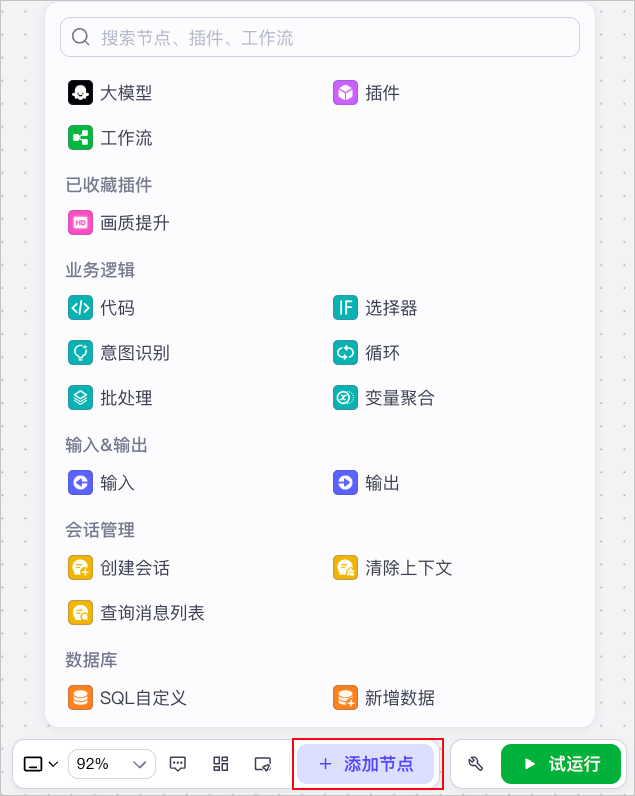

* 将各个节点相连接。

* 配置节点的输入和输出参数。

#### **步骤三：测试并发布工作流**

要想在智能体内使用该工作流，则需要发布工作流。

1. 单击**试运行**。

   * 运行成功的节点边框会显示绿色，在各节点的右上角可查看节点的输入和输出。

2. 单击**发布**。

**在智能体中添加工作流**

**添加工作流**

1. 前往当前团队的智能体页面，选择进入指定智能体。

2. 在智能体编排页面的**工作流**区域，单击右侧的加号图标。

3. 在**添加工作流**对话框，在**我创建的**页面选择自建的工作流。

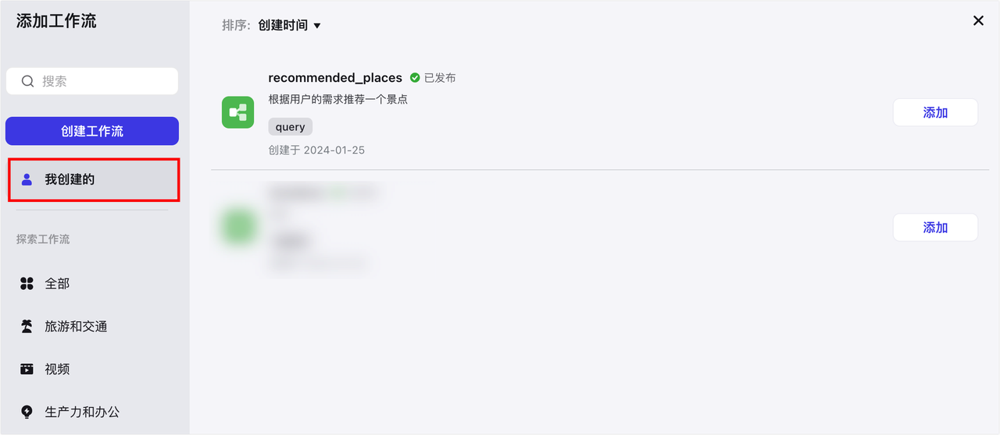

* 在智能体的**人设与回复逻辑**区域，引用工作流的名称来调用工作流。

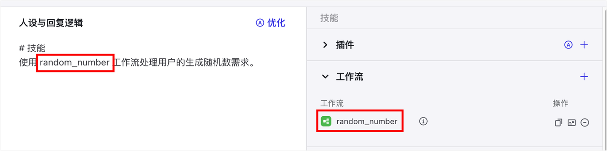

**设置工作流异步运行**

工作流默认为同步运行，即智能体必须在工作流运行完毕后才会将工作流的输出传递给智能体用户。如果工作流复杂，或包含一些运行耗时长的节点，可能会导致工作流整体运行耗时长，智能体判断为工作流运行超时，在其运行完毕前就结束对话。例如包含图像流节点、多个大模型节点，或编排逻辑复杂的工作流节点。

**说明**

* 如果工作流或节点运行超时，智能体可能无法提供符合预期的回复。各场景的超时时间说明如下：

* 未开启工作流异步运行：

* 工作流整体超时时间&#x4E3A;**&#x20;3&#x20;**&#x5206;钟，模型节&#x70B9;**&#x20;3&#x20;**&#x5206;钟，其他节点 1 分钟。部分插件节点超时时间可能 3分钟。

* 用户问题和智能体回复的时间间隔最长为 2 分钟，如果智能体回复耗时 2 分钟以上，智能体可能会判断工作流超时。如果工作流运行耗时大于 2 分钟，建议添加消息节点用于输出中间消息，或者结束节点开启流式输出，保持对话状态。

* 开启工作流异步运行后：工作流整体超时时间为 24 小时，模型节点 5 分钟，插件节点 3 分钟，其他节点 1 分钟。

* 工作流异步运行，仅在调试智能体或与商店中的智能体对话时生效，飞书、豆包等渠道暂不支持工作流异步运行。

* 工作流开启异步运行后，模型节点无法查看 Bot 对话历史。

在这种场景下，你可以设置工作流为异步运行，设置后，智能体对话不依赖工作流的运行结果。工作流异步运行时会默认返回一条预设的回复内容，用户可以继续与智能体对话，工作流运行完毕后智能体会针对触发工作流的指令做出最终回复。

开启异步运行：

1. 在指定工作流右侧单击**设置**。

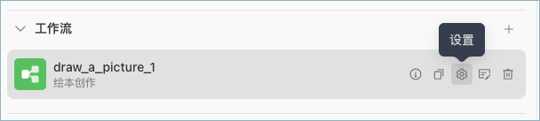

* 开启**异步运行**，并设置**回复内容**。

  * 回复内容是工作流在异步运行时，智能体回复用户的默认文案。

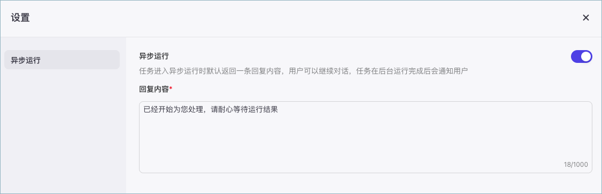

异步运行效果：

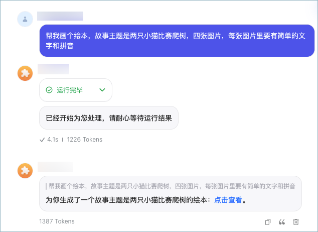

**在应用中添加工作流**

扣子支持在项目中创建一个新的工作流或复制一个已有的工作流使用。

在资源列表中，找到工作流，然后选择一种添加方式。

* **新建工作流**：在该项目中创建一个新的工作流。

* 新创建的工作流只能在项目中使用，无法共享给其他项目使用。

* **引入资源库文件**：复制一个项目所属的团队空间内已发布的工作流到该项目中使用。

* 复制后，你可以对这个工作流进行修改。在项目中对工作流的修改不影响资源库中的工作流。

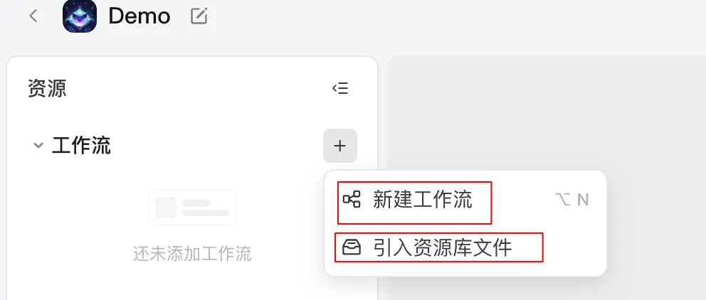

添加工作流后，你可以根据实际需求修改节点配置，或新增新的节点。

**管理工作流**

**复制工作流**

* 在某一工作流的编辑页面，单击右上角的**创建副本**图标，可以将该工作流复制到你的工作流列表中。

* 支持跨画布复制节点。

* 在画布中选择并复制已配置好的节点，然后切换到目标画布，直接粘贴即可。

**删除工作流**

对于不再需要使用的工作流，你可以在**工作流**列表内找到该工作流，并在**操作**列单击删除图标。

**注意**

如果工作流已添加至智能体，在删除时会同步删除智能体中的工作流。

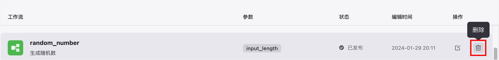

## 三、工作流节点

### 1. 开始和结束节点

开始节点用于开启触发一个工作流，而结束节点用于输出工作流的结果。

#### 1.1 **开始节点**

开始节点是工作流的起始节点，用于设定启动工作流需要的输入信息。开始节点只有输入参数，没有输出等其他参数。开始节点中默认有一个输入参数 BOT\_USER\_INPUT，表示用户在本轮对话中输入的原始内容。你也可以按需添加其他参数。

开始节点配置说明如下：

* **数据类型**：开始节点支持配置 String、Number 等多种类型的输入参数。其中 Object 类型的参数最多支持 3 层嵌套。

* **参数设置方式**：支持直接添加参数并设置参数名称，也支持导入 JSON 数据，批量添加输入参数。

* 如下图所示，点击导入图标后，在展开的面板中输入 JSON 数据，然后单击**同步JSON到节点**就可以自动导入输入参数。

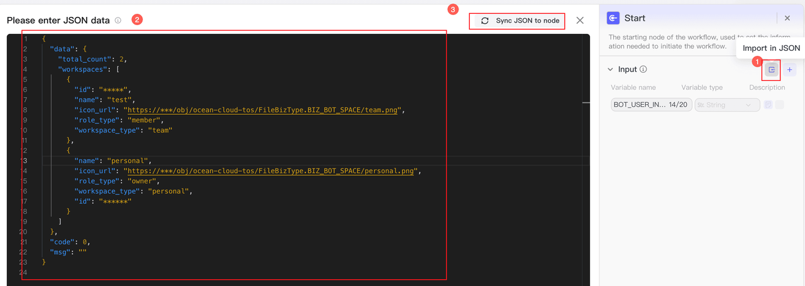

* **参数描述**：参数的描述信息，帮助模型理解传入的参数含义。将工作流绑定到智能体中使用时，模型会自动分析用户的 Query，将 Query 中表达的信息填入对应的参数中。

* **是否必选**：参数是否必选。如果未指定必选参数，无法开始执行工作流。将工作流绑定到智能体中使用时，用户 Query 中如果缺少必选参数，则不会触发工作流。

#### 1.2 **结束节点**

结束节点是工作流的最终节点，用于返回工作流运行后的结果。结束节点支持两种返回方式，即返回变量和返回文本。

**返回变量**

返回变量模式下，工作流运行结束后会以 JSON 格式输出所有返回参数，适用于工作流绑定卡片或作为子工作流的场景。如果工作流直接绑定了智能体，对话中触发了工作流时，大模型会自动总结 JSON 格式的内容，并以自然语言回复用户。

**返回文本**

返回文本模式下，工作流运行结束后，智能体中的模型将直接使用指定的内容回复对话。回答内容中支持引用输出参数，也可以设置流式输出。具体说明如下：

### 2. 大模型节点

大模型节点是扣子提供的基础节点之一，你可以在该节点使用大语言模型处理任务。

#### 2.1 节点说明

大模型节点可以调用大型语言模型，根据输入参数和提示词生成回复，通常用于执行文本生成任务，例如文案制作、文本总结、文章扩写等。

大模型节点依赖大语言模型的语言理解和生成能力，可以处理复杂的自然语言处理任务，你可以根据业务场景的需求选择不同的模型，并配置提示词来定义模型的人设和回复风格。为了更精准地控制模型生成的结果，你还可以在大模型节点中设置模型的参数，从而影响模型回复的文本长度、内容的多样性等。

#### 2.2 配置大模型节点

##### 技能

支持为大模型节点配置技能，添加插件、工作流或知识库，扩展模型能力的边界。大模型节点运行时，会根据用户提示词自动调用插件、工作流或知识库，综合各类信息输入后输出回复。

配置技能后，大模型节点的能力更接近一个独立运行的智能体，可以自动进行意图识别，并判断调用技能的时机和方式，大幅度提高此节点的文本处理能力和文本生成效果，简化工作流的节点编排。例如用户需求是某地区的穿搭推荐，通常需要先通过插件节点查询某地天气，再由模型节点根据天气情况生成穿搭推荐，现在你可以直接在大模型节点添加查询天气的插件，大模型会自动调用插件，查询天气并推荐穿搭。

##### 模型

选择要使用的模型。此节点的输出内容质量很大程度上受模型能力的影响，建议根据实际业务场景选择模型。可选的模型范围取决于当前的账号类型，基础版账号可以使用默认的几类模型，且存在对话数量限制，专业版账号可以使用火山引擎方舟平台的模型。

你还可以单击配置图标，调整模型配置。模型配置的详细说明可参考[设置模型](https://www.coze.cn/open/docs/guides/llm)。

##### 输入

需要添加到提示词中的动态内容。系统提示词和用户提示词中支持引用输入参数，实现动态调整的效果。添加输入参数时需要设置参数名和变量值，其中变量值支持设置为固定值或引用上游节点的输出参数。

在多轮对话场景中，你还可以开启智能体对话历史。执行此节点时，扣子会将智能体与当前用户的最近多条对话记录和提示词一起传递给大模型，以供大模型参考上下文语境，生成符合当前对话场景的回复。一问一答场景下通常无需开启此功能。

##### 系统提示词

模型的系统提示词，用于指定人设和回复风格。支持直接插入提示词库中的提示词模版、插入团队资源库下已创建的提示词，也可以自行编写提示词。编写方式可参考[编写提示词](https://www.coze.cn/open/docs/guides/write_prompt)。

编写系统提示词时，可以引用输入参数中的变量、已经添加到大模型节点的技能，例如插件工具、工作流、知识库，实现提示词的高效编写。例如{{variable}}表示直接引用变量，{{变量名.子变量名}}表示引用 JSON 的子变量，{{变量名\[数组索引]}}表示引用数组中的某个元素。

##### 用户提示词

模型的用户提示词是用户在本轮对话中的输入，用于给模型下达最新的指令或问题。用户提示词同样可以引用输入参数中的变量。

##### 输出

指定此节点输出的内容格式与输出的参数。输出格式支持设置为：

* **文本**：纯文本格式。此时大模型节点只有一个输出参数，参数值为模型回复的文本内容。

* **Markdown**：Markdown 格式。此时大模型节点只有一个输出参数，参数值为模型回复的文本内容。

* **JSON**：标准 JSON 格式。你可以直接导入一段 JSON 样例，系统会根据样例格式自动设置输出参数的结构，也可以直接添加多个参数并设置参数类型。

参数的名称和描述有助于模型在参数中正确返回匹配的内容。当存在多个输出参数时，建议为输出参数指定有意义的名称，并设置描述信息。例如用于改写 Query 的模型节点，可以设置输出参数为 new\_query，描述是改写后的 Query，另一个参数为 reason，描述是改写原因。

##### 异常设置

大模型节点支持**异常忽略**功能。开启此功能后，如果试运行工作流时此节点运行失败，工作流不会中断，而是继续运行后续下游节点。如果下游节点引用了此节点的输出内容，则使用此节点预先配置的默认输出内容。

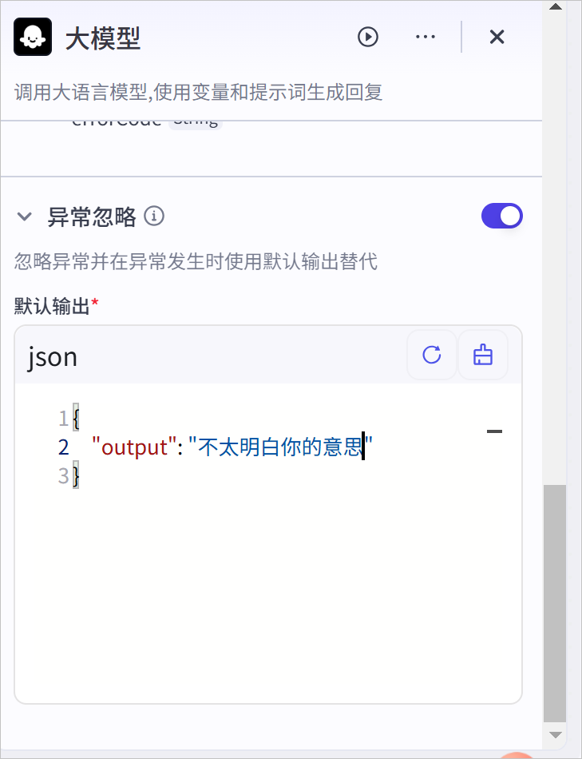

#### 2.3 常见问题

* 大模型节点配置技能，和直接使用插件等技能节点有什么区别？

区别如下：

* 大模型节点配置技能时，模型会根据用户的 Query 自动判断调用技能的时机与方式、判断执行技能时传递给技能的输入，整体流程更加灵活，是模型 Function call 能力的直接体现。

* 直接使用插件等技能节点时，工作流是开发者人工设计并配置的执行流程，调用技能的时机和方式是固定的，技能的输入也是开发者的指定输入内容，如果编排合理，相对于模型配置技能的场景整体效果更加稳定。

* 为什么模型输出和节点输出不一致，应如何处理？

参数的名称和描述有助于模型在参数中正确返回匹配的内容。当存在多个输出参数时，建议为输出参数指定有意义的名称，并设置描述信息。例如用于改写 Query 的模型节点，可以设置输出参数为 new\_query，描述是改写后的 Query，另一个参数为 reason，描述是改写原因。

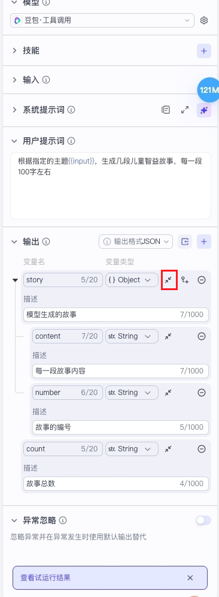

### 3. 插件节点

插件节点用于在工作流中调用插件运行指定工具。

插件是一系列工具的集合，每个工具都是一个可调用的 API。商店中的上架插件或已创建的个人或团队插件支持以节点形式被集成到工作流中，拓展智能体的能力边界。

#### 3.1 添加插件节点

在工作流画布下方单击添加节点，在弹出的节点面板中单击插件节点，并选择希望调用的插件。

.jpg)

你也可以在节点面板中找到已收藏的插件，选择插件工具，快速添加一个插件节点。

.jpg)

#### 3.2 配置插件节点

##### 输入与输出

插件节点的输入和输出结构取决于插件工具定义的输入输出结构，不支持自定义设置。在插件节点中你需要为必选的输入参数指定数据来源，支持设置为固定值或引用上游节点的输出参数。

插件节点运行时，会调用工具处理输入参数，并根据工具定义输出处理后的数据。你可以在输出区域右上角单击**查看示例**，查看输出参数的详细说明、完整的输出示例。

##### 模拟集

试运行工作流时，插件节点的输出默认使用真实的输出数据，你也可以选择使用模拟集的数据。模拟集是插件的模拟输出结果，每次试运行工作流时无需调用插件，直接使用数据集的数据作为后续节点的输入。支持自定义设置或 AI 自动生成模拟集。

##### 异常设置

插件节点支持**忽略异常**功能。开启此功能后，如果试运行工作流时此节点运行失败，工作流不会中断，而是继续运行后续下游节点。如果下游节点引用了此节点的输出内容，则使用此节点预先配置的默认输出内容。

#### 3.3 常见问题

* 如何批量执行插件？

插件节点默认单次运行，对于输入信息只做一次处理。可以使用批处理节点来一次性批量执行某个插件，支持设置每一批并行处理的数量和总处理次数，例如插件的功能是在知识库中上传文档，单次执行插件节点只能调用一次 API，批处理模式下可以批量调用 API 多次。

详细说明可参考批处理节点。

**说明**

批处理插件时需要注意，并行运行数量不应超过插件工具的调用频率限制，否则会导致部分任务处理失败

### 4. 工作流节点

扣子提供工作流节点，实现工作流嵌套工作流的效果。

#### 4.1 节点说明

在一个工作流中，你可以将另一个工作流作为其中的一个步骤或节点，实现复杂任务的自动化。例如将常用的、标准化的任务处理流程封装为不同的子工作流，并在主工作流的不同分支内调用这些子工作流执行对应的操作。工作流嵌套可实现复杂任务的模块化拆分和处理，使工作流编排逻辑更加灵活、清晰、更易于管理。

#### 4.2 输入与输出

工作流节点的输入和输出结构取决于子工作流定义的输入输出结构，不支持自定义设置。在工作流节点中你需要为必选的输入参数指定数据来源，支持设置为固定值或引用上游节点的输出参数。

#### 4.3 批处理

工作流节点默认单次运行，对于输入信息只做一次处理。你也可以设置此节点使用**Batch processing**模式，按照配置多次运行。每次运行都会分配参数值，直到达到次数限制或者列表的最大长度。

工作流节点批处理模式通常用于批量执行一系列任务，支持同时处理多个输入，可显著提高海量数据的运行效率。例如子工作流的功能是在文生图，单次执行工作流节点只能生成一张图片，批处理模式下可以批量生成多张图片。

批处理模式下，还可以设置以下参数：

* 批处理次数上限：批处理运行的次数上限，默认为 100 次。

* 并行运行数量：批处理的并发限制，即同时处理的任务数量，设置为 1 表示串行执行所有任务。

#### 4.4 异常设置

工作流节点支持**忽略异常**功能。开启此功能后，如果试运行工作流时此节点运行失败，工作流不会中断，而是继续运行后续下游节点。如果下游节点引用了此节点的输出内容，则使用此节点预先配置的默认输出内容。

## 四、触发器

您可以为智能体设置触发器（Triggers），使智能体在特定时间或接收到特定事件时自动执行任务。

### 1. 什么是触发器

触发器功能是智能体的预置任务，添加触发器后，智能体会在指定的时间和指定事件发生时自动执行任务。

### 2. 使用限制

* 一个智能体最多可添加 10 个触发器。

* 触发器功能仅对**飞书**渠道生效，只有将智能体发布到飞书渠道，才可以自动执行触发器的任务。

* 触发器绑定的工作流或插件应在 1 分钟内运行完毕，且工作流应关闭流式输出功能，否则触发器可能不会按照预期的方式运行，例如不推送消息、推送的消息不完整。

### 3. 用户设置定时任务

在智能体编排页面的**触发器**区域，开启**允许用户在与智能体对话时创建定时任务**开关，用户在与智能体对话时可以根据自然语言创建定时任务。例如发送一条消息每天早上8:00推送今天的新闻。

你也可以设置一条开场白预置问题，提示用户以对话方式创建定时任务。

.jpg)

### 4. 开发者添加触发器

在智能体的编排页面的技能区域，为智能体添加一个触发器。成功添加后，在指定时区的指定时间，智能体会按时执行预设的定时任务。

.jpg)

#### 4.1 定时触发器

单击+图标，添加一个触发器，并在**创建触发器**对话框，完成以下配置。

例如创建一个定时任务，每天8:00练习口语。

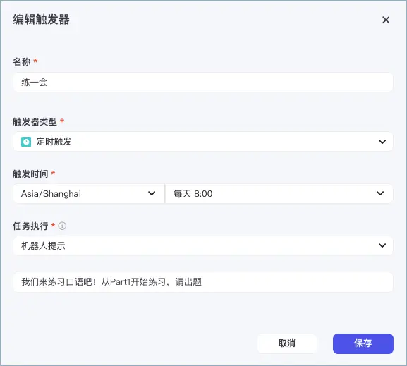

#### 4.2 事件触发器

在智能体的编排页面的技能区域，为智能体添加一个**事件触发**类型的触发器。成功添加后，如果你的服务端向触发器指定的 Webhook URL 发送 HTTPS 请求时，智能体会自动执行任务。

示例如下：

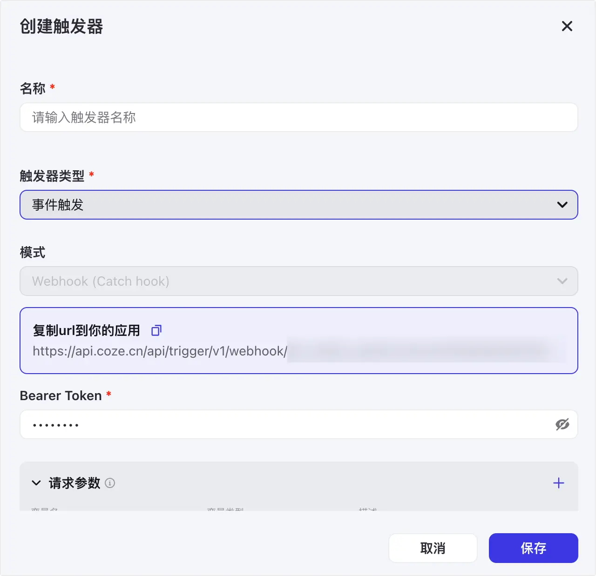

### 5. 试运行触发器

在开发调试阶段，您可以在智能体编排页面的**预览与调试**区域，单击**技能** > **触发器**，运行某一事件触发器，进行调试。

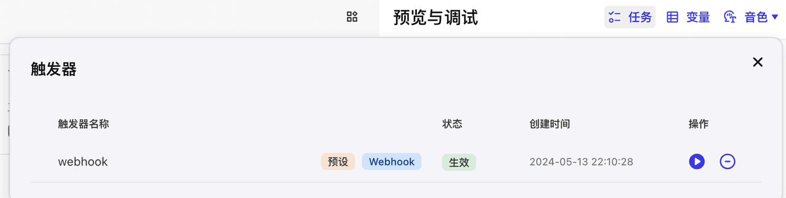

当智能体发布后，则需要向触发器的 Webhook URL 发送 HTTPS POST 请求，触发任务执行。

以 cURL 构成的 HTTPS 请求为例，格式如下：

* curl：命令行工具，支持通过 HTTP、HTTPS、FTP 等多种协议发送请求或接收数据。

* \--request POST ''：定义当前请求为 HTTPS POST 请求，其中 为占位符，您需要替换为触发器真实的 Webhook 地址（可在智能体的事件触发器详情页复制 URL）。

* \--header 'Authorization: Bearer '：请求头参数，通过 Authorization 完成请求校验来确保安全性，其中 为占位符，您需要替换为触发器真实的 Bearer Token。

* \--header 'Content-Type: application/json'：固定取值，用于定义消息体类型为 JSON。

* \--data ''：HTTPS POST 请求包含的数据内容。如果触发器内的插件或工作流需要输入参数，则需要将 占位符替换为 JSON 格式的请求参数体。

示例如下：

发送请求后，响应结果包含的 BaseResp 中的 StatusCode 为 0 表示请求成功。如果 StatusCode 不为 0，您可以通过 HttpCallBackRespDatas 获取错误信息，并根据错误信息作出相应调整。
