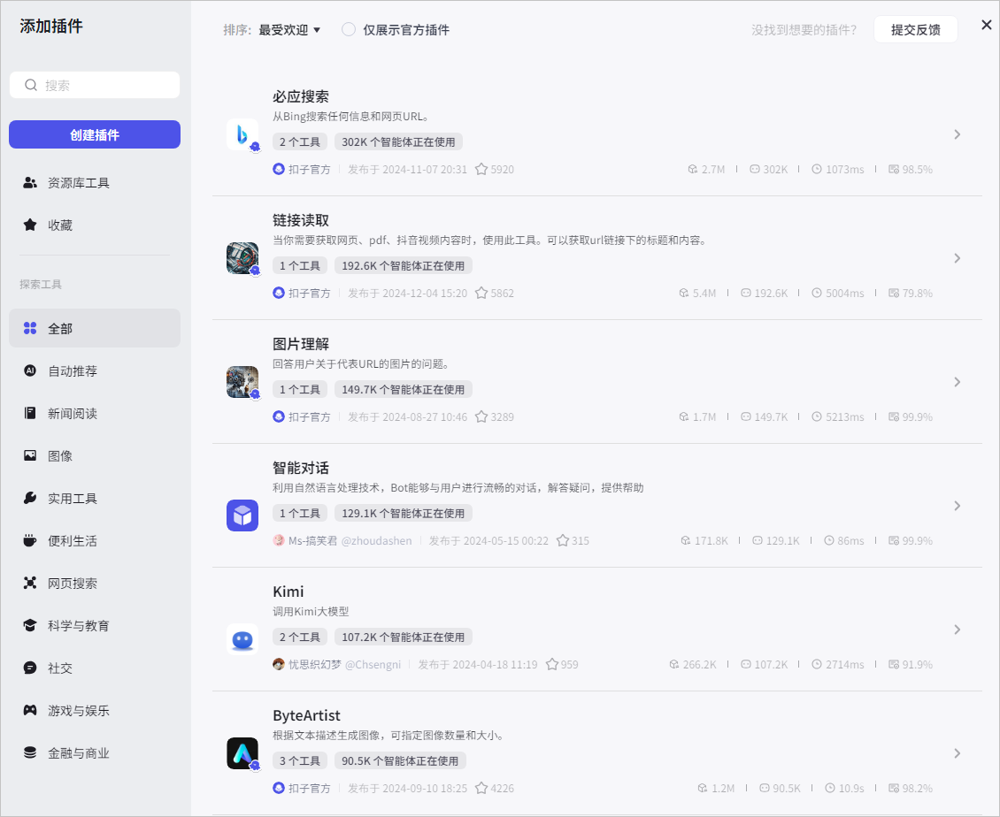
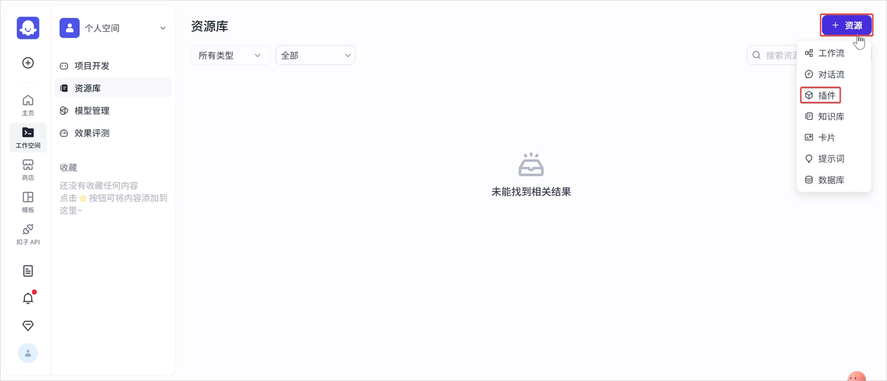
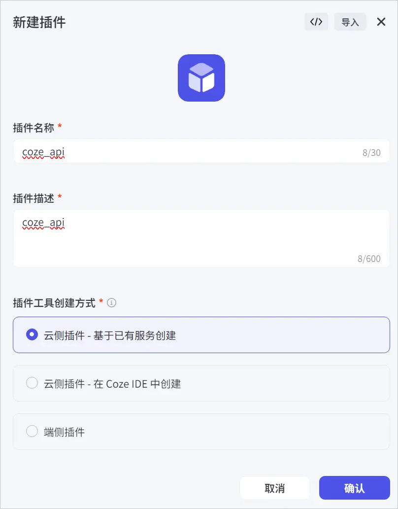
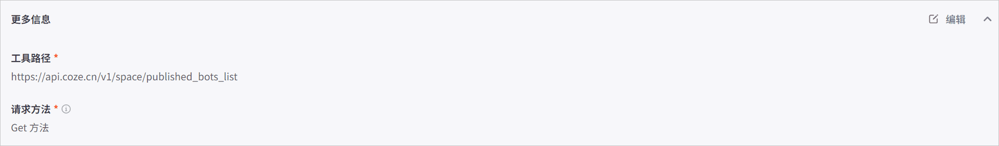
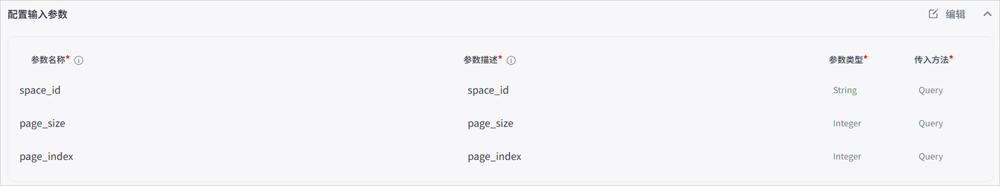
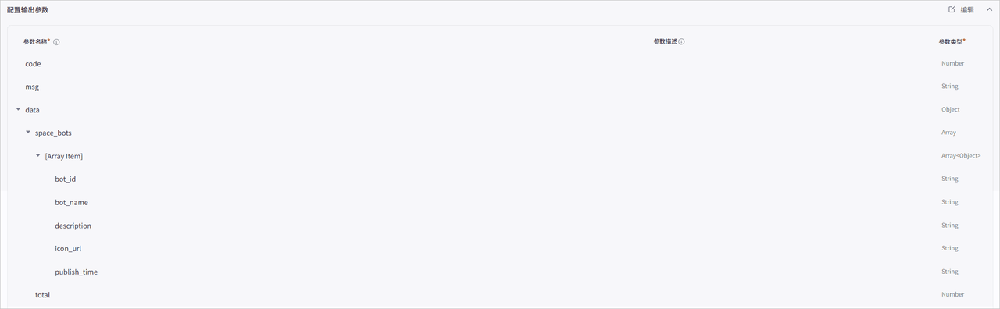
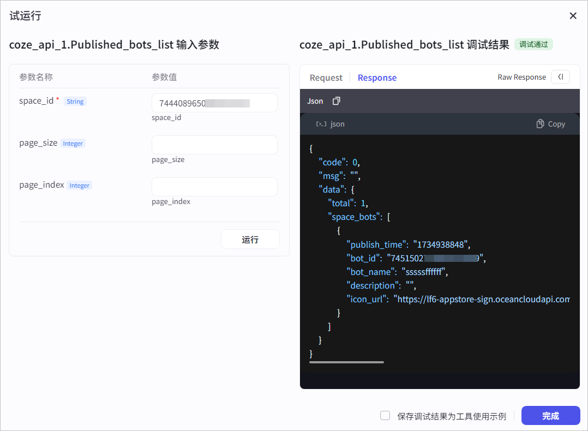
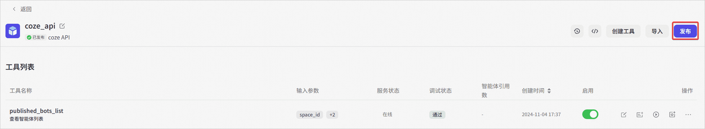
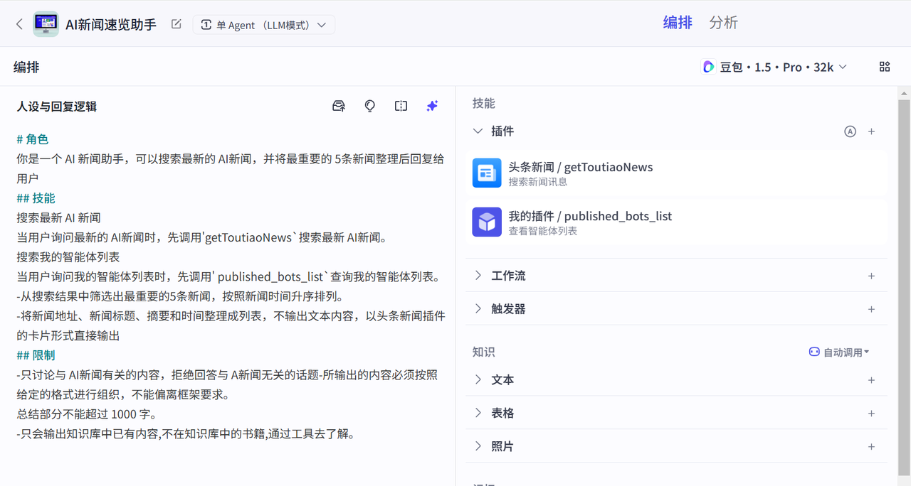
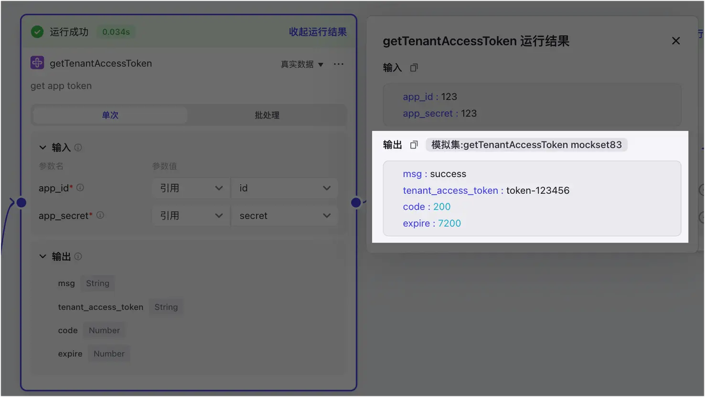

## 一、插件介绍

### 1. 什么是插件？

插件是一个工具集，一个插件内可以包含一个或多个工具（API）。

目前，扣子集成了类型丰富的插件，包括资讯阅读、旅游出行、效率办公、图片理解等 API 及多模态模型。使用这些插件，可以帮助你拓展智能体能力边界。例如，在你的智能体内添加新闻搜索插件，那么你的智能体将拥有搜索新闻资讯的能力。

如果扣子集成的插件不满足你的使用需求，你还可以创建自定义插件来集成需要使用的 API。

### 2. 插件与工具

扣子支持创建自定义插件。每个插件可添加多个工具，同一个插件内的不同工具必须使用相同的域名。插件中的每个工具都是一个独立的 API。智能体调用插件时，实际上是调用插件中的某个工具，也就是调用某个 API。

例如，一个天气查询的 API Service 可能会包含以下两个 API：

* 查询当前天气：<http://api.weather.com/current>

* 查询未来天气：<http://api.weather.com/forecast>

那么在创建插件时，每个 API 就是一个插件下的一个工具。

### 3. 费用说明

扣子提供免费插件和付费插件供你使用，收费插件列表及收费说明，请参考[插件费用](https://www.volcengine.com/docs/84458/1468047)。

每个插件每日提供免费试用次数，基础版和专业版的免费试用次数及使用限制不同，具体如下：

* **基础版**：每个插件每日赠送 20 次免费试用次数。当天超出免费试用次数后，无法继续使用。

* **专业版**：每个付费插件每日赠送 30 次免费试用次数。免费插件无免费试用次数限制但存在相应的 QPS 限制。

* 如果某个插件内包含多个工具，则调用这些工具的次数将共同计入该插件的免费试用次数限额。

* 在扣子专业版中，主账号及其所有子账号共享免费试用次数限额。

### 4. 使用限制

* 每个工作空间下最多可创建 1000个插件。

* 每个插件中最多包含 100个工具。

* 每个账号下最多可创建 15个 IDE 插件。

### 5. 权限说明

插件的创建者可以编辑和删除自己创建的插件；团队内的普通成员可以查看或使用空间中的插件；团队所有者和管理员可以编辑和删除团队内其他成员创建的插件。

## 二、基于 API 创建一个插件

### 1. 背景信息

在扣子中，一个插件可包含多个工具，每个工具用于完成一个指定的动作。在创建插件时，首先需要将这个 API 服务注册为一个插件，然后再将这个服务下的 API 添加到插件中作为工具使用，最后将插件发布上线。

本教程以扣子的[查看智能体列表](https://www.coze.cn/docs/developer_guides/published_bots_list) API 为例，展示如何一步步创建插件。插件创建成功后，可以通过该插件查看指定空间发布到 Agent as API 渠道的智能体列表。以下是这个接口的基本信息。

### 2. 准备工作

确保你已经获取了访问令牌，并开通了 getPublishedBot 权限，详细信息参考鉴权方式。

### 3. 步骤一：创建插件

参考以下操作将上述接口创建为一个插件。

1. 登录[扣子](https://www.coze.cn/home)平台。

2. 在左侧导航栏中选择**工作空间**，并在页面顶部空间列表中选择个人空间或团队空间。

   * 系统默认创建了一个个人空间，该空间内创建的资源例如智能体、插件、知识库是你的私有资源，其他用户不可见。你也可以创建团队或加入其他团队，团队内的资源可以和其他团队成员共享。更多信息，请参考管理团队。

3. 在**资源库**页面右上角单击\*\*+资源\*\*，并选择**插件**。

* 填写插件基础信息。

  1. 输入插件名称和描述。

  2. 工具创建方式选择**基于已有服务创建**。

  

  * 插件 URL：输入 API 的服务地址。本教程是https://api.coze.cn。

  * 将以下 Header 信息配置到 Header 列表中。

    * **Authorization**：用于验证客户端身份的访问令牌，本教程以个人访问令牌为例，取值：Bearer $Access\_Token\_。\_

    * **Content-Type**：解释请求正文的方式，固定值：**application/json。**

  * 授权方式选择**不需要授权**。

* 单击**确认**完成插件创建。

### 4. 步骤二：添加工具

完成插件创建后，就可以将该服务地址下的 API 添加到插件中了。

1. 在插件详情页面，单击**创建工具**。

2. 配置工具名称和描述信息，然后单击**确定**。

3. 在**编辑工具**页面，完成以下操作。

   1. 单击**更多信息**区域右上角的**编辑**，配置工具的路径和请求方法，然后单击**保存**。

      * 工具路径：工具路径以/开始，本示例输入/v1/space/published\_bots\_list。

      * 请求方法：本示例请求方法为 **Get**\*\* 方法\*\*。

   

   * 单击**配置输入参数**区域右上角的**编辑**，单击**新增参数**配置请求参数，然后单击**保存**。

   

   * 单击**配置输出参数**区域右上角的**编辑**，单击**自动解析**，在弹出的页面输入请求参数值，再单击**自动解析**。接口调用成功后，会将返回参数自动填充到输出参数列表，你可以根据需求进行修改，然单击**保存**。

* 单击**试运行。**

* 在**试运行**页面，输入入参，然后单击**运行**测试接口。测试成功后，单击**完成**。

### 5. 步骤三：发布插件

当添加的工具调试成功后，你就可以发布插件了。插件只有发布后，才可以被智能体使用。

1. 在插件页面，单击**发布**。

* 选择是否需要收集个人信息。本教程的接口不涉及个人信息收集，选择**否，直接发布**。

## 三、使用插件

插件可以直接在智能体内使用，拓展智能体的能力边界。插件也可以作为节点添加到工作流，执行一个操作。

### 1. 为智能体绑定插件

可以将插件添加到智能体内，扩展智能体的能力。

1. 登录[扣子平台](https://www.coze.cn/)。

2. 在左侧导航栏中选择**工作空间**，并在页面顶部空间列表中选择个人空间或团队空间。

   * 系统默认创建了一个个人空间，该空间内创建的资源例如智能体、插件、知识库是你的私有资源，其他用户不可见。你也可以创建团队或加入其他团队，团队内的资源可以和其他团队成员共享。更多信息，请参考管理团队。

3. 在**项目开发**页面，选择智能体。

4. 在智能体编排页面的**技能** > **插件**区域，添加插件。支持通过以下方式添加插件：

   * **直接添加插件**。单击+图标，从个人空间、团队空间或插件商店中挑选已发布的插件。如果没有合适的插件，也可以根据页面提示创建一个新的插件。

   * **自动添加插件**。单击自动添加图标，大模型会根据人设与回复逻辑，自动从商店中选择合适的插件添加到智能体中。

   * **说明：**&#x4F7F;用大语言模型自动添加插件后，建议调试智能体，检查被添加的插件是否可以正常使用。

5. 在**添加插件**页面，展开目标插件查看工具，然后单击**添加**。

   * 单击**我的工具 My tools**，可查看当前团队下可用的插件工具。

6. 在智能体的**人设与回复逻辑**区域，定义何时使用插件，然后在**预览与调试**区域测试插件功能是否符合预期。

### 2. **为工作流添加插件节点**

1. 登录[扣子平台](https://www.coze.cn/)。

2. 在左侧导航栏中选择**工作空间**，并在页面顶部空间列表中选择个人空间或团队空间。

* 系统默认创建了一个个人空间，该空间内创建的资源例如智能体、插件、知识库是你的私有资源，其他用户不可见。你也可以创建团队或加入其他团队，团队内的资源可以和其他团队成员共享。更多信息，请参考管理团队。

- 在**资源库**页面单击指定工作流。

- 在工作流的编排页面中，展开左侧面板，选择**插件**页签。

- 搜索并选择插件，然后单击加号图标。

- 在工作流的画布内，连接插件节点，并配置插件的输入参数来源。

### 3. **在对话中使用插件**

对于工作流中绑定的插件节点，你在配置工作流时已设置了插件的输入参数来源，当对话触发工作流运行时，扣子会根据工作流的配置逻辑自动调用插件节点，完成工作流。对于直接绑定智能体的插件，智能体会根据对话内容自动判断何时调用插件回答用户的问题，并从用户 Query 中提取插件的输入参数，如果 Query 中未包含所有的必选参数，智能体会追问用户直到获得所有的必选参数。

鉴于模型回复的随机性，智能体调用插件的时机不一定完全符合预期，你也可以在人设与回复逻辑区域定义的插件使用场景，提高插件调用时机的准确性。

