## 一、AI 客服智能体的优势

随着大语言模型能力的提高，智能客服已成为生成式 AI 的典型应用场景之一。与传统的智能客服机器人相比，基于 AI 能力的智能客服无论是用户使用体验还是维护成本上都有着显著优势。扣子平台集成了丰富的大语言模型供你选择，可快速生成问答能力。此外，扣子平台的开放能力和丰富的 AI 应用搭建能力，极大地简化了客服智能体的搭建和维护成本。

## 二、扣子智能客服模板介绍

基于扣子平台的官方智能客服——扣子助手的最佳实践和经验沉淀，扣子平台将扣子助手制作成智能体模板，方便开发者一键复制和定制改造。

### 1. 业务流程

扣子智能客服智能体解决了智能客服在落地过程中的共通痛点问题：

* 无法准确识别用户意图并做出分类解答。

* 无法准确召回企业知识库进行正确回复。

* 无法高效分析智能客服回复效果并及时更新知识库。

下图展示了扣子助手智能体的流程。

1. 当用户向小助手发起咨询后，小助手会首选判断用户咨询的问题是否与扣子产品有关。

2. 如果是扣子使用的相关问题，则调用扣子知识库查找相关说明并使用大模型能力进行总结和回复。并且将消息记录写入到多维表格中，进行自动分析。

3. 如果不是扣子使用的相关问题，则直接调用大语言模型进行回复，且不进行问题记录。

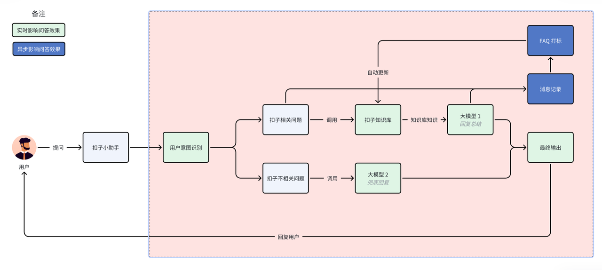

### 2. 实现流程

扣子助手智能体使用的是工作流模式（workflow-as-agent），工作流整体编排如下。

#### 2.1 问题分发

通过意图识别节点判断用户意图，将问题分发到对应的分支处理。

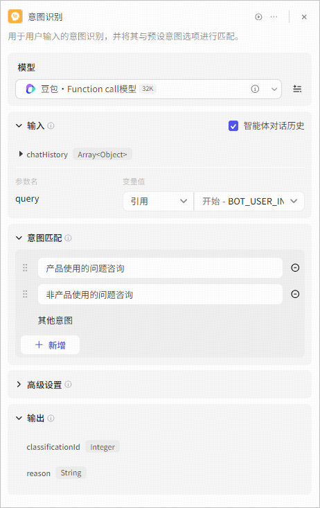

各节点说明如下：

#### 2.2 处理产品相关问题

大模型参考历史对话改写用户的 Query，再根据 Query 检索知识库，并由大模型进行总结和输出。用户 Query、大模型回复均通过插件记录在指定的飞书多维表格中。

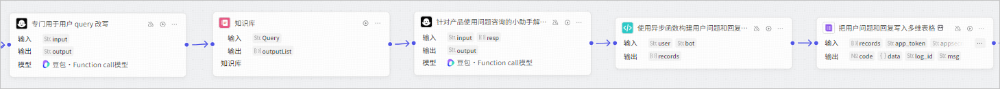

各节点说明如下：

#### 2.3 处理其他问题

此分支中只有一个大模型节点，用于当用户咨询非产品问题时进行回复。

实现方式：定义一个具备产品基础知识的回复助手。

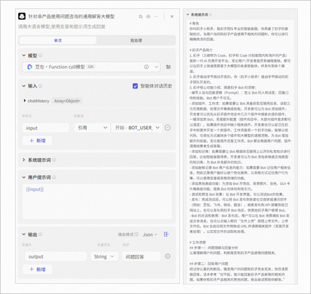

## 三、使用扣子智能客服模板

### 1. 准备工作

#### 1.1 创建飞书应用

扣子助手智能体模板中使用飞书应用将智能体的用户问题写入到多维表格中。因此，你需要创建一个飞书应用。

1. 登录飞书开发者后台。

2. 单击**创建企业自建应用**，根据引导完成应用创建。更多详细信息可参考[创建自建应用](https://open.feishu.cn/document/home/introduction-to-custom-app-development/self-built-application-development-process)。

3. 在应用配置页面，单击**权限管理**，应用开通多维表格的读写（新增记录和查看、评论、编辑和管理多维表格）权限。

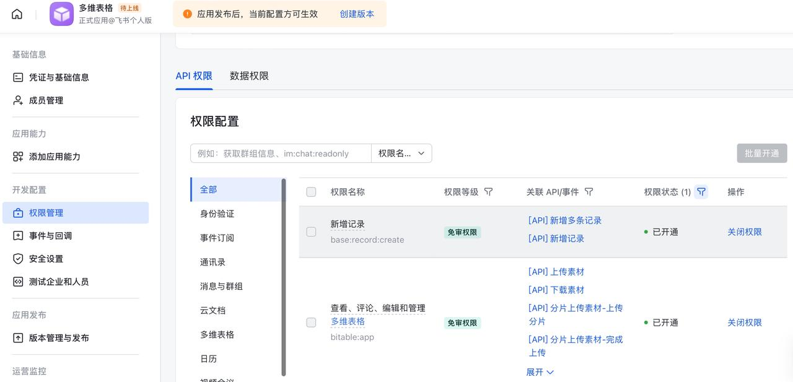

1. 单击**版本管理与发布**，创建一个版本并完成应用发布。

2. 单击**凭证与基础信息**，复制应用 App ID 和 secret。

该 App ID 和 secret 会在后续的工作流配置中使用到。

#### 1.2 创建并配置飞书多维表格

扣子助手智能体模板中使用飞书多维表格来记录用户问题，并使用飞书多表格的 AI 能力自动实现问题分析。

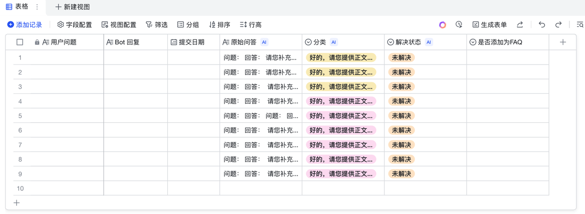

为了方便体验，你可以使用我们提供的多维表格模板，快速复制一个多维表格。

1. 访问[ 小助手用户问题记录](https://ncpkm88jg5.feishu.cn/base/IRhBbIsCkaqxUSsS0GictKoLnze?from=from_copylink)打开小助手用户问题记录多维表格模板。

2. 单击**使用该模板**复制一个多维表格文档，并修改复制的多维表格名称。

3. 单击**设置**图标，选择**更多 > 添加文档应用**，然后选择上一步中已发布的飞书应用。

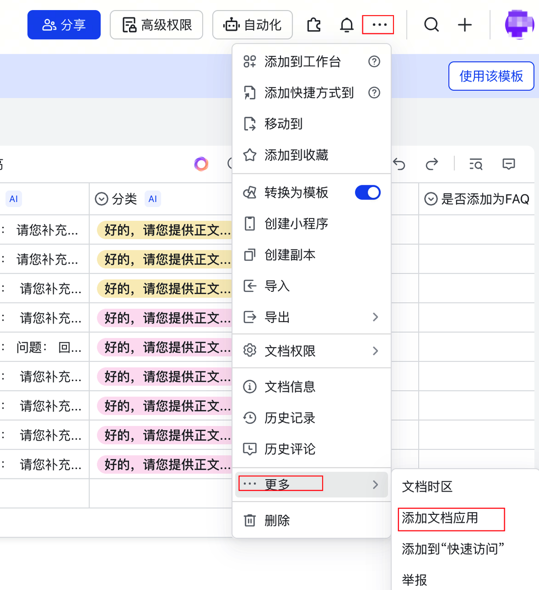

1. 给飞书应用授予**编辑**权限。

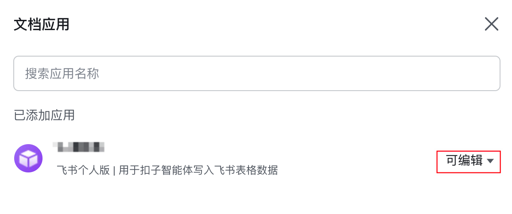

#### 1.3 配置表格数据同步

当小助手发布后，你可以将小助手记录在多维表格中的有效问题，通过自动化的方式自动同步到这个常见问题文档中。

我们可以借助飞书机器人指令模板来搭建一个数据同步流程，将小助手的多维表格问答记录中**添加为 FAQ 数据标注为是**的问答记录同步到一个常见问题的飞书表格中。

1. 创建一个飞书表格文档，并添加常见问题和解决方案两个字段。

1) 访问[飞书应用中心](https://app.feishu.cn/app/cli_9d4d38c2a8bd5102)。

2) 搜索**飞书机器人助手**，然后单击**获取**，根据引导完成应用安装。

3) 打开[飞书机器人助手页面](https://botbuilder.feishu.cn/home)。

4) 在**机器人指令**页签下，找到**多维表格跨表数据同步**，然后单击**使用模板**。

1. 在展示的指令配置页面，删除第一个节点。

2. 单击触发器选择框，然后选择**多维表格内容变更**。

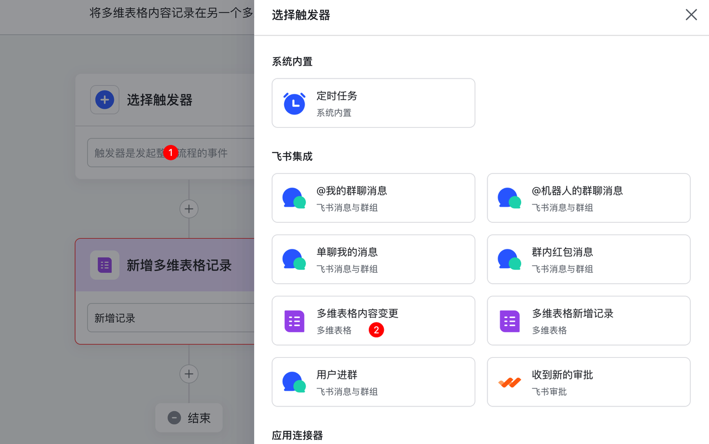

1. 单击**由数据表内容变更触发**文本框，然后选择用于记录小助手问答的多维表格，将条件设置为\*\*添加为 FAQ \*\*为“是”时触发。

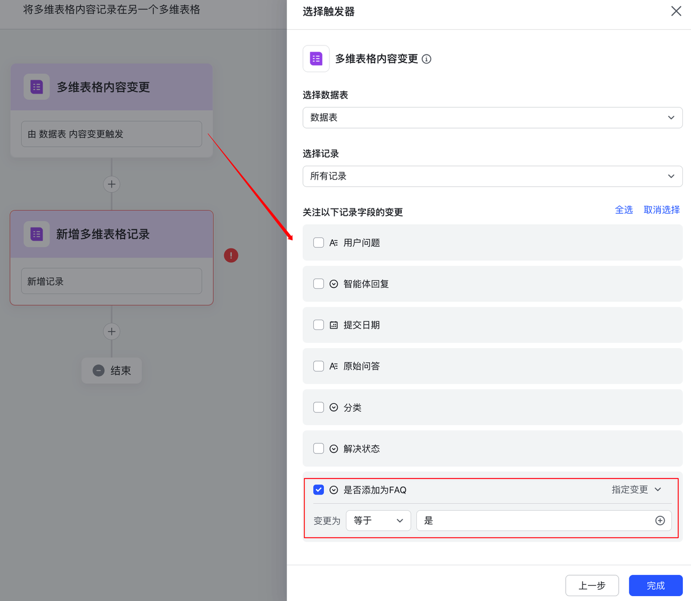

1. 删除第二个节点，参考上述步骤，添加**新增电子表格记录**事件。

2. 单击**新增记录**文本框，然后选择步骤一中创建的飞书表格文档，将多维表格中记录的用户问题和回复写入到这个表格中。

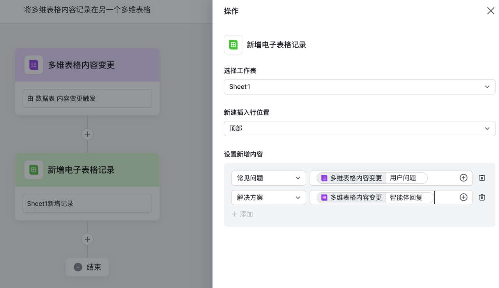

1. 单击**启用**。

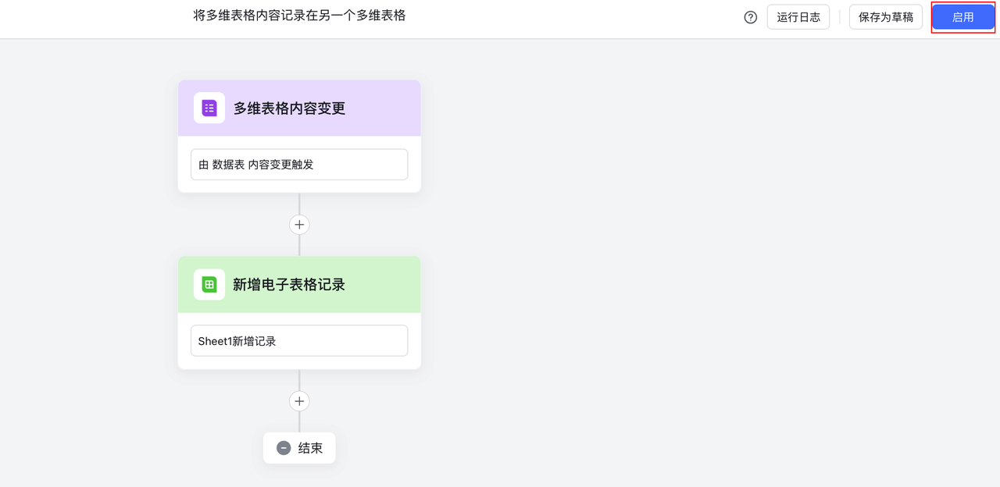

启用后，每次当你将一条多维表格中记录的**添加为 FAQ 标记为是**时，该条记录就会自动写入到飞书表格中。

完成以上准备工作后，你就可以通过扣子助手模板快速搭建一个智能客服智能体了。

### 2. 创建知识库

RAG （Retrieval-Augmented Generation 检索增强生成）技术被广泛应用于问答类型的智能体搭建中。RAG 指的是在回答问题或生成文本时，先从大规模文档库中检索相关信息，然后利用这些检索到的信息来生成响应或文本，从而提高回复内容的质量。

RAG 的两个关键阶段：

* **检索阶段**：使用编码模型基于问题检索相关文档。

* **生成阶段**：使用检索到的上下文作为条件生成文本。

RAG 技术的应用可以很好地解决大模型的胡乱编造的问题，即让大模型在回答用户问题前先参考知识库中的相关内容，可极大抑制大模型的幻觉现象。

扣子的知识库功能支持上传外部数据，上传后可自动分段和编码，实现 RAG 对话。因此，在开始搭建客服智能体前，你需要先收集和整理要上传至知识库的产品资料。

当你准备好知识库内容后，可以先将这些资料上传至知识库。

#### 2.1 上传在线资料

参考以下操作，将产品相关的在线资料上传至扣子知识库中。本教程中以一个火山引擎产品的帮助文档为例。

1. 登录[扣子](https://www.coze.cn/)平台。

2. 选择一个工作空间。单击**知识库**页签。

3. 在**知识库**页面，单击**创建知识库**。

4. 在**创建知识库**页面，选择**文本格式**，然后输入一个知识库名称，再选择**在线数据**，最后单击**下一步**。

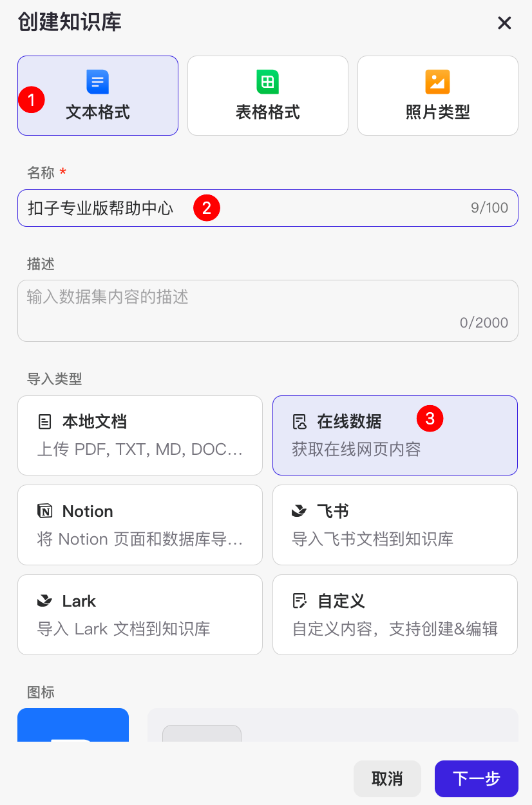

1. 选择**自动采集**，然后选择**批量添加**方式，输入帮助中心的地址，再单击**导入**。

2. 选择要导入的内容，然后单击**确认**。全部内容上传完成后，单击**下一步**。

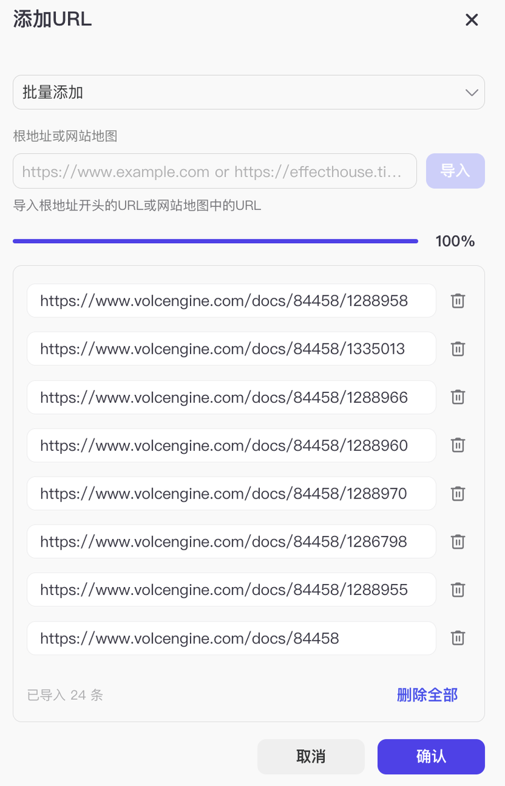

1. 分段方式选择**自动分段与清洗**，然后单击**下一步**。

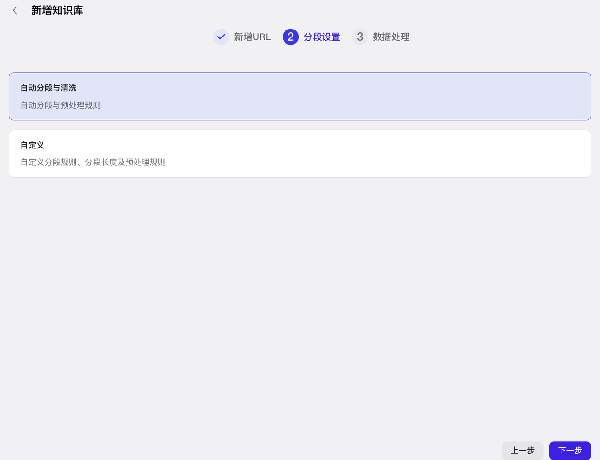

1. 单击**确认**完成知识库内容创建和分段。

#### 2.2 上传飞书表格文档

在本模板中，需要添加一个表格文档记录产品使用的常见问题。这些常见问题从小助手的问答记录中整理而来，作为知识库内容提升问题回复的准确性和覆盖度。

参考以下操作创建表格文本知识库：

1. 在**知识库**页面，单击**创建知识库**。

2. 在**创建知识库**页面，选择**表格格式**，然后输入一个知识库名称，再选择**飞书表格**，最后单击**下一步**。

3) 如果你是第一次上传飞书文档，根据提示完成授权。

4) 选择已创建的飞书表格文档并选择自动更新频率，然后单击**下一步**。

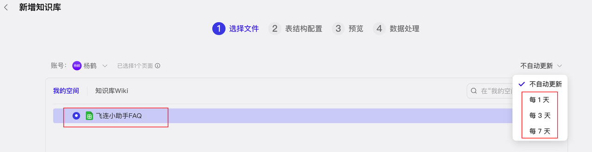

5. 配置表格结构，将用户问题配置为索引列，然后单击**下一步**。

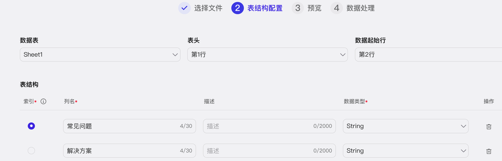

6. 根据引导完成上传。

### 3. 复制并修模板配置

完成知识库内容准备后，就可以复制模板进行智能体搭建了。

#### 3.1 复制模板

1. 打开[扣子助手](https://www.coze.cn/template/agent/7416353271499096116?)智能体，然后单击**复制**。

2. 选择智能体的所属空间并输入一个智能体名称，然后单击**确定**。

3. 在复制的智能体编排页面，单击智能体名称旁的修改图标，修改智能体名称。

4. 根据实际需求，修改开场白文案和预置问题。

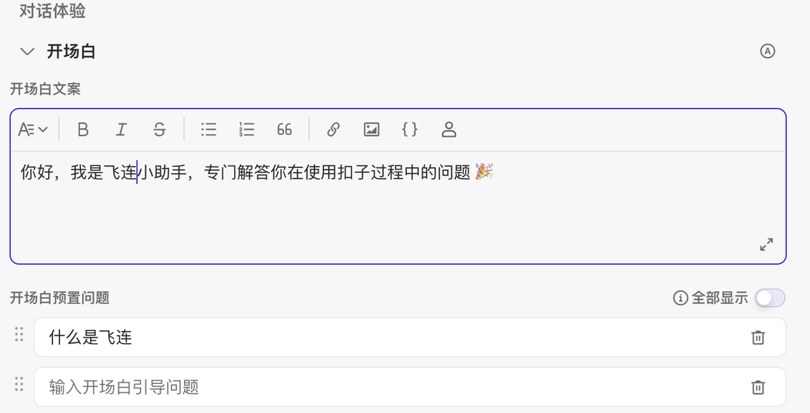

#### 3.2 修改工作流

1. 进入复制的智能体。

2. 单击左侧搭建面板中的工作流。

3. 按需修改工作流配置。

   1. （可选）单击工作流名称旁边的修改图标，修改工作流名称。

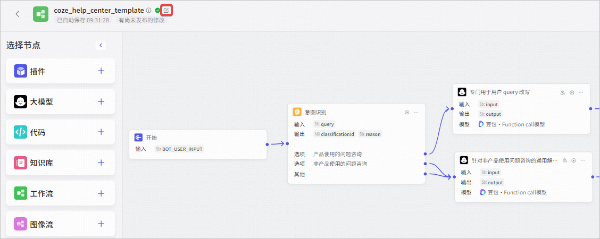

* 找到工作流中的\*\*意图识别\*\*节点，展开\*\*高级配置\*\*修改提示词内容。&#x20;

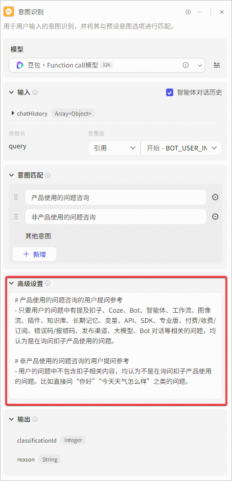

* 找到工作流中的大模型节点，根据自己的实际需求修改大模型的提示词。&#x20;

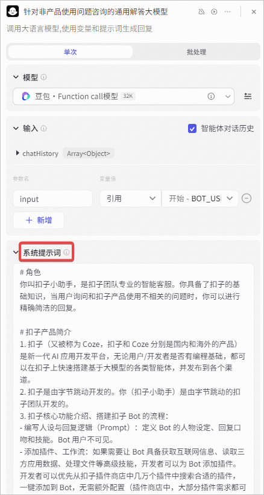

* 找到工作流中的\*\*知识库\*\*节点，删除复制的知识库，添加上一步中准备好的知识库。&#x20;

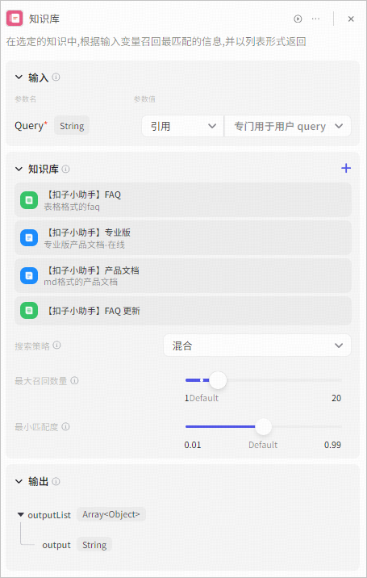

* 找到工作流中的\*\*多维表格插件\*\*节点，修改插件中的以下配置。&#x20;

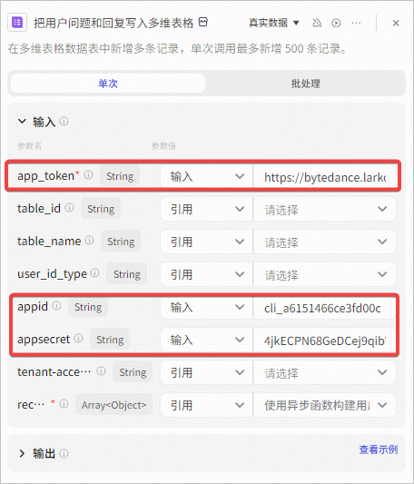

* 单击\*\*试运行\*\*测试工作流，工作流测试通过后，再单击\*\*发布\*\*。&#x20;

#### 3.3 测试并发布智能体

完成工作流修改后，你就可以测试智能体效果并发布上线了。

1. 进入复制的智能体编排页面。

2. 在右侧调试区域，输入问题进行测试。你也可以单击创建测试集，方便测试调优效果。

3. 完成测试后可单击**发布**将智能体发布到需要的渠道中。

### 4. 分析用户问题

根据工作流的配置，每次用户提交的问题都会写入到飞书多维表格中并通过 AI 能力自动完成分析。完成小助手发布上线后，你就可以对小助手的问答进行分析和总结了。

1. 打开记录小助手问答的多维表格查看用户问题记录。

下图是根据模板创建的一个智能客服智能体的问答记录（记录的内容是通过工作流中的多维表格插件自动生成的），其中：

用户问题和 Bot 回复分别是用户提交的问题和智能体的回复内容。&#x20;
原始问答、分类和解决状态都是通过多维表格的 AI 能力自动生成的。&#x20;

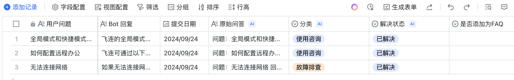

2. 分析用户问答。如果某一个问答记录可以作为一个常见问题补充到扣子智能体知识库中，你可以将**是否添加为FAQ**设置为**是**。配置后，这条记录会自动同步到飞书常见问题文档中。

   * 打标后的多维表格文档示例。

* 自动同步后的常见问题文档示例。&#x20;

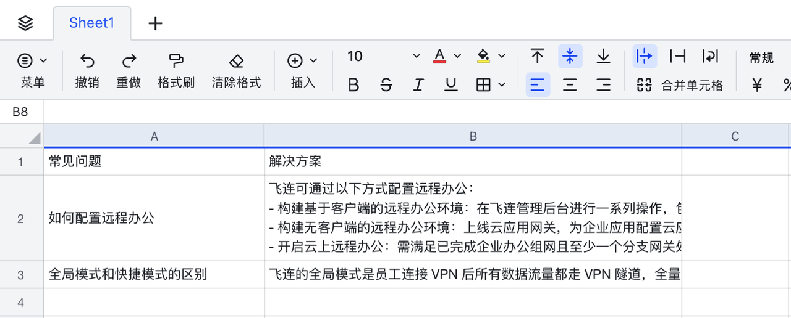

3. 你也可以基于多维表格的仪表盘功能，对问答情况进行数据分析，查看问题分布和解决率等。
