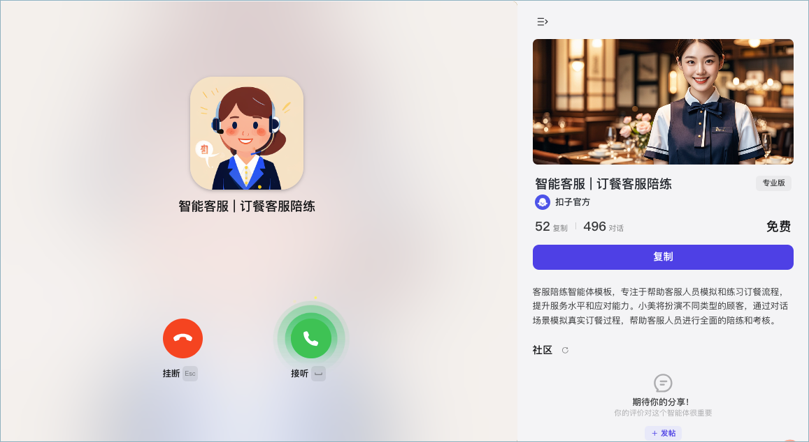
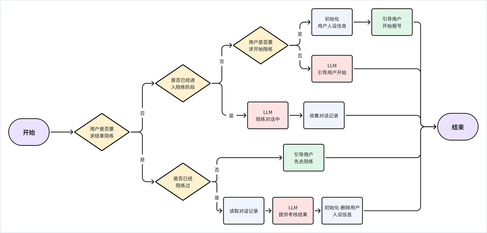
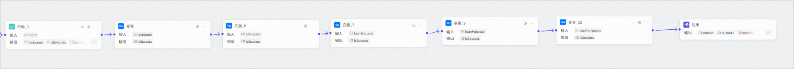
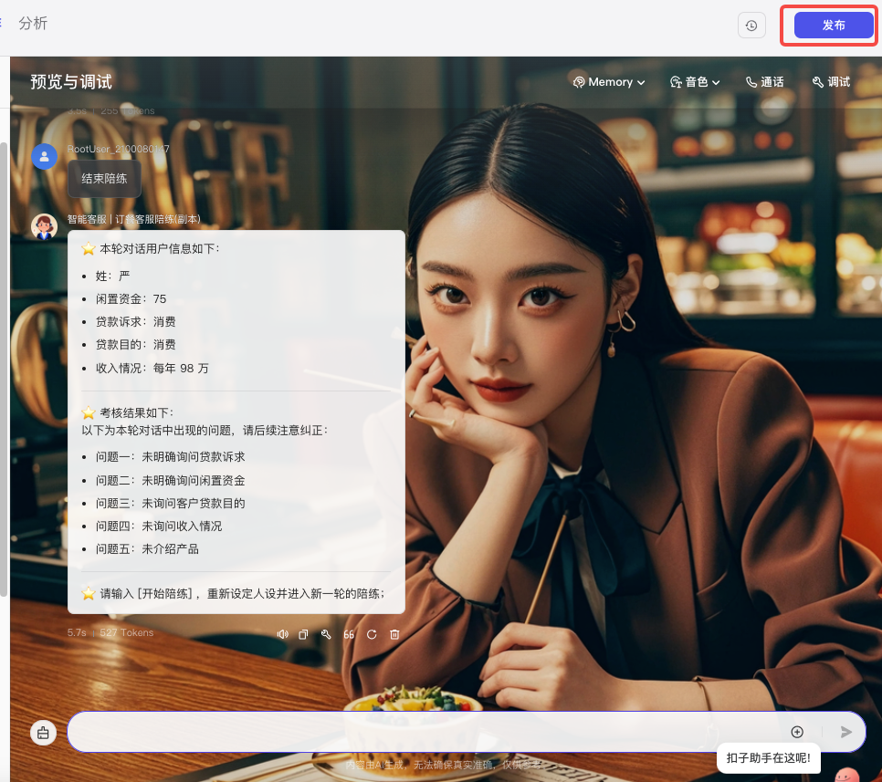

**订餐客服陪练**是扣子官方提供的客服场景智能体，可以帮助客服人员模拟和练习订餐流程，提升服务水平和应对能力。你可以通过复制该模板，快速创建和定制一个符合自己业务场景的客服陪练智能体。

点击[这里](https://www.coze.cn/template/agent/7416568788059111474?)体验客服陪练智能体。

## 一、模板介绍

在电商、零售、快消、金融等行业场景中，往往需要对客服销售等角色进行统一培训与模拟演练，例如：

* 在金融、零售、电商等行业中，模拟复杂的销售场景，为客服人员提供个性化的训练环境，帮助客服团队在实际服务前熟练应对各种客户问题与突发发情况，提高其应变能力与服务水平，确保在真实工作中提供优质的客户体验。

* 在快消行业中，模拟真实购物场景，涵盖客户提问、产品推荐、异议处理等多种情境，通过反复练习提升导购的沟通技巧与产品介绍能力，从而在实际销售过程中更好地引导客户做出购买决策。

**订餐客服陪练**是典型的客服陪练模板，模板以餐饮行业电话预定场景为例，演示 AI 智能体代替人工进行客服人员培训与考核的基础流程与实现方式。

**订餐客服陪练**是典型的客服陪练模板，模板以餐饮行业电话预定场景为例，演示 AI 智能体代替人工进行客服人员培训与考核的基础流程与实现方式。

**订餐客服陪练**模板是扣子专业版的专属模板，仅专业版扣子用户可复制并使用此模板。

### 模板能力

**订餐客服陪练**模板的主要实现功能如下：

* 订餐流程陪练：智能体扮演不同类型的顾客，通过对话场景模拟真实餐饮行业的预定流程，帮助客服人员进行全面的岗前陪练。

* 考核与优化建议：完成陪练后，智能体会全方位评估客服人员的对话表现，给出评价与提升建议，帮助客服人员提高服务水平。

### 实现流程

**订餐客服陪练**模板采用工作流模式编排，主要功能通过工作流实现。工作流的设计思路如下：

各功能模块的实现方式如下：

## 二、使用模板

你可以直接复制模板，并调整工作流的配置，将其改造为适合自己当前场景需求的客服陪练助手。

### 准备工作：设计陪练场景

使用模板之前，你需要先为智能体设计一个陪练场景，并整理陪练场景的基础流程、智能体扮演的人设等关键信息。例如将订餐场景改造为预约看房场景、金融产品销售场景、售后回访场景等。本文档以金融产品销售为例进行演示。

金融销售陪练场景的基础流程和订餐模板基本相同，通过对话判断陪练状态、引导陪练流程、读取对话记录并考核。无需额外改造模板中设计的陪练流程，只需修改智能体需要扮演的客户人设即可。

在金融产品销售场景中，无需通过对话获取客户的电话号码等个人资料，只需要收集用户的产品诉求即可。你可以为金融产品销售设计以下人设参数：

* lastname：姓氏

* idleFunds：闲置资金

* loanRequest：贷款诉求

* loanPurpose：贷款目的

* income：收入情况

### 步骤一：复制模板

1. 打开智能体模板，然后单击**复制**。

2. 选择智能体的所属空间并输入一个智能体名称，然后单击**确定**。

3. 在复制的智能体编排页面，单击智能体名称旁的修改图标，修改智能体名称。

4. 根据实际需求，修改开场白文案和预置问题。

### 步骤二：调整智能体配置

建议沿用智能体的工作流模式，默认对话均由工作流完成逻辑判断与处理。建议仅调整变量参数及开场白即可。打开智能体的编排页面，修改智能体的以下编排配置：

### 步骤三：调整工作流

在工作流中调整智能体的模拟人设，你需要修改各个工作流的多个节点设置。修改完毕后应试运行并重新发布工作流。

#### 创建、删除人设的工作流

在创建人设的工作流 create\_user 中，需要修改代码节点自动生成的人设、修改变量节点设置的变量名称。例如：

各个阶段的修改方式如下：

删除人设的工作流 deleteuser 调整方式类似，只需将变量节点的输入字段名改为新的人设参数名称即可，注意变量节点数量应和设置参数的变量节点保持一致。

#### 负责考核的工作流

assessment 工作流负责完成考核。在这个工作流中，你需要修改大模型节点的提示词、修改变量节点的参数名称。以金融销售场景为例，修改方式如下：

#### 负责陪练过程回复的工作流

在工作流 Customer\_practice\_partner\_1 负责陪练过程中回复用户，这个在工作流中，智能体会先读取已设置好的人设参数，并根据调用大模型进行回复。你需要修改变量节点的参数名称、修改大模型节点的提示词。

#### 总工作流

智能体绑定的总工作流 Customer\_practice\_partner\_1 中，你需要修改大模型节点的提示词，将订餐客服关键词改为金融产品销售相关的提示词，你也可以在此处增加陪练过程的话术、客户的语气等要求，以便陪练场景更加贴近真实的业务场景。示例如下：

### 步骤四：测试并发布

修改工作流并调试发布之后，你就可以测试智能体效果并发布智能体到第三方渠道中使用。

1. 在右侧调试区域，输入问题进行测试。

2. 完成测试后可单击**发布**，将智能体发布到你需要的任何渠道中使用。

