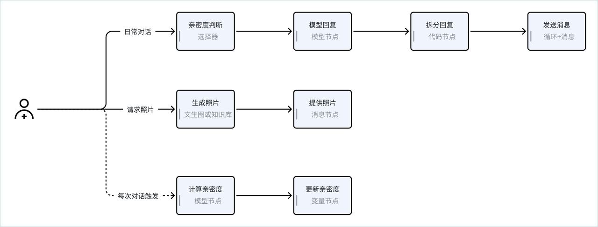
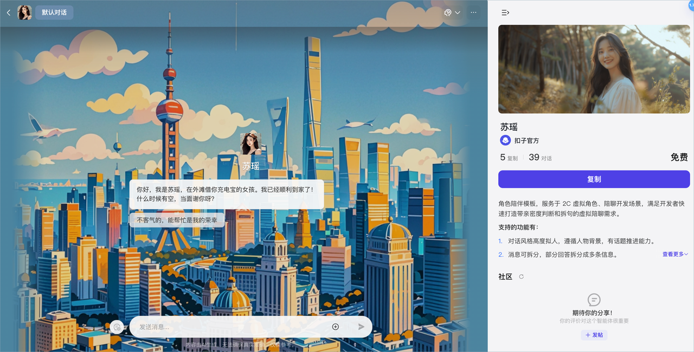
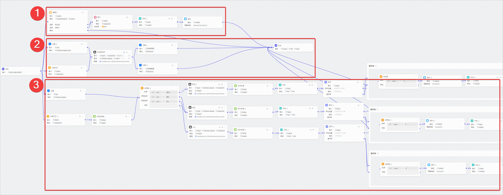
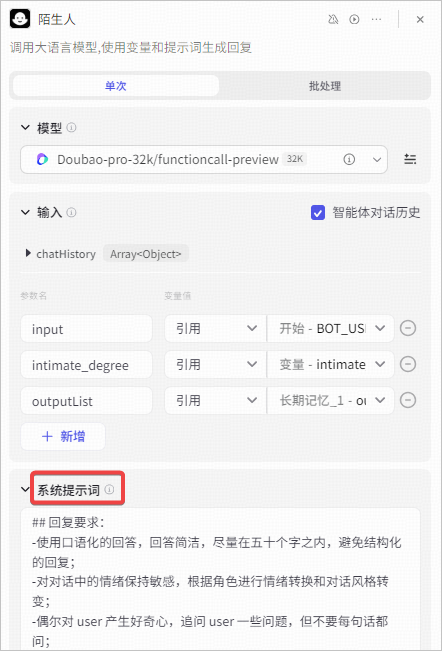

**苏瑶**、**罗夏**、**支配恶魔**是扣子官方提供的情感陪聊类智能体模板。此智能体模板以 AI 伴侣的的形象提供高度拟人的对话氛围，为用户提供情绪支持，是一个友好、有趣的 AI 伙伴。

## 一、模板介绍

情感聊天机器人是当前较为热门的聊天机器人细分类别之一，它能够理解和回应用户的需求，提供个性化的交流体验，不仅可以用于娱乐和社交场景，还可以提供在线的情感支持和心理辅导。你可以参考此模板搭建出类似的人设类智能体，例如不同性格和人设的虚拟男友、女友、闺蜜，根据自己的个人喜好设计出匹配自己需求的 AI 伴侣，提供定制化的服务。

单击以下链接，快速体验情感陪聊模板。

* [苏瑶](https://www.coze.cn/template/agent/7419218621307764770?)

* [罗夏](https://www.coze.cn/template/agent/7416317028925161512?)

* [支配恶魔](https://www.coze.cn/template/agent/7416591175999602699?)

### 智能体能力

情感陪聊类智能体模板的主要能力如下：

* **沉浸式拟人对话**：提供语音和文字的实时对话能力，回答风格高度拟人，严格遵循既定的人设，可以通过反问等多种语言技巧推进话题。智能体的消息回复会拆分为多条消息，更贴近真实用户场景。支持语音对话，沉浸式交互。

* **照片生成与发送**：支持根据用户的提问，发送离线生成的照片，也可以添加文生图节点根据用户需求生成面部一致的图像，提高对话场景和人设的真实感。

* **好感度培养**：根据用户的对话历史和长期记忆计算好感度，根据好感度判定感情进展。不同的进展阶段提供不同的对话风格与模拟场景，并根据对话历史随时调整好感度数值，调整对话态度。

### 实现流程

情感陪聊模板使用工作流模式搭建，每个问答都由指定工作流处理。整体设计思路如下：

各个功能模块的实现方式如下：

## 二、使用模板

你可以直接复制模板，并调整智能体的配置及工作流，将其改造为目标场景的 AI 陪聊智能体。

### 准备工作：设计人设

在使用模板前，你需要为你的智能体设计一个人设。此模板仅考虑 AI 伴侣等普通陪聊场景，如果你需要为智能体添加心理辅导等技能，可以在这个智能体的基础上添加其他技能。

你可以通过以下方式设计你的智能体人设：

### 步骤一：复制模板

1. 打开[苏瑶](https://www.coze.cn/template/agent/7419218621307764770?)智能体，然后单击**复制**。

1. 选择智能体的所属空间并输入一个智能体名称，然后单击**确定**。

2. 在复制的智能体编排页面，单击智能体名称旁的修改图标，修改智能体名称。

3. 根据实际需求，修改开场白文案和预置问题。

### 步骤二：设计实现方案

此模版使用工作流模式，你可以根据你的个人需求、喜好、智能体人设，自定义调整工作流的配置。工作流中每个分支实现一个功能，你可以按需调整各个功能模块的节点设计。以下工作流设计以[苏瑶](https://www.coze.cn/template/agent/7419218621307764770?)模板为例。

其中：

* ①分支实现照片生成与发送

* ②分支实现好感度培养

* ③分支实现沉浸式拟人对话

#### 沉浸式拟人对话

模板中的对话模块主要通过选择器、模型节点、循环节点实现。

* 长期记忆和文本处理节点：通过文本处理节点拼接出一段包含长期记忆的开场白，后续分支中可将开场白和长期记忆作为 Prompt 的一部分编排进大模型节点，以便大模型生成更合适的回复。

* 变量和选择器：根据变量记录的亲密度判断感情阶段，将对话流转至不同的分支处理。三个分支，分别代表三种感情阶段，即陌生人、朋友和恋人，每个分支的处理逻辑相同，但对话风格不同。对话风格由大模型节点决定。

* 大模型节点：根据当前分支的感情阶段调整大模型节点的对话风格，让大模型生成更符合当前阶段的回复。

* 文本处理和代码节点：将回复拆分为数组格式的短句，并循环处理短句，每次循环中通过消息节点输出其中一个短句，实现一个问题多条回复的效果。

对于 AI 伴侣类型的智能体，你可以根据个人需求选择是否需要不同的亲密度分支。

#### 照片生成与发送

此模板在知识库中预置了一系列照片图像，如果用户要求查看照片，智能体会通过知识库节点查找照片，并返回给用户。

如果在知识库中预先上传图片，召回速度较快，但无法定制专属场景的图片，使用模版时你也可以改为文生图节点生成图片，虽然速度慢、成本高，但和场景的贴合度高，体验更好。

使用模板时，需要根据业务情况，选择发送照片功能的实现方式。推荐的方式如下：

#### 好感度培养

智能体预置了自定义变量，即当前亲密度和亲密度数值，首次对话时好感度为默认的初始值 20，你也可以根据个人需求在智能体的记忆 > 变量中调整初始值。在每次对话中，大模型节点会读取变量当前最新的值，并综合参考长期记忆、历史对话来重新计算亲密度，并通过变量节点重新设置智能体的亲密度。

无需累积亲密度，固定为伴侣人设，可以直接删除此分支。如果需要累积亲密度，可以按需求选择具体方案。

### 步骤三：修改人设

明确各个功能的实现方案后，你可以修改工作流中模型节点的系统提示词，将设计好的人设赋予智能体。

找到**沉浸式拟人对话**模块的**大模型节点**，调整节点的人设与回复逻辑，将设计好的人设通过结构化的语言格式进行描述，为智能体设置新的人设。注意，每个感情阶段分支的人设均需要调整，且保证基础人设一致，否则可能影响用户体验。

设置方式如下：

### 步骤四：调整智能体配置

设计好工作流之后，你可以复制这个智能体，并调整各项核心配置。此智能体模板的核心配置包括：

### 步骤五：测试并发布智能体

完成工作流修改后，你就可以测试智能体效果并发布上线了。

1. 进入复制的智能体编排页面。

2. 在右侧调试区域，输入问题进行测试。你也可以单击创建测试集，方便测试调优效果。

3. 完成测试后可单击**发布**将智能体发布到需要的渠道中。
