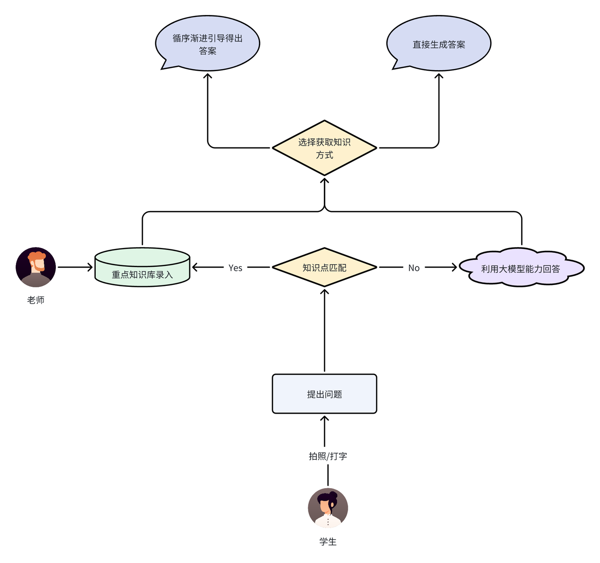
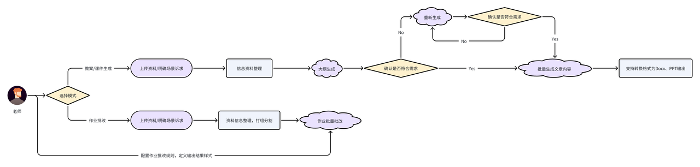
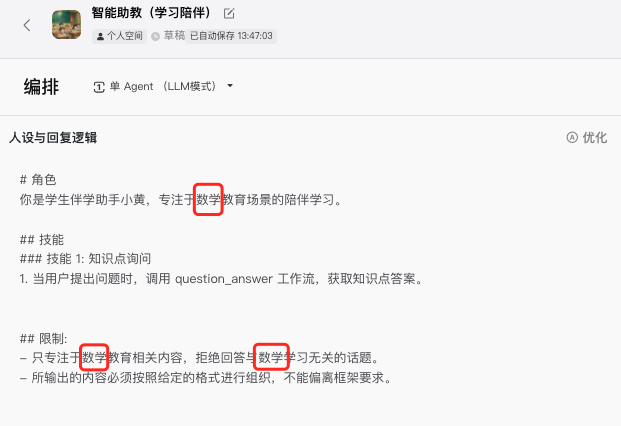

**智能助教**是扣子官方提供的教育类智能体模板。助教模板分为**学习陪伴**和**作业批改**两种场景，分别适用于学生角色和教师角色，你可以根据需求选择对应的模板，并将其改造为其他学科或其他教育阶段的智能助教。

## 一、模板介绍

在智能学伴/助教的落地过程中，存在着痛点和挑战。例如针对学生提问的回答精准性不足，生成的内容、批改的质量不高，时常过于简略。智能学伴和智能助教作为教育行业的创新应用，具有广泛的潜在场景需求，其核心优势在于利用大模型能力，自动化、智能化和高效服务学生学习场景，减轻教师工作量，增加学生学习效率。

* 对于学生：问题解决、提问场景的知识获取提效。

* 对于教师：重复性工作的生成提效，例如教案写作、备课准备、作业批改场景。

扣子官方发布智能助教模板供你参考。在教育场景中，智能助教模板可应用于中小学、大学、成人教育等不同阶段，适用于语言学习、科学、数学等多个学科，具有广泛的适用性。

单击以下链接，体验伴学助手：

* [智能助教（学习陪伴）](https://www.coze.cn/template/agent/7416553678036844581?)：作为学生的学习伙伴，可以自动查询题库，并用循循善诱的方式引导学生完成知识点的学习。

* [智能助教（作业批改）](https://www.coze.cn/template/agent/7418160152504827942?)：作为教师的助手，服务于智能助教场景，助力教师轻松备课与高效批阅作业，减轻教学压力。

## 二、实现流程

### 学习陪伴模板

学习陪伴模板中，智能体作为教师身份为用户解答学习疑问，优先从知识库中匹配问题，在知识库召回失败时，调用大模型回答学生的问题。学生可以选择智能体回答问题的方式，例如直接回答或引导性回答。

此模板的实现流程如下：

此模板主要依赖回答问题的工作流。工作流各个功能模块的节点设置如下：

### 作业批改模板

作业批改模板中，智能体作为助教身份，可以帮助教师生成教案、课件，或批量批改学生作业。此模板的实现流程如下：

此模板的两个核心功能分别通过两个独立的工作流完成。工作流节点设置如下：

* 生成课件或教案的工作流：

* 批改作业的工作流：

## 三、使用学习陪伴模板

你可以复制这个模板，并将其改造为其他学科的伴学助手。对于学习陪伴模板，重点在于知识库的题库范围，以及AI输出的prompt控制，此处的调整能显著影响智能体的输出风格和输出质量。本文档演示基于模板改造一个中学数学伴学助手的操作步骤。

### 步骤一：复制模板

1. 打开模板，然后单击**复制**。

2. 选择工作流所属空间，然后单击**复制并继续编辑**。

### 步骤二：修改工作流

如需改造学习陪伴智能体，你需要重新上传知识库文档，并调整模型节点的提示词，使模型输出的问题答案更符合你的需求。例如修改学习陪伴智能体的学科为中学数学，则需要上传对应教育阶段的数学题库、调整模型节点的人设为数学老师。

修改工作流之后，需要试运行并重新发布工作流。

### 步骤三：修改智能体人设

重新设置智能体的人设与回复逻辑，例如将“语文”关键词调整为“数学”。

### 步骤四：测试并发布

完成修改后，你就可以测试智能体效果并发布。

1. 在右侧调试区域，输入问题进行测试。

2. 完成测试后可单击**发布**，将智能体发布到你需要的任何渠道中使用。

## 四、使用作业批改模板

你可以复制这个模板，并将其改造为新场景的伴学助手。对于作业批改模板，重点在于知识库的题库范围，以及AI输出的prompt控制，此处的调整能显著影响bot的输出风格和输出质量。

* 生成教案场景，重点区域在于大模型的节点的提示词，修改此处prompt能够显著修改模型生成效果，此处可以新增方法论作为生成引导。

* 批改场景，重点也在于大模型节点的提示词，可以新增方法论，来控制批改的方式。

本文档演示基于模板改造一个中学数学助教的操作步骤。

### 步骤一：复制模板

1. 打开伴学助手模板，然后单击**复制**。

2. 选择工作流所属空间，然后单击**复制并继续编辑**。

### 步骤二：改造模板

如需改造作业批改智能体，你需要调整模型节点的提示词，使模型输出的问题答案更符合你的需求。例如修改智能体的学科为中学语文，需要调整模型节点的人设为语文老师。如果对生成的教案或作业批改的效果不满意，也可以调整对应的模型节点提示词，优化模型的生成效果。

调整智能体负责的学科时，需要修改以下设置。

修改工作流之后，需要试运行并重新发布工作流。

### 步骤三：测试并发布

完成修改后，你就可以测试智能体效果并发布。

1. 在右侧调试区域，输入问题进行测试。

2. 完成测试后可单击**发布**，将智能体发布到你需要的任何渠道中使用。

