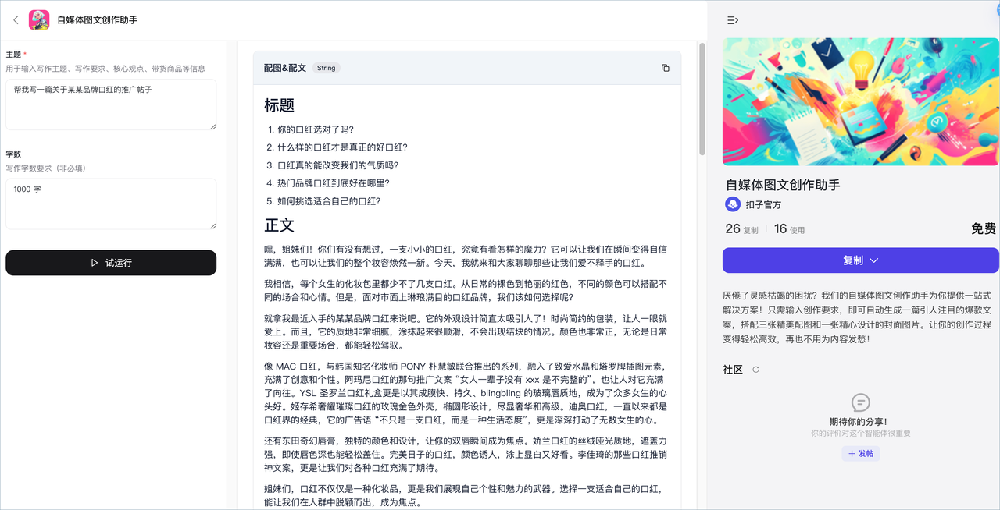
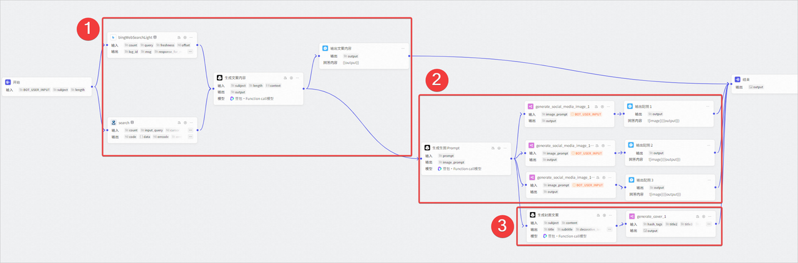

**自媒体创作助手**是扣子官方提供的营销写作类工作流模板。只需输入创作要求，即可自动生成一篇引人注目的社交媒体爆款文案，同时搭配三张精美配图和一张精心设计的封面图片，让你的创作过程变得轻松高效。

## 一、模板介绍

作为营销写作类模板，**自媒体创作助手**能够一键生成指定主题的自媒体文案，符合需要投放的目标社交媒体渠道风格，搭配多张相同风格与主题的配图，帮助自媒体创作者提高产出内容的效率和质量。此模板为工作流模板，其中使用了大模型、图像流等节点分别生成自媒体文案、文生图 Prompt 和内容配图。此模板以小红书风格为例，复制此模板之后，你也可以将其改造为适合其他社交媒体风格的图文创作工作流，绑定到自己的智能体中使用。

单击[此处](https://www.coze.cn/template/workflow/7418104809603137574)，体验自媒体创作助手。

### 1. 模板能力

自媒体创作助手模板的主要能力如下：

* **生成文案**：根据指定主题，生成一篇指定字数的推广文案。完整文案以中间消息的形式输出，其中包含标题、内容及内容标签。

* **生成配图**：根据指定主题生成多张配图。文生图的 Prompt 由大模型节点完成，配图均由同一个图像流生成。

* **生成封面图**：根据指定主题生成一张封面图。封面图中包含指定主题相关的多款文案，排版设计均符合目标社交媒体渠道风格。

### 2. 实现流程

自媒体创作助手模板为工作流模板，其中使用了大模型、图像流等节点分别生成自媒体文案、文生图 Prompt 和内容配图。整体编排方式如下：

各个功能模块的实现方式如下：

## 二、使用模板

你可以直接复制模板，并调整工作流中的大模型节点配置，将其改造为适合其他社交媒体风格的创作助手。

### 步骤一：复制模板

1. 打开[自媒体创作助手](https://www.coze.cn/template/workflow/7418104809603137574?entity_type=23)模板，然后单击**复制**。

2. 选择工作流所属空间，然后单击**复制并继续编辑**。

### 步骤二：修改工作流

此模板以小红书风格为例，复制此模板之后，你可以将其改造为适合其他社交媒体风格的图文创作工作流，也可以为工作流添加一些风格或主题限制，将其改造为指定领域的内容创作助手。修改工作流时，建议按需修改以下节点。

### 步骤三：测试并发布工作流

完成工作流修改后，你就可以测试工作流效果并发布。

1. 在工作流编排页面右上角单击**试运行**。

2. 右侧调试区域，输入问题进行测试。你也可以单击创建测试集，方便测试调优效果。

3. 完成测试后可单击**发布**，并将工作流绑定到智能体中使用。

