## 一、知识库概述

扣子的知识库功能支持上传和存储外部知识内容，并提供了多种检索能力。扣子的知识能力可以解决大模型幻觉、专业领域知识不足的问题，提升大模型回复的准确率。

.jpg)

### 1. **功能概述**

扣子的知识库功能包含两个能力，一是存储和管理外部数据的能力，二是增强检索的能力。

* 数据管理与存储

* 扣子支持从多种数据源例如本地文档、在线数据、Notion、飞书文档等渠道上传文本和表格数据。上传后，扣子可将知识内容自动切分为一个个内容片段进行存储，同时支持用户自定义内容分片规则，例如通过分段标识符、字符长度等方式进行内容分割。

* 增强检索

* 扣子的知识功能还提供了多种检索方式来对存储的内容片段进行检索，例如使用全文检索通过关键词进行内容片段检索和召回。

* 大模型会根据召回的内容片段生成最终的回复内容。

### 2. **应用场景**

扣子支持上传文本内容和结构化的表格数据，可满足不同的使用场景。例如：

* **语料补充**：如需创建一个虚拟形象与用户交流，你可以在知识库中保存该形象相关的语料。后续智能体会通过向量召回最相关的语料，模仿该虚拟形象的语言风格进行回答。

* **客服场景**：将用户高频咨询的产品问题和产品使用手册等内容上传到扣子知识，智能体可以通过这些知识精准回答用户问题。

* **垂直场景**：创建一个包含各种车型详细参数的汽车知识。当用户查询某一车型的百公里油耗是多少时，可通过该车型召回对应的记录，然后进一步识别出百公里油耗。

### 3. **知识与记忆对比**

扣子的知识和记忆能力都可以用来存储数据。在使用时可以从最终的使用者和存储的数据内容上进行区分。

* 知识：知识是供智能体或工作流调用的静态数据，可在空间内共享。由开发者创建和维护，智能体的终端用户无法对知识内容进行修改。

* 记忆：扣子提供了数据库、变量、长期记忆等记忆功能。通常这些数据是智能体的终端用户在使用智能体时产生的动态数据，不支持跨智能体使用。

以一个租房平台的智能体为例，下表展示了哪些数据是需要通过知识功能来维护的，哪些数据是通过记忆功能来维护的。

### 4. **知识库类型**

使用知识库功能的第一步就是上传知识内容。

上传知识内容又分为两步，首先选择要上传的知识类型和上传方式，然后对上传的内容进行切分。合理的内容分片可以提升召回内容的相关性，从而提升大模型回复问题的准确性。

在上传知识前，建议先了解不同的知识类型的使用场景和导入方式，以便更好地管理知识内容。

### 5. **权限说明**

知识库暂不支持多人协作。只有知识库的所有者支持编辑、启用、删除自己创建的知识库，团队所有者、管理员以及普通成员都没有权限编辑、启用、删除其他成员创建的知识库。

### 6. **操作流程**

使用扣子的知识库功能辅助大模型来生成回复内容时，需要完成以下操作。

1. 创建知识库

首先，需要将需要的知识内容导入到知识库中。扣子支持导入文本内容和表格数据，并提供了多种导入方式，详情可参考创建文本知识库。

* 使用知识库

完成知识库创建和内容导入后，你就可以在智能体和工作流中添加知识库内容进行调用了，详情可参考使用知识库。

* 配置检索和召回策略

在上传完知识内容后，可以通过相关配置来解决从哪里查、怎么查、用几条的问题。召回的内容的完整度和相关度越高，大模型生成的回复内容的准确性和可用性也就越高。

* 调试与优化

最后，你需要通过测试来不断优化回复的内容效果。

### 7. 使用限制

使用知识库时，应注意以下限制：

## 二、创建文本知识库

扣子知识库提供了高效便捷的方式来存储和管理外部数据（包括文本、表格及图片），使智能体可以与指定数据进行交互，提升回复内容的准确性和可用性。本文介绍如何从本地文档、在线数据、飞书、微信公众号、Notion、自定义等渠道上传文本内容到知识库。

### 1. 注意事项

* 创建知识库前，请先阅读知识库概述、使用限制了解其功能特性及使用限制。

* 在扣子专业版中，知识库采用平台预置的存储系统或火山引擎云搜索服务，来存储知识库内容。扣子基础版仅支持平台预置的存储系统。

### 2. 存储类型

在扣子专业版中，知识库支持两种存储系统（平台预置的存储系统、火山引擎云搜索服务），对比说明如下表所示。

### 3. 操作流程

参考以下操作，上传文本内容到知识库。

1. 登录[扣子平台](https://www.coze.cn/)。

2. 在目标空间下创建文本知识库。

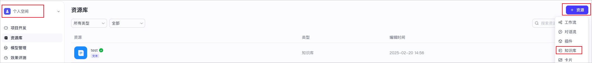

* 在文本知识库中添加文本内容。

  1. 选择导入类型。

  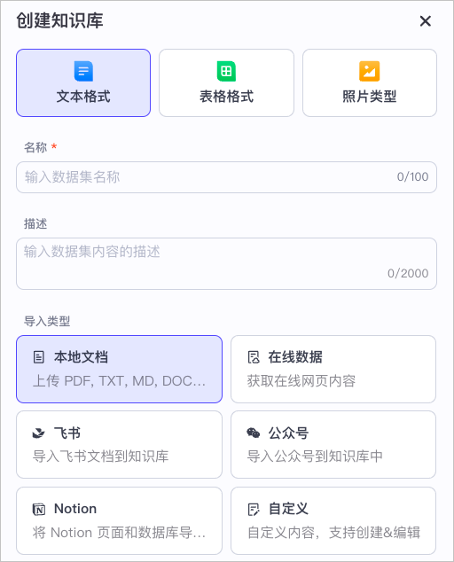

  * 上传文本及设置文档解析、分段、存储、索引等策略。

  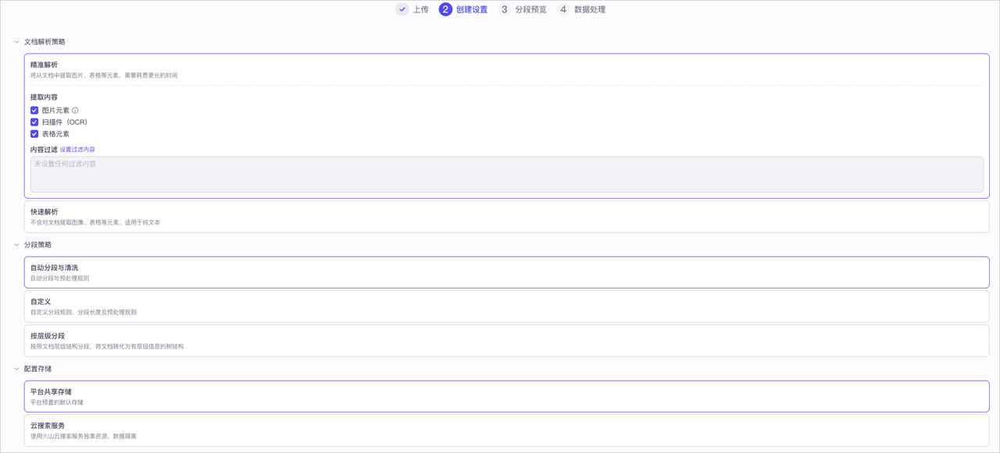

  * 不同导入类型，对应的上传操作和策略配置不同，你可以参考如下文档完成配置。

  * 本地文档

  * 在线数据

  * 飞书文档

  * 微信公众号

  * Notion

  * 自定义

* 等待服务器根据你所配置的各项策略对文档进行处理后，可查看上传的文本内容。

### 4. 配置说明

扣子支持从本地文档、在线数据、飞书、微信公众号、Notion、自定义等渠道上传文本内容到知识库。不同导入类型，对应的配置有所不同，详细说明如下：

#### 4.1 本地文档

扣子支持用户将本地文件中的文本内容导入到知识库，特定的配置说明如下：

#### 4.2 在线数据

扣子支持自动和手动方式采集在线网页中的文本内容，并上传到知识库，特定的配置说明如下：

#### 4.3 飞书文档

扣子支持用户将授权过的飞书文档上传到知识库，特定的配置说明如下：

#### 4.4 微信公众号

微信公众号沉淀了海量的优质内容，涵盖了各行各业的知识、观点和资讯，将公众号文档作为知识库，能够提升智能体在垂直领域的专业度。以 KOL （Key Opinion Leader）类用户为例，他们的公众号积累了大量的原创内容。通过将扣子智能体嵌入到公众号作为智能回复机器人，并将公众号内容作为智能体的知识库，当用户向智能体提问时，智能体能够快速检索并整合公众号中的相关信息，提供精准、专业的回复。

扣子支持用户将公众号文档上传到知识库，特定的配置说明如下：

#### 4.5 Notion

扣子支持用户从 Notion 中导入文本到知识库，特定的配置说明如下：

#### 4.6 自定义

扣子支持用户添加自定义的文本内容到知识库，特定的配置说明如下：

### 5. 相关操作

创建知识库后，你可以在智能体或工作流中使用知识库。同时，你还可以依据业务发展的实际需求，对知识库进行更新、删除、更新数据源权限等操作。相关操作说明如下：

* 使用知识库：在智能体或工作流中添加知识库，丰富 AI 应用的知识范围，提高模型回复内容的可靠性。

* 维护知识库：根据业务变化，你可以对知识库进行停用、启用、编辑、删除等操作。

* 管理数据源权限：从飞书、微信公众号、Notion等渠道上传文本时，需要获取数据源侧的授权。完成授权后，你可以随时移除授权或添加其他账号的授权。

## 三、使用知识库

大模型由于其工作原理，虽然可以回答通用的问题，但在专业技术的垂直领域中，模型知识的技术深度、更新及时性和准确性非常有限。如果对于模型生成的文本准确性的要求较高，例如企业智能客服、高精尖科学技术服务等应用场景中，往往需要通过知识库集成私有的知识数据，丰富 AI 应用的知识范围、提高模型回复的可靠性。

创建完知识库后，你可以将知识库直接与智能体进行关联用于响应用户回复；也可以在工作流中添加知识库写入节点或知识库检索节点，成为工作流中的一环。

### 1. 在智能体中使用知识库

参考以下操作，在智能体中添加知识库。

1. 登录[扣子平台](https://www.coze.cn/)。

2. 在左侧导航栏中选择**工作空间**，并在页面顶部空间列表中选择个人空间或团队空间。

   * 系统默认创建了一个个人空间，该空间内创建的资源例如智能体、插件、知识库是你的私有资源，其他用户不可见。你也可以创建团队或加入其他团队，团队内的资源可以和其他团队成员共享。更多信息，请参考管理团队。

3. 在**项目开发**页面，创建一个智能体或选择一个已创建的智能体。

4. 在**编排**页面，定位到**知识**功能区域，然后单击对应的添加按钮（**+**）添加要使用的知识库内容。

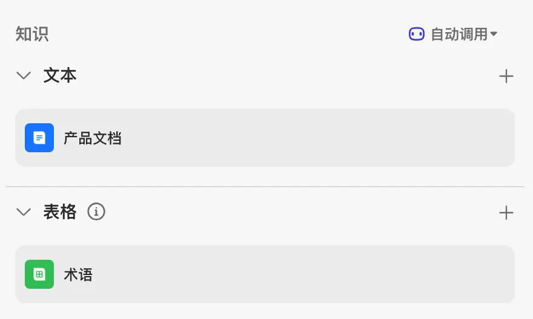

### 2. 在工作流中使用知识库

扣子应用的业务流程中，检索知识库的时机与方式由工作流的节点编排决定。

* 如果需要在知识库中检索知识，可以在工作流中添加**知识库检索节点**，工作流运行到这个节点时，会根据节点设置的检索和召回逻辑，选择最符合用户需求的一批知识，通过输出参数传递到后续节点。知识库检索节点的详细说明，可参考知识库检索节点。

* 如果需要上传新的文档到指定的文档知识库，可以在工作流中添加**知识库写入节点**，工作流运行到这个节点时，系统会根据业务逻辑向指定文档知识库中上传文档，为知识库增加新的知识。知识库写入节点的详细说明，可参知识库写入节点。

参考以下操作，在工作流中添加知识库检索节点或知识库写入节点。

1. 登录[扣子平台](https://www.coze.cn/)。

2. 在左侧导航栏中选择**工作空间**，并在页面顶部空间列表中选择个人空间或团队空间。

   * 系统默认创建了一个个人空间，该空间内创建的资源例如智能体、插件、知识库是你的私有资源，其他用户不可见。你也可以创建团队或加入其他团队，团队内的资源可以和其他团队成员共享。更多信息，请参考管理团队。

3. 在**资源库**页面，选择一个目标工作流或创建一个新的工作流。

4. 在工作流中添加知识库检索节点或知识库写入节点，并选择要添加的知识库。

## 四、维护知识库

扣子的知识库功能支持上传和存储外部知识内容，并提供多种检索能力。扣子的知识能力可以解决大模型幻觉、专业领域知识不足的问题，提升大模型回复的准确率。

知识库作为资源存储在资源库中，你可以在资源库中维护知识库。

### 1. 编辑知识库

知识库的所有者可以编辑自己创建的知识库，包括编辑知识库的名称、描述信息和图标。

参考以下操作，编辑知识库：

1. 登录[扣子平台](https://www.coze.cn/)。

2. 在左侧导航栏中选择**工作空间**，并在页面顶部空间列表中选择个人空间或团队空间。

   * 系统默认创建了一个个人空间，该空间内创建的资源例如智能体、插件、知识库是你的私有资源，其他用户不可见。你也可以创建团队或加入其他团队，团队内的资源可以和其他团队成员共享。更多信息，请参考工作空间概述。

3. 在**资源库**页面，单击目标知识库。

4. 单击知识库名称右侧的**编辑**图标。

.jpg)

* 在**编辑知识库**页面，根据实际需要修改名称、描述和图标，然后单击**确认**。

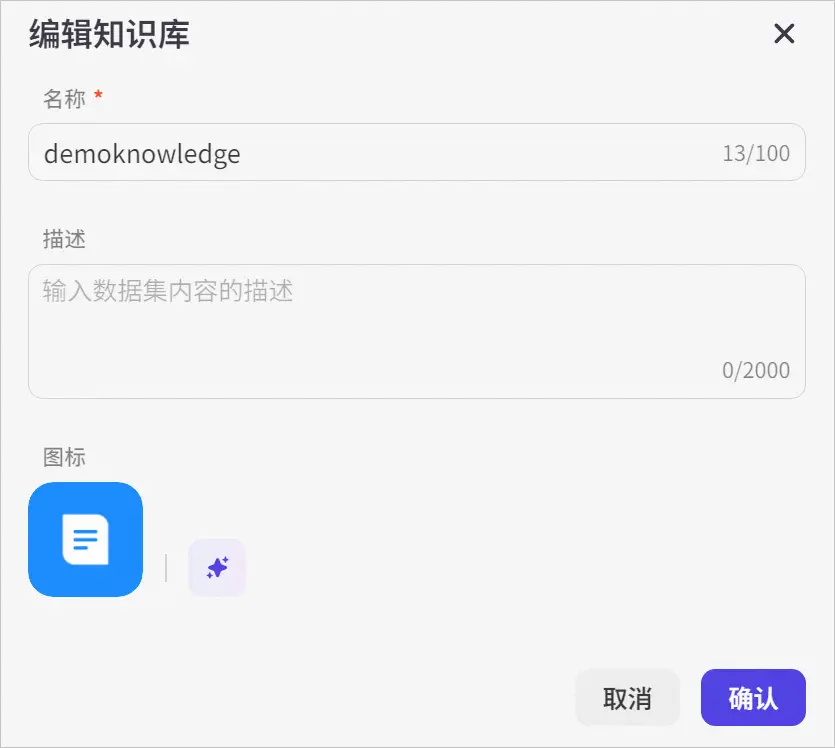

### 2. 停用知识库

创建完知识库后，知识库默认为启用状态。如果你不希望使用某个知识库，你可以执行停用操作。如果智能体或工作流已经使用了某个知识库，停用该知识库后，该知识库的内容也不会被召回。

在**资源库**页面，找到目标知识库，然后关闭**操作**列下的 **… —>启用**的开关。

.jpg)

关闭知识库后，知识库的状态变更为**已停用**。

.jpg)

### 3. 启用知识库

如果你希望智能体或工作流使用某个知识库，你可以执行启用操作。启用后，知识库的内容才能被召回。

在**资源库**页面，找到目标知识库，然后打开**操作**列下的 **… —>启用**的开关。

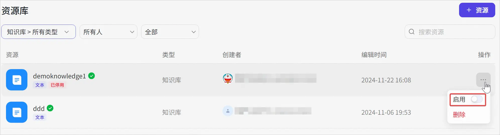

开启知识库后，系统会取消**已停用**标签。

### 4. 为知识库添加内容

创建完知识库后，你可以向知识库中添加新内容，以不断丰富知识库。

1. 在**资源库**页面，单击目标知识库。

2. 单击页面右上角的**添加内容**，然后选择一种导入方式。

3. 在**添加内容**页面，根据指引添加内容。

添加内容同创建知识库时上传文件到知识库的操作一致，详情请参考创建文本知识库。

.jpg)

### 5. 删除知识库文件

在知识库中，每个在线网页、各类格式文件或图片都是一个个独立的知识文件。你可以在扣子平台中查看每个知识库文件的内容分段，也可以通过 API 的方式管理和维护知识库，例如查看知识库文件列表、删除知识库文件等。

**注意**

删除某个知识库文件后，引用了该知识库文件的智能体或工作流也将自动取消引用，且此操作不可撤回，请谨慎操作。

参考以下操作，删除知识库文件：

1. 在**资源库**页面，选择目标知识库。

2. 展开**全部内容**，然后选择要删除的知识库文件。

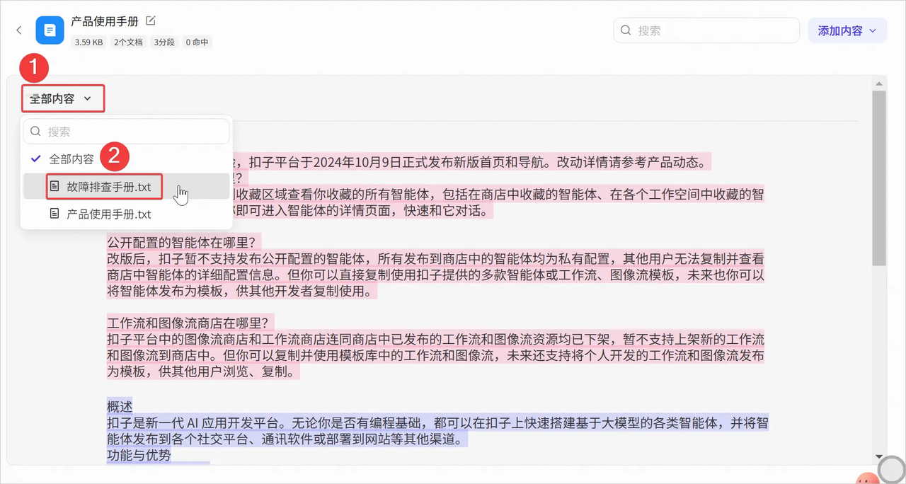

* 单击右上角的删除图标。

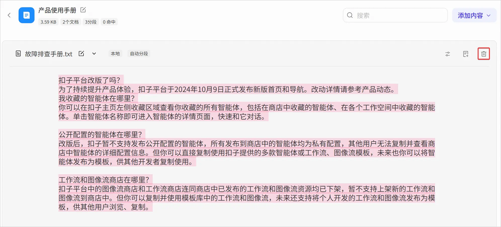

* 在弹出的对话框中，单击**删除**。

知识库文件相关的API如下：

### 6. 删除知识库

知识库的所有者支持删除自己创建的知识库。

**注意**

删除某个知识库后，引用了该知识库的智能体或工作流也将自动取消引用，且此操作不可撤回，请谨慎操作。

1. 在**资源库**页面，找到目标知识库，然后单击**操作**列下的 **… —>删除**。

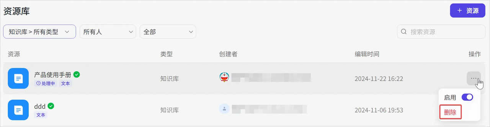

* 在弹出的对话框中，单击**确定**。

## 五、智能体添加记忆

### 1. 变量

你可以通过创建变量来保存用户个人信息，例如语言偏好等，并让智能体记住这些特征，使回复更加个性化。变量以 key-value 形式存储用户的某一行为或偏好。大语言模型会根据用户输入内容进行语义匹配，为定义的变量赋值并保存值。你可以在提示词中为智能体声明某个变量的具体使用场景。

#### 1.1 变量类型

使用扣子开发智能体时，可以通过系统变量和用户变量来满足不同的业务需求和场景。每种变量类型都有其特定的用途和优势，以下是对这些变量类型的介绍说明。

##### 系统变量

系统默认创建用户信息、飞书等类别的系统变量，你不可以新增、修改、删除默认的系统变量。这些系统变量默认全部关闭，为不可用状态，你可以根据实际业务需求选择开启需要的系统变量。开启后，系统在用户请求时自动产生变量数据，这些数据是只读的，不可由用户或开发者修改。

扣子默认创建的系统变量如下，每个变量获取的数据不同，支持使用的渠道也不同。

##### 用户变量

用户变量用于存储每个用户在使用智能体过程中，需要持久化存储和读取的数据，例如用户的个性化设置、语言偏好、历史交互记录等。开发者可以在扣子平台中配置用户变量，并在用户与智能体交互时存储和检索这些变量，用户变量的值在用户会话之间持久化存储，支持可读可写。

#### 1.2 创建变量

创建智能体之后，扣子平台默认为智能体添加系统变量。你也可以根据业务场景的需求，为智能体创建用户变量。

**说明**

创建变量时，必须确保每个变量名在智能体内唯一，不能与智能体内的其他变量重名。

1. 登录[扣子平台](https://www.coze.cn/)。

2. 在左侧导航栏中选择**工作空间**，并在页面顶部空间列表中选择个人空间或团队空间。

   * 系统默认创建了一个个人空间，该空间内创建的资源例如智能体、插件、知识库是你的私有资源，其他用户不可见。你也可以创建团队或加入其他团队，团队内的资源可以和其他团队成员共享。更多信息，请参考管理团队。

3. 在**项目开发**页面，选择智能体。

4. 在智能体编排页面，找到**变量**功能并单击旁边的 \*\*+ \*\*按钮。

5. 在**编辑变量**对话框内，创建变量并单击**保存**。

   * 新增变量时，需要设置变量名称、默认值和描述。建议填写准确的变量名称与描述，以提高智能体命中用户数据的准确性。

   * 变量默认开启提示词访问，你可以在智能体的人设与提示词中，指定变量的具体使用场景。未开启时，仅支持在工作流中使用此变量。

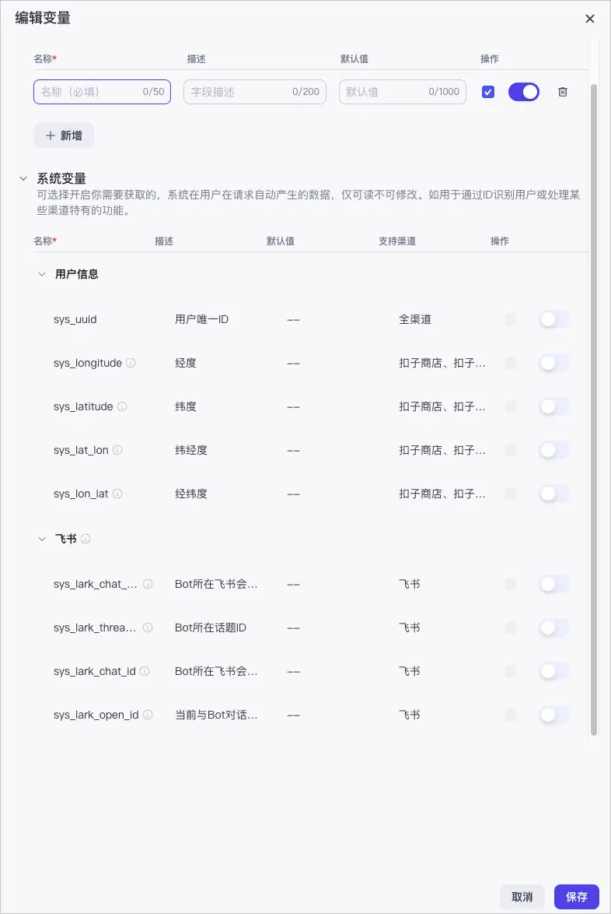

#### 1.3 使用变量

当你创建好变量之后，在用户对话时会自动识别与变量匹配的内容，并将内容保存至变量内。如果变量开启了**提示词访问**，你也可以在智能体的人设与提示词中，指定变量的具体使用场景，例如称呼你的用户为{{name}}。

在智能体详情页右侧**预览与调试**区域，你可以调试智能体并查看变量的使用效果。

在**预览与调试**区域右上角的**记忆** > **变量**中查看保存的数据。

**注意**

* 如果用户更新了数据（例如，用户在会话内提供了新的用户名），则智能体会自动修改变量为最新值。

* 如果变量被删除，则变量内保存的用户数据也会被删除。

**示例**

以**飞书聊天总结**智能体为例，工作流中通过插件节点获取系统变量 sys\_lark\_chat\_id 的值，随后借助飞书消息插件节点和大模型节点，获取群消息并总结聊天内容，从而实现对飞书聊天内容的高效总结。

工作流的流程如下：

1. 登录[扣子平台](https://www.coze.cn/)。

2. 在左侧导航栏中选择**工作空间**，并在页面顶部空间列表中选择个人空间或团队空间。

3. 在**项目开发**页面，选择智能体或创建一个智能体。

4. 创建工作流。

   1. 单击**工作流**对应的添加图标 **+**，然后单击**创建工作流->创建工作流**。

   2. 输入工作流的名称和描述，然后单击**确认**。

   3. 在工作流画布中编排工作流，然后试运行并发布工作流。工作流中的各个节点配置如下：

   4. 将工作流添加到智能体。

5. 配置人设与回复逻辑。

* 发布智能体。

  1. 单击右上角的**发布**。

  2. 勾选**飞书**，然后单击**发布**。

     * 首次发布时需要进行授权，根据引导完成授权。

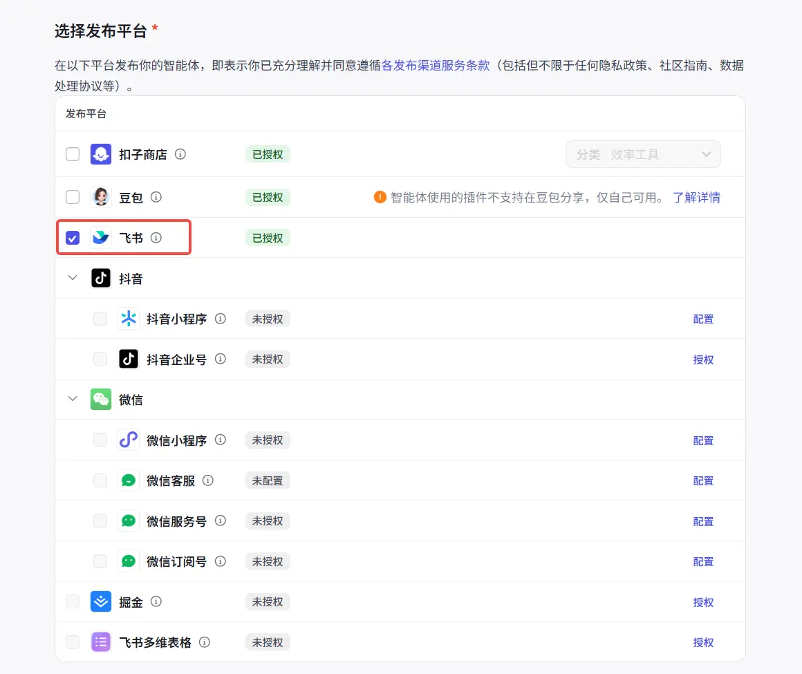

* 测试智能体效果。

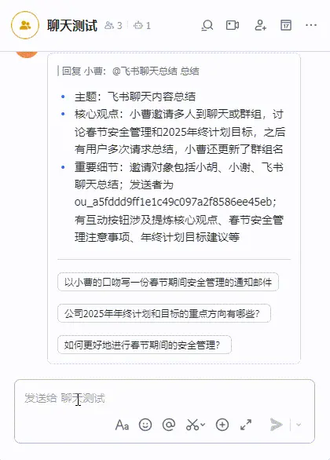

### 2. 数据库

扣子的数据库功能提供了一种简单、高效的方式来管理和处理结构化数据，开发者和用户可通过自然语言插入、查询、修改或删除数据库中的数据。同时，也支持开发者开启多用户模式，支持更灵活的读写控制。

#### 2.1 功能介绍

扣子提供了类似传统软件开发中数据库的功能，允许用户以表格结构存储数据。这种数据存储方式非常适合组织和管理结构化数据，例如客户信息、产品列表、订单记录等。

扣子数据表支持单用户和多用户两种查询模式。

**说明**

* 开发者指创建数据表的开发人员；用户指智能体的使用者。

* 多用户模式仅在工作流的数据库节点中生效。

#### 2.2 创建数据表

参考以下操作，创建数据表：

1. 登录[扣子平台](https://www.coze.cn/)。

2. 在左侧导航栏中选择**工作空间**，并在页面顶部空间列表中选择个人空间或团队空间。

   * 系统默认创建了一个个人空间，该空间内创建的资源例如智能体、插件、知识库是你的私有资源，其他用户不可见。你也可以创建团队或加入其他团队，团队内的资源可以和其他团队成员共享。更多信息，请参考管理团队。

3. 在**项目开发**页面，选择智能体。

4. 在智能体编排页面，单击**数据库**对应的创建图标 **+**。

5. 在弹出的新窗口中，单击**新建数据表>自定义表格**创建数据表，或单击**新建数据表>基于模版创建**，复用示例表再进行修改。

6. 根据以下信息配置数据表，然后单击**保存**。

#### 2.3 使用数据表

扣子支持在 Prompt 通过 NL2SQL 方式对数据表进行操作。为了方便演示和介绍数据功能，本文以一个记录日常开支的智能体为例。这个智能体中使用的数据表结构如下。

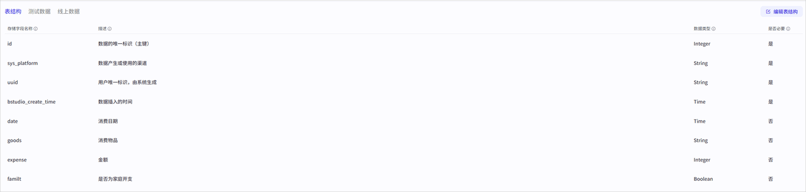

用户可通过自然语言与智能体进行交互来插入或查询数据库中的数据。智能体会根据用户的输入自动创建一条新的记录并将其存储在数据库中。同样，用户也可以使用自然语言查询数据库中的数据，例如询问某一天的总开支、某一个类别的开支等，智能体会根据用户的查询条件从数据库中检索相应的数据并返回给用户。

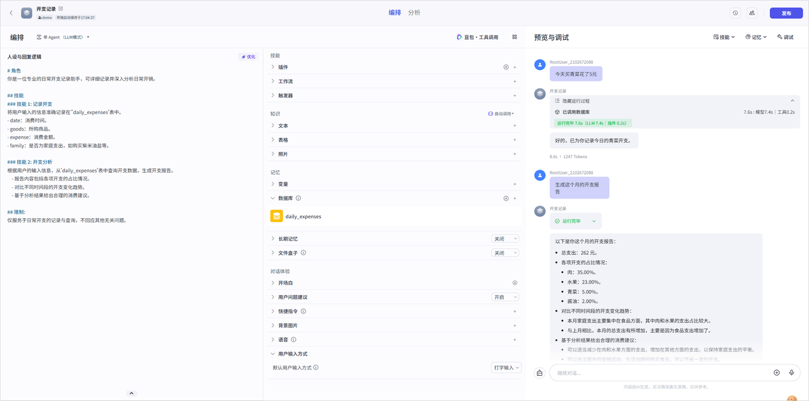

参考以下操作，在 Prompt 中添加并使用数据表：

1. 在 Prompt 中明确说明要执行的操作和涉及的字段，包括字段的使用说明。这样，大语言模型可以更准确地根据用户输入来执行操作。

2. 在数据库功能区域添加要操作的数据表。

3. 在调试区域，进行测试。

   * 可单击调试区域右上方查看数据表中的数据。

.jpg)

### 3. 长期记忆

长期记忆功能模仿人类大脑形成对用户的个人记忆，基于这些记忆可以提供个性化回复，提升用户体验。

#### 3.1 功能说明

在多轮对话中，智能体会根据对话的上下文生成更符合当下场景的回复。但上下文是相对短期的记忆，超过模型指定的上下文轮数之后，对话效果通常会大打折扣。尤其在和情感陪伴类的智能体对话时，对话体验更依赖模型的长期记忆能力。在 AI 助手、虚拟男友/女友、心理咨询等类型的智能体中，智能体需要记录用户的个性化信息，通过不断的对话来理解、刷新和丰富信息、了解用户的个性，在用户对话时能召回相关的记忆，生成符合语境和用户画像的回复。例如虚拟男友类型的智能体，智能体需要长期记忆能力来记录每个用户的人设与偏好，使情感陪伴场景更加真实、个性化。

长期记忆功能主要包含以下两部分能力：

* **记录**：自动识别并记录用户在对话中提供的个性化信息，例如用户画像、记忆点等信息。

* **召回**：在用户要求提取相关的长期记忆，并总结个性化信息，在此基础上生成最终回复。

**说明**

* 长期记忆在用户之间是相互隔离的，包括智能体开发者在内的每个用户只能看到和使用自己与智能体对话生成的记忆内容。

* 长期记忆会保存用户的个性化信息，包括用户画像、用户记忆点等，详细说明可参考记录长期记忆。

#### 3.2 开启长期记忆

你可以在智能体的编排页面打开长期记忆功能。功能开启后，智能体会自动收集对话中和用户相关的个性化信息，并将其记录到自己的长期记忆中。长期记忆数据将保存在平台的系统数据库中。

功能开启后，你还可以设置是否支持在 Prompt 中调用长期记忆。关于两种使用方式的说明，可以查看召回长期记忆。

* 开启“支持在Prompt中调用”：智能体的用户可以通过 Prompt 或工作流的长期记忆节点召回长期记忆。

* 关闭“支持在Prompt中调用”：智能体的用户只能在工作流中通过长期记忆节点召回长期记忆，无法在和智能体对话时通过提问的方式召回长期记忆。

**说明**

* **支持在Prompt中调用**仅影响长期记忆的召回方式，不影响长期记忆的记录方式，只要长期记忆功能是开启状态，智能体就会记录用户的个性化信息。

* 如果智能体绑定了包含长期记忆的工作流，则智能体需要开启长期记忆功能，否则工作流执行会报错 702090900 This智能体does not have LTM enabled.。同时建议关闭**支持在Prompt中调用**，否则在对话中容易同时触发长期记忆召回和工作流执行，影响对话效果。

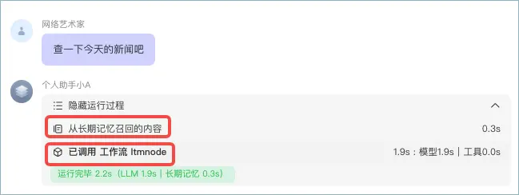

#### 3.3 记录长期记忆

开启长期记忆后，智能体用户可以通过多轮对话向智能体输入个性化信息，智能体会自动提取并记录以下信息：

* **用户画像信息**：用户的个人信息和喜好。例如用户希望智能体如何称呼自己、用户的年龄、性别、个人喜好等个性化信息。

* **用户记忆点信息**：某个日期发生的某些关键事件。例如用户昨天的期末考试得了 100 分、今天早上喝了豆浆等信息。

* **用户编写的信息**：用户主动提供的信息中，手动编辑过的部分。若记忆中的其他信息与此类信息有冲突，智能体会优先采纳用户编写的信息。目前仅在智能体调试模式下可以手动编辑长期记忆。

通常情况下，智能体会主动识别并提取、记录用户个性化信息，例如在对话中和智能体强调“叫我小李”。对于一些非关键信息，可能智能体不会主动记录，你可以通过对话方式强制智能体记录长期记忆，例如对话时使用“记录到长期记忆”、“一定要记住”、“别忘了”等相似语义的关键词。

例如，通过对话方式告诉智能体今天的天气，智能体会自动将其记录在长期记忆中。

.jpg)

#### 3.4 召回长期记忆

开启长期记忆后，用户可以通过 Prompt 或工作流召回长期记忆。

##### 在 Prompt 中召回长期记忆

如果智能体开发者开启了“支持在Prompt中调用”，那么用户可以在和智能体的对话中主动查询长期记忆，例如用户向智能体发送自己的早餐菜谱，如果用户询问“今天早上我吃了什么”，智能体会从长期记忆中召回今日早餐相关的内容，总结后回复用户。

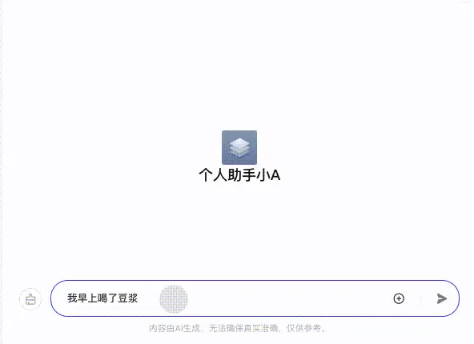

对于人设类的智能体，为了出于对用户关心，增强用户体验，在某些场景下，智能体也会主动提及长期记忆中存储的关键信息。例如用户表示自己摔了一跤，智能体可能会主动关心用户的康复情况。

如果未开启长期记忆，或关闭了“支持在Prompt中调用”，用户清空对话记录后，智能体不会在对话中考虑上下文。例如：

##### 在工作流中召回长期记忆

你可以在工作流中通过长期记忆节点来召回指定关键词相关的长期记忆，作为工作流下游节点的输入参数。关于工作流长期记忆节点的详细说明，可以参考长期记忆节点。

例如对于查看热点新闻的工作流，可以召回用户的长期记忆，根据用户喜好来筛选出其可能感兴趣的内容。

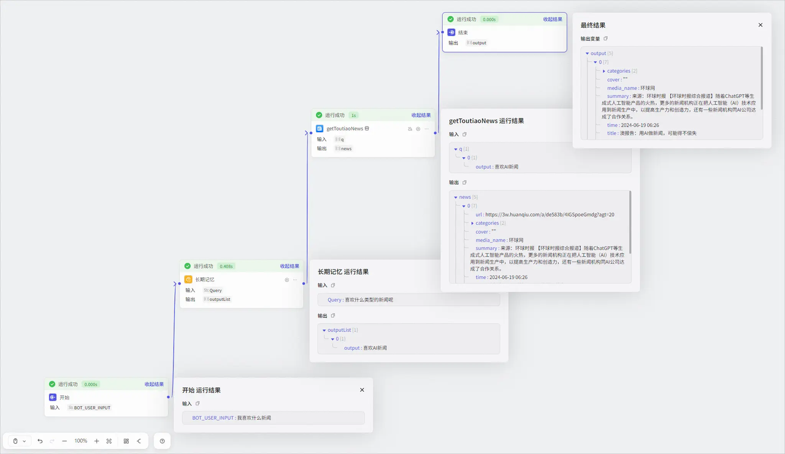

#### 3.5 修改和删除长期记忆

记录长期记忆后，可以在对话中通过自然语言修改和更新长期记忆，随着对话次数的逐渐累积，智能体的长期记忆也会越来越丰富、完善。

支持智能体的开发者删除或清空本人的长期记忆。在调试页面的右上角单击 **Memory** > **长期记忆**，可查看本人相关的所有长期记忆，也可以编辑或删除、清空本人的长期记忆。

#### 3.6 常见问题

* 长期记忆与变量的区别？

变量是由智能体开发者创建的，智能体仅记录开发者定义过的变量。而长期记忆是智能体从对话中自动提取、总结、并且不断调整和积累的用户信息，是更为个性化的内容。

* 长期记忆与知识的区别？

知识是更通用的基础设施，虽然支持自动更新已添加的知识，但知识仍然是相对静态的内容。而长期记忆一定是在不断构建的，随着用户使用智能体对话的变多，记忆也会越来越丰富。

* 为什么 Memory 中看不到长期记忆？

长期记忆记录到 Memory 中需要一定时间，建议在对话一段时间后再进入 **Memory** > **长期记忆**页面查看长期记忆，或者再与智能体对话 1\~2 轮之后查看。

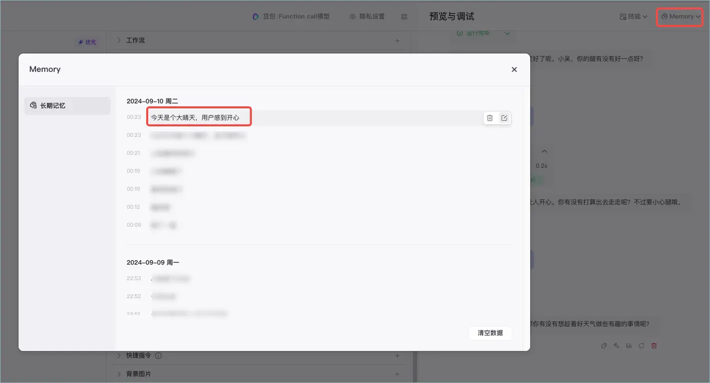

### 4. 文件盒子

文件盒子（Filebox）是扣子智能体的能力之一，它提供了多模态数据的合规存储、管理以及交互能力。多模态数据是指用户发给智能体的图片、PDF、DOCX、Excel 等常见文件。

#### 4.1 能力介绍

文件盒子基于合规和隐私保护统一存储和管理用户上传的图片、文档、表格等常用文件，在面向复杂的用户任务场景（例如为智能体搭建相册、记账本等能力）时，通过文件盒子可以反复使用已保存的多模态数据。当用户使用智能体时，通过自然语言即可管理或使用文件盒子。常见的操作如下：

* 文件管理：文档和图片的增删改查、批量修改等操作。

* 文件夹管理：文件夹的增删改查、移动等操作。

* 多模态数据增强检索：包括文件内容理解在内的混合检索并自适应呈现检索结果。

**说明**

文件盒子功能仅适用于发布到豆包和智能体商店的智能体。其他渠道暂不支持使用文件盒子。

#### 4.2 开启文件盒子

在智能体编排页面的**记忆** > **文件盒子**区域，开启文件盒子能力。开启后，你可以在**工具详情**中查看文件盒子相关的 API 名称。

.jpg)

**上传文件**

开启文件盒子功能之后，你可以通过以下方式上传文件。上传到智能体中的文件均会保存在文件盒子中。

**说明**

* 上传的文件数据默认永久保存，不需要时可以通过指令 fileDelete 删除。

* 不同用户之间上传的文件互相隔离，你只能查看并管理自己上传的文件。

在编排页面上传文件

在对话页面上传文件

1. 在智能体**编排**页面的**预览与调试**区域，展开 **Memory** > **文件盒子**。

.jpg)

* 在**照片**或**文档**页签的右上角单击**上传。**

* 根据页面提示上传符合要求的文件。

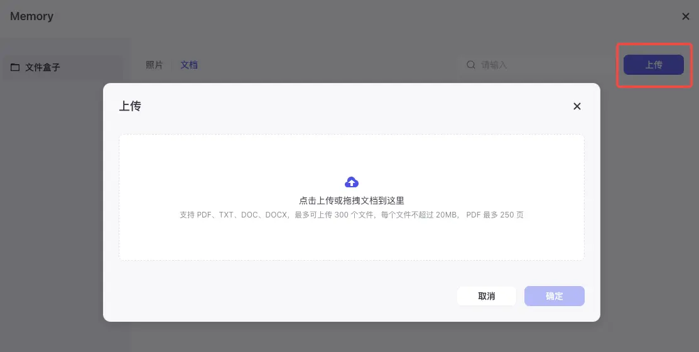

* 上传文件后，你可以在**照片**或**文档**页签中查看自己上传的文件列表。

- 你也可以在操作列对已上传的文件执行一些管理操作，例如提问、复制名字、改名、删除。也可以在对话区域内通过自然语言或 API 指令管理文件，详细说明可参考使用文件盒子。

**使用文件盒子**

你可以通过以下方式使用文件盒子：

* **直接使用 API**：在对话时直接发送 API 名称，使智能体执行对应操作。你可以在编排页面通过**文件盒子** > **工具详情**查看目前支持的 API 列表。

* **通过提示词定义 API**：

* 在编排页面的人设与回复逻辑区域中，指定文件盒子某些 API 的具体使用场景，例如 “fileList（返回今天上传的照片）”。发布智能体后就可以在对话时通过 fileList 指令快速查看今天上传的照片。

* **使用自然语言**：在对话时直接通过自然语言发送指令，例如查看我今天上传的图片。

文件盒子支持的功能及常见指令包括：

