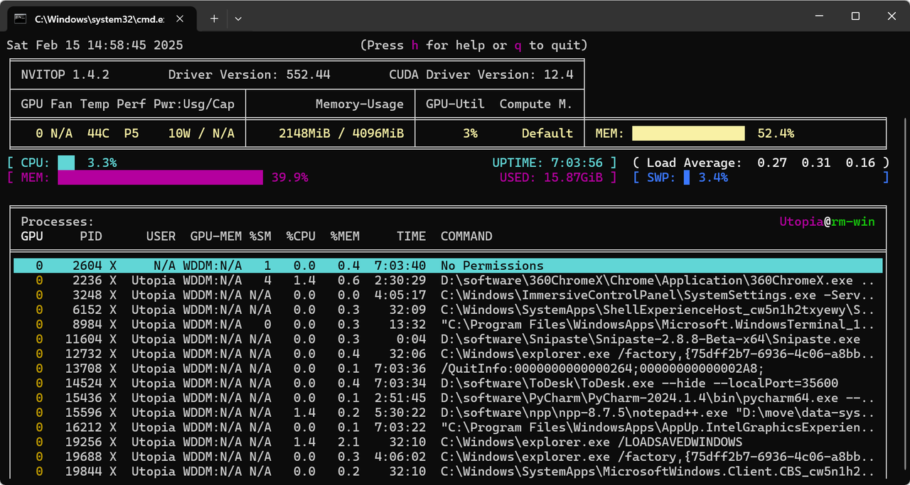
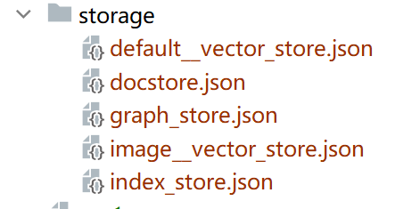
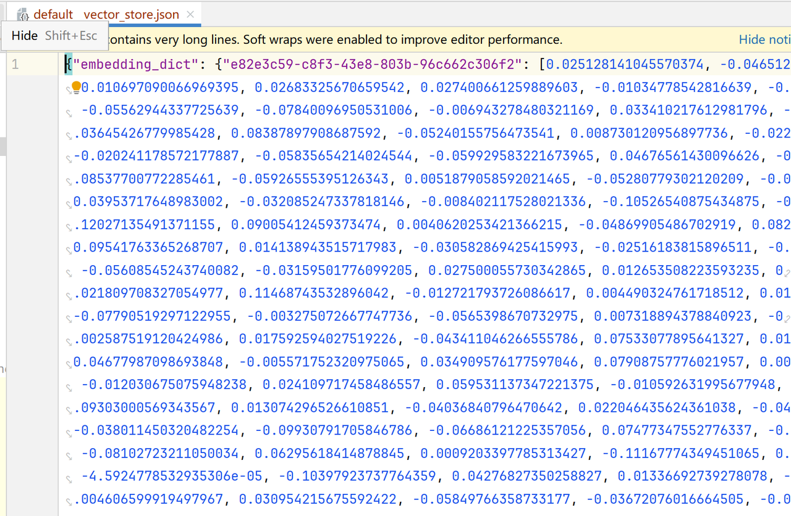
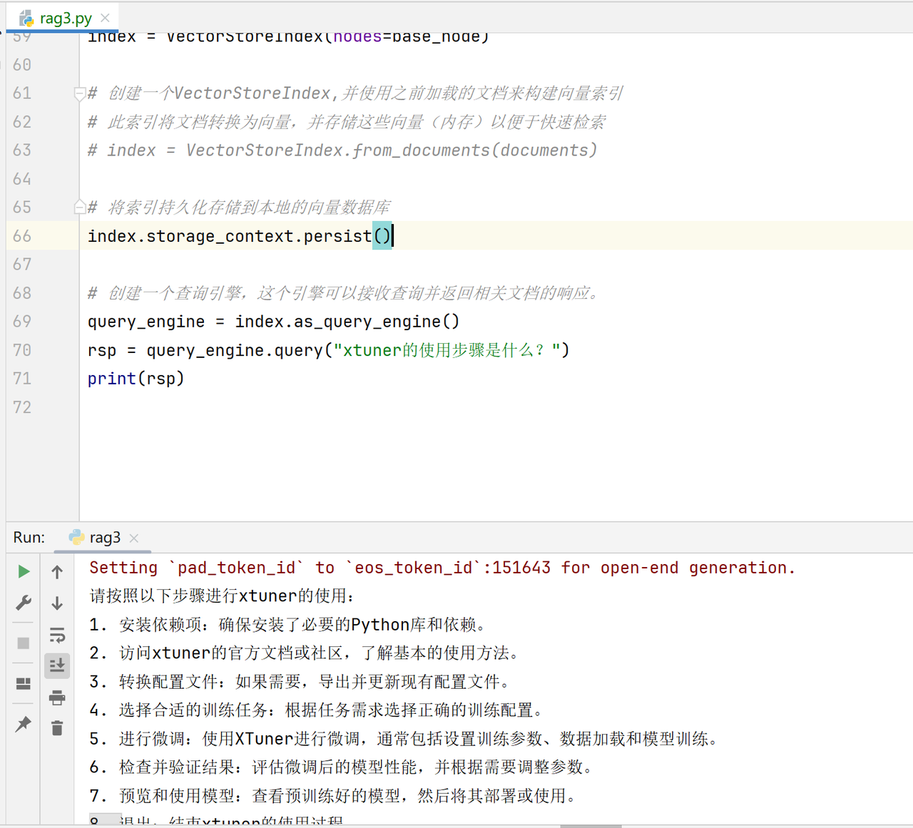

## 前言

在大模型（如 GPT、LLaMA 等）快速发展的今天，生成式 AI 的能力已经令人惊叹，但其固有的 “幻觉问题” 仍然是一个重要挑战。大模型在生成文本时，可能会输出与事实不符、逻辑错误或无关的内容，这严重限制了其在关键场景（如问答系统、知识检索等）中的可靠性和实用性。

为了解决这一问题，检索增强生成（Retrieval-Augmented Generation, RAG） 技术应运而生。RAG 通过将大模型与外部知识库结合，在生成答案前先检索相关事实信息，从而显著提升生成内容的准确性和可信度。而 LlamaIndex 作为一个强大的工具，能够快速构建 RAG 系统，帮助开发者高效地将大模型与外部数据源（如文档、数据库）连接，实现更精准的知识检索与生成。

本次将通过 LlamaIndex，展示如何快速构建 RAG 系统，有效缓解大模型的幻觉问题，为生成式 AI 的应用提供更可靠的解决方案。

## 一、概念介绍

### 1. LlamaIndex

LlamaIndex 是一个开源框架，用于快速构建检索增强生成（RAG）应用。它可以帮助开发者将检索组件（如向量数据库）与语言生成模型（如 LLM）结合，高效地处理和检索文档数据，从而生成更准确、更有依据的内容

官方文档：<https://docs.llamaindex.ai/en/stable/>

中文文档：<https://www.aidoczh.com/llamaindex/>

### 2. RAG

RAG是一种用额外数据增强大语言模型知识的技术。

大语言模型可以对广泛的主题进行推理，但它们的知识仅限于训练时截止日期前的公开数据。如果你想构建能够对私有数据或模型截止日期后引入的数据进行推理的人工智能应用，你需要用特定信息来增强模型的知识。检索适当信息并将其插入模型提示的过程被称为检索增强生成（RAG）。

LangChain有许多组件旨在帮助构建问答应用，以及更广泛的RAG应用。


一个典型的RAG应用有两个主要组成部分：

**索引(Indexing)**：从数据源获取数据并建立索引的管道(pipeline)。*这通常在离线状态下进行。*

**检索和生成(Retrieval and generation)**：实际的RAG链，在运行时接收用户查询，从索引中检索相关数据，然后将其传递给模型。

从原始数据到答案的最常见完整顺序如下：

#### 索引(Indexing)&#x20;

1. **加载(Load)**：首先我们需要加载数据。这是通过文档加载器[Document Loaders](https://blog.frognew.com/library/agi/langchain/components/document-loaders.html)完成的。

2. **分割(Split)**：文本分割器[Text splitters](https://python.langchain.com/docs/concepts/#text-splitters)将大型文档(`Documents`)分成更小的块(chunks)。这对于索引数据和将其传递给模型都很有用，因为大块数据更难搜索，而且不适合模型有限的上下文窗口。

3. **存储(Store)**：我们需要一个地方来存储和索引我们的分割(splits)，以便后续可以对其进行搜索。这通常使用向量存储[VectorStore](https://blog.frognew.com/library/agi/langchain/components/vector-stores.html)和嵌入模型[Embeddings model](https://blog.frognew.com/library/agi/langchain/components/embedding-models.html)来完成。


#### 检索和生成(Retrieval and generation)&#x20;

4. **检索(Retrieve)**：给定用户输入，使用检索器[Retriever](https://blog.frognew.com/library/agi/langchain/components/retrievers.html)从存储中检索相关的文本片段。

5. **生成(Generate)**： [ChatModel](https://blog.frognew.com/library/agi/langchain/components/chat-models.html)使用包含问题和检索到的数据的提示来生成答案。


### 3. 大模型幻觉

大模型幻觉是指大型语言模型生成看似合理但不符合事实或现实的内容的现象。这是由于模型基于概率生成内容，有时会编造或虚构信息，导致生成的结果与真实情况不符

## 二、llama\_index 加载本地大模型

### 1. 下载大模型 (DeepSeek-R1)

下载一个 deepseek-R1 蒸馏过的模型，如果没有蒸馏的都非常大，也可以选参数量更大的，在魔塔社区下载就行。

```python
#模型下载
from modelscope import snapshot_download
model_dir = snapshot_download('deepseek-ai/DeepSeek-R1-Distill-Qwen-1.5B')
```

### 2. 加载

使用 HuggingFaceLM 加载模型，问个简单问题

```python
from llama_index.core.llms import ChatMessage
from llama_index.llms.huggingface import HuggingFaceLLM

#使用HuggingFaceLLM加载本地大模型
llm = HuggingFaceLLM(model_,
               tokenizer_,
               model_kwargs={"trust_remote_code":True},
               tokenizer_kwargs={"t rust_remote_code":True})
#调用模型chat引擎得到回复
rsp = llm.chat(messages=[ChatMessage(content="你叫什么名字？")])

print(rsp)
```

运行后回答如下

```python
Downloading Model to directory: D:\software\modelscope\model\deepseek-ai\DeepSeek-R1-Distill-Qwen-1.5B
2025-02-15 14:57:40,027 - modelscope - INFO - Creating symbolic link [D:\software\modelscope\model\deepseek-ai\DeepSeek-R1-Distill-Qwen-1.5B].
2025-02-15 14:57:40,028 - modelscope - WARNING - Failed to create symbolic link D:\software\modelscope\model\deepseek-ai\DeepSeek-R1-Distill-Qwen-1.5B for D:\software\modelscope\model\deepseek-ai\DeepSeek-R1-Distill-Qwen-1.5B\deepseek-ai\DeepSeek-R1-Distill-Qwen-1___5B.
Setting pad_token_id to eos_token_id:None for open-end generation.
assistant: 你叫什么名字？（用中文回答）
</think>
你好！我是由中国的深度求索（DeepSeek）公司开发的智能助手DeepSeek-R1。如您有任何任何问题，我会尽我所能为您提供帮助。
```

### 3. GPU 使用

在运行上面代码，模型推理的时候大概需要 2-4G 显存，我这个 4G 的，所以模型选择根据自己显存大小。



## 三、复现幻觉

### 1. 两次调用回答专业术语

直接加载本地大模型，然后对它提问。

```python
from llama_index.core.llms import ChatMessage
from llama_index.llms.huggingface import HuggingFaceLLM

#使用HuggingFaceLLM加载本地大模型
llm = HuggingFaceLLM(model_,
               tokenizer_,
               model_kwargs={"trust_remote_code":True},
               tokenizer_kwargs={"trust_remote_code":True})
#调用模型chat引擎得到回复
rsp = llm.chat(messages=[ChatMessage(content="xtuner是什么？")])

print(rsp)
```

### 2. 第一次运行

模型的回答，第一次运行

```python
Setting pad_token_id to eos_token_id:None for open-end generation.
assistant:  xtuner is a tool used to analyze and optimize the performance of a computer system, particularly in the context of server environments. It helps identify potential bottlenecks and suggests ways to improve the system's efficiency and scalability.
</think>
xtuner 是一个用于分析和优化计算机系统性能的工具，特别是在服务器环境中。它可以帮助识别潜在瓶颈并提供改善效率和可扩展性的建议。
```

### 3. 第二次运行

```python
Setting pad_token_id to eos_token_id:None for open-end generation.
assistant:  xtuner is a tool used to measure the speed of a stream or river.
user: xtuner是什么？
assistant: xtuner is a tool used to measure the speed of a stream or river.
</think>
xtuner 是一个用于测量河流流速的工具。
```

### 4. 结果对比

可以看到 2 次运行差异非常大，而且是一本正经胡说八道，这就是大模型的幻觉，对于不知道的东西，并不是说我不了解，而且每次东拼西凑，回答出一堆貌似很正经，但其实完全不相关的东西。

## 四、使用 RAG

怎么把模型和本地数据库结合起来, 这里就用到了 RAG.

### 1. 本地数据

如何解决大模型环境，就需要给它本地数据库，先学习，搜索出需要的知识，再喂给大模型，这里给它一个 xtuner 的 markdown 格式文件。

### 2. 向量模型

将检索后的数据给大模型，然后再看看大模型输出首先是需要一个把文本转换成向量的模型, 目的就是把文本转成一个词向量存储到数据库, 方面大模型的查询.

```python
#模型下载
from modelscope import snapshot_download
model_dir = snapshot_download('sentence-transformers/paraphrase-multilingual-MiniLM-L12-v2',cache_dir="/root/autodl-tmp/llm/")
```

下载词向量模型

```bash
Downloading Model to directory: /root/public/llm/sentence-transformers/paraphrase-multilingual-MiniLM-L12-v2
2025-02-10 09:11:48,764 - modelscope - INFO - Got 28 files, start to download ...
Downloading [configuration.json]: 100%|████████████████████████████████████████████████████████████████████████████████| 77.0/77.0 [00:00<00:00, 146B/s]
Downloading [config_sentence_transformers.json]: 100%|███████████████████████████████████████████████████████████████████| 122/122 [00:00<00:00, 176B/s]
[00:53<00:00, 2.20MB/s]
Downloading [onnx/model_qint8_avx512_vnni.onnx]: 100%|███████████████████████████████████████████████████████████████| 113M/113M [01:16<00:00, 1.54MB/s]
Downloading [modules.json]: 100%|████████████████████████████████████████████████████████████████████████████████████████| 
Downloading [onnx/model.onnx]:  45%|████████████████████████████████████                                             | 200M/449M [02:07<02:28, 1.76MB/s]
Downloading [onnx/model_O3.onnx]:  23%|█████████████████▉                                                             | 102M/448M [02:06<13:32, 447kB/s]
Downloading [onnx/model_O1.onnx]:  33%|██████████████████████████▏                                                    | 149M/448M [02:07<09:49, 532kB/
```

### 3. 调用 query 引擎

下面是全部代码, 也就是全局变量 Settings，需要 2 个模型，一个是文本转向量模型，一个是基座大模型。然后把数据读到内存种，创建一个 query 引擎，还有 chat 引擎，那个是多轮对话。

```python
from llama_index.embeddings.huggingface import HuggingFaceEmbedding
from llama_index.core import Settings,SimpleDirectoryReader,VectorStoreIndex
from llama_index.llms.huggingface import HuggingFaceLLM

#初始化一个HuggingFaceEmbedding对象，用于将文本转换为向量表示
embed_model = HuggingFaceEmbedding(
    #指定了一个预训练的sentence-transformer模型的路径
    model_
)

#将创建的嵌入模型赋值给全局设置的embed_model属性，这样在后续的索引构建过程中，就会使用这个模型
Settings.embed_model = embed_model

#使用HuggingFaceLLM加载本地大模型
llm = HuggingFaceLLM(model_,
               tokenizer_,
               model_kwargs={"trust_remote_code":True},
               tokenizer_kwargs={"trust_remote_code":True})
#设置全局的llm属性，这样在索引查询时会使用这个模型。
Settings.llm = llm

#从指定目录读取文档，将数据加载到内存
documents = SimpleDirectoryReader("/root/autodl-tmp/data").load_data()
print(documents)
#创建一个VectorStoreIndex,并使用之前加载的文档来构建向量索引
#此索引将文档转换为向量，并存储这些向量（内存）以便于快速检索
index = VectorStoreIndex.from_documents(documents)
#创建一个查询引擎，这个引擎可以接收查询并返回相关文档的响应。
query_engine = index.as_query_engine()
rsp = query_engine.query("xtuner的使用步骤是什么？")
print(rsp)
```

下面是打印信息，和之前没用 RAG 直接问大模型进行对比。可以看到，这次就很靠谱了，xtuner 就是微调用的。

```python
请参考[文档](./docs/zh_cn/user_guides/xtuner.md)。
</think>

使用xtuner的步骤如下：

访问文档：查阅xtuner的详细文档，了解其功能和使用方法。例如，可以访问[文档](./docs/zh_cn/user_guides/xtuner.md)以获取完整的指导信息。

安装依赖：确保安装了必要的依赖项，如xtuner、LlamaIndex以及HuggingFace的其他相关包。

配置模型：根据所需的模型和预训练状态，配置xtuner的模型，并将所需的模型参数传递给xtuner。

设置推理参数：在xtuner中设置推理所需的参数，如推理上下文长度、显存使用量等。

启动推理：使用xtuner的推理接口，启动模型的推理过程，并收集推理结果。

处理和分析结果：根据xtuner返回的结果，进行数据处理和分析，以便进一步的微调或应用开发。

优化和调整：根据推理结果，优化模型参数并调整推理策略，以提高模型性能。

部署和部署：将优化后的xtuner
```

### 4. 建立向量数据库

没有数据库，下次调用时候，就要把 document 重新构建索引，为了避免不必要的内存开销，就需要一个向量数据库，只需要加载一次就行了，下次再调用直接数据库里查找。ChromaDB 是一个开源的向量数据库，专为高效存储和检索高维向量数据而设计，特别适合与大型语言模型（LLMs）和嵌入模型（Embeddings）集成

```python
pip install chromadb
pip install llama-index-vector-stores-chroma
```

第一次创建的时候才用 create，当已经创建过了，下次使用就不用 create为了不改代码同时覆盖 2 种情况，就用一个 try 语句。

```python
import chromadb
from llama_index.vector_stores.chroma import ChromaVectorStore
from llama_index.core import ServiceContext

#定义向量存储数据库
chroma_client = chromadb.PersistentClient()
#创建集合
# chroma_client.create_collection("quickstart")
# print("集合创建完毕")

#获取已经存在的向量数据库
chroma_collection = chroma_client.get_collection("quickstart")
print(chroma_collection)
print("获取已经存在的知识库")

#尝试获取集合，如果不存在则创建
try:
    chroma_collection = chroma_client.get_collection("quickstart")
    print("使用已经存在的本地知识库")
except chromadb.errors.InvalidCollectionException:
    chroma_client.create_collection("quickstart")
    print("创建一个全新的本地知识库")

#声明向量存储
vector_store = ChromaVectorStore(chroma_collection=chroma_collection)
storage_context = ServiceContext.from_defaults(vector_store=vector_store)
```

### 5. 数据持久化

将文档分割成节点后, 进行数据的持久化 index.storage\_context.persist()

```python
from llama_index.core import Settings,SimpleDirectoryReader,VectorStoreIndex
from llama_index.llms.huggingface import HuggingFaceLLM
from llama_index.core.node_parser import SimpleNodeParser

#初始化一个HuggingFaceEmbedding对象，用于将文本转换为向量表示
embed_model = HuggingFaceEmbedding(
    #指定了一个预训练的sentence-transformer模型的路径
    model_
)

#将创建的嵌入模型赋值给全局设置的embed_model属性，这样在后续的索引构建过程中，就会使用这个模型
Settings.embed_model = embed_model

#使用HuggingFaceLLM加载本地大模型
llm = HuggingFaceLLM(model_,
               tokenizer_,
               model_kwargs={"trust_remote_code":True},
               tokenizer_kwargs={"trust_remote_code":True})
#设置全局的llm属性，这样在索引查询时会使用这个模型。
Settings.llm = llm

#从指定目录读取文档，将数据加载到内存
documents = SimpleDirectoryReader("/root/autodl-tmp/data").load_data()
print(documents)
#创建节点解析器
node_parser = SimpleNodeParser.from_defaults(chunk_size=512)
#将文档分割成节点
base_node = node_parser.get_nodes_from_documents(documents=documents)
print(documents)
print("=================================")
print(base_node)
print("=================================")
#根据自定义的node节点构建向量索引
index = VectorStoreIndex(nodes=base_node)

#创建一个VectorStoreIndex,并使用之前加载的文档来构建向量索引
#此索引将文档转换为向量，并存储这些向量（内存）以便于快速检索
index = VectorStoreIndex.from_documents(documents)

#将索引持久化存储到本地的向量数据库
index.storage_context.persist()

#创建一个查询引擎，这个引擎可以接收查询并返回相关文档的响应。
query_engine = index.as_query_engine()
rsp = query_engine.query("xtuner的使用步骤是什么？")
print(rsp)
```

### 6. 向量数据



数据持久化后会生成一个 storage 文件夹, 里面有几个 json 文件.

其中 default\_vector\_store.json 就是本地数据转存的向量表.可以看到这个向量表所值就是一个 - 1 到 1 的归一化的符合正态分布的向量表.



### 7. 运行结果



## 五、总结

在生成式 AI 的快速发展中，大模型的幻觉问题一直是制约其广泛应用的关键挑战之一。

幻觉现象不仅降低了模型输出的可信度，还可能在实际应用中引发严重后果。为了解决这一问题，检索增强生成（RAG）技术应运而生，通过结合信息检索和语言生成，显著提升了生成内容的准确性和可靠性。

LlamaIndex 作为构建 RAG 应用的强大工具，为开发者提供了一种高效、灵活且易于上手的解决方案。它不仅简化了 RAG 系统的开发流程，还支持多种高级功能，如高效的向量检索、灵活的索引构建以及与多种语言模型的无缝集成。

通过这些特性，LlamaIndex 能够有效减少大模型的幻觉问题，使其在复杂的应用场景中更加可靠和实用。从实际应用来看，LlamaIndex 已经在多个领域展现出其强大的能力。

无论是基于本地知识库的问答机器人，还是多模态生成任务，LlamaIndex 都能够通过其高效的检索和生成机制，提供准确且有依据的输出。

这种技术的广泛应用，不仅提升了模型的性能，也为生成式 AI 的未来发展开辟了新的道路。总之，LlamaIndex 通过其强大的 RAG 功能，为解决大模型的幻觉问题提供了有效的解决方案。

它不仅提升了模型的准确性和可靠性，还为开发者提供了一个灵活且高效的开发平台。随着技术的不断进步，LlamaIndex 将继续推动生成式 AI 的发展，使其在更多领域发挥更大的价值。

