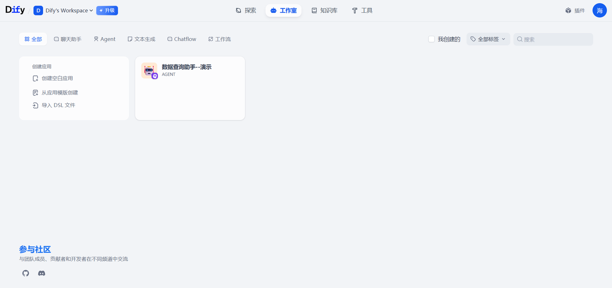
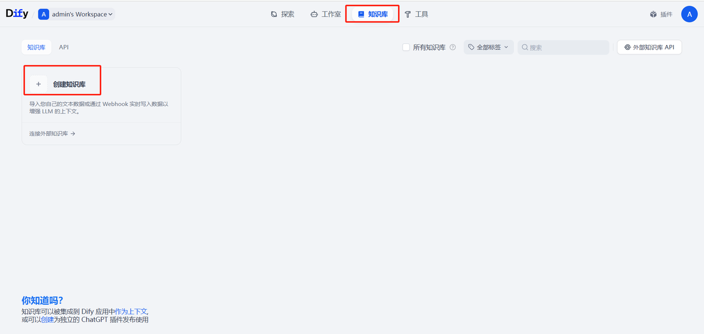
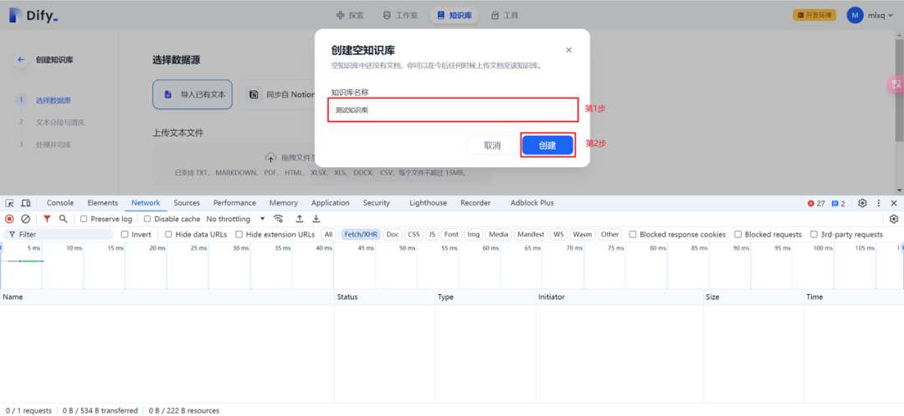
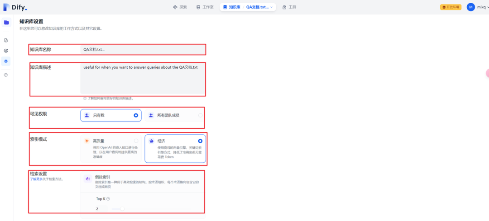

## 分享内容

1. RAG 工作原理与技术架构深度剖析

2. Dify入门与私有化部署

3. Dify 构建知识库

4. Dify接入Deepseek R1构建Agent应用


## RAG 工作原理与技术架构深度剖析


### **什么是RAG？**

**RAG（Retrieval-Augmented Generation，检索增强生成）** 是一种将**信息检索**与**文本生成**相结合的技术，通过实时从外部知识库中检索相关文档，增强大语言模型（LLM）的生成准确性和事实性。其核心价值在于解决LLM的三大痛点：

* **知识固化**：预训练数据无法实时更新

* **幻觉问题**：生成内容缺乏事实依据

* **领域局限**：难以直接处理专业领域问题


**典型应用场景**：

* 智能客服（如阿里小蜜日均处理千万级问答）

* 法律/医疗领域专业问答

* 企业知识库增强（如微软将RAG集成到Copilot）

### **技术架构图**

`用户提问 → 向量化 → 检索 → 文档排序 → 上下文构建 → LLM生成 → 输出`


## Dify入门与私有化部署


官网：[`https://cloud.dify.ai/apps`](https://cloud.dify.ai/apps)

**Dify** 是一款开源的大语言模型(LLM) 应用开发平台。它融合了后端即服务（Backend as Service）和 [LLMOps](https://docs.dify.ai/zh-hans/learn-more/extended-reading/what-is-llmops) 的理念，使开发者可以快速搭建生产级的生成式 AI 应用。即使你是非技术人员，也能参与到 AI 应用的定义和数据运营过程中。

由于 Dify 内置了构建 LLM 应用所需的关键技术栈，包括对数百个模型的支持、直观的 Prompt 编排界面、高质量的 RAG 引擎、稳健的 Agent 框架、灵活的流程编排，并同时提供了一套易用的界面和 API。这为开发者节省了许多重复造轮子的时间，使其可以专注在创新和业务需求上。



### **Dify私有化部署**

参考文档：[`https://github.com/langgenius/dify/blob/main/README_CN.md`](https://github.com/langgenius/dify/blob/main/README_CN.md)

安装 Dify 之前, 请确保你的机器已满足最低安装要求：

* CPU >= 2 Core <u>CPU &gt;= 2 核</u>

* RAM >= 4 GiB <u>内存 &gt;= 4 GiB</u>

### 克隆 Dify 代码仓库


`git clone `[`https://github.com/langgenius/dify.git`](https://github.com/langgenius/dify.git)` ` 克隆 Dify 源代码至本地环境。

### 快速启动

启动 Dify 服务器的最简单方法是运行我们的 [`docker-compose.yml`](https://github.com/langgenius/dify/blob/main/docker/docker-compose.yaml) 文件。在运行安装命令之前，请确保您的机器上安装了 [<u>Docker</u>](https://docs.docker.com/get-docker/) 和 [<u>Docker Compose</u>](https://docs.docker.com/compose/install/)：

```python
cd docker
cp .env.example .env
docker compose up -d
```

运行后，可以在浏览器上访问 [`http://localhost/install`](http://localhost/install) 进入 Dify 控制台并开始初始化安装操作。

## Dify 构建知识库

### 创建知识库

选择知识库选项卡，然后点击创建知识库。



### 上传文件

创建一个空知识库。

输入知识库名称，然后创建。



### 配置知识库权限



## Dify接入Deepseek R1构建Agent应用

