## Ollama 部署 DeepSeek-R1模型

使用 Ollama 部署 DeepSeek-R1 模型的步骤相对简单，以下是详细的部署流程：

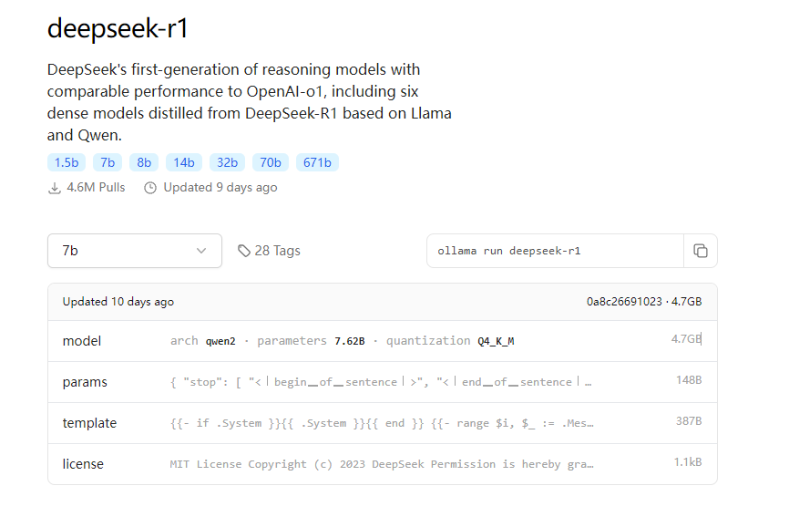

### 步骤 1: 安装 Ollama

官网：[`https://ollama.com/`](https://ollama.com/)

Ollama 是一个简单易用的工具，可以帮助我们轻松地将 DeepSeek-R1 部署到本地。首先，需要确保你的机器环境满足以下条件：

* 操作系统：Linux/MacOS 或 Windows

* GPU：支持 2G 显存的显卡（如 GTX 1050 或其他类似显卡）

**安装命令**

根据你的操作系统，执行以下命令来安装 Ollama。

**在 Linux 或 MacOS 上**

`curl -sSL https://ollama.com/download | bash`

**在 Windows 上**

下载 Ollama 安装包并按提示安装。

**配置环境**

安装完成后，确保你的环境配置正确。执行以下命令来验证：

`ollama --version`

如果显示版本信息，说明 Ollama 安装成功。

### 步骤 2: 安装 DeepSeek-R1 模型

1. **打开终端或命令提示符**：根据你的操作系统打开命令行工具（macOS 用户使用 Terminal，Windows 用户使用 Command Prompt 或 PowerShell）。

2. **拉取模型**：在终端中输入以下命令下载 DeepSeek-R1 模型：

`ollama pull deepseek-r1:1.5b`

该命令会从 Ollama 的官方模型库中拉取 DeepSeek-R1 模型，并下载到本地。

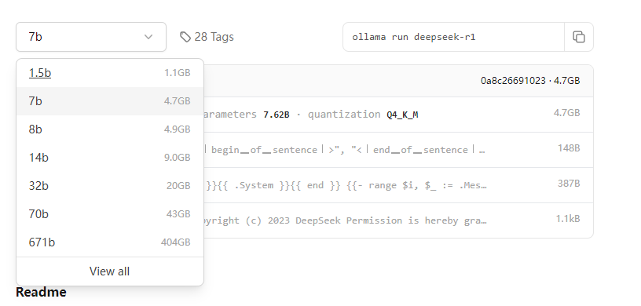

### 步骤 3: 启动模型

1. **运行 DeepSeek-R1 模型**：使用以下命令启动 DeepSeek-R1 模型：

`ollama run deepseek-r1:1.5b`

该命令会启动模型，并在本地环境中启动一个推理服务。

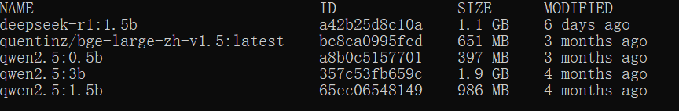

## Chatbox调用DeepSeek-R1接口

本地命令行使用还是不太直观，可以选择 Chatbox 进行网页端访问，提高可交互性。

Chatbox AI 是一款 AI 客户端应用和智能助手，支持众多先进的 AI 模型和 API，可在 Windows、MacOS、Android、iOS、Linux 和网页版上使用。

本地使用 Ollama 部署完成后，可以使用 Chatbox 进行调用。

1、打开官网：[`https://chatboxai.app/zh`](https://chatboxai.app/zh)，选择启动网页版。

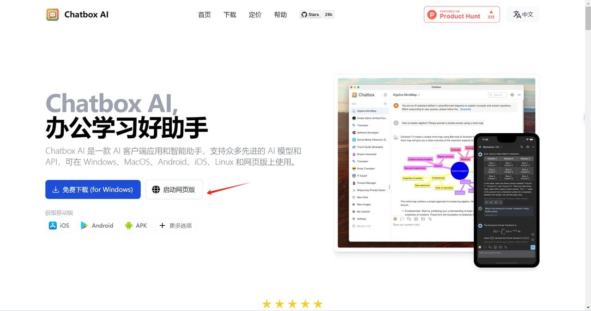

2、选择本地模型，如果找不到，点击左侧的设置按钮。

3、选择 Ollama API。

4、选择模型，本地运行 Ollama 后会自动出现模型的选项，直接选择即可。

5、点击 DISPLAY，选择简体中文，点击保存按钮。

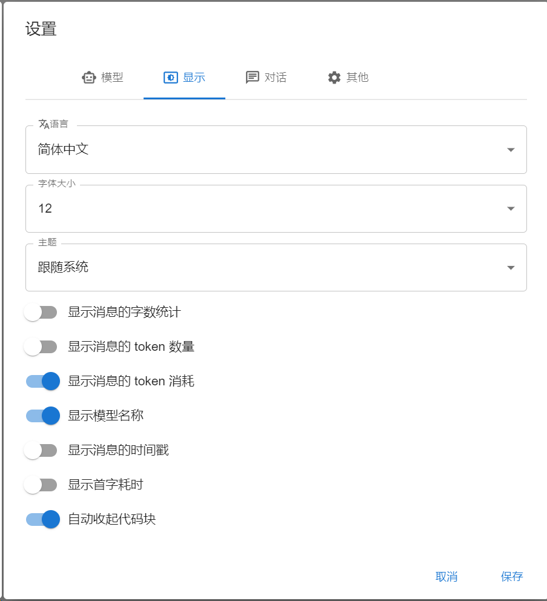

**在 Chatbox 中连接远程 Ollama 服务**

除了可以轻松连接本地 Ollama 服务，Chatbox 也支持连接到运行在其他机器上的远程 Ollama 服务。

例如，你可以在家中的电脑上运行 Ollama 服务，并在手机或其他电脑上使用 Chatbox 客户端连接到这个服务。

你需要确保远程 Ollama 服务正确配置并暴露在当前网络中，以便 Chatbox 可以访问。**默认情况下，需要对远程 Ollama 服务进行简单的配置**

默认情况下，Ollama 服务仅在本地运行，不对外提供服务。要使 Ollama 服务能够对外提供服务，你需要设置以下两个环境变量：

`OLLAMA_HOST=0.0.0.0`

`OLLAMA_ORIGINS=*`

**在 MacOS 上配置**

1. 打开命令行终端，输入以下命令：

`launchctl setenv OLLAMA_HOST "0.0.0.0"`

`launchctl setenv OLLAMA_ORIGINS "*"`

2. 重启 Ollama 应用，使配置生效。

**在 Windows 上配置**

在 Windows 上，Ollama 会继承你的用户和系统环境变量。

1. 通过任务栏退出 Ollama。

2. 打开设置（Windows 11）或控制面板（Windows 10），并搜索“环境变量”。

3. 点击编辑你账户的环境变量。

为你的用户账户编辑或创建新的变量

**OLLAMA\_HOST**值为**0.0.0.0**为你的用户账户编辑或创建新的变量

**OLLAMA\_ORIGINS**值&#x4E3A;**\***。

4. 点击确定/应用以保存设置。

5. 从 Windows 开始菜单启动 Ollama 应用程序。

6、在聊天窗口输入问题进行测试。

**2.3 搭配 GPTs 使用**

1、点击左侧我的搭档

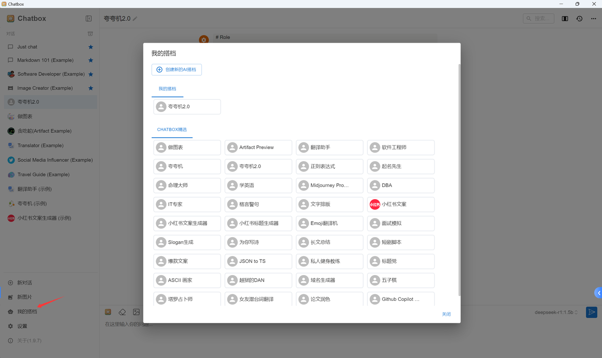

2、选择一个你喜欢的应用，本示例选择夸夸机 2.0

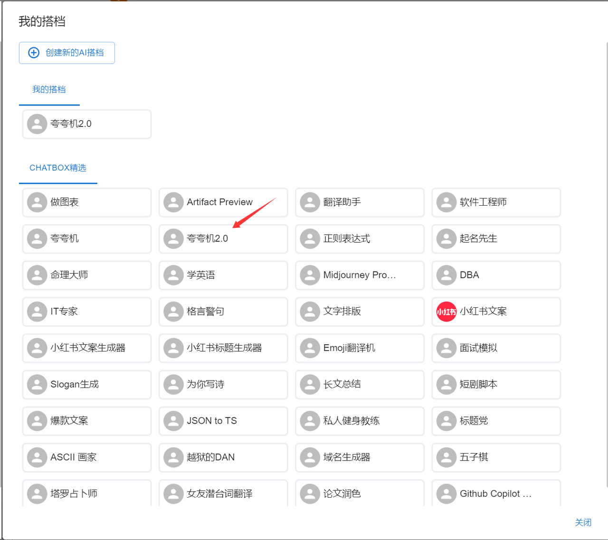

3、随便输入一个场景，看看大模型的回答。比如自嘲、尴尬、夸张的场景，看看他怎么花样夸你。

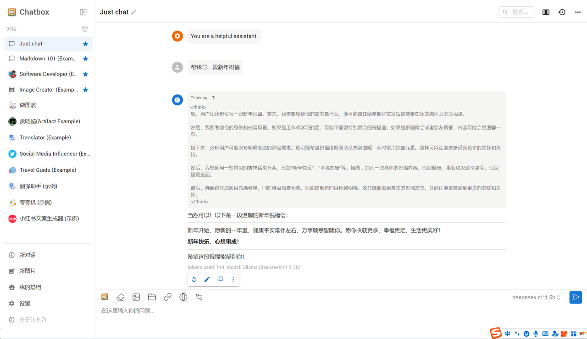

## DeepSeek 知识库搭建

我们还可以通过浏览器插件来访问本地部署的大模型，这个插件还支持本地知识库搭建。

1、安装插件 Page Assist，搜索插件后添加至 Chrome

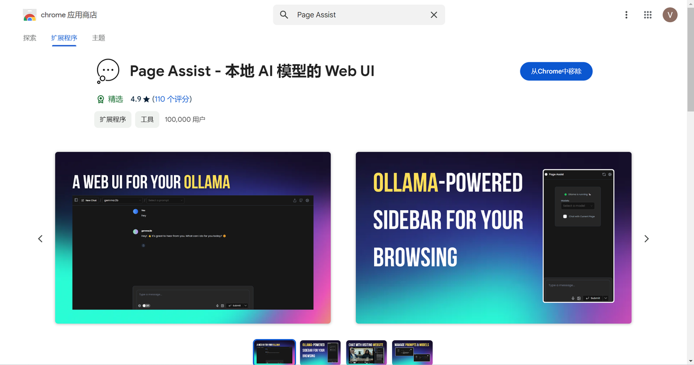

2、选择本地搭建的模型，点击配置按钮，设置中文

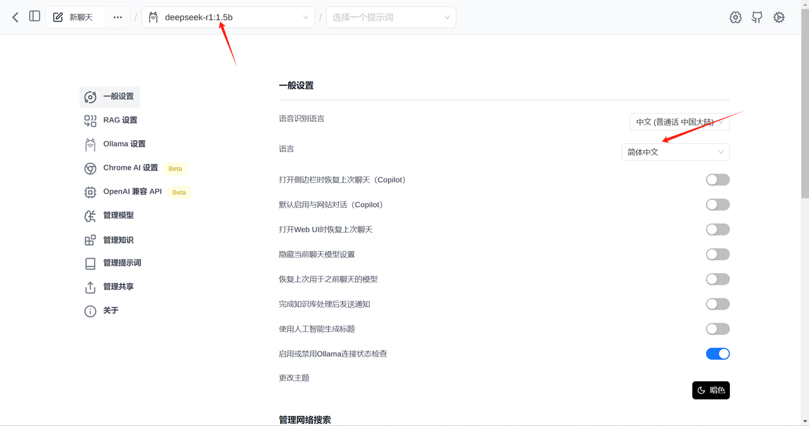

3、RAG 设置，模型选择本地搭建的。

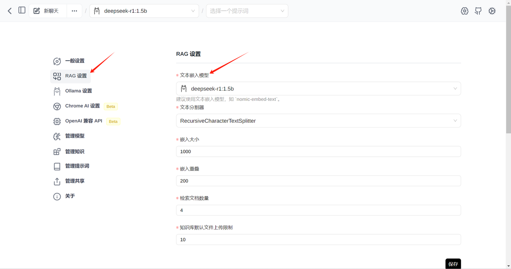

4、点击左侧管理知识，可以添加本地知识库。

填写知识标题及上传文件，点击提交按钮。

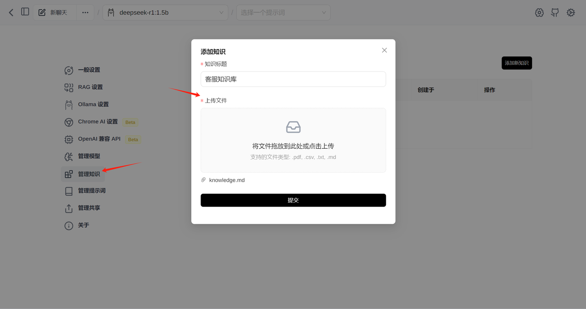

状态为已完成就可以使用了。

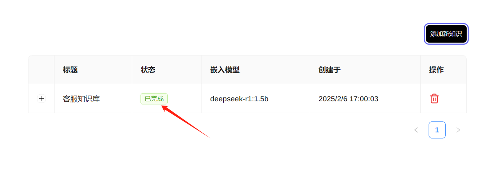

新建聊天进行测试，在聊天窗口要记得点击右下角知识，选择刚才搭建的知识库名称，然后在上方看到就可以了。

对模型进行测试，看看是否可以根据知识库进行回答。

我问了一下《客服知识库》 如何查询账户余额？

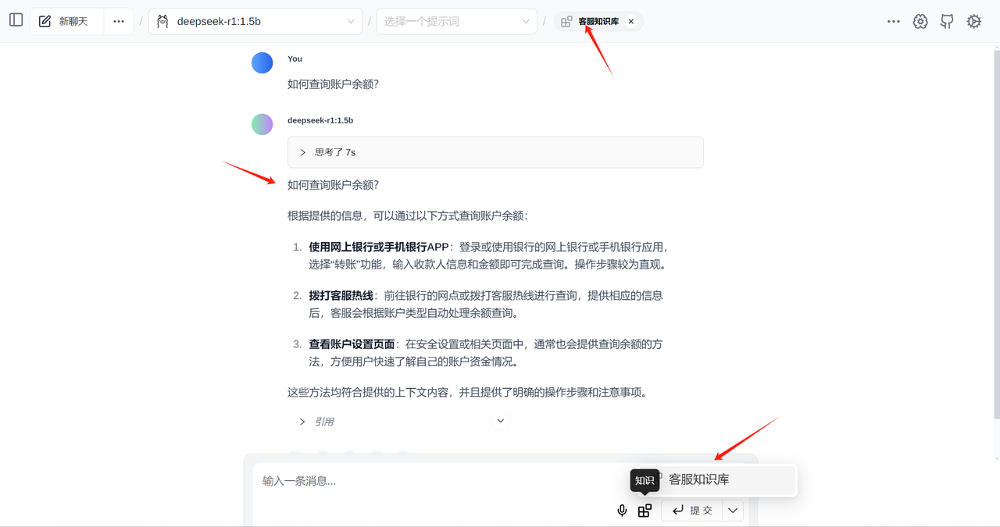

思考完成后，模型给出了最终答案

