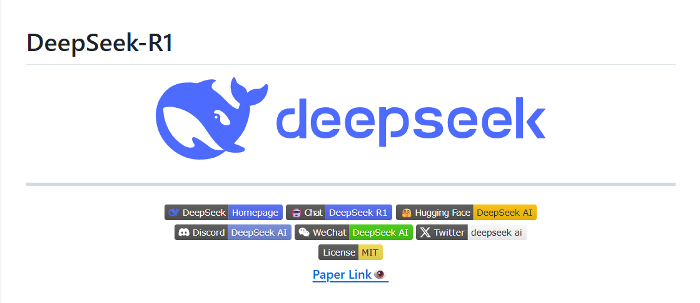
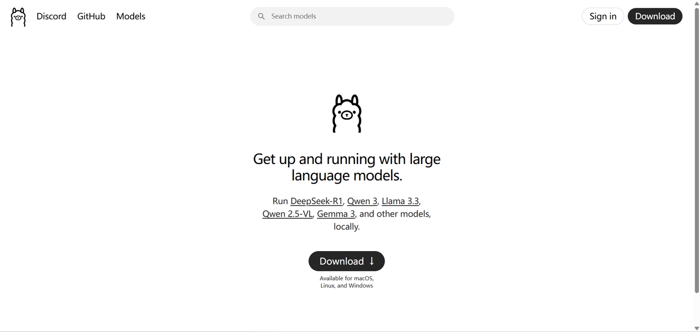
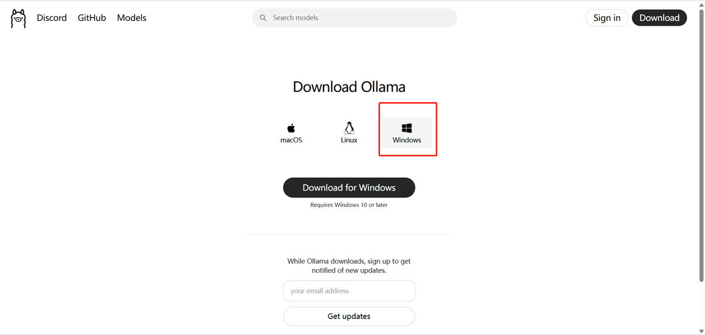
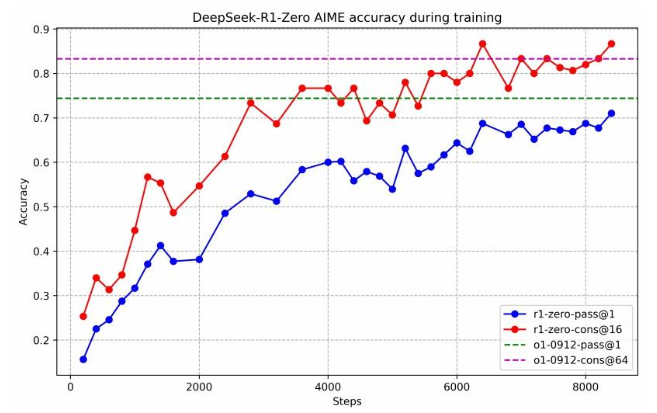
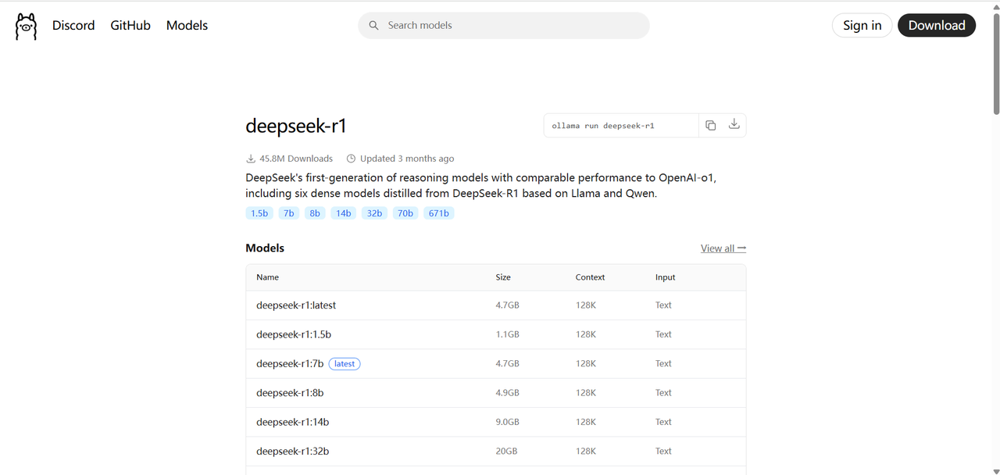
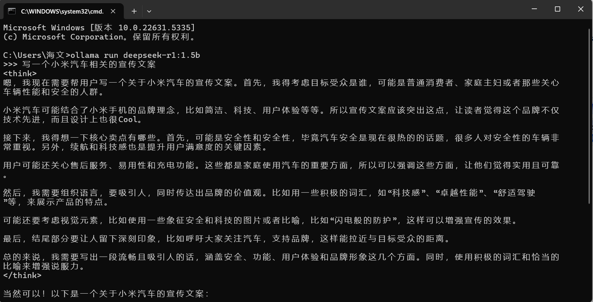

**分享内容**

1. Ollama 部署工具介绍&#x20;

2. DeepSeek-R1主要特点和应用场景

3. 使用 Ollama 部署 DeepSeek-R1步骤

4. 总结

**官网：**<https://www.deepseek.com/>

**GitHub：**<https://github.com/deepseek-ai/DeepSeek-R1>

在人工智能领域，大型[语言模型](https://so.csdn.net/so/search?q=%E8%AF%AD%E8%A8%80%E6%A8%A1%E5%9E%8B\&spm=1001.2101.3001.7020)(LLM）正变得越来越普及，许多用户希望能够在本地环境中运行这些模型，以确保数据隐私、定制化需求或离线工作的便捷性。

DeepSeek-R1 是近期备受关注的高性能 AI 推理模型，专注于数学、编程和自然语言推理任务。与此同时，Ollama 作为一款强大的工具，帮助用户在本地环境中轻松部署和管理大型语言模型。

本文将详细讲解如何通过 Ollama 和 Open WebUI 在本地环境中部署 DeepSeek-R1 模型，并简要介绍 Ollama 和 DeepSeek-R1，帮助用户快速入门并实现本地部署。

如果你想在本地部署 DeepSeek-R1 并且使用支持 2G 显卡的机器，这篇指南将帮助你顺利实现。我们将以 Ollama 为工具，逐步指导你完成部署过程。以下是详细步骤：

## 安装 Ollama

**官网：**<https://ollama.com/>

Ollama 是一个简单易用的工具，可以帮助我们轻松地将 DeepSeek-R1 部署到本地。首先，需要确保你的机器环境满足以下条件：

* 操作系统：Linux/MacOS 或 Windows

* GPU：支持 2G 显存的显卡（如 GTX 1050 或其他类似显卡）

Ollama 的主要特点包括：

1. **简单易用:&#x20;**&#x4F;llama 提供了一个直观的[命令行界面](https://so.csdn.net/so/search?q=%E5%91%BD%E4%BB%A4%E8%A1%8C%E7%95%8C%E9%9D%A2\&spm=1001.2101.3001.7020)（CLI），使得用户能够轻松地从命令行安装、运行和管理 AI 模型。无论是初学者还是有经验的开发者，都能迅速上手。

2. **支持本地部署:&#x20;**&#x4F;llama 允许用户在本地计算机上运行 AI 模型，而不必依赖于云服务。这意味着你可以在不担心网络延迟和数据隐私的情况下，直接在本地运行和调试模型。

3. **轻量化支持：**&#x4F;llama 特别适合资源有限的设备使用。即使是具有较小显存的 GPU（如 2GB 显存）也能运行一些轻量化的模型。这让很多用户可以利用老旧设备，进行 AI 模型的本地运行。

4. **跨平台支持：**&#x4F;llama 支持在多个操作系统上运行，包括 Linux、MacOS 和 Windows。无论你使用哪个操作系统，Ollama 都能提供一致的体验。

5. **多模型管理：**&#x4F;llama 支持管理多个 AI 模型，你可以在一个平台中轻松切换不同的模型，进行不同任务的处理。这对于需要频繁切换模型的开发者非常方便。

6. **自动化更新：**&#x4F;llama 提供自动化更新功能，确保用户能够及时获取模型和工具的最新版本。这有助于保持模型的高效性，并获得最新的功能和安全修复。

7. **GPU 加速：**&#x4F;llama 完全支持 GPU 加速，能够在支持 CUDA 的 GPU 上运行深度学习模型。它能够利用 GPU 的计算能力，大幅度提高训练和推理的速度。

8. **支持不同框架：**&#x4F;llama 支持主流的机器学习框架，如 TensorFlow、PyTorch 等。它允许用户从多种框架中选择模型进行本地运行，提供了很大的灵活性。

9. **简化模型管理：**&#x4F;llama 让模型的安装、下载、运行和更新变得简单，通过命令行一键操作，免去了复杂的手动配置过程。它还为每个模型提供了明确的版本控制，帮助开发者管理和使用不同版本的模型。

10. **节省带宽与数据隐私：**&#x901A;过本地部署模型，Ollama 可以避免上传和下载大量数据，减轻带宽负担。此外，数据不会离开本地计算机，保障了数据隐私，尤其适合需要处理敏感数据的场景。

11. **高效的资源利用：**&#x5373;使在显存较小的设备上，Ollama 也能有效地利用硬件资源进行优化，支持低显存设备进行推理和部署。

### 安装命令

根据你的操作系统，执行以下命令来安装 Ollama。

#### 在 Linux 或 MacOS 上

`curl -sSL https://ollama.com/download | bash`

#### 在 Windows 上

下载 Ollama 安装包并按提示安装。

### 配置环境

安装完成后，确保你的环境配置正确。执行以下命令来验证：

`ollama --version`

如果显示版本信息，说明 Ollama 安装成功。

## DeepSeek-R1 简介

**DeepSeek-R1**是一款基于先进深度学习技术的智能模型，专门设计用于高效的图像分析和目标检测。它利用深度卷积神经网络（CNN）和其他高效算法，能够在图像或视频数据中进行多种任务，如目标识别、图像分类、物体跟踪等。

该模型特别适合需要实时处理和高准确度场景的应用，如安全监控、医疗影像分析、自动驾驶等。

### 主要特点

1. 高精度目标检测DeepSeek-R1 采用了最先进的目标检测架构，结合了高效的特征提取和区域推荐算法，能够准确地识别和定位图像中的多个对象。这使得它在多个领域内，如安防监控、无人驾驶等，具备了卓越的应用潜力。

2. 实时性能DeepSeek-R1 经过优化，支持实时图像分析，即使在资源有限的设备上，也能快速响应。这对于需要低延迟的应用（例如视频监控或实时系统）尤为重要。

3. 高效的计算资源利用该模型可以在显存相对较小的设备上运行，例如 2GB 显卡。这使得它不仅适用于高性能计算资源，也能广泛适用于较为有限的硬件环境。

4. 灵活的架构设计DeepSeek-R1 提供了高度可配置的参数，用户可以根据不同任务需求调整模型结构，例如调整卷积层数、激活函数、损失函数等，以优化性能和精度。

5. 跨平台支持它支持在多种操作系统上运行，包括 Windows、Linux 和 MacOS。无论是服务器端还是本地环境，都能轻松部署。

6. 内置优化算法DeepSeek-R1 内置了多种优化算法，能够有效提升处理速度，减少计算资源的消耗。它支持 GPU 加速，可以利用 CUDA 等技术提高计算效率。

7. 支持多种输入数据格式DeepSeek-R1 支持多种数据格式，包括图像、视频流、以及实时采集的传感器数据。这使得它能够广泛应用于视频分析、自动驾驶、医学成像等多个领域。

8. 易于集成DeepSeek-R1 提供了简洁的接口，用户可以快速将其集成到现有的应用或平台中。这对于开发者来说，降低了使用门槛，能够更加高效地完成系统集成。

### 应用场景

* 视频监控：实时检测监控视频中的异常活动或指定目标。

* 自动驾驶：识别和追踪道路上的行人、车辆及其他障碍物，提供辅助决策支持。

* 医学影像：自动化分析医学影像数据，辅助医生进行诊断，如肿瘤检测、器官识别等。

* 工业检测：在生产线上进行产品检测、缺陷识别等，提高生产效率和产品质量。

## 使用 Ollama 部署 DeepSeek-R1 的步骤

使用 Ollama 部署 DeepSeek-R1 模型的步骤相对简单，以下是详细的部署流程：

### 步骤 1: 安装 Ollama

1. **下载 Ollama：**&#x9996;先，访问 Ollama 官方网站 下载适用于你的操作系统（Windows 或 macOS）的版本。

2. **安装 Ollama：**&#x6309;照安装向导完成安装过程。

### 步骤 2: 安装 DeepSeek-R1 模型

1. **打开终端或命令提示符**：根据你的操作系统打开命令行工具（macOS 用户使用 Terminal，Windows 用户使用 Command Prompt 或 PowerShell）。

2. **拉取模型**：在终端中输入以下命令下载 DeepSeek-R1 模型：`ollama pull deepseek-r1:1.5b`

该命令会从 Ollama 的官方模型库中拉取 DeepSeek-R1 模型，并下载到本地。

### 步骤 3: 启动模型

**运行 DeepSeek-R1 模型**：使用以下命令启动 DeepSeek-R1 模型：`ollama run deepseek-r1:1.5b`

该命令会启动模型，并在本地环境中启动一个推理服务。

### 步骤 4: 配置 Open WebUI

**安装 Open WebUI**：确保你的系统已经安装了 Open WebUI。如果没有安装，可以通过以下命令进行安装：

**配置 WebUI**：运行以下命令启动 Open WebUI：`open-webui serve`

启动后，你可以通过浏览器访问 WebUI 界面，通常是 `http://localhost:8080`

### 步骤 5: 访问和使用模型

**进入 WebUI**：在浏览器中输入 `http://localhost:8080`打开 Open WebUI 页面。

**选择 DeepSeek-R1**：在 WebUI 界面中，你会看到 DeepSeek-R1 模型作为可用选项。选择该模型并开始输入文本或代码，模型会返回推理结果。

### 步骤 6: 自定义设置（可选）

1. **配置参数**：你可以根据需要调整模型的输入参数、最大推理时长等设置。

2. **定制化模型**：如果需要进行特定领域的定制化，可以通过提供数据或微调的方式对模型进行优化。

通过上述步骤，你就能在本地环境中顺利部署 DeepSeek-R1 模型，并通过 Ollama 和 Open WebUI 进行交互。

## 总结

本次介绍了如何在本地环境中部署和使用 **DeepSeek-R1**模型，特别是利用 **Ollama**工具进行安装和配置。

首先概述&#x4E86;**&#x20;Ollama** 的主要特点，包括其简单易用、支持多平台、GPU 加速以及本地部署等优点，使其非常适合资源有限的设备。然后，介绍了 **DeepSeek-R1** 模型的功能和应用场景，如高精度目标检测、实时性能、跨平台支持等，强调其在图像分析和目标检测任务中的广泛应用。

通过具体的步骤，展示了如何通过 **Ollama&#x20;**&#x5B89;装和配置 **DeepSeek-R1**，并使&#x7528;**&#x20;Open WebUI** 进行模型交互。步骤包括：安装 **Ollama**，下载和运行 **DeepSeek-R1** 模型，配置 **Open WebUI**，以及如何通过浏览器访问和使用该模型。

此外，还介绍了如何进行自定义设置和模型定制化，以便满足特定任务需求。

总的来说，提供了一个实用的指南，帮助大家快速在本地环境中部署和使用 **DeepSeek-R1** 模型，特别适合需要保持数据隐私、实现本地推理的场景。

