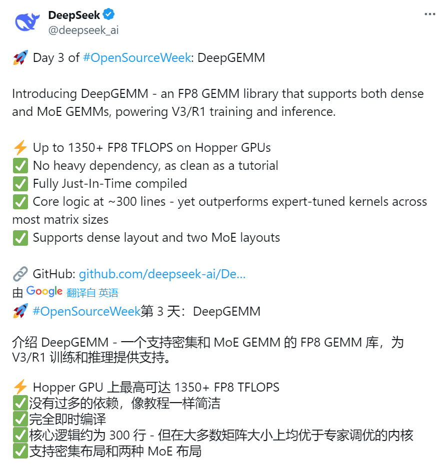
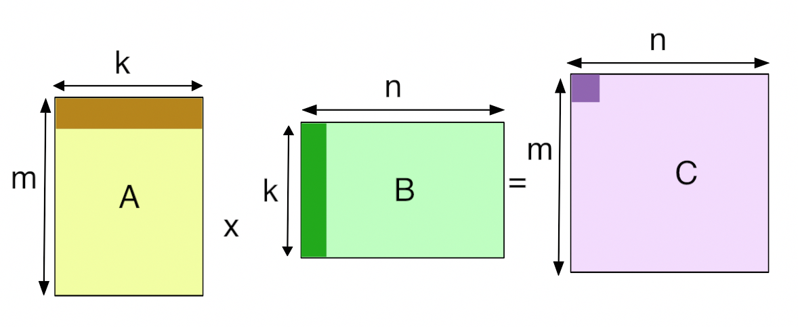
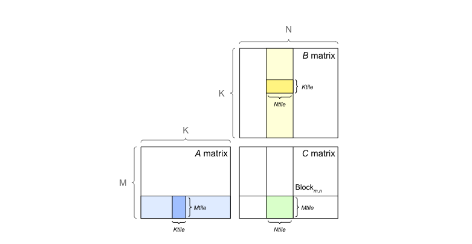
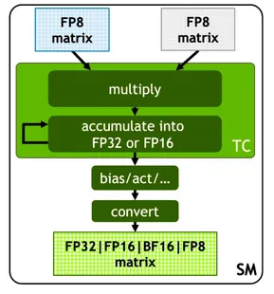
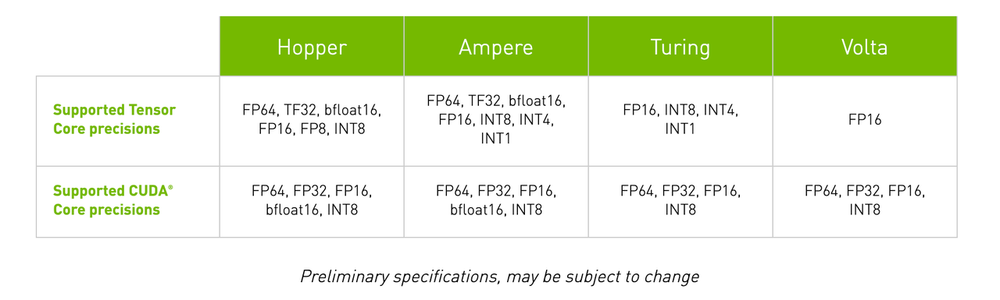
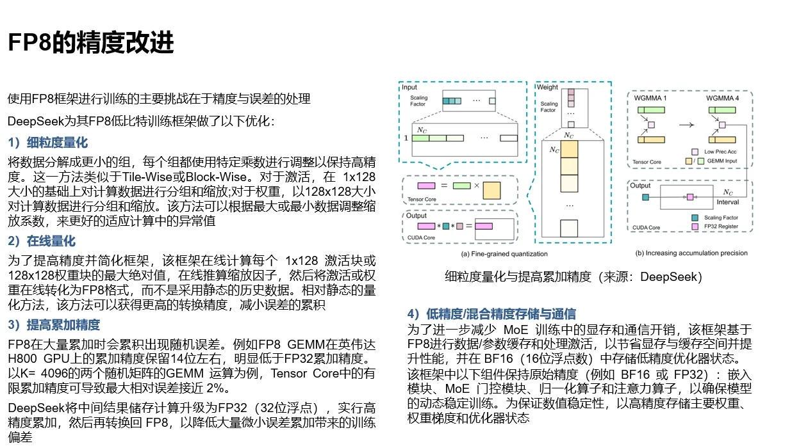
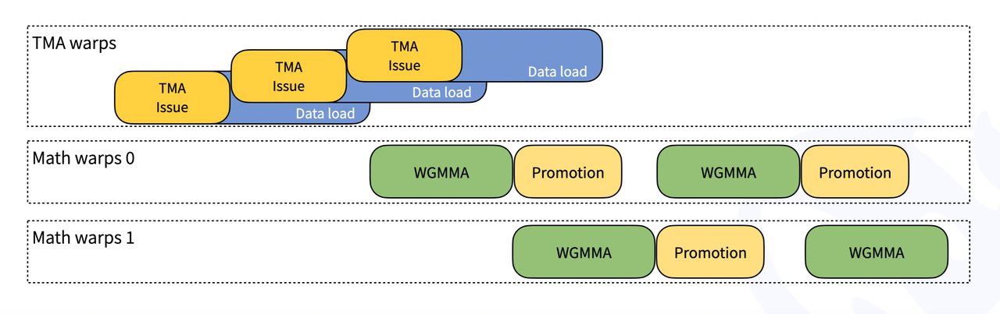
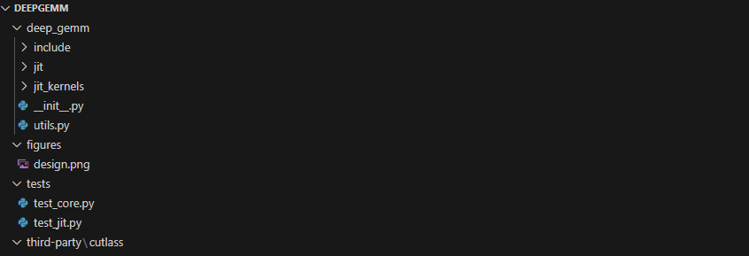

2 月 24 日，DeepSeek 启动 “开源周”，第三个开源的代码库为 DeepGEMM，并向 CUTLASS 团队致敬。DeepGEMM 使用了大量与 Hopper 架构绑定的技术。毫无疑问，H100/H800 绝对是 DeepSeek 的小心肝。另外，从 Day1 到 Day3 的几个创新，都不是一般算法设计能完成的工作，必须要同时对 LLM、[CUDA](https://zhida.zhihu.com/search?content_id=254310094\&content_type=Article\&match_order=1\&q=CUDA\&zhida_source=entity)、[PTX](https://zhida.zhihu.com/search?content_id=254310094\&content_type=Article\&match_order=1\&q=PTX\&zhida_source=entity)、GPU 架构有深入了解才能迅速跟进这类技术。

## 1 DeepGEMM 简介

DeepGEMM 是一个支持 FP8 精度的高性能 GEMM（通用矩阵乘法）库，适用于矩阵和 MoE（Mixture of Experts，专家混合模型）计算。DeepGEMM 具有细粒度缩放功能，采用 CUDA 编写，使用轻量级即时 ([JIT](https://zhida.zhihu.com/search?content_id=254310094\&content_type=Article\&match_order=1\&q=JIT\&zhida_source=entity)) 模块在运行时编译所有内核，PTX 和 SASS 优化轮番上。

细粒度量化与提高累加精度（来源：DeepSeek）

DeepGEMM 反映了 “OpenSeek” 推动 AGI 探索的承诺。X 的 帖子强调其 “无过多依赖”“像教程一样简洁”，这与 DeepSeek 的“社区驱动创新” 理念一致。通过开放 GEMM 底层工具，DeepSeek 不仅展示技术实力，还为 CUTLASS 研究者和开发者提供了高性能计算的参考实现。

DeepGEMM 在某些矩阵尺寸下比 CUTLASS 快 2.7 倍，尤其在 MoE 模型的分组 GEMM 上表现优异。这是非常显著的优势。

项目地址为：

[GitHub - deepseek-ai/DeepGEMM: DeepGEMM: clean and efficient FP8 GEMM kernels with fine-grained scaling](https://link.zhihu.com/?target=https%3A//github.com/deepseek-ai/DeepGEMM)

与前几个开源类似，DeepGEMM 同样需要 [Hopper 架构](https://zhida.zhihu.com/search?content_id=254310094\&content_type=Article\&match_order=1\&q=Hopper+%E6%9E%B6%E6%9E%84\&zhida_source=entity) GPU，CUDA 12.3 或更高版本。

## 2 GEMM 与 TensorCore

### 2.1 GEMM

GEMM（General Matrix Multiplications）即通用矩阵乘法，是将两个矩阵的进行相乘的计算。这种方法称为一般矩阵乘法 （GEMM）。科学计算库（如 Numpy、BLAS 等）和大模型都使用了 GEMM。此实现仅适用于方阵。这样做是为了避免使算法过于复杂而无法处理矩形矩阵。

标准 GEMM 示例（来源：互联网）

在 GPU 中，GEMM 定义为运算 C=αAB+βC

其中 A 和 B 作为矩阵输入，α 和 β 作为标量输入，C 作为预先存在的矩阵，被输出覆盖。普通矩阵乘积 AB 是 α 等于 1 且 β 等于 0 的 GEMM。例如，在全连接层的正向传递中，权重矩阵为参数 A，传入激活为参数 B，α 和 β 通常分别为 1 和 0。在某些情况下，β 可以是 1。

GPU 通过将输出矩阵划分为图块来实现 GEMM，然后将其分配给线程块。图块大小（Tile Size）通常是指这些图块的尺寸。每个线程块通过单步执行图块中的 K 维度，从 A 和 B 矩阵加载所需的值，然后将它们相乘并累加到输出中来计算其输出图块。

GPU 中 GEMM 的一般计算方法（来源：互联网）

### 2.2 Tensor Core

英伟达 GPU 引入了 Tensor Core（张量核心） 来最大限度地提高 GEMM 的速度。使用 Tensor Core 的要求取决于 英伟达库的版本。

Tensor Core 基本结构（来源：英伟达）

第一代 Tensor Core 是随 Volta 架构引入的，从 V100 开始，随着数据格式的变化，Tensor Core 也在不断更新。

Tensor Core 支持的数据格式（来源：英伟达）

GEMM 的实现效率与 Tensor Core 结构和数据格式密切相关，受数据的调度方式影响很大。因此基于 Tensor Core 的硬件架构进行计算优化就显得十分重要。好的优化往往能取得数倍的性能提升。

## 3 DeepEP 的关键技术与未来优化

FP8 的精度改进（来源：中存算半导体）

DeepGEMM 主要特点包括：

* **FP8 支持优化**：DeepGEMM 采用了 CUDA 核心两级累加。（换句话说这也是 NV TensorCore 的设计不足之处）FP8 是一种低比特浮点格式，能够在保持一定计算精度的同时大幅提升计算效率。FP8 在大量累加时会累积出现随机误差。例如 FP8 GEMM 在英伟达 H800 GPU 上的累加精度保留 14 位左右，明显低于 FP32 累加精度。以 K= 4096 的两个随机矩阵的 GEMM 运算为例，Tensor Core 中的有限累加精度可导致最大相对误差接近 2%。DeepSeek 将中间结果储存计算升级为 FP32（32 位浮点），实行高精度累加，然后再转换回 FP8，以降低大量微小误差累加带来的训练偏差。

* **支持分组 GEMM**：与 CUTLASS 中传统的分组 GEMM 不同，DeepGEMM 仅对 M 轴进行分组，而 N 和 K 可保持不变。（可专门针对 MoE 模型中的专家量身定制）

* **即时编译（Just-In-Time, JIT）**：通过 JIT 技术，代码可以在运行时动态生成和优化，进一步提升性能和灵活性。这也是跟 Cutlass 的最大区别。

* **支持 Hopper 架构中的 TMA 加速**：包括 LHS、LHS 缩放因子和 RHS 矩阵的 TMA 负载，TMA 存储输出矩阵，TMA 多播（LHS 矩阵特有）

* **使用 PTX 指令进行性能优化**：使用 stmatrix PTX 指令。

* [**FFMA SASS 交错**](https://zhida.zhihu.com/search?content_id=254310094\&content_type=Article\&match_order=1\&q=FFMA+SASS+%E4%BA%A4%E9%94%99\&zhida_source=entity)：DeepSeek 深入分析了 SASS 编译结果，在 FFMA/FADD 中调整 SASS 指令，提高了细粒度 FP8 GEMM 的性能。（这一点很有趣，说明 DeepSeek 的编译 / 反编译团队做活儿很细，已然不是普通牛马）

* **高性能**：在 Hopper GPU（例如 H100）上，可达到 1350+ TFLOPS 的 FP8 计算性能，这表明 DeepSeek 针对 Hopper 进行了深度优化。（把英伟达编译团队该干的活儿干了）特别是对 Dense 模型的加速比 MoE 更明显。

* **仍在发展**：DeepGEMM 在某些形状上的表现并不是很好。

最后致敬了 Cutlass 团队：估计是英雄爱英雄，github 情谊四射。

## 4 DeepGEMM 架构分析

DeepGEMM 明确仅支持 NVIDIA Hopper 架构的张量核心，依赖 H100 等 GPU 的 FP8 计算能力。FP8 是一种低比特浮点格式，相比 FP16 或 FP32，可以显著提高计算吞吐量，但精度较低。

**1）两级累加结构**

为解决 FP8 张量核心累加的精度不足，DeepGEMM 使用了 CUDA 核心进行两级累加）。这种设计在保持高性能的同时，弥补了硬件本身的局限性。&#x20;

**2) JIT（即时编译）设计**

与其他传统 GEMM 库（如 CUTLASS）需要预编译不同，DeepGEMM 的 JIT 设计允许在运行时动态生成内核。这带来以下优势：

* **灵活性**：无需为不同矩阵大小或硬件配置预先编译多个版本

* **简便性**：用户安装时无需复杂依赖或编译环境。

* **性能优化**：JIT 可以根据实际输入动态调整代码，可能提升缓存命中率或指令调度效率。

在 JIT 中：

* GEMM 形状、块大小和流水线阶数被视为编译常量，从而可能获得更多优化。

* 可自动选择区块大小、warpgroups 数量、最佳流水线阶段和 TMA cluster 大小

* 展开 MMA 流水线，可使编译器进行更多优化

**3) 三种 GEMM 类型支持**

DeepGEMM 支持两种主要 GEMM 类型：

* **常规稠密 GEMM**：通过函数 deep\_gemm.gemm\_fp8\_fp8\_bf16\_nt 调用，适用于常规矩阵乘法。

* **分组 GEMM（连续布局，**&#x43;ontiguous Layou&#x74;**）**：针对 MoE 模型优化，仅对 M 轴分组，N 和 K 保持固定。这种设计适用于 MoE 专家共享相同形状的情况。将多个专家的 token 拼接成单一连续张量，适用于训练前向或推理预填充阶段。每个专家段需对齐到 GEMM 的 M 块大小。

* **分组 GEMM（掩码分组，**&#x4D;asked Grouped GEM&#x4D;**）：**&#x652F;持推理解码阶段，结合 CUDA Graph，适应动态 token 分配。这种分组策略与 CUTLASS 的传统分组 GEMM 不同，体现了 DeepGEMM 对 MoE 模型的针对性优化。

**4) 调度优化**

DeepGEMM 遵循 CUTLASS 设计， 其内核为 warp 专用，支持重叠式的数据移动、张量核心 MMA 指令和 CUDA 核心优化。

* **TMA（Tensor Memory Accelerator）**：Hopper 架构的硬件特性，用于异步数据加载或移动（如 LHS 矩阵、缩放因子等），减少内存访问延迟。

* **指令重叠**：内核采用 warp-specialized 设计，允许数据移动、张量核心 MMA（矩阵乘加）指令和 CUDA 核心累加操作重叠。

* **FP8 微调**：通过修改编译后二进制的 FFMA（融合乘加）指令，调整 yield 和 reuse 位，进一步提升性能（据称在某些情况下提升 10%+）。

* 区块调度器：通过统一的调度器调度所有非分组和分组内核，栅格化（Rasterization ）以增强 L2 缓存的复用 / 重用。

这些优化使得 DeepGEMM 在大多数矩阵大小上优于专家调优的内核，同时保持代码简洁。

DeepGEMM 的 Warp 优化（来源：DeepSeek）&#x20;

与其他库相比

* **CUTLASS**：功能强大但代码复杂，依赖大量模板和预编译，适合通用场景。

* **CuTe**：专注于张量操作的抽象，灵活但需要较深理解。

* **DeepGEMM**：专注于 FP8 和 Hopper，代码简洁，易于学习和修改，适合特定需求（如 DeepSeek-V3 的 MoE 训练）。

## 5 DeepGEMM 代码结构

<https://github.com/deepseek-ai/DeepGEMM>

DeepGEMM 提供了多个接口函数，包括：

* 常规稠密 GEMM：deep\_gemm.gemm\_fp8\_fp8\_bf16\_nt

* 分组 GEMM（连续布局）：m\_grouped\_gemm\_fp8\_fp8\_bf16\_nt\_contiguous

* 分组 GEMM（掩码布局）：m\_grouped\_gemm\_fp8\_fp8\_bf16\_nt\_masked，适用于推理解码。

环境变量包括：

* DG\_CACHE\_DIR：默认 $HOME/.deep\_gemm

* DG\_NVCC\_COMPILER：默认从 PyTorch 获取

* DG\_DISABLE\_FFMA\_INTERLEAVE：0 或 1

* DG\_PTXAS\_VERBOSE：0 或 1

* DG\_PRINT\_REG\_REUSE：0 或 1

* DG\_JIT\_PRINT\_NVCC\_COMMAND：0 或 1

* DG\_JIT\_DEBUG：0 或 1

**/include/deep\_gemm**：存放主要的 DeepGEMM CUDA 计算库。

fp8\_gemm.cuh：主要实现了一个基于 FP8（8 位浮点）的分组通用矩阵乘法（GEMM）内核，用于在 NVIDIA GPU 上进行高效的矩阵乘法计算。

mma\_utils.cuh：定义了一系列用于 CUDA 设备的结构体，这些结构体封装了不同形状的矩阵乘法（GEMM）操作，使用了 Warp Group Matrix Multiply Accumulate（WGMMA）指令。

scheduler.cuh：定义了一个模板结构体`Scheduler`，用于调度不同类型的矩阵乘法（GEMM）操作。

tma\_utils.cuh：一系列用于 CUDA TMA 加速的工具函数和模板，主要用于在 CUDA 编程中处理不同数据类型的张量映射和数据复制。

**jit\_kernels/**：主要的 JIT 计算库。

m\_grouped\_gemm.py：用于定义两个分组通用矩阵乘法（GEMM）函数，支持 FP8 输入和 BF16 输出，并且使用了即时编译（JIT）和自动调优功能。

gemm.py：用于实现 FP8（8 位浮点）输入和 BF16（16 位脑浮点）输出的矩阵乘法（GEMM）操作，并且使用即时编译（JIT）和自动调优来提高性能。

tuner.py：定义了一个名为`JITTuner`的类，用于即时编译（JIT）和自动调优 CUDA 内核代码。

**jit/**：定义 JIT 相关操作。

interleave\_ffma.py：对 CUDA 生成的目标文件（`.so`文件）中的汇编代码进行处理，特别是针对其中的`FFMA`（Fused Fused Multiply-Add，融合乘加）指令段进行寄存器复用的修改。

## 6 DeepGEMM 的不足与未来

DeepGEMM 的现有不足：

* **硬件依赖**：仅支持 Hopper 架构，无法在 Volta、Ampere 等其他 NVIDIA GPU 上运行。

* **功能有限**：专注于 FP8 和 MoE，未提供 FP16/FP32 或更广泛的矩阵操作支持。

* **文档不足**：截至目前，README 提供了基本用法，但缺乏详细的 API 文档或性能测试数据。

DeepGEMM 是一个高效、简洁的 FP8 GEMM 库，专为 英伟达 Hopper 架构和 MoE 模型优化。其 JIT 设计、两级累加和高性能优化（如 TMA 和指令重叠）使其在 DeepSeek-V3 等项目中表现出色。

