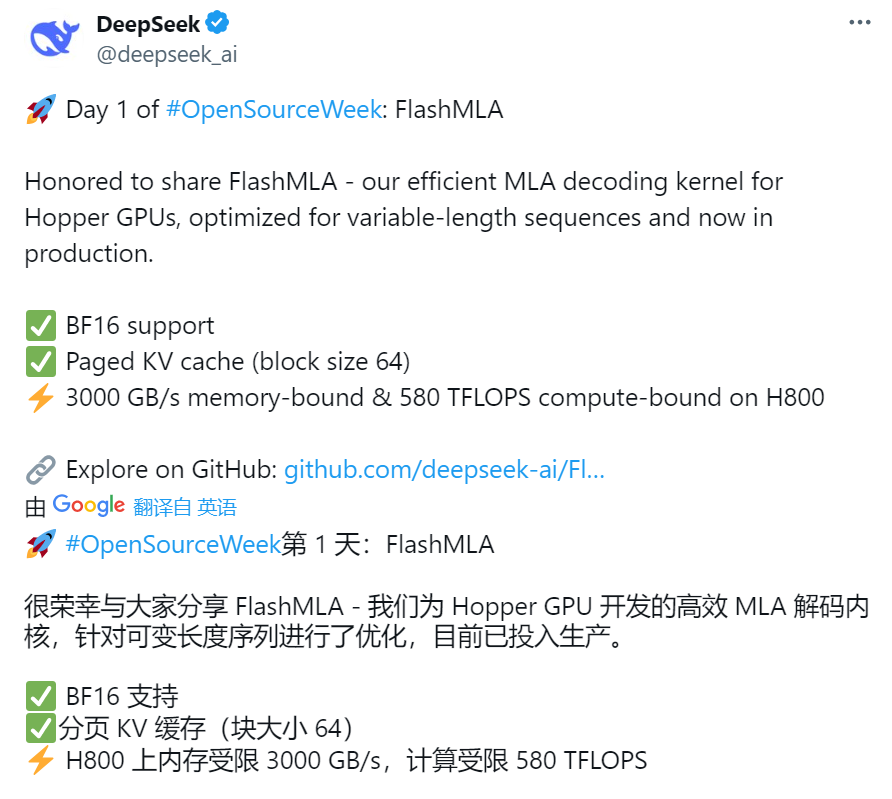
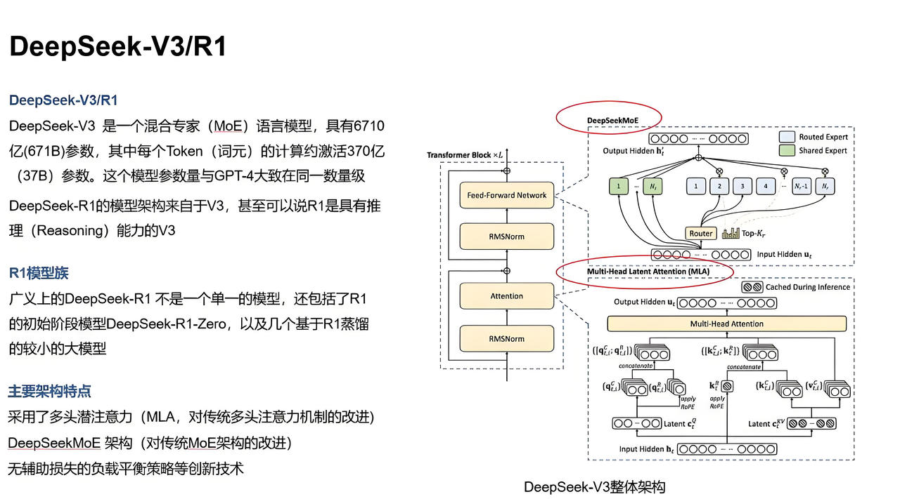
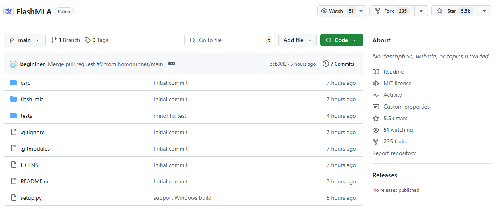
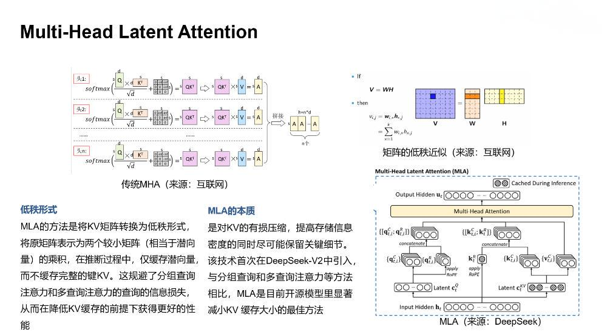
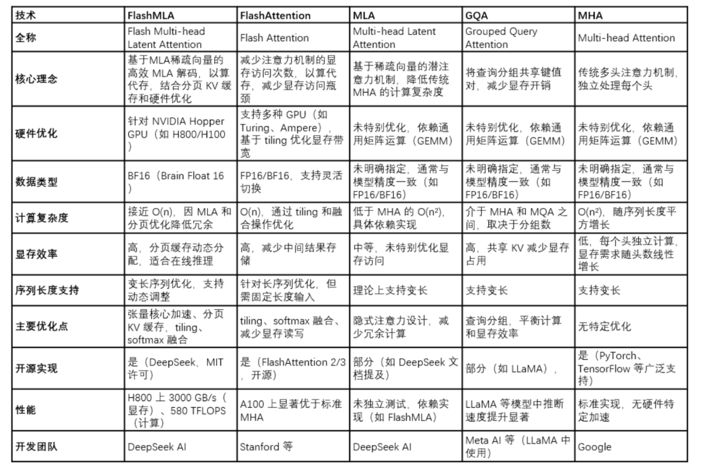
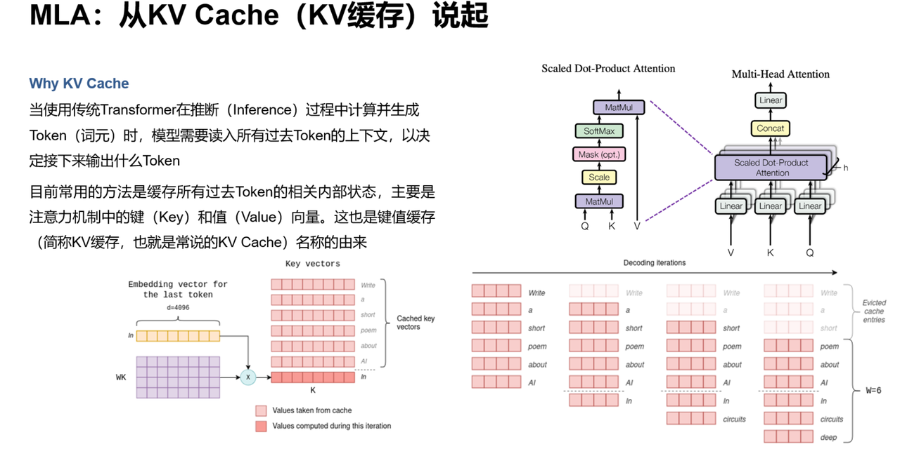
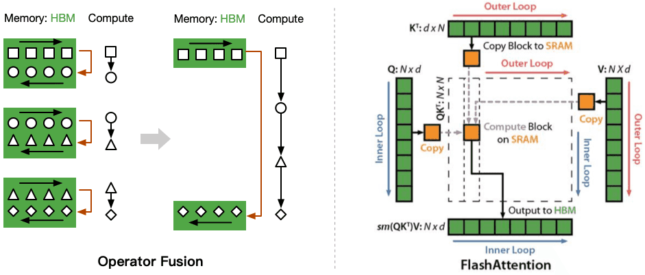
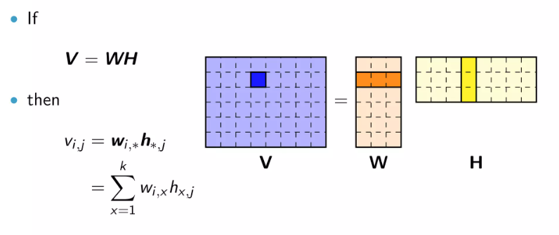
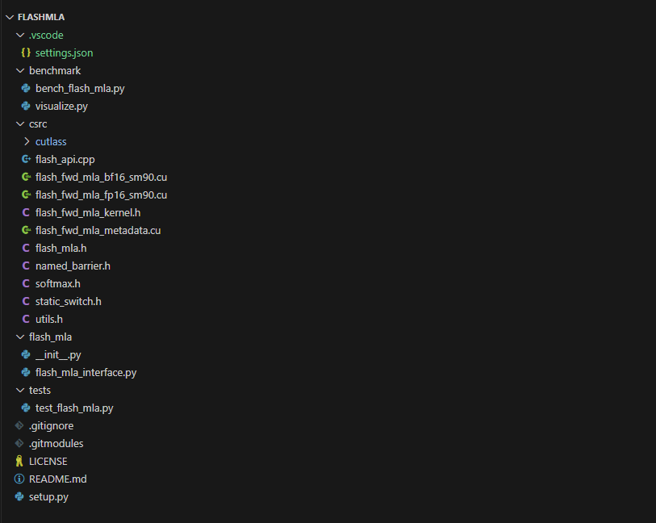

2 月 24 日，DeepSeek 启动 “开源周”，首个开源的代码库为 FlashMLA。DeepSeek 这种挤牙膏式的宣推手段也是很有意思，看来梁文锋团队不仅仅是技术派，也擅长玩技术流量 IP。

## 1 FlashMLA 简介

FlashMLA 是由 depseek-ai （深度求索）开发的一个开源项目，针对 [Hopper 架构](https://zhida.zhihu.com/search?content_id=254228681\&content_type=Article\&match_order=1\&q=Hopper%E6%9E%B6%E6%9E%84\&zhida_source=entity) GPU（例如 H100 或 H800）的高效的 MLA 推断（Inference）解码内核，旨在加速 MLA 机制的计算，特别适用于 DeepSeek 系列模型（如 DeepSeek-V2、V3 和 R1）。

DeepSeek V3/R1 介绍（来源：中存算半导体）

其中 MLA 是 DeekSeek 研发的多头潜注意力（[Multi-head Latent Attention](https://zhida.zhihu.com/search?content_id=254228681\&content_type=Article\&match_order=1\&q=Multi-head+Latent+Attention\&zhida_source=entity)）机制。通过低秩矩阵压缩 KV Cache（键值缓存），减少内存占用，同时提升模型性能。

FlashMLA 借鉴 [FlashAttention](https://zhida.zhihu.com/search?content_id=254228681\&content_type=Article\&match_order=1\&q=FlashAttention\&zhida_source=entity) 分块 Tiling 和显存优化的思想。通过以算代存减少对于显存带宽的要求，提升计算性能。FlashMLA 的构建基于 [Cutlass](https://zhida.zhihu.com/search?content_id=254228681\&content_type=Article\&match_order=1\&q=Cutlass\&zhida_source=entity) 和 [CUDA](https://zhida.zhihu.com/search?content_id=254228681\&content_type=Article\&match_order=1\&q=CUDA\&zhida_source=entity) 体系。

FlashMLA 主要用于大模型推断 / 推理（Inference），特别是在需要处理长序列的场景中，如聊天机器人或代码生成工具。通过优化 GPU 利用率，解决大模型在推理阶段的显存瓶颈问题。

## 2 FlashMLA 的关键技术与未来优化

FlashMLA 是 MLA 技术和 Flash Attention 技术的结合，可以认为是 Flash Attention 的 MLA 版本。

**FlashMLA 具有以下关键特征：**

1）Flash MLA 支持变长序列和分页 KV 缓存。

2）基于 [BF16](https://zhida.zhihu.com/search?content_id=254228681\&content_type=Article\&match_order=1\&q=BF16\&zhida_source=entity) 格式（FP16 也发布了）和至少 12.3 以上的 CUDA。

3）支持 Hopper 架构的 TMA 优化。

4）可显著提升 KV Cache 性能和 GPU 计算性能。在 [H800 SXM5](https://zhida.zhihu.com/search?content_id=254228681\&content_type=Article\&match_order=1\&q=H800+SXM5\&zhida_source=entity) 上，可达 3000 GB/s 的计算带宽（接近 3.35TB/s 的理论峰值）。

5）开源版本暂不支持反向传播计算。

6）使用 MIT 许可证便于社区协作。

Hopper GPU 架构参考文章： <https://zhuanlan.zhihu.com/p/487250706>

**FlashMLA 未来可能的优化方向包括**：

1）通过 PTX 编程进一步提高细粒度性能

2）探索 FP8 数据格式支持（需 Hopper 架构或更先进的 TensorCore）

**FlashMLA与其他相近计算方法对比**

FlashMLA 与其他相近计算方法对比

## 3 从 [Memory Bound](https://zhida.zhihu.com/search?content_id=254228681\&content_type=Article\&match_order=1\&q=Memory+Bound\&zhida_source=entity) 到 Flash Attention 和 MLA

### 3.1 Memory Bound 与 I0-Awareness

传统计算芯片的分层存储架构

在传统的 GPU 和 AI 芯片中，存储架构分为不同的层次。一般来说内部的 SRAM 最快，外部的 HBM 或 DRAM 速度比 SRAM 慢很多。

**1）Die 内存储**: 主要用于缓存 (Cache) 及少量特殊存储单元(例如 texture)，其特点是存储容量小但带宽大。SRAM 就属于常见的 Die（晶片）内存储，存储容量一般只有 20-160MB，但是带宽可以达到甚至超过 19TB/S。

**2）Die 外存储**：主要用于全局存储，即我们常说的显存，其特点是存储容量大但带宽小。HBM 就属于常见的 Die（晶片）外存储，存储容量一般是 40GB 以上，但带宽相比于 SRAM 小得多。

KV 缓存（来源：中存算半导体）

对于 [Transformer](https://zhida.zhihu.com/search?content_id=254228681\&content_type=Article\&match_order=1\&q=Transformer\&zhida_source=entity) 类的大模型来说，由于 KV Cache 巨大，很难直接放在 Cache 里，需要放在 HBM 或 GDDR 上，并在计算过程中频繁挪动 KV 数据。（另外有一些 Transformer Free 的结构就不需要反复挪动 KV 数据，还未成为主流技术）这时就会出现 Memory Bound（存储限制）的情况，极大影响了 KV Cache 的吞吐带宽和大模型的计算速度。

在 Flash Attention 之前，也出现过一些加速 Transformer 计算的方法，着眼点是减少计算量，例如稀疏 Attention 做近似计算。但对于 Attention 来说，GPU 计算瓶颈不在运算能力，而是在存储的读写速度上。Flash Attention 吸取了这些加速方法的教训，改为通过降低对显存 (HBM 或 GDDR) 的访问次数来加快整体性能，这类方法又被称为 I0-Awareness（IO 优先或存储优先）

### 3.2 Flash Attention

FlashAttention 是一种高效的注意力机制优化技术，由斯坦福等大学的研究团队开发，最早于 2022 年提出，并在后续版本（如 FlashAttention-2、FlashAttention-3）中不断完善。FlashAttention 旨在解决传统 Transformer 模型中多头注意力（Multi-head Attention, MHA）的计算和显存瓶颈，尤其是在处理长序列时。FlashAttention 通过重新设计注意力计算方式，显著提升性能，同时保持与标准注意力机制相同的数学输出，使其成为近年来生成式 AI 和大模型领域的重要技术。FlashAttention 拥有比 PyTorch（当时的版本）标准注意力快 2\~4 倍的运行速度，所需内存还减少了 5\~20 倍。

Flash Attention 技术

**Flash Attention** 专注于标准多头注意力的高效实现，通过减少访问显存次数，优化并行度提升计算性能，但并不直接兼容 MLA。

传统 MHA 的计算复杂度为 O(n²)（n 为序列长度），并且需要存储大量的中间结果，这在长序列任务中会导致严重的显存压力和计算延迟。FlashAttention 的核心理念是避免显式计算和存储完整的注意力矩阵，而是通过**分块计算（tiling）** 和**融合操作**，将注意力计算优化为接近 O(n) 的复杂度，同时大幅减少 GPU 内存访问。

**1）分块处理**: 将输入序列分割成小块（tiles），逐块计算注意力，避免一次性加载整个矩阵。

**2）显存优化**: 通过在线计算 softmax 和融合操作，减少中间结果的存储需求。

**3）硬件架构友好**: 充分利用 GPU 高速内存（如共享缓存）和并行计算能力。

### 3.3 MLA

DeepSeek 使用的 Multi-Head Latent Attention 技术可大大节省 KV 缓存，从而显著降低了计算成本。

MLA 的本质是对 KV 的有损压缩，提高存储信息密度的同时尽可能保留关键细节。该技术首次在 DeepSeek-V2 中引入，与分组查询和多查询注意力等方法相比，MLA 是目前开源模型里显著减小 KV 缓存大小的最佳方法。

MLA 的方法是将 KV 矩阵转换为低秩形式：将原矩阵表示为两个较小矩阵（相当于潜向量）的乘积，在推断过程中，仅缓存潜向量，而不缓存完整的键 KV。这规避了分组查询注意力和多查询注意力的查询的信息损失，从而在降低 KV 缓存的前提下获得更好的性能。

矩阵的低秩近似（来源：互联网）

MLA 随好，但明显没有针对现代加速框架的 FlashAttention 或 PageAttention 解决方案。这也使得 DeepSeek R1 在实际部署时需要单独优化 KV 吞吐性能。

## 4 FlashMLA 微架构分析

### 4.1 FlashMLA 核心技术

Flash MLA 的核心是高效的 MLA 解码内核，关键技术包括：

**1）低秩矩阵压缩**：MLA 使用低秩矩阵，将 KV 缓存压缩为潜向量，减少内存占用。通过解压潜向量生成独特的 KV 头（KV Head）。

**2）针对 GPU 优化**：FlashMLA 针对 Hopper GPU 的 Tensor Core 进行 youh 优化，实现了可达 3000 GB/s 的显存带宽和 580 TFLOPS 的计算性能（H800 SXM5 配置）。使用了 SM90 的关键特性 GMMA、namedbarrier 同步、cp.async。

**3）Row-wise/Block-wise 优化**：细粒度划分，在 shared memory 中原位处理计算，减少了额外的中间计算过程的显存占用，减少显存访问次数。

**4）Split-KV 分块处理**：将 KV 拆分给多个 SM（Stream Multiprocessor）处理（或者多次迭代），然后在局部把 partial 计算结果合并。

1. **变长序列支持**：通过 tile\_scheduler\_metadata 和 num\_splits 参数，，FlashMLA 支持变长序列的并行处理，以缓解负载不均衡问题。

### 4.2 FlashMLA 代码结构

<https://github.com/deepseek-ai/FlashMLA>

FlashMLA 提供了 Python 接口，如 get\_mla\_metadata 获取 MLA（Multi-Head Linear Attention）的 meta 数据；flash\_mla\_with\_kvcache，用于获取键值缓存（KV Cache）和执行注意力（FlashMLA）计算。

主要代码结构如下：（需要注意代码库还在不断更新，后面又添加了 benchmark 文件夹）

**1）flash\_mla/ 目录**

* **主要文件**: flash\_mla\_interface.py

* **作用**: Python 接口层，封装了底层 C++/CUDA 实现，以便将 FlashMLA 集成到 PyTorch 工作流中。这部分代码定义了 flash\_mla\_with\_kvcache 等函数，用于执行带 KV 缓存的 MLA 前向计算。参数包括查询向量（q）、键值缓存（kvcache）、块表（block\_table）、序列长度（cache\_seqlens）等。**2）benchmark/ 目录**

* **主要文件**: bench\_flash\_mla.py

* **作用**: 用于对不同的多头注意力（Multi-Head Attention, MLA）实现进行基准测试和性能比较。

run\_torch\_mla：使用 PyTorch 实现的 MLA 基准测试。

run\_flash\_mla：使用 flash\_mla 库实现的 MLA 基准测试。

run\_flash\_infer：使用 flashinfer 库实现的 MLA 基准测试。

run\_flash\_mla\_triton：使用 Triton 实现的 MLA 基准测试

**2）setup.py**

* **作用**: 构建脚本，用于编译和安装 FlashMLA 模块。

**3）csrc/ 目录**

* **文件**:flash\_api.cpp: C++ 接口，连接 Python 和 CUDA。flash\_fwd\_mla\_bf16\_sm90.cu: 核心 CUDA 内核 BF16 支持，针对 Hopper 架构（SM90）优化。flash\_fwd\_mla\_fp16\_sm90.cu：核心 CUDA 内核 FP16 支持。flash\_mla.h, softmax.h, utils.h 等: 提供辅助函数和数据结构。

* **作用**: 实现了 FlashMLA 底层的 CUDA 实现和性能优化。

这部分代码使用 BF16（Brain Float 16）数据类型，以保障 Attention 计算精度。同时结合 FlashAttention 2/3 和 Cutlass 库，以实现高效注意力机制。

**flash\_mla.h：定义接口函数：**

* get\_mla\_metadata(num\_heads, head\_dim, num\_kv\_heads, kv\_head\_dim, block\_size, dtype)：获取 MLA meta 数据。

* flash\_mla\_with\_kvcache(q, k, v, kvcache, seqlen, metadata, causal=True)：执行注意力计算。**softmax.h：行 softmax 的计算（速度瓶颈）\***\*named\_barrier.h：SM90 NamedBarrier 枚举同步。flash\_fwd\_mla\_metadata.cu：定义了一个用于获取 MLA meta 数据的内核函数和一个调用该内核函数的主函数。\*\*

* get\_mla\_metadata\_func：用于调用内核函数。使用 1 个线程块，每个线程块包含 32 个线程。并检查内核函数的启动是否成功。

**Paged KV Cache 实现：**

**显存分块**：以 64 为单位（block\_size = 64），通过 block\_table 维护逻辑块到物理显存的映射。

**流水线**：分离数据加载与计算阶段，通过 cp.async 实现异步数据预取。

flash\_fwd\_splitkv\_mla\_kernel：用于并行计算 Flash Attention 的前向传播。

flash\_fwd\_splitkv\_mla\_combine\_kernel：用于合并多个分割的计算结果。

## 5 FlashMLA 的价值与意义

FlashMLA 是 DeepSeek 团队在 AI 性能优化领域的重要成果，实现了在英伟达 Hopper 架构 GPU 的高效 Inference。其价值在于：

1）通过开源鼓励开发者优化或适配其他硬件（如 AMD GPU 和其他 AI 芯片）。

2）鼓励开发者实现与现有加速框架（如 vLLM、SGLang 等）的集成。

强烈建议 OpenAI 把域名送给 DeepSeek。

