探讨 DeepSeek 大模型的核心技术，从公司背景、模型能力、训推成本到核心技术细节进行了全面分析。

# 一、关于 DeepSeek 公司及其大模型

1.1 公司概况

DeepSeek 2023 年 7 月成立于杭州，是幻方量化旗下的子公司，全称是杭州深度求索人工智能基础技术研究有限公司。

"成立时间才一年多"、"最近推出的 V3 已经能和 OpenAI 的 4o 媲美"、"训练成本不到 600W 美元"、"API 定价仅是国内其他头部厂商几十分之一"、"APP 已经在中美 APP store 登上免费应用榜首"；

以上是最近关于 DeepSeek 的一些新闻热点信息，下面我们从官网看下：

DeepSeek 近半年相继推出了 3 个主要的大模型版本，分别是 DeepSeek V2.5、DeepSeek V3、DeepSeek-R1（无一例外的都是用了 MOE 架构）。在这之前还推出了 DeepSeek-VL、DeepSeek Coder、DeepSeek Math。

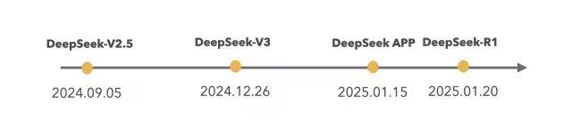

**1.2 模型能力**

DeepSeek 模型已经对标国内 Qwen、海外 Llama、GPT 4o，从公布的榜单评测上看：DeepSeek-V3 在开源模型中位列榜首，与世界上最先进的闭源模型不分伯仲。&#x20;

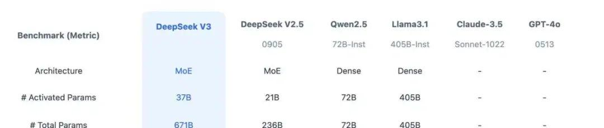

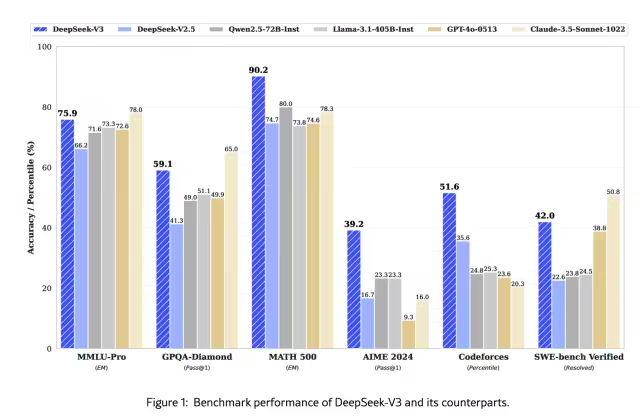

**1.3 训推成本**

推理成本 (API 报价)：百万 Token 输入价格能达到 1 元。

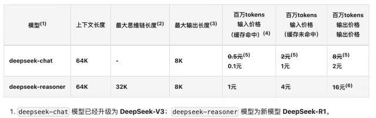

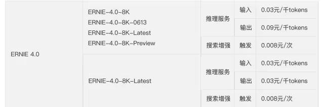

训练成本：从技术报告中看 DeepSeek 用的是 H800 的 GPU 做的训练，而且只有 2 千张左右的 H800，整个 V3 的正式训练成本不超过 600W 美元。

1、预训练阶段，每万亿的 Token 训练 V3 使用 2048 个 H800GPU 集群，只需要 180K 个 H800 GPU 小时，大概 3.7 天 (180000/2048/24)

2、整个预训练总耗时 2664K GPU 小时（不到 2 个月），加上 上下文扩展和后训练，总耗时大概 2788KGPU 耗时。

3、按照 H800 每小时 2 美元租赁，总的训练成本不超过 600W 美元

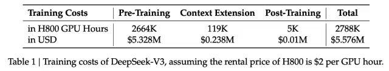

DeepSeek-V3 Technical Report&#x20;

这么低的推理和训练成本不由引出以下的问题：

模型采用了什么样的网络架构？

训练的精度、框架和并行策略是怎样的？

模型的部署和优化方案是怎样的？

在硬件层的计算和通信上做了什么优化？

# 二、DeepSeek 训推核心技术

**2.1 DeepSeek-V3 模型网络架构**

DeepSeekV3 整体预训练用了 14.8 万亿的高质量 Token，并且在后期做了 SFT 和 RL，模型参数量达到 671B，但是每个 Token 仅激活 37B 参数。为了做到高效的推理和训练，DeepSeekV3 自研了 MLA 注意力机制和无辅助损失负载均衡策略的 MoE 架构。

从技术报告中看出，是经典的 Transformer 架构，比较亮眼的就是前馈网络使用的 DeepSeekMoE 架构、Attention 机制使用 MLA 架构，其实这两个在 DeepSeekV2 模型已经被验证使用过。

与 DeepSeek-V2 相比，V3 额外引入了一种无辅助损失的负载均衡策略，用于 DeepSeekMoE，以减轻因需要保证 Expert 负载均衡而导致的性能下降。

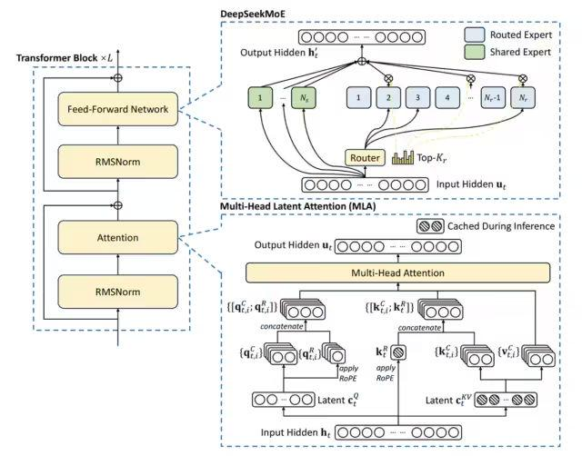

### 2.1.1 DeepSeek MoE

第一个将 MoE 架构引入 Transformer 网络的就是 GShard 架构了，与传统大模型架构相比，MoE 架构在数据流转过程中集成了一个专家网络层。

可以看出传统的 MoE 基本两部分组成：Gating 门控网络、稀疏 MoE 层；

●稀疏 MoE 层: 这些层代替了传统 Transformer 模型中的前馈网络 (FFN) 层。MoE 层包含若干 “专家”(例如 8 个)，每个专家本身是一个独立的神经网络。在实际应用中，这些专家通常是前馈网络 (FFN)，但它们也可以是更复杂的网络结构，甚至可以是 MoE 层本身，从而形成层级式的 MoE 结构。

●门控网络或路由: 这个部分用于决定哪些 Token 被发送到哪个专家。Token 的路由方式是 MoE 使用中的一个关键点，因为路由器由学习的参数组成，并且与网络的其他部分一同进行预训练。

和传统的 MoE 架构相比，DeepSeekMoE 使用更细粒度的专家，并将一些专家隔离为共享专家，减少专家间的知识冗余。

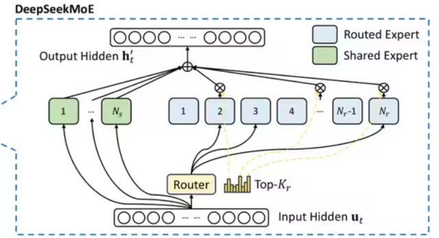

门控网络路由策略：TopK 表示第 t 个 Token 和所有路由专家计算出的亲和力分数中 K 个最高分数的集合，在 DeepSeekV3 中，使用 sigmoid 函数计算亲和力分数，然后在所有选择的亲和力分数中应用归一化来生成门控值。&#x20;

通常在 MoE 模型的训练过程中，不同专家因为路由策略的因素会导致接收的训练数据分布不均，比如所有的 Token 都被发送到只有少数几个受欢迎的专家，那么有些专家就可能没有被训练到。

业界通用的解决方案就是引入辅助损失，但是，有时候过大的辅助损失会损害模型性能。

为了在负载均衡和模型性能之间取得更好的平衡，DeepSeek 开创了一种无辅助损失的负载均衡策略：为每个专家引入一个偏差项

，并将其添加到相应的亲和力分数

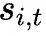

中以确定 top-K 路由，具体来说：如果其对应的专家过载，我们将偏差项减少γ；如果其对应的专家负载不足，我们将偏差项增加γ，其中γ是一个称为偏差更新速度的超参数。

门控网络本质上就是一个 softmax 叠加一个分类网络，那么辅助 loss 往往就是添加一个惩罚项，对输出过大的 logits 进行惩罚，鼓励模型生成更加适度的 logits 值，防止模型生成过于极端的输出。

### 2.1.2 MLA 多头潜在注意力

大模型推理过程 KV Cache 机制一般是限制推理效率的一大瓶颈，而标准的 Transformer 架构里面的 MHA 架构会产出非常多的 KV Cache，为了减少对应的 KV Cache 业界实践过很多方案，例如 PagedAttention、多查询注意力（MQA）和分组查询注意力（GQA），但是性能相比原生的 MHA 有一定差距。&#x20;

DeepSeek-V2，提出一种创新的注意力机制：多头潜在注意力（MLA）。

相比 MQA 的 KV 共用和 GQA 的 KV 分组，MLA 的核心是注意力键和值的低秩联合压缩，以减少推理过程中的键值 (KV) 缓存。相比 MHA 具有更好的性能，但需要的 KV 缓存量要少得多。&#x20;

低秩矩阵是指其秩（rank）远小于其行数和列数的矩阵。

假设我们有一个矩阵，其实际结构允许它被分解为两个较小的矩阵的乘积。这种情况通常意味着原矩阵是低秩的。

假设我们有一个`4×5`的矩阵`A`，这个矩阵可以通过两个更小的矩阵的乘积来表示，比如一个`4×2`的矩阵`B`和一个`2×5`的矩阵`C`。这意味着原始矩阵`A`的信息可以通过这两个较小的矩阵来捕捉，表明`A`是一个低秩矩阵。

低秩压缩计算核心过程：

这里的

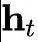

表示第 t 个 Token 的输入，

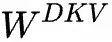

表示 KV 的向下投影矩阵，将

做降维压缩表示，实际得到

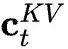

就是要缓存的 KV 压缩隐向量；

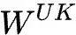

和

是向上做升维的投影矩阵，将 Token 的压缩隐向量

复原为原始 KV 矩阵；

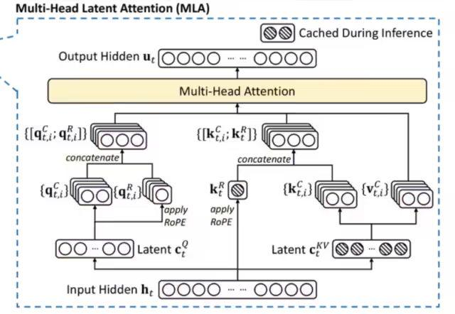

MLA 模块架构图

具体的 Attention 计算推导过程可以参考：MLA 的推导细节

**2.2\***\*训练推理核心技术\*\*  &#x20;

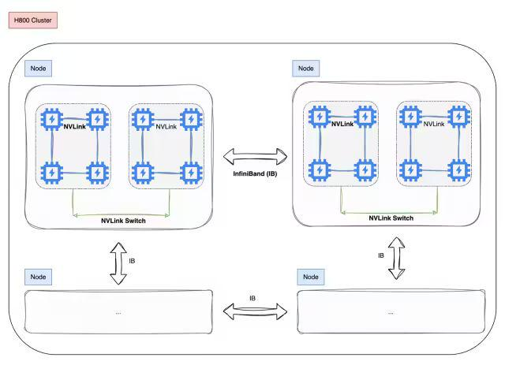

2.2.1 训练框架 HAI-LLM&#x20;

DeepSeek-V3 在一个配备了 2048 个 NVIDIA H800 GPU 的集群上进行训练，使用的是自研的 HAI-LLM 框架，框架实现了四种并行训练方式：ZeRO 支持的数据并行、流水线并行、张量切片模型并行和序列并行。 &#x20;

这种并行能力支持不同工作负载的需求，可以支持数万亿规模的超大模型并扩展到数千个 GPU，同时还自研了一些配套的高性能算子 haiscale，可以帮助 HAI-LLM 极大优化大模型训练的显存效率和计算效率。

2.2.2 核心算法 DualPipe - 创新流水线并行算法

i. 通信计算重叠优化

DeepSeek-V3 应用了 16 路流水线并行（PP），跨越 8 个节点的 64 路专家并行（EP），以及 ZeRO-1 数据并行（DP）。

与现有的流水线并行方法相比，DualPipe 的流水线气泡更少。同时重叠了前向和后向过程中的计算和通信阶段，解决了跨节点专家并行引入的沉重通信开销的挑战。

DualPipe 的关键思想是重叠一对单独的前向和后向块中的计算和通信：将每个块划分为四个组件：注意力、all-all 调度、MLP 和 all-all 组合

例如，假设我们有两个计算块，A 和 B：

1. 在块 A 进行前向传播计算时，可以同时进行块 B 的后向传播通信过程。

2. 当块 A 完成前向传播计算后，开始它的通信过程；而块 B 则开始它的前向传播计算。

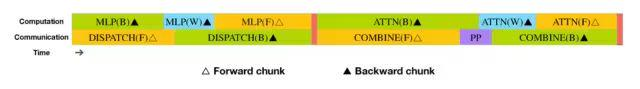

通过优化排列这些功能模块，并精确调控用于通信和计算的 GPU SM 资源分配比例，系统能够在运行过程中有效隐藏全节点通信和 PP 通信开销。

可以看出 DeepSeek 在 PP 这块，做了大量的通信计算重叠优化，从技术报告中看出，即使是细粒度的 all-all 专家通信，all-all 的通信开销几乎为 0。

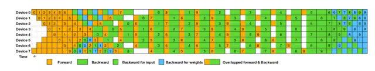

●计算通信重叠

在深度学习大规模分布式训练过程中，通信的速度往往落后于计算的速度，如何在通信的 gap 期间内并行做一些计算就是高性能计算和通信重叠，是实现高效训练的关键因素。

●流水线并行气泡问题

一些大的模型会采用流水线并行策略，将模型的不同层放在不同的 GPU 上，但是不同层之间有依赖关系，后面层需要等前面的计算完才能开始计算，会导致 GPU 在一段时间是闲置的，如下图所示：

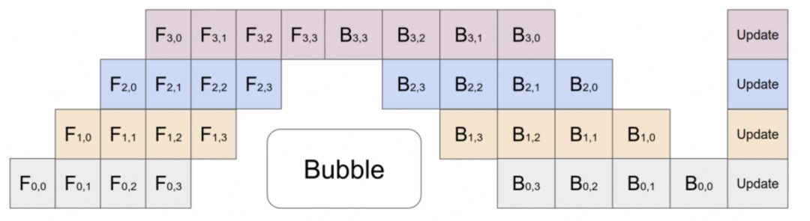

ii. 跨节点全对全通信

DeepSeek 还专门定制了高效的跨节点 all-all 通信内核 (包括调度和组合)。

具体来说：跨节点 GPU 通过 IB 完全互连，节点内通信通过 NVLink 处理，每个 Token 最多调度到 4 个节点，从而减少 IB 通信量。同时使用 warp 专业化技术做调度和组合的优化。

在调度过程中，(1) IB 发送，(2) IB 到 NVLink 转发，以及 (3) NVLink 接收分别由各自的 warp 处理。分配给每个通信任务的 warp 数会根据所有 SM 上的实际工作负载动态调整。

在合并过程中，(1) NVLink 发送，(2) NVLink 到 IB 的转发和累积，以及 (3) IB 接收和累积也由动态调整的 warp 处理。

通过这种方式，IB 和 NVLink 的通信实现完全重叠，每个 token 能够在不产生 NVLink 额外开销的情况下，在每个节点上平均高效选择 3.2 个专家。这意味着，虽然 DeepSeek-V3 实际只选择 8 个路由专家，但它可以将这个数字扩展到最多 13 个专家（4 个节点 × 3.2 个专家 / 节点），同时保持相同的通信成本。

DSV3 采用了 1 个共享专家和 256 个路由专家的 MoE 架构，每个 token 会激活 8 个路由专家。

### 2.2.3 用于 FP8 训练的混合精度框架

这里并没有将全量参数 FP8 量化训练，大多数计算密集型操作都在 FP8 中进行，而一些关键操作则战略性地保留其原始数据格式，以平衡训练效率和数值稳定性。

哪些算子启用 FP8 量化去计算？取舍逻辑是什么？

■大多数核心计算过程，即 GEMM 运算，都以 FP8 精度实现

■涉及对低精度计算的敏感性的算子，仍然需要更高的精度

■一些低成本算子也可以使用更高的精度

以下组件保留了原始精度（例如，BF16 或 FP32）：Embedding 模块、输出头、MoE 门控模块、Normalization 算子以及 Attention 算子。

如何提高低精度训练精度？

■细粒度量化

对激活，在 token 维度采用 group-wise 的量化 (1*128)；对权重，采用 128* 128 的 block-wise 量化

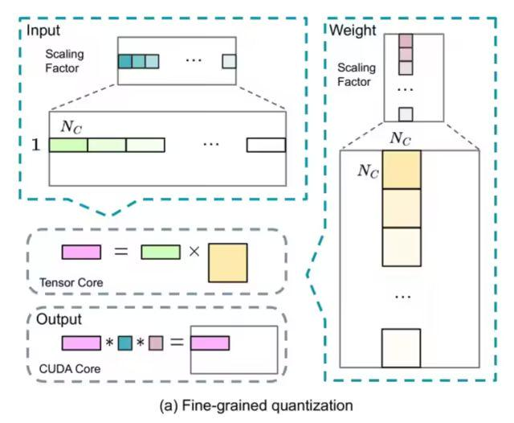

■提高累加精度

在 TensorCore 上执行矩阵 MMA（矩阵乘法累加）操作时，每当累加达到一个间隔时，这些部分结果会被传输到 CUDA Cores 上的 FP32 寄存器中，并在那里进行 FP32 精度的累加计算。

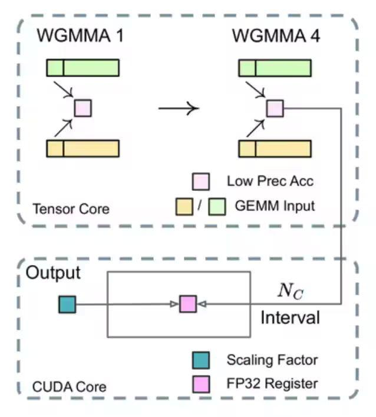

### 2.2.4 MTP 的训练目标

DeepSeekV3 训练过程设置了多 Token 预测的目标，从技术报告的消融实验看出，确实提高了模型在大多数评估基准上的性能，而且 MTP 模块还可以用于推理加速。

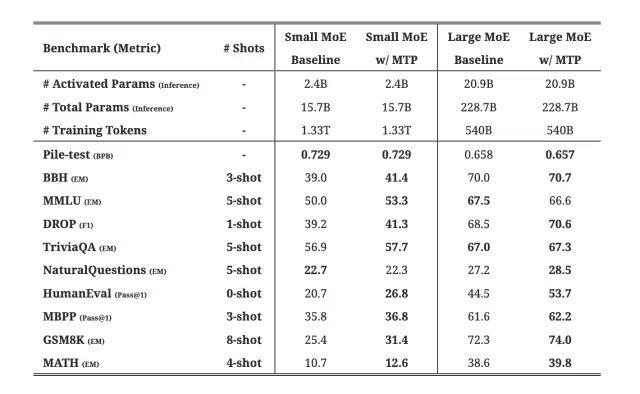

### 2.2.5 推理部署方案

DeepSeek-V3 整体参数量达到了 671B，如此多的参数量，我们看下他的一个部署方案：

推理部署采用了预填充 (Prefilling) 和解码 (Decoding) 分离的策略，确保了在线服务的高吞吐量和低延迟。通过冗余专家部署和动态路由策略，模型在推理时保持了高效的负载均衡。

整套部署方案下来基本是跨机分布式推理。

#### 2.2.5.1 Prefill 阶段

这个阶段简单说就是并行处理用户的 Prompt，将其转为 KV Cache。

预填充阶段的最小部署单元由 4 个节点组成，每个节点配备 32 个 GPU。注意力部分采用 4 路张量并行（TP4）和序列并行（SP），并结合 8 路数据并行（DP8）。其较小的 TP 规模（4 路）限制了 TP 通信的开销。对于 MoE 部分，我们使用 32 路专家并行（EP32）

#### 2.2.5.2 Decoder 阶段

这个阶段就是做自回归的每个 Token 的输出。

解码阶段的最小部署单元由 40 个节点和 320 个 GPU 组成。注意力部分采用 TP4 和 SP，结合 DP80，而 MoE 部分使用 EP320。对于 MoE 部分，每个 GPU 只承载一个专家，64 个 GPU 负责承载冗余专家和共享专家&#x20;

### 总结：为什么 DeepSeekV3 训练成本这么低？

**训练成本主要由模型架构以及训练架构所决定，而且两者一定是相辅相成。从报告中可以看出以下几个原因：**

I.**MLA 机制**：通过对 KV 做联合低秩压缩大幅减少 KV Cache，相比业界从 KV 数量角度做 KV Cache 的减少，MLA 的压缩实现很考验研究团队的基本功。

II.**FP8 训练**：通过低精度计算减少了 GPU 内存使用和计算开销，技术报告中也提到 FP8 混合精度训练框架是首次在一个极大规模的模型上验证了其有效性，这一点也看出 DeepSeek 的 Infra 工程团队的底蕴。

III.**MoE 架构**：通过 MoE 稀疏激活机制大幅减少了计算量，相比 Qwen 和 Llama 的 Dense 架构有很大的训推先天优势，不过难题 (专家的负载、通信、路由) 也给到了 Infra 工程团队。

# 三、为什么是 DeepSeek？

在硅谷，类似 DeepSeek 这样的 AI 创新并不少有，只是这次是一家中国公司做出了这个动作，相比传统的‘美国创新、中国应用’的模式显得格外的让人兴奋。

从最近的一些访谈以及 DeepSeek 的技术报告中也能看出以下几点：

1、大模型是一个知识密集型产业，如何组织高密度人才？显然 DeepSeek 做到了

2、大模型技术没有魔法，更多时候就是考验基本功和驱动力

3、不以商业化为第一要义，很多时候能轻装上阵

# 四、未来思考

1、长远来看，后续可能会有专门的适配 Transformer 架构的芯片，就像为卷积设计了 ASIC 芯片

2、多 Token 预测、MoE 架构可能很长一段时间都是大模型训推架构热门研究方向

3、在国内做 AI，应用始终会比基础研究有市场，更有话语权，但是基础创新和海外的代际差距会越来越小

4、大模型训练和推理，软硬件是一个协同的生态，DeepSeek 的出现将会促进 AI 全行业的更加快速且低成本的迭代

