3月6日 凌晨 3 点，阿里开源发布了新推理模型 QwQ-32B，其参数量为 320 亿，但性能足以比肩 6710 亿参数的 DeepSeek-R1 满血版。

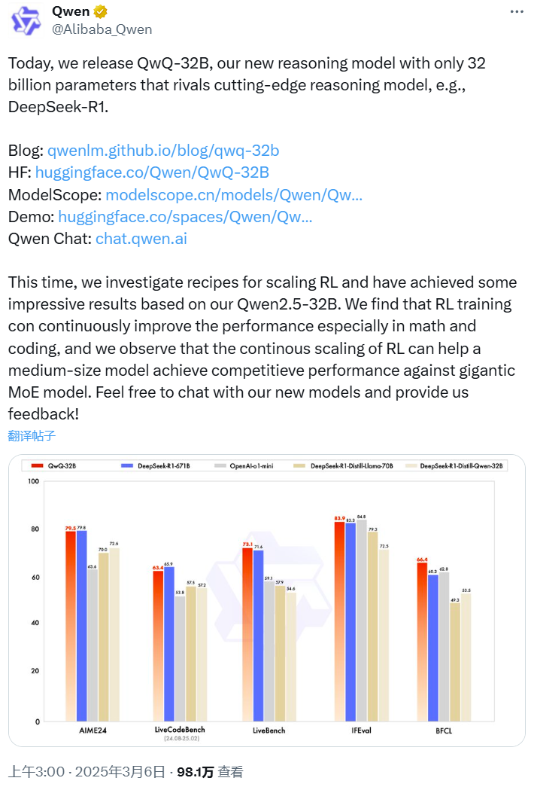

千问的推文表示：「这次，我们研究了扩展 RL 的方法，并基于我们的 Qwen2.5-32B 取得了一些令人印象深刻的成果。我们发现 RL 训练可以不断提高性能，尤其是在数学和编码任务上，并且我们观察到 RL 的持续扩展可以帮助中型模型实现与巨型 MoE 模型相媲美的性能。欢迎与我们的新模型聊天并向我们提供反馈！」

QwQ-32B 已在 Hugging Face 和 ModelScope 开源，采用了 Apache 2.0 开源协议。大家也可通过 Qwen Chat 直接进行体验！

* 博客：<https://qwenlm.github.io/zh/blog/qwq-32b/>

* Hugging Face：<https://huggingface.co/Qwen/QwQ-32B>

* ModelScope：<https://modelscope.cn/models/Qwen/QwQ-32B>

* 演示：<https://huggingface.co/spaces/Qwen/QwQ-32B-Demo>

* Qwen Chat：<https://chat.qwen.ai/>

本地部署工具 Ollama 也第一时间提供了支持：ollama run qwq

<https://ollama.com/library/qwq>

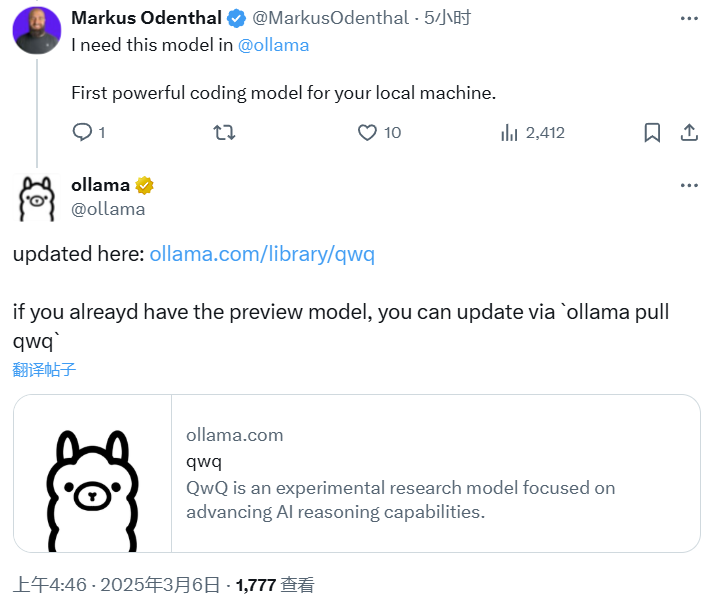

千问官方发布了题为「QwQ-32B: 领略强化学习之力」的官方中文博客介绍这一吸睛无数的进展。考虑到[强化学习之父 Richard Sutton 与导师 Andrew Barto 刚刚获得图灵奖](https://mp.weixin.qq.com/s?__biz=MzA3MzI4MjgzMw==\&mid=2650958043\&idx=1\&sn=dc02ed349a811c96abf0270968621120\&scene=21#wechat_redirect)，QwQ-32B 的发布可说是非常应景。

博客中写到，大规模强化学习（RL）非常具有潜力，在提升模型性能方面可望超越传统的预训练和后训练方法。

近期的研究表明，强化学习可以显著提高模型的推理能力。例如，DeepSeek-R1 通过整合冷启动数据和多阶段训练，实现了最先进的性能，使其能够进行深度思考和复杂推理。

而千问团队则探索了大规模强化学习（RL）对大语言模型的智能的提升作用，推理模型 QwQ-32B 便由此而生。

这是一款拥有 320 亿参数的模型，其性能可媲美具备 6710 亿参数（其中 370 亿被激活）的 DeepSeek-R1。该团队表示：「这一成果突显了将强化学习应用于经过大规模预训练的强大基础模型的有效性。」

QwQ-32B 中还集成了与 Agent（智能体）相关的能力，使其能够在使用工具的同时进行批判性思考，并根据环境反馈调整推理过程。该团队表示：「我们希望我们的一点努力能够证明强大的基础模型叠加大规模强化学习也许是一条通往通用人工智能的可行之路。」

**模型效果**

QwQ-32B 在一系列基准测试中进行了评估，包括数学推理、编程和通用能力。以下结果展示了 QwQ-32B 与其他领先模型的性能对比，包括 DeepSeek-R1-Distilled-Qwen-32B、DeepSeek-R1-Distilled-Llama-70B、o1-mini 以及原始的 DeepSeek-R1。

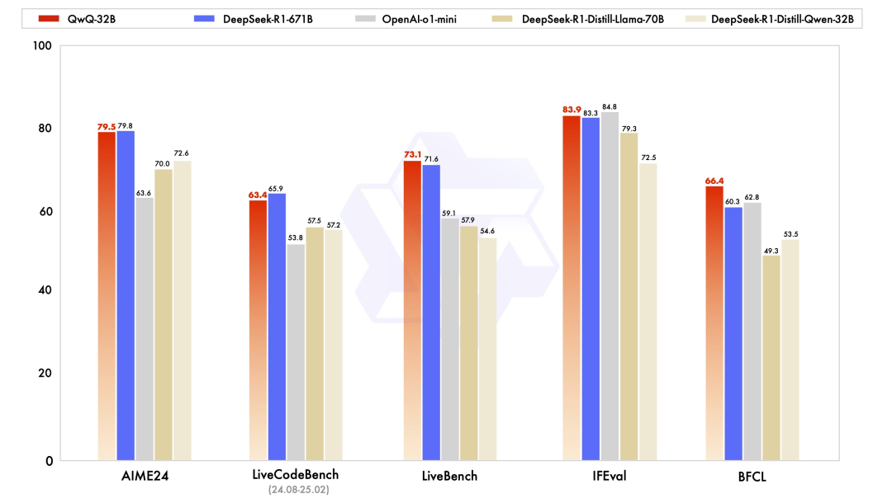

可以看到，QwQ-32B 的表现非常出色，在 LiveBench、IFEval 和 BFCL 基准上甚至略微超过了 DeepSeek-R1-671B。

**强化学习**

QwQ-32B 的大规模强化学习是在冷启动的基础上开展的。

在初始阶段，先特别针对数学和编程任务进行 RL 训练。与依赖传统的奖励模型（reward model）不同，千问团队通过校验生成答案的正确性来为数学问题提供反馈，并通过代码执行服务器评估生成的代码是否成功通过测试用例来提供代码的反馈。

随着训练轮次的推进，QwQ-32B 在这两个领域中的性能持续提升。

在第一阶段的 RL 过后，他们又增加了另一个针对通用能力的 RL。此阶段使用通用奖励模型和一些基于规则的验证器进行训练。结果发现，通过少量步骤的通用 RL，可以提升其他通用能力，同时在数学和编程任务上的性能没有显著下降。

**API**

如果你想通过 API 使用 QwQ-32B，可以参考以下代码示例：

**未来工作**

千问团队还在博客中分享了未来计划，其中写到：「这是 Qwen 在大规模强化学习（RL）以增强推理能力方面的第一步。通过这一旅程，我们不仅见证了扩展 RL 的巨大潜力，还认识到预训练语言模型中尚未开发的可能性。在致力于开发下一代 Qwen 的过程中，我们相信将更强大的基础模型与依托规模化计算资源的 RL 相结合，将会使我们更接近实现人工通用智能（AGI）。此外，我们正在积极探索将智能体与 RL 集成，以实现长时推理，目标是通过推理时间扩展来释放更高的智能。」

**QwQ-32B 收获无数好评**

QwQ-32B 一发布就收获了无数好评，甚至我们的不少读者也在催促我们赶紧报道。

在前段时间的 DeepSeek 热潮中，大家都热衷于讨论满血版，因为蒸馏版性能受限。但是 671B 的满血版模型无法轻易部署，普通的端侧设备只能退而求其次。现在，Qwen 把模型大小打下来了，端侧有希望了吗？

有网友表示，手机上肯定还不行，但运行内存比较高的 Mac 或许可以一战。

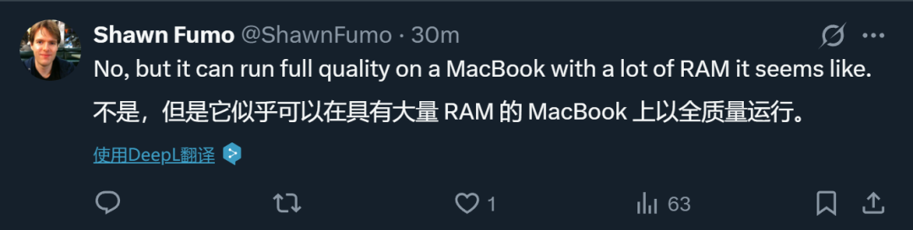

还有人喊话阿里巴巴通义实验室科学家 Binyuan Hui 去做更小的模型。

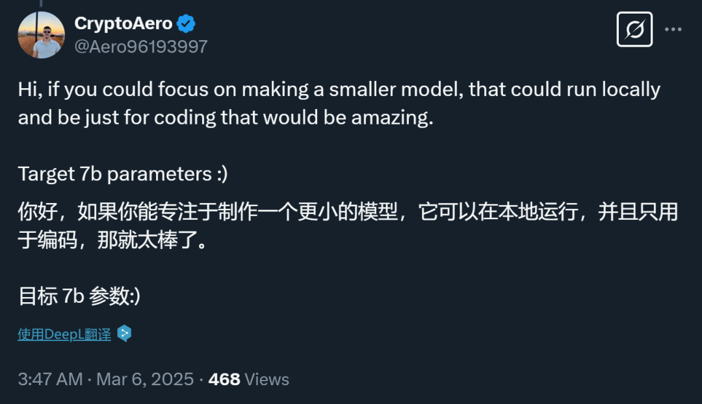

还有人晒出体验，表示运行很快：

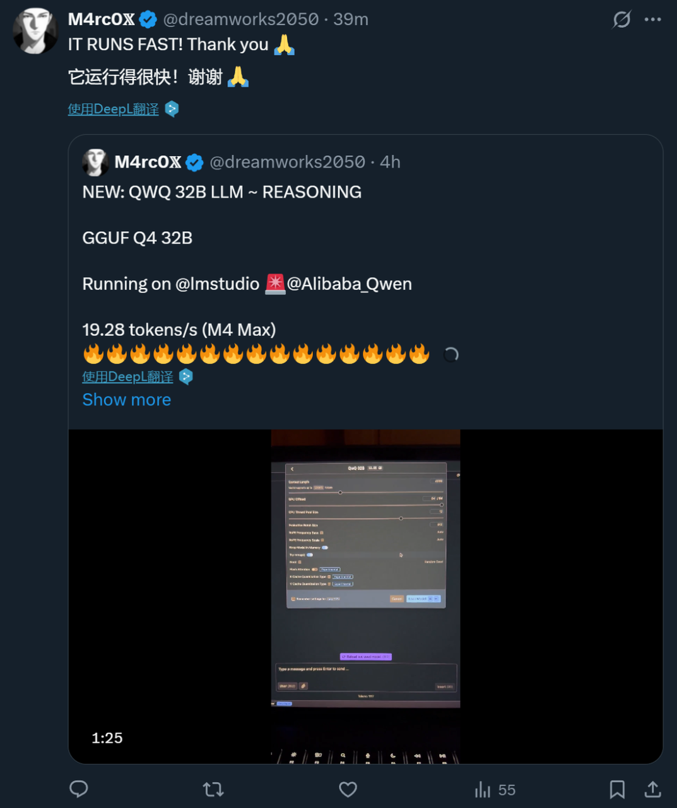

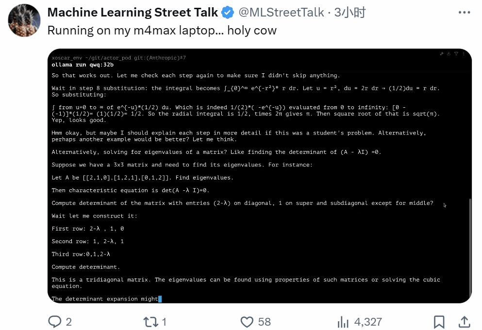

苹果机器学习研究者 Awni Hannun 也同样已经在 M4 Max 上成功运行了 QwQ-32B，看起来速度非常快。

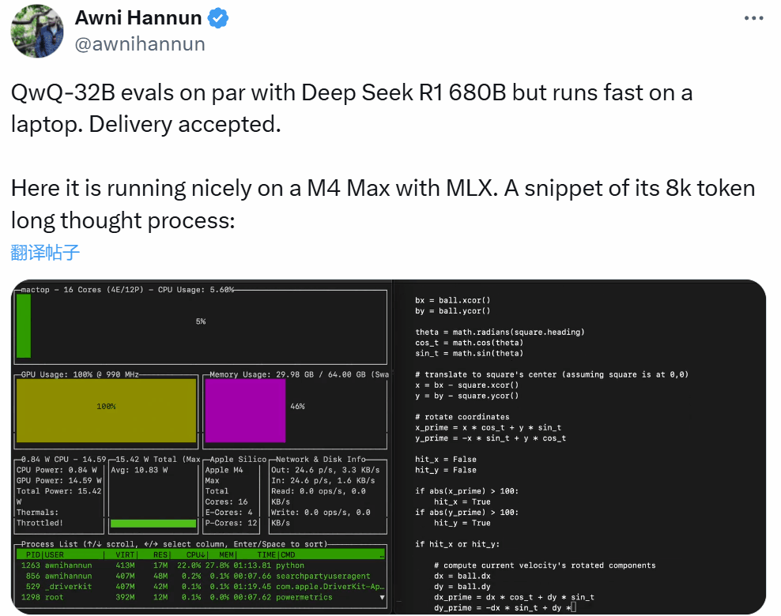

AutoDL 租了一台 A800-80G 的显卡，然后把模型下载了下来，并部署测试了一下这个怪物。综合体验下来，本地部署版和网页版其实是一样的。

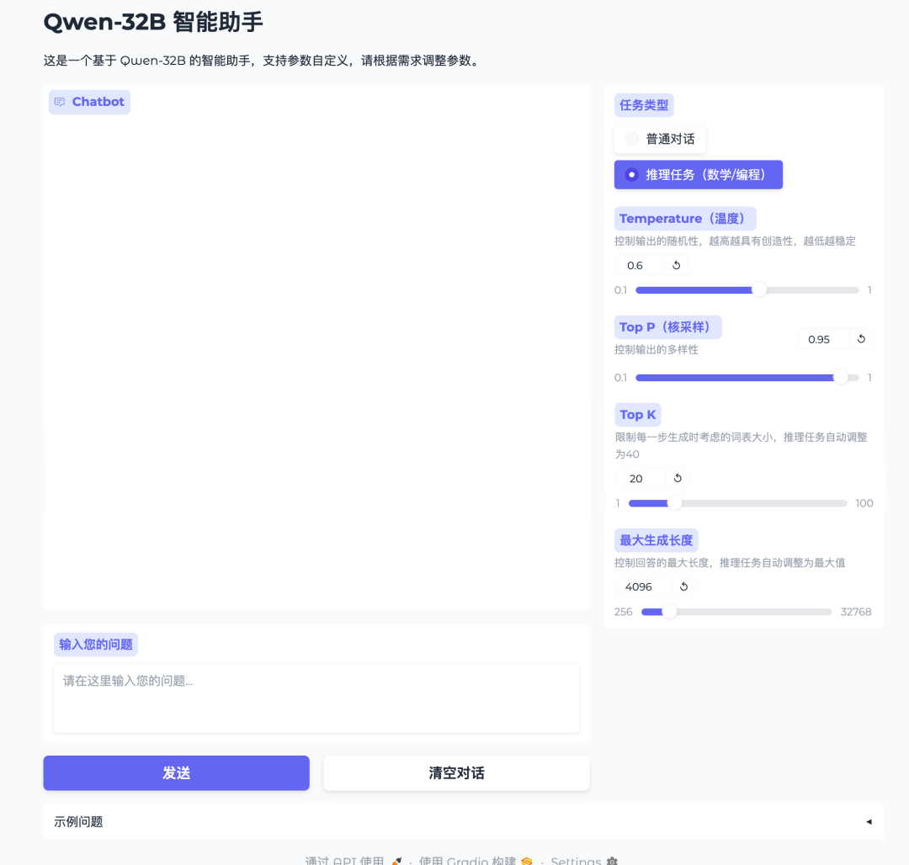

性能曲线是这样的。

我也做了一些测试。

首先就是，我觉得赛博半仙易主了。这回的 QwQ-32B 真的能当八字算命大师了。

懂得都懂，AI 自媒体人的命也是命，它掐指一算，就知道我经常熬大夜，狂肝文章。下半年家里那些鸡毛蒜皮的事就别提了，为了搭我的摄影棚，把景深弄得更到位，我是真得搬家啊。。。

当然，AI 算命只能算是个开胃菜，接下来还是得认真测下 QwQ-32B 的数学能力。

然后就是拿我的著名的国庆调休题来难为下这类推理模型了：

**这是中国 2024 年 9 月 9 日（星期一）开始到 10 月 13 日的放假调休安排: 上 6 休 3 上 3 休 2 上 5 休 1 上 2 休 7 再上 5 休 1。请你告诉我除了我本来该休的周末，我因为放假多休息了几天？**

比如 Grok3 这种，开了推理还是直接炸了。

答案明明是 4 天，你咋独自加了 3 天。。。

而看看 QwQ-32B，在一顿小推理之后。

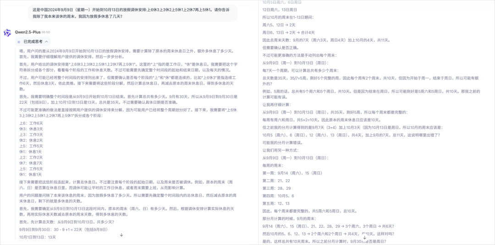

最后答案，完全正确。

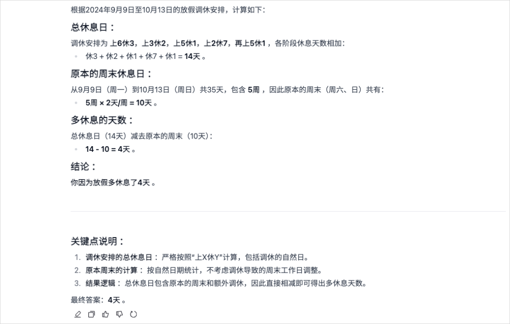

要知道，这可只是一个 32B 的小模型啊。。

然后我还试了一下代码能力。我就直接去 Leetcode 找了一道困难级别的算法题，解数独。

可能有人不知道 Leetcode 是啥，LeetCode 是一个全球知名的在线编程练习平台，这个平台有大量不同难度的算法题库，从简单到困难的各种编程题都有。

我直接把解数独的题目还有代码模板丢给 QwQ-32B，让它给出最优解的代码：

*编写一个程序，通过填充空格来解决数独问题。*

*数独的解法需遵循如下规则：*

*数字 1-9 在每一行只能出现一次。*

*数字 1-9 在每一列只能出现一次。*

*数字 1-9 在每一个以粗实线分隔的 3x3 宫内只能出现一次。（请参考示例图）*

*数独部分空格内已填入了数字，空白格用 '.' 表示。*

*然后给定你一个类，给我一个比较好的方案：*

*class Solution(object):*

*def solveSudoku(self, board):*

*"""*

*:type board: List\[List\[**str**]]*

*:rtype: None Do not return anything, modify board in-place instead.*

*"""*

经过几分钟的思考，这道题的完整最优解代码也是被 QwQ-32B 成功给出。

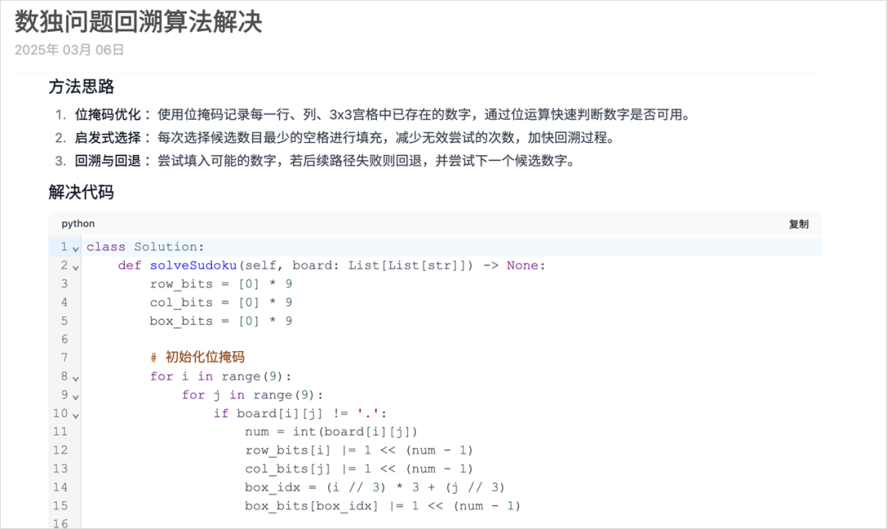

我把这段代码粘贴到了 Leetcode 平台上，直接提交，没想到这段代码竟然完美的通过了全部测试用例吗，而且执行用时才 127ms，击败了 93% 的在这个算法题库做尝试的人。

说实话，这个结果让我挺惊讶的，毕竟 127ms 的用时，看平均的用时基本都在 1691ms 左右。

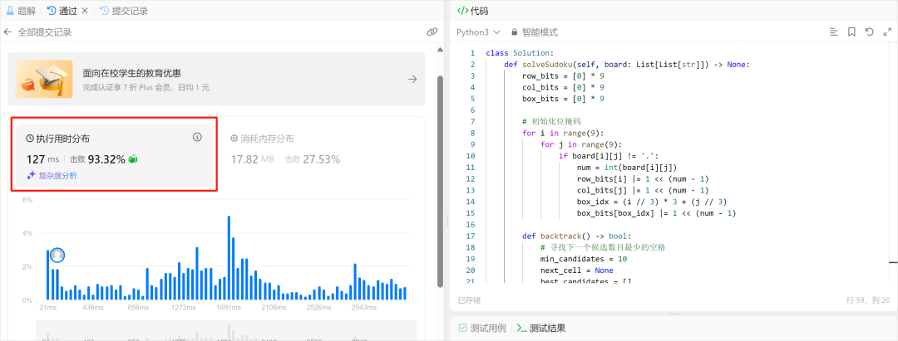

很强，但是我觉得最强的，还是它未来的生态。

32B 和 671B，对于本地算力的要求，或者是云服务的成本来说，差别实在是太大太大了。

671B，在 FP16 精度下需要 1400G 的显存，这个门槛有多高大家懂得都懂。

而现在，32B 的 QwQ，4 张 4090 就能跑，这是将近 15 倍的差距。

而且，智能水平差不多。

这也意味着很多普通企业还有普通开发者，可以直接拿到一个足以对标 DeepSeek R1 的逻辑推理、数学推理、代码思考能力的大模型，而且还开源，能在自家环境中任意调试、微调、二次开发。

更何况，阿里云上的资源、ModelScope、Hugging Face 镜像都能对接，瞬间就把部署壁垒降到几乎为零。

对于那些创新型创业者、小型团队，或者想要做专业 AI 应用的公司而言，我说实话，这就是天降神兵。

对于大多数的企业垂直场景，一个优秀的 32B 的模型真的已经足以应付很很多，没必要非得上 600 多亿参数、又烧又贵的巨无霸。

这波 QwQ-32B 开源的意义，还是非常强的。

它用实力证明 RLHF 路线还能玩出花，打破了一些人对 GPT4.5 撞墙后的过度悲观。

用中等规模却拿到高级性能，给开源界注入了强大信心，你也不必搞那种天价设备和超大规模，也有机会跟国际巨头同场竞技。

