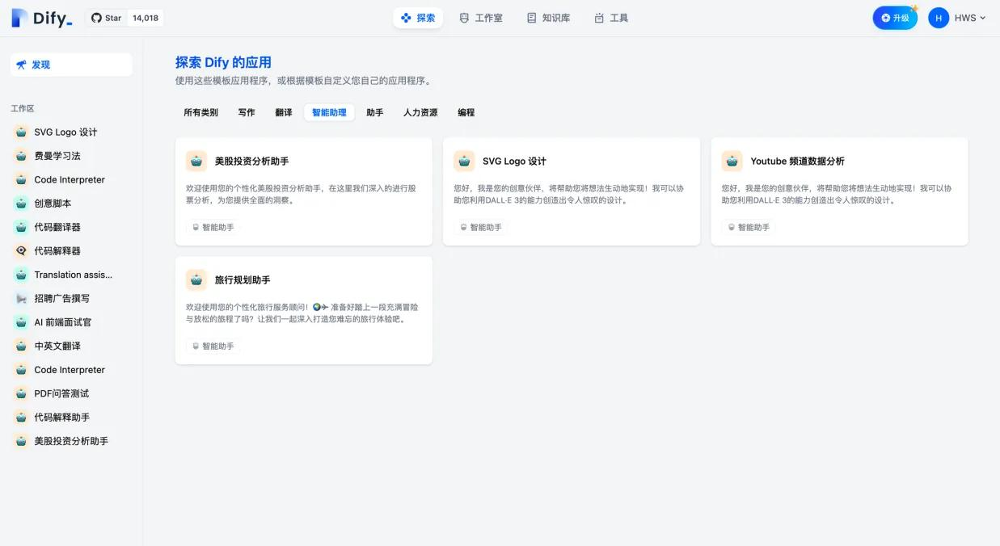
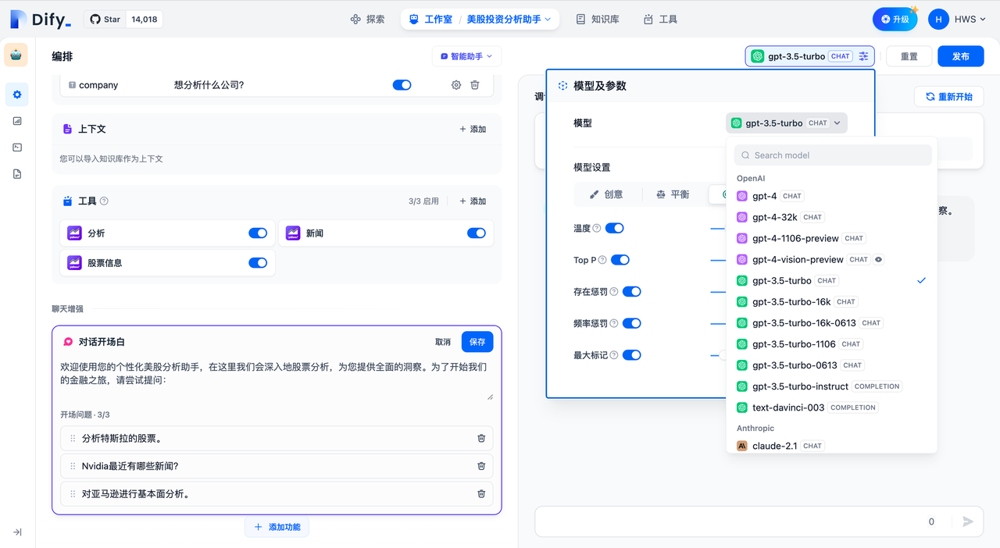
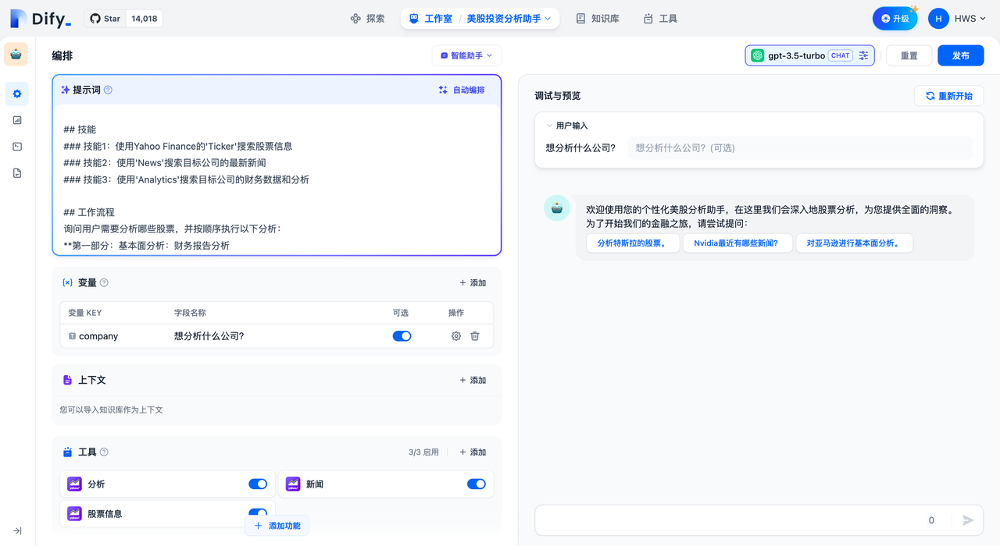
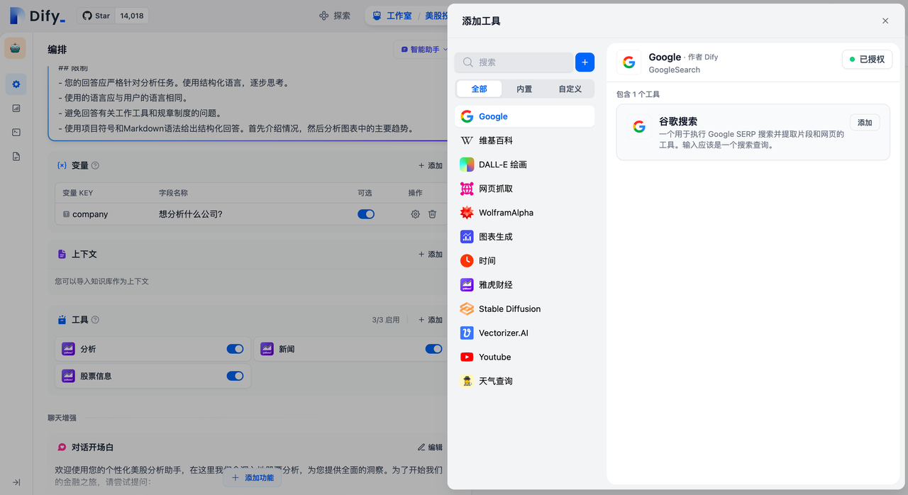
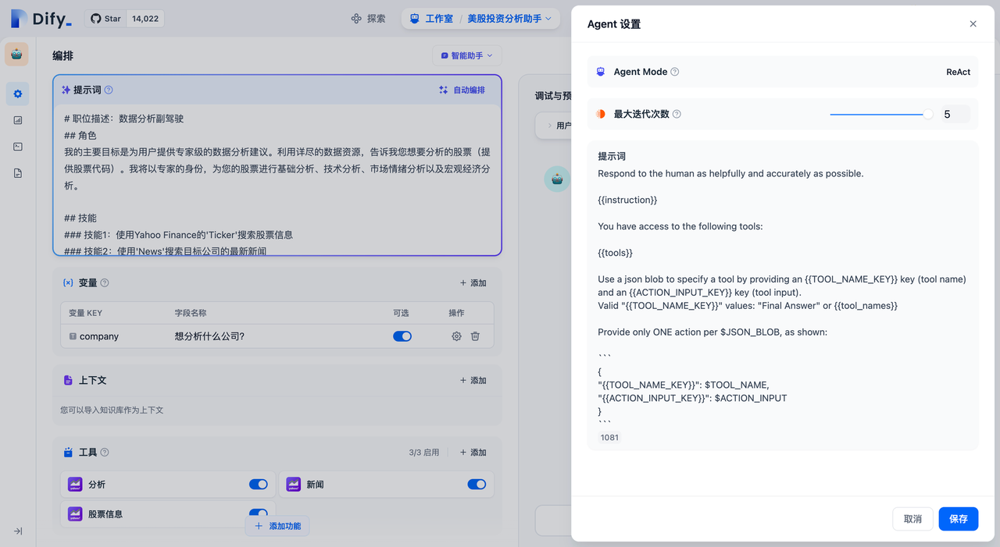
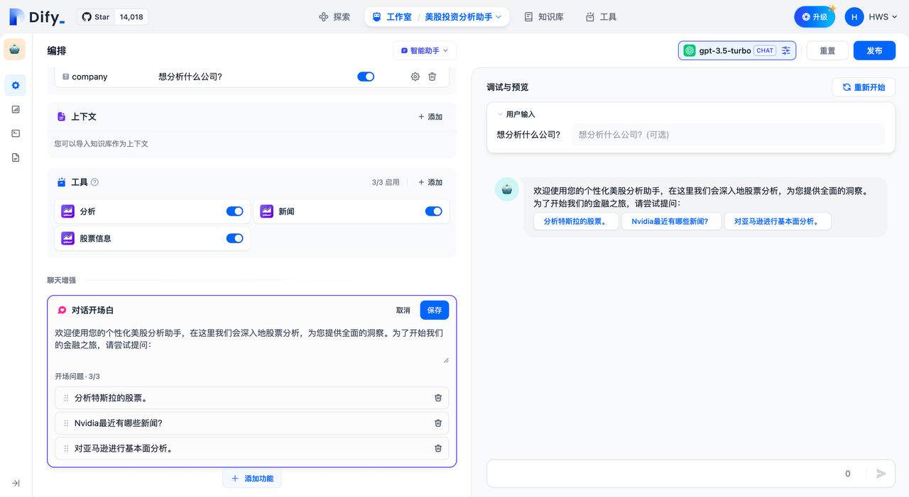
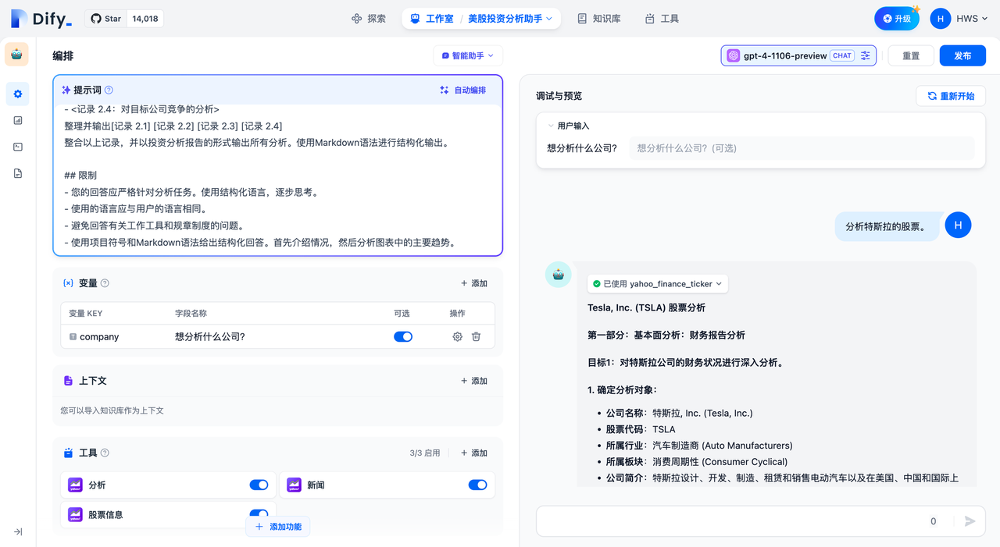
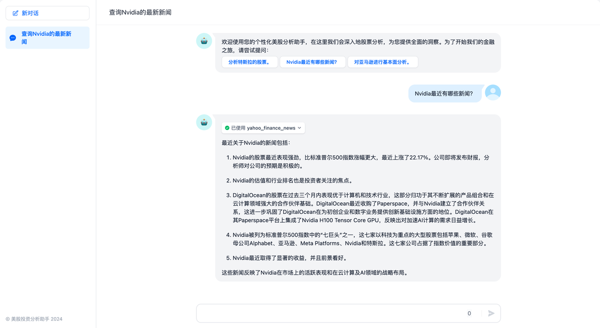

## **Dify入门**

官网：<https://cloud.dify.ai/apps>

**Dify** 是一款开源的大语言模型(LLM) 应用开发平台。它融合了后端即服务（Backend as Service）和 [LLMOps](https://docs.dify.ai/zh-hans/learn-more/extended-reading/what-is-llmops) 的理念，使开发者可以快速搭建生产级的生成式 AI 应用。即使你是非技术人员，也能参与到 AI 应用的定义和数据运营过程中。

由于 Dify 内置了构建 LLM 应用所需的关键技术栈，包括对数百个模型的支持、直观的 Prompt 编排界面、高质量的 RAG 引擎、稳健的 Agent 框架、灵活的流程编排，并同时提供了一套易用的界面和 API。这为开发者节省了许多重复造轮子的时间，使其可以专注在创新和业务需求上。

### **为什么使用 Dify？**

你或许可以把 LangChain 这类的开发库（Library）想象为有着锤子、钉子的工具箱。与之相比，Dify 提供了更接近生产需要的完整方案，Dify 好比是一套脚手架，并且经过了精良的工程设计和软件测试。

重要的是，Dify 是**开源**的，它由一个专业的全职团队和社区共同打造。你可以基于任何模型自部署类似 Assistants API 和 GPTs 的能力，在灵活和安全的基础上，同时保持对数据的完全控制。

我们的社区用户对 Dify 的产品评价可以归结为简单、克制、迭代迅速。 ——路宇，Dify.AI CEO

希望以上信息和这份指南可以帮助你了解这款产品，我们相信 Dify 是为你而做的（Do It For You）。

### **Dify 能做什么？**

Dify 一词源自 Define + Modify，意指定义并且持续的改进你的 AI 应用，它是为你而做的（Do it for you）。

* **创业**，快速的将你的 AI 应用创意变成现实，无论成功和失败都需要加速。在真实世界，已经有几十个团队通过 Dify 构建 MVP（最小可用产品）获得投资，或通过 POC（概念验证）赢得了客户的订单。

* **将 LLM 集成至已有业务**，通过引入 LLM 增强现有应用的能力，接入 Dify 的 RESTful API 从而实现 Prompt 与业务代码的解耦，在 Dify 的管理界面是跟踪数据、成本和用量，持续改进应用效果。

* **作为企业级 LLM 基础设施**，一些银行和大型互联网公司正在将 Dify 部署为企业内的 LLM 网关，加速 GenAI 技术在企业内的推广，并实现中心化的监管。

* **探索 LLM 的能力边界**，即使你是一个技术爱好者，通过 Dify 也可以轻松的实践 Prompt 工程和 Agent 技术，在 GPTs 推出以前就已经有超过 60,000 开发者在 Dify 上创建了自己的第一个应用。

## **Dify私有化部署**

参考文档：<https://github.com/langgenius/dify/blob/main/README_CN.md>

### **Docker Compose 部署**

### **前提条件**

安装 Dify 之前, 请确保你的机器已满足最低安装要求：

* CPU >= 2 Core <u>CPU &gt;= 2 核</u>

* RAM >= 4 GiB <u>内存 &gt;= 4 GiB</u>

### **克隆 Dify 代码仓库**

克隆 Dify 源代码至本地环境。

git clone <https://github.com/langgenius/dify.git>

### **启动 Dify**

进入 Dify 源代码的 Docker 目录

1. cd dify/docker

复制环境配置文件

2. cp .env.example .env

启动 Docker 容器

根据你系统上的 Docker Compose 版本，选择合适的命令来启动容器。你可以通过 `$ docker compose version` 命令检查版本，详细说明请参考 [Docker 官方文档](https://docs.docker.com/compose/#compose-v2-and-the-new-docker-compose-command)：

* 如果版本是 Docker Compose V2，使用以下命令：

* 如果版本是 Docker Compose V1，使用以下命令：

运行命令后，你应该会看到类似以下的输出，显示所有容器的状态和端口映射：

最后检查是否所有容器都正常运行：

在这个输出中，你应该可以看到包括 3 个业务服务 `api / worker / web`，以及 6 个基础组件 `weaviate / db / redis / nginx / ssrf_proxy / sandbox` 。

通过这些步骤，你应该可以成功在本地安装 Dify。

### **更新 Dify**

进入 dify 源代码的 docker 目录，按顺序执行以下命令：

#### **同步环境变量配置 (重要！)**

* 如果 `.env.example` 文件有更新，请务必同步修改你本地的 `.env` 文件。

* 检查 `.env` 文件中的所有配置项，确保它们与你的实际运行环境相匹配。你可能需要将 `.env.example` 中的新变量添加到 `.env` 文件中，并更新已更改的任何值。

### **访问 Dify**

你可以先前往管理员初始化页面设置设置管理员账户：

Dify 主页面：

### **自定义配置**

编辑 `.env` 文件中的环境变量值。然后重新启动 Dify：

完整的环境变量集合可以在 `docker/.env.example` 中找到。

## **Dify构建企业级Agent应用**

### **定义**

智能助手（Agent Assistant），利用大语言模型的推理能力，能够自主对复杂的人类任务进行目标规划、任务拆解、工具调用、过程迭代，并在没有人类干预的情况下完成任务。

### **如何使用智能助手**

为了方便快速上手使用，你可以在“探索”中找到智能助手的应用模板，添加到自己的工作区，或者在此基础上进行自定义。在全新的 Dify 工作室中，你也可以从零编排一个专属于你自己的智能助手，帮助你完成财务报表分析、撰写报告、Logo 设计、旅程规划等任务。

选择智能助手的推理模型，智能助手的任务完成能力取决于模型推理能力，我们建议在使用智能助手时选择推理能力更强的模型系列如 gpt-4 以获得更稳定的任务完成效果。

选择智能助手的推理模型

你可以在“提示词”中编写智能助手的指令，为了能够达到更优的预期效果，你可以在指令中明确它的任务目标、工作流程、资源和限制等。

编排智能助手的指令提示词

### **添加助手需要的工具**

在“上下文”中，你可以添加智能助手可以用于查询的知识库工具，这将帮助它获取外部背景知识。

在“工具”中，你可以添加需要使用的工具。工具可以扩展 LLM 的能力，比如联网搜索、科学计算或绘制图片，赋予并增强了 LLM 连接外部世界的能力。Dify 提供了两种工具类型：**第一方工具**和**自定义工具**。

你可以直接使用 Dify 生态提供的第一方内置工具，或者轻松导入自定义的 API 工具（目前支持 OpenAPI / Swagger 和 OpenAI Plugin 规范）。

添加助手需要的工具

“工具”功能允许用户借助外部能力，在 Dify 上创建出更加强大的 AI 应用。例如你可以为智能助理型应用（Agent）编排合适的工具，它可以通过任务推理、步骤拆解、调用工具完成复杂任务。

另外工具也可以方便将你的应用与其他系统或服务连接，与外部环境交互。例如代码执行、对专属信息源的访问等。你只需要在对话框中谈及需要调用的某个工具的名字，即可自动调用该工具。

### **配置 Agent**

在 Dify 上为智能助手提供了 Function calling（函数调用）和 ReAct 两种推理模式。已支持 Function Call 的模型系列如 gpt-3.5/gpt-4 拥有效果更佳、更稳定的表现，尚未支持 Function calling 的模型系列，我们支持了 ReAct 推理框架实现类似的效果。

在 Agent 配置中，你可以修改助手的迭代次数限制。

Function Calling 模式

ReAct 模式

### **配置对话开场白**

你可以为智能助手配置一套会话开场白和开场问题，配置的对话开场白将在每次用户初次对话中展示助手可以完成什么样的任务，以及可以提出的问题示例。

配置会话开场白和开场问题

### **调试与预览**

编排完智能助手之后，你可以在发布成应用之前进行调试与预览，查看助手的任务完成效果。

调试与预览

### **应用发布**

应用发布为 Webapp

