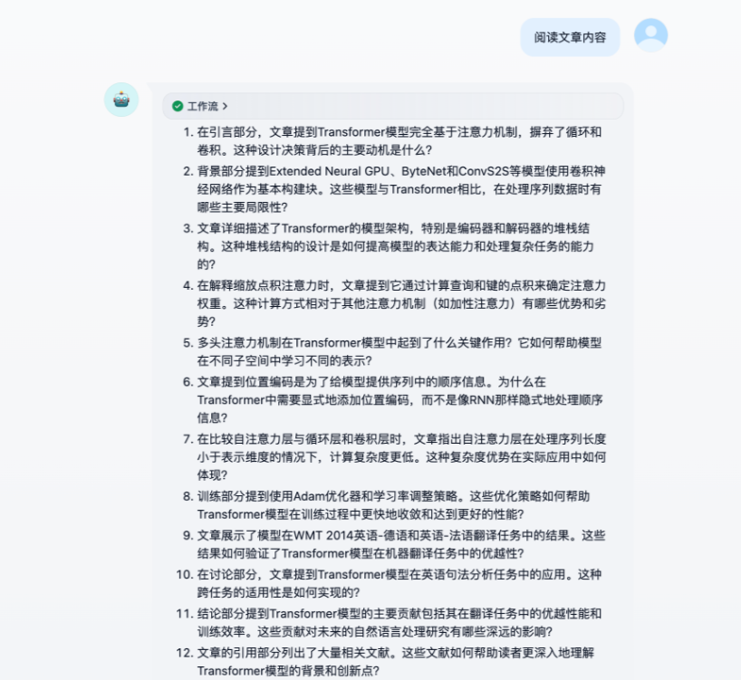
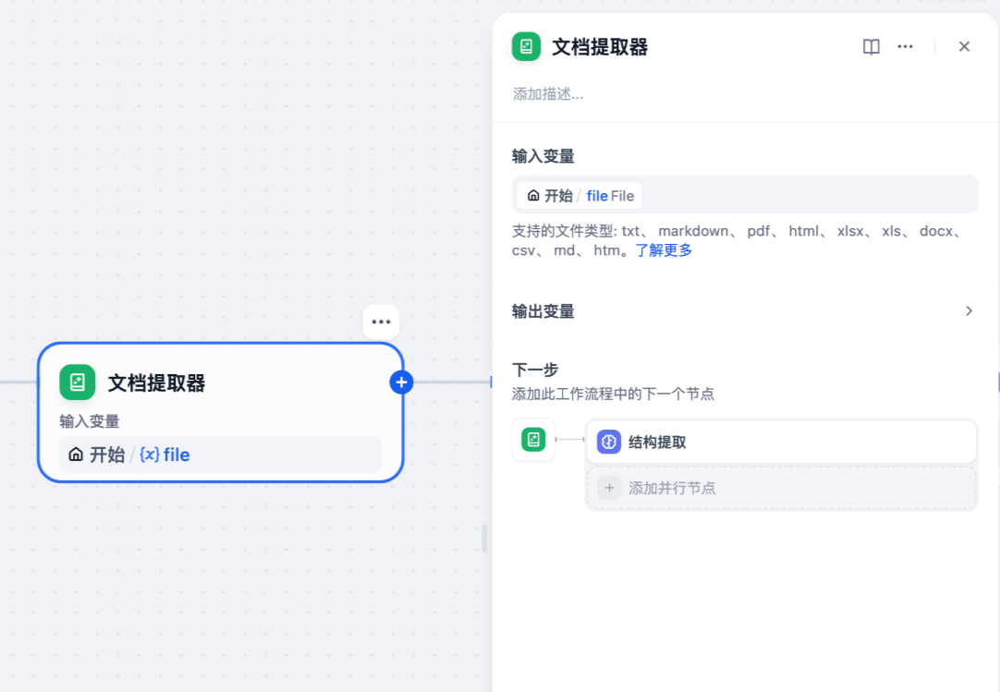
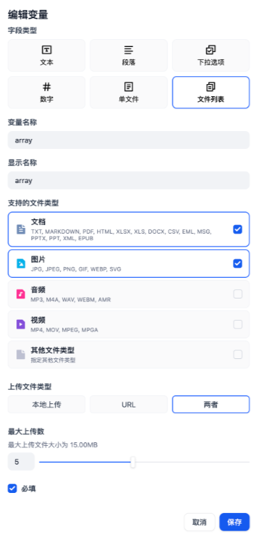
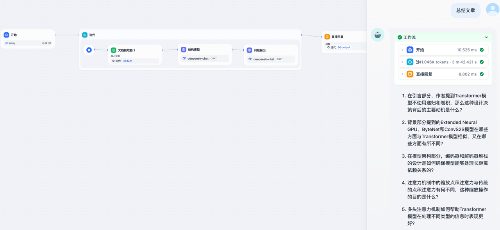
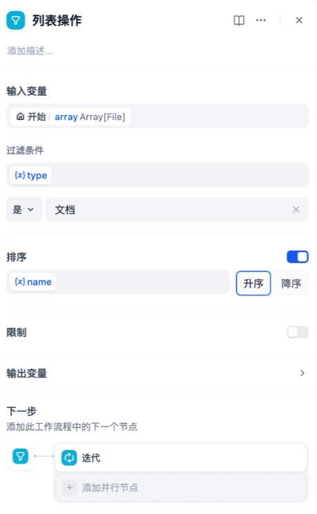

在 Dify 中，你可以使用知识库工具让 Agent 从大量的文本内容中获取准确的信息。然而，很多情况下需要理解的本地文件并不是很大，不至于用上知识库。这种情况下可以使用文件上传功能直接把本地文件作为上下文给 LLM 理解。

本次实验中，我们将以文章理解助手为案例。这个文章理解助手将会根据上传的文档进行提问，协助用户带着问题去阅读论文等材料。

在 Dify 中创建一个 Chatflow。请确保你已添加模型供应商并有足够额度。

## 添加节点

在本次实验中至少需要涉及四种节点：开始节点、文档提取器节点、LLM 节点、回复节点。

### 开始节点

在开始节点需要添加文件变量。在 0.10.0 版本的 Dify 中支持了文件上传功能，你可以将文件作为变量加入。

有关文件上传的更多文档内容请阅读：[文件上传](https://docs.dify.ai/zh-hans/guides/workflow/file-upload)

在开始节点需要增加一个文件变量，在**支持的文件类型**中，需要勾选**文档**。

一些读者可能会注意到在系统变量中有 `sys.files`，这个变量是用户在对话框中上传的文件或者文件列表。

和自己创建文件变量的区别在于，这个功能需要在**功能**中打开**文件上传**并且设置上传文件类型，并且在对话中每次上传新的文件都会将这个变量覆写。

请需要根据业务场景选取合适的文件上传方式。

### 文档提取器

**LLM 是无法直接读取文件的**。这是很多用户在第一次使用文件上传功能的一个误区，会认为直接把文件作为变量在 LLM 节点应用就可以了，实际上 LLM 读到的内容为空。

所以，Dify 引入了**文档提取器**，这个节点可以从文件变量中提取文本，输出文本格式的变量。

将开始节点的文件变量作为输入变量，文档提取器会将文档格式的文件转为文本变量输出。

### LLM

本次实验中需要设计两个 LLM 节点，分别是结构提取和问题抛出。

#### 结构提取

结构提取节点能够从原文内容中提取文章结构，总结关键内容。

提示词内容如下：

#### 问题抛出

问题抛出节点能够从结构提取节点总结的内容中总结文章的问题，协助读者在阅读的过程中带着问题去思考。

提示词如下：

## 思考题

### 处理多个上传文件

为了处理多个上传文件，需要用到**迭代**节点。

迭代节点类似于许多编程语言中的 while，区别在于 Dify 中没有条件限制，且**输入变量只能是 array 类型（列表）**。原因是 Dify 会将列表中的全部内容都执行完为止。

因此，你需要把开始节点中的文件变量调整为 `array` 类型，也就是文件列表。

在开始节点之后需要加入迭代节点，并且设置输入变量和输出变量。在迭代节点内部，设置每次循环执行的内容，这部分和前文内容完全一致。

### 针对思考题1，只处理文件列表的特定文件

在思考题1中，有的读者可能会注意到 Dify 会把所有文件处理完才会结束循环，而有些情况下只要操作其中一部分的文件而非全部。对于这个问题，可以对文件列表进行处理，在 Dify 中对列表进行操作的节点叫做列表操作。列表操作可以对所有 array 类型的变量进行操作，不光是文件列表。

例如，限定只对文档类型的文件进行分析，并且把要处理的文件顺序按文件名称排序。

在迭代节点前加入列表操作，调整过滤条件、排序，然后将迭代节点的输入改为列表操作节点的输出。

