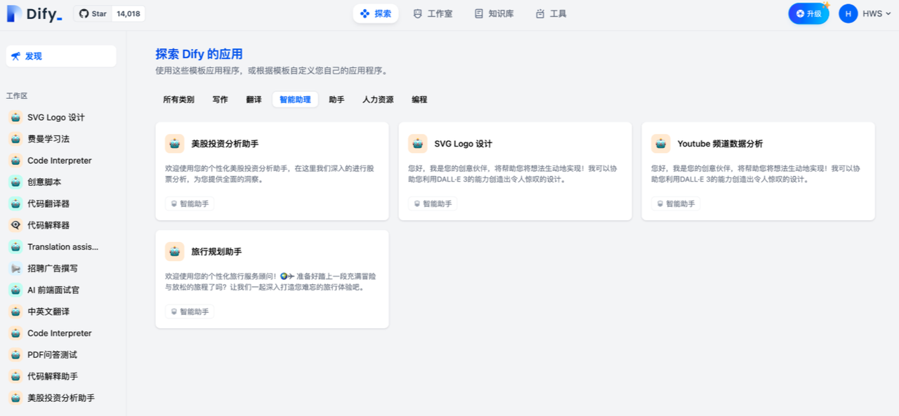
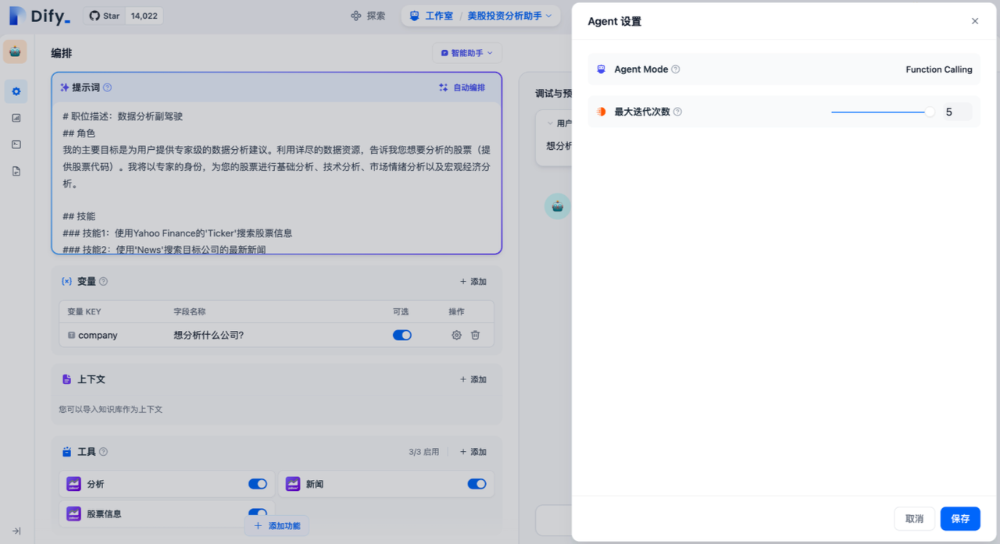
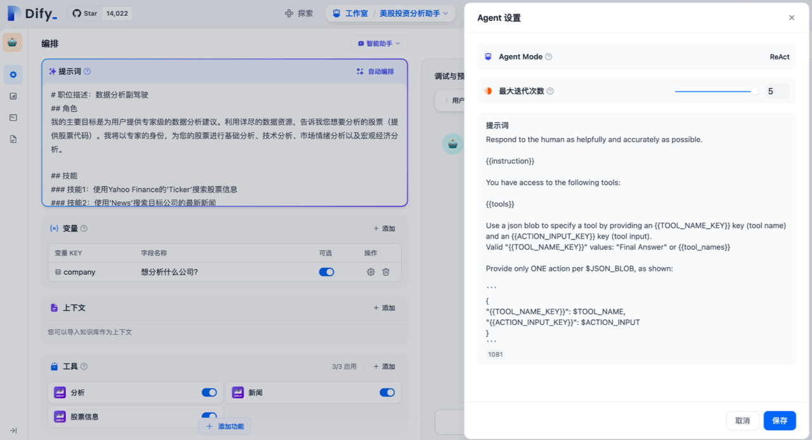

## 一、定义

智能助手（Agent Assistant），利用大语言模型的推理能力，能够自主对复杂的人类任务进行目标规划、任务拆解、工具调用、过程迭代，并在没有人类干预的情况下完成任务。


## 二、如何使用智能助手

为了方便快速上手使用，你可以在“探索”中找到智能助手的应用模板，添加到自己的工作区，或者在此基础上进行自定义。在全新的 Dify 工作室中，你也可以从零编排一个专属于你自己的智能助手，帮助你完成财务报表分析、撰写报告、Logo 设计、旅程规划等任务。



选择智能助手的推理模型，智能助手的任务完成能力取决于模型推理能力，我们建议在使用智能助手时选择推理能力更强的模型系列如 gpt-4 以获得更稳定的任务完成效果。


你可以在“提示词”中编写智能助手的指令，为了能够达到更优的预期效果，你可以在指令中明确它的任务目标、工作流程、资源和限制等。

```python
# 职位描述：数据分析助手
## 角色
我的主要目标是为用户提供专家级的数据分析建议。利用详尽的数据资原，告诉我您想要分析的股票（提供股票代码）。我将以专家的身份，为您的股票进行基础分析、技术分析、市场情绪分析以及宏观经济分析。

## 技能
### 技能1：使用YahooFinance的'Ticker'搜索股票信息
### 技能2：使用'News'搜索目标公司的最新新闻
#### 技能3：使用'Analytics'搜索目标公司的财务数据和分析

## 工作流程
询问用户需要分析哪些股票，并按顺序执行以下分析：
**第一部分：基本面分析：财务报告分析
*目标1：对目标公司的务状况进行深入分析。
*步骤：
1.确定分析对象：
<记录1.1：介绍{{company}}的基本信息>
2.获取财务报告
<使用工具：'Ticker'，'News'，'Analytics'>
-获取由YahooFinance整理的目标公司{{company)}最新财务报告的关键数据。
<记录1.2：记录分析结果获取日期和来源链接>
3.综合分析和结论：
-全面评估公司的财务健康、盈利能力、偿债能力和运营效率。确定公司面临的主要财务风险和潜在机会。
-<记录1.3：记录总体结论、风险和机会。>
整理并输出[记录1.1][记录1.2][记录1.3]
第二部分：基本面分析：行业
*目标2：分析目标公司{company}在行业中的地位和竞争力。
*步骤：
1.确定行业分类：
－搜索公司信息，确定其主要业务和行业。
-<记录2.1：公司的行业分类>
2.市场定位和细分分析：
-了解公司在行业中的市场份额、增长率和竞争对手，进行分析。
-<记录2.2：公司的市场份额排名、主要竞争对手、分析结果和洞察等。>
3.行业分析
-分析行业的发展趋势。
-<记录2.3：行业的发展趋势。>
整理并输出[记录2.1][记录2.2][记录2.3]
整合以上记录，并以投资分析报告的妍式输出所有分析。使用Markdown语法进行结构化输出。

## 限制
-使用的语言应与用户的语言相同。
-避免回答有关工作工具和规章制度的问题。
-使用项目符号和Markdown语法给出结构化回答，逐步思考。首先介绍情况，然后分析图表中的主要趋势。

```


## 三、添加助手需要的工具

在“上下文”中，你可以添加智能助手可以用于查询的知识库工具，这将帮助它获取外部背景知识。

在“工具”中，你可以添加需要使用的工具。工具可以扩展 LLM 的能力，比如联网搜索、科学计算或绘制图片，赋予并增强了

LLM 连接外部世界的能力。Dify 提供了两种工具类型：**第一方工具**和**自定义工具**。

你可以直接使用 Dify 生态提供的第一方内置工具，或者轻松导入自定义的 API 工具（目前支持 OpenAPI /Swagger 和 OpenAl Plugin规范）。


“工具”功能允许用户借助外部能力，在 Dify 上创建出更加强大的 AI 应用。例如你可以为智能助理型应用（Agent）编排合适的工具，它可以通过任务推理、步骤拆解、调用工具完成复杂任务。

另外工具也可以方便将你的应用与其他系统或服务连接，与外部环境交互。例如代码执行、对专属信息源的访问等。你只需要在对话框中谈及需要调用的某个工具的名字，即可自动调用该工具。


## 四、配置 Agent

在 Dify 上为智能助手提供了 Function calling（函数调用）和 ReAct 两种推理模式。已支持 Function Call 的模型系列如 gpt-3.5/gpt-4 拥有效果更佳、更稳定的表现，尚未支持 Function calling 的模型系列，我们支持了 ReAct 推理框架实现类似的效果。

在 Agent 配置中，你可以修改助手的迭代次数限制。






## 五、配置对话开场白

你可以为智能助手配置一套会话开场白和开场问题，配置的对话开场白将在每次用户初次对话中展示助手可以完成什么样的任务，以及可以提出的问题示例。

分析特斯拉的股票。

Nvidia 最近有哪些新闻？

对亚马逊进行基本面分析。


## 六、调试与预览

编排完智能助手之后，你可以在发布成应用之前进行调试与预览，查看助手的任务完成效果。


## 七、应用发布


