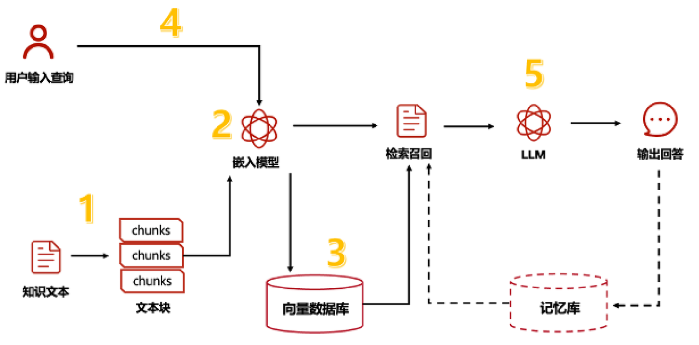
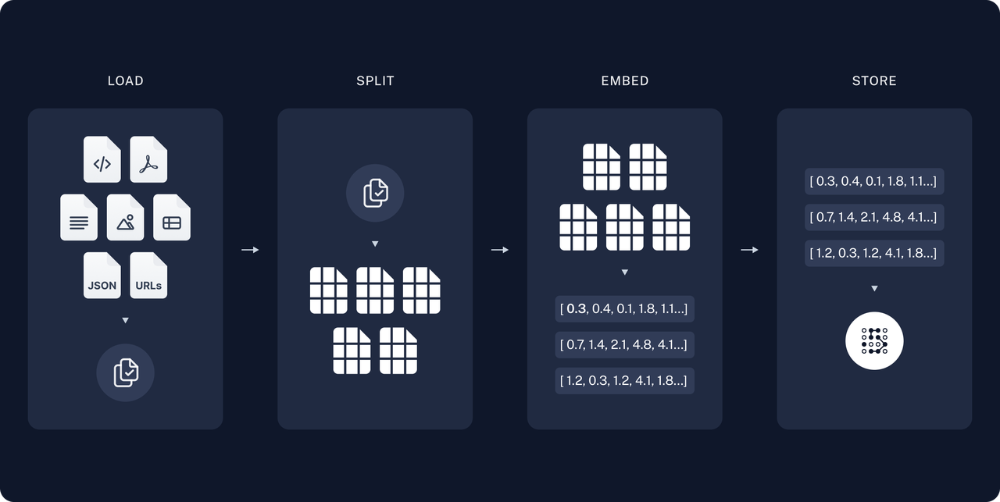
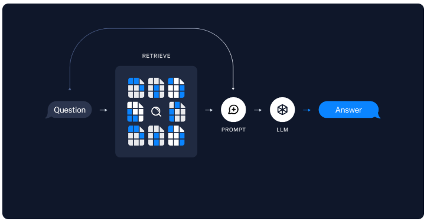
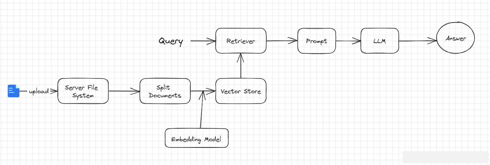
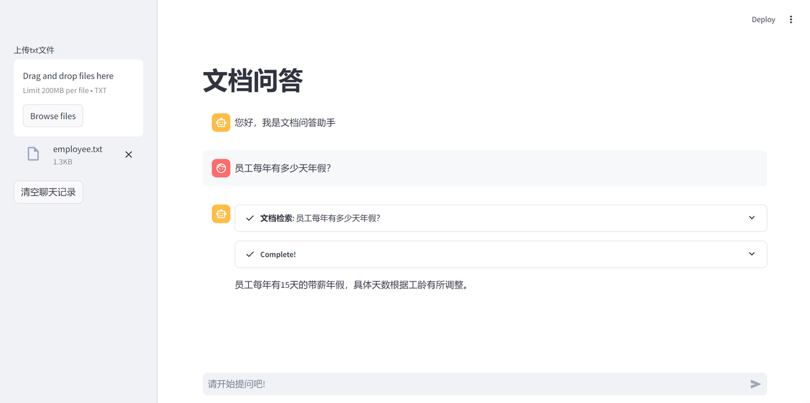

## 一、RAG 是什么？

大语言模型所实现的最强大应用之一是复杂的问答(Q\&A)聊天机器人。这些应用能够回答关于特定源信息的问题。这些应用使用一种称为检索增强生成(RAG)的技术。

RAG 是一种用额外数据增强大语言模型知识的技术。

大语言模型可以对广泛的主题进行推理，但它们的知识仅限于训练时截止日期前的公开数据。如果你想构建能够对私有数据或模型截止日期后引入的数据进行推理的人工智能应用，你需要用特定信息来增强模型的知识。检索适当信息并将其插入模型提示的过程被称为检索增强生成（RAG）。

LangChain 有许多组件旨在帮助构建问答应用，以及更广泛的 RAG 应用。

## 二、RAG 工作流

一个典型的 RAG 应用有两个主要组成部分：

**索引(Indexing)**：从数据源获取数据并建立索引的管道(pipeline)。*这通常在离线状态下进行。*

**检索和生成(Retrieval and generation)**：实际的 RAG 链，在运行时接收用户查询，从索引中检索相关数据，然后将其传递给模型。

从原始数据到答案的最常见完整顺序如下：

### 1. 索引(Indexing)

1. **加载(Load)**：首先我们需要加载数据。这是通过文档加载器 [Document Loaders](https://blog.frognew.com/library/agi/langchain/components/document-loaders.html) 完成的。

2. **分割(Split)**：文本分割器[Text splitters](https://python.langchain.com/docs/concepts/#text-splitters)将大型文档(`Documents`)分成更小的块(chunks)。这对于索引数据和将其传递给模型都很有用，因为大块数据更难搜索，而且不适合模型有限的上下文窗口。

3. **存储(Store)**：我们需要一个地方来存储和索引我们的分割(splits)，以便后续可以对其进行搜索。这通常使用向量存储 [VectorStore](https://blog.frognew.com/library/agi/langchain/components/vector-stores.html) 和嵌入模型 [Embeddings model](https://blog.frognew.com/library/agi/langchain/components/embedding-models.html) 来完成。

### 2. 检索和生成(Retrieval and generation)

1. **检索(Retrieve)**：给定用户输入，使用检索器 [Retriever](https://blog.frognew.com/library/agi/langchain/components/retrievers.html) 从存储中检索相关的文本片段。

2. **生成(Generate)**： [ChatModel](https://blog.frognew.com/library/agi/langchain/components/chat-models.html) 使用包含问题和检索到的数据的提示来生成答案。

## 三、文档问答

### 1. 实现流程

一个 RAG 程序的 APP 主要有以下流程：

1. 用户在 RAG 客户端上传一个txt文件

2. 服务器端接收客户端文件，存储在服务端

3. 服务器端程序对文件进行读取

4. 对文件内容进行拆分，防止一次性塞给 Embedding 模型超 token 限制

5. 把 Embedding 后的内容存储在向量数据库，生成检索器

6. 程序准备就绪，允许用户进行提问

7. 用户提出问题，大模型调用检索器检索文档，把相关片段找出来后，组织后，回复用户。

### 2. 代码实现

使用 Streamlit 实现文件上传，我这里只实现了 txt 文件上传，其实这里可以在 [type](https://so.csdn.net/so/search?q=type\&spm=1001.2101.3001.7020) 参数里面设置多个文件类型，在后面的检索器方法里面针对每个类型进行处理即可。

#### 2.1 实现文件上传

#### 2.2 实现检索器

注意 chunk\_size 最大设置数值取决于 Embedding 模型允许单词的最大字符数限制。

#### 2.3 创建检索工具

langchain 提供了 create\_retriever\_tool 工具，可以直接用。

#### 2.4 创建 React Agent

#### 2.5 实现 Agent 回复

获取用户输入，并回复用户，这里使用 StreamlitCallbackHandler 实现了 React 推理回调，可以让模型的推理过程可见。

#### 2.6 实现效果

