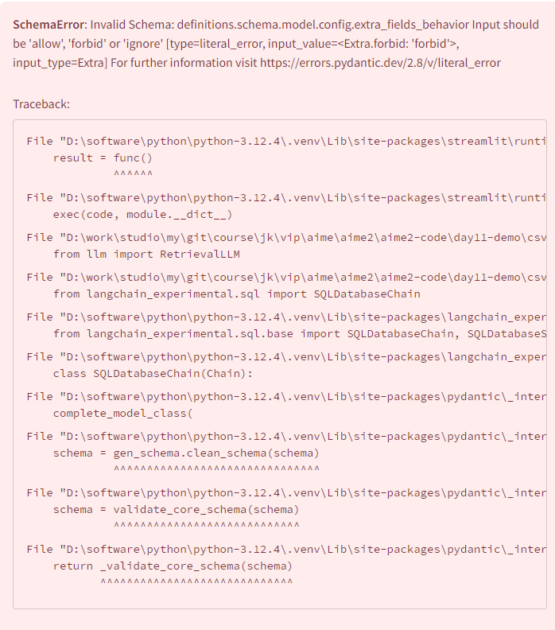
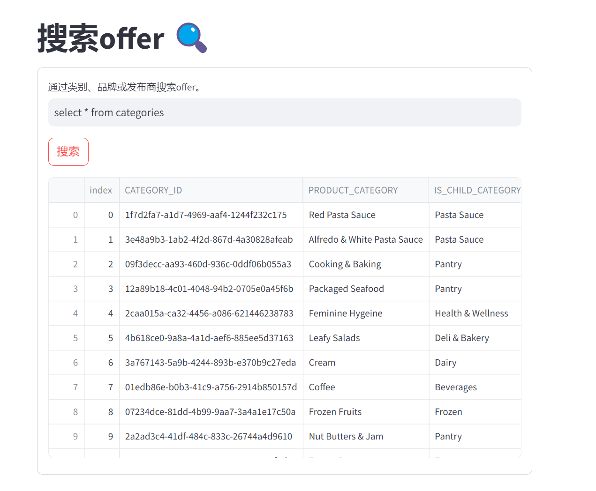
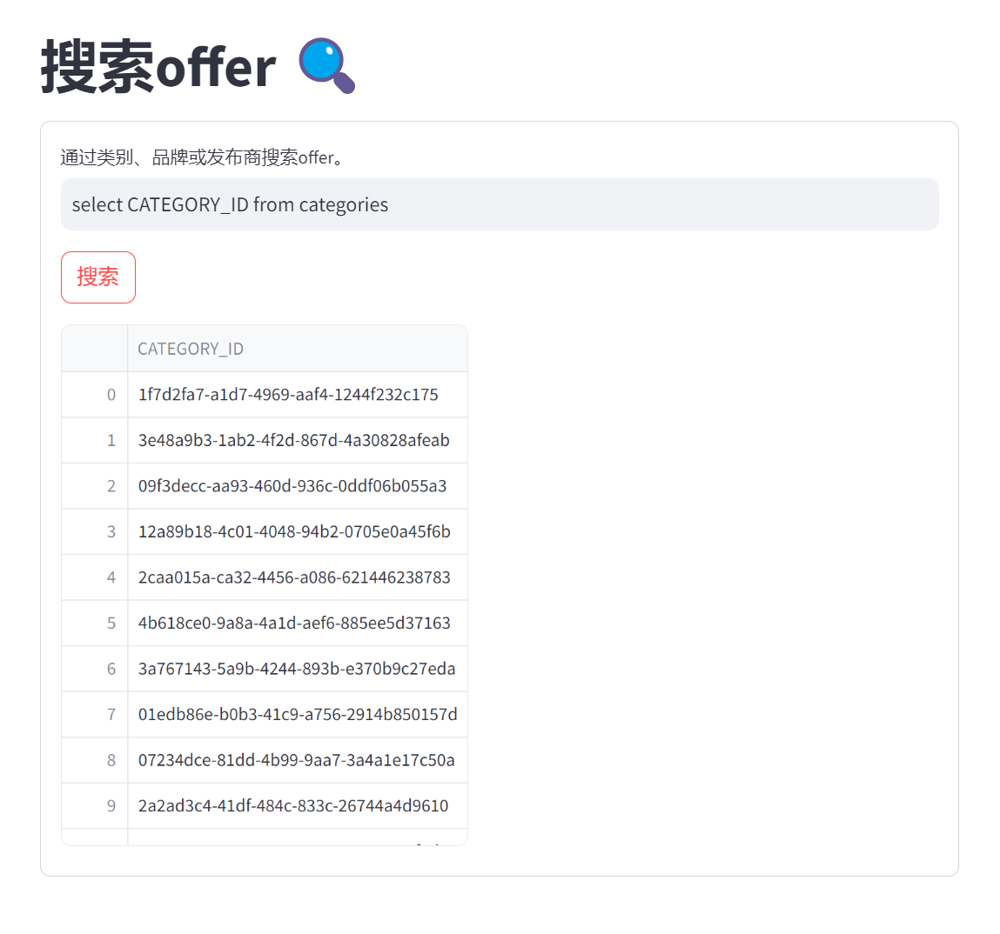
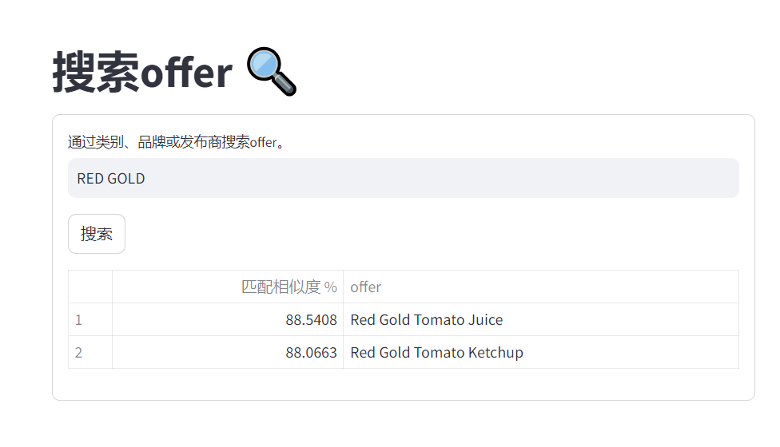

## 一、需求

基于 LangChain 和 Streamlit 的 Web 应用，用于使用 LLM 和嵌入从 SQLite 数据库中搜索相关的 offer。用户可以输入与品牌、类别或零售商相关的搜索查询，也支持通过 SQL 语句进行搜索，应用程序将从数据库中检索并显示相关的 offer。该应用使用 OpenAI API 进行自然语言处理和嵌入生成。

SQLite 官网：<https://www.sqlite.org/pragma.html#toc>

SQLite 使用手册：<https://www.runoob.com/sqlite/sqlite-select.html>


## 二、方法

* **目标**：该方法的目标是基于产品类别、品牌或零售商查询从 `offer_retailer` 表中提取相关的offer。鉴于所需数据分散在 `data` 目录中的多个表中，采用了语言模型（LLM）来促进智能数据库查询。

* **数据库准备**：最初，使用存储在 `data` 目录中的 `.csv` 文件构建了一个本地 SQLite 数据库。这是通过 `sqlite3` 和 `pandas` 库实现的。

* **LLM 集成**：通过 `langchain_experimental.sql.SQLDatabaseChain` 实现了语言模型（LLM）与本地 SQLite 数据库的有效交互。

* **提示工程**：该方法的一个重要方面是制定合适的提示，以指导 LLM 最佳地检索和格式化数据库条目。通过多次迭代和实验来微调这个提示。

* **相似度评分**：为了确定检索结果与查询的相关性，进行了余弦相似度比较。使用 `langchain_openai.OpenAIEmbeddings` 生成嵌入进行比较，从而对结果进行排序。

* **Streamlit 集成**：最后一步是解析 LLM 的输出，并围绕它构建一个用户友好的 Streamlit 应用，允许用户进行交互式搜索。


## 三、环境

在开始之前，请确保满足以下要求：

* Python 3.12.4 或更高版本

* OpenAI API 密钥

* 包含以下表的 SQLite 数据库：`brand_category`，`categories` 和 `offer_retailer`

安装所需的包：

```bash
pip install -r requirements.txt
```

确保您的 SQLite 数据库已设置好，并包含必要的表（`brand_category`，`categories`，`offer_retailer`）。

注意：streamlit版本需要<1.30，一般为1.29.0，否则启动会报以下错误。




## 四、代码

```python
# 示例：csv_search.py
import os
# 导入正则表达式模块import re
import sqlite3
import pandas as pd
import streamlit as st
from llm import RetrievalLLM

# 数据文件路径
DATA_PATH = 'data'
# 数据表名称
TABLES = ('brand_category', 'categories', 'offer_retailer')
# 数据库名称
DB_NAME = 'offer_db.sqlite'
# 提示模板
PROMPT_TEMPLATE = """
                你会接收到一个查询，你的任务是从`offer_retailer`表中的`OFFER`字段检索相关offer。
                查询可能是混合大小写的，所以也要搜索大写版本的查询。
                重要的是，你可能需要使用数据库中其他表的信息，即：`brand_category`, `categories`, `offer_retailer`，来检索正确的offer。
                不要虚构offer。如果在`offer_retailer`表中找不到offer，返回字符串：`NONE`。
                如果你能从`offer_retailer`表中检索到offer，用分隔符`#`分隔每个offer。例如，输出应该是这样的：`offer1#offer2#offer3`。
                如果SQLResult为空，返回`None`。不要生成任何offer。
                这是查询：`{}`
                """

# Streamlit应用标题
st.title("搜索offer 🔍")

# 连接SQLite数据库
conn = sqlite3.connect('offer_db.sqlite')

# 判断是否是SQL查询的函数
def is_sql_query(query):
    # 定义一个包含常见 SQL 关键字的列表
    sql_keywords = ['SELECT', 'INSERT', 'UPDATE', 'DELETE', 'CREATE', 'DROP', 'ALTER','TRUNCATE', 'MERGE', 'CALL', 'EXPLAIN', 'DESCRIBE', 'SHOW'
    ]
    # 去掉查询字符串两端的空白字符并转换为大写
    query_upper = query.strip().upper()
    
    # 遍历 SQL 关键字列表
    for keyword in sql_keywords:
        # 如果查询字符串以某个 SQL 关键字开头，返回 True
        if query_upper.startswith(keyword):
            return True
            
    # 定义一个正则表达式模式，用于匹配以 SQL 关键字开头的字符串
    sql_pattern = re.compile(r'^\s*(SELECT|INSERT|UPDATE|DELETE|CREATE|DROP|ALTER|TRUNCATE|MERGE|CALL|EXPLAIN|DESCRIBE|SHOW)\s+',
        re.IGNORECASE  # 忽略大小写
    )
    
    # 如果正则表达式匹配查询字符串，返回 True
    if sql_pattern.match(query):
        return True
        
    # 如果查询字符串不符合任何 SQL 关键字模式，返回 False
    return False
    
# 创建一个表单用于搜索
with st.form("search_form"):
    # 输入框用于输入查询
    query = st.text_input("通过类别、品牌或发布商搜索offer。")
    # 提交按钮
    submitted = st.form_submit_button("搜索")
    # 实例化RetrievalLLM类
    retrieval_llm = RetrievalLLM(
        data_path=DATA_PATH,
        tables=TABLES,
        db_name=DB_NAME,
        openai_api_key=os.getenv('OPENAI_API_KEY'),
    )
    # 如果表单提交
    if submitted:
        # 如果输入内容是SQL语句，则显示SQL执行结果
        if is_sql_query(query):
            st.write(pd.read_sql_query(query, conn))
        # 否则使用LLM从数据库中检索offer
        else:
            # 使用RetrievalLLM实例检索offer
            retrieved_offers = retrieval_llm.retrieve_offers(
                PROMPT_TEMPLATE.format(query)
            )
            # 如果没有找到相关offer
            if not retrieved_offers:
                st.text("未找到相关offer。")
            else:# 显示检索到的offer
                st.table(retrieval_llm.parse_output(retrieved_offers, query))
```

```python
# 示例：llm.py
import sqlite3
import numpy as np
import pandas as pd
from langchain_openai import OpenAIEmbeddings
from langchain_openai import OpenAI
from langchain_community.utilities import SQLDatabase
from langchain_experimental.sql import SQLDatabaseChain

class RetrievalLLM:
    """一个类，用于使用大型语言模型（LLM）检索和重新排序offer。
    
    参数:
        data_path (str): 包含数据CSV文件的目录路径。
        tables (list[str]): 数据CSV文件的名称列表。
        db_name (str): 用于存储数据的SQLite数据库名称。
        openai_api_key (str): OpenAI API密钥。
    
    属性:
        data_path (str): 包含数据CSV文件的目录路径。
        tables (list[str]): 数据CSV文件的名称列表。
        db_name (str): 用于存储数据的SQLite数据库名称。
        openai_api_key (str): OpenAI API密钥。
        db (SQLDatabase): SQLite数据库连接。
        llm (OpenAI): OpenAI LLM客户端。
        embeddings (OpenAIEmbeddings): OpenAI嵌入客户端。
        db_chain (SQLDatabaseChain): 与LLM集成的SQL数据库链。
    """
    
    def init(self, data_path, tables, db_name, openai_api_key):
        # 初始化类属性
        self.data_path = data_path
        self.tables = tables
        self.db_name = db_name
        self.openai_api_key = openai_api_key
        
        # 读取CSV文件并存储到数据帧字典中
        dfs = {}
        for table in self.tables:
            dfs[table] = pd.read_csv(f"{self.data_path}/{table}.csv")

        # 将数据帧写入SQLite数据库
        with sqlite3.connect(self.db_name) as local_db:
            for table, df in dfs.items():
                df.to_sql(table, local_db, if_exists="replace")

        # 创建SQL数据库连接
        self.db = SQLDatabase.from_uri(f"sqlite:///{self.db_name}")
        # 创建OpenAI LLM客户端
        self.llm = OpenAI(
            temperature=0, verbose=True, openai_api_key=self.openai_api_key
        )
        # 创建OpenAI嵌入客户端
        self.embeddings = OpenAIEmbeddings(openai_api_key=self.openai_api_key)
        # 创建SQL数据库链
        self.db_chain = SQLDatabaseChain.from_llm(self.llm, self.db)
        self.allow_reuse = True
          
    def retrieve_offers(self, prompt):
        """使用LLM从数据库中检索offer。
        
        参数:
            prompt (str): 用于检索offer的提示。
        
        返回:
            list[str]: 检索到的offer列表。
        """
        
        # 运行SQL数据库链以检索offer
        retrieved_offers = self.db_chain.run(prompt)
        # 如果retrieved_offers是"None"，则返回None，否则返回检索到的offer
        return None if retrieved_offers == "None" else retrieved_offers

    def get_embeddings(self, documents):
        """使用LLM获取文档的嵌入。
        
        参数:
            documents (list[str]): 文档列表。
        
        返回:
            np.ndarray: 包含文档嵌入的NumPy数组。
        """
        
        # 如果文档列表只有一个文档，将单个文档的嵌入转换为Numpy数组
        if len(documents) == 1:
            return np.asarray(self.embeddings.embed_query(documents[0]))
            else:
                # 否则获取每个文档的嵌入并存储到列表中
                embeddings_list = []
                for document in documents:
                    embeddings_list.append(self.embeddings.embed_query(document))
                    return np.asarray(embeddings_list)

    def parse_output(self, retrieved_offers, query):
        """解析retrieve_offers()方法的输出并返回一个数据帧。
        
        参数:
            retrieved_offers (list[str]): 检索到的offer列表。
            query (str): 用于检索offer的查询。
        
        返回:
            pd.DataFrame: 包含匹配相似度和offer的数据帧。
        """
        
        # 分割检索到的offer
        top_offers = retrieved_offers.split("#")

        # 获取查询的嵌入
        query_embedding = self.get_embeddings([query])
        # 获取offer的嵌入
        offer_embeddings = self.get_embeddings(top_offers)
        # offer_embeddings是一个二维的Numpy数组，包含多个offer的嵌入向量。
        # query_embedding是一个二维的Numpy数组，包含查询的嵌入向量。
        # query_embedding.T是查询嵌入的转置，使其成为一个列向量，便于进行矩阵乘法。
        # np.dot()计算每个offer嵌入向量与查询嵌入向量之间的点积（内积），结果是一个二维数组，其中每个元素表示一个offer与查询之间的相似度分数。
        # .flatten() 将二维数组转换为一维数组，得到每个 offer 与查询之间的相似度分数列表。
        sim_scores = np.dot(offer_embeddings, query_embedding.T).flatten()
        
        # 计算相似度得分，转换为百分比形式
        sim_scores = [p * 100 for p in sim_scores]

        # 创建数据帧并按相似度排序
        df = (
            pd.DataFrame({"匹配相似度 %": sim_scores, "offer": top_offers})
            .sort_values(by=["匹配相似度 %"], ascending=False)
            .reset_index(drop=True)
        )
        df.index += 1
        return df
```


## 五、运行

本地运行应用

```bash
streamlit  csv_search.py
```

应用运行后，打开浏览器并导航到 `http://localhost:8501` 访问offer搜索界面。

1. 在文本输入框中输入您的搜索查询（品牌、类别或零售商）。

2. 点击“搜索”按钮启动搜索。

3. 匹配查询的相关 offer 将以表格形式显示。


## 六、问答效果

**问题1：select \* from categories**



**问题2：select CATEGORY\_ID from categories**



**问题3：RED GOLD**



