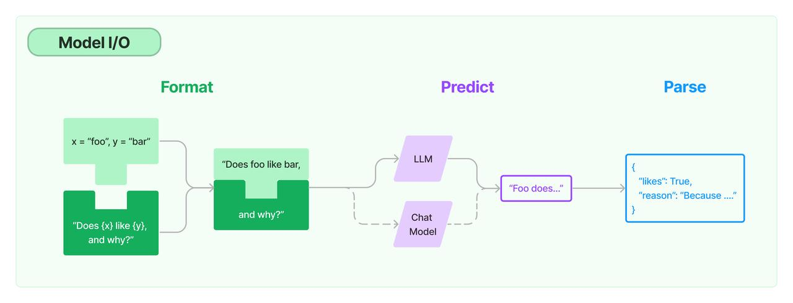

## **一、LangChain 概述**

### 1. **LangChain 简介**

LangChain 是一个开源的 Python AI 应用开发框架, 它提供了构建基于大模型的 AI 应用所需的模块和工具。通过 LangChain, 开发者可以轻松地与大型语言模型 (LLM) 集成, 完成文本生成、问答、翻译、对话等任务。LangChain 降低了 AI 应用开发的门槛, 让任何人都可以基于 LLM 构建属于自己的创意应用。

### 2. **LangChain 特性**

* **LLM 和提示（Prompt）**：LangChain 对所有 LLM 大模型进行了 API 抽象，统一了大模型访问 API，同时提供了 Prompt 提示模板管理机制。

* **链 (Chain)**：Langchain 对一些常见的场景封装了一些现成的模块，例如：基于上下文信息的问答系统，自然语言生成 SQL 查询等等，因为实现这些任务的过程就像工作流一样，一步一步的执行，所以叫链 (chain)。

* **LCEL**：LangChain Expression Language (LCEL)， langchain 新版本的核心特性，用于解决工作流编排问题，通过 LCEL 表达式，我们可以灵活的自定义 AI 任务处理流程，也就是灵活自定义*链 (Chain)*。

* **数据增强生成 (RAG)**：因为大模型 (LLM) 不了解新的信息，无法回答新的问题，所以我们可以将新的信息导入到 LLM，用于增强 LLM 生成内容的质量，这种模式叫做 RAG 模式(Retrieval Augmented Generation)。

* **Agents**：是一种基于大模型（LLM）的应用设计模式，利用 LLM 的自然语言理解和推理能力（LLM 作为大脑)），根据用户的需求自动调用外部系统、设备共同去完成任务，例如：用户输入 “明天请假一天”， 大模型（LLM）自动调用请假系统，发起一个请假申请。

* **模型记忆（memory）**：让大模型 (llm) 记住之前的对话内容，这种能力称为模型记忆（memory）。

## 二、LangChain 框架组成

LangChain 框架由几个部分组成，包括：

* **LangChain 库**：Python 和 JavaScript 库。包含接口和集成多种组件的运行时基础，以及现成的链和代理的实现。

* **LangChain 模板**：Langchain 官方提供的一些 AI 任务模板。

* **LangServe**：基于 FastAPI 可以将 Langchain 定义的链 (Chain)，发布成为 REST API。

* **LangSmith**：开发平台，是个云服务，支持 Langchain debug、任务监控

## 三、LangChain 库 (Libraries)

LangChain 库本身由几个不同的包组成。

* `langchain-core`：基础抽象和 LangChain 表达语言。

* `langchain-community`：第三方集成，主要包括 langchain 集成的第三方组件。

* `langchain`：主要包括链 (chain)、代理(agent) 和检索策略。

## 四、langChain 任务处理流程

如上图，langChain 提供一套提示词模板 (prompt template) 管理工具，负责处理提示词，然后传递给大模型处理，最后处理大模型返回的结果，

LangChain 对大模型的封装主要包括 LLM 和 Chat Model 两种类型。

* LLM - 问答模型，模型接收一个文本输入，然后返回一个文本结果。

* Chat Model - 对话模型，接收一组对话消息，然后返回对话消息，类似聊天消息一样。

## 五、核心概念

1. LLMs

LangChain 封装的基础模型，模型接收一个文本输入，然后返回一个文本结果。

* Chat Models

聊天模型（或者称为对话模型），与 LLMs 不同，这些模型专为对话场景而设计。模型可以接收一组对话消息，然后返回对话消息，类似聊天消息一样。

* 消息（Message）

指的是聊天模型（Chat Models）的消息内容，消息类型包括包括 HumanMessage、AIMessage、SystemMessage、FunctionMessage 和 ToolMessage 等多种类型的消息。

* 提示 (prompts)

LangChain 封装了一组专门用于提示词 (prompts) 管理的工具类，方便我们格式化提示词 (prompts) 内容。

* 输出解析器 (Output Parsers)

如上图介绍，Langchain 接受大模型 (llm) 返回的文本内容之后，可以使用专门的输出解析器对文本内容进行格式化，例如解析 json、或者将 llm 输出的内容转成 python 对象。

* Retrievers

为方便我们将私有数据导入到大模型（LLM）, 提高模型回答问题的质量，LangChain 封装了检索框架 (Retrievers)，方便我们加载文档数据、切割文档数据、存储和检索文档数据。

* 向量存储 (Vector stores)

为支持私有数据的语义相似搜索，langchain 支持多种向量数据库。

* Agents

智能体 (Agents)，通常指的是以大模型（LLM）作为决策引擎，根据用户输入的任务，自动调用外部系统、硬件设备共同完成用户的任务，是一种以大模型（LLM）为核心的应用设计模式。

## 六、应用场景

* 对话机器人: 构建智能的对话助手、客服机器人、聊天机器人等。

* 知识库问答: 结合知识图谱, 进行开放域问题的问答服务。

* 智能写作: 如文章写作、创意写作、文本摘要等

## 七、快速入门

### 3. 安装LangChain

要安装LangChain，可以使用Pip和Conda进行安装。以下是安装LangChain的步骤：

使用Pip:

### 4. 初始化模型

在使用LangChain之前，需要导入LangChain x OpenAI集成包，并设置API密钥作为环境变量或直接传递给OpenAI LLM类。

首先，获取OpenAI的API密钥，可以通过创建账户并访问[此链接](https://platform.openai.com/account/api-keys)来获取。然后，可以将API密钥设置为环境变量，方法如下：

接下来，初始化模型：

### 5. 使用 LLM

使用LLM来回答问题非常简单。可以直接调用LLM的`invoke`方法，并传入问题作为参数。此外，还可以通过提示模板(prompt template)生成提示词，用于向模型(LLM)发送指令。

下面演示了如何构建一个简单的LLM链(chains)：

### 6. 输出转换

LLM的输出通常是一条消息，为了更方便处理结果，可以将消息转换为字符串。下面展示如何将LLM的输出消息转换为字符串：

以上是关于LLM链的介绍，希望能帮助您更好地理解如何安装LangChain并构建不同类型的链。

