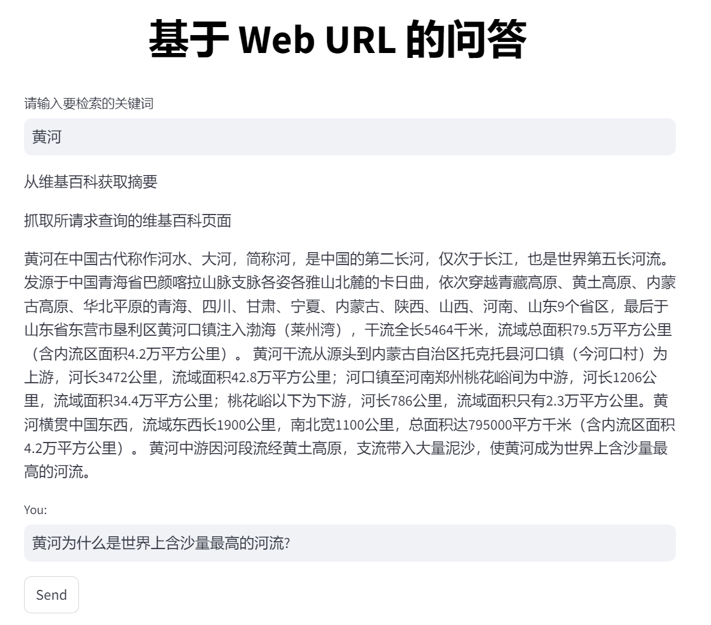
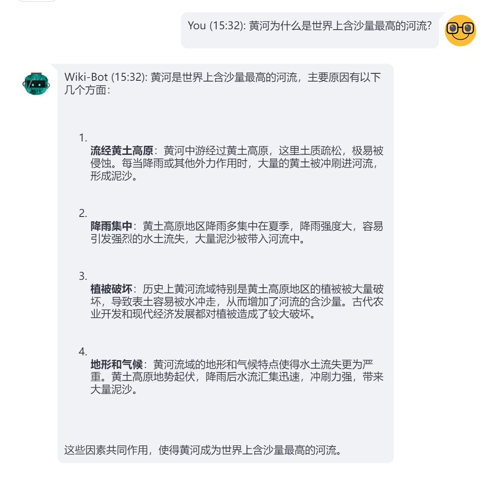

## 一、导入依赖库

我们将首先导入聊天机器人所需的库。

```python
# 示例：web_search.py
import time
from datetime import datetime

import requests
import streamlit as st
import wikipedia
from bs4 import BeautifulSoup
from langchain.schema import AIMessage, HumanMessage, SystemMessage
from langchain.text_splitter import CharacterTextSplitter
from langchain_community.vectorstores import FAISS
from langchain_openai import ChatOpenAI
from langchain_openai import OpenAIEmbeddings
from streamlit_chat import message
global docsearch
from langchain.globals import set_verbose
docsearch = None
```


## 二、爬取维基百科

构建聊天机器人的第一步是访问维基百科文章并提取内容。该 `get_wiki` 函数接受搜索词并返回整页内容和维基百科文章的摘要。该 `wikipedia.summary` 方法搜索摘要，以及 `requests` 用于访问文章的 URL 的模块。该 `BeautifulSoup` 模块使用在解析页面的 HTML 内容，该 `content_div.find_all('p')` 行从页面上的段落中提取文本。

```python
def get_wiki(search):
    # 将语言设置为简体中文（默认为自动检测）
    lang = "zh"
    
    """
    从维基百科获取摘要
    """
    # set language to zh_CN (default is auto-detect)
    wikipedia.set_lang(lang)
    summary = wikipedia.summary(search, sentences=5)
    
    """
    抓取所请求查询的维基百科页面
    """
    
    # 根据用户输入和语言创建URL
    url = f"https://{lang}.wikipedia.org/wiki/{search}"
    
    # 向URL发送GET请求并解析HTML内容
    response = requests.get(url)
    soup = BeautifulSoup(response.content, "html.parser")
    
    # 提取页面的主要内容
    content_div = soup.find(id="mw-content-text")
    
    # 摘录所有内容段落
    paras = content_div.find_all('p')
    
    # 将段落连接成整页内容
    full_page_content = ""for para in paras:
        full_page_content += para.text
    
    # 打印整页内容
    return full_page_content, summary
```


## 三、设置用户界面

接下来，我们使用 Streamlit 设置用户界面。我们首先创建一个标题：

```python
st.markdown("<h1 style='text-align: center; color: Black;'>基于 Web URL 的问答</h1>", unsafe_allow_html=True)
```

这将为聊天机器人创建一个大而居中的标题。

环境变量配置好 OPENAI\_BASE\_URL 和 OPENAI\_API\_KEY

```python
setx OPENAI_BASE_URL "https://api.openai.com/v1"
setx OPENAI_API_KEY "sk-xxxxxxxxxxxxxxxxxxxxxxxxxxxxxxxxxxxxxxxxxxxxxxxx"
```

一旦用户输入他们的 OpenAI 密钥，我们就会初始化 GPT 模型并要求他们输入搜索查询，该查询将用于抓取相关的 Wikipedia 页面。get\_wiki()函数将返回搜索查询和抓取页面的摘要。现在，如果它返回了一些值，则 Q\&A 字段将被激活，用户可以提问。

```python
search = st.text_input("请输入要检索的关键词")
if len(search):
    wiki_content, summary = get_wiki(search)
if len(wiki_content):try:# 创建用户发送消息的输入文本框
            st.write(summary)
            user_query = st.text_input("You: ", "", key="input")
            send_button = st.button("Send")
```

现在，我们初始化FAISS向量数据库

```python
def init_db(wiki_content):print("初始化FAISS向量数据库...")
    text_splitter = CharacterTextSplitter(
        separator="\n",
        chunk_size=1000,
        chunk_overlap=200,
        length_function=len,
    )
    texts = text_splitter.split_text(wiki_content)
    embeddings = OpenAIEmbeddings()global doc_search
    doc_search = FAISS.from_texts(texts, embeddings)
```

建立索引后，我们就可以查询用户的请求。

```python
# 创建一个函数来获取机器人响应
def get_bot_response(user_query):
    # 在向量数据库中进行相似性搜索，返回6个结果
    docs = doc_search.similarity_search(user_query, K=6)
    main_content = user_query + "\n\n"
    
    # 拼接用户查询和相似的文本内容
    for doc in docs:
        main_content += doc.page_content + "\n\n"
    messages.append(HumanMessage(content=main_content))
    
    # 调用OpenAI接口获取响应
    ai_response = chat.invoke(messages).content
    
    # 将刚刚添加的 HumanMessage 从 messages 列表中移除。这样做的原因是，main_content 包含了用户的原始查询和相似文本内容，
    # 但在实际的对话历史中，我们只希望保留用户的原始查询和 AI 的响应，而不是包含相似文本内容的查询。
    messages.pop()
    # 将用户查询添加到消息列表
    messages.append(HumanMessage(content=user_query))
    # 将用户查询添加到消息列表
    messages.append(AIMessage(content=ai_response))
    return ai_response
```

就这样！你就拥有了专属于您的友好机器人，它可以回答您关于维基百科文章的查询。


## 四、问答效果

**问题1：黄河**



**问题2：黄河为什么是世界上含沙量最高的河流?**



