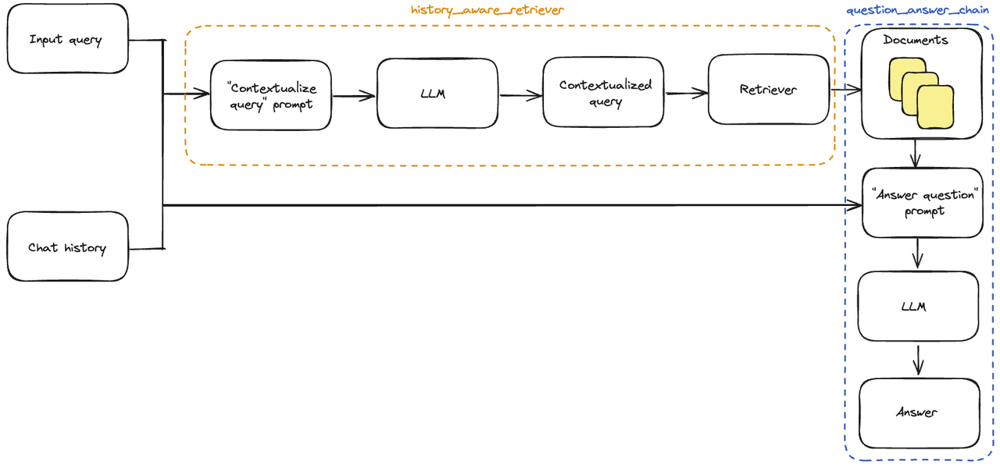

## 一、如何自定义会话管理



之前我们已经介绍了如何添加会话历史记录，但我们仍在手动更新对话历史并将其插入到每个输入中。在真正的问答应用程序中，我们希望有一种持久化对话历史的方式，并且有一种自动插入和更新它的方式。 为此，我们可以使用：

* [BaseChatMessageHistory](https://api.python.langchain.com/en/latest/langchain_api_reference.html#module-langchain.memory): 存储对话历史。

* [RunnableWithMessageHistory](http://www.aidoczh.com/langchain/v0.2/docs/how_to/message_history/): LCEL 链和 `BaseChatMessageHistory` 的包装器，负责将对话历史注入输入并在每次调用后更新它。 要详细了解如何将这些类结合在一起创建有状态的对话链，请转到 [如何添加消息历史（内存）](http://www.aidoczh.com/langchain/v0.2/docs/how_to/message_history/)LCEL 页面。 下面，我们实现了第二种选项的一个简单示例，其中对话历史存储在一个简单的字典中。`RunnableWithMessageHistory` 的实例会为您管理对话历史。它们接受一个带有键（默认为`"session_id"`）的配置，该键指定要获取和预置到输入中的对话历史，并将输出附加到相同的对话历史。以下是一个示例：

```python
# 示例：custom_chat_session.py
# pip install --upgrade langchain langchain-community langchainhub langchain-chroma bs4import bs4
from langchain_chroma import Chroma
from langchain_community.document_loaders import WebBaseLoader
from langchain_core.chat_history import BaseChatMessageHistory
from langchain_core.prompts import ChatPromptTemplate
from langchain_core.prompts import MessagesPlaceholder
from langchain_openai import ChatOpenAI
from langchain_openai import OpenAIEmbeddings
from langchain_text_splitters import RecursiveCharacterTextSplitter
from langchain_core.messages import AIMessage, HumanMessage
from langchain.globals import set_debug
from langchain_core.runnables.history import RunnableWithMessageHistory
from langchain_community.chat_message_histories import ChatMessageHistory
from langchain.chains.combine_documents import create_stuff_documents_chain
from langchain.chains import create_history_aware_retriever
from langchain.chains import create_retrieval_chain

# 打印调试日志
set_debug(False)

# 创建一个 WebBaseLoader 对象，用于从指定网址加载文档
loader = WebBaseLoader(
    web_paths=("https://lilianweng.github.io/posts/2023-06-23-agent/",),
    bs_kwargs=dict(
        parse_only=bs4.SoupStrainer(
            class_=("post-content", "post-title", "post-header")
        )
    ),
)
# 加载文档
docs = loader.load()
# 创建一个 RecursiveCharacterTextSplitter 对象，用于将文档拆分成较小的文本块
text_splitter = RecursiveCharacterTextSplitter(chunk_size=1000, chunk_overlap=200)
# 将文档拆分成文本块
splits = text_splitter.split_documents(docs)
# 创建一个 Chroma 对象，用于存储文本块的向量表示
vectorstore = Chroma.from_documents(documents=splits, embedding=OpenAIEmbeddings())
# 将向量存储转换为检索器
retriever = vectorstore.as_retriever()

# 定义系统提示词模板
system_prompt = ("您是一个用于问答任务的助手。""使用以下检索到的上下文片段来回答问题。""如果您不知道答案，请说您不知道。""最多使用三句话，保持回答简洁。""\n\n""{context}"
)
# 创建一个 ChatPromptTemplate 对象，用于生成提示词
prompt = ChatPromptTemplate.from_messages(
    [
        ("system", system_prompt),
        ("human", "{input}"),
    ]
)

# 创建一个带有聊天历史记录的提示词模板
qa_prompt = ChatPromptTemplate.from_messages(
    [
        ("system", system_prompt),
        MessagesPlaceholder("chat_history"),
        ("human", "{input}"),
    ]
)

# 创建一个 ChatOpenAI 对象，表示聊天模型
llm = ChatOpenAI()
# 创建一个问答链
question_answer_chain = create_stuff_documents_chain(llm, prompt)
# 创建一个检索链，将检索器和问答链结合
rag_chain = create_retrieval_chain(retriever, question_answer_chain)

# 定义上下文化问题的系统提示词
contextualize_q_system_prompt = ("给定聊天历史和最新的用户问题，""该问题可能引用聊天历史中的上下文，""重新构造一个可以在没有聊天历史的情况下理解的独立问题。""如果需要，不要回答问题，只需重新构造问题并返回。"
)
# 创建一个上下文化问题提示词模板
contextualize_q_prompt = ChatPromptTemplate.from_messages(
    [
        ("system", contextualize_q_system_prompt),
        MessagesPlaceholder("chat_history"),
        ("human", "{input}"),
    ]
)
# 创建一个带有历史记录感知的检索器
history_aware_retriever = create_history_aware_retriever(
    llm, retriever, contextualize_q_prompt
)

# 创建一个带有聊天历史记录的问答链
question_answer_chain = create_stuff_documents_chain(llm, qa_prompt)
# 创建一个带有历史记录感知的检索链
rag_chain = create_retrieval_chain(history_aware_retriever, question_answer_chain)

# 创建一个字典，用于存储聊天历史记录
store = {}

# 定义一个函数，用于获取指定会话的聊天历史记录def get_session_history(session_id: str) -> BaseChatMessageHistory:if session_id not in store:
        store[session_id] = ChatMessageHistory()return store[session_id]

# 创建一个 RunnableWithMessageHistory 对象，用于管理有状态的聊天历史记录
conversational_rag_chain = RunnableWithMessageHistory(
    rag_chain,
    get_session_history,
    input_messages_key="input",
    history_messages_key="chat_history",
    output_messages_key="answer",
)
```

```python
# 调用有状态的检索链，获取回答
response = conversational_rag_chain.invoke(
    {"input": "什么是任务分解?"},
    config={"configurable": {"session_id": "abc123"}
    },  # 在 `store` 中构建一个键为 "abc123" 的键。
)["answer"]
print(response)
```

```python
任务分解是将复杂任务拆分成多个较小、简单的步骤的过程。通过任务分解，代理可以更好地理解任务的各个部分，并事先规划好执行顺序。这可以通过不同的方法实现，如使用提示或指令，或依靠人类输入。
```

```python
# 再次调用有状态的检索链，获取另一个回答
response = conversational_rag_chain.invoke(
    {"input": "我刚刚问了什么?"},
    config={"configurable": {"session_id": "abc123"}},
)["answer"]
print(response)
```

```plain&#x20;text
任务分解是将复杂任务拆分成多个较小、简单的步骤的过程。通过任务分解，代理可以更好地理解任务的各个部分，并事先规划好执行顺序。这可以通过不同的方法实现，如使用提示或指令，或依靠人类输入。
```

换一个session\_id调用，会话不再共享

```python
# 再次调用有状态的检索链，换一个session_id
response = conversational_rag_chain.invoke(
    {"input": "我刚刚问了什么?"},
    config={"configurable": {"session_id": "abc456"}},
)["answer"]
print(response)
```

```plain&#x20;text
您最近询问了有关一个经典平台游戏的信息，其中主角是名叫Mario的管道工，游戏共有10个关卡，主角可以行走和跳跃，需要避开障碍物和敌人的攻击。
```

对话历史可以在 `store` 字典中检查：

```python
# 打印存储在会话 "abc123" 中的所有消息
for message in store["abc123"].messages:
    if isinstance(message, AIMessage):
        prefix = "AI"
    else:
        prefix = "User"print(f"{prefix}: {message.content}\n")
```

```plain&#x20;text
User: 什么是任务分解?

AI: 任务分解是将复杂任务拆分成多个较小、简单的步骤的过程。通过任务分解，代理可以更好地理解任务的各个部分，并事先规划好执行顺序。这可以通过不同的方法实现，如使用提示或指令，或依靠人类输入。

User: 我刚刚问了什么?

AI: 您刚刚问了关于任务分解的问题。任务分解是将复杂任务拆分成多个较小、简单的步骤的过程。这有助于代理更好地理解任务并规划执行顺序。
```


## 二、如何创建自定义Retriever

### 1. 概述

许多LLM应用程序涉及使用 `Retriever` 从外部数据源检索信息。 检索器负责检索与给定用户 `query` 相关的 `Documents` 列表。 检索到的文档通常被格式化为提示，然后输入 LLM，使 LLM 能够使用其中的信息生成适当的响应（例如，基于知识库回答用户问题）。

### 2. 接口

要创建自己的检索器，您需要扩展 `BaseRetriever` 类并实现以下方法：

`_get_relevant_documents` 中的逻辑可以涉及对数据库或使用请求对网络进行任意调用。 通过从 `BaseRetriever` 继承，您的检索器将自动成为 LangChain [Runnable](http://www.aidoczh.com/langchain/v0.2/docs/concepts/#interface)，并将获得标准的 `Runnable` 功能，您可以使用 `RunnableLambda` 或 `RunnableGenerator` 来实现检索器。 将检索器实现为 `BaseRetriever` 与将其实现为 `RunnableLambda`（自定义 [runnable function](http://www.aidoczh.com/langchain/v0.2/docs/how_to/functions/)）相比的主要优点是，`BaseRetriever` 是一个众所周知的 LangChain 实体，因此一些监控工具可能会为检索器实现专门的行为。另一个区别是，在某些 API 中，`BaseRetriever` 与 `RunnableLambda` 的行为略有不同；例如，在 `astream_events` API中，`start` 事件将是 `on_retriever_start`，而不是 `on_chain_start`。

### 3. 示例

让我们实现一个动物检索器，它返回所有文档中包含用户查询文本的文档。

```python
# 示例：retriever_animal.py
from typing import Listfrom langchain_core.callbacks 
import CallbackManagerForRetrieverRun, AsyncCallbackManagerForRetrieverRun
from langchain_core.documents import Document
from langchain_core.retrievers import BaseRetriever
import asyncio

class AnimalRetriever(BaseRetriever):
    """包含用户查询的前k个文档的动物检索器。k从0开始
    该检索器实现了同步方法`_get_relevant_documents`。
    如果检索器涉及文件访问或网络访问，它可以受益于`_aget_relevant_documents`的本机异步实现。
    与可运行对象一样，提供了默认的异步实现，该实现委托给在另一个线程上运行的同步实现。
    """
    documents: List[Document]
    """要检索的文档列表。"""
    k: int
    """要返回的前k个结果的数量"""
    
    def _get_relevant_documents(
            self, query: str, *, run_manager: CallbackManagerForRetrieverRun
    ) -> List[Document]:
        """检索器的同步实现。"""
        matching_documents = []
        for document in self.documents:
            if len(matching_documents) >= self.k:
                break
            if query.lower() in document.page_content.lower():
                matching_documents.append(document)
        return matching_documents
    async def _aget_relevant_documents(
            self, query: str, *, run_manager: AsyncCallbackManagerForRetrieverRun
        ) -> List[Document]:
            """异步获取与查询相关的文档。
            Args:
                query: 要查找相关文档的字符串
                run_manager: 要使用的回调处理程序
            Returns:
                相关文档列表
            """
            matching_documents = []
            for document in self.documents:
                if len(matching_documents) >= self.k:
                    break
                if query.lower() in document.page_content.lower():
                    matching_documents.append(document)
            return matching_documents
```

### 4. 测试

```python
documents = [
    Document(
        page_content="狗是很好的伴侣，以其忠诚和友好著称。",
        metadata={"type": "狗", "trait": "忠诚"},
    ),
    Document(
        page_content="猫是独立的宠物，通常喜欢自己的空间。",
        metadata={"type": "猫", "trait": "独立"},
    ),
    Document(
        page_content="金鱼是初学者的热门宠物，护理相对简单。",
        metadata={"type": "鱼", "trait": "低维护"},
    ),
    Document(
        page_content="鹦鹉是聪明的鸟类，能够模仿人类的语言。",
        metadata={"type": "鸟", "trait": "聪明"},
    ),
    Document(
        page_content="兔子是社交动物，需要足够的空间跳跃。",
        metadata={"type": "兔子", "trait": "社交"},
    ),
]
retriever = ToyRetriever(documents=documents, k=1)
```

```python
retriever.invoke("宠物")
```

```python
[Document(metadata={'type': '猫', 'trait': '独立'}, page_content='猫是独立的宠物，通常喜欢自己的空间。'), Document(metadata={'type': '鱼', 'trait': '低维护'}, page_content='金鱼是初学者的热门宠物，护理相对简单。')]
```

这是一个**可运行**的示例，因此它将受益于标准的 Runnable 接口！🤩

```python
await retriever.ainvoke("狗")
```

```python
[Document(metadata={'type': '狗', 'trait': '忠诚'}, page_content='狗是很好的伴侣，以其忠诚和友好著称。')]
```

```python
retriever.batch(["猫", "兔子"])
```

```python
[Document(metadata={'type': '狗', 'trait': '忠诚'}, page_content='狗是很好的伴侣，以其忠诚和友好著称。')]
```

```python
async for event in retriever.astream_events("猫", version="v1"):print(event)
```

```yaml
{'event': 'on_retriever_start', 'run_id': 'c0101364-5ef3-4756-9ece-83845892cf59', 'name': 'AnimalRetriever', 'tags': [], 'metadata': {}, 'data': {'input': '猫'}, 'parent_ids': []}
{'event': 'on_retriever_stream', 'run_id': 'c0101364-5ef3-4756-9ece-83845892cf59', 'tags': [], 'metadata': {}, 'name': 'AnimalRetriever', 'data': {'chunk': [Document(metadata={'type': '猫', 'trait': '独立'}, page_content='猫是独立的宠物，通常喜欢自己的空间。')]}, 'parent_ids': []}
{'event': 'on_retriever_end', 'name': 'AnimalRetriever', 'run_id': 'c0101364-5ef3-4756-9ece-83845892cf59', 'tags': [], 'metadata': {}, 'data': {'output': [Document(metadata={'type': '猫', 'trait': '独立'}, page_content='猫是独立的宠物，通常喜欢自己的空间。')]}, 'parent_ids': []}
```

##

