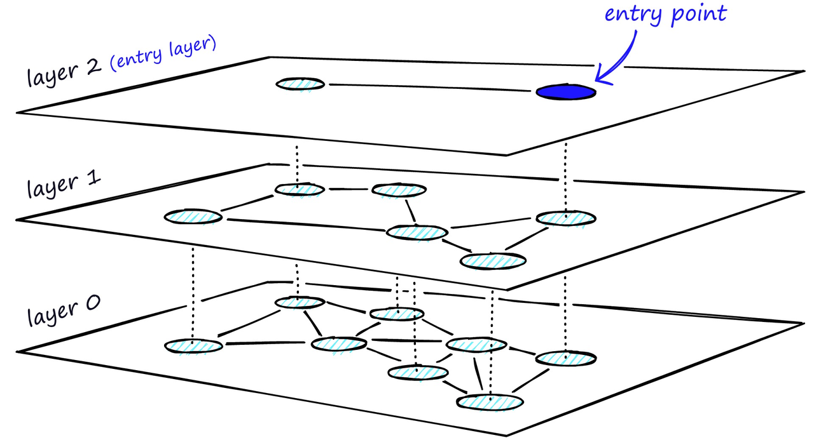
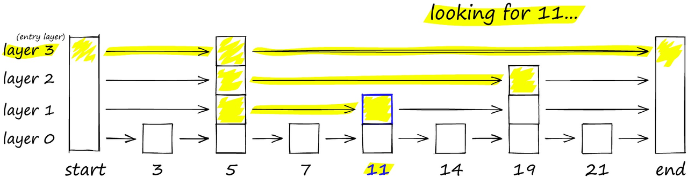
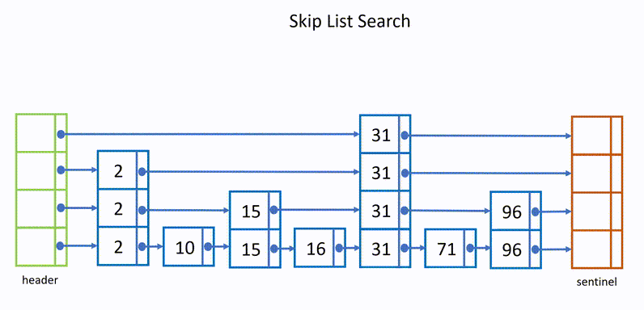
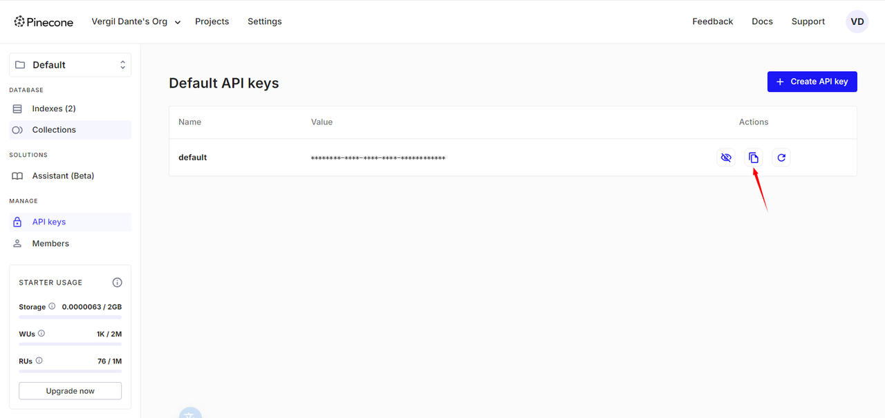

## 一、相似性搜索 (Similarity Search)

既然我们知道了可以通过比较向量之间的距离来判断它们的相似度，那么如何将它应用到真实的场景中呢？如果想要在一个海量的数据中找到和某个向量最相似的向量，我们需要对数据库中的每个向量进行一次比较计算，但这样的计算量是非常巨大的，所以我们需要一种高效的算法来解决这个问题。

高效的搜索算法有很多，其主要思想是通过两种方式提高搜索效率：

* **减少向量大小**——通过降维或减少表示向量值的长度。

* **缩小搜索范围**——可以通过聚类或将向量组织成基于树形、图形结构来实现，并限制搜索范围仅在最接近的簇中进行，或者通过最相似的分支进行过滤。

我们首先来介绍一下大部分算法共有的核心概念，也就是聚类。

### 1. K-Means

我们可以在保存向量数据后，先对向量数据先进行聚类。例如下图在二维坐标系中，划定了 4 个聚类中心，然后将每个向量分配到最近的聚类中心，经过聚类算法不断调整聚类中心位置，这样就可以将向量数据分成 4 个簇。每次搜索时，只需要先判断搜索向量属于哪个簇，然后再在这一个簇中进行搜索，这样就从 4 个簇的搜索范围减少到了 1 个簇，大大减少了搜索的范围。

#### 1.1 **工作原理**

* **初始化**：选择 k*k* 个随机点作为初始聚类中心。

* **分配**：将每个向量分配给离它最近的聚类中心，形成 k*k* 个簇。

* **更新**：重新计算每个簇的聚类中心，即簇内所有向量的平均值。

* **迭代**：重复“分配”和“更新”步骤，直到聚类中心不再变化或达到最大迭代次数。

**举例说明**

假设我们有一组二维向量（点），例如：\[(1,2),(2,1),(4,5),(5,4),(8,9)]\[(1,2),(2,1),(4,5),(5,4),(8,9)]，我们希望将它们聚成四个簇（k=4*k*=4）。

1. 初始化：随机选择四个点作为初始聚类中心，比如 (1,2)(1,2)、(2,1)(2,1)、(4,5)(4,5) 和 (8,9)(8,9)。

2. 分配：计算每个点到四个聚类中心的距离，将每个点分配给最近的聚类中心。

形成四个簇：\[(1,2)]\[(1,2)]，\[(2,1)]\[(2,1)]，\[(4,5),(5,4)]\[(4,5),(5,4)]，\[(8,9)]\[(8,9)]。

```txt
- 点 $ (1, 2) $ 更接近 $ (1, 2) $。
- 点 $ (2, 1) $ 更接近 $ (2, 1) $。
- 点 $ (4, 5) $ 更接近 $ (4, 5) $。
- 点 $ (5, 4) $ 更接近 $ (4, 5) $。
- 点 $ (8, 9) $ 更接近 $ (8, 9) $。
```

3. 更新：计算每个簇的新聚类中心。

   * 第一个簇的聚类中心是 (1,2)(1,2)。

   * 第二个簇的聚类中心是 (2,1)(2,1)。

   * 第三个簇的新聚类中心是 ((4+5)/2,(5+4)/2)=(4.5,4.5)((4+5)/2,(5+4)/2)=(4.5,4.5)。

   * 第四个簇的聚类中心是 (8,9)(8,9)。

4. 迭代：重复分配和更新步骤，直到聚类中心不再变化。

#### 1.2 **优缺点**

**优点：**&#x901A;过将向量聚类，我们可以在进行相似性搜索时只需计算查询向量与每个聚类中心之间的距离，而不是与所有向量计算距离。这大大减少了计算量，提高了搜索效率。这种方法在处理大规模数据时尤其有效，可以显著加快搜索速度。

**缺点：**&#x4F8B;如在搜索的时候，如果搜索的内容正好处于两个分类区域的中间，就很有可能遗漏掉最相似的向量。


### 2. Hierarchical Navigable Small Worlds (HNSW)

除了聚类以外，也可以通过构建树或者构建图的方式来实现近似最近邻搜索。这种方法的基本思想是每次将向量加到数据库中的时候，就先找到与它最相邻的向量，然后将它们连接起来，这样就构成了一个图。当需要搜索的时候，就可以从图中的某个节点开始，不断的进行最相邻搜索和最短路径计算，直到找到最相似的向量。

这种算法能保证搜索的质量，但是如果图中所以的节点都以最短的路径相连，如图中最下面的一层，那么在搜索的时候，就同样需要遍历所有的节点。



解决这个问题的思路与常见的跳表算法相似，如下图要搜索跳表，从最高层开始，沿着具有最长 “跳过” 的边向右移动。如果发现当前节点的值大于要搜索的值 - 我们知道已经超过了目标，因此我们会在下一级中向前一个节点。





HNSW 继承了相同的分层格式，最高层具有更长的边缘（用于快速搜索），而较低层具有较短的边缘（用于准确搜索）。

具体来说，可以将图分为多层，每一层都是一个小世界，图中的节点都是相互连接的。而且每一层的节点都会连接到上一层的节点，当需要搜索的时候，就可以从第一层开始，因为第一层的节点之间距离很长，可以减少搜索的时间，然后再逐层向下搜索，又因为最下层相似节点之间相互关联，所以可以保证搜索的质量，能够找到最相似的向量。

HNSW 算法是一种经典的空间换时间的算法，它的搜索质量和搜索速度都比较高，但是它的内存开销也比较大，因为不仅需要将所有的向量都存储在内存中。还需要维护一个图的结构，也同样需要存储。所以这类算法需要根据实际的场景来选择。

**通过一个简单的例子来说明 HNSW 的工作原理。**

假设我们有以下五个二维向量：

* A=(1,2)*A*=(1,2)

* B=(2,3)*B*=(2,3)

* C=(3,4)*C*=(3,4)

* D=(8,9)*D*=(8,9)

* E=(9,10)*E*=(9,10)

我们要使用 HNSW 来找到与查询向量 Q=(2,2)*Q*=(2,2) 最相似的向量。

**构建阶段**

1. **初始化**：

   * 首先，我们为每个向量随机选择其在 HNSW 中的层数。例如，假设：

     * A*A* 在第2层和第1层

     * B*B* 在第1层

     * C*C* 在第1层

     * D*D* 在第1层

     * E*E* 在第1层

2. **构建图**：

   * 从最高层开始构建，A*A* 是第2层唯一的节点。

   * 在第1层，所有节点都存在。我们通过计算欧氏距离来连接节点，确保每个节点只连接到几个最近的邻居。

**搜索阶段**

1. **从最高层开始搜索**：

   * 从第2层的 A*A* 开始，计算 Q*Q* 与 A*A* 的距离：d(Q,A)=(2−1)2+(2−2)2=1*d*(*Q*,*A*)=(2−1)2+(2−2)2=1。

   * 因为 A*A* 是唯一的节点，直接进入下一层。

2. **在第1层搜索**：

   * 从 A*A* 开始，计算 Q*Q* 与 B*B*、C*C*、D*D*、E*E* 的距离：

     * d(Q,B)=(2−2)2+(2−3)2=1*d*(*Q*,*B*)=(2−2)2+(2−3)2=1

     * d(Q,C)=(2−3)2+(2−4)2=5*d*(*Q*,*C*)=(2−3)2+(2−4)2=5

     * d(Q,D)=(2−8)2+(2−9)2=85*d*(*Q*,*D*)=(2−8)2+(2−9)2=85

     * d(Q,E)=(2−9)2+(2−10)2=113*d*(*Q*,*E*)=(2−9)2+(2−10)2=113

   * B*B* 是最近的邻居。

3. **返回结果**：

   * 在第2层找到的最近邻是 A*A*，第1层找到的最近邻是 B*B*，即与查询向量 Q*Q* 最相似的向量。

**总结**

通过这种层次化的搜索过程，HNSW 能够快速缩小搜索范围，在大规模数据中高效找到近似最近邻。


## 二、FAISS

### 1. Faiss 介绍

[Facebook AI Similarity Search (Faiss /Fez/)](https://engineering.fb.com/2017/03/29/data-infrastructure/faiss-a-library-for-efficient-similarity-search/) 是一个用于高效相似度搜索和密集向量聚类的库。它包含了在任意大小的向量集合中进行搜索的算法，甚至可以处理可能无法完全放入内存的向量集合。它还包含用于评估和参数调整的支持代码。

[Faiss ](https://faiss.ai/)官方文档：<https://faiss.ai/>

下面展示如何使用与 `FAISS` 向量数据库相关的功能。它将展示特定于此集成的功能。在学习完这些内容后，探索[相关的用例页面](http://www.aidoczh.com/langchain/v0.2/docs/how_to/#qa-with-rag)可能会很有帮助，以了解如何将这个向量存储作为更大链条的一部分来使用。


### 2. 设置

该集成位于 `langchain-community` 包中。我们还需要安装 `faiss` 包本身。我们还将使用 OpenAI 进行嵌入，因此需要安装这些要求。我们可以使用以下命令进行安装：

```bash
pip install -U langchain-community faiss-cpu langchain-openai tiktoken
```

请注意，如果您想使用启用了 GPU 的版本，也可以安装 `faiss-gpu`。

设置 [LangSmith](https://smith.langchain.com/) 以获得最佳的可观测性也会很有帮助（但不是必需的）。

```python
# os.environ["LANGCHAIN_TRACING_V2"] = "true"# os.environ["LANGCHAIN_API_KEY"] = ""
```


### 3. 导入

在这里，我们将文档导入到向量存储中。

```python
# 示例：faiss_search.py
# 如果您需要使用没有 AVX2 优化的 FAISS 进行初始化，请取消下面一行的注释
# os.environ['FAISS_NO_AVX2'] = '1'
from langchain_community.document_loaders import TextLoader
from langchain_community.vectorstores import FAISS
from langchain_openai import OpenAIEmbeddings
from langchain_text_splitters import CharacterTextSplitter
loader = TextLoader("../../resource/knowledge.txt", encoding="UTF-8")
documents = loader.load()
text_splitter = CharacterTextSplitter(chunk_size=1500, chunk_overlap=0)
docs = text_splitter.split_documents(documents)
embeddings = OpenAIEmbeddings()
db = FAISS.from_documents(docs, embeddings)
print(db.index.ntotal)
```

```txt
16
```


### 4. 查询

现在，我们可以查询向量存储。有几种方法可以做到这一点。最常见的方法是使用 `similarity_search`。

```python
# 示例：faiss_search.py
query = "Pixar公司是做什么的?"
docs = db.similarity_search(query)
```

```python
print(docs[0].page_content)
```

```txt
During the next five years, I started a company named NeXT, another company named Pixar, and fell in love with an amazing woman who would become my wife. Pixar went on to create the worlds first computer animated feature film, Toy Story, and is now the most successful animation studio in the world. In a remarkable turn of events, Apple bought NeXT, I retuned to Apple, and the technology we developed at NeXT is at the heart of Apple's current renaissance. And Laurene and I have a wonderful family together.
在接下来的五年里, 我创立了一个名叫 NeXT 的公司，还有一个叫Pixar的公司，然后和一个后来成为我妻子的优雅女人相识。Pixar 制作了世界上第一个用电脑制作的动画电影——“”玩具总动员”，Pixar 现在也是世界上最成功的电脑制作工作室。在后来的一系列运转中，Apple 收购了NeXT，然后我又回到了苹果公司。我们在NeXT 发展的技术在 Apple 的复兴之中发挥了关键的作用。我还和 Laurence 一起建立了一个幸福的家庭。
```


### 5. 作为检索器

我们还可以将向量存储转换为 [Retriever](http://www.aidoczh.com/langchain/v0.2/docs/how_to/#retrievers) 类。这使我们能够轻松地在其他 LangChain 方法中使用它，这些方法主要用于检索器。

```python
# 示例：faiss_retriever.py
retriever = db.as_retriever()
docs = retriever.invoke(query)
```

```python
print(docs[0].page_content)
```

```txt
During the next five years, I started a company named NeXT, another company named Pixar, and fell in love with an amazing woman who would become my wife. Pixar went on to create the worlds first computer animated feature film, Toy Story, and is now the most successful animation studio in the world. In a remarkable turn of events, Apple bought NeXT, I retuned to Apple, and the technology we developed at NeXT is at the heart of Apple's current renaissance. And Laurene and I have a wonderful family together.
在接下来的五年里, 我创立了一个名叫 NeXT 的公司，还有一个叫Pixar的公司，然后和一个后来成为我妻子的优雅女人相识。Pixar 制作了世界上第一个用电脑制作的动画电影——“”玩具总动员”，Pixar 现在也是世界上最成功的电脑制作工作室。在后来的一系列运转中，Apple 收购了NeXT，然后我又回到了苹果公司。我们在NeXT 发展的技术在 Apple 的复兴之中发挥了关键的作用。我还和 Laurence 一起建立了一个幸福的家庭。
```


### 6. 带分数的相似度搜索

还有一些 FAISS 特定的方法。其中之一是 `similarity_search_with_score`，它允许您返回文档以及查询与它们之间的距离分数。返回的距离分数是 L2 距离。因此，得分越低越好。

```python
# 示例：faiss_similarity.py
# 返回文档以及查询与它们之间的距离分数。返回的距离分数是 L2 距离。因此，得分越低越好。
docs_and_scores = db.similarity_search_with_score(query)
print(docs_and_scores)
# 还可以使用`similarity_search_by_vector`来搜索与给定嵌入向量相似的文档，该函数接受一个嵌入向量作为参数，而不是字符串。
embedding_vector = embeddings.embed_query(query)
docs_and_scores = db.similarity_search_by_vector(embedding_vector)
print(docs_and_scores)
```

```python
[(Document(metadata={'source': '../../resource/knowledge.txt'}, page_content="During the next five years, I started a company named NeXT, another company named Pixar, and fell in love with an amazing woman who would become my wife. Pixar went on to create the worlds first computer animated feature film, Toy Story, and is now the most successful animation studio in the world. In a remarkable turn of events, Apple bought NeXT, I retuned to Apple, and the technology we developed at NeXT is at the heart of Apple's current renaissance. And Laurene and I have a wonderful family together.\n在接下来的五年里, 我创立了一个名叫 NeXT 的公司，还有一个叫Pixar的公司，然后和一个后来成为我妻子的优雅女人相识。Pixar 制作了世界上第一个用电脑制作的动画电影——“”玩具总动员”，Pixar 现在也是世界上最成功的电脑制作工作室。在后来的一系列运转中，Apple 收购了NeXT，然后我又回到了苹果公司。我们在NeXT 发展的技术在 Apple 的复兴之中发挥了关键的作用。我还和 Laurence 一起建立了一个幸福的家庭。"), 0.3155345), (Document(metadata={'source': '../../resource/knowledge.txt'}, page_content='I was lucky – I found what I loved to do early in life. Woz and I started Apple in my parents garage when I was 20. We worked hard, and in 10 years Apple had grown from just the two of us in a garage into a billion company with over 4000 employees. We had just released our finest creation - the Macintosh - a year earlier, and I had just turned 30. And then I got fired. How can you get fired from a company you started? Well, as Apple grew we hired someone who I thought was very talented to run the company with me, and for the first year or so things went well. But then our visions of the future began to diverge and eventually we had a falling out. When we did, our Board of Directors sided with him. So at 30 I was out. And very publicly out. What had been the focus of my entire adult life was gone, and it was devastating.\n我非常幸运，因为我在很早的时候就找到了我钟爱的东西。沃兹和我在二十岁的时候就在父母的车库里面开创了苹果公司。我们工作得很努力，十年之后，这个公司从那两个车库中的穷光蛋发展到了超过四千名的雇员、价值超过二十亿的大公司。在公司成立的第九年，我们刚刚发布了最好的产品，那就是 Macintosh。我也快要到三十岁了。在那一年，我被炒了鱿鱼。你怎么可能被你自己创立的公司炒了鱿鱼呢？嗯，在苹果快速成长的时候，我们雇用了一个很有天分的家伙和我一起管理这个公司，在最初的几年，公司运转的很好。但是后来我们对未来的看法发生了分歧, 最终我们吵了起来。当争吵不可开交的时候，董事会站在了他的那一边。所以在三十岁的时候，我被炒了。在这么多人的眼皮下我被炒了。在而立之年，我生命的全部支柱离自己远去，这真是毁灭性的打击。'), 0.44481623), (Document(metadata={'source': '../../resource/knowledge.txt'}, page_content="I really didn't know what to do for a few months. I felt that I had let the previous generation of entrepreneurs down - that I had dropped the baton as it was being passed to me. I met with David Packard and Bob Noyce and tried to apologize for screwing up so badly. I was a very public failure, and I even thought about running away from the valley. But something slowly began to dawn on me – I still loved what I did. The turn of events at Apple had not changed that one bit. I had been rejected, but I was still in love. And so I decided to start over.\n在最初的几个月里，我真是不知道该做些什么。我把从前的创业激情给丢了，我觉得自己让与我一同创业的人都很沮丧。我和 David Pack 和 Bob Boyce 见面，并试图向他们道歉。我把事情弄得糟糕透顶了。但是我渐渐发现了曙光，我仍然喜爱我从事的这些东西。苹果公司发生的这些事情丝毫的没有改变这些，一点也没有。我被驱逐了，但是我仍然钟爱它。所以我决定从头再来。\n\nI didn't see it then, but it turned out that getting fired from Apple was the best thing that could have ever happened to me. The heaviness of being successful was replaced by the lightness of being a beginner again, less sure about everything. It freed me to enter one of the most creative periods of my life.\n我当时没有觉察，但是事后证明，从苹果公司被炒是我这辈子发生的最棒的事情。因为，作为一个成功者的极乐感觉被作为一个创业者的轻松感觉所重新代替：对任何事情都不那么特别看重。这让我觉得如此自由，进入了我生命中最有创造力的一个阶段。"), 0.46826816), (Document(metadata={'source': '../../resource/knowledge.txt'}, page_content="I'm pretty sure none of this would have happened if I hadn't been fired from Apple. It was awful tasting medicine, but I guess the patient needed it. Sometimes life hits you in the head with a brick. Don't lose faith. I'm convinced that the only thing that kept me going was that I loved what I did. You've got to find what you love. And that is as true for your work as it is for your lovers. Your work is going to fill a large part of your life, and the only way to be truly satisfied is to do what you believe is great work. And the only way to do great work is to love what you do. If you haven't found it yet, keep looking. Don't settle. As with all matters of the heart, you'll know when you find it. And, like any great relationship, it just gets better and better as the years roll on. So keep looking until you find it. Don't settle.\n我可以非常肯定,如果我不被苹果公司开除的话，这其中一件事情也不会发生的。这个良药的味道实在是太苦了，但是我想病人需要这个药。有些时候，生活会拿起一块砖头向你的脑袋上猛拍一下。不要失去信心，我很清楚唯一使我一直走下去的，就是我做的事情令我无比钟爱。你需要去找到你所爱的东西，对于工作是如此，对于你的爱人也是如此。你的工作将会占据生活中很大的一部分。你只有相信自己所做的是伟大的工作，你才能怡然自得。如果你现在还没有找到，那么继续找、不要停下来、全心全意的去找，当你找到的时候你就会知道的。就像任何真诚的关系，随着岁月的流逝只会越来越紧密。所以继续找，直到你找到它，不要停下来。\n\nMy third story is about death.\n我的第三个故事是关于死亡的。"), 0.4740282)]
```


### 7. 保存和加载

您还可以保存和加载 FAISS 索引。这样做很有用，因为您不必每次使用时都重新创建它。

```python
# 示例：faiss_save.py
# 保存索引
db.save_local("faiss_index")
# 读取索引
new_db = FAISS.load_local("faiss_index", embeddings,allow_dangerous_deserialization=True)
docs = new_db.similarity_search(query)
```

```python
docs[0]
```

```txt
page_content='During the next five years, I started a company named NeXT, another company named Pixar, and fell in love with an amazing woman who would become my wife. Pixar went on to create the worlds first computer animated feature film, Toy Story, and is now the most successful animation studio in the world. In a remarkable turn of events, Apple bought NeXT, I retuned to Apple, and the technology we developed at NeXT is at the heart of Apple's current renaissance. And Laurene and I have a wonderful family together.
在接下来的五年里, 我创立了一个名叫 NeXT 的公司，还有一个叫Pixar的公司，然后和一个后来成为我妻子的优雅女人相识。Pixar 制作了世界上第一个用电脑制作的动画电影——“”玩具总动员”，Pixar 现在也是世界上最成功的电脑制作工作室。在后来的一系列运转中，Apple 收购了NeXT，然后我又回到了苹果公司。我们在NeXT 发展的技术在 Apple 的复兴之中发挥了关键的作用。我还和 Laurence 一起建立了一个幸福的家庭。' metadata={'source': '../../resource/knowledge.txt'}
```


## 三、Pinecone

### 1. Pinecone 介绍

[Pinecone](https://docs.pinecone.io/docs/overview) (/ˈpaɪnˌkon/ n. 松果；松球)是一个功能广泛的向量数据库。

官方文档：<https://docs.pinecone.io/guides/get-started/quickstart>

下面展示了如何使用与 `Pinecone` 向量数据库相关的功能。

设置以下环境变量以便在本文档中进行操作：

* `OPENAI_API_KEY`：您的 OpenAI API 密钥，用于使用 `OpenAIEmbeddings`

```python
%pip install --upgrade --quiet  \
    langchain-pinecone \
    langchain-openai \
    langchain \
    pinecone-notebooks
```

配置 PINECONE\_API\_KEY 环境变量

```powershell
setx PINECONE_API_KEY ""
```



首先，让我们将我们的文本库拆分成分块的 `docs`。

```python
# 示例：pinecone_search.py
from langchain_community.document_loaders import TextLoader
from langchain_openai import OpenAIEmbeddings
from langchain_text_splitters import CharacterTextSplitter
loader = TextLoader("../../resource/knowledge.txt",encoding="UTF-8")
documents = loader.load()
text_splitter = CharacterTextSplitter(chunk_size=1500, chunk_overlap=0)
docs = text_splitter.split_documents(documents)
embeddings = OpenAIEmbeddings()
```

新创建的 API 密钥已存储在 `PINECONE_API_KEY` 环境变量中。我们将使用它来设置 Pinecone 客户端。

```python
import os
pinecone_api_key = os.environ.get("PINECONE_API_KEY")
pinecone_api_key
import time
from pinecone import Pinecone, ServerlessSpec
pc = Pinecone(api_key=pinecone_api_key)
```

接下来，让我们连接到您的 Pinecone 索引。如果名为 `index_name` 的索引不存在，将会被创建。

```python
import time
index_name = "langchain-index"  # 如果需要，可以更改
existing_indexes = [index_info["name"] for index_info in pc.list_indexes()]
if index_name not in existing_indexes:
    pc.create_index(
        name=index_name,
        dimension=1536,
        metric="cosine",
        spec=ServerlessSpec(cloud="aws", region="us-east-1"),
    )while not pc.describe_index(index_name).status["ready"]:
        time.sleep(1)
index = pc.Index(index_name)
```

现在我们的 Pinecone 索引已经设置好，我们可以使用 `PineconeVectorStore.from_documents` 将这些分块的文档作为内容进行更新。

```python
from langchain_pinecone import PineconeVectorStore
docsearch = PineconeVectorStore.from_documents(docs, embeddings, index_name=index_name)
```

```python
query = "Pixar"
docs = docsearch.similarity_search(query)
print(docs[0].page_content)
```

```txt
During the next five years, I started a company named NeXT, another company named Pixar, and fell in love with an amazing woman who would become my wife. Pixar went on to create the worlds first computer animated feature film, Toy Story, and is now the most successful animation studio in the world. In a remarkable turn of events, Apple bought NeXT, I retuned to Apple, and the technology we developed at NeXT is at the heart of Apple's current renaissance. And Laurene and I have a wonderful family together.
在接下来的五年里, 我创立了一个名叫 NeXT 的公司，还有一个叫Pixar的公司，然后和一个后来成为我妻子的优雅女人相识。Pixar 制作了世界上第一个用电脑制作的动画电影——“”玩具总动员”，Pixar 现在也是世界上最成功的电脑制作工作室。在后来的一系列运转中，Apple 收购了NeXT，然后我又回到了苹果公司。我们在NeXT 发展的技术在 Apple 的复兴之中发挥了关键的作用。我还和 Laurence 一起建立了一个幸福的家庭。
```

查看index创建：[https://app.pinecone.io](https://app.pinecone.io/organizations/-O3c52_oskiguJEqQubV/projects/f087a26f-d581-4af3-a628-2a13ead9fd7c/indexes)


## 四、Lance

### [LanceDB](https://lancedb.com/) 介绍

[Lance](https://lancedb.com/)（ /læns/ 长矛；执矛战士；\[医]柳叶刀）是一个基于持久存储构建的用于向量搜索的开源数据库，极大地简化了嵌入式的检索、过滤和管理。完全开源。

官网：<https://lancedb.com/>

官方文档：<https://lancedb.github.io/lancedb/basic/>

下面展示如何使用与 `LanceDB` 向量数据库相关的功能，基于 Lance 数据格式。

```python
! pip install -U langchain-openai
```

```python
! pip install lancedb
```

```python
# 示例：lance_search.py
from langchain_community.document_loaders import TextLoader
from langchain_community.vectorstores import LanceDB
from langchain_openai import OpenAIEmbeddings
from langchain_text_splitters import CharacterTextSplitter
loader = TextLoader("../../resource/knowledge.txt", encoding="UTF-8")
documents = loader.load()
text_splitter = CharacterTextSplitter(chunk_size=1500, chunk_overlap=0)
documents = text_splitter.split_documents(documents)
embeddings = OpenAIEmbeddings()
```

### 向量存储

```python
docsearch = LanceDB.from_documents(documents, embeddings)
query = "Pixar公司是做什么的?"
docs = docsearch.similarity_search(query)
print(docs[0].page_content)
```

```txt
During the next five years, I started a company named NeXT, another company named Pixar, and fell in love with an amazing woman who would become my wife. Pixar went on to create the worlds first computer animated feature film, Toy Story, and is now the most successful animation studio in the world. In a remarkable turn of events, Apple bought NeXT, I retuned to Apple, and the technology we developed at NeXT is at the heart of Apple's current renaissance. And Laurene and I have a wonderful family together.
在接下来的五年里, 我创立了一个名叫 NeXT 的公司，还有一个叫Pixar的公司，然后和一个后来成为我妻子的优雅女人相识。Pixar 制作了世界上第一个用电脑制作的动画电影——“”玩具总动员”，Pixar 现在也是世界上最成功的电脑制作工作室。在后来的一系列运转中，Apple 收购了NeXT，然后我又回到了苹果公司。我们在NeXT 发展的技术在 Apple 的复兴之中发挥了关键的作用。我还和 Laurence 一起建立了一个幸福的家庭。
```

```python
print(docs[0].metadata)
```

```python
{'source': '../../resource/knowledge.txt'}
```

***

此外，要探索表格，可以将其加载到数据框中或将其保存在 csv 文件中：

```python
tbl = docsearch.get_table()
print("tbl:", tbl)
pd_df = tbl.to_pandas()
pd_df.to_csv("docsearch.csv", index=False)
```

```python
tbl: LanceTable(connection=LanceDBConnection(D:\tmp\lancedb), name="vectorstore")
```


## 五、总结

下面是 Pinecone、FAISS 和 Lance 三个向量数据库的功能对比表格：

这些数据库在功能和特性上各有优势，选择合适的数据库应根据具体的应用需求和技术栈来决定。

