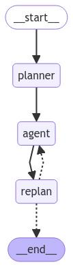

## **Agent工作流**

下面展示了如何创建一个“计划并执行”风格的代理。 这在很大程度上借鉴了 [计划和解决](https://arxiv.org/abs/2305.04091) 论文以及 [Baby-AGI](https://github.com/yoheinakajima/babyagi) 项目。

核心思想是先制定一个多步骤计划，然后逐项执行。 完成一项特定任务后，您可以重新审视计划并根据需要进行修改。

一般的计算图如下所示

这与典型的 [ReAct](https://arxiv.org/abs/2210.03629) 风格的代理进行了比较，在该代理中，您一次思考一步。 这种“计划并执行”风格代理的优势在于

1. 明确的长期规划（即使是真正强大的 LLM 也可能难以做到）

2. 能够使用更小/更弱的模型来执行步骤，仅在规划步骤中使用更大/更好的模型

以下演练演示了如何在 LangGraph 中实现这一点。 生成的代理将留下类似以下示例的轨迹： (链接).

## **设置**

首先，我们需要安装所需的软件包。

```python
pip install --quiet -U langgraph langchain-community langchain-openai tavily-python
```

接下来，我们需要为 OpenAI（我们将使用的 LLM）和 Tavily（我们将使用的搜索工具）设置 API 密钥

可以选择设置 LangSmith 跟踪的 API 密钥，这将为我们提供一流的可观察性。

```python
setx TAVILY_API_KEY ""
# Optional, add tracing in LangSmith
setx LANGCHAIN_TRACING_V2 "true"
setx LANGCHAIN_API_KEY ""
```

## **定义工具**

我们将首先定义要使用的工具。 对于这个简单的示例，我们将使用 Tavily 内置的搜索工具。 但是，创建自己的工具非常容易 - 请参阅有关如何操作的文档 [此处](http://python.langchain.ac.cn/v0.2/docs/how_to/custom_tools)。

```python
#示例：plan_execute.py
from langchain_community.tools.tavily_search import TavilySearchResults
# 创建TavilySearchResults工具，设置最大结果数为1
tools = [TavilySearchResults(max_results=1)]
```

## **定义我们的执行代理**

现在我们将创建要用于执行任务的执行代理。 请注意，对于此示例，我们将对每个任务使用相同的执行代理，但这并非必须如此。

```python
from langchain import hub
from langchain_openai import ChatOpenAI
import asyncio
from langgraph.prebuilt import create_react_agent

# 从LangChain的Hub中获取prompt模板，可以进行修改
prompt = hub.pull("wfh/react-agent-executor")
prompt.pretty_print()

# 选择驱动代理的LLM，使用OpenAI的ChatGPT-4o模型
llm = ChatOpenAI(model="gpt-4o")
# 创建一个REACT代理执行器，使用指定的LLM和工具，并应用从Hub中获取的prompt
agent_executor = create_react_agent(llm, tools, messages_modifier=prompt)
```

```python
================================ System Message ================================

You are a helpful assistant.

============================= Messages Placeholder =============================

{{messages}}
```

```python
# 调用代理执行器，询问“谁是美国公开赛的冠军”
agent_executor.invoke({"messages": [("user", "谁是美国公开赛的获胜者")]})
```

```python
{'messages': [HumanMessage(content='who is the winnner of the us open', id='7c491c9f-cdbe-4761-b93b-3e4eeb526c97'),
              AIMessage(content='', additional_kwargs={'tool_calls': [{'id': 'call_MMmwmxwxRH2hrmMbuBeMGsXW', 'function': {'arguments': '{"query":"US Open 2023 winner"}', 'name': 'tavily_search_results_json'}, 'type': 'function'}]}, response_metadata={'token_usage': {'completion_tokens': 23, 'prompt_tokens': 97, 'total_tokens': 120}, 'model_name': 'gpt-4-turbo-preview', 'system_fingerprint': None, 'finish_reason': 'tool_calls', 'logprobs': None}, id='run-855f7cff-62a2-4dd8-b71b-707b507b00a4-0', tool_calls=[{'name': 'tavily_search_results_json', 'args': {'query': 'US Open 2023 winner'}, 'id': 'call_MMmwmxwxRH2hrmMbuBeMGsXW'}]),
              ToolMessage(content='[{"url": "https://www.bbc.com/sport/tennis/66766337", "content": ": Stephen Nolan goes in to find out\\nRelated Topics\\nTop Stories\\nTen Hag on Rashford plus transfer news, WSL deadline day\\nSpinner Leach doubtful for second Test in India\\nMcIlroy \'changes tune\' on LIV players\' punishment\\nElsewhere on the BBC\\nDiscover the tropical paradise of Thailand\\nFrom the secrets of the South to the mysterious North...\\n Djokovic offered to help up Medvedev when the Russian fell to the court in the third set\\nDjokovic\'s relentless returning continued to draw mistakes out of Medvedev, who was serving poorly and making loose errors, at the start of the second set.\\n It was clear to see Medvedev had needed to level by taking that second set to stand any real chance of victory and the feeling of the inevitable was heightened by the Russian needing treatment on a shoulder injury before the third set.\\n Djokovic shows again why he can never be written off\\nWhen Djokovic lost to 20-year-old Carlos Alcaraz in the Wimbledon final it felt like a changing-of-the-guard moment in the men\'s game.\\n The inside story of Putin\\u2019s invasion of Ukraine\\nTold by the Presidents and Prime Ministers tasked with making the critical decisions\\nSurvival of the wittiest!\\n"}, {"url": "https://www.usopen.org/en_US/news/articles/2023-09-10/novak_djokovic_wins_24th_grand_slam_singles_title_at_2023_us_open.html", "content": "WHAT HAPPENED: Novak Djokovic handled the weight of history to defeat Daniil Medvedev on Sunday in the 2023 US Open men\'s singles final. With a 6-3, 7-6(5), 6-3 victory, the 36-year-old won his 24th Grand Slam singles title, tying Margaret Court\'s record and bolstering his case to be considered the greatest tennis player of all time."}, {"url": "https://apnews.com/article/us-open-final-live-updates-djokovic-medvedev-8a4a26f8d77ef9ab2fb3efe1096dce7e", "content": "Novak Djokovic wins the US Open for his 24th Grand Slam title by beating Daniil Medvedev\\nNovak Djokovic, of Serbia, holds up the championship trophy after defeating Daniil Medvedev, of Russia, in the men\\u2019s singles final of the U.S. Open tennis championships, Sunday, Sept. 10, 2023, in New York. (AP Photo/Manu Fernandez)\\nDaniil Medvedev, of Russia, sits on the court after a rally against Novak Djokovic, of Serbia, during the men\\u2019s singles final of the U.S. Open tennis championships, Sunday, Sept. 10, 2023, in New York. (AP Photo/Manu Fernandez)\\nDaniil Medvedev, of Russia, sits on the court after a rally against Novak Djokovic, of Serbia, during the men\\u2019s singles final of the U.S. Open tennis championships, Sunday, Sept. 10, 2023, in New York. (AP Photo/Manu Fernandez)\\nDaniil Medvedev, of Russia, sits on the court after a rally against Novak Djokovic, of Serbia, during the men\\u2019s singles final of the U.S. Open tennis championships, Sunday, Sept. 10, 2023, in New York. Novak Djokovic, of Serbia, reveals a t-shirt honoring the number 24 and Kobe Bryant after defeating Daniil Medvedev, of Russia, in the men\\u2019s singles final of the U.S. Open tennis championships, Sunday, Sept. 10, 2023, in New York."}]', name='tavily_search_results_json', id='ca0ff812-6c7f-43c1-9d0e-427cfe8da332', tool_call_id='call_MMmwmxwxRH2hrmMbuBeMGsXW'),
  AIMessage(content="The winner of the 2023 US Open men's singles was Novak Djokovic. He defeated Daniil Medvedev with a score of 6-3, 7-6(5), 6-3 in the final, winning his 24th Grand Slam singles title. This victory tied Margaret Court's record and bolstered Djokovic's claim to be considered one of the greatest tennis players of all time.", response_metadata={'token_usage': {'completion_tokens': 89, 'prompt_tokens': 972, 'total_tokens': 1061}, 'model_name': 'gpt-4-turbo-preview', 'system_fingerprint': None, 'finish_reason': 'stop', 'logprobs': None}, id='run-ef37a655-1ea6-470e-a310-8f125ca48015-0')]}
```

## **定义状态**

现在让我们从定义要跟踪此代理的状态开始。

首先，我们需要跟踪当前计划。 让我们将其表示为字符串列表。

接下来，我们应该跟踪先前执行的步骤。 让我们将其表示为元组列表（这些元组将包含步骤及其结果）

最后，我们需要一些状态来表示最终响应以及原始输入。

```python
import operator
from typing import Annotated, List, Tuple, TypedDict


# 定义一个TypedDict类PlanExecute，用于存储输入、计划、过去的步骤和响应
class PlanExecute(TypedDict):
    input: str
    plan: List[str]
    past_steps: Annotated[List[Tuple], operator.add]
    response: str
```

## **规划步骤**

现在让我们考虑创建规划步骤。 这将使用函数调用来创建计划。

```python
from langchain_core.pydantic_v1 import BaseModel, Field


# 定义一个Plan模型类，用于描述未来要执行的计划
class Plan(BaseModel):
    """未来要执行的计划"""

    steps: List[str] = Field(
        description="需要执行的不同步骤，应该按顺序排列"
    )
```

```python
from langchain_core.prompts import ChatPromptTemplate

# 创建一个计划生成的提示模板
planner_prompt = ChatPromptTemplate.from_messages(
    [
        (
            "system",
            """对于给定的目标，提出一个简单的逐步计划。这个计划应该包含独立的任务，如果正确执行将得出正确的答案。不要添加任何多余的步骤。最后一步的结果应该是最终答案。确保每一步都有所有必要的信息 - 不要跳过步骤。""",
        ),
        ("placeholder", "{messages}"),
    ]
)
# 使用指定的提示模板创建一个计划生成器，使用OpenAI的ChatGPT-4o模型
planner = planner_prompt | ChatOpenAI(
    model="gpt-4o", temperature=0
).with_structured_output(Plan)
```

```python
# 调用计划生成器，询问“当前澳大利亚公开赛冠军的家乡是哪里？”
planner.invoke(
    {
        "messages": [
            ("user", "现任澳网冠军的家乡是哪里?")
        ]
    }
)
```

```python
{'plan': ['查找2024年澳大利亚网球公开赛的冠军是谁', '查找该冠军的家乡是哪里', '用中文回答该冠军的家乡']}
```


## **重新规划步骤**

现在，让我们创建一个根据上一步结果重新制定计划的步骤。

```python
from typing import Union


# 定义一个响应模型类，用于描述用户的响应
class Response(BaseModel):
    """用户响应"""

    response: str


# 定义一个行为模型类，用于描述要执行的行为
class Act(BaseModel):
    """要执行的行为"""

    action: Union[Response, Plan] = Field(
        description="要执行的行为。如果要回应用户，使用Response。如果需要进一步使用工具获取答案，使用Plan。"
    )


# 创建一个重新计划的提示模板
replanner_prompt = ChatPromptTemplate.from_template(
    """对于给定的目标，提出一个简单的逐步计划。这个计划应该包含独立的任务，如果正确执行将得出正确的答案。不要添加任何多余的步骤。最后一步的结果应该是最终答案。确保每一步都有所有必要的信息 - 不要跳过步骤。

你的目标是：
{input}

你的原计划是：
{plan}

你目前已完成的步骤是：
{past_steps}

相应地更新你的计划。如果不需要更多步骤并且可以返回给用户，那么就这样回应。如果需要，填写计划。只添加仍然需要完成的步骤。不要返回已完成的步骤作为计划的一部分。"""
)

# 使用指定的提示模板创建一个重新计划生成器，使用OpenAI的ChatGPT-4o模型
replanner = replanner_prompt | ChatOpenAI(
    model="gpt-4o", temperature=0
).with_structured_output(Act)
```

## **创建图**

现在我们可以创建图了！

```python
from typing import Literal


# 定义一个异步主函数
async def main():
    # 定义一个异步函数，用于执行步骤
    async def execute_step(state: PlanExecute):
        plan = state["plan"]
        plan_str = "\n".join(f"{i + 1}. {step}" for i, step in enumerate(plan))
        task = plan[0]
        task_formatted = f"""对于以下计划：
{plan_str}\n\n你的任务是执行第{1}步，{task}。"""
        agent_response = await agent_executor.ainvoke(
            {"messages": [("user", task_formatted)]}
        )
        return {
            "past_steps": state["past_steps"] + [(task, agent_response["messages"][-1].content)],
        }

    # 定义一个异步函数，用于生成计划步骤
    async def plan_step(state: PlanExecute):
        plan = await planner.ainvoke({"messages": [("user", state["input"])]})
        return {"plan": plan.steps}

    # 定义一个异步函数，用于重新计划步骤
    async def replan_step(state: PlanExecute):
        output = await replanner.ainvoke(state)
        if isinstance(output.action, Response):
            return {"response": output.action.response}
        else:
            return {"plan": output.action.steps}

    # 定义一个函数，用于判断是否结束
    def should_end(state: PlanExecute) -> Literal["agent", "__end__"]:
        if "response" in state and state["response"]:
            return "__end__"
        else:
            return "agent"
```

```python
from langgraph.graph import StateGraph, START

# 创建一个状态图，初始化PlanExecute
workflow = StateGraph(PlanExecute)

# 添加计划节点
workflow.add_node("planner", plan_step)

# 添加执行步骤节点
workflow.add_node("agent", execute_step)

# 添加重新计划节点
workflow.add_node("replan", replan_step)

# 设置从开始到计划节点的边
workflow.add_edge(START, "planner")

# 设置从计划到代理节点的边
workflow.add_edge("planner", "agent")

# 设置从代理到重新计划节点的边
workflow.add_edge("agent", "replan")

# 添加条件边，用于判断下一步操作
workflow.add_conditional_edges(
    "replan",
    # 传入判断函数，确定下一个节点
    should_end,
)

# 编译状态图，生成LangChain可运行对象
app = workflow.compile()
```

```plain&#x20;text
    # 将生成的图片保存到文件
    graph_png = app.get_graph().draw_mermaid_png()
    with open("plan_execute.png", "wb") as f:
        f.write(graph_png)
```



```python
# 设置配置，递归限制为50
config = {"recursion_limit": 50}
# 输入数据
inputs = {"input": "2024年巴黎奥运会100米自由泳决赛冠军的家乡是哪里?请用中文答复"}
# 异步执行状态图，输出结果
async for event in app.astream(inputs, config=config):
    for k, v in event.items():
        if k != "__end__":
            print(v)
```

```python
{'plan': ['查找2024年巴黎奥运会100米自由泳决赛冠军的名字', '查找该冠军的家乡']}
{'past_steps': [('查找2024年巴黎奥运会100米自由泳决赛冠军的名字', '2024年巴黎奥运会男子100米自由泳决赛的冠军是中国选手潘展乐（Zhanle Pan）。')]}
{'plan': ['查找潘展乐的家乡']}
{'past_steps': [('查找2024年巴黎奥运会100米自由泳决赛冠军的名字', '2024年巴黎奥运会男子100米自由泳决赛的冠军是中国选手潘展乐（Zhanle Pan）。'), ('查找潘展乐的家乡', '潘展乐的家乡是浙江温州。')]}
{'response': '2024年巴黎奥运会100米自由泳决赛冠军潘展乐的家乡是浙江温州。'}
```

