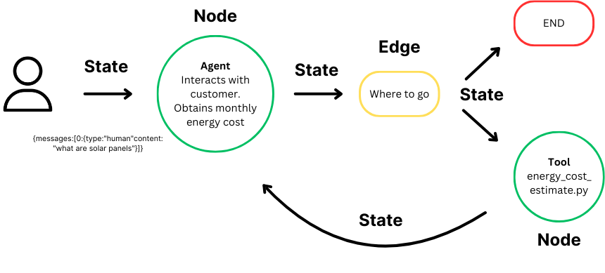
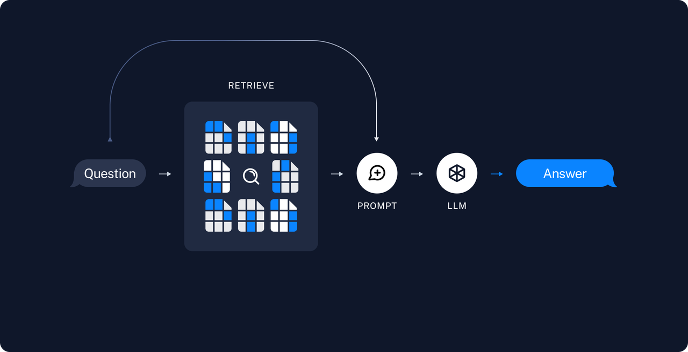
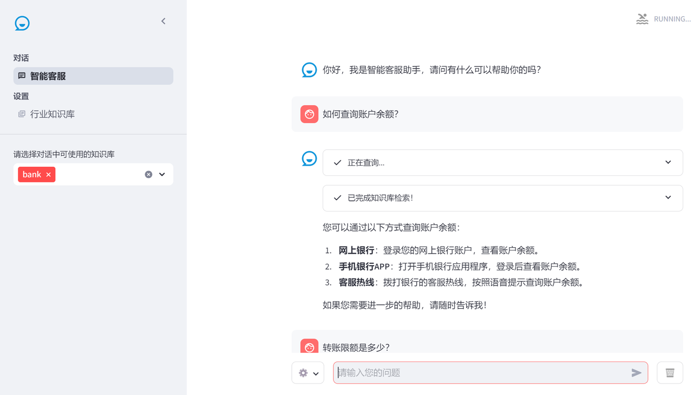

AI 领域正从基础的 RAG 系统向更智能的 AI 智能体进化，后者能处理更复杂的任务并适应新信息。LangGraph 作为 LangChain 库的扩展，助力开发者构建具有[状态管理](https://so.csdn.net/so/search?q=%E7%8A%B6%E6%80%81%E7%AE%A1%E7%90%86\&spm=1001.2101.3001.7020)和循环计算能力的先进 AI 系统。

## **LangGraph流程**

LangGraph 是 LangChain 的高级库，为大型语言模型（LLM）带来循环[计算能力](https://so.csdn.net/so/search?q=%E8%AE%A1%E7%AE%97%E8%83%BD%E5%8A%9B\&spm=1001.2101.3001.7020)。它超越了 LangChain 的线性工作流，通过循环支持复杂的任务处理。

* **状态**：维护计算过程中的上下文，实现基于累积数据的动态决策。

* **节点**：代表计算步骤，执行特定任务，可定制以适应不同工作流。

* **边**：连接节点，定义计算流程，支持条件逻辑，实现复杂工作流。

LangGraph 简化了 AI 开发，自动管理状态，保持上下文，使 AI 能智能响应变化。它让开发者专注于创新，而非技术细节，同时确保应用程序的高性能和可靠性。

## **RAG流程**

一个典型的RAG应用有两个主要组成部分：

**索引(Indexing)**：从数据源获取数据并建立索引的管道(pipeline)。*这通常在离线状态下进行。*

**检索和生成(Retrieval and generation)**：实际的RAG链，在运行时接收用户查询，从索引中检索相关数据，然后将其传递给模型。

从原始数据到答案的最常见完整顺序如下：

### **索引(Indexing)**

1. **加载(Load)**：首先我们需要加载数据。这是通过文档加载器[Document Loaders](https://blog.frognew.com/library/agi/langchain/components/document-loaders.html)完成的。

2. **分割(Split)**：文本分割器[Text splitters](https://python.langchain.com/docs/concepts/#text-splitters)将大型文档(`Documents`)分成更小的块(chunks)。这对于索引数据和将其传递给模型都很有用，因为大块数据更难搜索，而且不适合模型有限的上下文窗口。

3. **存储(Store)**：我们需要一个地方来存储和索引我们的分割(splits)，以便后续可以对其进行搜索。这通常使用向量存储[VectorStore](https://blog.frognew.com/library/agi/langchain/components/vector-stores.html)和嵌入模型[Embeddings model](https://blog.frognew.com/library/agi/langchain/components/embedding-models.html)来完成。

## **检索和生成(Retrieval and generation)**

4. **检索(Retrieve)**：给定用户输入，使用检索器[Retriever](https://blog.frognew.com/library/agi/langchain/components/retrievers.html)从存储中检索相关的文本片段。

5. **生成(Generate)**： [ChatModel](https://blog.frognew.com/library/agi/langchain/components/chat-models.html)使用包含问题和检索到的数据的提示来生成答案。

## **LangGraph基于RAG构建智能客服**

**客服界面**

### **运行环境**

建议使用 Python>=3.10

可参考如下命令进行环境创建

### **安装依赖**

## **配置OpenAI 环境变量**

**Windows 导入环境变量**

注意：每次执行完，需要重启PyCharm才能生效

**Mac 导入环境变量**

## **运行项目**

使用以下命令行运行webui

## **验证效果**

如何查询账户余额？

