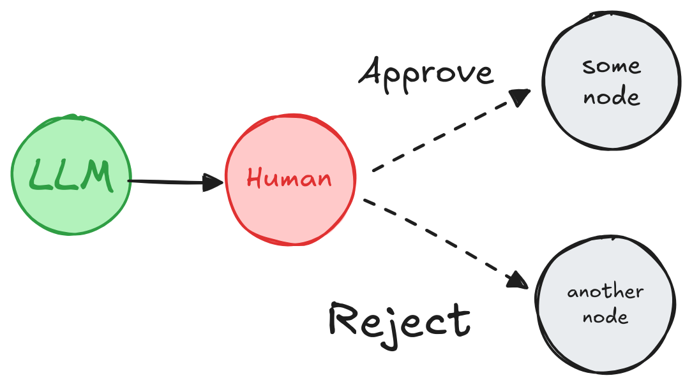
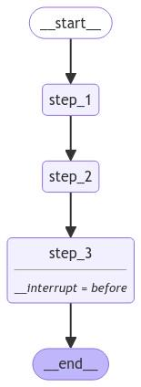

## **Human-in-the-loop(人机交互)**

**人机交互**（或称“在循环中”）工作流将人类输入整合到自动化过程中，在关键阶段允许决策、验证或修正。这在**基于 LLM 的应用**中尤其有用，因为基础模型可能会产生偶尔的不准确性。在合规、决策或内容生成等低误差容忍场景中，人类的参与通过允许审查、修正或覆盖模型输出来确保可靠性。

## **使用案例**

基于 LLM 应用中的**人机交互**工作流的关键使用案例包括：

1. [🛠️ 审查工具调用](https://www.aidoczh.com/langgraph/concepts/human_in_the_loop/#review-tool-calls)：人类可以在工具执行之前审查、编辑或批准 LLM 请求的工具调用。

2. **✅ 验证 LLM 输出**：人类可以审查、编辑或批准 LLM 生成的内容。

3. **💡 提供上下文**：使 LLM 能够明确请求人类输入以进行澄清或提供额外细节，或支持多轮对话。

## **`interrupt`**

[interrupt函数](https://www.aidoczh.com/langgraph/reference/types/#langgraph.types.interrupt) 在 LangGraph 中通过在特定节点暂停图形、向人类展示信息以及使用他们的输入恢复图形，从而启用人工干预工作流。该函数对于批准、编辑或收集额外输入等任务非常有用。[interrupt函数](https://www.aidoczh.com/langgraph/reference/types/#langgraph.types.interrupt) 与 [Command](https://www.aidoczh.com/langgraph/reference/types/#langgraph.types.Command) 对象结合使用，以人类提供的值恢复图形。

```python
from langgraph.types import interrupt

def human_node(state: State):
    value = interrupt(
        # 任何可序列化为 JSON 的值，供人类查看。
        # 例如，一个问题、一段文本或状态中的一组键
       {
          "text_to_revise": state["some_text"]
       }
    )
    # 使用人类的输入更新状态或根据输入调整图形。
    return {
        "some_text": value
    }

graph = graph_builder.compile(
    checkpointer=checkpointer # `interrupt` 工作所需
)

# 运行图形直到遇到中断
thread_config = {"configurable": {"thread_id": "some_id"}}
graph.invoke(some_input, config=thread_config)

# 用人类的输入恢复图形
graph.invoke(Command(resume=value_from_human), config=thread_config)
```

```python
{'some_text': '编辑后的文本'}
```

**Warning**

中断非常强大且易于使用。然而，尽管它们在开发者体验上可能类似于 Python 的 input() 函数，但重要的是要注意，它们不会自动从中断点恢复执行。相反，它们会重新运行使用中断的整个节点。 因此，中断通常最好放置在节点的开头或一个专用的节点中。请阅读 [从中断恢复](https://www.aidoczh.com/langgraph/concepts/human_in_the_loop/#how-does-resuming-from-an-interrupt-work) 部分以获取更多细节。

**完整代码**

## **要求**

要在图形中使用 `interrupt`，您需要：

1. [指定一个检查点](https://www.aidoczh.com/langgraph/concepts/persistence/#checkpoints)，以在每一步后保存图形状态。

2. **在适当位置调用\*\*\*\*&#x20;**`interrupt()`。有关示例，请参见 [设计模式](https://www.aidoczh.com/langgraph/concepts/human_in_the_loop/#design-patterns) 部分。

3. **使用\*\*\*\* [线程 ID](https://www.aidoczh.com/langgraph/concepts/persistence/#threads) \*\*\*\*运行图形**，直到触发 `interrupt`。

4. **使用\*\*\*\*&#x20;**`invoke`**/**`ainvoke`**/**`stream`**/**`astream`**&#x20;\*\*\*\*恢复执行**（见 [Command原语](https://www.aidoczh.com/langgraph/concepts/human_in_the_loop/#the-command-primitive)）。

## **设计模式**

您通常可以采取三种不同的**行动**来实现人工干预工作流：

1. **批准或拒绝**：在关键步骤之前暂停图形，例如 API 调用，以审查和批准该操作。如果拒绝该操作，您可以阻止图形执行该步骤，并可能采取替代行动。此模式通常涉及根据人类的输入**路由**图形。

2. **编辑图形状态**：暂停图形以审查和编辑图形状态。这对于纠正错误或使用额外信息更新状态非常有用。此模式通常涉及使用人类的输入**更新**状态。

3. **获取输入**：在图形的特定步骤明确请求人类输入。这对于收集额外信息或上下文以帮助代理的决策过程或支持**多轮对话**非常有用。

下面我们展示可以使用这些**行动**实现的不同设计模式。

### **批准或拒绝**



*根据人类的批准或拒绝，图形可以继续执行操作或采取替代路径。*

在关键步骤之前暂停图形，例如 API 调用，以审查和批准该操作。如果拒绝该操作，您可以阻止图形执行该步骤，并可能采取替代行动。

```python
from typing import Literal
from langgraph.types import interrupt, Command

def human_approval(state: State) -> Command[Literal["some_node", "another_node"]]:
    is_approved = interrupt(
        {
            "question": "这是正确的吗？",
            # 展示应由人类审查和批准的输出。
            "llm_output": state["llm_output"]
        }
    )

    if is_approved:
        return Command(goto="some_node")
    else:
        return Command(goto="another_node")

# 将节点添加到图形中的适当位置并连接到相关节点。
graph_builder.add_node("human_approval", human_approval)
graph = graph_builder.compile(checkpointer=checkpointer)

# 在运行图形并触发中断后，图形将暂停。
# 用批准或拒绝恢复。
thread_config = {"configurable": {"thread_id": "some_id"}}
graph.invoke(Command(resume=True), config=thread_config)
```

请参见 [如何审查工具调用](https://www.aidoczh.com/langgraph/how-tos/human_in_the_loop/review-tool-calls/) 获取更详细的示例

### **添加断点**

在某些节点执行之前或之后设置断点通常很有用。这可以用来在继续之前等待人工批准。当您[“编译”图形](https://github.langchain.ac.cn/langgraph/concepts/low_level/#compiling-your-graph)时，可以设置这些断点。您可以在节点执行*之前*（使用`interrupt_before`）或节点执行*之后*（使用`interrupt_after`）设置断点。

使用断点时，您**必须**使用[检查点](https://github.langchain.ac.cn/langgraph/concepts/low_level/#checkpointer)。这是因为您的图形需要能够恢复执行。

为了恢复执行，您可以使用 `None` 作为输入调用您的图。

```python
# Initial run of graph
graph.invoke(inputs, config=config)

# Let's assume it hit a breakpoint somewhere, you can then resume by passing in None
graph.invoke(None, config=config)
```

有关如何添加断点的完整演练，请参阅[本指南](https://github.langchain.ac.cn/langgraph/how-tos/human_in_the_loop/breakpoints/)。

人机交互 (HIL) 在 [代理系统](https://github.langchain.ac.cn/langgraph/concepts/agentic_concepts/#human-in-the-loop) 中至关重要。 [断点](https://github.langchain.ac.cn/langgraph/concepts/low_level/#breakpoints) 是一种常见的 HIL 交互模式，允许图在特定步骤停止并寻求人为批准后再继续执行（例如，对于敏感操作）。

断点建立在 LangGraph [检查点](https://github.langchain.ac.cn/langgraph/concepts/low_level/#checkpointer) 之上，检查点在每个节点执行后保存图的状态。 检查点保存在 [线程](https://github.langchain.ac.cn/langgraph/concepts/low_level/#threads) 中，这些线程保存图状态，并且可以在图执行完成后访问。 这使得图执行可以在特定点暂停，等待人为批准，然后从最后一个检查点恢复执行。


让我们看看它的基本用法。

下面，我们做两件事

1. 我们使用 `interrupt_before` 指定步骤，来指定 [断点](https://github.langchain.ac.cn/langgraph/concepts/low_level/#breakpoints)。

2. 我们设置一个[检查点](https://github.langchain.ac.cn/langgraph/concepts/low_level/#checkpointer)来保存图的状态。

```python
#示例：breakpoints_case.py
from typing import TypedDict
from langgraph.graph import StateGraph, START, END
from langgraph.checkpoint.memory import MemorySaver
from IPython.display import Image, display


class State(TypedDict):
    input: str


def step_1(state):
    print("---Step 1---")
    pass


def step_2(state):
    print("---Step 2---")
    pass


def step_3(state):
    print("---Step 3---")
    pass


builder = StateGraph(State)
builder.add_node("step_1", step_1)
builder.add_node("step_2", step_2)
builder.add_node("step_3", step_3)
builder.add_edge(START, "step_1")
builder.add_edge("step_1", "step_2")
builder.add_edge("step_2", "step_3")
builder.add_edge("step_3", END)

# Set up memory
memory = MemorySaver()

# Add
graph = builder.compile(checkpointer=memory, interrupt_before=["step_3"])

# 将生成的图片保存到文件
graph_png = graph.get_graph().draw_mermaid_png()
with open("breakpoints_case.png", "wb") as f:
    f.write(graph_png)
```



我们为检查点创建一个 [线程 ID](https://github.langchain.ac.cn/langgraph/concepts/low_level/#threads)。

我们运行到步骤 3，如 `interrupt_before` 中定义。

在用户输入/批准后，[我们恢复执行](https://github.langchain.ac.cn/langgraph/concepts/low_level/#breakpoints)，方法是用 `None` 调用图。

```python
#示例：breakpoints_add.py
from typing import TypedDict
from langgraph.checkpoint.memory import MemorySaver
from langgraph.graph import StateGraph, START, END

class State(TypedDict):
    input: str

def step_1(state):
    print("---Step 1---")
    pass

def step_2(state):
    print("---Step 2---")
    pass

def step_3(state):
    print("---Step 3---")
    pass

builder = StateGraph(State)
builder.add_node("step_1", step_1)
builder.add_node("step_2", step_2)
builder.add_node("step_3", step_3)
builder.add_edge(START, "step_1")
builder.add_edge("step_1", "step_2")
builder.add_edge("step_2", "step_3")
builder.add_edge("step_3", END)

# Set up memory
memory = MemorySaver()

# Add
graph = builder.compile(checkpointer=memory, interrupt_before=["step_3"])

# Input
initial_input = {"input": "hello world"}

# Thread
thread = {"configurable": {"thread_id": "1"}}

# 运行graph，直到第一次中断
for event in graph.stream(initial_input, thread, stream_mode="values"):
    print(event)

user_approval = input("Do you want to go to Step 3? (yes/no): ")

if user_approval.lower() == "yes":
    # If approved, continue the graph execution
    for event in graph.stream(None, thread, stream_mode="values"):
        print(event)
else:
    print("Operation cancelled by user.")
```

```python
{'input': 'hello world'}
---Step 1---
    ---Step 2---
```


