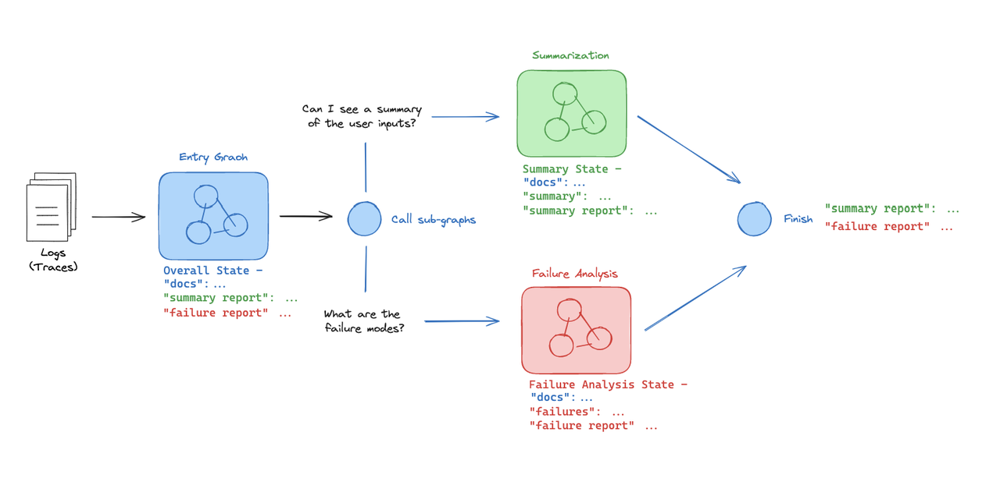
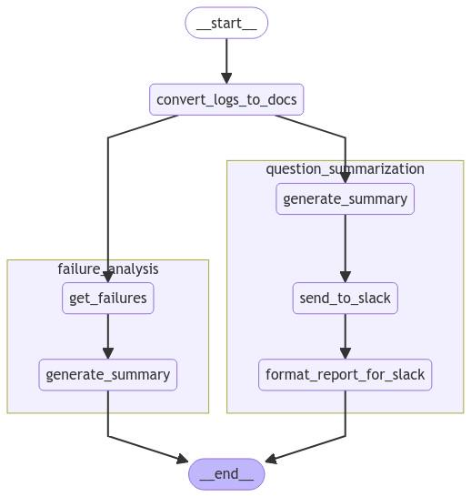

## **一个视频带你搞定langgraph子图可控性**

在复杂的多代理协作场景中，LangGraph 支持2子图之间的状态共享。主图可以通过状态对象与子图交互，确保各子图能够访问和更新全局状态。**这种机制使得多个智能体可以协同工作，同时保持状态的一致性。**

对于更复杂的系统，子图是一个有用的设计原则。子图允许您在图的不同部分创建和管理不同的状态。

```txt
pip install -U langgraph
```

示例：我有一个接受日志并执行两个独立子任务的系统。首先，它将对它们进行总结。其次，它将总结日志中捕获的任何故障模式。我想在两个不同的子图中执行这两个操作。

最重要的是要认识到图之间的信息传递。`入口图` 是父级，两个子图中的每一个都被定义为 `入口图` 中的节点。两个子图都继承了父级 `入口图` 的状态；我可以在每个子图中访问 `docs`，只需在子图状态中指定它（参见图）。每个子图都可以有自己的私有状态。任何我想传播回父级 `入口图` 的值（用于最终报告）只需在我的 `入口图` 状态中定义即可（例如，`summary report` 和 `failure report`）。



```python
#示例：sub_graph.py
from typing import List, TypedDict, Optional
from langgraph.graph import StateGraph, START, END

# 定义日志的结构
class Logs(TypedDict):
    id: str  # 日志的唯一标识符
    question: str  # 问题文本
    docs: Optional[List]  # 可选的相关文档列表
    answer: str  # 回答文本
    grade: Optional[int]  # 可选的评分
    grader: Optional[str]  # 可选的评分者
    feedback: Optional[str]  # 可选的反馈信息


# 定义故障分析状态的结构
class FailureAnalysisState(TypedDict):
    docs: List[Logs]  # 日志列表
    failures: List[Logs]  # 失败的日志列表
    fa_summary: str  # 故障分析总结


# 获取失败的日志
def get_failures(state):
    docs = state["docs"]  # 从状态中获取日志
    failures = [doc for doc in docs if "grade" in doc]  # 筛选出包含评分的日志
    return {"failures": failures}  # 返回包含失败日志的字典


# 生成故障分析总结
def generate_summary(state):
    failures = state["failures"]  # 从状态中获取失败的日志
    # 添加函数：fa_summary = summarize(failures)
    fa_summary = "Poor quality retrieval of Chroma documentation."  # 固定的总结内容
    return {"fa_summary": fa_summary}  # 返回包含总结的字典


# 创建故障分析的状态图
fa_builder = StateGraph(FailureAnalysisState)
fa_builder.add_node("get_failures", get_failures)  # 添加节点：获取失败的日志
fa_builder.add_node("generate_summary", generate_summary)  # 添加节点：生成总结
fa_builder.add_edge(START, "get_failures")  # 添加边：从开始到获取失败的日志
fa_builder.add_edge("get_failures", "generate_summary")  # 添加边：从获取失败的日志到生成总结
fa_builder.add_edge("generate_summary", END)  # 添加边：从生成总结到结束


# 定义问题总结状态的结构
class QuestionSummarizationState(TypedDict):
    docs: List[Logs]  # 日志列表
    qs_summary: str  # 问题总结
    report: str  # 报告


# 生成问题总结
def generate_summary(state):
    docs = state["docs"]  # 从状态中获取日志
    # 添加函数：summary = summarize(docs)
    summary = "Questions focused on usage of ChatOllama and Chroma vector store."  # 固定的总结内容
    return {"qs_summary": summary}  # 返回包含总结的字典


# 发送总结到Slack
def send_to_slack(state):
    qs_summary = state["qs_summary"]  # 从状态中获取问题总结
    # 添加函数：report = report_generation(qs_summary)
    report = "foo bar baz"  # 固定的报告内容
    return {"report": report}  # 返回包含报告的字典


# 格式化报告以便在Slack中发送
def format_report_for_slack(state):
    report = state["report"]  # 从状态中获取报告
    # 添加函数：formatted_report = report_format(report)
    formatted_report = "foo bar"  # 固定的格式化报告内容
    return {"report": formatted_report}  # 返回包含格式化报告的字典


# 创建问题总结的状态图
qs_builder = StateGraph(QuestionSummarizationState)
qs_builder.add_node("generate_summary", generate_summary)  # 添加节点：生成总结
qs_builder.add_node("send_to_slack", send_to_slack)  # 添加节点：发送到Slack
qs_builder.add_node("format_report_for_slack", format_report_for_slack)  # 添加节点：格式化报告
qs_builder.add_edge(START, "generate_summary")  # 添加边：从开始到生成总结
qs_builder.add_edge("generate_summary", "send_to_slack")  # 添加边：从生成总结到发送到Slack
qs_builder.add_edge("send_to_slack", "format_report_for_slack")  # 添加边：从发送到Slack到格式化报告
qs_builder.add_edge("format_report_for_slack", END)  # 添加边：从格式化报告到结束
```

请注意，每个子图都有自己的状态，`QuestionSummarizationState` 和 `FailureAnalysisState`。

定义完每个子图后，我们把所有东西都拼凑在一起。

```python
#示例：sub_graph_combine.py
from operator import add
from typing import TypedDict, Annotated, Optional, List, Dict, Any, get_type_hints
from langgraph.graph import StateGraph, START, END


# 定义日志的结构
class Logs(TypedDict):
    id: str  # 日志的唯一标识符
    question: str  # 问题文本
    docs: Optional[List]  # 可选的相关文档列表
    answer: str  # 回答文本
    grade: Optional[int]  # 可选的评分
    grader: Optional[str]  # 可选的评分者
    feedback: Optional[str]  # 可选的反馈信息


# 定义故障分析状态的结构
class FailureAnalysisState(TypedDict):
    docs: List[Logs]  # 日志列表
    failures: List[Logs]  # 失败的日志列表
    fa_summary: str  # 故障分析总结


# 获取失败的日志
def get_failures(state):
    docs = state["docs"]  # 从状态中获取日志
    failures = [doc for doc in docs if "grade" in doc]  # 筛选出包含评分的日志
    return {"failures": failures}  # 返回包含失败日志的字典


# 生成故障分析总结
def generate_summary(state):
    failures = state["failures"]  # 从状态中获取失败的日志
    # 添加函数：fa_summary = summarize(failures)
    fa_summary = "Poor quality retrieval of Chroma documentation."  # 固定的总结内容
    return {"fa_summary": fa_summary}  # 返回包含总结的字典


# 创建故障分析的状态图
fa_builder = StateGraph(FailureAnalysisState)
fa_builder.add_node("get_failures", get_failures)  # 添加节点：获取失败的日志
fa_builder.add_node("generate_summary", generate_summary)  # 添加节点：生成总结
fa_builder.add_edge(START, "get_failures")  # 添加边：从开始到获取失败的日志
fa_builder.add_edge("get_failures", "generate_summary")  # 添加边：从获取失败的日志到生成总结
fa_builder.add_edge("generate_summary", END)  # 添加边：从生成总结到结束


# 定义问题总结状态的结构
class QuestionSummarizationState(TypedDict):
    docs: List[Logs]  # 日志列表
    qs_summary: str  # 问题总结
    report: str  # 报告


# 生成问题总结
def generate_summary(state):
    failures = state["failures"]  # 从状态中获取失败的日志
    # 添加函数：fa_summary = summarize(failures)
    fa_summary = "Chroma文档检索质量差."  # 固定的总结内容
    return {"fa_summary": fa_summary}  # 返回包含总结的字典


# 发送总结到Slack
def send_to_slack(state):
    qs_summary = state["qs_summary"]  # 从状态中获取问题总结
    # 添加函数：report = report_generation(qs_summary)
    report = "foo bar baz"  # 固定的报告内容
    return {"report": report}  # 返回包含报告的字典


# 格式化报告以便在Slack中发送
def format_report_for_slack(state):
    report = state["report"]  # 从状态中获取报告
    # 添加函数：formatted_report = report_format(report)
    formatted_report = "foo bar"  # 固定的格式化报告内容
    return {"report": formatted_report}  # 返回包含格式化报告的字典


# 创建问题总结的状态图
qs_builder = StateGraph(QuestionSummarizationState)
qs_builder.add_node("generate_summary", generate_summary)  # 添加节点：生成总结
qs_builder.add_node("send_to_slack", send_to_slack)  # 添加节点：发送到Slack
qs_builder.add_node("format_report_for_slack", format_report_for_slack)  # 添加节点：格式化报告
qs_builder.add_edge(START, "generate_summary")  # 添加边：从开始到生成总结
qs_builder.add_edge("generate_summary", "send_to_slack")  # 添加边：从生成总结到发送到Slack
qs_builder.add_edge("send_to_slack", "format_report_for_slack")  # 添加边：从发送到Slack到格式化报告
qs_builder.add_edge("format_report_for_slack", END)  # 添加边：从格式化报告到结束

# Dummy logs
question_answer = Logs(
    id="1",
    question="如何导入ChatOpenAI？",
    answer="要导入ChatOpenAI, 使用: 'from langchain_openai import ChatOpenAI.'",
)

question_answer_feedback = Logs(
    id="2",
    question="如何使用Chroma向量存储?",
    answer="要使用Chroma，请定义: rag_chain = create_retrieval_chain(retriever, question_answer_chain).",
    grade=0,
    grader="文档相似性回顾",
    feedback="检索到的文档一般讨论了向量存储，但没有专门讨论Chroma",
)


# Entry Graph
class EntryGraphState(TypedDict):
    raw_logs: Annotated[List[Dict], add]
    docs: Annotated[List[Logs], add]  # This will be used in sub-graphs
    fa_summary: str  # This will be generated in the FA sub-graph
    report: str  # This will be generated in the QS sub-graph


def convert_logs_to_docs(state):
    # Get logs
    raw_logs = state["raw_logs"]
    docs = [question_answer, question_answer_feedback]
    return {"docs": docs}


entry_builder = StateGraph(EntryGraphState)
entry_builder.add_node("convert_logs_to_docs", convert_logs_to_docs)
entry_builder.add_node("question_summarization", qs_builder.compile())
entry_builder.add_node("failure_analysis", fa_builder.compile())

entry_builder.add_edge(START, "convert_logs_to_docs")
entry_builder.add_edge("convert_logs_to_docs", "failure_analysis")
entry_builder.add_edge("convert_logs_to_docs", "question_summarization")
entry_builder.add_edge("failure_analysis", END)
entry_builder.add_edge("question_summarization", END)

# 编译图
app = entry_builder.compile()
# 将生成的图片保存到文件
graph_png = app.get_graph(xray=1).draw_mermaid_png()
with open("sub_graph_combine.png", "wb") as f:
    f.write(graph_png)
```



```python
raw_logs = [{"foo": "bar"}, {"foo": "baz"}]
print(app.invoke({"raw_logs": raw_logs}, debug=False))
```

```python
{'raw_logs': [{'foo': 'bar'}, {'foo': 'baz'}], 'docs': [
    {'id': '1', 'question': '如何导入ChatOpenAI？', 'answer': "要导入ChatOpenAI, 使用: 'from langchain_openai import ChatOpenAI.'"}, 
    {'id': '2', 'question': '如何使用Chroma向量存储?', 'answer': '要使用Chroma，请定义: rag_chain = create_retrieval_chain(retriever, question_answer_chain).', 'grade': 0, 'grader': '文档相似性回顾', 'feedback': '检索到的文档一般讨论了向量存储，但没有专门讨论Chroma'}, 
    {'id': '1', 'question': '如何导入ChatOpenAI？', 'answer': "要导入ChatOpenAI, 使用: 'from langchain_openai import ChatOpenAI.'"}, 
    {'id': '2', 'question': '如何使用Chroma向量存储?', 'answer': '要使用Chroma，请定义: rag_chain = create_retrieval_chain(retriever, question_answer_chain).', 'grade': 0, 'grader': '文档相似性回顾', 'feedback': '检索到的文档一般讨论了向量存储，但没有专门讨论Chroma'}, 
    {'id': '1', 'question': '如何导入ChatOpenAI？', 'answer': "要导入ChatOpenAI, 使用: 'from langchain_openai import ChatOpenAI.'"}, 
    {'id': '2', 'question': '如何使用Chroma向量存储?', 'answer': '要使用Chroma，请定义: rag_chain = create_retrieval_chain(retriever, question_answer_chain).', 'grade': 0, 'grader': '文档相似性回顾', 'feedback': '检索到的文档一般讨论了向量存储，但没有专门讨论Chroma'}], 
 'fa_summary': 'Chroma文档检索质量差.', 
 'report': 'foo bar'}
```

