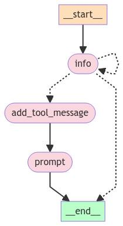

## **需求智能收集助手**

在这个例子中，我们将创建一个帮助用户生成提示的聊天机器人。它将首先从用户那里收集需求，然后生成提示（并根据用户输入进行细化）。这些被分成两个独立的状态，LLM 决定何时在它们之间转换。

下面的图表显示了该系统的图形表示。

## **收集信息**

首先，让我们定义图中用于收集用户需求的部分。这将是一个带有特定系统消息的 LLM 调用。它将访问一个工具，当它准备好生成提示时可以调用该工具。

```python
from typing import List

from langchain_core.messages import SystemMessage
from langchain_core.pydantic_v1 import BaseModel
from langchain_openai import ChatOpenAI
```

```python
# 定义一个模板字符串，用于指导用户提供创建提示模板所需的信息
template = """Your job is to get information from a user about what type of prompt template they want to create.

You should get the following information from them:

- What the objective of the prompt is
- What variables will be passed into the prompt template
- Any constraints for what the output should NOT do
- Any requirements that the output MUST adhere to
If you are not able to discern this info, ask them to clarify! Do not attempt to wildly guess.
After you are able to discern all the information, call the relevant tool."""


# 定义一个函数，用于将系统消息和用户消息组合成一个消息列表
def get_messages_info(messages):
    return [SystemMessage(content=template)] + messages


# 定义一个数据模型，用于存储提示模板的指令信息
class PromptInstructions(BaseModel):
    """Instructions on how to prompt the LLM."""
    objective: str
    variables: List[str]
    constraints: List[str]
    requirements: List[str]


# 初始化一个 ChatOpenAI 实例，温度设为 0
llm = ChatOpenAI(temperature=0)

# 将工具绑定到 LLM 实例上
llm_with_tool = llm.bind_tools([PromptInstructions])

# 将消息处理链定义为 get_messages_info 函数和绑定工具的 LLM 实例
chain = get_messages_info | llm_with_tool
```

## **生成提示**

现在，我们设置一个生成提示的状态。这将需要一个单独的系统消息，以及一个函数来过滤掉在工具调用之前的所有消息（因为那是上一个状态决定是时候生成提示的时候）。

```python
from langchain_core.messages import AIMessage, HumanMessage, ToolMessage

# 定义一个新的系统提示模板
prompt_system = """Based on the following requirements, write a good prompt template:

{reqs}"""


# 定义一个函数，用于获取生成提示模板所需的消息
# 只获取工具调用之后的消息
def get_prompt_messages(messages: list):
    tool_call = None
    other_msgs = []
    for m in messages:
        if isinstance(m, AIMessage) and m.tool_calls:
            tool_call = m.tool_calls[0]["args"]
        elif isinstance(m, ToolMessage):
            continue
        elif tool_call is not None:
            other_msgs.append(m)
    return [SystemMessage(content=prompt_system.format(reqs=tool_call))] + other_msgs


# 将消息处理链定义为 get_prompt_messages 函数和 LLM 实例
prompt_gen_chain = get_prompt_messages | llm
```

## **定义状态逻辑**

这是聊天机器人所处状态的逻辑。如果最后一条消息是工具调用，那么我们处于“提示创建者”（`prompt`）应该响应的状态。否则，如果最后一条消息不是 HumanMessage，那么我们知道人类应该接下来响应，因此我们处于 `END` 状态。如果最后一条消息是 HumanMessage，那么如果之前有工具调用，那么我们处于 `prompt` 状态。否则，我们处于“信息收集”（`info`）状态。

```python
from typing import Literal
from langgraph.graph import END


# 定义一个函数，用于获取当前状态
def get_state(messages) -> Literal["add_tool_message", "info", "__end__"]:
    if isinstance(messages[-1], AIMessage) and messages[-1].tool_calls:
        return "add_tool_message"
    elif not isinstance(messages[-1], HumanMessage):
        return END
    return "info"
```

## **创建图**

现在，我们可以创建该图。我们将使用 SqliteSaver 来持久化对话历史记录。

```python
from langgraph.checkpoint.memory import MemorySaver
from langgraph.graph import START, MessageGraph

# 初始化 MemorySaver 实例
memory = MemorySaver()

# 初始化 MessageGraph 实例
workflow = MessageGraph()

# 添加节点 "info" 和对应的处理链
workflow.add_node("info", chain)

# 添加节点 "prompt" 和对应的处理链
workflow.add_node("prompt", prompt_gen_chain)


# 定义一个函数，用于添加工具消息
@workflow.add_node
def add_tool_message(state: list):
    return ToolMessage(
        content="Prompt generated!", tool_call_id=state[-1].tool_calls[0]["id"]
    )


# 添加条件边，从 "info" 节点到其他节点
workflow.add_conditional_edges("info", get_state)

# 添加边，从 "add_tool_message" 节点到 "prompt" 节点
workflow.add_edge("add_tool_message", "prompt")

# 添加边，从 "prompt" 节点到 END
workflow.add_edge("prompt", END)

# 添加边，从 START 到 "info" 节点
workflow.add_edge(START, "info")

# 编译图，并使用 MemorySaver 作为检查点器
graph = workflow.compile(checkpointer=memory)
```

```python
# 将生成的图片保存到文件
graph_png = graph.get_graph().draw_mermaid_png()
with open("user_prompt_chatbot.png", "wb") as f:
    f.write(graph_png)
```




## **使用图**

现在，我们可以使用创建的聊天机器人。

```python
import uuid

# 配置参数，生成一个唯一的线程 ID
config = {"configurable": {"thread_id": str(uuid.uuid4())}}

# 无限循环，直到用户输入 "q" 或 "Q" 退出
while True:
    user = input("User (q/Q to quit): ")
    if user in {"q", "Q"}:
        print("AI: Byebye")
        break
    output = None
    # 处理用户输入的消息，并打印 AI 的响应
    for output in graph.stream(
        [HumanMessage(content=user)], config=config, stream_mode="updates"
    ):
        last_message = next(iter(output.values()))
        last_message.pretty_print()

    # 如果输出包含 "prompt"，打印 "Done!"
    if output and "prompt" in output:
        print("Done!")
```

```python
User (q/Q to quit): 收集客户满意度反馈
================================== Ai Message ==================================

请提供以下信息：

- 提示的目标是什么？
- 将传递到提示模板中的变量是什么？
- 输出不应该做什么限制？
- 输出必须遵守的任何要求？
    User (q/Q to quit): 目标：收集客户满意度反馈。
================================== Ai Message ==================================

请提供更多关于将传递到提示模板中的变量、输出不应该做什么限制以及输出必须遵守的任何要求的信息。
User (q/Q to quit): 变量：['客户名称'、'互动日期'、'提供的服务'、'评级（1-5 级）'、'评论']
约束：['输出不应包含客户的任何个人身份信息 (PII)。']
要求：['输出必须包含结构化格式，其中包含上述每个变量的字段。']
================================== Ai Message ==================================

谢谢！请问有关输出不应该做什么限制以及输出必须遵守的任何要求吗？
User (q/Q to quit): ================================== Ai Message ==================================

非常感谢您提供的信息！请问有任何输出必须遵守的要求吗？
User (q/Q to quit): ================================== Ai Message ==================================
Tool Calls:
  PromptInstructions (call_FHIKZnIhI9Meb93X94LtPxTQ)
 Call ID: call_FHIKZnIhI9Meb93X94LtPxTQ
  Args:
    objective: 收集客户满意度反馈
    variables: ['客户名称', '互动日期', '提供的服务', '评级（1-5 级）', '评论']
    constraints: ['输出不应包含客户的任何个人身份信息 (PII)']
    requirements: ['输出必须包含结构化格式，其中包含上述每个变量的字段。']
================================= Tool Message =================================

Prompt generated!
================================== Ai Message ==================================

Please provide your feedback on the service you received from us by filling out the following form:

- Customer Name: [客户名称]
- Interaction Date: [互动日期]
- Service Provided: [提供的服务]
- Rating (1-5): [评级（1-5 级）]
- Comments: [评论]

Please make sure not to include any personal identifiable information (PII) in your feedback. Your responses should be structured and include all the variables mentioned above. Thank you for your time and feedback!
Done!
User (q/Q to quit): - Customer Name: [客户名称]
- Interaction Date: [互动日期]
- Service Provided: [提供的服务]
- Rating (1-5): [评级（1-5 级）]
- Comments: [评论]
================================== Ai Message ==================================

请注意，输出不应包含客户的任何个人身份信息 (PII)。请提供反馈时使用通用的占位符或示例名称代替客户名称。感谢您的理解！
User (q/Q to quit): ================================== Ai Message ==================================

感谢您提供互动日期的信息！请继续填写其他反馈内容。
User (q/Q to quit): ================================== Ai Message ==================================

谢谢您提供服务信息！请继续填写评级和评论部分。
User (q/Q to quit): ================================== Ai Message ==================================

谢谢您提供评级信息！请继续填写最后一部分评论。
User (q/Q to quit): ================================== Ai Message ==================================

非常感谢您提供评论！您已成功填写客户满意度反馈表格。感谢您的宝贵意见！
User (q/Q to quit): 
```

