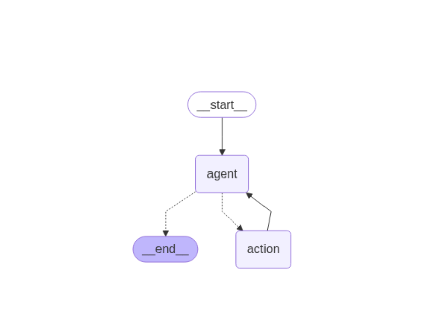

## **添加持久性内存**

LangGraph 具有一个内置的持久化层，通过[检查点](https://github.langchain.ac.cn/langgraph/reference/checkpoints/#basecheckpointsaver)实现。当您将检查点与图形一起使用时，您可以与该图形的状态进行交互。当您将检查点与图形一起使用时，您可以与图形的状态进行交互并管理它。检查点在每个超级步骤中保存图形状态的检查点，从而实现一些强大的功能

首先，检查点通过允许人类检查、中断和批准步骤来促进[人机交互工作流](https://github.langchain.ac.cn/langgraph/concepts/agentic_concepts/#human-in-the-loop)工作流。检查点对于这些工作流是必需的，因为人类必须能够在任何时候查看图形的状态，并且图形必须能够在人类对状态进行任何更新后恢复执行。

其次，它允许在交互之间进行[“记忆”](https://github.langchain.ac.cn/langgraph/concepts/agentic_concepts/#memory)。您可以使用检查点创建线程并在图形执行后保存线程的状态。在重复的人类交互（例如对话）的情况下，任何后续消息都可以发送到该检查点，该检查点将保留对其以前消息的记忆。


许多 AI 应用程序需要内存来跨多个交互共享上下文。在 LangGraph 中，通过 [检查点](https://github.com/langchain-ai/langgraph/tree/e4ca7ab69c599fd77dd4f0d47280849d715392cc/libs/checkpoint) 为任何 [StateGraph](https://github.langchain.ac.cn/langgraph/reference/graphs/#langgraph.graph.StateGraph) 提供内存。

在创建任何 LangGraph 工作流时，您可以通过以下方式设置它们以持久保存其状态

1. 一个 [检查点](https://github.langchain.ac.cn/langgraph/reference/checkpoints/#basecheckpointsaver)，例如 MemorySaver

2. 在编译图时调用 `compile(checkpointer=my_checkpointer)`。

示例

```python
#示例：persistence_case.py
from langgraph.graph import StateGraph
from langgraph.checkpoint.memory import MemorySaver

builder = StateGraph(....)
# ... define the graph
memory = MemorySaver()
graph = builder.compile(checkpointer=memory)
...
```

这适用于 [StateGraph](https://github.langchain.ac.cn/langgraph/reference/graphs/#langgraph.graph.StateGraph) 及其所有子类，例如 [MessageGraph](https://github.langchain.ac.cn/langgraph/reference/graphs/#messagegraph)。

以下是一个示例。

**注意**

在本操作指南中，我们将从头开始创建我们的代理，以保持透明度（但冗长）。您可以使用 `create_react_agent(model, tools=tool, checkpointer=checkpointer)` ([API 文档](https://github.langchain.ac.cn/langgraph/reference/prebuilt/#create_react_agent)) 构造函数完成类似的功能。如果您习惯使用 LangChain 的 [AgentExecutor](http://python.langchain.ac.cn/v0.2/docs/how_to/agent_executor/#concepts) 类，这可能更合适。


### **设置**

首先，我们需要安装所需的软件包

```txt
%pip install --quiet -U langgraph langchain_openai
```

接下来，我们需要设置 OpenAI（我们将使用的 LLM）和 Tavily（我们将使用的搜索工具）的 API 密钥

可选地，我们可以设置 [LangSmith 跟踪](https://smith.langchain.com/) 的 API 密钥，这将为我们提供一流的可观察性。


### **设置状态**

状态是所有节点的接口。

```python
# 导入所需的类型注解和模块
from typing import Annotated
from typing_extensions import TypedDict
from langgraph.graph.message import add_messages

# 定义一个状态类，包含一个消息列表，消息列表带有 add_messages 注解
class State(TypedDict):
    messages: Annotated[list, add_messages]
```


### **设置工具**

我们首先将定义要使用的工具。对于这个简单的示例，我们将创建一个占位符搜索引擎。但是，创建自己的工具非常容易 - 请参阅 [此处](http://python.langchain.ac.cn/v0.2/docs/how_to/custom_tools) 的文档了解如何操作。

```python
# 从 langchain_core.tools 导入工具装饰器
from langchain_core.tools import tool


# 定义一个名为 search 的工具函数，用于模拟网络搜索
@tool
def search(query: str):
    """Call to surf the web."""
    # 这是实际实现的占位符
    return ["The answer to your question lies within."]


# 将工具函数存入列表
tools = [search]
```

现在我们可以创建我们的 [ToolNode](https://github.langchain.ac.cn/langgraph/reference/prebuilt/?h=tool+node#toolnode)。此对象实际上**运行**LLM 要求使用的工具（即函数）。

```python
from langgraph.prebuilt import ToolNode

# 创建一个 ToolNode 实例，传入工具列表
tool_node = ToolNode(tools)
```


### **设置模型**

现在我们需要加载 [聊天模型](http://python.langchain.ac.cn/v0.2/docs/concepts/#chat-models) 来为我们的代理提供动力。对于以下设计，它必须满足两个条件

1. 它应该与**消息**一起使用（因为我们的状态包含聊天消息列表）

2. 它应该与 [工具调用](http://python.langchain.ac.cn/v0.2/docs/concepts/#functiontool-calling) 一起使用。

**注意**

这些模型要求不是使用 LangGraph 的一般要求 - 它们只是此特定示例的要求。

```python
# 从 langchain_openai 导入 ChatOpenAI 模型
from langchain_openai import ChatOpenAI

# 创建一个 ChatOpenAI 模型实例，设置 streaming=True 以便可以流式传输 tokens
model = ChatOpenAI(temperature=0, streaming=True)
```

完成此操作后，我们应该确保模型知道它可以使用这些工具。我们可以通过将 LangChain 工具转换为 OpenAI 函数调用格式，然后将其绑定到模型类来实现这一点。

```python
# 将工具绑定到模型上
bound_model = model.bind_tools(tools)
```


### **定义图**

现在我们需要在我们的图中定义几个不同的节点。在 `langgraph` 中，节点可以是函数或 [可运行的](http://python.langchain.ac.cn/v0.2/docs/concepts/#langchain-expression-language-lcel)。我们需要为此定义两个主要节点

1. 代理：负责决定要采取哪些（如果有）操作。

2. 一个用于调用工具的函数：如果代理决定采取操作，则此节点将执行该操作。

我们还需要定义一些边。其中一些边可能是条件的。它们是条件的原因是，基于节点的输出，可能会采用几种路径之一。在运行该节点之前，无法知道要采用哪条路径（LLM 决定）。

1. 条件边：在调用代理后，我们应该：a. 如果代理说要采取操作，则应调用调用工具的函数 b. 如果代理说它已完成，则应完成

2. 普通边：在调用工具后，它应该始终返回到代理以决定下一步要做什么

让我们定义节点，以及一个函数来决定如何采取哪些条件边。

```python
# 导入 Literal 类型
from typing import Literal


# 定义一个函数，根据状态决定是否继续执行
def should_continue(state: State) -> Literal["action", "__end__"]:
    """Return the next node to execute."""
    last_message = state["messages"][-1]
    # 如果没有函数调用，则结束
    if not last_message.tool_calls:
        return "__end__"
    # 否则继续执行
    return "action"


# 定义一个函数调用模型
def call_model(state: State):
    response = model.invoke(state["messages"])
    # 返回一个列表，因为这将被添加到现有列表中
    return {"messages": response}
```

现在我们可以将所有内容放在一起并定义图！

```python
# 从 langgraph.graph 导入 StateGraph 和 START
from langgraph.graph import StateGraph, START

# 定义一个新的图形工作流
workflow = StateGraph(State)

# 添加两个节点，分别是 agent 和 action
workflow.add_node("agent", call_model)
workflow.add_node("action", tool_node)

# 设置入口点为 agent
workflow.add_edge(START, "agent")

# 添加条件边，根据 should_continue 函数决定下一个节点
workflow.add_conditional_edges(
    "agent",
    should_continue,
)

# 添加从 action 到 agent 的普通边
workflow.add_edge("action", "agent")
```

**持久性**

要添加持久性，我们在编译图时传入一个检查点

```python
# 从 langgraph.checkpoint.memory 导入 MemorySaver
from langgraph.checkpoint.memory import MemorySaver

# 创建一个 MemorySaver 实例
memory = MemorySaver()
```

```python
# 编译工作流，生成一个 LangChain Runnable
app = workflow.compile(checkpointer=memory)
```

**注意**

如果您使用的是 LangGraph Cloud，则**无需**在编译图时传递检查点，因为它会自动完成。

```txt
# 将生成的图片保存到文件
graph_png = app.get_graph().draw_mermaid_png()
with open("persistence_case.png", "wb") as f:
    f.write(graph_png)
```




### **与代理交互**

现在我们可以与代理进行交互，并看到它会记住以前的消息！

```python
# 从 langchain_core.messages 导入 HumanMessage
from langchain_core.messages import HumanMessage

# 设置配置参数
config = {"configurable": {"thread_id": "2"}}

# 创建一个 HumanMessage 实例，内容为 "hi! I'm bob"
input_message = HumanMessage(content="hi! I'm bob")

# 在流模式下运行应用程序，传入消息和配置，逐个打印每个事件的最后一条消息
for event in app.stream({"messages": [input_message]}, config, stream_mode="values"):
    event["messages"][-1].pretty_print()
```

```python
================================ Human Message =================================

hi! I'm bob
================================== Ai Message ==================================

Hello Bob! How can I assist you today?
```

```python
# 创建一个 HumanMessage 实例，内容为 "what is my name?"
input_message = HumanMessage(content="what is my name?")

# 在流模式下运行应用程序，传入消息和配置，逐个打印每个事件的最后一条消息
for event in app.stream({"messages": [input_message]}, config, stream_mode="values"):
    event["messages"][-1].pretty_print()
```

```txt
================================ Human Message =================================

what is my name?
================================== Ai Message ==================================

Your name is Bob.
```

如果我们想开始新的对话，可以传入不同的线程 ID。瞧！所有的记忆都消失了！

```python
# 创建一个 HumanMessage 实例，内容为 "what is my name?"
input_message = HumanMessage(content="what is my name?")

# 在流模式下运行应用程序，传入消息和新的配置，逐个打印每个事件的最后一条消息
for event in app.stream(
    {"messages": [input_message]},
    {"configurable": {"thread_id": "3"}},
    stream_mode="values",
):
    event["messages"][-1].pretty_print()
```

```txt
================================ Human Message =================================

what is my name?
================================== Ai Message ==================================

I'm sorry, I do not know your name as I am an AI assistant and do not have access to personal information.
```

所有检查点都将持久保存到检查点，因此您可以随时恢复以前的线程。

```python
# 创建一个 HumanMessage 实例，内容为 "You forgot??"
input_message = HumanMessage(content="You forgot??")

# 在流模式下运行应用程序，传入消息和原来的配置，逐个打印每个事件的最后一条消息
for event in app.stream(
    {"messages": [input_message]},
    {"configurable": {"thread_id": "2"}},
    stream_mode="values",
):
    event["messages"][-1].pretty_print()
```

```python
================================ Human Message =================================

You forgot??
================================== Ai Message ==================================

I apologize for the confusion. I am an AI assistant and I do not have the ability to remember information from previous interactions. How can I assist you today, Bob?
```


## **如何管理对话历史**

持久性的最常见用例之一是使用它来跟踪对话历史。这很棒 - 它可以轻松地继续对话。但是，随着对话越来越长，对话历史会不断累积，并占用越来越多的上下文窗口。这通常是不可取的，因为它会导致对 LLM 的调用更加昂贵和耗时，并可能导致错误。为了防止这种情况发生，您可能需要管理对话历史记录。

注意：本指南重点介绍如何在 LangGraph 中执行此操作，您可以在其中完全自定义执行方式。如果您想要更开箱即用的解决方案，可以查看 LangChain 中提供的功能

* [如何过滤消息](http://python.langchain.ac.cn/v0.2/docs/how_to/filter_messages/)

* [如何修剪消息](http://python.langchain.ac.cn/v0.2/docs/how_to/trim_messages/)


### **设置**

首先，让我们设置要使用的包

```txt

%pip install --quiet -U langgraph langchain_openai
```

接下来，我们需要为 OpenAI（我们将使用的 LLM）设置 API 密钥

可选地，我们可以设置 API 密钥以 [LangSmith 跟踪](https://smith.langchain.com/)，这将为我们提供最佳的观察能力。


### **构建代理**

现在让我们构建一个简单的 ReAct 风格的代理。

```python
#示例：manage_history.py
from typing import Literal

# 从 langchain_openai 导入 ChatOpenAI 类，用于与 OpenAI 的 GPT-4 模型交互
from langchain_openai import ChatOpenAI
# 从 langchain_core.tools 导入 tool 装饰器，用于定义工具函数
from langchain_core.tools import tool

# 从 langgraph.checkpoint.memory 导入 MemorySaver 类，用于保存对话状态
from langgraph.checkpoint.memory import MemorySaver
# 从 langgraph.graph 导入 MessagesState, StateGraph, START 类，用于定义对话状态和工作流图
from langgraph.graph import MessagesState, StateGraph, START
# 从 langgraph.prebuilt 导入 ToolNode 类，用于创建工具节点
from langgraph.prebuilt import ToolNode

# 创建一个 MemorySaver 实例，用于保存对话状态
memory = MemorySaver()


# 使用 @tool 装饰器定义一个名为 search 的工具函数，用于模拟网络搜索
@tool
def search(query: str):
    """Call to surf the web."""
    # 这是实际实现的占位符，不要让 LLM 知道这一点 😊
    return [
        "It's sunny in San Francisco, but you better look out if you're a Gemini 😈."
    ]


# 定义工具列表，包含 search 工具
tools = [search]
# 创建一个 ToolNode 实例，传入工具列表
tool_node = ToolNode(tools)
# 创建一个 ChatOpenAI 实例，使用 GPT-4 模型
model = ChatOpenAI(model_name="gpt-4")
# 将工具绑定到模型上，创建一个绑定了工具的模型实例
bound_model = model.bind_tools(tools)


# 定义一个函数 should_continue，用于决定下一步是执行动作还是结束对话
def should_continue(state: MessagesState) -> Literal["action", "__end__"]:
    """Return the next node to execute."""
    # 获取最后一条消息
    last_message = state["messages"][-1]
    # 如果没有函数调用，则结束对话
    if not last_message.tool_calls:
        return "__end__"
    # 否则继续执行动作
    return "action"


# 定义一个函数 call_model，用于调用绑定了工具的模型
def call_model(state: MessagesState):
    # 调用模型并获取响应
    response = bound_model.invoke(state["messages"])
    # 返回一个包含响应消息的列表
    return {"messages": response}


# 创建一个新的状态图 workflow，传入 MessagesState 类
workflow = StateGraph(MessagesState)

# 添加名为 "agent" 的节点，并将 call_model 函数与之关联
workflow.add_node("agent", call_model)
# 添加名为 "action" 的节点，并将 tool_node 与之关联
workflow.add_node("action", tool_node)

# 设置入口节点为 "agent"，即第一个被调用的节点
workflow.add_edge(START, "agent")

# 添加条件边，从 "agent" 节点开始，使用 should_continue 函数决定下一步
workflow.add_conditional_edges(
    "agent",
    should_continue,
)

# 添加普通边，从 "action" 节点到 "agent" 节点，即在调用工具后调用模型
workflow.add_edge("action", "agent")

# 编译工作流，将其编译成 LangChain Runnable，可以像其他 runnable 一样使用
app = workflow.compile(checkpointer=memory)
```

```python
# 从 langchain_core.messages 导入 HumanMessage 类，用于创建人类消息
from langchain_core.messages import HumanMessage

# 定义配置字典，包含可配置项 "thread_id"
config = {"configurable": {"thread_id": "2"}}
# 创建一个人类消息实例，内容为 "hi! I'm bob"
input_message = HumanMessage(content="hi! I'm bob")
# 使用 app 的 stream 方法，传入消息和配置，以流模式处理消息
for event in app.stream({"messages": [input_message]}, config, stream_mode="values"):
    # 打印最后一条消息
    event["messages"][-1].pretty_print()

# 创建另一个人类消息实例，内容为 "what's my name?"
input_message = HumanMessage(content="what's my name?")
# 再次使用 app 的 stream 方法，传入消息和配置，以流模式处理消息
for event in app.stream({"messages": [input_message]}, config, stream_mode="values"):
    # 打印最后一条消息
    event["messages"][-1].pretty_print()
```

```python
================================ Human Message =================================

hi! I'm bob
================================== Ai Message ==================================

Hello Bob! How can I assist you today?
    ================================ Human Message =================================

    what's my name?
================================== Ai Message ==================================

Your name is Bob.
```


### **过滤消息**

为了防止对话历史爆炸，最直接的方法是在将消息传递给 LLM 之前过滤消息列表。这包括两个部分：定义一个函数来过滤消息，然后将其添加到图中。请参阅下面的示例，该示例定义了一个非常简单的 `filter_messages` 函数，然后使用它。

```python
#示例：manage_history_filter.py
# 导入必要的类型和模块
from typing import Literal

from langchain_openai import ChatOpenAI
from langchain_core.tools import tool
from langgraph.checkpoint.memory import MemorySaver
from langgraph.graph import MessagesState, StateGraph, START
from langgraph.prebuilt import ToolNode

# 初始化内存保存器
memory = MemorySaver()


# 定义一个工具函数，用于模拟网络搜索
@tool
def search(query: str):
    """Call to surf the web."""
    # 这是实际实现的占位符
    # 但不要让LLM知道 😊
    return [
        "It's sunny in San Francisco, but you better look out if you're a Gemini 😈."
    ]


# 定义工具列表
tools = [search]
# 创建工具节点
tool_node = ToolNode(tools)
# 初始化模型
model = ChatOpenAI(model_name="gpt-4")
# 绑定工具到模型
bound_model = model.bind_tools(tools)


# 定义函数，决定是否继续执行
def should_continue(state: MessagesState) -> Literal["action", "__end__"]:
    """Return the next node to execute."""
    # 获取最后一条消息
    last_message = state["messages"][-1]
    # 如果没有工具调用，则结束
    if not last_message.tool_calls:
        return "__end__"
    # 否则继续执行
    return "action"


# 定义消息过滤函数，只使用最后一条消息
def filter_messages(messages: list):
    return messages[-1:]


# 定义调用模型的函数
def call_model(state: MessagesState):
    messages = filter_messages(state["messages"])
    response = bound_model.invoke(messages)
    # 返回一个列表，因为这会被添加到现有列表中
    return {"messages": response}


# 定义一个新的状态图
workflow = StateGraph(MessagesState)

# 定义两个节点：agent 和 action
workflow.add_node("agent", call_model)
workflow.add_node("action", tool_node)

# 设置入口点为 `agent`
workflow.add_edge(START, "agent")

# 添加条件边，根据 should_continue 函数决定下一个节点
workflow.add_conditional_edges(
    "agent",
    should_continue,
)

# 添加普通边，从 `action` 到 `agent`
workflow.add_edge("action", "agent")

# 编译状态图，得到一个 LangChain Runnable
app = workflow.compile(checkpointer=memory)
```

```python
# 导入 HumanMessage 类
from langchain_core.messages import HumanMessage

# 配置参数
config = {"configurable": {"thread_id": "2"}}
# 创建输入消息
input_message = HumanMessage(content="hi! I'm bob")
# 通过流模式执行应用程序
for event in app.stream({"messages": [input_message]}, config, stream_mode="values"):
    event["messages"][-1].pretty_print()

# 现在不会记住之前的消息（因为我们在 filter_messages 中设置了 `messages[-1:]`）
input_message = HumanMessage(content="what's my name?")
for event in app.stream({"messages": [input_message]}, config, stream_mode="values"):
    event["messages"][-1].pretty_print()
```

```python
================================ Human Message =================================

hi! I'm bob
================================== Ai Message ==================================

Hello Bob! How can I assist you today?
    ================================ Human Message =================================

    what's my name?
================================== Ai Message ==================================

As an AI, I don't have access to personal data about individuals unless it has been shared with me in the course of our conversation. I am designed to respect user privacy and confidentiality.
```


