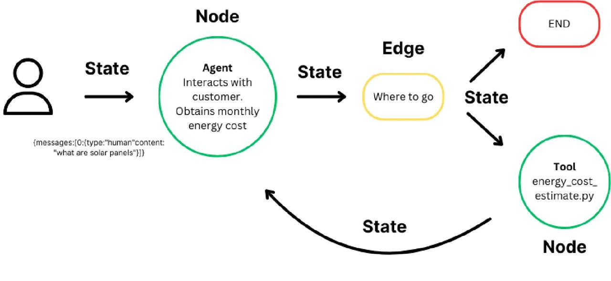

## **LangGraph**

[LangGraph](https://langchain-ai.github.io/langgraph/) 是一个用于构建有状态的多参与者应用程序的库，利用 LLM 创建代理和多代理工作流。与其他 LLM 框架相比，它提供了以下核心优势：循环性、可控性和持久性。LangGraph 允许您定义涉及循环的流程，这对于大多数代理架构至关重要，使其与基于 DAG 的解决方案区别开来。作为一个非常底层的框架，它提供了对应用程序流和状态的细粒度控制，这对于创建可靠的代理至关重要。此外，LangGraph 包含内置的持久性，支持先进的人机协作和记忆特性。

LangGraph 的灵感来源于 [Pregel](https://research.google/pubs/pub37252/) 和 [Apache Beam](https://beam.apache.org/)。公共接口受 [NetworkX](https://networkx.org/documentation/latest/) 的启发。LangGraph 是由 LangChain Inc 开发的，它是 LangChain 的创建者，但可以在不使用 LangChain 的情况下使用。

[LangGraph 平台](https://langchain-ai.github.io/langgraph/concepts/langgraph_platform) 是用于部署 LangGraph 代理的基础设施。它是一个商业解决方案，用于将代理应用程序部署到生产环境，构建于开源的 LangGraph 框架之上。LangGraph 平台由多个组件组成，这些组件协同工作以支持 LangGraph 应用程序的开发、部署、调试和监控：[LangGraph 服务器](https://langchain-ai.github.io/langgraph/concepts/langgraph_server)（API）、[LangGraph SDK](https://langchain-ai.github.io/langgraph/concepts/sdk)（API 客户端）、[LangGraph CLI](https://langchain-ai.github.io/langgraph/concepts/langgraph_cli)（构建服务器的命令行工具）、[LangGraph Studio](https://langchain-ai.github.io/langgraph/concepts/langgraph_studio)（用户界面/调试器）。


官方文档地址：<https://langchain-ai.github.io/langgraph/>

中文文档地址：<https://www.aidoczh.com/langgraph/>

### **主要特性**

* **循环和分支**：在您的应用程序中实现循环和条件。

* **持久性**：在图中的每一步自动保存状态。在任何时刻暂停和恢复图的执行，以支持错误恢复、人机协作工作流、时间旅行等。

* **人机协作**：中断图的执行以批准或编辑代理计划的下一个动作。

* **流式支持**：在每个节点产生输出时进行流式传输（包括令牌流式传输）。

* **与 LangChain 的集成**：LangGraph 与 [LangChain](https://github.com/langchain-ai/langchain/) 和 [LangSmith](https://docs.smith.langchain.com/) 无缝集成（但不需要它们）。

### **LangGraph 平台**

LangGraph 平台是一个商业解决方案，用于将代理应用程序部署到生产环境，构建于开源的 LangGraph 框架之上。 以下是一些在复杂部署中常见的问题，LangGraph 平台解决了这些问题：

* **流式支持**：LangGraph 服务器提供 [多种流式模式](https://langchain-ai.github.io/langgraph/concepts/streaming)，优化以满足各种应用需求

* **后台运行**：在后台异步运行代理

* **支持长时间运行的代理**：能够处理长时间运行过程的基础设施

* [**双重文本**](https://langchain-ai.github.io/langgraph/concepts/double_texting)：处理用户在代理回复之前收到两条消息的情况

* **处理突发性**：任务队列以确保请求在高负载下也能始终如一地处理，不会丢失




## **Graph(图)**

LangGraph 的核心是将代理工作流建模为图。你可以使用三个关键组件来定义代理的行为

1. [状态](https://github.langchain.ac.cn/langgraph/concepts/low_level/#state)：一个共享的数据结构，表示应用程序的当前快照。它可以是任何 Python 类型，但通常是 `TypedDict` 或 Pydantic `BaseModel`。

2. [节点](https://github.langchain.ac.cn/langgraph/concepts/low_level/#nodes)：编码代理逻辑的 Python 函数。它们接收当前 `状态` 作为输入，执行一些计算，并返回一个更新的 `状态`。

3. [边](https://github.langchain.ac.cn/langgraph/concepts/low_level/#edges)：Python 函数，根据当前 `状态` 确定要执行的下一个 `节点`。它们可以是条件分支或固定转换。

通过组合 `节点` 和 `边`，你可以创建复杂的循环工作流，随着时间的推移发展 `状态`。但是，真正的力量来自于 LangGraph 如何管理 `状态`。需要强调的是：`节点` 和 `边` 不过是 Python 函数——它们可以包含 LLM 或简单的 Python 代码。

简而言之：*节点完成工作。边指示下一步要做什么*。

LangGraph 的底层图算法使用 [消息传递](https://en.wikipedia.org/wiki/Message_passing) 来定义一个通用程序。当一个节点完成其操作时，它会沿着一条或多条边向其他节点发送消息。这些接收节点然后执行其函数，将结果消息传递给下一组节点，并且该过程继续进行。受到 Google 的 [Pregel](https://research.google/pubs/pregel-a-system-for-large-scale-graph-processing/) 系统的启发，该程序以离散的“超级步骤”进行。

超级步骤可以被认为是图节点上的单个迭代。并行运行的节点属于同一个超级步骤，而顺序运行的节点则属于不同的超级步骤。在图执行开始时，所有节点都处于 `inactive` 状态。当节点在任何传入边（或“通道”）上收到新消息（状态）时，它将变为 `active` 状态。然后，活动节点运行其函数并响应更新。在每个超级步骤结束时，没有传入消息的节点通过将其标记为 `inactive` 来投票 `halt`。当所有节点都处于 `inactive` 状态且没有消息在传输中时，图执行终止。

### **StateGraph**

`StateGraph` 类是使用的主要图类。它由用户定义的 `状态` 对象参数化。

```python
from langgraph.graph import StateGraph
from typing_extensions import TypedDict
class MyState(TypedDict)
    ...
graph = StateGraph(MyState)
```

基类：`图`

一个图，其节点通过读取和写入共享状态进行通信。每个节点的签名是 State -> Partial.

每个状态键可以选择性地使用一个 reducer 函数进行注释，该函数将用于聚合从多个节点接收到的该键的值。reducer 函数的签名是 (Value, Value) -> Value。

**参数**

* `state_schema` ([`类型`](http://docs.pythonlang.cn/3/library/typing.html#typing.Type)`[`[`任何`](http://docs.pythonlang.cn/3/library/typing.html#typing.Any)`]`, 默认值：`None` ) –

定义状态的模式类。

* `config_schema` ([`可选`](http://docs.pythonlang.cn/3/library/typing.html#typing.Optional)`[`[`类型`](http://docs.pythonlang.cn/3/library/typing.html#typing.Type)`[`[`任何`](http://docs.pythonlang.cn/3/library/typing.html#typing.Any)`]]`, 默认值：`None` ) –

定义配置的模式类。使用此方法在您的 API 中公开可配置参数。

**示例**

```python
#示例：state_graph.py
# 从langgraph.graph模块导入START和StateGraph
from langgraph.graph import START, StateGraph

# 定义一个节点函数my_node，接收状态和配置，返回新的状态
def my_node(state, config):
    return {"x": state["x"] + 1,"y": state["y"] + 2}

# 创建一个状态图构建器builder，使用字典类型作为状态类型
builder = StateGraph(dict)
# 向构建器中添加节点my_node，节点名称将自动设置为'my_node'
builder.add_node(my_node)  # node name will be 'my_node'
# 添加一条边，从START到'my_node'节点
builder.add_edge(START, "my_node")
# 编译状态图，生成可执行的图
graph = builder.compile()
# 调用编译后的图，传入初始状态{"x": 1}
print(graph.invoke({"x": 1,"y":2}))
```

**结果**

```python
{'x': 2, 'y': 4}
```

### **Compiling your graph(编译你的图)**

要构建你的图，你首先定义状态，然后添加节点和边，最后进行编译。编译图究竟是什么，为什么需要它？

编译是一个非常简单的步骤。它对图的结构进行一些基本检查（没有孤立的节点等等）。它也是你可以指定运行时参数的地方，例如 [检查点](https://github.langchain.ac.cn/langgraph/concepts/low_level/#checkpointer) 和 [断点](https://github.langchain.ac.cn/langgraph/concepts/low_level/#breakpoints)。你只需调用 `.compile` 方法即可编译你的图。

```python
#你必须在使用图之前编译它。
graph = graph_builder.compile(...)
```

**编译结果**

```python
nodes={'__start__': PregelNode(config={'tags': ['langsmith:hidden'], 'metadata': {}, 'configurable': {}}, channels=['__start__'], triggers=['__start__'], writers=[ChannelWrite<__root__>(recurse=True, writes=[ChannelWriteEntry(channel='__root__', value=<object object at 0x00000180616FE0C0>, skip_none=True, mapper=None)], require_at_least_one_of=['__root__']), ChannelWrite<start:my_node>(recurse=True, writes=[ChannelWriteEntry(channel='start:my_node', value='__start__', skip_none=False, mapper=None)], require_at_least_one_of=None)]), 'my_node': PregelNode(config={'tags': [], 'metadata': {}, 'configurable': {}}, channels=['__root__'], triggers=['start:my_node'], writers=[ChannelWrite<my_node,__root__>(recurse=True, writes=[ChannelWriteEntry(channel='my_node', value='my_node', skip_none=False, mapper=None), ChannelWriteEntry(channel='__root__', value=<object object at 0x00000180616FE0C0>, skip_none=True, mapper=None)], require_at_least_one_of=['__root__'])])} channels={'__root__': <langgraph.channels.last_value.LastValue object at 0x0000018061C48470>, '__start__': <langgraph.channels.ephemeral_value.EphemeralValue object at 0x0000018061C484A0>, 'my_node': <langgraph.channels.ephemeral_value.EphemeralValue object at 0x0000018065131BB0>, 'start:my_node': <langgraph.channels.ephemeral_value.EphemeralValue object at 0x0000018064DC0050>} auto_validate=False stream_mode='updates' output_channels='__root__' stream_channels='__root__' input_channels='__start__' builder=<langgraph.graph.state.StateGraph object at 0x0000018064DE0740>
```


## **State(状态)**

定义图时，你做的第一件事是定义图的 `状态`。`状态` 包含图的 [模式](https://github.langchain.ac.cn/langgraph/concepts/low_level/#schema) 以及 [归约器函数](https://github.langchain.ac.cn/langgraph/concepts/low_level/#reducers)，它们指定如何将更新应用于状态。`状态` 的模式将是图中所有 `节点` 和 `边` 的输入模式，可以是 `TypedDict` 或者 `Pydantic` 模型。所有 `节点` 将发出对 `状态` 的更新，这些更新然后使用指定的 `归约器` 函数进行应用。

### **Schema(模式)**

指定图模式的主要文档化方法是使用 `TypedDict`。但是，我们也支持 [使用 Pydantic BaseModel](https://github.langchain.ac.cn/langgraph/how-tos/state-model/) 作为你的图状态，以添加**默认值**和其他数据验证。

默认情况下，图将具有相同的输入和输出模式。如果你想更改这一点，你也可以直接指定显式输入和输出模式。当你有许多键，其中一些是显式用于输入，而另一些是用于输出时，这很有用。查看 [此笔记本](https://github.langchain.ac.cn/langgraph/how-tos/input_output_schema/)，了解如何使用。

默认情况下，图中的所有节点都将共享相同的状态。这意味着它们将读取和写入相同的状态通道。可以在图中创建节点写入私有状态通道，用于内部节点通信——查看 [此笔记本](https://github.langchain.ac.cn/langgraph/how-tos/pass_private_state/)，了解如何执行此操作。

### **Reducers(归约器)**

归约器是理解节点更新如何应用于 `状态` 的关键。`状态` 中的每个键都有其自己的独立归约器函数。如果未显式指定归约器函数，则假设对该键的所有更新都应该覆盖它。存在几种不同类型的归约器，从默认类型的归约器开始

#### **Default Reducer(默认归约器)**

这两个示例展示了如何使用默认归约器

```python
#示例：default_reducer.py
from typing import TypedDict, List, Dict, Any

class State(TypedDict):
    foo: int
    bar: List[str]

def update_state(current_state: State, updates: Dict[str, Any]) -> State:
    # 创建一个新的状态字典
    new_state = current_state.copy()
    # 更新状态字典中的值
    new_state.update(updates)
    return new_state

# 初始状态
state: State = {"foo": 1, "bar": ["hi"]}

# 第一个节点返回的更新
node1_update = {"foo": 2}
state = update_state(state, node1_update)
print(state)  # 输出: {'foo': 2, 'bar': ['hi']}

# 第二个节点返回的更新
node2_update = {"bar": ["bye"]}
state = update_state(state, node2_update)
print(state)  # 输出: {'foo': 2, 'bar': ['bye']}
```

在此示例中，没有为任何键指定归约器函数。假设图的输入是 `{"foo": 1, "bar": ["hi"]}`。然后，假设第一个 `节点` 返回 `{"foo": 2}`。这被视为对状态的更新。请注意，`节点` 不需要返回整个 `状态` 模式——只需更新即可。应用此更新后，`状态` 则变为 `{"foo": 2, "bar": ["hi"]}`。如果第二个节点返回 `{"bar": ["bye"]}`，则 `状态` 则变为 `{"foo": 2, "bar": ["bye"]}`

## **Nodes(节点)**

在 LangGraph 中，节点通常是 Python 函数（同步或`async`），其中第一个位置参数是[状态](https://github.langchain.ac.cn/langgraph/concepts/low_level/#state)，（可选地），第二个位置参数是“配置”，包含可选的[可配置参数](https://github.langchain.ac.cn/langgraph/concepts/low_level/#configuration)（例如`thread_id`）。

类似于`NetworkX`，您可以使用[add\_node](https://github.langchain.ac.cn/langgraph/reference/graphs/#langgraph.graph.StateGraph.add_node)方法将这些节点添加到图形中

```python
#示例：node_case.py
from langchain_core.runnables import RunnableConfig
from langgraph.graph import StateGraph, START
from langgraph.graph import END

# 初始化 StateGraph，状态类型为字典
graph = StateGraph(dict)

# 定义节点
def my_node(state: dict, config: RunnableConfig):
    print("In node: ", config["configurable"]["user_id"])
    return {"results": f"Hello, {state['input']}!"}

def my_other_node(state: dict):
    return state

# 将节点添加到图中
graph.add_node("my_node", my_node)
graph.add_node("other_node", my_other_node)

# 连接节点以确保它们是可达的
graph.add_edge(START, "my_node")
graph.add_edge("my_node", "other_node")

graph.add_edge("other_node", END)

# 编译图
print(graph.compile())
```

在幕后，函数被转换为[RunnableLambda](http://python-api.langchain.ac.cn/en/latest/runnables/langchain_core.runnables.base.RunnableLambda.html#langchain_core.runnables.base.RunnableLambda)，它为您的函数添加了批处理和异步支持，以及本地跟踪和调试。

如果您在没有指定名称的情况下将节点添加到图形中，它将被赋予一个默认名称，该名称等同于函数名称。

```python
graph.add_node(my_node)
# You can then create edges to/from this node by referencing it as `"my_node"`
```

### **`START`节点**

`START`节点是一个特殊节点，它代表将用户输入发送到图形的节点。引用此节点的主要目的是确定哪些节点应该首先被调用。

```python
from langgraph.graph import START

graph.add_edge(START, "my_node")
graph.add_edge("my_node", "other_node")
```

### **`END`节点**

`END`节点是一个特殊节点，它代表一个终端节点。当您想要指定哪些边在完成操作后没有动作时，会引用此节点。

```python
from langgraph.graph import END

graph.add_edge("other_node", END)
```

## **Edges(边)**

边定义了逻辑如何路由以及图形如何决定停止。这是您的代理如何工作以及不同节点如何相互通信的重要部分。有一些关键类型的边

* 普通边：直接从一个节点到下一个节点。

* 条件边：调用一个函数来确定下一个要转到的节点。

* 入口点：用户输入到达时首先调用的节点。

* 条件入口点：调用一个函数来确定用户输入到达时首先调用的节点。

一个节点可以有多个输出边。如果一个节点有多个输出边，则所有这些目标节点将在下一个超级步骤中并行执行。

### **普通边**

如果您总是想从节点 A 到节点 B，您可以直接使用[add\_edge](https://github.langchain.ac.cn/langgraph/reference/graphs/#langgraph.graph.StateGraph.add_edge)方法。

```python
#示例：edges_case.py
graph.add_edge("node_a", "node_b")
```

### **条件边**

如果您想选择性地路由到一个或多个边（或选择性地终止），您可以使用[add\_conditional\_edges](https://github.langchain.ac.cn/langgraph/reference/graphs/#langgraph.graph.StateGraph.add_conditional_edges)方法。此方法接受节点的名称和一个“路由函数”，该函数将在该节点执行后被调用

```python
graph.add_conditional_edges("node_a", routing_function)
```

类似于节点，`routing_function`接受图形的当前`state`并返回一个值。

默认情况下，返回值`routing_function`用作要将状态发送到下一个节点的节点名称（或节点列表）。所有这些节点将在下一个超级步骤中并行运行。

您可以选择提供一个字典，该字典将`routing_function`的输出映射到下一个节点的名称。

```python
graph.add_conditional_edges("node_a", routing_function, {True: "node_b", False: "node_c"})
```

### **入口点**

入口点是图形启动时运行的第一个节点。您可以从虚拟的[START](https://github.langchain.ac.cn/langgraph/reference/graphs/#start)节点使用[add\_edge](https://github.langchain.ac.cn/langgraph/reference/graphs/#langgraph.graph.StateGraph.add_edge)方法到要执行的第一个节点，以指定进入图形的位置。

```python
from langgraph.graph import START

graph.add_edge(START, "my_node")
```

### **条件入口点**

条件入口点允许您根据自定义逻辑从不同的节点开始。您可以从虚拟的[START](https://github.langchain.ac.cn/langgraph/reference/graphs/#start)节点使用[add\_conditional\_edges](https://github.langchain.ac.cn/langgraph/reference/graphs/#langgraph.graph.StateGraph.add_conditional_edges)来实现这一点。

```python
from langgraph.graph import START

graph.add_conditional_edges(START, routing_function)
```

您可以选择提供一个字典，该字典将`routing_function`的输出映射到下一个节点的名称。

```python
graph.add_conditional_edges(START, routing_my,{True: "my_node", False: "other_node"})
```


