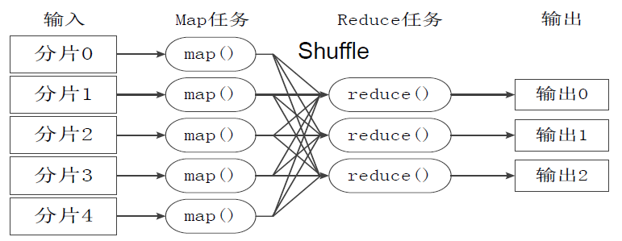

## **检查点**

检查点是每个超级步骤保存的图状态的快照，并由`StateSnapshot`对象表示，具有以下关键属性：

* `config`：与此检查点相关的配置。

* `metadata`：与此检查点相关的元数据。

* `values`：此时状态通道的值。

* `next`：将要在图中执行的下一个节点名称的元组。

* `tasks`：包含有关要执行的下一个任务信息的`PregelTask`对象的元组。如果该步骤之前尝试过，它将包含错误信息。如果图在节点内部被[动态中断](https://www.aidoczh.com/langgraph/how-tos/human_in_the_loop/dynamic_breakpoints/)，任务将包含与中断相关的其他数据。

官方文档地址：<https://langchain-ai.github.io/langgraph/concepts/persistence/#checkpoints>

中文文档地址：<https://www.aidoczh.com/langgraph/concepts/persistence/#_3>

LangGraph 具有一个内置的持久化层，通过[检查点](https://github.langchain.ac.cn/langgraph/reference/checkpoints/#basecheckpointsaver)实现。当您将检查点与图形一起使用时，您可以与该图形的状态进行交互。当您将检查点与图形一起使用时，您可以与图形的状态进行交互并管理它。检查点在每个超级步骤中保存图形状态的检查点，从而实现一些强大的功能

首先，检查点通过允许人类检查、中断和批准步骤来促进[人机交互工作流](https://github.langchain.ac.cn/langgraph/concepts/agentic_concepts/#human-in-the-loop)工作流。检查点对于这些工作流是必需的，因为人类必须能够在任何时候查看图形的状态，并且图形必须能够在人类对状态进行任何更新后恢复执行。

其次，它允许在交互之间进行[“记忆”](https://github.langchain.ac.cn/langgraph/concepts/agentic_concepts/#memory)。您可以使用检查点创建线程并在图形执行后保存线程的状态。在重复的人类交互（例如对话）的情况下，任何后续消息都可以发送到该检查点，该检查点将保留对其以前消息的记忆。

许多 AI 应用程序需要内存来跨多个交互共享上下文。在 LangGraph 中，通过 [检查点](https://github.com/langchain-ai/langgraph/tree/e4ca7ab69c599fd77dd4f0d47280849d715392cc/libs/checkpoint) 为任何 [StateGraph](https://github.langchain.ac.cn/langgraph/reference/graphs/#langgraph.graph.StateGraph) 提供内存。

在创建任何 LangGraph 工作流时，您可以通过以下方式设置它们以持久保存其状态

1. 一个 [检查点](https://github.langchain.ac.cn/langgraph/reference/checkpoints/#basecheckpointsaver)，例如 [AsyncSqliteSaver](https://github.langchain.ac.cn/langgraph/reference/checkpoints/#asyncsqlitesaver)

2. 在编译图时调用 `compile(checkpointer=my_checkpointer)`。

示例

```python
# 导入 asyncio 模块，用于处理异步编程
import asyncio

# 从 langgraph.checkpoint.sqlite.aio 模块中导入 AsyncSqliteSaver 类，它用于异步保存检查点到 SQLite 数据库
# pip install langgraph.checkpoint.sqlite
from langgraph.checkpoint.sqlite.aio import AsyncSqliteSaver

# 从 langgraph.graph 模块中导入 StateGraph 类，它用于构建状态图
from langgraph.graph import StateGraph


async def main():
    # 创建一个 StateGraph 对象，节点的值类型为 int
    builder = StateGraph(int)

    # 添加一个名为 "add_one" 的节点，该节点的功能是将输入值加 1
    builder.add_node("add_one", lambda x: x + 1)

    # 设置 "add_one" 节点为状态图的入口点
    builder.set_entry_point("add_one")

    # 设置 "add_one" 节点为状态图的结束点
    builder.set_finish_point("add_one")

    # 使用异步上下文管理器创建一个 AsyncSqliteSaver 对象，并连接到名为 "checkpoints.db" 的 SQLite 数据库
    async with AsyncSqliteSaver.from_conn_string("checkpoints.db") as memory:
        # 编译状态图，并使用 memory 作为检查点保存器
        graph = builder.compile(checkpointer=memory)

        # 创建一个异步调用状态图的协程，输入值为 1，并传入额外的配置参数
        result = await graph.ainvoke(1, {"configurable": {"thread_id": "thread-1"}})

        # 打印结果
        print(result)


# 使用 asyncio.run 运行 main() 协程
asyncio.run(main())
```

这适用于 [StateGraph](https://github.langchain.ac.cn/langgraph/reference/graphs/#langgraph.graph.StateGraph) 及其所有子类，例如 [MessageGraph](https://github.langchain.ac.cn/langgraph/reference/graphs/#messagegraph)。

## **send机制**

默认情况下，`Nodes`和`Edges`是在提前定义的，并对同一个共享状态进行操作。但是，在某些情况下，确切的边可能无法提前知道，或者您可能希望同时存在`State`的不同版本。一个常见的例子是`map-reduce`设计模式。在这种设计模式中，第一个节点可能会生成一个对象列表，并且您可能希望对所有这些对象应用另一个节点。对象的数量可能事先未知（这意味着边的数量可能未知），并且输入`State`到下游`Node`应该是不同的（每个生成的对象对应一个）。

为了支持这种设计模式，LangGraph 支持从条件边返回[Send](https://github.langchain.ac.cn/langgraph/reference/graphs/#send)对象。`Send`接受两个参数：第一个是节点的名称，第二个是要传递到该节点的状态。

官方文档地址：<https://langchain-ai.github.io/langgraph/concepts/low_level/#send>

中文文档地址：<https://www.aidoczh.com/langgraph/concepts/low_level/#send>

以下是：map-reduce 工作流程图



```python
# 导入operator模块，用于后续操作
import operator
from typing import Annotated
from typing import TypedDict
from langgraph.graph import StateGraph
from langgraph.constants import Send
from langgraph.graph import END, START


# 定义一个名为OverallState的TypedDict类
class OverallState(TypedDict):
    # subjects是一个字符串列表
    subjects: list[str]
    # jokes是一个带有operator.add注解的字符串列表
    jokes: Annotated[list[str], operator.add]


# 定义一个函数continue_to_jokes，接受一个OverallState类型的参数state
def continue_to_jokes(state: OverallState):
    # 返回一个Send对象的列表，每个对象包含一个"generate_joke"的命令和对应主题的字典
    return [Send("generate_joke", {"subject": s}) for s in state['subjects']]

# 创建一个StateGraph对象builder，传入OverallState类型
builder = StateGraph(OverallState)
# 添加一个名为"generate_joke"的节点，节点执行一个lambda函数，生成一个关于主题的笑话
builder.add_node("generate_joke", lambda state: {"jokes": [f"Joke about {state['subject']}"]})
# 添加一个条件边，从START节点到continue_to_jokes函数返回的节点
builder.add_conditional_edges(START, continue_to_jokes)
# 添加一条边，从"generate_joke"节点到END节点
builder.add_edge("generate_joke", END)
# 编译graph，生成最终的graph对象
graph = builder.compile()

# 调用graph对象，并传入包含两个主题的初始状态，结果是为每个主题生成一个笑话
result = graph.invoke({"subjects": ["cats", "dogs"]})
print(result)

# 将生成的图片保存到文件
graph_png = graph.get_graph().draw_mermaid_png()
with open("send_case.png", "wb") as f:
    f.write(graph_png)
```

