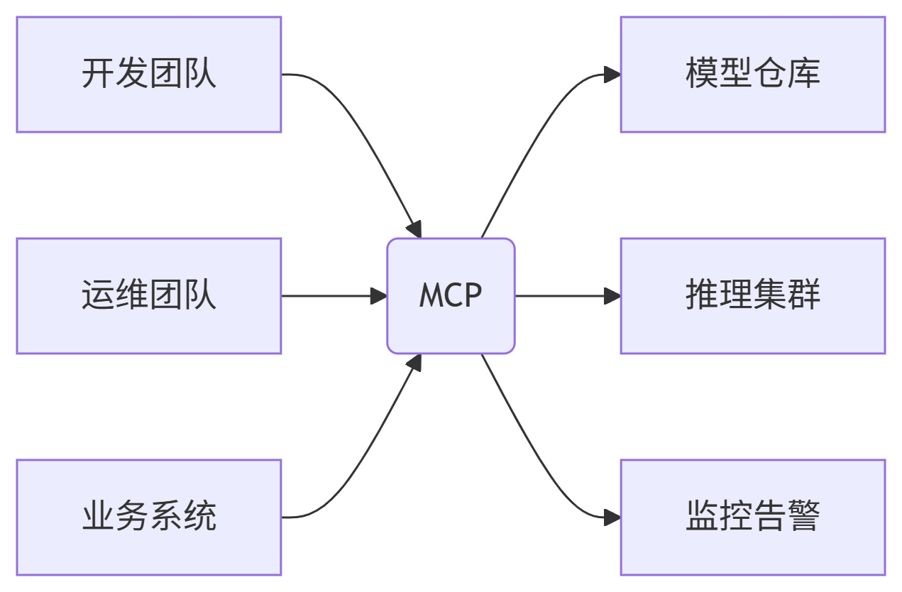
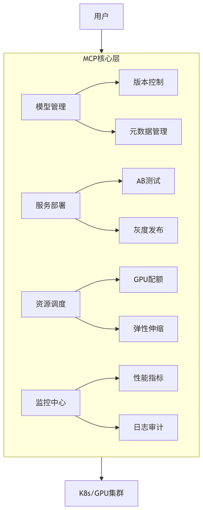
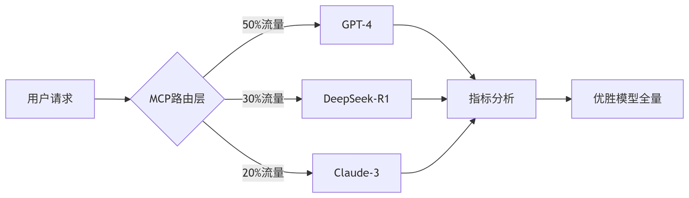

## —— 企业级大模型的「指挥控制中心」

***

## 一、什么是 MCP？

**MCP（Multi-Code Platform，多代码平台）&#x20;**&#x662F;一个面向开发者和企业的**统一编程协作平台**，旨在提升开发效率、简化项目管理、实现代码共享与团队协同。它集成了代码托管、版本控制、CI/CD 流水线、自动化测试、文档管理等功能，支持多种编程语言和开发框架。

MCP 可广泛应用于**软件开发、DevOps、AI 工程化、数据科学、微服务架构、前端开发等多个领域**，适用于个人开发者、初创企业以及大型组织。

&#x20;

### ✅ 核心价值：

* **集中管控**：统一管理多个模型（GPT/DeepSeek/Claude等） &#x20;

* **一键部署**：分钟级发布模型服务到生产环境 &#x20;

* **智能调度**：动态分配GPU资源，降低成本30%+ &#x20;

* **安全合规**：敏感词过滤、访问审计、权限隔离 &#x20;

***

## 二、为什么需要 MCP？

传统模型部署痛点 vs MCP解决方案： &#x20;

| 痛点         | MCP 方案      | 收益             |
| ---------- | ----------- | -------------- |
| 手动部署效率低    | 可视化流水线一键发布  | 部署速度 ⬆️ 500%   |
| 多模型管理混乱    | 统一模型仓库+版本控制 | 运维复杂度 ⬇️ 70%   |
| GPU资源利用率不足 | 动态调度+弹性伸缩   | 成本 ⬇️ 30%\~50% |
| 缺乏监控告警     | 实时性能追踪+自动熔断 | 系统稳定性 ⬆️ 99.9% |

***

## 三、MCP 核心功能架构

***

## 四、快速上手 5 步曲

### 步骤1：注册账号 / 登录平台

1. 打开 MCP 官网：`https://mcp.example.com`（根据实际地址填写）

2. 点击【注册】按钮，填写邮箱、手机号、设置密码

3. 完成邮箱验证后登录

> ⚠️ 如果是企业私有化部署，请联系管理员获取账号或邀请链接。

***

### 步骤2：上传模型

支持格式：HuggingFace / ONNX / TensorRT &#x20;

***

### 步骤3：部署服务

在控制台配置： &#x20;

1. 选择模型：`deepseek-r1@1.2` &#x20;

2. 资源规格：`2* A100 GPU` &#x20;

3) 副本数：`3`（高可用） &#x20;

4) 访问策略：`仅内网` &#x20;

***

### 步骤4：监控服务

关键监控面板： &#x20;

* 📊 \*\*实时QPS\*\*：当前请求量/承载上限 &#x20;

* ⏱️ \*\*平均延迟\*\*：P50/P90/P99 响应时间 &#x20;

* 🔥 \*\*GPU利用率\*\*：显存/算力使用热力图 &#x20;

* 🚨 \*\*异常检测\*\*：自动触发告警（微信/邮件）

***

### 步骤5：接入应用

通过 API Gateway 调用： &#x20;

***

## 五、典型应用场景

### 场景1：多模型AB测试

### 场景2：紧急回滚

1. 检测到新版本错误率飙升 &#x20;

2. 一键切换至稳定版本 &#x20;

3) 流量切换耗时 < 3秒 &#x20;

### 场景3：成本优化

* 日间流量高峰：自动扩容至10副本 &#x20;

* 夜间空闲时段：缩容至2副本 &#x20;

***

## 六、安全合规实践

| 功能        | 实现方式                 | 合规标准      |
| --------- | -------------------- | --------- |
| **敏感词过滤** | 实时内容扫描+正则规则引擎        | 等保2.0     |
| **权限隔离**  | RBAC四级权限控制           | GDPR/CCPA |
| **操作审计**  | 全链路操作日志+行为分析         | ISO27001  |
| **数据加密**  | TLS1.3+静态数据AES-256加密 | 金融行业规范    |

***

## 七、主流 MCP 解决方案对比

| 产品                 | 公司       | 开源 | 云服务 | 特点            |
| ------------------ | -------- | -- | --- | ------------- |
| **KServe**         | Kubeflow | ✅  | ❌   | K8s原生模型服务框架   |
| **Triton**         | NVIDIA   | ✅  | ✅   | 多框架推理优化       |
| **BentoML**        | BentoML  | ✅  | ❌   | 开发友好型MLOps工具链 |
| **DeepSeek-Cloud** | 深度求索     | ❌  | ✅   | 国产化适配+中文优化    |

***

## 八、FAQ 高频问题

### ❓ MCP 支持哪些模型框架？

> ✅ 支持：HuggingFace Transformers / PyTorch / TensorFlow / ONNX / TensorRT &#x20;

### ❓ 如何实现零宕机升级？

> 采用 **蓝绿部署** 策略： &#x20;
>
> 1. 部署新版本集群 &#x20;
>
> 2. 测试验证通过 &#x20;
>
> 3) 流量切换（<1秒中断） &#x20;

### ❓ 是否支持私有化部署？

> ✅ 提供三种部署模式： &#x20;
>
> * SaaS云服务 &#x20;
>
> * 混合云部署 &#x20;
>
> * 本地化集群（支持离线运行） &#x20;

***

## 九、学习资源推荐

* 📚 官方文档：[MCP 用户手册](https://docs.mcp-platform.com) &#x20;

* 🎥 视频教程：[5分钟部署第一个模型](https://youtube.com/mcp-quickstart) &#x20;

* 💻 实验沙箱：[免费体验环境](https://play.mcp-platform.com) &#x20;

* 🔧 开源方案：[KServe GitHub](https://github.com/kserve/kserve) &#x20;

***

> 💡 \*\*总结\*\*： &#x20;
>
> **MCP 是企业构建大模型能力的“操作系统”，通过标准化、自动化、智能化的模型管理，实现从实验到生产的无缝衔接，释放AI真实价值。**

***

