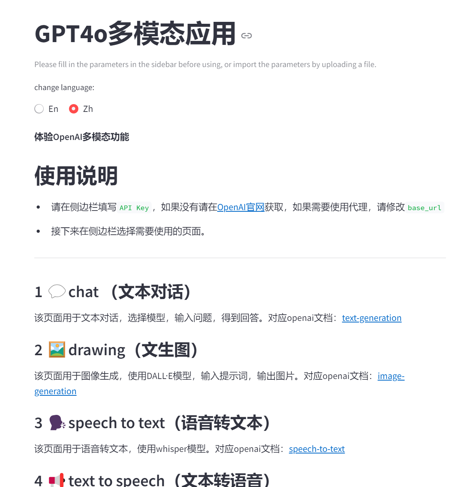
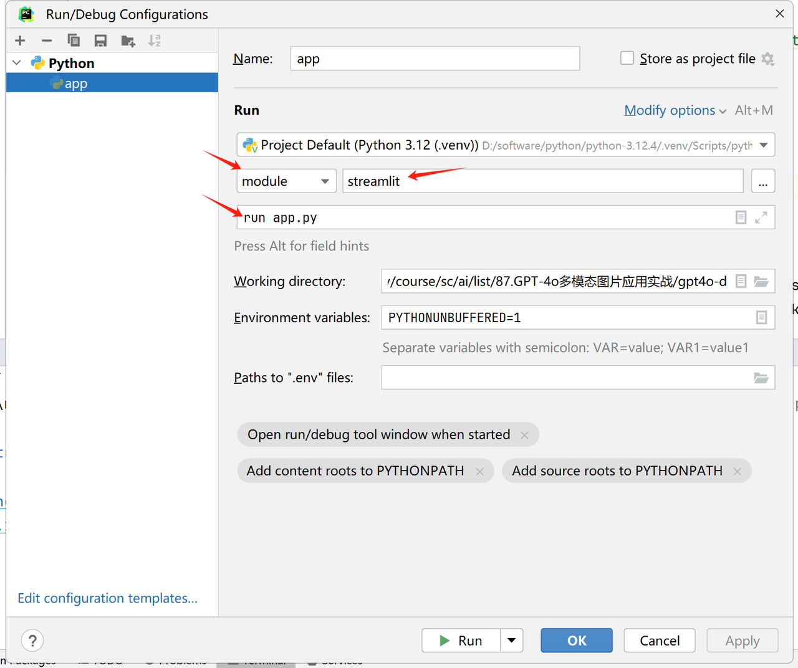
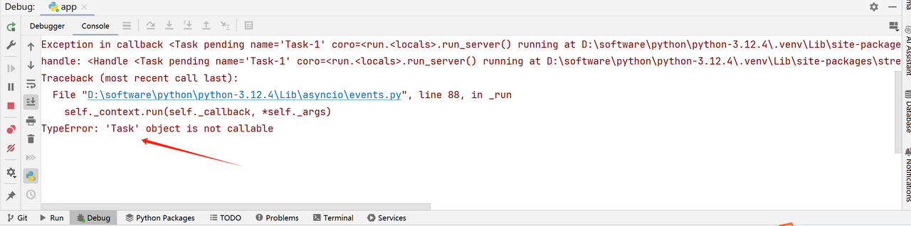
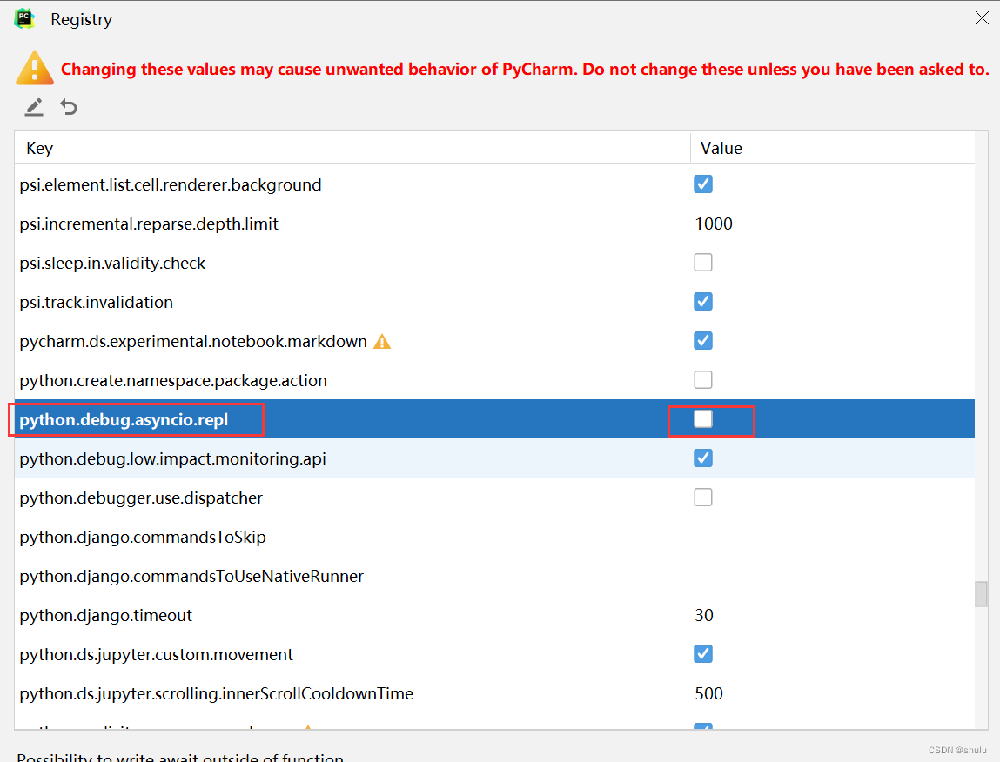

## **演示效果**



## **Streamlit开发文档**

官方文档：<https://docs.streamlit.io/>

中文文档：<https://blog.csdn.net/weixin_44458771/article/details/135495928>

## **Streamlit命令行启动**

```powershell
pip install streamlit
streamlit run app.py --server.port 8501
```

## **配置Pycharm调试Streamlit应用**

开发环境

PyCharm Community Edition 2024

Win10/11

Streamlit 1.39.0

### **创建应用**

app.py

```python
import streamlit as st

st.header("hello")
st.write("this is a streamlit demo")
```

### **调试应用**

启动参数

**module**：streamlit

**Script parameters**：run app.py



再次启动 debug 按钮，报错如下



解决如下:

Help | Find Action | Registry | python.debug.asyncio.repl 去掉勾。




