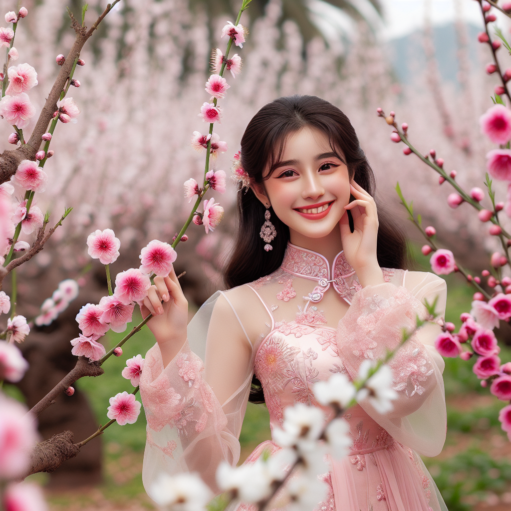
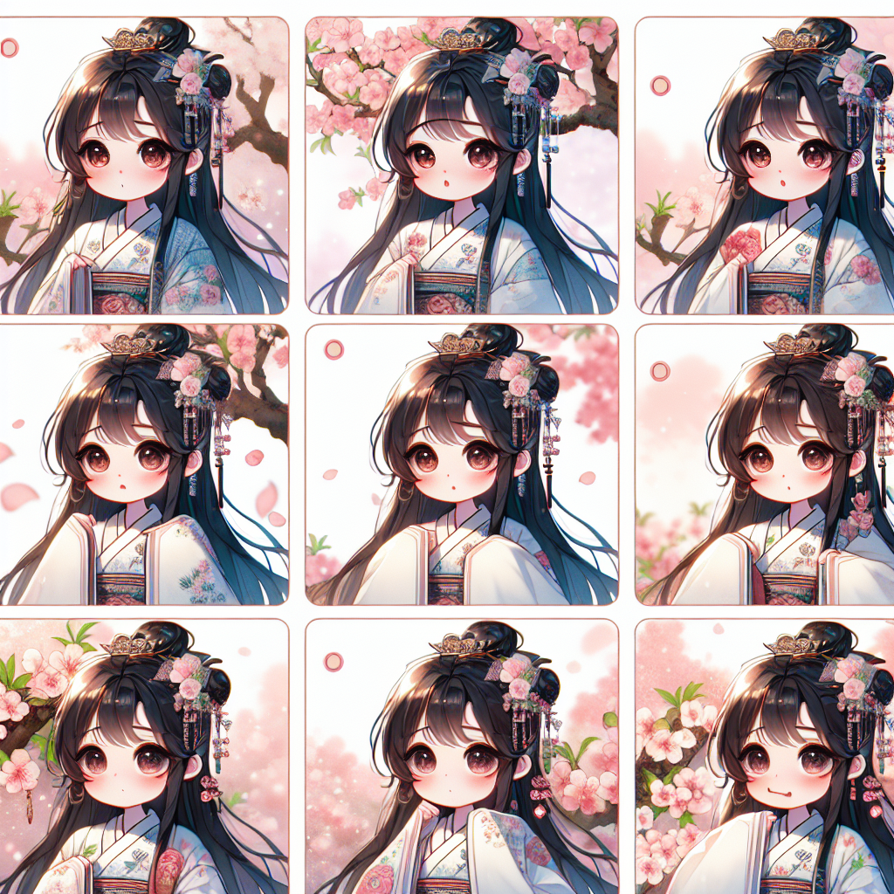
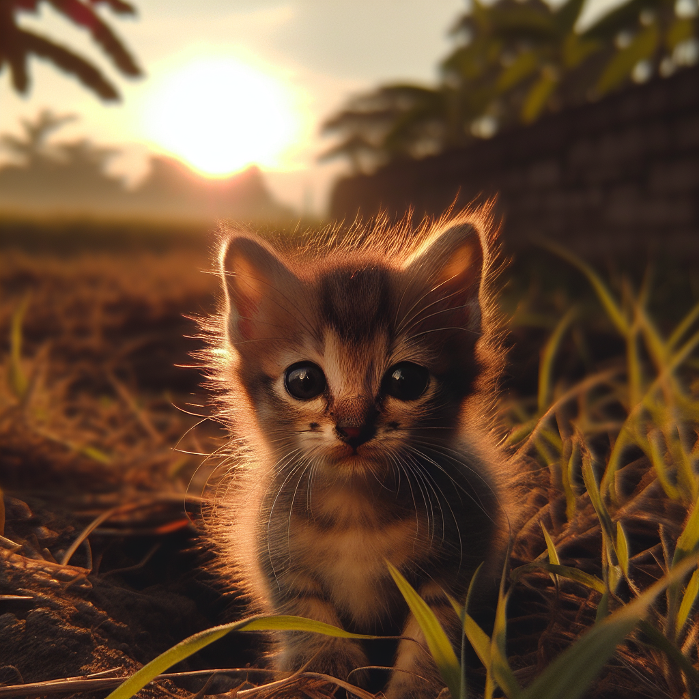
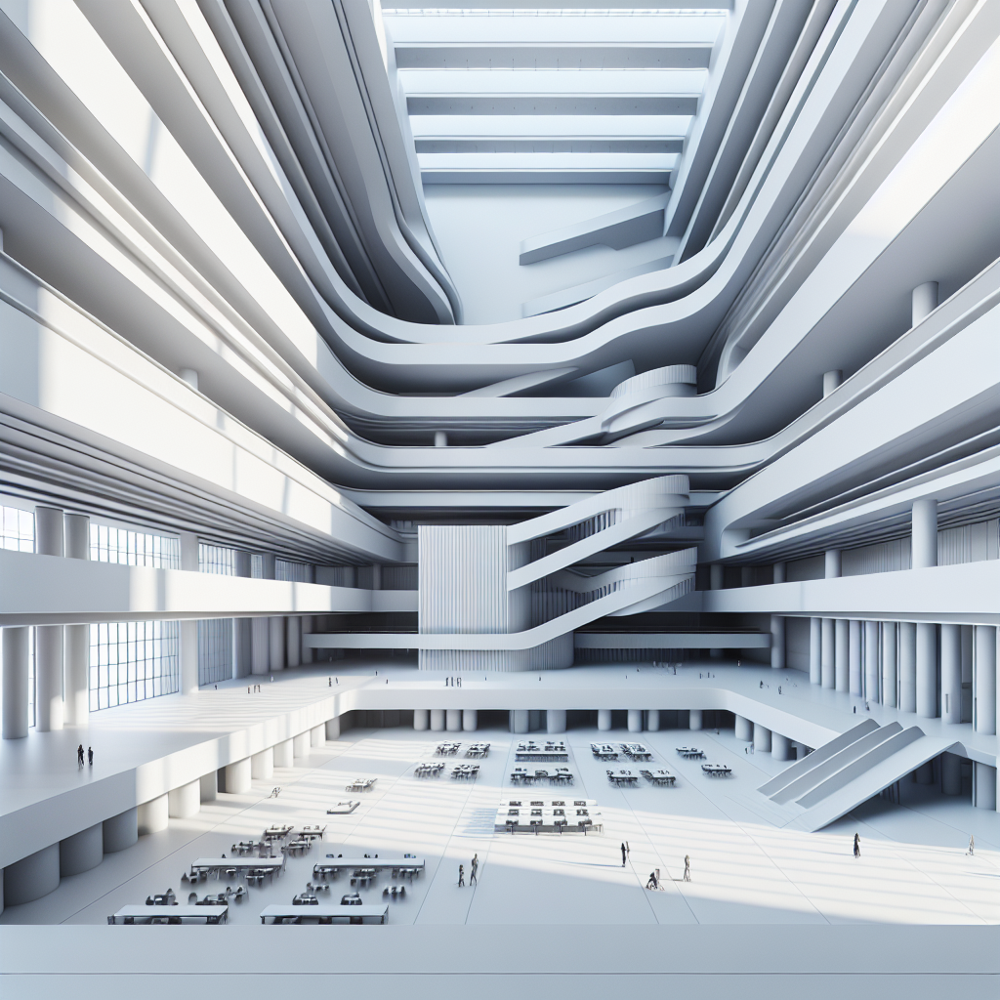
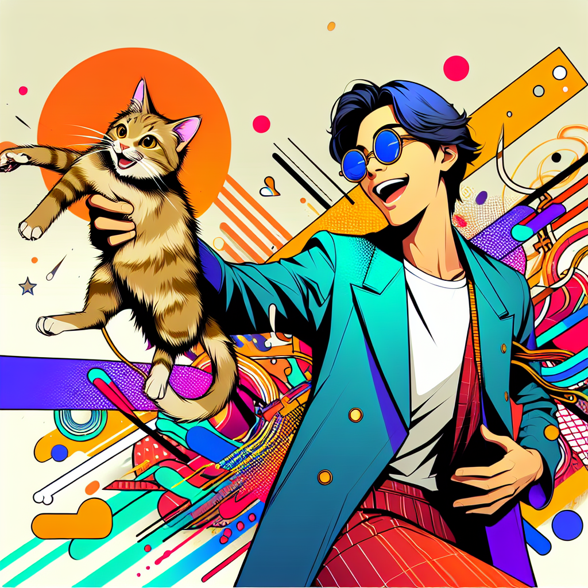
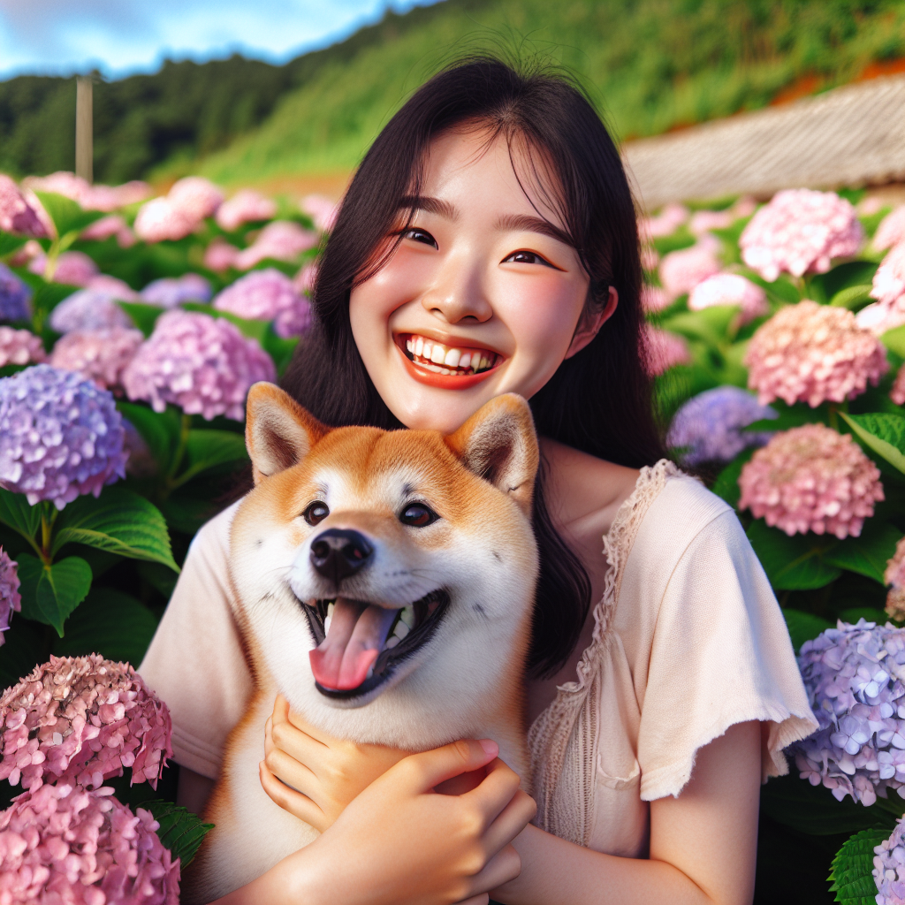
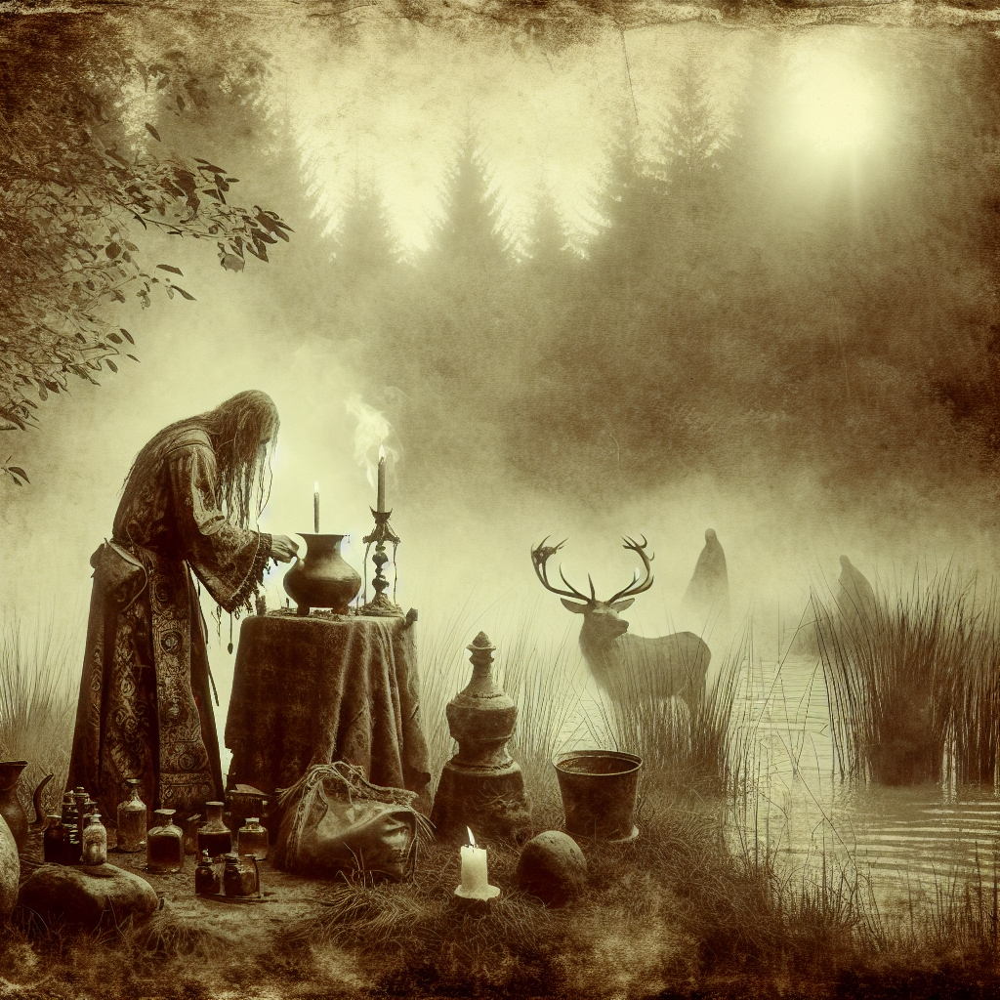
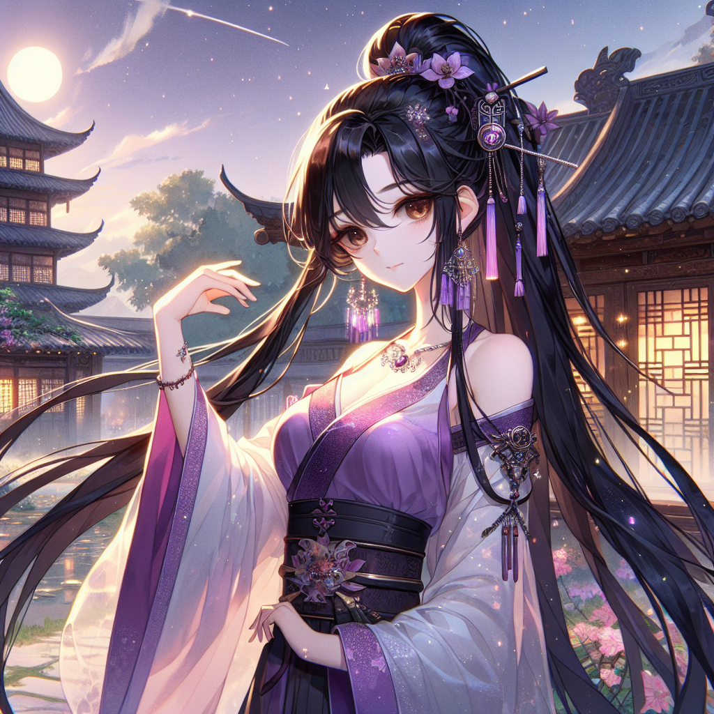

# **图像提示工程**

图像提示工程（Image Prompt Engineering）是一项新兴的技术，旨在通过设计和优化图像提示来引导模型生成高质量的图像输出。这种技术不仅适用于文本生成，还可以在图像生成、图像理解和多模态任务中发挥重要作用。

以下是一些在图像提示工程中常用的技术和最佳实践：

1. **明确图像生成目标**

**最佳实践**：明确你希望模型生成的图像类型、风格或内容。

**示例**：

* **目标不明确**：`"生成一张图片。"`

* **目标明确**：`"生成一张卡通风格的森林场景，包含动物和树木。"`

- **提供详细描述**

**最佳实践**：为模型提供详细的描述，包括场景、颜色、风格等信息。

**示例**：

* **简单描述**：`"生成一张城市图片。"`

* **详细描述**：`"生成一张现代城市的图片，包含高楼大厦、街道和行人，使用明亮的色调。"`

- **使用参考图像**

**最佳实践**：提供参考图像，帮助模型理解期望的风格或内容。

**示例**：

* **无参考图像**：`"生成一张风景图片。"`

* **有参考图像**：`"生成一张类似于下面这张图片内容的图像。\n[参考图像链接：https://image.pollinations.ai/prompt/dog]"`

- **分步生成**

**最佳实践**：对于复杂的图像生成任务，可以分步进行，逐步细化图像内容。

**示例**：

* **一步生成**：`"生成一张包含海滩、椰子树和日落的图片。"`

* **分步生成**：

  1. `“首先生成一张海滩的基础图像。”`

  2. `“在海滩上添加椰子树。”`

  3. `“在背景中添加日落。”`

- **使用多模态提示**

**最佳实践**：结合文本和图像提示，提供更加丰富的信息。

**示例**：

* **单一提示**：`"生成一张森林的图片。"`

* **多模态提示**：`"生成一张森林的图片，参考下面的描述和图像。\n描述：一个宁静的森林，阳光透过树叶。\n[参考图像链接：https://image.pollinations.ai/prompt/forest]"`

- **控制图像风格和细节**

**最佳实践**：通过提示控制图像的风格和细节，确保生成的图像符合预期。

**示例**：

* **无风格控制**：`"生成一张花园的图片。"`

* **有风格控制**：`"生成一张印象派风格的花园图片，使用柔和的色调和模糊的边缘。"`

- **反复试验和调整**

**最佳实践**：不断试验和调整提示，观察模型生成的图像，并根据需要进行优化。

**示例**：

* **初始提示**：`"生成一张城市夜景的图片。"`

* **调整提示**：`"生成一张城市夜景的图片，包含霓虹灯、车流和高楼大厦的灯光。"`

- **使用图像模板和占位符**

**最佳实践**：使用图像模板和占位符来指示需要填充的内容或格式。

**示例**：

* **无模板**：`"生成一张包含建筑物和树木的图像。"`

* **有模板**：`"生成一张包含建筑物和树木的图像，建筑物在左侧，树木在右侧。"`

- **多轮对话生成**

**最佳实践**：在需要时，通过多轮对话逐步引导模型生成所需的图像内容。

**示例**：

* **单轮对话**：`"生成一张包含湖泊和山脉的图片。"`

* **多轮对话**：

  * 用户：`"生成一张包含湖泊的图片。"`

  * 模型：`"生成的湖泊图片。"`

  * 用户：`"在湖泊背景中添加山脉。"`

  * 模型：`"生成的湖泊和山脉图片。"`

- **结合图像和文本生成**

**最佳实践**：结合图像和文本生成，创建更加丰富和多样的内容。

**示例**：

* **图像生成**：`"生成一张宇宙场景的图片。"`

* **图像和文本生成**：`"生成一张宇宙场景的图片，并生成一段描述这张图片的文字。"`

  * **输出**：

    * **图像**：宇宙场景图片

    * **文本描述**：`"这是一张充满星星和星云的宇宙场景图片，背景是深邃的黑色，星星闪烁着微弱的光芒。"`

- **风险与安全管理**

**最佳实践**：在生成图像时，注意内容的风险和安全问题，避免生成不当或敏感的图像。

**示例**：

* **提示**：`"生成一张适合所有年龄段观看的风景图片。"`

* **输出**：确保生成的图像没有敏感或不当内容。

通过遵循这些最佳实践，可以更有效地利用图像提示工程技术来生成高质量的图像内容，满足各种应用需求。

本文主要列举网络中 Dall E3 提示词，每一个提示词都可能得到一个不错的绘画作品，大家可以尝试尝试。这些提示词不仅可以用于 DALL E，还可以尝试在 Midjourney、Stable Diffusion 等 [AI 绘画](https://so.csdn.net/so/search?q=AI%E7%BB%98%E7%94%BB\&spm=1001.2101.3001.7020)工具中进行使用。大家也可以对比一下各种工具下的不同效果。

当前主要分为以下 11 个类别

1、人物形象

2、卡通头像

3、自然风景

4、LOGO 设计

5、动物形象

6、室内设计

7、动漫风格

8、二次元图

9、日常场景

10、古风神话

11、游戏场景

# **DALL-E3绘图提示词大全**

## **01、人物形象**

## **02、卡通头像**

## **03、自然风景**

## **04、LOGO 设计**

## **05、动物形象**

## **06、室内设计**

## **07、动漫风格**

## **08、二次元图**

## **09、日常场景**

## **10、古风神话**

## **11、游戏场景**

