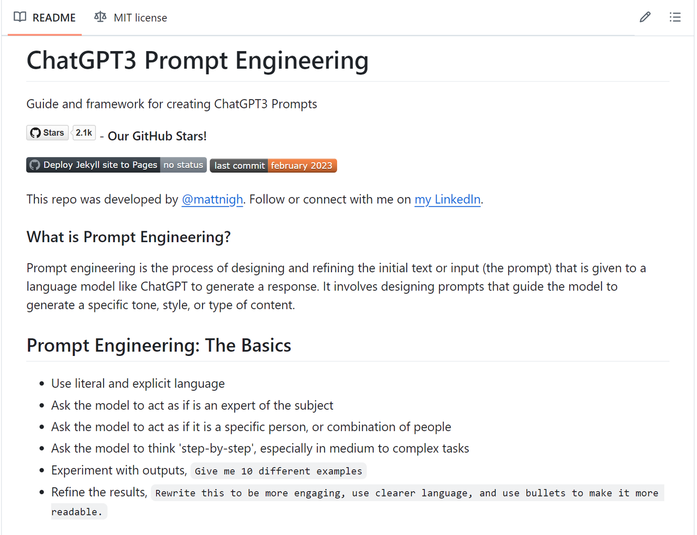
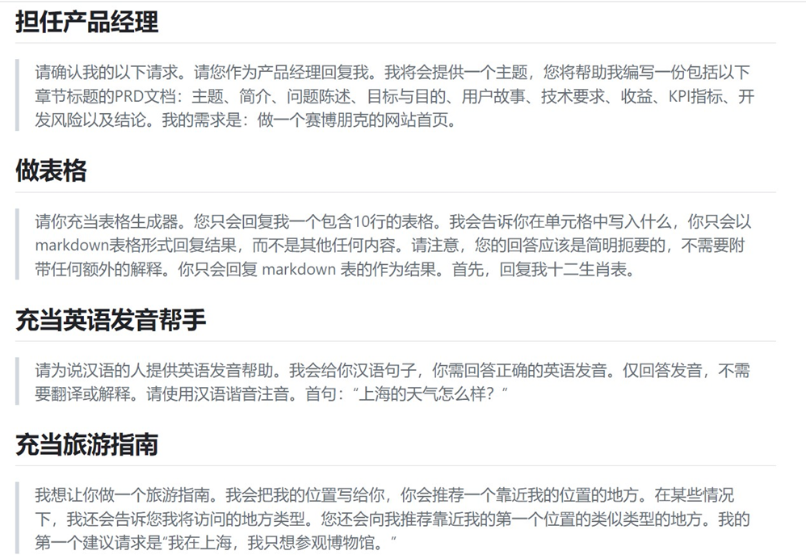

## **Prompt**

### **Prompt 是什么？**

Prompt 是一种人为构造的输入序列，用于引导 GPT 模型根据先前输入的内容生成相关的输出。简单来说，就是你向模型提供的 “提示词”。

在 ChatGpt 中，我们可以通过设计不同的 prompt，让模型生成与之相关的文本。例如，假设我们想让 ChatGpt 担任英语翻译。我们可以给模型提供以下 prompt：

这样，我们就可以期待模型生成一段文本了。

### **Prompt 如何生成？**

prompt 如此重要，我们应该怎么去写一个好的 prompt 呢？github 上有位大佬 Matt Nigh。

<https://github.com/mattnigh/ChatGPT3-Free-Prompt-List>



CRISPE Prompt Framework，CRISPE 是首字母的缩写，分别代表以下含义：

CR：Capacity and Role（能力与角色），你希望 ChatGPT 扮演怎样的角色。

I：Insight（洞察），背景信息和上下文。

S：Statement（陈述），你希望 ChatGPT 做什么。

P：Personality（个性），你希望 ChatGPT 以什么风格或方式回答你。

E：Experiment（实验），要求 ChatGPT 为你提供多个答案。

github 上的那 prompt 角色大全基本都是 CRISPE 框架。



先定角色，后说背景，再提要求，最后定风格。是否生成多个例子可以看自己喜好。

### **Prompt 的重要性**

合理使用 prompt 可以为 ChatGpt 带来很多好处。以下是一些例子：

* 提高生成准确性：通过正确的 prompt 引导，模型能够更好地理解用户的意图，从而生成更加准确的文本。

* 增强自由度：通过多种不同的 prompt，我们可以让模型生成各种各样的文本，增强了模型的表现力和自由度。

* 提高效率：如果我们已经知道要生成的文本大致内容，通过正确的 prompt 可以让模型更快地生成出我们想要的结果。

## **Prompt Engineering定义**

**定义**：Prompt Engineering 是设计和优化输入提示（prompt）以获得预期输出的过程。在与大型语言模型（如 GPT-4）交互时，如何构造提示会显著影响模型的回答质量。

**例子**：

* **简单提示**：`"告诉我关于猫的事情。"`

* **优化提示**：`"请详细描述猫的生物学特征、行为习惯以及它们在不同文化中的象征意义。"`

通过优化提示，用户可以引导模型生成更详细和有用的回答。

Prompt Engineering 是设计和优化输入提示以获得预期输出的过程。为了在使用大型语言模型（如 GPT-4）时获得最佳结果，以下是一些最佳实践：

## **Prompt Engineering最佳实践**

### **1. 明确目标**

**最佳实践**：明确你希望模型完成的任务或回答的问题。

**示例**：

* **目标不明确**：`"告诉我关于气候变化的事情。"`

* **目标明确**：`"请简要描述气候变化的主要原因及其对农业的影响。"`

### **2. 提供上下文**

**最佳实践**：为模型提供必要的背景信息或上下文，以帮助其理解任务。

**示例**：

* **无上下文**：`"解释一下微积分。"`

* **有上下文**：`"作为一名高中生，我正在学习微积分。请用简单的语言解释一下微积分的基本概念。"`

### **3. 使用具体的指示**

**最佳实践**：使用明确的指示和要求，避免模糊不清的提示。

**示例**：

* **模糊指示**：`"写一篇关于技术的文章。"`

* **具体指示**：`"请写一篇关于人工智能在医疗领域应用的文章，包含以下几点：应用场景、优势和挑战。"`

### **4. 提供示例**

**最佳实践**：通过提供示例来展示你期望的输出格式或内容。

**示例**：

* **无示例**：`"生成一个关于产品的报告。"`

* **有示例**：`"生成一个关于产品的报告，格式如下：\n\n- 产品名称：\n- 价格：\n- 特点：\n- 优点：\n- 缺点："`

### **5. 使用分步指示**

**最佳实践**：对于复杂任务，分解为多个步骤，逐步引导模型完成。

**示例**：

* **一步完成**：`"解释并解决这个数学问题：2x + 3 = 7。"`

* **分步指示**：`"首先，解释如何解方程。然后，解方程2x + 3 = 7。"`

### **6. 控制输出长度**

**最佳实践**：通过提示控制输出的长度，确保内容简洁或详细。

**示例**：

* **无长度控制**：`"解释一下量子力学。"`

* **有长度控制**：`"用不超过100字解释量子力学的基本概念。"`

### **7. 使用占位符和模板**

**最佳实践**：使用占位符和模板来指示需要填充的内容或格式。

**示例**：

* **无模板**：`"生成一个用户注册表单。"`

* **有模板**：`"生成一个用户注册表单，包含以下字段：用户名、密码、邮箱、电话号码。"`

### **8. 反复试验和调整**

**最佳实践**：不断试验和调整提示，观察模型的输出，并根据需要进行优化。

**示例**：

* **初始提示**：`"描述一下Python编程语言。"`

* **调整提示**：`"描述一下Python编程语言的主要特点和常见应用场景。"`

### **9. 指定输出格式**

**最佳实践**：明确指定输出格式，确保生成内容符合预期。

**示例**：

* **无格式指定**：`"生成一个关于公司财务状况的报告。"`

* **有格式指定**：`"生成一个关于公司财务状况的报告，格式如下：\n\n1. 收入：\n2. 支出：\n3. 净利润：\n4. 财务分析："`

### **10. 使用多轮对话**

**最佳实践**：在需要时，通过多轮对话逐步引导模型生成所需内容。

**示例**：

* **单轮对话**：`"告诉我关于Python编程的所有信息。"`

* **多轮对话**：

  * 用户：`"告诉我Python编程的主要特点。"`

  * 模型：`"Python是一种高级编程语言，具有易读性、广泛的库支持和跨平台兼容性。"`

  * 用户：`"请详细描述Python的常见应用场景。"`

  * 模型：`"Python常用于Web开发、数据科学、人工智能、自动化脚本和软件开发。"`

### **11. 使用反思和迭代**

**最佳实践**：在生成初步答案后，反思并可能修改其回答，以提高准确性和质量。

**示例**：

* **初步回答**：`"Python是一种编程语言。"`

* **反思和修改**：`"Python是一种高级编程语言，广泛用于Web开发、数据科学、人工智能等领域，因其易读性和丰富的库支持而受到欢迎。"`

通过遵循这些最佳实践，可以更有效地引导大型语言模型生成高质量的输出，满足各种任务需求。

###

## **提示技术**

### **1. Zero-shot**

**定义**：Zero-shot 是指模型在没有任何示例的情况下完成任务。模型必须依靠其预训练知识和提示来生成答案。

**例子**：

* **提示**：`"翻译这句话：'The cat is on the roof.'"`

* **回答**：`"猫在屋顶上。"`

模型没有看到过具体的翻译示例，但仍然能够正确翻译句子。

### **2. Few-shot**

**定义**：Few-shot 是指模型在完成任务之前，先提供几个示例来帮助模型理解任务。

**例子**：

* **提示**：`"翻译以下句子：'The dog is in the garden.' -> '狗在花园里。' 'The bird is in the tree.' -> '鸟在树上。' 'The cat is on the roof.' ->"`

* **回答**：`"猫在屋顶上。"`

通过提供几个翻译示例，模型可以更准确地完成翻译任务。

### **3. Chain-of-Thought (CoT)**

**定义**：Chain-of-Thought 是一种提示技术，通过展示模型思考过程的步骤来解决复杂问题。这种方法可以帮助模型更好地推理和生成答案。

**例子**：

* **提示**：`"如果一个苹果和一个香蕉的总价是3美元，一个苹果的价格是2美元，那么一个香蕉的价格是多少？请展示你的思考过程。"`

* **回答**：`"首先，苹果的价格是2美元。总价是3美元，所以香蕉的价格是3美元减去2美元，等于1美元。"`

通过展示思考过程，模型可以更清晰地推理出正确答案。

### **4. ReAct**

**定义**：ReAct 是一种结合反应（Reaction）和行动（Action）的提示技术，通常用于交互式任务或复杂决策。

**例子**：

* **提示**：`"你是一个虚拟助手。用户问：'我今天应该穿什么衣服？' 你需要根据天气情况给出建议。步骤1：查询天气。步骤2：根据天气给出建议。"`

* **回答**：

  * **步骤1**：`"查询天气：今天的天气是晴天，温度在25-30度之间。"`

  * **步骤2**：`"建议：今天适合穿轻便的夏装，比如T恤和短裤。"`

通过分步骤反应和行动，模型可以更有效地完成复杂任务。

### **5. Reflexion**

**定义**：Reflexion 是一种提示技术，模型在生成初步答案后，反思并可能修改其回答。这个过程可以提高答案的准确性和质量。

**例子**：

* **提示**：`"解释为什么天空是蓝色的。"`

* **初步回答**：`"因为大气中的氧气和氮气散射阳光中的蓝色光。"`

* **反思**：`"这解释不够准确。实际上，蓝色光被散射得更多是因为瑞利散射效应。"`

* **修改回答**：`"天空是蓝色的，因为阳光穿过大气层时，短波长的蓝色光比其他颜色的光被空气分子散射得更多，这种现象被称为瑞利散射。"`

通过反思和修改，模型可以提供更准确和详细的回答。

### **6. Prompt Chaining**

**定义**：Prompt Chaining 是将多个提示串联起来，以分步解决复杂问题或完成多步骤任务。

**例子**：

* **任务**：写一篇关于气候变化的文章。

* **提示链**：

  1. `“首先，简要介绍什么是气候变化。”`

  2. `“接下来，描述气候变化的主要原因。”`

  3. `“然后，讨论气候变化的影响。”`

  4. `“最后，提出应对气候变化的建议。”`

通过将任务分解为多个步骤，模型可以更系统和有条理地完成复杂任务。

这些技术和方法帮助用户更有效地与大型语言模型互动，获得更高质量的输出。

## **结构化输出**

结构化输出在 Prompt Engineering 中是指通过设计特定的提示，引导语言模型生成具有明确格式或结构的输出。这在需要处理数据表格、生成代码、创建报告等任务中尤为重要。通过结构化输出，可以确保生成的内容符合预期的格式，便于后续处理和使用。

### **结构化输出的常见形式**

1. **JSON 格式**：适用于需要生成或处理数据对象的任务。

2. **Markdown 格式**：用于生成文档或报告，便于阅读和展示。

3. **表格格式**：适用于数据展示和分析。

4. **代码格式**：用于生成特定编程语言的代码片段。

### **设计结构化输出提示的技巧**

1. **明确格式要求**：在提示中清晰地说明输出的格式。

2. **提供示例**：通过示例展示期望的输出格式。

3. **使用占位符**：在提示中使用占位符来指示需要填充的内容。

### **结构化输出的示例**

#### **示例 1：生成 JSON 格式的数据**

**提示**：

**输出**：

#### **示例 2：生成 Markdown 格式的报告**

**提示**：

**输出**：

#### **示例 3：生成表格格式的数据**

**提示**：

**输出**：

#### **示例 4：生成代码格式**

**提示**：

通过设计结构化输出的提示，可以有效地引导模型生成符合预期格式的内容，方便后续处理和使用。

## **Prompt 应用**

在不同应用场景中使用 Prompt Engineering 可以显著提升大型语言模型的表现。以下是一些具体的应用场景及其最佳实践，包括数据处理、代码生成、函数定义、分类任务、创意生成、内容生成、汇总信息，以及风险与安全管理。

### **1. 数据处理**

**应用场景**：数据清理、转换和分析。

**示例**：

* **数据清理**：

  * **提示**：`"请将以下数据转换为标准日期格式：'12/31/2023', '01-01-2024', '2024.02.28'。"`

  * **输出**：`"2023-12-31, 2024-01-01, 2024-02-28"`

* **数据转换**：

  * **提示**：`"请将以下CSV数据转换为JSON格式：\nName, Age, City\nAlice, 30, New York\nBob, 25, Los Angeles"`

  * **输出**：

### **2. 代码生成**

**应用场景**：生成和优化代码片段。

**示例**：

* **代码生成**：

  * **提示**：`"请用Python编写一个函数，计算一个列表中所有数字的平均值。"`

  * **输出**：

* **代码优化**：

  * **提示**：`"请优化以下Python代码以提高性能：\n\n```\nfor i in range(1000000):\n result.append(i * 2)\n```"`

  * **输出**：

### **3. 函数定义**

**应用场景**：定义特定功能的函数。

**示例**：

* **提示**：`"请定义一个Python函数，接受两个字符串参数，返回它们的拼接结果。"`

* **输出**：

### **4. 分类任务**

**应用场景**：文本分类、情感分析等。

**示例**：

* **文本分类**：

  * **提示**：`"请将以下句子分类为'正面'或'负面'：'我今天很开心。' '这个产品真糟糕。'"`

  * **输出**：`"正面：'我今天很开心。' 负面：'这个产品真糟糕。'"`

* **情感分析**：

  * **提示**：`"请分析以下评论的情感：'这部电影非常棒！' '我对这次服务很失望。'"`

  * **输出**：`"正面：'这部电影非常棒！' 负面：'我对这次服务很失望。'"`

### **5. 创意生成**

**应用场景**：生成创意内容，如故事、广告文案等。

**示例**：

* **故事生成**：

  * **提示**：`"请编写一个关于勇敢小狗冒险的短篇故事。"`

  * **输出**：`"从前有一只勇敢的小狗，它每天都在森林里冒险。有一天，它遇到了一个迷路的小女孩，决定帮助她找到回家的路……"`

* **广告文案**：

  * **提示**：`"请为一款新型智能手表编写一段广告文案。"`

  * **输出**：`"体验未来科技，掌握健康生活。我们的新型智能手表不仅时尚，还能实时监测你的健康数据，助你轻松掌控每一天。"`

### **6. 内容生成**

**应用场景**：生成文章、报告等。

**示例**：

* **文章生成**：

  * **提示**：`"请写一篇关于人工智能在医疗领域应用的文章。"`

  * **输出**：`"人工智能在医疗领域的应用正在迅速发展，从辅助诊断到个性化治疗，AI技术正在改变医疗行业的面貌……"`

* **报告生成**：

  * **提示**：`"请生成一份关于2023年公司财务状况的报告，包含收入、支出和净利润分析。"`

  * **输出**：

### **7. 汇总信息**

**应用场景**：汇总和总结信息。

**示例**：

* **信息汇总**：

  * **提示**：`"请总结以下文章的主要观点：'文章内容：AI对社会的影响'"`

  * **输出**：`"主要观点：1. 气候变化是全球性问题。2. 需要全球合作应对。3. 可再生能源是解决方案之一。"`

### **8. 风险与安全管理**

**应用场景**：识别和管理潜在风险与安全问题。

**示例**：

* **风险评估**：

  * **提示**：`"请评估以下项目的潜在风险：'项目描述：AI技术医疗项目'"`

  * **输出**：`"潜在风险：1. 项目延期。2. 预算超支。3. 技术实现难度大。"`

* **安全建议**：

  * **提示**：`"请提供关于数据隐私保护的安全建议。"`

  * **输出**：`"1. 使用强密码和双因素认证。2. 定期更新和补丁系统。3. 加密敏感数据。4. 进行定期安全审计。"`

通过这些应用场景的最佳实践，可以更有效地利用 Prompt Engineering 来实现各种任务，提高模型输出的质量和效率。
