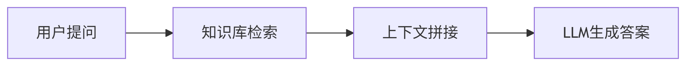
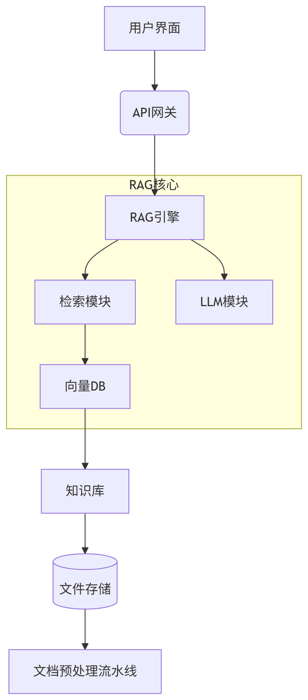

## —— 让大模型精准掌握企业私有知识的核心技术


***


## 一、RAG 是什么？

**RAG（Retrieval-Augmented Generation，检索增强生成）** 是一种将 **信息检索** 与 **文本生成** 相结合的技术框架。它通过以下流程解决大模型（LLM）的“知识盲区”问题： &#x20;

```txt
用户问题 → 从知识库检索相关文档 → 将文档作为上下文输入LLM → 生成精准答案  
```


### ✅ 核心价值：

* **突破模型记忆限制**：直接利用最新/私有数据，无需重新训练模型 &#x20;

* **减少幻觉现象**：答案基于检索到的证据，可靠性显著提升 &#x20;

* **低成本适配业务**：仅需维护知识库，无需微调模型 &#x20;


> 💡 \*\*类比理解\*\*： &#x20;
>
> 如同学者写论文——先查文献（检索），再结合已有知识写作（生成）


***


## 二、为什么需要 RAG？

| 传统LLM痛点    | RAG 解决方案     |
| ---------- | ------------ |
| 训练数据截止滞后   | 实时检索最新数据     |
| 无法访问企业私有知识 | 连接内部文档/数据库   |
| 专业领域表现差    | 注入领域知识片段     |
| 答案缺乏依据     | 提供引用来源，可追溯证据 |


***


## 三、RAG 核心工作流程（4步）





### 步骤详解：

1. **问题解析** &#x20;

   * 拆分关键词、识别查询意图 &#x20;

   * 示例问题： *“公司2025年Q1的销售目标是多少？”*


2. **知识库检索** &#x20;

   * 使用 \*\*向量数据库\*\*（如 Milvus, Pinecone） &#x20;

   * 检索相似文档（如销售计划PDF/数据库记录） &#x20;

   * 返回Top K相关片段（通常K=3\~5）


3. **提示词工程** &#x20;

   * 拼接提示模板： &#x20;

   ```txt
   基于以下信息回答问题：
   <检索到的文档1>
   <文档2>
   ...
   问题：{用户问题}
   答案：
   ```


4. **生成最终答案** &#x20;

   * LLM 基于提示词输出带引用的回答：> “根据《2025年Q1销售计划》（P.12），销售目标为 \*\*2.5亿元人民币\*\*。”


***


## 四、RAG 系统关键组件

| 组件         | 推荐工具/技术                    | 作用说明               |
| ---------- | -------------------------- | ------------------ |
| **文本加载器**  | LangChain, LlamaIndex      | 解析PDF/Word/网页等原始文件 |
| **嵌入模型**   | OpenAI text-embedding, BGE | 将文本转化为向量           |
| **向量数据库**  | Milvus, Pinecone, PGVector | 存储/快速检索向量          |
| **大语言模型**  | GPT-4, DeepSeek-R, Llama 3 | 生成最终答案             |
| **提示词管理器** | LangChain, PromptFlow      | 动态构建上下文提示          |


***


## 五、企业级 RAG 架构示例




***


## 六、RAG 典型应用场景

| 场景        | 案例说明               |
| --------- | ------------------ |
| 📚 企业智能客服 | 回答产品参数/售后政策等私有知识问题 |
| 💼 内部知识助手 | 查询员工手册/财务制度/项目文档   |
| 🏥 医疗诊断辅助 | 根据最新医学指南生成诊疗建议     |
| 📈 金融分析报告 | 整合招股书/财报生成投资摘要     |
| 🔧 技术文档问答 | 快速定位API文档/错误解决方案   |


***


## 七、快速搭建 RAG 的 4 种方式

### 1️⃣ 零代码平台（业务人员）

* **工具**：ChatPDF, AskYourPDF &#x20;

* **操作**：上传文件 → 自动构建知识库 → 直接提问 &#x20;


### 2️⃣ 开发框架（开发者）

```python
# 使用 LangChain 快速实现（伪代码）
from langchain_community.vectorstores import Chroma
from langchain_openai import OpenAIEmbeddings

# 1. 加载知识库
documents = load_documents("./企业知识库/") 

# 2. 构建向量库
vectorstore = Chroma.from_documents(documents, OpenAIEmbeddings())

# 3. 检索增强问答
retriever = vectorstore.as_retriever()
qa_chain = RetrievalQA.from_chain_type(llm, retriever=retriever)
print(qa_chain.run("公司休假政策如何？"))
```


### 3️⃣ 云服务（企业级）

* **AWS**：Kendra + Bedrock &#x20;

* **Azure**：Cognitive Search + Azure OpenAI &#x20;

* **阿里云**：DashVector + 通义千问 &#x20;


### 4️⃣ 开源解决方案

* [**LlamaIndex**](https://www.llamaindex.ai/)：专为RAG优化的数据框架 &#x20;

* [**PrivateGPT**](https://privategpt.dev/)：本地化隐私保护方案 &#x20;


***


## 八、RAG 优化进阶技巧

| 挑战     | 解决方案                |
| ------ | ------------------- |
| 检索精度低  | 混合检索（关键词+向量）+ 重排序模型 |
| 长文档效果差 | 智能分块（按段落/语义分割）      |
| 多跳推理失败 | 迭代检索（先查A→再查B）       |
| 时效性不足  | 设置知识库自动更新周期         |
| 安全合规风险 | 敏感信息过滤+权限分级访问       |


***


## 九、常见问题（FAQ）

### ❓ RAG 和微调（Fine-tuning）有什么区别？

> ✅ \*\*RAG\*\*：动态注入知识，适合频繁更新的数据 &#x20;
>
> ✅ \*\*微调\*\*：改变模型行为，适合学习新任务范式 &#x20;
>
> 💡 最佳实践：两者结合（微调理解领域术语 + RAG提供实时数据）


### ❓ 哪些情况不适合用 RAG？

> 🔸 需要数学逻辑推理的任务 &#x20;
>
> 🔸 知识高度结构化（建议直接查数据库） &#x20;
>
> 🔸 极简问答（如天气查询，直接调用API更高效）


### ❓ 如何评估 RAG 效果？

> 关键指标： &#x20;
>
> * **检索相关性** (Hit Rate@K) &#x20;
>
> * **答案准确性** (Factual Score) &#x20;
>
> * **引用精确度** (Citation Precision) &#x20;


***


## 十、学习资源推荐

* 📚 理论奠基论文： [《Retrieval-Augmented Generation for Knowledge-Intensive NLP Tasks》](https://arxiv.org/abs/2005.11401) (2020) &#x20;

* 🛠️ 实践教程： &#x20;

  * [LangChain RAG 官方文档](https://python.langchain.com/docs/use_cases/question_answering/) &#x20;

  * [LlamaIndex 入门指南](https://docs.llamaindex.ai/en/stable/getting_started/) &#x20;

* 💻 在线体验： &#x20;

  * [DeepSeek-R 文件问答](https://chat.deepseek.com)（上传PDF体验RAG） &#x20;


***


> 💡 \*\*总结一句话\*\*： &#x20;
>
> **RAG 是大模型落地企业的关键技术桥梁，通过“检索+生成”双引擎，低成本实现知识实时更新与精准问答，已成为AI应用开发的标准范式。**


***


