## **背景**

在过去两年中，检索增强生成（RAG，Retrieval-Augmented Generation）技术逐渐成为提升智能体的核心组成部分。通过结合检索与生成的双重能力，RAG 能够引入外部知识，从而为大模型在复杂场景中的应用提供更多可能性。但是在实际落地场景中，往往会存在检索准确率低，噪音干扰多，召回完整性，专业性不够，导致 LLM 幻觉严重的问题。本次分享会聚焦 RAG 在实际落地场景中的知识加工和检索细节，如何去优化 RAG Pineline 链路，最终提升召回准确率。

## **一、知识检索优化思路**

目前 RAG 智能问答应用几个痛点：

* 知识库文档越来越多以后，检索噪音大，召回准确率不高

* 召回不全，完整性不够

* 召回和用户问题意图相关性不大

* 只能回答静态数据，无法动态获取知识，导致答疑应用比较呆，比较笨。

### **知识处理优化**

非结构化 / 半结构化 / 结构化数据的处理，准备决定着 RAG 应用的上限，因此首先需要在知识处理，索引阶段做大量的细粒度的 ETL 工作，主要优化的思路方向：

* 非结构化 -> 结构化：有条理地组织知识信息。

* 提取更加丰富的, 多元化的语义信息。

#### **知识加载**

目的：需要对文档进行精确的解析，更多元化的识别到不同类型的数据。

优化建议：

* 建议将 docx、txt 或者其他文本事先处理为 pdf 或者 markdown 格式，这样可以利用一些识别工具更好的提取文本中的各项内容。

* 提取文本中的表格信息。

* 保留 markdown 和 pdf 的标题层级信息，为接下来的层级关系树等索引方式准备。

* 保留图片链接，公式等信息，也统一处理成 markdown 的格式。

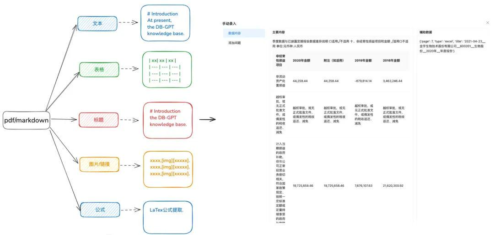

#### **切片 Chunk 尽量保持完整**

目的：保存上下文完整性和相关性，这直接关乎回复准确率。

保持在大模型的上下文限制内，分块保证输入到 LLMs 的文本不会超过其 token 限制。

优化建议：

* 图片 + 表格单独抽取成 Chunk，将表格和图片标题保留到 metadata 元数据里。

* 文档内容尽量按照标题层级或者 Markdown Header 进行拆分，尽可能保留 chunk 的完整性。

* 如果有自定义分隔符可以按照自定义分割符切分。

#### **多元化的信息抽取**

除了对文档进行 Embedding 向量抽取外，其他多元化的信息抽取能够对文档进行数据增强，显著提升 RAG 召回效果。

* 知识图谱

* 优点：1. 解决 NativeRAG 的完整性缺失，依然存在幻觉问题，知识的准确性，包括知识边界的完整性、知识结构和语义的清晰性，是对相似度检索的能力的一种语义补充。

* 适用场景：适用于严谨的专业领域 (医疗，运维等)，知识的准备需要受到约束的并且知识之间能够明显建立层级关系的。

* 如何实现：

  1. 依赖大模型提取 (实体, 关系, 实体) 三元组关系。

  2. 依赖前期高质量，结构化的知识准备，清洗，抽取，通过业务规则通过手动或者自定义 SOP 流程构建知识图谱。

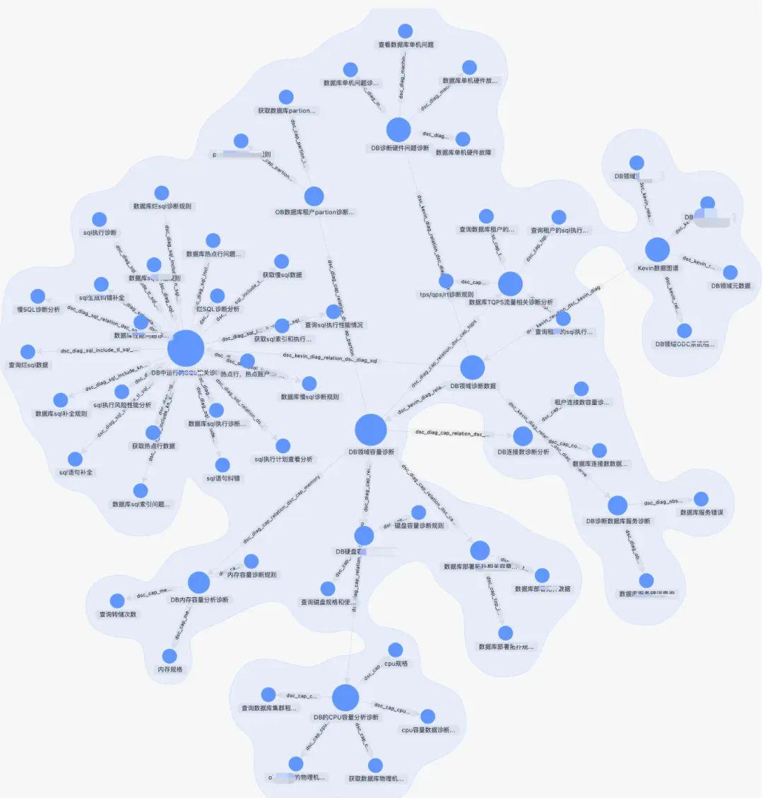

* Doc Tree

* 适用场景：解决了上下文完整性不足的问题，也能匹配时完全依据语义和关键词，能够减少噪音

* 如何实现：以标题层级构建 chunk 的树形节点，形成一个多叉树结构，每一层级节点只需要存储文档标题，叶子节点存储具体的文本内容。这样利用树的遍历算法，如果用户问题命中相关非叶子标题节点，就可以将相关的子节点数据进行召回。这样就不会存在 chunk 完整性缺失的问题。

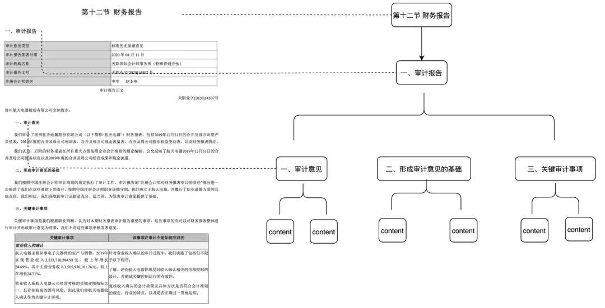

* 提取 QA 对，需要前置通过预定义或者模型抽取的方式提取 QA 对信息

* **适用场景：**

* 能够在检索中命中问题并直接进行召回，直接检索到用户想要的答案，适用于一些 FAQ 场景，召回完整性不够的场景。

* **如何实现：**

* 预定义: 预先为每个 chunk 添加一些问题

* 模型抽取: 通过给定一下上下文，让模型进行 QA 对抽取

* 元数据抽取

* 如何实现：根据自身业务数据特点，提取数据的特征进行保留，比如标签，类别，时间，版本等元数据属性。

* 适用场景：检索时候能够预先根据元数据属性进行过滤掉大部分噪音。

* 总结提取

* 适用场景：解决这篇文章讲了个啥，总结一下等全局问题场景。

* 如何实现：通过 mapreduce 等方式分段抽取，通过模型为每段 chunk 提取摘要信息。

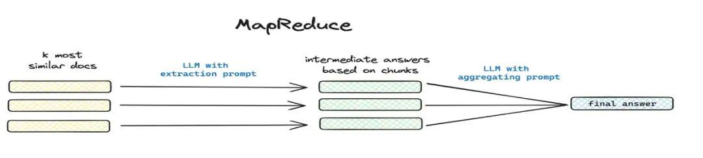

#### **知识处理工作流**

目前 DB-GPT 知识库提供了文档上传 -> 解析 -> 切片 -> Embedding -> 知识图谱三元组抽取 -> 向量数据库存储 -> 图数据库存储等知识加工的能力，但是不具备对文档进行复杂的个性化的信息抽取能力，因此希望通过构建知识加工工作流模版来完成复杂的，可视化的，用户可自定义的知识抽取，转换，加工流程。

**2.2 RAG 流程优化**

RAG 流程的优化我们又分为了静态文档的 RAG 和动态数据获取的 RAG，目前大部分涉及到的 RAG 只覆盖了非结构化的文档静态资产，但是实际业务很多场景的问答是通过工具获取动态数据 + 静态知识数据共同回答的场景，不仅需要检索到静态的知识，同时需要 RAG 检索到工具资产库里面工具信息并执行获取动态数据。

#### **静态知识 RAG 优化**

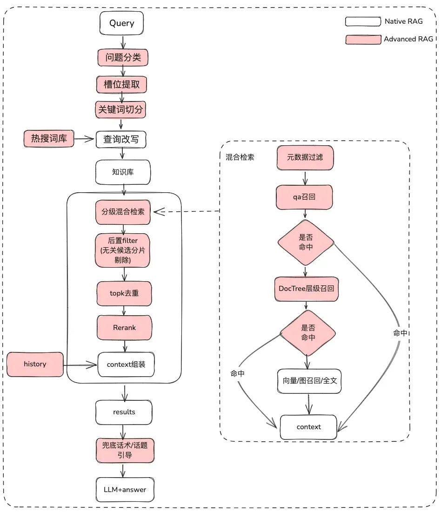

##### **原始问题处理**

目的：澄清用户语义，将用户的原始问题从模糊的，意图不清晰的查询优化为含义更丰富的一个可检索的 Query

* 原始问题分类，通过问题分类可以

* LLM 分类 (LLMExtractor)

* 构建 embedding + 逻辑回归实现双塔模型，text2nlu DB-GPT-Hub/src/dbgpt-hub-nlu/README.zh.md at main · eosphoros-ai/DB-GPT-Hub

* tip: 需要高质量的 Embedding 模型，推荐 bge-v1.5-large

* 反问用户，如果语义不清晰将问题再抛给用户进行问题澄清，通过多轮交互

* 通过热搜词库根据语义相关性给用户推荐他想要的问题候选列表

* 槽位提取，目的是获取用户问题中的关键 slot 信息，比如意图，业务属性等等

* LLM 提取 (LLMExtractor)

* 问题改写

* 热搜词库进行改写

* 多轮交互

##### **元数据过滤**

当我们把索引分成许多 chunks 并且都存储在相同的知识空间里面，检索效率会成为问题。比如用户问 "浙江我武科技公司" 相关信息时，并不想召回其他公司的信息。因此，如果可以通过公司名称元数据属性先进行过滤，就会大大提升效率和相关度。

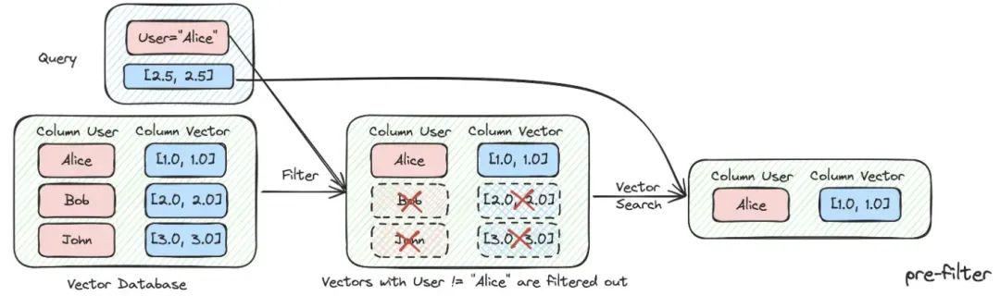

##### **多策略混合召回**

* 按照优先级召回，分别为不同的检索器定义优先级，检索到内容后立即返回

* 定义不同检索，比如 qa\_retriever, doc\_tree\_retriever 写入到队列里面， 通过队列的先进先出的特性实现优先级召回。

* 多知识索引 / 空间并行召回

* 通过知识的不同索引形式，通过并行召回方式获取候选列表，保证召回完整性。

##### **后置过滤**

经过粗筛候选列表后，怎么通过精筛过滤噪音呢

* 无关的候选分片剔除

* 时效性剔除

* 业务属性不满足剔除

* topk 去重

* 重排序 仅仅靠粗筛的召回还不够，这时候我们需要有一些策略来对检索的结果做重排序，比如把组合相关度、匹配度等因素做一些重新调整，得到更符合我们业务场景的排序。因为在这一步之后，我们就会把结果送给 LLM 进行最终处理了，所以这一部分的结果很重要。

* 使用相关重排序模型进行精筛，可以使用开源的模型，也可以使用带业务语义微调的模型。

* 根据不同索引召回的内容进行业务 RRF 加权综合打分剔除

##### **显示优化 + 兜底话术 / 话题引导**

* 让模型使用 markdown 的格式进行输出

#### **动态知识 RAG 优化**

文档类知识是相对静态的，无法回答个性化以及动态的信息， 需要依赖一些第三方平台工具才可以回答，基于这种情况，我们需要一些动态 RAG 的方法，通过工具资产定义 -> 工具选择 -> 工具校验 -> 工具执行获取动态数据

##### **工具资产库**

构建企业领域工具资产库，将散落到各个平台的工具 API，工具脚本进行整合，进而提供智能体端到端的使用能力。比如，除了静态知识库以外，我们可以通过导入工具库的方式进行工具的处理。

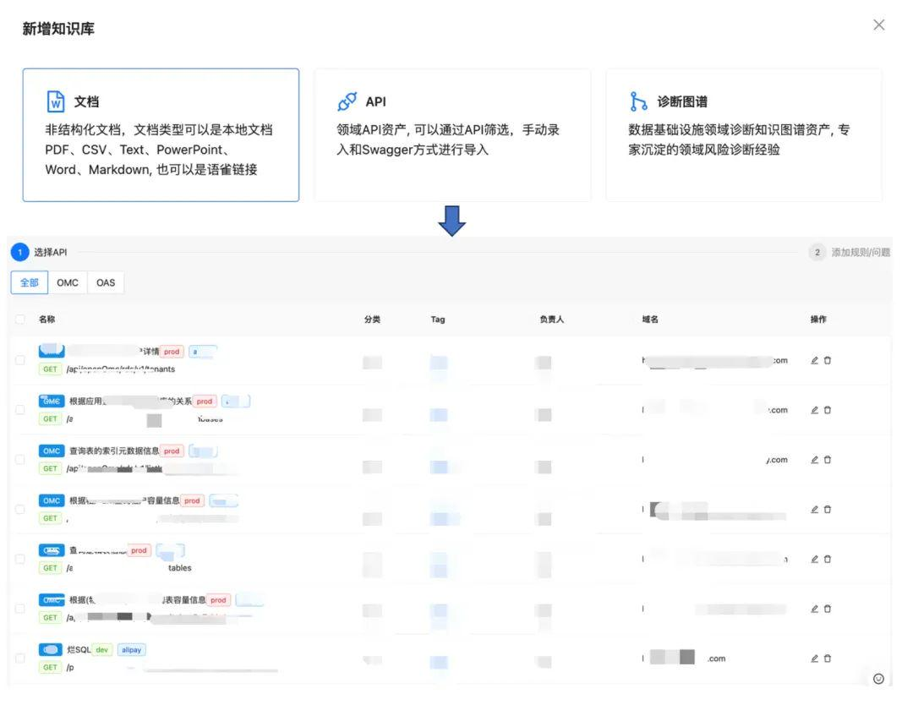

##### **工具召回**

工具召回沿用静态知识的 RAG 召回的思路，再通过完整的工具执行生命周期来获取工具执行结果。

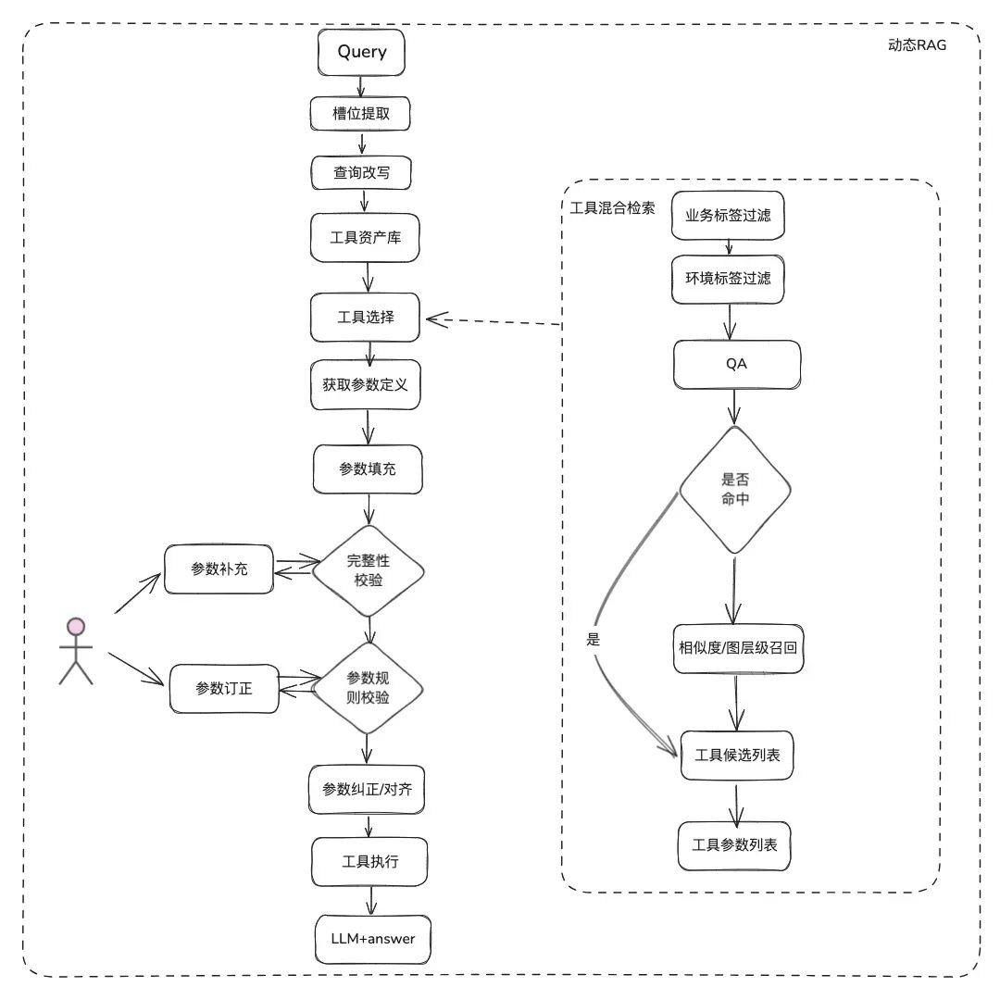

* 槽位提取：通过传统 nlp 获取 LLM 将用户问题进行解析，包括常用的业务类型，标签，领域模型参数等等。

* 工具选择：沿用静态 RAG 的思路召回，主要有两层，工具名召回和工具参数召回。

* 工具参数召回，和 TableRAG 思路类似，先召回表名，再召回字段名。

* 参数填充：需要根据召回的工具参数定义，和槽位提取出来的参数进行 match

* 可以代码进行填充，也可以让模型进行填充。

* 优化思路：由于各个平台工具的同样的参数的参数名没有统一，也不方便去治理，建议可以先进行一轮领域模型数据扩充，拿到整个领域模型后，需要的参数都会存在。

* 参数校验

* 完整性校验：进行参数个数完整性校验

* 参数规则校验：进行参数名类型，参数值，枚举等等规则校验。

* 参数纠正 / 对齐，这部分主要是为了减少和用户的交互次数，自动化完成用户参数错误纠正，包括大小写规则，枚举规则等等。eg:

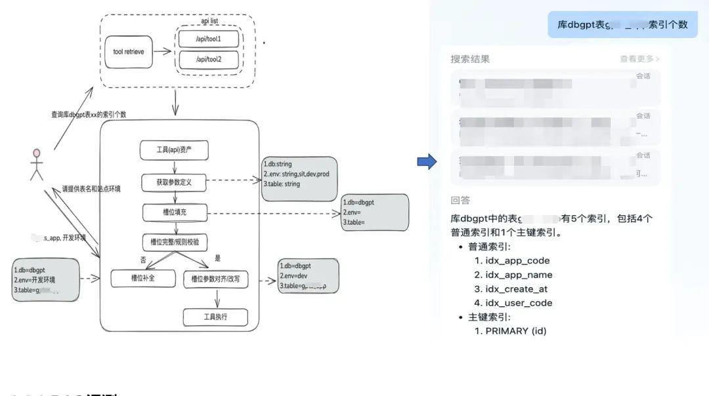

## **二、RAG 落地案例分享**

**3.1 数据基础设施领域的 RAG**

### **运维智能体背景**

在数据基础设施领域，有很多运维 SRE，每天会接收到大量的告警，因此很多时间来需要响应应急事件，进而进行故障诊断，然后故障复盘，进而进行经验沉淀。另外一部分时间又需要响应用户咨询，需要他们用他们的知识以及三方平台工具使用经验进行答疑。

因此我们希望通过打造一个数据基础设施的通用智能体来解决告警诊断，答疑的这些问题。

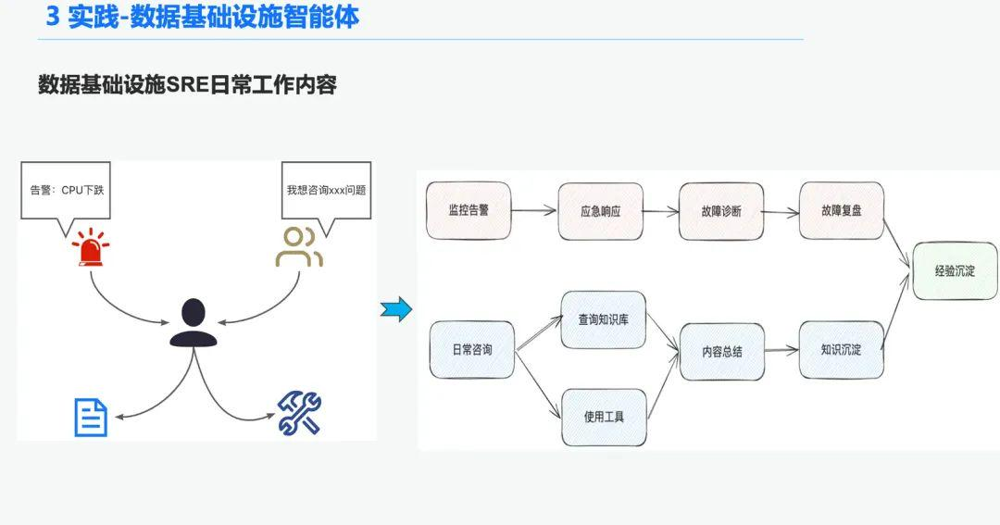

### **严谨专业的 RAG**

传统的 RAG + Agent 技术可以解决通用的，确定性没那么高的，单步任务场景。但是面对数据基础设施领域的专业场景，整个检索过程必须是确定，专业和真实的，并且是需要一步一步推理的。

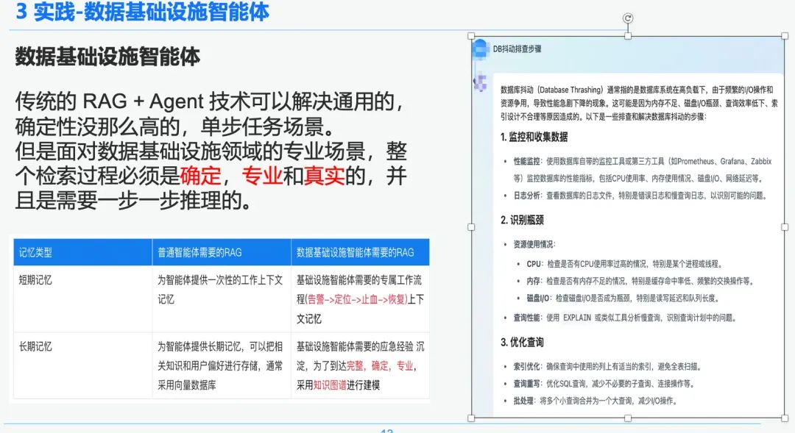

右边是一个通过 NativeRAG 的一个泛泛而谈的总结，可能对于一个普通的用户，对专业的领域知识没那么了解时，可能是有用的信息，但是这部分对于数据基础设施领域的专业人士，就没有什么意义了。因此我们比较了通用的智能体和数据基础设施智能体在 RAG 上面的区别：

* 通用的智能体：传统的 RAG 对知识的严谨和专业性要求没那么高，适用于客服，旅游，平台答疑机器人这样的一些业务场景。

* 数据基础设施智能体：RAG 流程是严谨和专业的，需要专属的 RAG 工作流程，上下文包括 (DB 告警 -> 根因定位 ->应急止血 ->故障恢复)，并且需要对专家沉淀的问答和应急经验，进行结构化的抽取，建立层次关系。因此我们选择知识图谱来作为数据承载。

### **知识处理**

基于数据基础设施的确定性和特殊性，我们选择通过结合知识图谱来作为诊断应急经验的知识承载。我们通过 SRE 沉淀下来的应急排查事件知识经验 结合应急复盘流程，建立了 DB 应急事件驱动的知识图谱，我们以 DB 抖动为例，影响 DB 抖动的几个事件，包括慢 SQL 问题，容量问题，我们在各个应急事件间建立了层级关系。

最后通过我们通过规范化应急事件规则，一步一步地建立了多源的知识 -> 知识结构化抽取 -> 应急关系抽取 -> 专家审核 -> 知识存储的一套标准化的知识加工体系。

### **知识检索**

在智能体检索阶段，我们使用 GraphRAG 作为静态知识检索的承载，因此识别到 DB 抖动异常后，找到了与 DB 抖动异常节点相关的节点作为我们分析依据，由于在知识抽取阶段每一个节点还保留了每个事件的一些元数据信息，包括事件名，事件描述，相关工具，工具参数等等，

因此我们可以通过执行工具的执行生命周期链路来获取返回结果拿到动态数据来作为应急诊断的排查依据。通过这种动静结合的混合召回的方式比纯朴素的 RAG 召回，保障了数据基础设施智能体执行的确定性，专业性和严谨性。

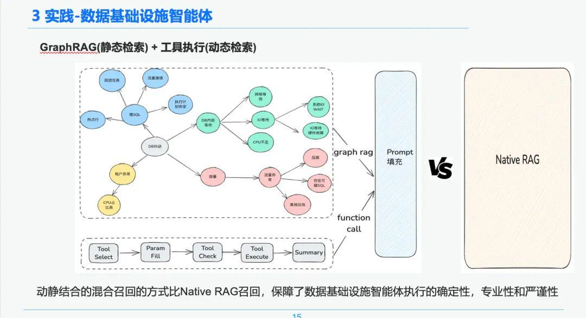

### **AWEL + Agent**

最后通过社区 AWEL+AGENT 技术，通过 AGENT 编排的范式，打造了从意图专家 -> 应急诊断专家 -> 诊断根因分析专家。

每个 Agent 的职能都是不一样的，意图专家负责识别解析用户的意图和识别告警信息诊断专家需要通过 GraphRAG 定位到需要分析的根因节点，以及获取具体的根因信息。分析专家需要结合各个根因节点的数据 + 历史分析复盘报告生成诊断分析报告。

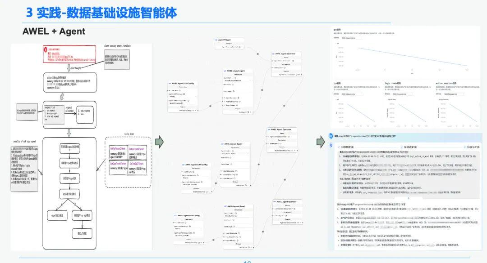

## **三、总结**

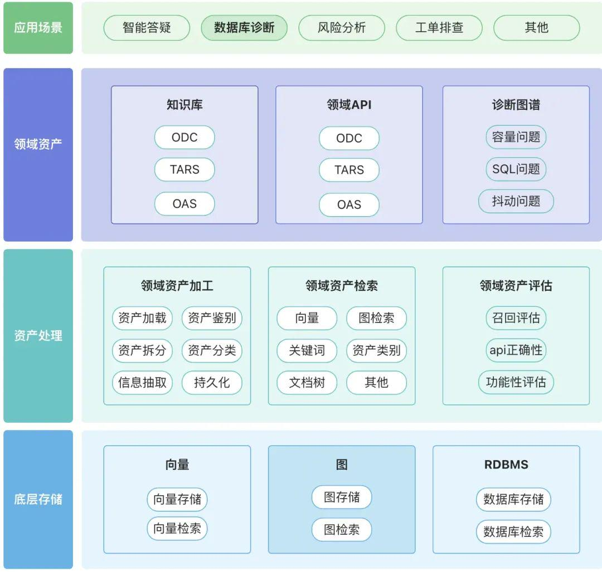

建议围绕各自领域构建属于自己的领域资产库包括，知识资产，工具资产以及知识图谱资产

* 领域资产: 领域资产包括了领域知识库，领域 API，工具脚本，领域知识图谱。

* 资产处理，整个资产数据链路涉及了领域资产加工，领域资产检索和领域资产评估。

* 非结构化 -> 结构化：有条理地归类，正确地组织知识信息。

* 提取更加丰富的语义信息。

* 资产检索：

* 希望是有层级，优先级的检索而并非单一的检索

* 后置过滤很重要，最好能通过业务语义一些规则进行过滤。

