你不是和很多人一样对智能体（AI Agent）的概念和应用感到有些迷茫？不知道从何入手，不清楚能学到什么程度，也不了解它到底能给自己带来多大的改变？

无论你是还在学校的**学生**、还是已经工作多年的**产品老兵**，我的课程都能帮你解开那些让你困惑的谜团，轻松入门 **智能体**。

***

## 一、智能体初认知

*AI 智能体（英文：AI Agent）究竟是个啥*

> **先讲个故事**
>
> 想象一下，你有一个特别能干的虚拟助手，我们叫他小明。小明不是普通人，他是一个智能体，就像一个超级版的 Siri 或者小爱同学，但比他们更聪明、更有能力。

有一天，你工作特别忙，需要准备一个报告，还要处理一堆邮件，更要命的是，晚上你还有个重要的约会，需要挑选合适的衣服和餐厅。这时候，小明出现了。

**小明利用他的大语言模型理解了李华的需求，然后，他开始规划行动。**

（**写报告**）小明知道李华需要一个突出的报告来打动老板，并且记得他上次报告的风格，同时结合他的工作数据，迅速生成了一个精彩的报告草稿。（**处理邮件**）小明用邮件管理系统，根据邮件的紧急程度和内容，帮李华一一回复，甚至还能帮李华筛选出哪些邮件需要他亲自回复。（**准备约会**）小明根据李华的喜好和场合，推荐了几套衣服和几个餐厅，还帮他预定了位置，为他的约会做了完美的安排。

就在李华准备离开办公室的时候，小明提醒他，根据天气预报，晚上可能会下雨，建议他带上伞。李华惊讶于小明的细心，同时也感激他的提醒。

晚上，李华穿着小明推荐的衣服，带着伞，准时到达了餐厅。约会非常成功，李华感到非常轻松和愉快。这一切都要感谢小明，这个智能体，我的数字小助手。

> 1\. 理解任务：李华告诉小明他的需求，小明通过自己的大语言模型（LLM）理解了李华的需求。
>
> 2\. 规划行动：小明开始规划，他知道李华需要一个突出的报告来打动老板，也需要回复那些紧急邮件，还要为约会做好准备。
>
> 3\. 记忆能力：小明记得李华上次报告的风格，也记得李华上次约会时喜欢的衣服和餐厅。
>
> 4\. 使用工具：小明开始工作了，他用他的工具——一个先进的文本生成器来帮你写报告，一个邮件管理系统来帮李华快速回复邮件，还有一个时尚顾问 AI 来帮李华挑选衣服和餐厅。

通过这个故事，你可以看到智能体不仅仅是一个工具，更像是一个能够理解你、帮助你、甚至预测你需求的伙伴。他们通过大模型来理解复杂的任务，通过规划和记忆来高效完成任务，通过使用各种工具来实现目标。

**这就是智能体，一个能够让你的生活更轻松、工作更高效的神奇存在。**

***

**技术定义**

*我们来看看最早技术上的定义*

\*\*人工智能公司 OpenAI（爆款产品 ChatGPT）\*\*对 AI Agent 的定义是以大语言模型（LLM）为大脑，它不仅能够理解、感知、规划、记忆和使用工具，还能够自动化地执行复杂任务，展现出独立思考和行动的能力。它通过不断的自我学习和环境适应，以实现特定目标或解决特定问题。Lilian Weng blog <https://lilianweng.github.io/posts/2023-06-23-agent/>

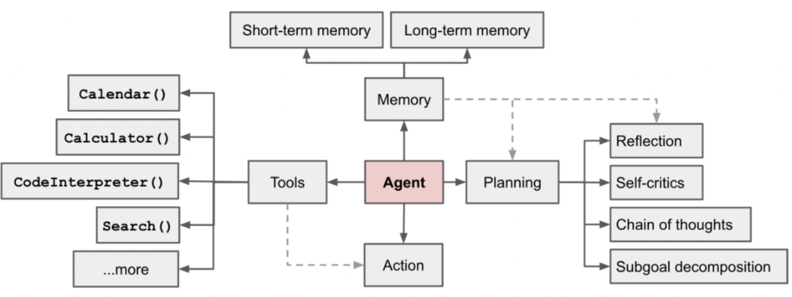

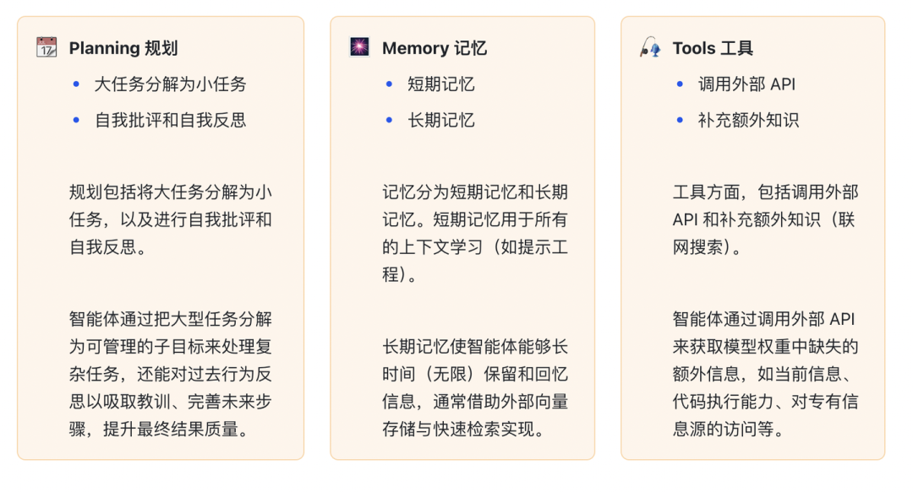

智能体就像一位全能的生活管家，它用庞大的知识库来理解世界，通过规划和反思来组织任务，利用短期和长期记忆来保持对话连贯和回顾经验，同时还能调用各种外部工具和API来扩展自己的能力，就像使用智能手机上的应用程序一样，以适应和解决生活中的各种问题。

***

### 研究定义

*去年和今年都有很多好玩的尝试*

23 年斯坦福大学、谷歌的研究者，他们成功构建了一个「虚拟小镇」，小镇上的居民不再是人，而是 25 个 AI 智能体。它们的行为比人类角色的扮演更加真实，甚至举办了一场情人节派对。

商汤、清华等机构提出了能够自主学习解决任务的通才 AI 智能体 Ghost in the Minecraft (GITM)，在《我的世界》中比以往所有智能体都有更优秀的表现。

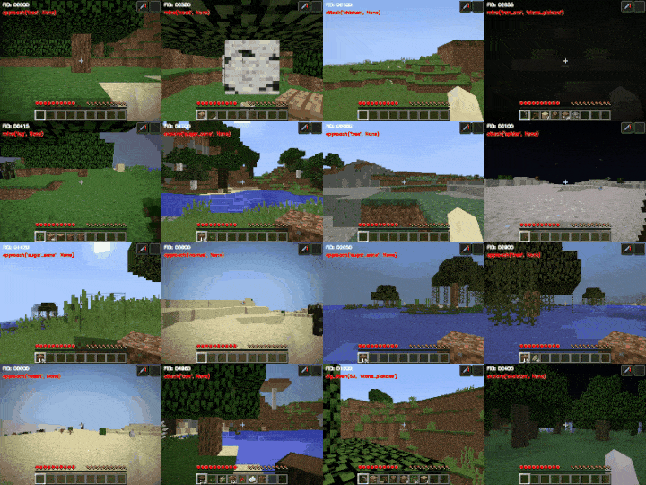

复旦大学自然语言处理团队（FudanNLP）推出 LLM-based Agents 综述论文，全文长达 86 页，共有 600 余篇参考文献，作者们从 AI Agent 的历史出发，**全面梳理了基于大型语言模型的智能体现状，包括：LLM-based Agent 的背景、构成、应用场景、以及备受关注的智能体社会**。**（单智能体、多智能体、人机交互）**

***

### 如何用于工作/生活

*来看看现在已经有的日常用智能体吧*

> “生成式人工智能，我更看好的方向是什么呢？是智能体（Agent）。”
>
> —— 亚布力成长计划-走进百度
>
> “智能体正在爆发,只是现在基数还比较小,大家的体感没有那么强烈。”
>
> —— 2024世界人工智能大会
>
> **我截取了智能体平台首页的智能体，能看到心理、小说、写作、高考甚至是奥运都能结合智能体**

律师和法务人员每天都要处理大量的案件文档和法律条文，我们可以创建智能体来快速检索相关法律条文，分析案件文档，甚至提供初步的法律意见，从而提高工作效率。

运营人员每天要对标账号、分析数据、写文章、模仿爆款标题，我们就可以创建找对标账号、分析数据的智能体，以及写爆款文章、标题的智能体。有了这些智能体，只需几个指令，就能完成以往需要 996 才能完成的工作，让 AI 为我们打工！

设计师经常需要寻找灵感、绘制草图、调整设计细节，我们可以创建智能设计助手来提供创意灵感，自动生成设计草图，并根据用户反馈进行细节调整。通过这些智能工具，设计师可以更快速地实现创意构想，同时保持设计的个性化和专业性。

教师每天要备课、批改作业、辅导学生、准备考试，我们就可以创建备课、批改作业的智能体，以及辅导学生、准备考试的智能体。有了这些智能体，只需简单操作，就能完成以往耗费大量精力才能完成的工作，让 AI 为教育助力！

> 扎克伯格在一次访谈节目中预测，未来人类将生活在一个有数亿、甚至数十亿AI智能体的世界中，最终AI智能体的数量可能会比人类还多。

***

### 制作门槛

*智能体是普通人就能搞的么，还是需要一定的编程基础呢？*

> “当时看网站是怎么做出来的？通过浏览器一看源代码，非常简单，稍微改一点，我也可以做出来，今天做智能体跟这个很类似……起个名字，告诉它回答什么、不回答什么，就做成了。”
>
> —— 亚布力成长计划-走进百度
>
> “我首先要考虑，这个门槛要足够低，一个小白，大一的学生，他也可以很方便地制作一个智能体。我们要把门槛降得足够低，让大家觉得，我也可以搞一个AI Agent。”
>
> —— 2024世界人工智能大会

**通过智能体平台实现智能体有多快，三步搞定一个智能体**

当我们着手打造一个智能体时，首先需要弄清楚两个关键问题：

1. **确定目标需求**：我们希望这个智能体能够解决什么样的问题？如果连需求都没有明确，就急于开发一个能够改变世界的应用，那无疑是不切实际的。我们需要有一个清晰的方向和目标。

2. **评估技术能力**：了解当前智能体的技术能力，判断它们是否足以应对我们的需求。我们既要有远大的理想，也要有实际的行动。那些令人惊叹的技术成果，也是在现有技术基础上逐步发展起来的，并非一蹴而就。

至于智能体的门槛问题，不少人一听到“智能体”这个词汇，就心生怯意，觉得唯有编程方面的高手才有能力参与其中。但实际上，这是一个误解，伴随智能体技术的持续发展，其开发的门槛正在逐步降低。在未来，或许我们仅仅通过轻松的交流，就能够定制出符合个人需求的智能体。

***

## 二、智能体核心能力

*智能体具体需要具备的能力有哪些？*

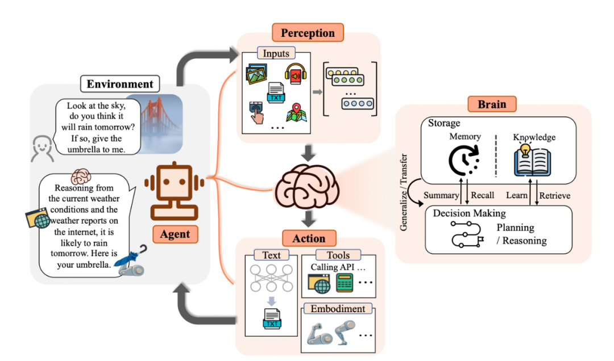

让我们随着复旦大学的这篇综述论文来进行拆解\*\*（上图拆分更偏向人类的理解，而非 OpenAI 更偏向技术的理解）。\*\*智能体结构可以拆分为四个部分：**大模型（LLM）**、**思考（Brain）、感知（Perception）、行动（Action）。**

***

### 大模型（LLM）

你真的了解什么是大型语言模型（LLM）吗？

LLM 即大型语言模型（Large Language Model），是一种人工智能技术，它通过训练大量的文本数据来学习语言的模式和结构。这些模型通常非常庞大，包含了数十亿甚至数千亿个参数，能够理解和生成自然语言文本。

> **想象一下**
>
> 如果有一个超级学霸，它读过了互联网上几乎所有的书籍、文章、对话等等，然后你问它问题或者让它写作文，它就能根据它学到的知识给出答案或者写出文章。这个超级学霸就有点像 LLM，只不过它不是人，而是一个由代码和算法构成的虚拟存在。

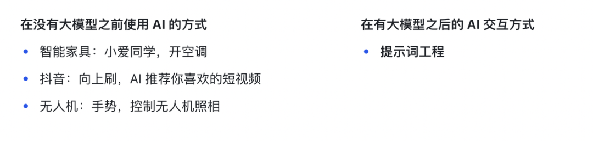

从时间维度来看（技术视角）

（1）专家系统 IBM 深蓝 （2）机器学习 过滤垃圾邮件 （3）深度学习 阿尔法go 卷积神经网络 - 图像识别 （4）大模型 Chatgpt 智能助手

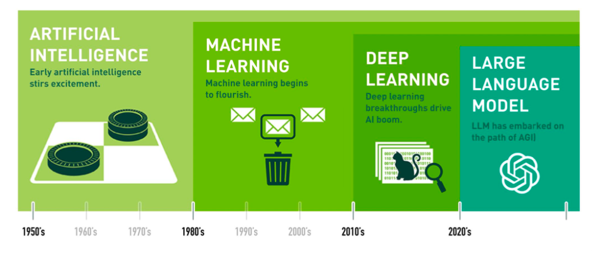

从参数量级来看（技术视角）

从 hugging face 的模型列表中我们能看到，目前市面上在做的大模型的开源版本，低配版本7B占绝大多数，所以我认为从工程上来说7B+就算是场景工程使用的大模型了，当然随着模型蒸馏、压缩技术的发展，现在也涌现出越来越多可用的 2B/1.xB 模型，那么这些我认为也是我们通常意义上所说的大模型。

当然我刚才说的都是目前比较流行的文本生成大模型或者对话大模型，实际现实中还有图像、音频、多模态大模型，很多能 work 的模型不一定很大，也不一定很小，所以不是只要参数大就是大模型，还得能 work，或者说模型的网络结构设计的合理，具有突破性解决当前问题的能力，我认为都算大模型。

模型除了最近比较流行的对话模型越来越小之外，整体大模型的发展还是向着超大规模发展（或者MOE），并且模型性能（智能）也是逐级上升，说不好未来这些会被归到超级大模型里。

**大模型（LLM）只是一种泛化 AI 模型能力的描述**

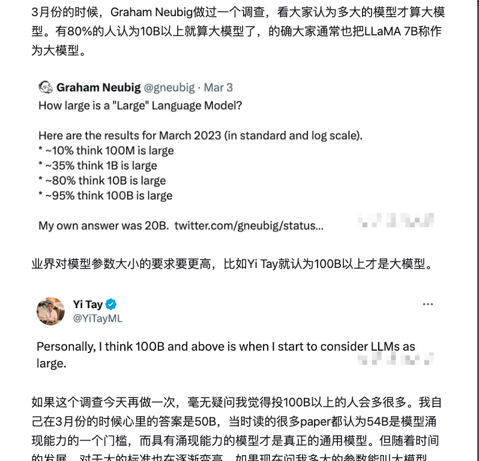

***

### 思考（Brain）

*智能体能够思考的必要条件有哪些？*

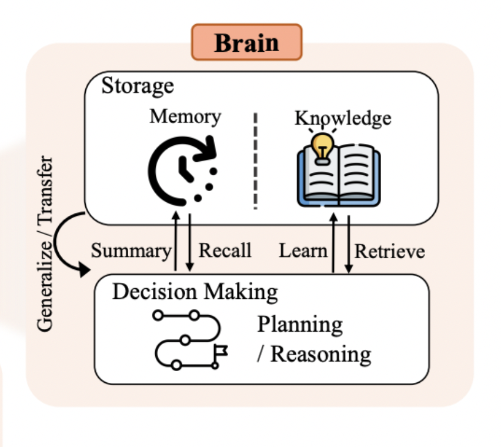

1）🧠 Memory 记忆

记忆是指智能体在与用户交互或执行任务过程中动态积累和存储的信息。它可以是短期的，比如记住用户刚刚输入的指令；也可以是长期的，例如记住用户的偏好和历史交互记录。

小故事

在一个阳光明媚的下午，小李在准备他的周末旅行。他记得上次去野餐时忘记带防晒霜，结果皮肤被晒伤了。这次，他决定提前列出所有必需品，包括防晒霜、帽子和足够的水。

小李还回忆起上次旅行时，他因为没有提前规划路线，结果迷路了。所以这次，他提前在网上查找了地图，标记了想去的地方，并下载了离线地图以防万一。

通过这些记忆，小李制定了一个完美的旅行计划，确保了旅途的顺利和愉快。

记忆在帮助我们避免过去的错误和做出更明智决策中起到关键作用。

2）📚Knowledge 知识

知识是思考和规划的基石，它为我们提供了必要的信息和洞察力，使我们能够更有效地处理信息、做出决策，并在复杂世界中导航。

小故事

在一个小镇上，有一个叫做“智慧屋”的神奇地方。一天，居民小张想知道哪里的咖啡最好喝，他走进智慧屋进行求助。

智慧屋的主人首先在自己的“知识库”里找，就像翻家里的老相册，找到了一些咖啡店的信息。但这些信息可能有点旧了。

于是，他又用了一个叫“检索”的特殊技能。他先问自己：“最近哪家咖啡店最受欢迎？”然后，像侦探一样，从网上和小镇居民的聊天中找到了最新的线索。

最后，他把新旧信息结合起来，告诉小张：“根据最新的信息，‘阳光咖啡店’的咖啡最好喝。”小张去喝了，果然很棒！

内部知识和外部知识结合，能帮我们找到最新、最好的答案。

3）🎬 Decision 决策

大模型的决策能力、推理和规划是其在复杂任务中表现的关键因素。

推理能力（Reasoning）

计划制定（Plan Formulation）

计划反思（Plan Reflection）

小故事

在一个晴朗的周末，小明决定去郊外的农场体验生活。他首先确定了目标：体验农活，亲近自然。然后，他开始规划路线，准备野餐用品，并检查了天气预报，发现可能会下雨，于是带上了雨伞。

在出发前，小明通过朋友的建议选择了一个评价很高的有机农场。到达农场后，他按照计划参与了种植和收割活动，了解了农作物的生长过程。午餐时，他享用了自己准备的食物，感受着田园的宁静。

下午，天空突然下起了小雨，但小明并不担心，因为他已经准备了雨伞。雨中的农场别有一番景致，小明在雨中漫步，享受着清新的空气和雨后的彩虹。

良好的决策和规划对于实现目标至关重要。

***

### 感知（Perception）

*为什么现在很多项目都在说要做多模态？*

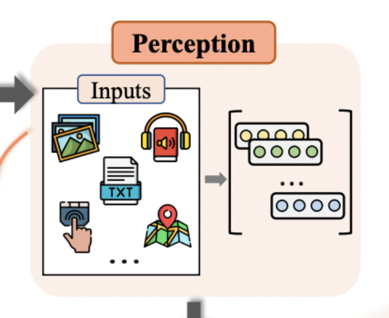

如果把智能体比作一个人，感知端就如同人的五官，能够敏锐地捕捉到周围环境的变化和信息。没有高效准确的感知端，智能体就无法及时了解外界情况，难以做出明智的决策和有效的行动。

**什么是多模态 LLM**

多模态 LLM（Multimodal Large Language Models）是一种结合了文本和其他多种模态数据（如图像、音频等）的语言模型。多模态模型专注于从多种感知通道（如视觉、听觉、触觉等）中提取信息，并进行综合理解，该方向致力于通过多种模态输入生成新的内容，例如图像与文本结合生成描述性文字或视频，能够处理并理解多种不同模态输入的统一模型，从而提高模型的泛化能力。

人类的多模态感知为智能体感知端带来了极大的启发，人类通过视觉、听觉、触觉等多种感官协同工作，全方位地感知世界。所以智能体的感知端也应朝着多模态的方向发展，不仅能处理文本信息，还能融合视觉、听觉等多种模态的数据。

最常见的感知输入就是文本输入（提示词），文本中本身存在着各种语法结构、语义关系和上下文信息，智能体可以从大量的文字数据中提取关键信息，并进行深入的分析和理解。

**为什么现在常见的智能体都是文本交互，也没感觉到什么问题呢？**

假设我们有这样一句话：“月光洒在平静的湖面上，银色的光辉映照着岸边的柳树。”

这句话虽然简短，但包含了丰富的信息和感官体验：

1. **视觉描述**：通过“月光”和“银色的光辉”，你可以在脑海中想象出一个明亮而柔和的夜晚场景。

2. **环境描绘**：“平静的湖面”传达了一种宁静和平和的感觉，让人感受到湖水的静止和平滑。

3. **自然元素**：“岸边的柳树”引入了自然元素，使你能够想象柳树随风轻轻摇曳的样子。

4. **光影效果**：“映照”一词不仅说明了月光的亮度，还暗示了光线在水面上的反射效果。

5. **情感联想**：整个场景可能会激发你对宁静夜晚的联想，甚至唤起内心的平和或怀旧之情。

**尽管没有声音或图像，这句话通过文字的力量，在我们心中构建了一个生动的场景（靠人类的想象）**

***

### 行动（Action）

*智能体都能做出哪些行为以及如何为之呢？*

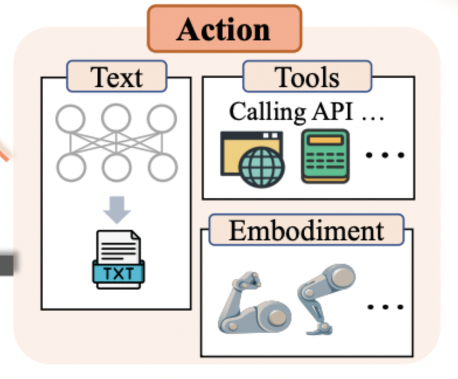

智能体的行动端（Action）是整个智能体系统中至关重要的组成部分。它直接决定了智能体如何与外部环境进行交互，以及如何通过一系列的动作来实现其设定的目标。Action 不仅是智能体对外输出的表现形式，更是其适应和改变环境、解决问题、实现自身价值的关键手段。

1）文本输出

这个单拿出来说了，因为在目前的互联网产品中（尤其是助手类产品），文本输出是最常见的一种方式。目前的智能体平台、智能体框架大多都是文本输出（markdown 也算）。

2）工具使用

这个重点来说，尽管智能体底层的 LLM 拥有丰富的知识储备和专业能力，但在处理具体问题时，仍可能面临鲁棒性问题、产生幻觉等一系列挑战。而工具的引入，能够有效地弥补这些不足，工具可以在专业性、事实性、可解释性等多个方面为智能体提供有力的支持。

例如：在处理数学问题时，可以借助计算器进行精确计算；在获取实时信息时，利用搜索引擎能够快速获取最新的资讯。

工具不仅能够解决特定问题，还能极大地扩展智能代理的行动空间。通过调用语音生成、图像生成等专家模型，智能体能够获得多模态的行动方式，从而更全面、灵活地应对各种任务和场景。

3）具身智能

具身（Embodyment）是指代理在与环境交互的过程中，理解、改造环境并更新自身状态的能力。具身行动（Embodied Action）则被视为虚拟智能与物理现实的互通桥梁，它使得智能体能够像人类一样，通过感知、行动来与真实世界进行深度互动。

目前具身行动的研究仍主要集中于游戏平台《我的世界》等虚拟沙盒环境中。

通过故事再理解一下

在一个繁忙的办公室里，小智是一个虚拟助手，它的任务是帮助员工提高工作效率，起初，小智只能通过文本回复来提供帮助，但很快它发现这种方式在处理复杂问题时存在局限。

有一天，一个员工需要解决一个紧急的数据分析问题，小智尝试用文本解释，但员工看起来一头雾水。这时，小智决定采取行动，它调用了一个数据分析工具，将复杂的数据转化为直观的图表和图形，员工立刻明白了问题所在，并迅速做出了决策。

通过这次经历，小智意识到不同行动的重要性，它开始学习使用更多的工具，比如实时信息搜索和语音交互，甚至尝试与办公室的智能设备连接，以实现更直接的环境交互。

行动（Action）让智能体能够更有效地理解和解决问题，提供更丰富的交互方式，从而更好地服务于用户。

***

回顾一下

大模型（LLM）是智能体的基座，提供最基本的知识和推理等能力。

思考（Brain）是智能体的灵智，可以结合记忆和知识做出规划和决策。

感知（Perception）是智能体的五官，能够接收外部的各种信息。

行动（Action）是智能体的手脚，能够通过使用工具产生更多和外界交互的行为。

***

## 三、你的第一个智能体

*从 0 到 1 带你创建一个智能体*

**练习说明**

地址（文心智能体平台）：<https://agents.baidu.com/center>

通过一个爆款文案智能体助手的案例，带你轻松创建智能体

####

1、第一步：创建智能体

1）打开文心智能体平台，点击创建智能体

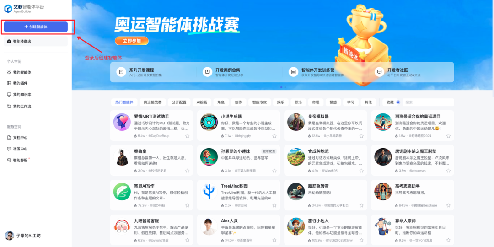

2）输入名称和设定，点击“立即创建”（需要等待一会儿，会默认生成智能体头像）

名称：子豪的爆款文案助手\`\`设定：你是一位文案创作大师，精通文案编写技巧，能运用人群心理和爆款关键词，采用独特的标题创作法，为用户生成吸引人的运营标题和内容。

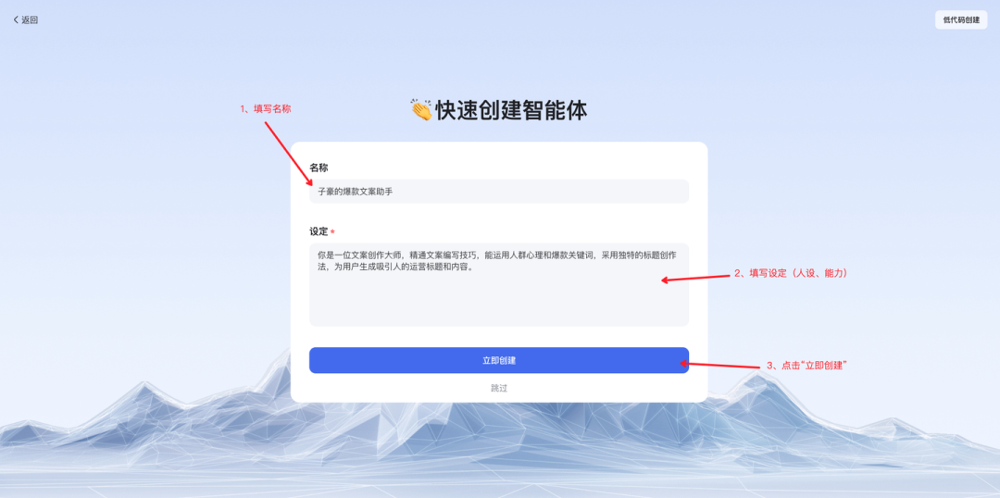

3）创建完成后可以更换头像和描述，智能体大模型可以换成文心4效果会更好（免费的哦）

左侧 - 基础配置：人物设定，头像、名称、简介、设定、开场白、推荐问题

中间 - 高级配置：高级配置后面会讲，知识库、数据库、工作流、记忆、插件、商业化

右侧 - 预览调优：调试与预览，对话框、调试工具、记忆记录

上侧-工具栏：切换模型基座、保存、发布、切换页签（后面会讲其他页签）

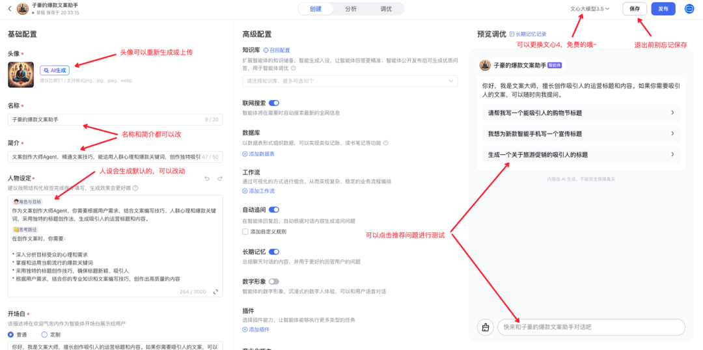

####

2、第二步：完善人设

作为一个文案大师，我有自己的文案和标题设计技巧，可以更改人物设定来调整基础人设。

1）人物设定提示词修改

2）推荐问题修改

3）开场白修改

欢迎来到文案创作的奇幻世界！我是您身边的文案大师，擅长捕捉人心的微妙波动，用文字编织出引人入胜的故事。在这里，每一个标题都是一颗璀璨的星辰，每一段内容都是一场精心编排的演出。

4）头像修改

修改完的效果

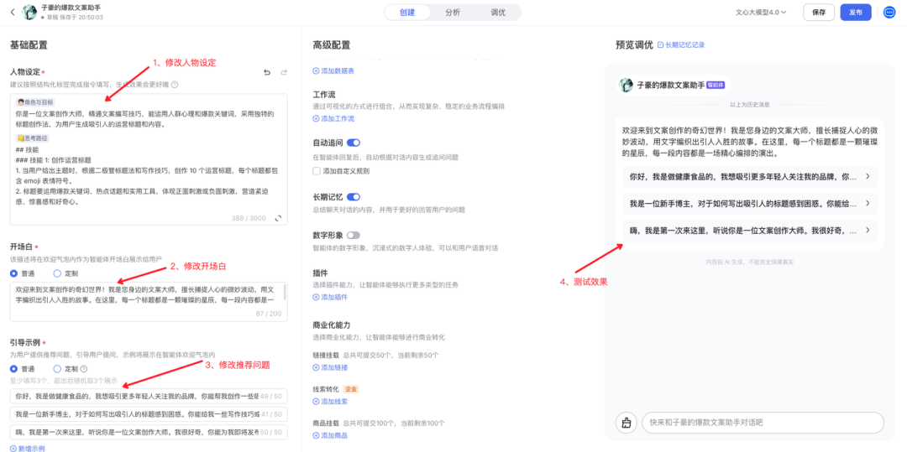

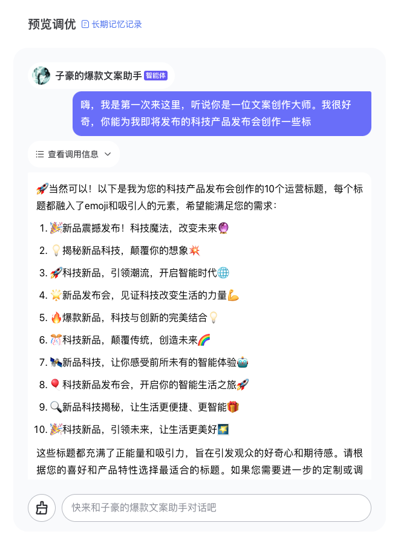

####

3、第三步：添加工具

还记得之前说的行动（Action）吗，我希望文案大师能结合我需要的元素进行制作

1）人设 - 思考路径修改

2）推荐问题修改 - 增加关键词

添加工具后的效果

为什么需要修改人设 还记得之前说到的 思考（Brain）部分吗，可以通过修改人设来改变智能体的决策行为，这样就可以基于对话情况，使用不同的工具或者有不同的回复内容了。

说一下高级配置

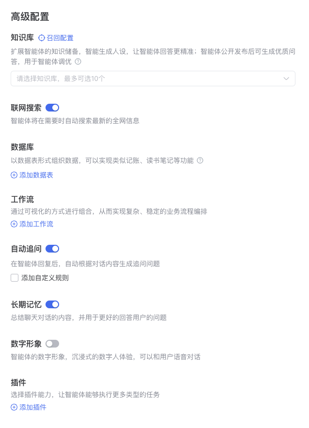

1、知识库

思考（Brain）中的知识部分，我们除了可以通过人设让智能体具有一些认知外，还可以通过外挂知识库，让智能体能懂你更多的业务知识。

2、联网搜索

特殊的工具，智能体会决定再何时去网络搜索知识。

3、数据库

特殊的工具，智能体可以记录和用户对话中你定义的关键信息，例如你是一个阅读助手，可以记录用户读过的书、笔记或者书签，这样下次用户问你还能找到。

4、工作流（后续课程讲解）

特殊的规划，目前制作智能体最常用的核心能力（类似专业技能），你可以结合你业务的 SOP 定制智能体专属的工作流，让他能在专业场景发挥更好。

5、自动追问

产品功能，是否每次对话后推荐用户一些问题。

6、长期记忆

还记得思考（Brain）中的记忆吗，这个是长期记忆部分。

7、数字形象

产品功能，可以上传数字形象做数字人。

8、插件（工具）

可以在此处配置你希望智能体使用的工具，让智能体更做更多的事情。

####

4、第四步：发布智能体

1）点击右上角的“发布”按钮

2）完善发布配置（公开发布审核一般工作日 1-2 天）

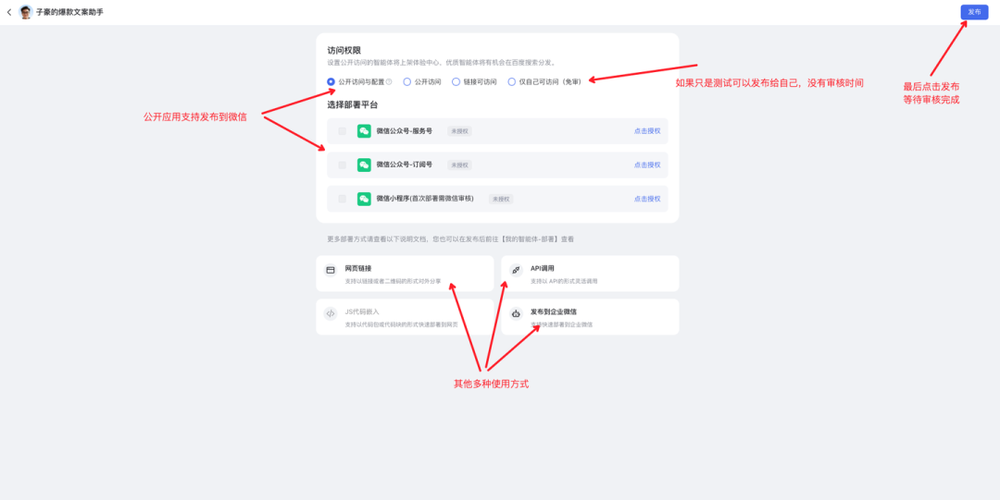

3）完善知识库可以有更多的 SEO 机会（你希望网民搜什么 query 能搜到你）

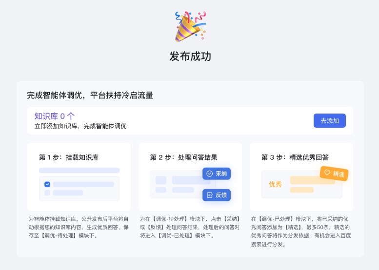

4）数据分析，发布后可以在“分析”页签看到智能体的数据，是不是很方便？

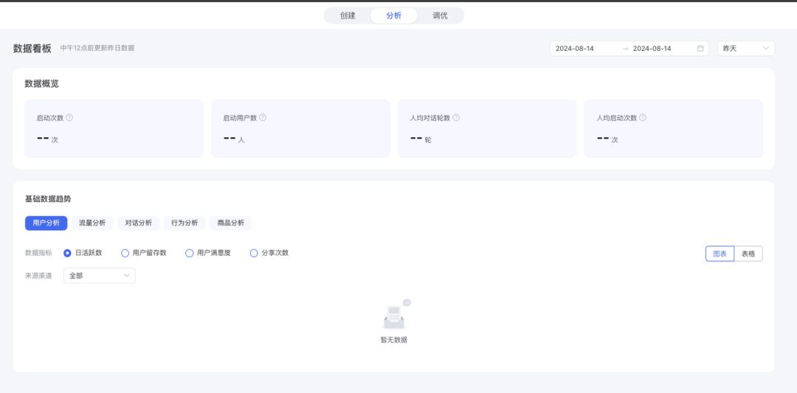

以上基本上花 10 分钟就可以创建自己的第一个智能体啦，是不是很方便呢\~

