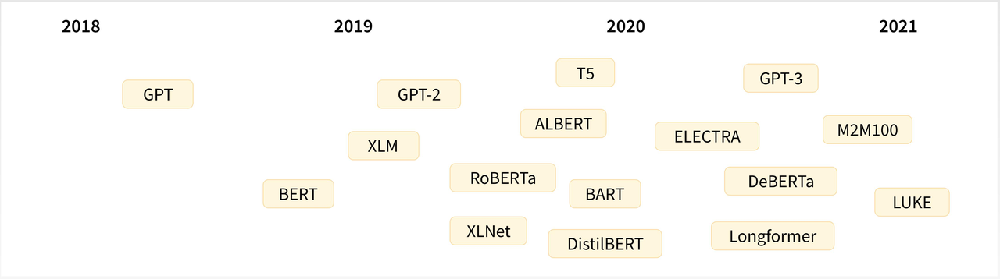
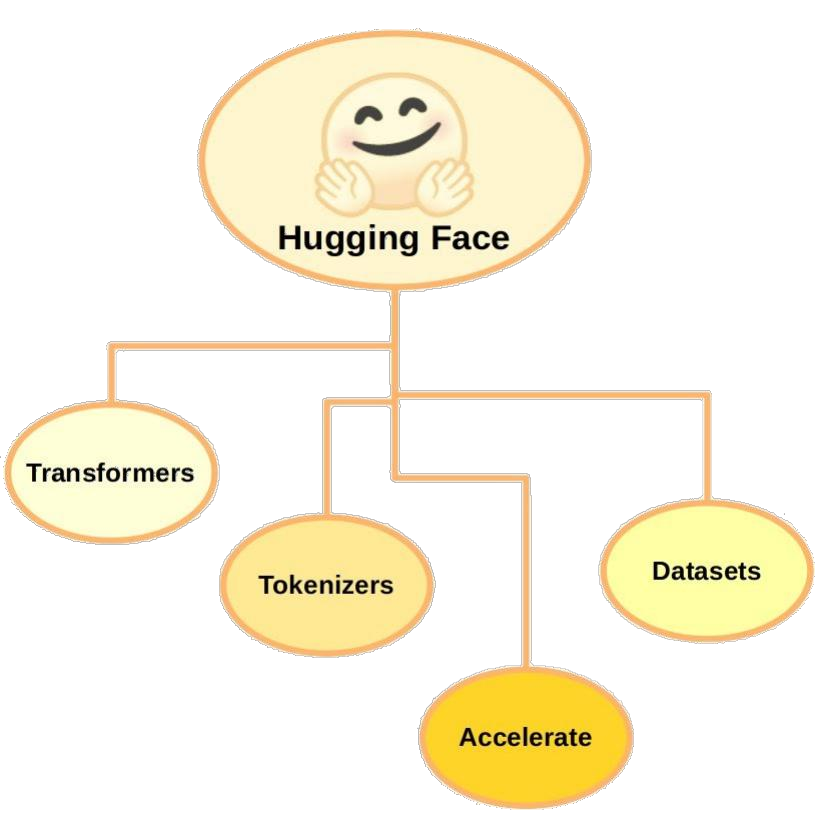

**Hugging Face常见问题**

1. 什么是 Hugging Face？它的目标是什么？

2. Hugging Face 中包含哪些知名的预训练模型?

3. 如果我们要在 Hugging Face 中下载 BERT，那么

   1. 只有一种版本，还是有多种版本可以选择？

   2. 每一种版本的 BERT 中，只有一种格式还是有多种格式可以适应多种下游任务？

4. Hugging Face 库中有哪些有用的组件？

## **一、Hugging Face 简介**

官网：[https://huggingface.co/](https://huggingface.co/)

Hugging Face 是一个开源的 AI 社区网站，站内几乎囊括了所有常见的 AI 开源模型，号称：一网打尽，应有尽有，全部开源。

在 Hugging Face 中可以下载到众多开源的预训练大模型，模型本身包含相关信息和参数，可以拿来做微调和重新训练，非常方便。

## **二、Hugging Face 核心组件**

Hugging Face 核心组件包括 **Transformers、Dataset、Tokenizer**，此外还有一些辅助工具，如 **Accelerate**，用于加速深度学习训练过程。

更多内容可以去 Hugging Face 官网上发掘，下面重点介绍下它的三个核心组件。

### **1、Hugging Face Transformers**

Transformers 是 Hugging Face 的核心组件，主要用于自然语言处理，提供了预训练的语言模型和相关工具，使得研究者和工程师能够轻松的训练和使用海量的 NLP 模型。

常用的模型包括 BERT、GPT、XLNet、RoBERTa 等，并提供了模型的各种版本。

通过 Transformers 库，开发人员可以用这些预训练模型进行文本分类、命名实体识别、机器翻译、问答系统等 NLP 任务。

Transformers 库本身还提供方便的 API、实例代码、文档，让开发者学习和使用这些模型都变得非常简单，同时开发者也可以上传自己的预训练模型和 API。

### **2、Hugging Face Dataset**

Dataset 是 Hugging Face 的公共数据集仓库，以下是常用的一些数据集（欢迎补充）：

1. SQuAD：Stanford 大学发布的问答数据集

2. IMBDB：电影评论数据集

3. CoNLL-2003：NER 命名实体识别数据集

4. GLUE：公共基准测试集

Hugging Face Dataset 简化了数据集的下载、预处理过程，并具备数据集分割、采样和迭代器等功能。

### **3、Hugging Face Tokenizer**

Tokenizer 是 Hugging Face 的分词器，它的任务是将输入文本转换为一个个标记（tokens），它还能对文本序列进行清洗、截断和填充等预处理，以满足模型的输入要求。它的主要功能是将文本分解为更小的单元（通常是词或子词），并将这些单元映射到数值表示。

以下是分词器的简单解释：

1. **文本分割**：分词器首先将输入的文本分割成更小的单元。例如，对于句子 "I love NLP"，分词器可能会将其分割为 `["I", "love", "NLP"]`。

2. **词汇映射**：分词器会将每个单元映射到一个唯一的数值索引，这些索引通常来自一个预定义的词汇表。例如，假设词汇表中 "I" 的索引是 1，"love" 的索引是 2，"NLP" 的索引是 3，那么分词器会将句子转换为 `[1, 2, 3]`。

3. **处理特殊标记**：分词器还会处理一些特殊的标记，比如句子开头的 `[CLS]` 标记和句子结尾的 `[SEP]` 标记，这些标记在某些模型中是必需的。

4. **填充和截断**：为了使输入的长度一致，分词器可以对较短的序列进行填充（添加特殊的填充标记）或对较长的序列进行截断。

通过这些步骤，分词器将文本转换为模型可以理解的数值格式，使得模型能够进行进一步的处理和预测。希望这个解释能帮助你理解分词器的作用！

#### **张量概念**

在机器学习和深度学习中，"张量"（Tensor）是一个多维数组的通用术语。它是数据的基本结构，类似于标量、向量和矩阵，但可以扩展到更高的维度。

以下是张量的简单解释：

1. **标量（0维张量）**：一个单一的数值。例如，`3` 或 `-1.5`。

2. **向量（1维张量）**：一组有序的数值。例如，`[1, 2, 3]`。

3. **矩阵（2维张量）**：一个二维数组。例如：

4) **高维张量（3维及以上）**：可以想象成多层的矩阵。例如，一个3维张量可以是一个矩阵的集合。

在你的代码中，`inputs` 是一个张量，它是通过分词器将文本数据转换为模型可以理解的格式。这个张量通常是一个二维的，形状为 `[batch_size, sequence_length]`，其中 `batch_size` 是批处理的样本数量，`sequence_length` 是每个样本的最大长度。这个张量包含了文本的数值化表示，通常是词汇表中每个词的索引。

通过这种方式，模型可以处理文本数据并进行预测。

#### **\[CLS]** **\[SEP]标记作用**

在一些自然语言处理模型（如BERT）中，特殊标记 `[CLS]` 和 `[SEP]` 被用来帮助模型理解输入的结构和上下文。以下是它们的作用和简单解释：

1. `[CLS]`\*\* 标记\*\*：

\[CLS] 的英文全称是 "Classification"。在中文中，它通常被翻译为“分类”。这个标记在模型中用于表示整个输入序列的聚合信息，特别是在分类任务中。

2. `[SEP]`\*\* 标记\*\*：

\[SEP] 的英文全称是 "Separator"。在中文中，它通常被翻译为“分隔符”。这个标记用于分隔不同的句子或段落，帮助模型理解句子之间的边界。

通过使用这些特殊标记，模型能够更好地理解输入的结构和上下文，从而提高处理和预测的准确性。

## **三、Hugging Face 应用实战**

该应用实战是通过 Hugging Face Transformers 完成一个很简单的文本分类任务（预测影评是正面还是负面），完整代码如下：

注意：要运行代码，需要安装最新的 pytorch 、transformers 和 datasets。

将代码文件保存为：huggingface.py，运行后结果如下（第一次运行需要从 Hugging Face 上下载数据集和模型，需要一点时间）：

该实战主要演示如何使用 HuggingFace，预测结果并不是那么准确（准确率 50%），因为模型本身还未做过电影评论相关的微调。

Hugging Face 也提醒我们，可能需要用一些下游任务重新训练这个模型（即微调），再用它来做预测和推理：You should probably TRAIN this model on a down-stream task to be able to use it for predictions and inference。

## **四、总结**

Hugging Face 是当前最知名的 Transformer 工具库和 AI 开源模型网站，它的目标是让人们更方便地使用和开发 AI 模型。

1. 什么是 Hugging Face？它的目标是什么？

   * Hugging Face Hugging Face 是一个 AI 社区网站，站内几乎囊括了所有的 AI 开源模型。Hugging Face 是当前最知名的 Transformer 工具库和 AI 开源模型网站，它的目标是让人们更方便地使用和开发 AI 模型。

2. Hugging Face 中包含哪些知名的预训练模型?

   * 如 BERT、GPT、XLNet、RoBERTa

3. 如果我要在 Hugging Face 中下载 BERT，那么

   * 只有一种版本，还是有多种版本可以选择？

     * 多版本

   * 每一种版本的 BERT 中，只有一种格式还是有多种格式可以适应多种下游任务？

     * 多种格式

4. Hugging Face 库中有哪些有用的组件？

   * 核心组件包括：Transformers、Dataset、Tokenizer，此外还有一些辅助工具，如 Accelerate 等
